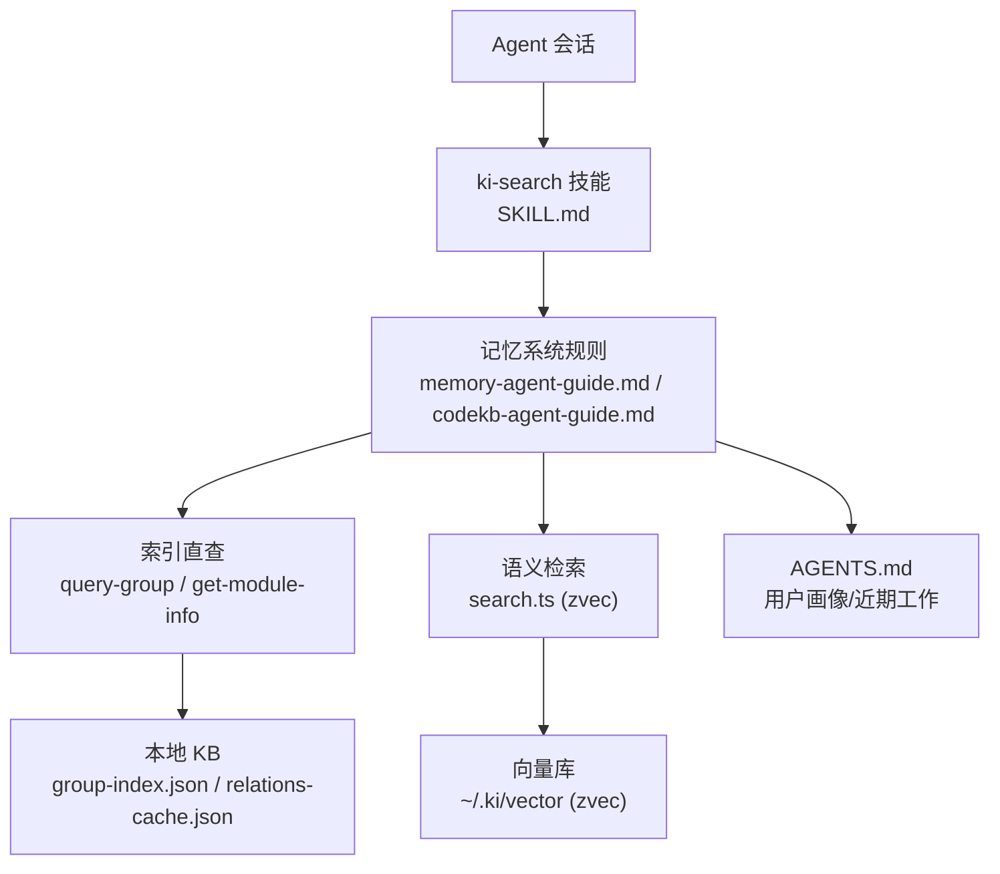
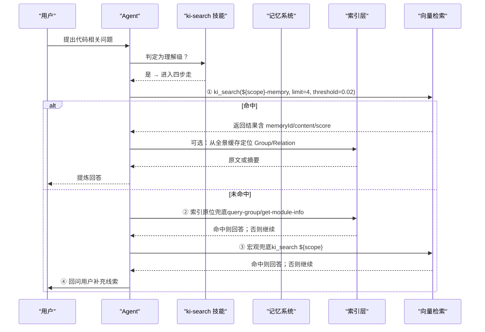
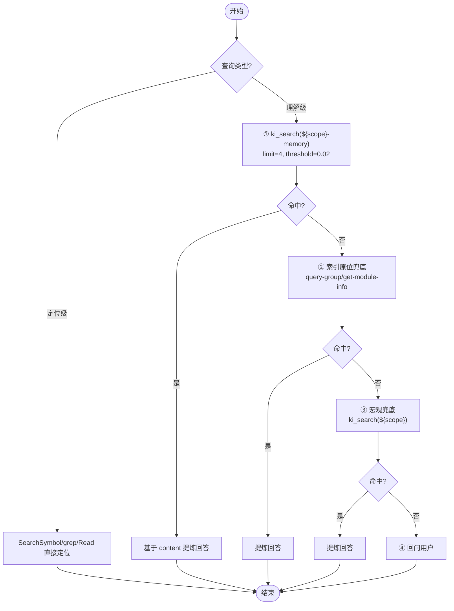
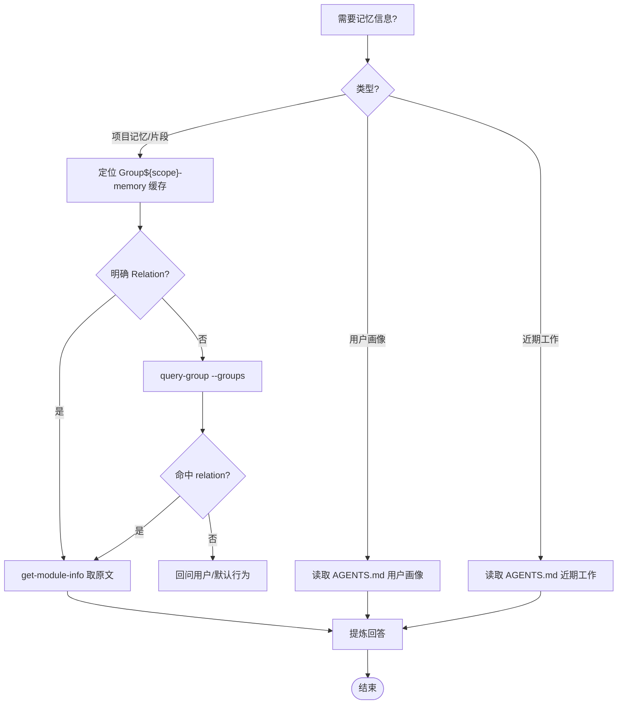
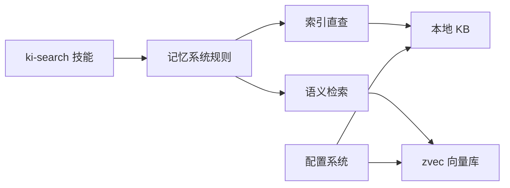

# AI Agent技能

<cite>
**本文引用的文件**
- [skills/ki-search/SKILL.md](file://skills/ki-search/SKILL.md)
- [memories/ki-search-usage.md](file://memories/ki-search-usage.md)
- [memories/memory-storage-strategy.md](file://memories/memory-storage-strategy.md)
- [docs/memory-agent-guide.md](file://docs/memory-agent-guide.md)
- [docs/codekb-agent-guide.md](file://docs/codekb-agent-guide.md)
- [src/search.ts](file://src/search.ts)
- [src/config.ts](file://src/config.ts)
- [README.md](file://README.md)
</cite>

## 目录
1. [简介](#简介)
2. [项目结构](#项目结构)
3. [核心组件](#核心组件)
4. [架构总览](#架构总览)
5. [详细组件分析](#详细组件分析)
6. [依赖关系分析](#依赖关系分析)
7. [性能考虑](#性能考虑)
8. [故障排查指南](#故障排查指南)
9. [结论](#结论)
10. [附录](#附录)

## 简介
本文件面向使用与开发 AI Agent 技能的工程师，聚焦 ki-search 技能的使用方法与最佳实践，覆盖四步走查询策略、白名单/黑名单配置、记忆系统行为控制（自动沉淀、查询优化、归档策略）、代码片段记忆与禁忌规则、Agent Skill 的开发规范与发布流程，并提供实际集成示例与调试方法、性能优化与故障排查建议。

## 项目结构
围绕“知识索引 + 语义检索 + 结构化索引”的体系，本项目提供：
- 技能定义：skills/ki-search/SKILL.md 描述 Agent 的行为规则与调用约定
- 记忆系统行为规则：docs/memory-agent-guide.md 与 docs/codekb-agent-guide.md 分别约束“项目记忆/代码片段”和“代码知识库”的读写边界与流程
- 向量检索实现：src/search.ts 提供语义检索能力（zvec 混合检索）
- 配置管理：src/config.ts 生成并维护 ~/.ki/config.yaml（数据目录、向量目录、Embedding 等）
- 快速开始与 MCP 接入：README.md 提供安装、初始化、导入、启动 MCP HTTP 模式及工具清单

图表来源
- [skills/ki-search/SKILL.md:1-198](file://skills/ki-search/SKILL.md#L1-L198)
- [docs/memory-agent-guide.md:1-530](file://docs/memory-agent-guide.md#L1-L530)
- [docs/codekb-agent-guide.md:1-478](file://docs/codekb-agent-guide.md#L1-L478)
- [src/search.ts:1-248](file://src/search.ts#L1-L248)
- [src/config.ts:1-204](file://src/config.ts#L1-L204)
- [README.md:1-411](file://README.md#L1-L411)

章节来源
- [README.md:1-411](file://README.md#L1-L411)

## 核心组件
- ki-search 技能：定义 Agent 在代码相关问题上的决策路径（定位级 vs 理解级）、四步走查询、写入白名单/黑名单、禁忌清单、数据存储位置等
- 记忆系统：区分“项目记忆/代码片段”（${scope}-memory）与“用户画像/近期工作”（AGENTS.md），规定自动沉淀、查询三步走、归档机制
- 语义检索：基于 zvec 的混合检索（语义+BM25+RRF），支持标签过滤、原文召回、去重与降级
- 配置系统：统一默认数据目录、向量目录、Embedding 提供方与 scope 护栏

章节来源
- [skills/ki-search/SKILL.md:1-198](file://skills/ki-search/SKILL.md#L1-L198)
- [docs/memory-agent-guide.md:1-530](file://docs/memory-agent-guide.md#L1-L530)
- [docs/codekb-agent-guide.md:1-478](file://docs/codekb-agent-guide.md#L1-L478)
- [src/search.ts:1-248](file://src/search.ts#L1-L248)
- [src/config.ts:1-204](file://src/config.ts#L1-L204)

## 架构总览
ki-search 技能驱动 Agent 在“理解级”问题中优先进行语义检索（${scope}-memory），未命中时回退到索引原位与宏观兜底；同时记忆系统负责跨会话沉淀与归档，确保长期可检索。

图表来源
- [skills/ki-search/SKILL.md:24-113](file://skills/ki-search/SKILL.md#L24-L113)
- [docs/codekb-agent-guide.md:128-263](file://docs/codekb-agent-guide.md#L128-L263)
- [src/search.ts:70-199](file://src/search.ts#L70-L199)

## 详细组件分析

### ki-search 技能：四步走查询与写入策略
- 四步走（理解级）：
  - ① 语义检索优先：ki_search(${scope}-memory, limit=4, threshold=0.02)，按 tags 过滤（ki-search/ki-path/ki-relation）
  - ② 索引原位兜底：通过 query-group/get-module-info 取 Group 热区与原文
  - ③ 宏观兜底：ki_search(${scope}) 作为最后手段
  - ④ 回问用户：知识库无相关信息时请求补充
- 写入策略：
  - 白名单（8类）：模块职责、API接口、架构约束、通用约定、bug模式与排查、重构策略、依赖版本约束、测试策略
  - 黑名单（6类）：用户喜好、项目记忆/进度、个人信息、一次性诊断、临时偏好、会话短期上下文
  - 单条/批量写入：1~2 条用 sync-relation；≥3 条推荐分批（每批 ≤5 条）调用 ki_bulk_sync_relation
- 禁忌清单：包括 ${scope} 字面量禁止执行、tags 必须正确、超长 module-info 拆分、跨 scope 串数据、未经用户授权修改 ${scope} 等

图表来源
- [skills/ki-search/SKILL.md:24-113](file://skills/ki-search/SKILL.md#L24-L113)
- [docs/codekb-agent-guide.md:128-263](file://docs/codekb-agent-guide.md#L128-L263)

章节来源
- [skills/ki-search/SKILL.md:1-198](file://skills/ki-search/SKILL.md#L1-L198)
- [docs/codekb-agent-guide.md:1-478](file://docs/codekb-agent-guide.md#L1-L478)

### 记忆系统：自动沉淀、查询优化与归档
- 存储边界：
  - 项目记忆/代码片段：${scope}-memory（经 ki 管理）
  - 用户画像/近期工作：AGENTS.md（不经 ki）
- 自动沉淀触发：
  - 项目信息、踩坑经验、代码要点 → 写入 ${scope}-memory
  - 需求/进度 → 更新 AGENTS.md“近期工作”
  - 用户偏好 → 更新 AGENTS.md“用户画像”
- 查询三步走：
  - ① 定位目标 Group（从全景缓存）
  - ② 查热门+新兴热区（hot,emerging）
  - ③ 取原文（get-module-info），提炼回答
- 归档策略：
  - 近期工作（最近需求/已完成进度）保留最近 7 天，超期移入 archive.md
  - 当前状态超过 30 天标记过期并归档
  - 其他 Group（含代码片段）永久保留

图表来源
- [docs/memory-agent-guide.md:127-234](file://docs/memory-agent-guide.md#L127-L234)
- [docs/memory-agent-guide.md:236-387](file://docs/memory-agent-guide.md#L236-L387)

章节来源
- [docs/memory-agent-guide.md:1-530](file://docs/memory-agent-guide.md#L1-L530)
- [memories/memory-storage-strategy.md:1-14](file://memories/memory-storage-strategy.md#L1-L14)

### 代码片段记忆与禁忌规则
- 代码片段记忆：
  - 归入工具库/通用记忆片段/关键逻辑等 Group
  - 写入前检查同名片段是否存在，存在则更新而非追加
  - 内容过长需拆分或使用 scan-kb import 自动切分
- 禁忌规则（记忆系统）：
  - 不得将代码知识（模块/API/设计）写入记忆系统 scope
  - 不得将项目上下文写入代码知识库 scope
  - 不得删除过期条目（应归档至 archive.md）
  - 不得把用户偏好写入 ki scope（应存 AGENTS.md 用户画像）
  - 不得把需求/进度写入 ki scope（应存 AGENTS.md 近期工作）
  - 代码片段内容过长或写入无意义片段

章节来源
- [docs/memory-agent-guide.md:236-442](file://docs/memory-agent-guide.md#L236-L442)

### 搜索实现与参数约定
- 语义检索：
  - 支持 tags 过滤（ki-search/ki-relation/ki-path），默认搜索全部并按优先级合并
  - 支持 includeOriginal 获取 local KB 文件级原文，多 chunk 命中去重
  - 失败降级：原文不可用时以向量文档内容兜底并提示
- CLI/MCP 参数：
  - limit、threshold、tags、includeOriginal 等
  - 向量服务可用性检测与错误处理

章节来源
- [src/search.ts:1-248](file://src/search.ts#L1-L248)

### 配置系统与默认路径
- 配置模板：
  - dataDir、backupDir、vectorDir、embedding.provider/model/dimension/apiKey
  - scopeMode（default/strict）
- 默认路径：
  - 默认数据目录 $HOME/.ki/kb，备份 $HOME/.ki/backup，向量 $HOME/.ki/vector
  - KI_DATA_DIR 仅 init 时生效，运行时不读环境变量回退

章节来源
- [src/config.ts:1-204](file://src/config.ts#L1-L204)

## 依赖关系分析
- 技能与规则：
  - ki-search 技能依赖记忆系统规则（memory-agent-guide/codekb-agent-guide）来界定写入与查询边界
- 检索与存储：
  - search.ts 依赖 zvec 引擎与本地 KB（group-index.json/relations-cache.json）
  - 配置系统提供数据与向量目录、Embedding 配置
- 外部集成：
  - README 提供 MCP HTTP 模式与 Web 前端，便于调试与可视化

图表来源
- [skills/ki-search/SKILL.md:1-198](file://skills/ki-search/SKILL.md#L1-L198)
- [docs/memory-agent-guide.md:1-530](file://docs/memory-agent-guide.md#L1-L530)
- [docs/codekb-agent-guide.md:1-478](file://docs/codekb-agent-guide.md#L1-L478)
- [src/search.ts:1-248](file://src/search.ts#L1-L248)
- [src/config.ts:1-204](file://src/config.ts#L1-L204)

章节来源
- [README.md:1-411](file://README.md#L1-L411)

## 性能考虑
- 语义检索优化：
  - 使用 tags 过滤提升准确率（ki-search 内容优先）
  - 合理设置 limit 与 threshold，避免低相似度噪声
  - 原文召回按需开启（includeOriginal），减少不必要 IO
- 批量写入优化：
  - ≥3 条使用 ki_bulk_sync_relation，分批调用（每批 ≤5 条）降低组织成本与失败重试范围
- 索引与缓存：
  - 首次拉取全景后缓存有效，写入后刷新
  - 热门+新兴热区优先命中，减少全文扫描
- 向量服务可用性：
  - 检索前检测向量服务，失败时给出降级提示

章节来源
- [skills/ki-search/SKILL.md:74-161](file://skills/ki-search/SKILL.md#L74-L161)
- [src/search.ts:70-199](file://src/search.ts#L70-L199)
- [docs/memory-agent-guide.md:127-234](file://docs/memory-agent-guide.md#L127-L234)

## 故障排查指南
- 常见问题：
  - 向量服务不可用：检查 embedding 配置与网络连通性
  - 原文不可用：确认 local KB 是否包含对应 relation，必要时 rebuild-vector
  - 权限问题：HTTP 模式下 Token 授权 scope 不足导致 403
  - 进程锁冲突：多实例共享向量库时的撞锁重试与空闲释放
- 排查步骤：
  - 使用 ki doctor 校验配置与 API 密钥
  - 查看 ki mcp --status 确认服务状态与绑定地址
  - 检查 group-index.json/relations-cache.json 一致性
  - 对批量导入使用幂等追加，重复执行即增量更新

章节来源
- [README.md:105-193](file://README.md#L105-L193)
- [src/search.ts:70-199](file://src/search.ts#L70-L199)
- [docs/memory-agent-guide.md:338-387](file://docs/memory-agent-guide.md#L338-L387)

## 结论
ki-search 技能通过四步走查询策略与严格的白名单/黑名单约束，结合记忆系统的自动沉淀与归档机制，为 Agent 提供了稳定、可追溯、可优化的知识检索与写入能力。配合 zvec 混合检索与本地 KB 原文交付，既保证“搜得到”，也确保“看得见、定位到原文”。在实际集成中，遵循禁忌规则与性能优化建议，可有效提升检索质量与系统稳定性。

## 附录
- 快速开始与 MCP 接入：参考 README 中的安装、初始化、导入、启动 MCP HTTP 模式与工具清单
- 技能安装：通过 HACK-WU/skills 安装器一键安装本仓库 skill 到目标项目
- 规则安装：将 ai-codekb-memory.md 放置到目标项目的 rules/ 目录

章节来源
- [README.md:105-383](file://README.md#L105-L383)