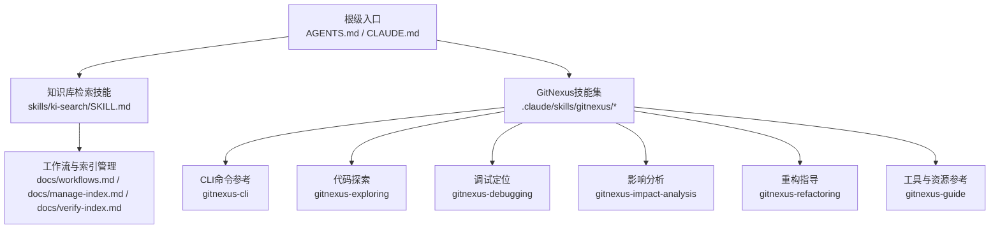
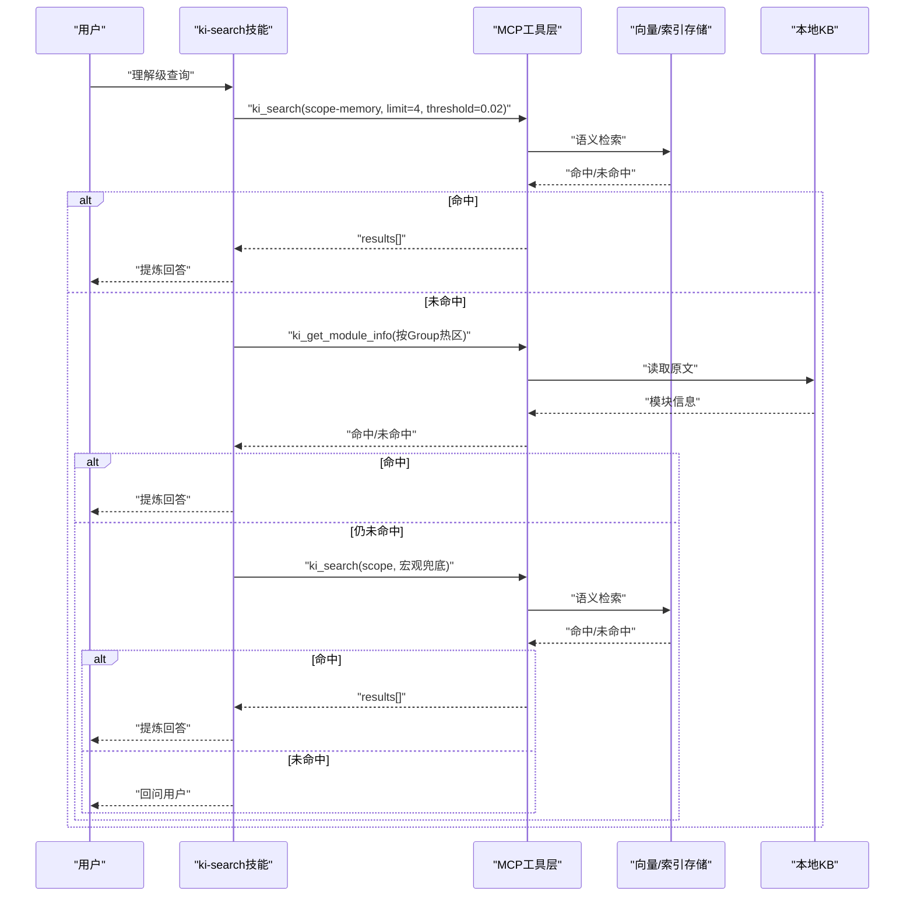
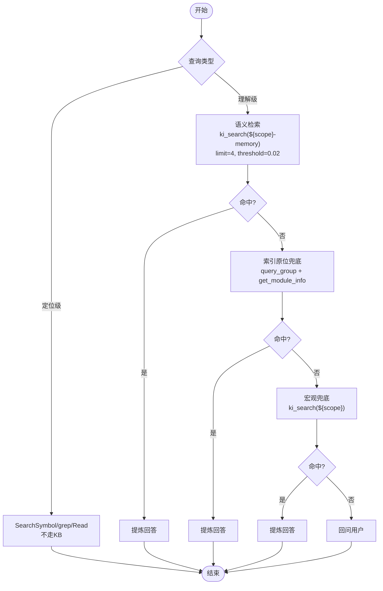
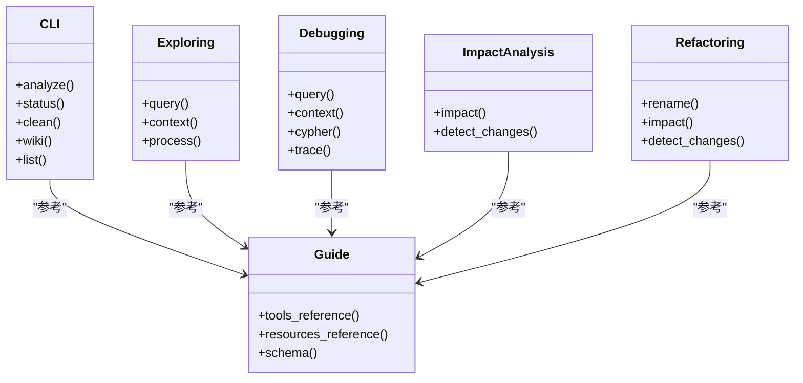
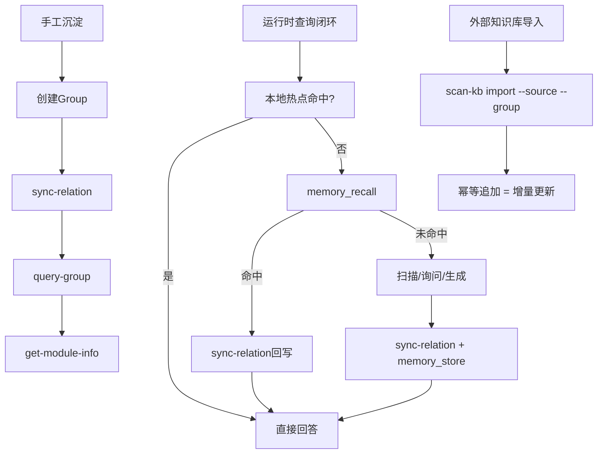
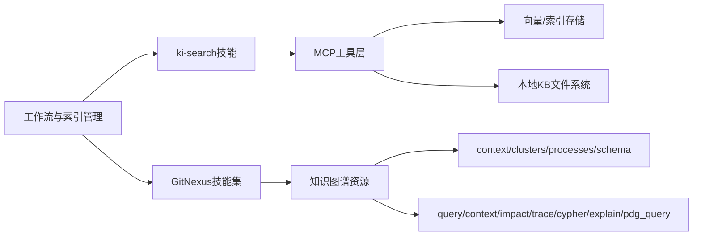

# Agent技能开发规范

<cite>
**本文引用的文件**
- [SKILL.md](file://skills/ki-search/SKILL.md)
- [SKILL.md](file://.claude/skills/gitnexus/gitnexus-cli/SKILL.md)
- [SKILL.md](file://.claude/skills/gitnexus/gitnexus-exploring/SKILL.md)
- [SKILL.md](file://.claude/skills/gitnexus/gitnexus-debugging/SKILL.md)
- [SKILL.md](file://.claude/skills/gitnexus/gitnexus-impact-analysis/SKILL.md)
- [SKILL.md](file://.claude/skills/gitnexus/gitnexus-refactoring/SKILL.md)
- [SKILL.md](file://.claude/skills/gitnexus/gitnexus-guide/SKILL.md)
- [AGENTS.md](file://AGENTS.md)
- [CLAUDE.md](file://CLAUDE.md)
- [codekb-agent-guide.md](file://docs/codekb-agent-guide.md)
- [workflows.md](file://docs/workflows.md)
- [manage-index.md](file://docs/manage-index.md)
- [verify-index.md](file://docs/verify-index.md)
</cite>

## 目录
1. [引言](#引言)
2. [项目结构](#项目结构)
3. [核心组件](#核心组件)
4. [架构总览](#架构总览)
5. [详细组件分析](#详细组件分析)
6. [依赖分析](#依赖分析)
7. [性能考虑](#性能考虑)
8. [故障排查指南](#故障排查指南)
9. [结论](#结论)
10. [附录](#附录)

## 引言
本规范面向Agent技能（SKILL）的创建、组织、调用与发布，目标是让团队以统一的结构和流程开发可复用、可测试、可发布的技能。文档基于仓库中已有的技能样例与工作流说明，提炼出：
- SKILL.md 的结构与元数据约定
- 行为规则描述与工具调用规范
- 从需求到发布的完整流程
- 技能间依赖关系与冲突处理
- 测试方法与调试技巧
- 发布标准与版本管理策略
- 实战示例与常见问题解决方案

## 项目结构
仓库内技能主要分布在两处：
- skills/ki-search/SKILL.md：知识库检索行为的通用技能定义
- .claude/skills/gitnexus/*：围绕代码知识图谱的多项技能（CLI、探索、调试、影响分析、重构、指南）

此外，docs/ 下提供工作流、索引管理与验证等配套文档；根级 AGENTS.md 与 CLAUDE.md 作为全局入口与约束。

**图表来源**
- [AGENTS.md:1-539](file://AGENTS.md#L1-L539)
- [CLAUDE.md:1-45](file://CLAUDE.md#L1-L45)
- [SKILL.md:1-198](file://skills/ki-search/SKILL.md#L1-L198)
- [SKILL.md:1-87](file://.claude/skills/gitnexus/gitnexus-cli/SKILL.md#L1-L87)
- [SKILL.md:1-79](file://.claude/skills/gitnexus/gitnexus-exploring/SKILL.md#L1-L79)
- [SKILL.md:1-102](file://.claude/skills/gitnexus/gitnexus-debugging/SKILL.md#L1-L102)
- [SKILL.md:1-98](file://.claude/skills/gitnexus/gitnexus-impact-analysis/SKILL.md#L1-L98)
- [SKILL.md:1-122](file://.claude/skills/gitnexus/gitnexus-refactoring/SKILL.md#L1-L122)
- [SKILL.md:1-139](file://.claude/skills/gitnexus/gitnexus-guide/SKILL.md#L1-L139)
- [workflows.md:1-162](file://docs/workflows.md#L1-L162)
- [manage-index.md:1-356](file://docs/manage-index.md#L1-L356)
- [verify-index.md:1-217](file://docs/verify-index.md#L1-L217)

**章节来源**
- [AGENTS.md:1-539](file://AGENTS.md#L1-L539)
- [CLAUDE.md:1-45](file://CLAUDE.md#L1-L45)
- [SKILL.md:1-198](file://skills/ki-search/SKILL.md#L1-L198)
- [workflows.md:1-162](file://docs/workflows.md#L1-L162)

## 核心组件
- 知识库检索技能（ki-search）：定义理解级查询的四步走流程、写入白名单/黑名单、批量写入策略、禁忌清单与数据存储位置。
- GitNexus技能集：覆盖索引构建与状态检查、代码探索、调试、影响分析、重构与工具参考。
- 工作流与索引管理：提供手工沉淀、运行时查询闭环、外部知识库导入（幂等追加）、索引结构与验证方法。
- 全局入口与约束：AGENTS.md 记录关键决策、边界与修复记录；CLAUDE.md 给出必须/禁止的行为准则。

**章节来源**
- [SKILL.md:1-198](file://skills/ki-search/SKILL.md#L1-L198)
- [SKILL.md:1-87](file://.claude/skills/gitnexus/gitnexus-cli/SKILL.md#L1-L87)
- [SKILL.md:1-79](file://.claude/skills/gitnexus/gitnexus-exploring/SKILL.md#L1-L79)
- [SKILL.md:1-102](file://.claude/skills/gitnexus/gitnexus-debugging/SKILL.md#L1-L102)
- [SKILL.md:1-98](file://.claude/skills/gitnexus/gitnexus-impact-analysis/SKILL.md#L1-L98)
- [SKILL.md:1-122](file://.claude/skills/gitnexus/gitnexus-refactoring/SKILL.md#L1-L122)
- [SKILL.md:1-139](file://.claude/skills/gitnexus/gitnexus-guide/SKILL.md#L1-L139)
- [workflows.md:1-162](file://docs/workflows.md#L1-L162)
- [manage-index.md:1-356](file://docs/manage-index.md#L1-L356)
- [verify-index.md:1-217](file://docs/verify-index.md#L1-L217)
- [AGENTS.md:1-539](file://AGENTS.md#L1-L539)
- [CLAUDE.md:1-45](file://CLAUDE.md#L1-L45)

## 架构总览
下图展示“用户问题→技能路由→工具调用→结果回写”的整体流程，体现理解级查询优先本地语义检索、索引原位兜底、宏观兜底与回问用户的闭环。

**图表来源**
- [SKILL.md:1-198](file://skills/ki-search/SKILL.md#L1-L198)
- [workflows.md:70-88](file://docs/workflows.md#L70-L88)

**章节来源**
- [SKILL.md:1-198](file://skills/ki-search/SKILL.md#L1-L198)
- [workflows.md:1-162](file://docs/workflows.md#L1-L162)

## 详细组件分析

### 组件A：ki-search 技能（知识库检索）
- 元数据：name、description
- 行为规则：
  - Scope 约定：未指定时必须暂停询问；${scope} 仍为字面量时禁止执行任何 ki MCP 调用
  - 代码相关性判定：定位级 vs 理解级
  - 四步走：语义检索（优先 ${scope}-memory）→ 索引原位兜底 → 宏观兜底（${scope}）→ 回问用户
  - 写入规则：白名单/黑名单；单条与批量写入策略；写入后刷新全景缓存
  - 禁忌清单：11条红线
  - 数据存储位置：kb/${scope}/group-index.json、relations-cache.json、{Group}/index.json；向量数据在 lancedb

**图表来源**
- [SKILL.md:1-198](file://skills/ki-search/SKILL.md#L1-L198)

**章节来源**
- [SKILL.md:1-198](file://skills/ki-search/SKILL.md#L1-L198)

### 组件B：GitNexus 技能集（代码知识图谱）
- gitnexus-cli：索引构建、状态检查、清理、Wiki生成、列表查看
- gitnexus-exploring：通过 context/query/process 探索代码结构与执行流
- gitnexus-debugging：基于 query/context/cypher/trace 进行调试定位
- gitnexus-impact-analysis：impact/detect_changes 评估变更影响与风险
- gitnexus-refactoring：rename/impact/detect_changes 安全重构
- gitnexus-guide：工具与资源参考、图模式、分页 list_repos、explain/pdg_query/trace 等高级能力

**图表来源**
- [SKILL.md:1-87](file://.claude/skills/gitnexus/gitnexus-cli/SKILL.md#L1-L87)
- [SKILL.md:1-79](file://.claude/skills/gitnexus/gitnexus-exploring/SKILL.md#L1-L79)
- [SKILL.md:1-102](file://.claude/skills/gitnexus/gitnexus-debugging/SKILL.md#L1-L102)
- [SKILL.md:1-98](file://.claude/skills/gitnexus/gitnexus-impact-analysis/SKILL.md#L1-L98)
- [SKILL.md:1-122](file://.claude/skills/gitnexus/gitnexus-refactoring/SKILL.md#L1-L122)
- [SKILL.md:1-139](file://.claude/skills/gitnexus/gitnexus-guide/SKILL.md#L1-L139)

**章节来源**
- [SKILL.md:1-87](file://.claude/skills/gitnexus/gitnexus-cli/SKILL.md#L1-L87)
- [SKILL.md:1-79](file://.claude/skills/gitnexus/gitnexus-exploring/SKILL.md#L1-L79)
- [SKILL.md:1-102](file://.claude/skills/gitnexus/gitnexus-debugging/SKILL.md#L1-L102)
- [SKILL.md:1-98](file://.claude/skills/gitnexus/gitnexus-impact-analysis/SKILL.md#L1-L98)
- [SKILL.md:1-122](file://.claude/skills/gitnexus/gitnexus-refactoring/SKILL.md#L1-L122)
- [SKILL.md:1-139](file://.claude/skills/gitnexus/gitnexus-guide/SKILL.md#L1-L139)

### 组件C：工作流与索引管理
- 工作流一：手工沉淀一条项目知识（create group → sync-relation → query-group → get-module-info）
- 工作流二：运行时查询闭环（本地热点 → memory_recall → 回写本地）
- 工作流三：外部知识库导入（幂等追加，重复执行即增量）
- 索引管理：Group 树CRUD、Scope隔离、参数速查
- 验证：结构验证、Relations验证、本地KB验证、语义检索验证

**图表来源**
- [workflows.md:14-138](file://docs/workflows.md#L14-L138)
- [manage-index.md:262-356](file://docs/manage-index.md#L262-L356)
- [verify-index.md:1-217](file://docs/verify-index.md#L1-L217)

**章节来源**
- [workflows.md:1-162](file://docs/workflows.md#L1-L162)
- [manage-index.md:1-356](file://docs/manage-index.md#L1-L356)
- [verify-index.md:1-217](file://docs/verify-index.md#L1-L217)

## 依赖分析
- 技能间依赖
  - ki-search 依赖 MCP 工具（ki_search、ki_get_module_info、ki_sync_relation、ki_bulk_sync_relation 等）与向量/索引存储
  - GitNexus 技能集依赖知识图谱资源（context、clusters、processes、schema）与工具（query、context、impact、trace、cypher、explain、pdg_query 等）
  - 工作流与索引管理为通用支撑，被上述技能在执行阶段调用
- 外部依赖
  - 向量引擎（zvec/lancedb）用于语义检索与向量化
  - 文件系统（kb/${scope}/...）用于本地KB与索引缓存
  - 配置系统（~/.ki/config.yaml/json）用于 scope 注册与权限控制

**图表来源**
- [SKILL.md:1-198](file://skills/ki-search/SKILL.md#L1-L198)
- [SKILL.md:1-139](file://.claude/skills/gitnexus/gitnexus-guide/SKILL.md#L1-L139)
- [workflows.md:1-162](file://docs/workflows.md#L1-L162)

**章节来源**
- [SKILL.md:1-198](file://skills/ki-search/SKILL.md#L1-L198)
- [SKILL.md:1-139](file://.claude/skills/gitnexus/gitnexus-guide/SKILL.md#L1-L139)
- [workflows.md:1-162](file://docs/workflows.md#L1-L162)

## 性能考虑
- 语义检索参数固定：limit=4、threshold=0.02，确保召回质量与上下文占用平衡
- 批量写入策略：每批 ≤5 条，减少组织成本与失败重试范围
- 空闲释放锁与撞锁重试：多实例共享向量库时，空闲自动释放锁，撞锁短暂等待重试，避免阻塞
- 在途操作保护：embedding网络阶段可能超过空闲窗口，需计数与自愈兜底，防止 worker 关闭导致中断
- 索引与缓存：首次拉取全景后会话内缓存有效，写入后刷新

[本节为通用性能建议，不直接分析具体文件]

## 故障排查指南
- 常见症状与原因
  - Group树为空：构建失败或 scope 错误
  - Relations列表为空：向量化失败
  - 本地KB内容缺失：写入失败
  - 语义检索无结果：向量化未完成或 tags 格式错误
  - 增量更新未生效：diff检测失败（旧流程已废弃，现用幂等追加）
- 排查步骤
  - 使用 verify-index 进行结构、Relations、本地KB、语义检索验证
  - 使用 manage-index 检查 Group 树与 Scope 隔离
  - 使用 workflows 中的排障判断点（如 Access denied、--source 不存在、--group 为空、--no-vector 导致不可召回）
- 关键修复记录（来自 AGENTS.md）
  - 多 stdio 实例共享向量库：空闲释放锁 + 撞锁重试
  - import 幂等追加：移除 incremental/diff，统一幂等语义
  - HTTP多Token+scope授权：RBAC越权校验与白名单豁免
  - daemon化与restart：后台常驻、存活探测、web状态延续
  - import测试挂起：剥离IDE注入变量、单文件导入路径修复
  - export子树导出失效与delete级联：修复导出与删除一致性
  - wikiSync门禁与backfill：enabled=false拒绝写回、历史补齐
  - daemon启动失败假报成功：存活探测修复
  - --status探测非默认地址：lock回退逻辑
  - ki_search worker not open：idle close竞态修复

**章节来源**
- [verify-index.md:173-217](file://docs/verify-index.md#L173-L217)
- [workflows.md:141-147](file://docs/workflows.md#L141-L147)
- [AGENTS.md:1-539](file://AGENTS.md#L1-L539)

## 结论
本规范以仓库现有技能与工作流为基础，明确了SKILL.md的结构与元数据、行为规则与工具调用规范，给出了从需求到发布的完整流程，并总结了技能间的依赖关系、冲突处理机制、测试与调试方法以及发布与版本管理策略。遵循本规范可提升技能的可维护性、可测试性与可发布性，降低协作成本与风险。

[本节为总结性内容，不直接分析具体文件]

## 附录

### SKILL.md 结构与格式要求
- 元数据
  - name：技能唯一标识
  - description：触发场景与用途简述
- 行为规则
  - Scope约定与合法性校验
  - 代码相关性判定（定位级 vs 理解级）
  - 查询流程（四步走）
  - 写入规则（白名单/黑名单、单条/批量）
  - 禁忌清单（红线）
  - 数据存储位置
- 工具调用规范
  - 明确参数（如 limit、threshold、tags）
  - 明确调用顺序与兜底策略
  - 明确写入后的缓存刷新

**章节来源**
- [SKILL.md:1-198](file://skills/ki-search/SKILL.md#L1-L198)

### 技能开发流程（从需求到发布）
- 需求分析：明确目标、输入输出、依赖工具与存储
- 设计：确定元数据、行为规则、工具调用序列、异常处理
- 实现：编写SKILL.md，补充工作流与验证用例
- 测试：单元测试（工具调用契约）、集成测试（端到端流程）、性能测试（并发、耗时）
- 发布：版本标记、变更记录、文档同步、回归验证

**章节来源**
- [workflows.md:14-138](file://docs/workflows.md#L14-L138)
- [verify-index.md:1-217](file://docs/verify-index.md#L1-L217)

### 技能间依赖与冲突处理
- 依赖关系
  - ki-search 依赖 MCP 工具与向量/索引存储
  - GitNexus 技能集依赖知识图谱资源与工具
  - 工作流与索引管理为通用支撑
- 冲突处理
  - Scope隔离：每个scope独立目录，禁止跨scope串数据
  - 权限控制：HTTP多Token+scope授权，越权返回403
  - 资源竞争：向量库空闲释放锁 + 撞锁重试，避免同时使用冲突

**章节来源**
- [manage-index.md:279-306](file://docs/manage-index.md#L279-L306)
- [AGENTS.md:83-136](file://AGENTS.md#L83-L136)
- [AGENTS.md:1-539](file://AGENTS.md#L1-L539)

### 测试方法与调试技巧
- 单元测试：工具调用契约、参数校验、错误路径
- 集成测试：端到端流程（导入→查询→回写→验证）
- 性能测试：并发导入、向量检索耗时、空闲释放锁与在途保护
- 调试技巧：日志与状态检查（--status、healthz）、隔离HOME与环境变量、剥离IDE注入变量

**章节来源**
- [AGENTS.md:224-249](file://AGENTS.md#L224-L249)
- [AGENTS.md:440-484](file://AGENTS.md#L440-L484)
- [verify-index.md:1-217](file://docs/verify-index.md#L1-L217)

### 发布标准与版本管理策略
- 发布标准
  - SKILL.md 元数据完整、行为规则清晰、工具调用规范明确
  - 工作流与验证文档同步更新
  - 回归测试通过（单元/集成/性能）
- 版本管理
  - 变更记录（AGENTS.md 记录关键决策与修复）
  - 向后兼容策略（如保留旧流程兼容）
  - 灰度与回滚（daemon化与restart支持）

**章节来源**
- [AGENTS.md:1-539](file://AGENTS.md#L1-L539)
- [workflows.md:129-138](file://docs/workflows.md#L129-L138)

### 实际开发示例
- 示例一：手工沉淀一条项目知识（create group → sync-relation → query-group → get-module-info）
- 示例二：运行时查询闭环（本地热点 → memory_recall → 回写本地）
- 示例三：外部知识库导入（幂等追加，重复执行即增量）

**章节来源**
- [workflows.md:14-138](file://docs/workflows.md#L14-L138)

### 常见问题解决方案
- 索引 stale：运行 analyze 重建索引
- 权限不足：确认 scope 注册与 Token 授权集合
- 导入失败：检查 --source 目录、--group 参数、--no-vector 是否误用
- 检索无结果：确认向量化完成与 tags 格式
- 并发冲突：利用空闲释放锁与撞锁重试，避免同时使用

**章节来源**
- [SKILL.md:1-87](file://.claude/skills/gitnexus/gitnexus-cli/SKILL.md#L1-L87)
- [workflows.md:141-147](file://docs/workflows.md#L141-L147)
- [AGENTS.md:1-539](file://AGENTS.md#L1-L539)