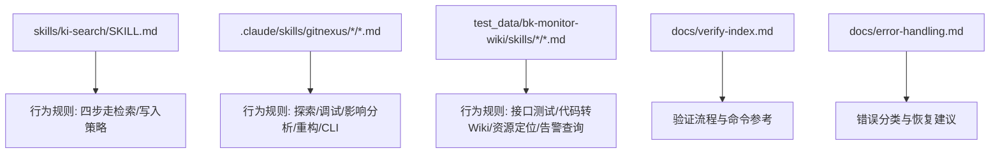
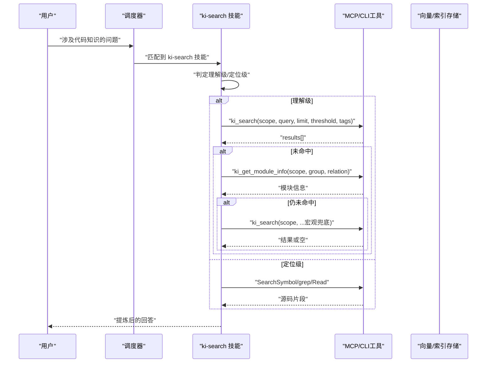
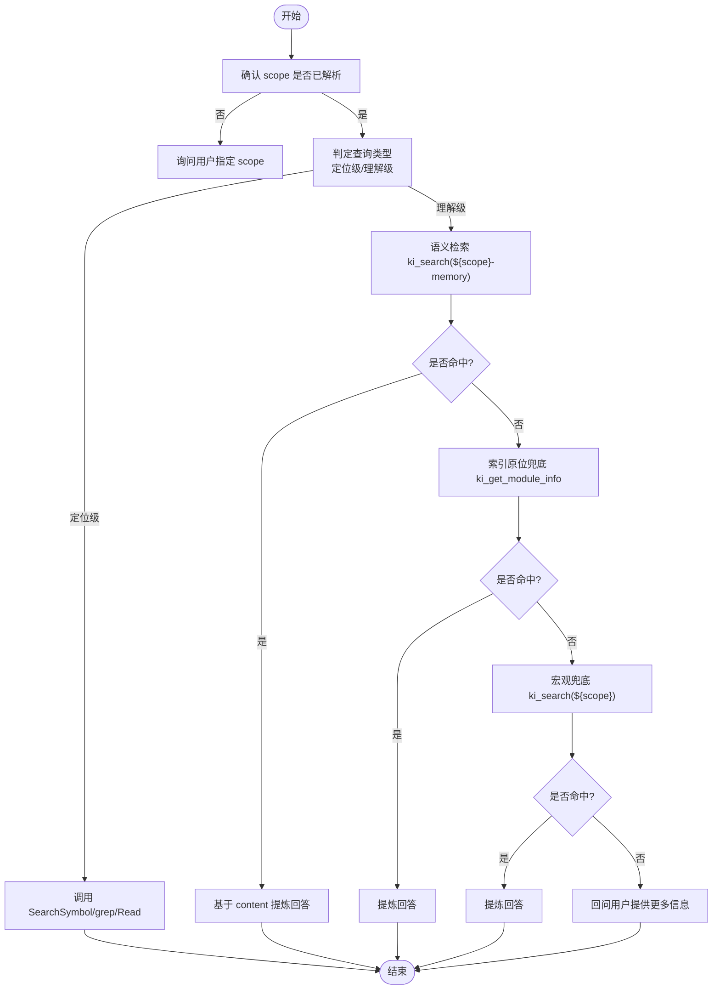
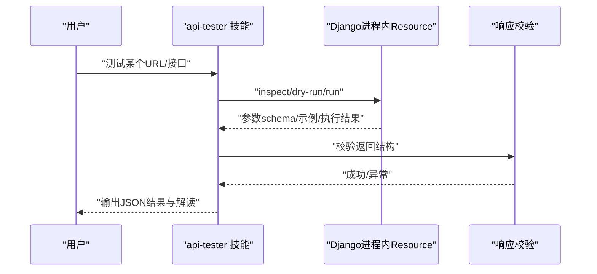
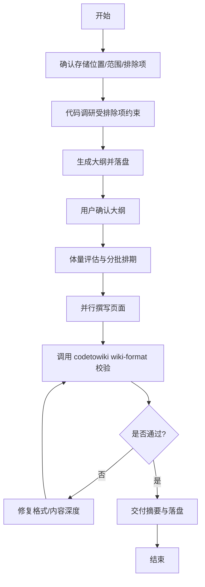
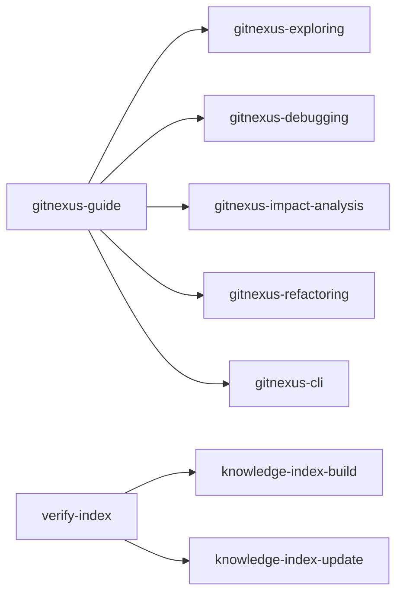

# SKILL.md文件规范

<cite>
**本文引用的文件**
- [SKILL.md](file://skills/ki-search/SKILL.md)
- [SKILL.md](file://.claude/skills/gitnexus/gitnexus-cli/SKILL.md)
- [SKILL.md](file://.claude/skills/gitnexus/gitnexus-debugging/SKILL.md)
- [SKILL.md](file://.claude/skills/gitnexus/gitnexus-exploring/SKILL.md)
- [SKILL.md](file://.claude/skills/gitnexus/gitnexus-guide/SKILL.md)
- [SKILL.md](file://.claude/skills/gitnexus/gitnexus-impact-analysis/SKILL.md)
- [SKILL.md](file://.claude/skills/gitnexus/gitnexus-refactoring/SKILL.md)
- [SKILL.md](file://test_data/bk-monitor-wiki/skills/api-tester/SKILL.md)
- [SKILL.md](file://test_data/bk-monitor-wiki/skills/code-to-wiki/SKILL.md)
- [SKILL.md](file://test_data/bk-monitor-wiki/module-experts/告警查询专家/skills/query-alert/SKILL.md)
- [SKILL.md](file://test_data/bk-monitor-wiki/skills/resource-locator/SKILL.md)
- [verify-index.md](file://docs/verify-index.md)
- [error-handling.md](file://docs/error-handling.md)
</cite>

## 目录
1. [简介](#简介)
2. [项目结构](#项目结构)
3. [核心组件](#核心组件)
4. [架构总览](#架构总览)
5. [详细组件分析](#详细组件分析)
6. [依赖关系分析](#依赖关系分析)
7. [性能考虑](#性能考虑)
8. [故障排查指南](#故障排查指南)
9. [结论](#结论)
10. [附录：模板与最佳实践](#附录模板与最佳实践)

## 简介
本规范定义项目中 SKILL.md 文件的统一结构与写作标准，覆盖 YAML 元数据、行为规则描述、技能间依赖与冲突处理、以及语法检查与验证方法。该规范基于仓库内现有多个 SKILL.md 示例（知识库检索、GitNexus 系列、接口测试、代码转 Wiki、资源定位等）总结而成，旨在让每个技能具备可被 AI Agent 稳定识别、触发与执行的契约。

## 项目结构
SKILL.md 通常位于 skills 或 .claude/skills 等目录下，每个技能一个独立文件夹，包含一个 SKILL.md 作为能力契约；必要时可附带 reference.md 等补充材料。仓库中既有“知识库检索”类技能，也有“工具使用”“工作流编排”类技能，均遵循相同元数据约定。



**图表来源**
- [SKILL.md](file://skills/ki-search/SKILL.md)
- [SKILL.md](file://.claude/skills/gitnexus/gitnexus-cli/SKILL.md)
- [SKILL.md](file://.claude/skills/gitnexus/gitnexus-debugging/SKILL.md)
- [SKILL.md](file://.claude/skills/gitnexus/gitnexus-exploring/SKILL.md)
- [SKILL.md](file://.claude/skills/gitnexus/gitnexus-guide/SKILL.md)
- [SKILL.md](file://.claude/skills/gitnexus/gitnexus-impact-analysis/SKILL.md)
- [SKILL.md](file://.claude/skills/gitnexus/gitnexus-refactoring/SKILL.md)
- [SKILL.md](file://test_data/bk-monitor-wiki/skills/api-tester/SKILL.md)
- [SKILL.md](file://test_data/bk-monitor-wiki/skills/code-to-wiki/SKILL.md)
- [SKILL.md](file://test_data/bk-monitor-wiki/module-experts/告警查询专家/skills/query-alert/SKILL.md)
- [SKILL.md](file://test_data/bk-monitor-wiki/skills/resource-locator/SKILL.md)
- [verify-index.md](file://docs/verify-index.md)
- [error-handling.md](file://docs/error-handling.md)

**章节来源**
- [SKILL.md](file://skills/ki-search/SKILL.md)
- [SKILL.md](file://.claude/skills/gitnexus/gitnexus-cli/SKILL.md)
- [SKILL.md](file://test_data/bk-monitor-wiki/skills/api-tester/SKILL.md)
- [SKILL.md](file://test_data/bk-monitor-wiki/skills/code-to-wiki/SKILL.md)

## 核心组件
- YAML 元数据块：位于文件顶部，用于声明技能的标识与用途，便于系统发现与路由。
- 触发条件：明确何时激活该技能，包括自然语言短语、场景关键词、前置状态等。
- 执行流程：步骤化说明调用顺序、参数约定、分支判断与兜底策略。
- 参数约定：输入输出格式、必填/可选字段、取值范围、默认值、校验规则。
- 依赖与冲突：与其他技能的协作关系、优先级、冲突检测与降级策略。
- 安全与权限：只读/写操作边界、用户授权要求、敏感信息处理。
- 验证与自检：如何验证结果正确性、失败回退、日志与可观测性。

**章节来源**
- [SKILL.md](file://skills/ki-search/SKILL.md)
- [SKILL.md](file://test_data/bk-monitor-wiki/skills/api-tester/SKILL.md)
- [SKILL.md](file://test_data/bk-monitor-wiki/skills/code-to-wiki/SKILL.md)

## 架构总览
下图展示典型技能在系统中的角色与交互：用户意图进入后，由上层调度器匹配到对应 SKILL.md，按其中定义的触发条件与流程执行工具调用，必要时跨技能协作并返回结果。



**图表来源**
- [SKILL.md](file://skills/ki-search/SKILL.md)

## 详细组件分析

### YAML 元数据规范
- name：技能唯一标识，建议使用短横线命名（如 ki-search、api-tester）。
- description：一句话描述技能用途与适用场景，应包含触发关键词或典型问题类型。
- 其他可选字段：version、author、scope、tags、depends_on、conflicts_with 等，用于增强可维护性与调度准确性。

示例参考路径：
- [SKILL.md](file://skills/ki-search/SKILL.md)
- [SKILL.md](file://test_data/bk-monitor-wiki/skills/api-tester/SKILL.md)
- [SKILL.md](file://test_data/bk-monitor-wiki/skills/code-to-wiki/SKILL.md)

**章节来源**
- [SKILL.md](file://skills/ki-search/SKILL.md)
- [SKILL.md](file://test_data/bk-monitor-wiki/skills/api-tester/SKILL.md)
- [SKILL.md](file://test_data/bk-monitor-wiki/skills/code-to-wiki/SKILL.md)

### 触发条件与行为规则
- 触发条件：明确自然语言短语、场景关键词、前置状态（如 scope 已知/索引新鲜度）。
- 行为规则：分步骤描述执行流程，包括分支判断、兜底策略、禁忌清单。
- 参数约定：固定参数（如 limit、threshold）、标签（tags）、作用域（scope）等。
- 安全约束：默认只读，写操作需用户明确授权；禁止跨 scope 串数据。

示例参考路径：
- [SKILL.md](file://skills/ki-search/SKILL.md)
- [SKILL.md](file://test_data/bk-monitor-wiki/skills/api-tester/SKILL.md)
- [SKILL.md](file://test_data/bk-monitor-wiki/module-experts/告警查询专家/skills/query-alert/SKILL.md)

**章节来源**
- [SKILL.md](file://skills/ki-search/SKILL.md)
- [SKILL.md](file://test_data/bk-monitor-wiki/skills/api-tester/SKILL.md)
- [SKILL.md](file://test_data/bk-monitor-wiki/module-experts/告警查询专家/skills/query-alert/SKILL.md)

### 技能间依赖与冲突处理
- 依赖声明：通过 depends_on 列出所需技能或工具，确保先决条件满足。
- 冲突处理：当多个技能可能同时触发时，按优先级选择；若存在互斥，应在 conflicts_with 中声明并给出降级策略。
- 协作模式：主技能负责编排，子技能专注特定任务（如 ki-search 与 verify-index 的先后关系）。

示例参考路径：
- [verify-index.md](file://docs/verify-index.md)

**章节来源**
- [verify-index.md](file://docs/verify-index.md)

### 复杂逻辑流程图（以知识库检索为例）


**图表来源**
- [SKILL.md](file://skills/ki-search/SKILL.md)

**章节来源**
- [SKILL.md](file://skills/ki-search/SKILL.md)

### API/服务类技能（接口测试）


**图表来源**
- [SKILL.md](file://test_data/bk-monitor-wiki/skills/api-tester/SKILL.md)

**章节来源**
- [SKILL.md](file://test_data/bk-monitor-wiki/skills/api-tester/SKILL.md)

### 文档生成类技能（代码转Wiki）


**图表来源**
- [SKILL.md](file://test_data/bk-monitor-wiki/skills/code-to-wiki/SKILL.md)

**章节来源**
- [SKILL.md](file://test_data/bk-monitor-wiki/skills/code-to-wiki/SKILL.md)

## 依赖关系分析
- 横向依赖：多个 GitNexus 技能共享同一套工具集（query/context/impact/rename/detect_changes），通过 guide 技能提供统一参考。
- 纵向依赖：验证技能（verify-index）依赖构建/更新技能的结果，形成“构建→验证”的流水线。
- 外部依赖：MCP/CLI 工具、向量引擎、本地 KB 存储、配置与鉴权。



**图表来源**
- [SKILL.md](file://.claude/skills/gitnexus/gitnexus-guide/SKILL.md)
- [SKILL.md](file://.claude/skills/gitnexus/gitnexus-exploring/SKILL.md)
- [SKILL.md](file://.claude/skills/gitnexus/gitnexus-debugging/SKILL.md)
- [SKILL.md](file://.claude/skills/gitnexus/gitnexus-impact-analysis/SKILL.md)
- [SKILL.md](file://.claude/skills/gitnexus/gitnexus-refactoring/SKILL.md)
- [SKILL.md](file://.claude/skills/gitnexus/gitnexus-cli/SKILL.md)
- [verify-index.md](file://docs/verify-index.md)

**章节来源**
- [SKILL.md](file://.claude/skills/gitnexus/gitnexus-guide/SKILL.md)
- [verify-index.md](file://docs/verify-index.md)

## 性能考虑
- 检索优化：优先语义检索（${scope}-memory），限制 limit 与 threshold，避免全量遍历。
- 批量写入：推荐分批调用（每批 ≤5 条），降低组织成本与失败重试代价。
- 向量化与缓存：写入后刷新全景缓存，减少重复计算。
- 并发与锁：多实例错开共享向量库，空闲释放锁 + 撞锁重试，避免阻塞。

**章节来源**
- [SKILL.md](file://skills/ki-search/SKILL.md)
- [AGENTS.md](file://AGENTS.md)

## 故障排查指南
- 常见错误分类：导入相关、增量相关、展示参数、权限与鉴权、向量引擎状态等。
- 恢复建议：检查 scope 注册、extensions 白名单、group 参数、向量嵌入 API 配置、索引新鲜度。
- 验证手段：使用 verify-index 中的命令进行结构、Relations、本地 KB、语义检索验证。

**章节来源**
- [error-handling.md](file://docs/error-handling.md)
- [verify-index.md](file://docs/verify-index.md)

## 结论
SKILL.md 是技能能力的契约文件，通过统一的 YAML 元数据、清晰的触发条件与执行流程、严格的参数与安全约束、以及完善的依赖与冲突管理，使 AI Agent 能够稳定地识别、调度与执行技能。结合验证与故障排查指南，可显著提升技能的可维护性与可靠性。

## 附录：模板与最佳实践

### SKILL.md 模板
```markdown
---
name: <技能名称>
description: <一句话描述用途与触发场景>
version: <可选>
author: <可选>
scope: <可选>
tags: <可选>
depends_on: <可选>
conflicts_with: <可选>
---

# <技能标题>

## 概述
- 目的
- 功能
- 使用场景

## 触发条件
- 自然语言短语
- 场景关键词
- 前置状态

## 执行流程
1. 步骤一
2. 步骤二
3. 步骤三

## 参数约定
- 必填/可选字段
- 取值范围与默认值
- 校验规则

## 依赖与冲突
- 依赖技能/工具
- 冲突处理与降级策略

## 安全与权限
- 只读/写操作边界
- 用户授权要求

## 验证与自检
- 验证命令/脚本
- 失败回退与日志

## 禁忌清单
- 红线规则
- 写前自检要点
```

**章节来源**
- [SKILL.md](file://skills/ki-search/SKILL.md)
- [SKILL.md](file://test_data/bk-monitor-wiki/skills/api-tester/SKILL.md)
- [SKILL.md](file://test_data/bk-monitor-wiki/skills/code-to-wiki/SKILL.md)

### 最佳实践示例
- 知识库检索：四步走检索、标签过滤、阈值控制、宏观兜底、写入白名单/黑名单、批量写入策略。
- 接口测试：三种模式（inspect/dry-run/run）、安全确认、输出解读。
- 代码转 Wiki：大纲先行、排除项约束、格式校验（codetowiki wiki-format）、高质量特征基准。
- 资源定位：路径转换规则、搜索范围、模块映射、原理说明。

**章节来源**
- [SKILL.md](file://skills/ki-search/SKILL.md)
- [SKILL.md](file://test_data/bk-monitor-wiki/skills/api-tester/SKILL.md)
- [SKILL.md](file://test_data/bk-monitor-wiki/skills/code-to-wiki/SKILL.md)
- [SKILL.md](file://test_data/bk-monitor-wiki/skills/resource-locator/SKILL.md)

### 语法检查与验证方法
- 格式校验：使用 codetowiki wiki-format 对生成的 Wiki 进行 R1-R6 规则校验，支持 --fix 自动修复机械问题。
- 验证流程：通过 verify-index 提供的命令进行结构、Relations、本地 KB、语义检索验证。
- 错误处理：参考 error-handling 的分类与恢复建议，快速定位与修复问题。

**章节来源**
- [SKILL.md](file://test_data/bk-monitor-wiki/skills/code-to-wiki/SKILL.md)
- [verify-index.md](file://docs/verify-index.md)
- [error-handling.md](file://docs/error-handling.md)