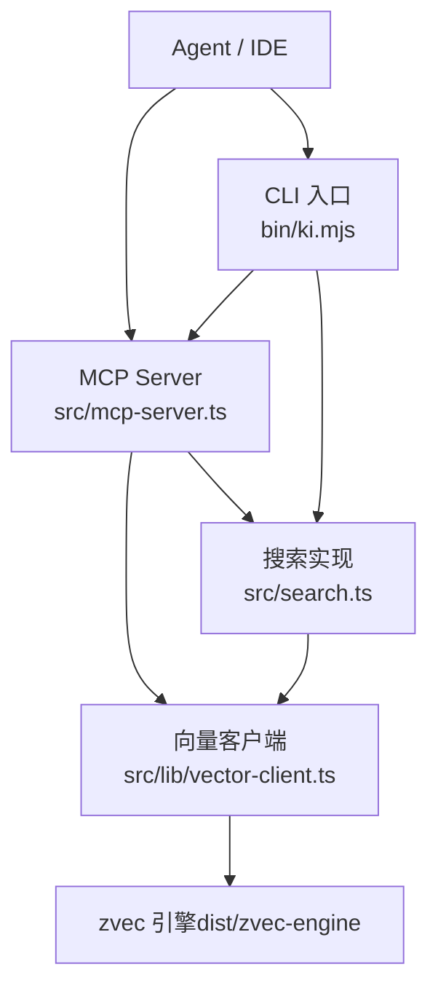
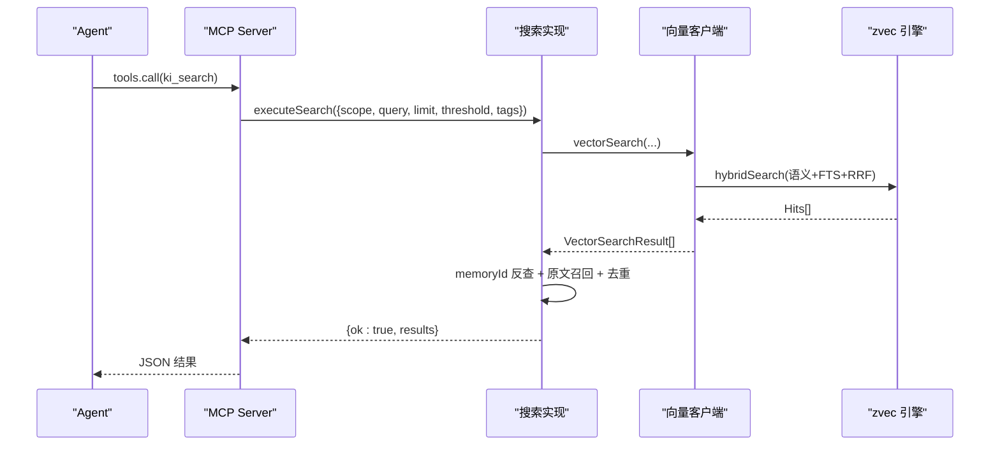
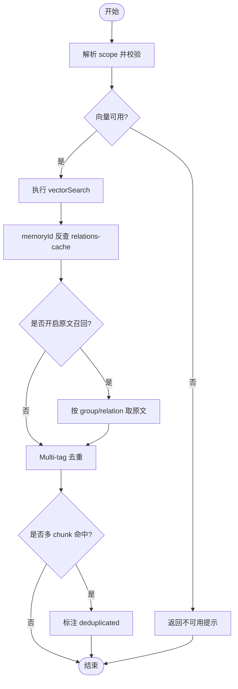
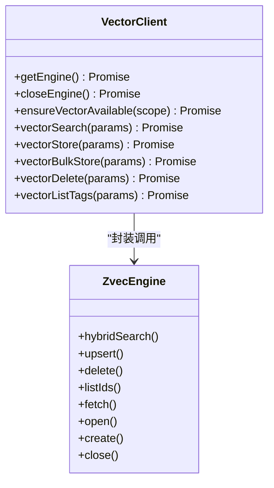
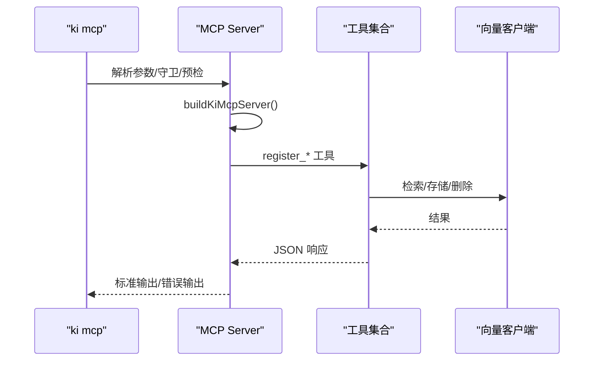
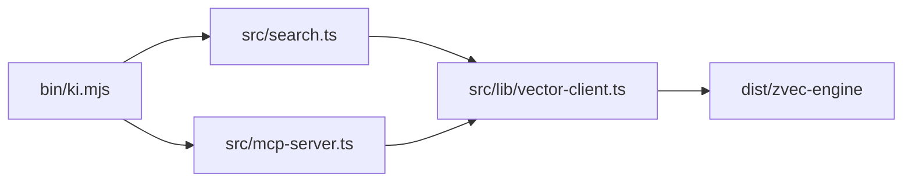

# 实战示例

<cite>
**本文引用的文件**
- [README.md](file://README.md)
- [AGENTS.md](file://AGENTS.md)
- [skills/ki-search/SKILL.md](file://skills/ki-search/SKILL.md)
- [src/search.ts](file://src/search.ts)
- [src/lib/vector-client.ts](file://src/lib/vector-client.ts)
- [src/mcp-server.ts](file://src/mcp-server.ts)
- [bin/ki.mjs](file://bin/ki.mjs)
- [docs/cli.md](file://docs/cli.md)
</cite>

## 目录
1. [引言](#引言)
2. [项目结构](#项目结构)
3. [核心组件](#核心组件)
4. [架构总览](#架构总览)
5. [详细组件分析](#详细组件分析)
6. [依赖关系分析](#依赖关系分析)
7. [性能与优化](#性能与优化)
8. [故障排查指南](#故障排查指南)
9. [结论](#结论)
10. [附录：可复用模板与配置](#附录可复用模板与配置)

## 引言
本实战文档面向“Agent 技能开发”，围绕代码检索、知识库管理、数据分析三类常见业务场景，提供完整的需求分析、设计方案、实现要点与测试验证思路。系统基于 kisearch（CLI：ki）与 zvec 向量引擎，通过 MCP 协议向 Agent 暴露结构化知识索引与混合检索能力，既支持“语义召回”，也支持“按索引直查原文”。

## 项目结构
- CLI 入口与命令路由：bin/ki.mjs
- 语义检索实现：src/search.ts
- 向量客户端与引擎封装：src/lib/vector-client.ts
- MCP 服务与工具注册：src/mcp-server.ts
- 技能行为规则（Agent 使用策略）：skills/ki-search/SKILL.md
- 用户手册与命令参考：docs/cli.md、README.md
- 多实例共享与守护进程：AGENTS.md

图示来源
- [src/mcp-server.ts:54-70](file://src/mcp-server.ts#L54-L70)
- [src/lib/vector-client.ts:314-340](file://src/lib/vector-client.ts#L314-L340)
- [src/search.ts:70-200](file://src/search.ts#L70-L200)
- [bin/ki.mjs:29-49](file://bin/ki.mjs#L29-L49)

章节来源
- [bin/ki.mjs:29-49](file://bin/ki.mjs#L29-L49)
- [src/mcp-server.ts:54-70](file://src/mcp-server.ts#L54-L70)
- [src/lib/vector-client.ts:314-340](file://src/lib/vector-client.ts#L314-L340)
- [src/search.ts:70-200](file://src/search.ts#L70-L200)

## 核心组件
- 向量客户端（vector-client）：封装 zvec 引擎，提供检索、存储、删除、枚举等接口；实现撞锁重试、空闲释放锁、在途保护与自愈重试。
- 搜索模块（search）：实现混合检索（语义+FTS+RRF）、标签优先级、memoryId 反查定位、原文召回与去重。
- MCP 服务（mcp-server）：统一注册工具、处理 stdio/HTTP、Token 鉴权、守护进程与重启、健康检查与预检。
- 技能规则（SKILL.md）：定义 Agent 的四步走查询流程、写入白名单/黑名单与批量写入策略。

章节来源
- [src/lib/vector-client.ts:477-506](file://src/lib/vector-client.ts#L477-L506)
- [src/search.ts:70-200](file://src/search.ts#L70-L200)
- [src/mcp-server.ts:54-70](file://src/mcp-server.ts#L54-L70)
- [skills/ki-search/SKILL.md:24-33](file://skills/ki-search/SKILL.md#L24-L33)

## 架构总览
kisearch 将“结构化知识索引”与“向量语义检索”结合，Agent 通过 MCP 调用工具完成“理解级查询”和“定位级查询”，并可在授权后写入 KB。

图示来源
- [src/mcp-server.ts:54-70](file://src/mcp-server.ts#L54-L70)
- [src/search.ts:70-200](file://src/search.ts#L70-L200)
- [src/lib/vector-client.ts:477-506](file://src/lib/vector-client.ts#L477-L506)

## 详细组件分析

### 组件A：语义检索与原文召回（search.ts）
- 功能要点
  - scope 解析与校验、向量可用性检测
  - 显式 tags 单次查询；不传 tags 时按 tag 分查并按优先级合并
  - memoryId 反查 relations-cache，附加 group/relation 定位
  - 可选原文召回（local KB 文件级原文），失败降级为向量 content
  - Multi-tag 去重与同文件多 chunk 去重
- 关键算法
  - TAG_PRIORITY：['ki-search','ki-relation','ki-path']
  - 去重键：group|relation 或 group/relation
- 复杂度
  - 首次构建 relation-map O(N)，后续 O(1)
  - 去重 Map 操作均摊 O(1)

图示来源
- [src/search.ts:70-200](file://src/search.ts#L70-L200)

章节来源
- [src/search.ts:70-200](file://src/search.ts#L70-L200)

### 组件B：向量客户端（vector-client.ts）
- 功能要点
  - 引擎单例与串行化 open/create/probe/close
  - 撞锁重试（LOCK_RETRY_INTERVAL_MS、LOCK_RETRY_MAX）
  - 空闲释放锁（enableIdleClose）与在途计数（_inFlightOps）
  - withEngine 包装：在途保护 + worker 不可用自愈重试
  - 检索/存储/删除/枚举 API
- 关键设计
  - doc id = sha256(text + scope + tag) 截 32，幂等 upsert
  - 单一 collection，scope/tag/group 标量字段过滤
  - 超时保护 ENGINE_OPEN_TIMEOUT_MS

图示来源
- [src/lib/vector-client.ts:314-340](file://src/lib/vector-client.ts#L314-L340)
- [src/lib/vector-client.ts:389-407](file://src/lib/vector-client.ts#L389-L407)
- [src/lib/vector-client.ts:477-506](file://src/lib/vector-client.ts#L477-L506)

章节来源
- [src/lib/vector-client.ts:120-141](file://src/lib/vector-client.ts#L120-L141)
- [src/lib/vector-client.ts:314-340](file://src/lib/vector-client.ts#L314-L340)
- [src/lib/vector-client.ts:389-407](file://src/lib/vector-client.ts#L389-L407)
- [src/lib/vector-client.ts:477-506](file://src/lib/vector-client.ts#L477-L506)

### 组件C：MCP 服务与工具注册（mcp-server.ts）
- 功能要点
  - 统一注册 11 个 MCP 工具（读/写/管理）
  - stdio/HTTP 双传输；HTTP 共享单例
  - Token 鉴权（非回环绑定强制）
  - 守护进程与 restart；健康检查与启动预检
  - 空闲释放锁 enableIdleClose
- 关键流程
  - parseMcpArgs → 守卫（stdio/HTTP 冲突）→ 预检 → 启动

图示来源
- [src/mcp-server.ts:54-70](file://src/mcp-server.ts#L54-L70)
- [src/mcp-server.ts:492-734](file://src/mcp-server.ts#L492-L734)

章节来源
- [src/mcp-server.ts:54-70](file://src/mcp-server.ts#L54-L70)
- [src/mcp-server.ts:492-734](file://src/mcp-server.ts#L492-L734)

### 组件D：Agent 技能规则（SKILL.md）
- 四步走查询流程（理解级）
  1) ki_search(${scope}-memory, limit=4, threshold=0.02)
  2) 未命中则 ki_get_module_info 索引原位兜底
  3) 仍无结果则 ki_search(${scope}) 宏观兜底
  4) 回问用户
- 写入策略
  - 白名单/黑名单约束
  - 1~2 条逐条写；≥3 条分批批量写（一次 embed + 一次向量写入）
- 禁忌清单与数据位置说明

章节来源
- [skills/ki-search/SKILL.md:24-33](file://skills/ki-search/SKILL.md#L24-L33)
- [skills/ki-search/SKILL.md:72-113](file://skills/ki-search/SKILL.md#L72-L113)
- [skills/ki-search/SKILL.md:116-166](file://skills/ki-search/SKILL.md#L116-L166)
- [skills/ki-search/SKILL.md:189-198](file://skills/ki-search/SKILL.md#L189-L198)

## 依赖关系分析
- CLI 入口 bin/ki.mjs 映射到各命令脚本（search、mcp、scan-kb 等）
- search.ts 依赖 vector-client.ts 进行检索与原文召回
- mcp-server.ts 聚合所有工具，内部调用 search 与 vector-client
- vector-client.ts 依赖 dist/zvec-engine（编译产物）

图示来源
- [bin/ki.mjs:29-49](file://bin/ki.mjs#L29-L49)
- [src/search.ts:70-200](file://src/search.ts#L70-L200)
- [src/mcp-server.ts:54-70](file://src/mcp-server.ts#L54-L70)
- [src/lib/vector-client.ts:18-31](file://src/lib/vector-client.ts#L18-L31)

章节来源
- [bin/ki.mjs:29-49](file://bin/ki.mjs#L29-L49)
- [src/search.ts:70-200](file://src/search.ts#L70-L200)
- [src/mcp-server.ts:54-70](file://src/mcp-server.ts#L54-L70)
- [src/lib/vector-client.ts:18-31](file://src/lib/vector-client.ts#L18-L31)

## 性能与优化
- 混合检索（Hybrid）：语义向量 + BM25 全文 + RRF 融合排序，提升召回精度与鲁棒性
- 标签优先级：默认搜全部时优先 ki-search 内容，其次 ki-relation/ki-path，减少噪声
- 原文召回与去重：避免重复返回同一文件的多 chunk 原文，降低上下文冗余
- 向量层优化
  - 撞锁重试：多实例错开共享向量库，等待对方释放锁后重试
  - 空闲释放锁：常驻 MCP 空闲超时自动 closeEngine，释放 LOCK
  - 在途保护：embedding 网络阶段计入在途计数，防止 idle close 打断
  - 超时保护：engine open 带超时，避免原生挂死导致自愈失效
- 批量写入：一次 embed + 一次向量写入，显著优于多次并发调用

章节来源
- [src/search.ts:21-29](file://src/search.ts#L21-L29)
- [src/search.ts:159-194](file://src/search.ts#L159-L194)
- [src/lib/vector-client.ts:120-141](file://src/lib/vector-client.ts#L120-L141)
- [src/lib/vector-client.ts:164-181](file://src/lib/vector-client.ts#L164-L181)
- [src/lib/vector-client.ts:389-407](file://src/lib/vector-client.ts#L389-L407)
- [src/lib/vector-client.ts:199-216](file://src/lib/vector-client.ts#L199-L216)

## 故障排查指南
- 向量库被占用/损坏
  - 现象：ensureVectorAvailable 返回 LOCKED/CORRUPTED
  - 处置：停止占用进程、稍后重试、rebuild-vector 或 restore 重建
- 多实例争抢锁
  - 现象：多个 stdio 实例或 CLI 同时访问向量库
  - 处置：启用空闲释放锁与撞锁重试；必要时迁移至 HTTP 共享单例
- 原文不可用
  - 现象：includeOriginal=true 但无法定位 local KB
  - 处置：降级返回向量 content，并提示修复（sync-relation 或 rebuild-vector）
- 启动预检失败
  - 现象：缺 embedding apiKey、维度不匹配、目录异常
  - 处置：运行 ki doctor 修复配置与目录

章节来源
- [src/lib/vector-client.ts:64-86](file://src/lib/vector-client.ts#L64-L86)
- [src/lib/vector-client.ts:420-467](file://src/lib/vector-client.ts#L420-L467)
- [src/search.ts:135-156](file://src/search.ts#L135-L156)
- [src/mcp-server.ts:660-678](file://src/mcp-server.ts#L660-L678)

## 结论
kisearch 通过“结构化索引 + 向量检索”的双路径能力，为 Agent 提供了高可靠的知识检索与写入通道。配合 SKILL.md 的行为规则，可实现从“理解级查询”到“定位级查询”的闭环，并在授权后安全地沉淀知识。向量层的撞锁重试、空闲释放锁与在途保护，保障了多实例环境下的稳定性与性能。

## 附录：可复用模板与配置
- 快速导入外部 Wiki（幂等追加）
  - 命令参考：见 docs/cli.md 的 import 子命令说明
- 启动 MCP HTTP 共享单例（含前端）
  - 命令参考：README.md 的快速开始与 MCP 集成
- 生成与管理 Token（多 scope 授权）
  - 命令参考：README.md 的 Token 管理与 AGENTS.md 中的 RBAC 决策
- 典型工作流
  - 本地知识沉淀、AI Agent 通过 MCP 使用、外部知识库导入

章节来源
- [docs/cli.md:28-63](file://docs/cli.md#L28-L63)
- [README.md:105-166](file://README.md#L105-L166)
- [README.md:183-190](file://README.md#L183-L190)
- [AGENTS.md:83-136](file://AGENTS.md#L83-L136)