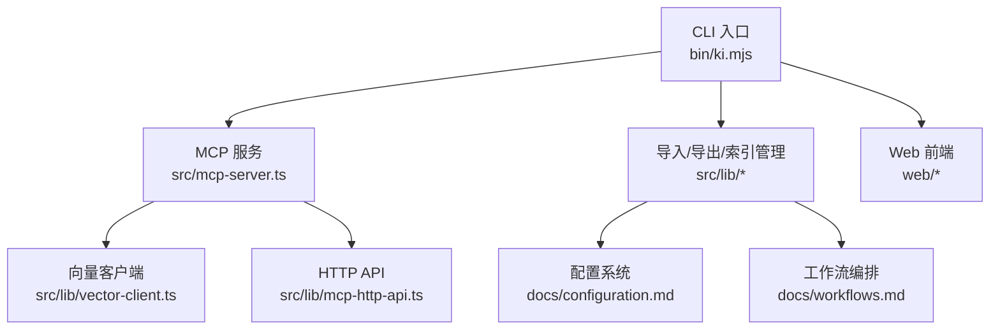
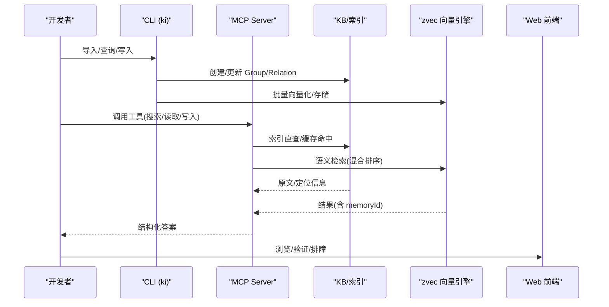
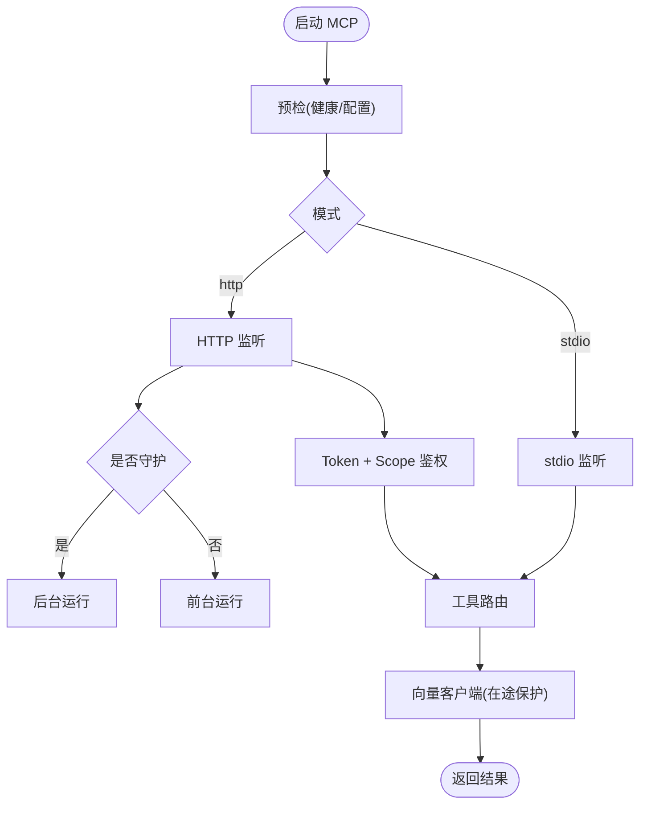
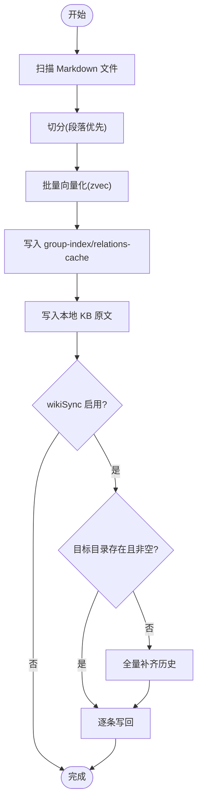
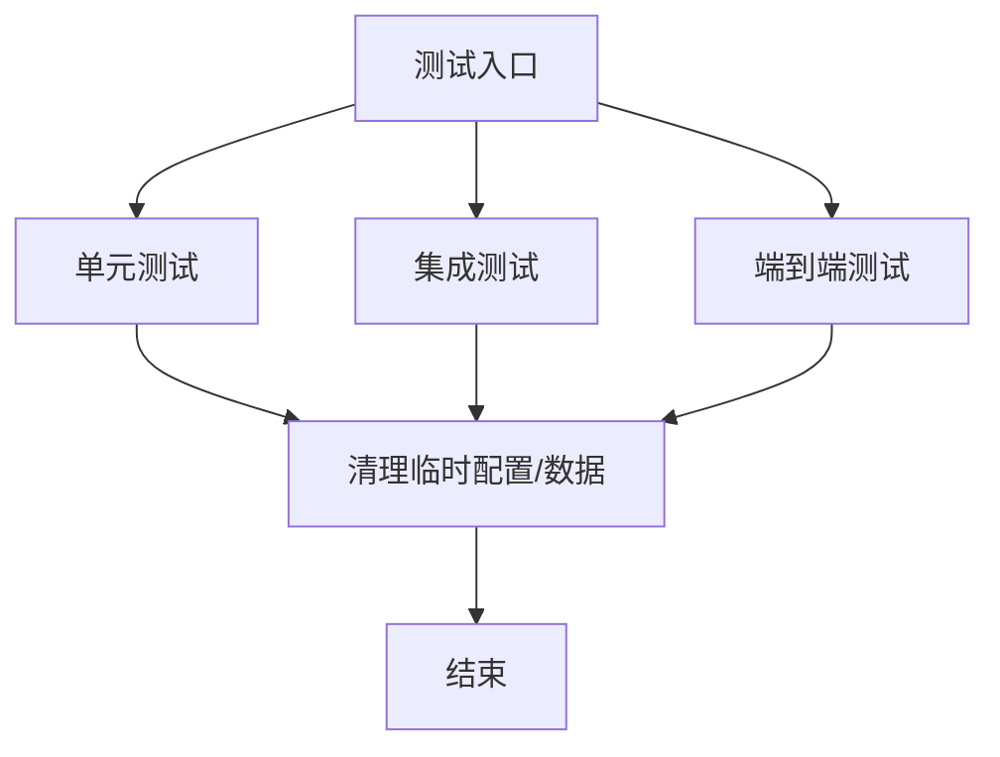
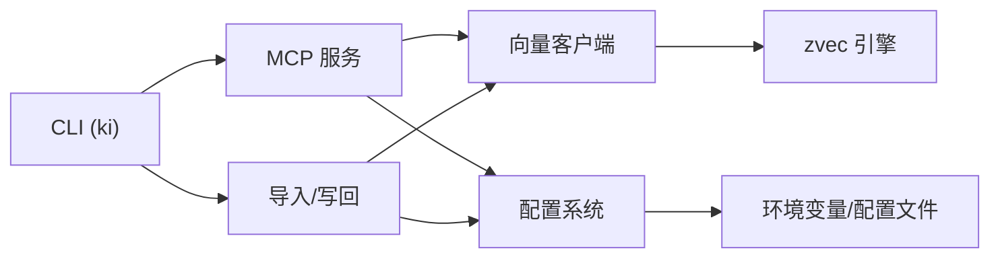

# 开发工作流程

<cite>
**本文引用的文件**
- [README.md](file://README.md)
- [AGENTS.md](file://AGENTS.md)
- [CLAUDE.md](file://CLAUDE.md)
- [package.json](file://package.json)
- [skills/ki-search/SKILL.md](file://skills/ki-search/SKILL.md)
- [docs/workflows.md](file://docs/workflows.md)
- [docs/configuration.md](file://docs/configuration.md)
- [scripts/release.sh](file://scripts/release.sh)
- [test/e2e-guide.md](file://test/e2e-guide.md)
- [test/test-config.ts](file://test/test-config.ts)
- [src/lib/vector-client.ts](file://src/lib/vector-client.ts)
- [src/mcp-server.ts](file://src/mcp-server.ts)
- [bin/ki.mjs](file://bin/ki.mjs)
</cite>

## 目录
1. [引言](#引言)
2. [项目结构](#项目结构)
3. [核心组件](#核心组件)
4. [架构总览](#架构总览)
5. [详细组件分析](#详细组件分析)
6. [依赖关系分析](#依赖关系分析)
7. [性能考量](#性能考量)
8. [故障排查指南](#故障排查指南)
9. [结论](#结论)
10. [附录](#附录)

## 引言
本文件面向“Agent 技能开发”的完整工作流，覆盖从需求分析、设计规划、代码实现到测试验证的全生命周期。结合仓库现有能力（结构化知识索引 + 向量检索、MCP 工具暴露、CLI/Web 前端、导入与写回机制），给出可执行的步骤、调试策略、测试矩阵、版本发布流程以及质量门禁建议，帮助团队以统一标准高效交付 Agent 技能。

## 项目结构
仓库围绕“知识索引 + MCP 服务 + CLI/Web 工具”展开，关键目录与职责如下：
- src：核心逻辑（MCP 服务、HTTP API、向量客户端、导入/导出、配置、WAL、健康检查等）
- bin：CLI 入口（ki.mjs），负责参数解析、守护进程化、命令分发
- docs：用户与开发者文档（工作流、配置、错误处理、架构等）
- test：单元测试、集成测试、端到端测试与 E2E 指南
- skills：Agent 技能定义（如 ki-search 行为规则）
- web：内置可视化前端（Group 树浏览、搜索、导入、写入）
- scripts：发布脚本等工程化脚本



图示来源
- [bin/ki.mjs](file://bin/ki.mjs)
- [src/mcp-server.ts](file://src/mcp-server.ts)
- [src/lib/vector-client.ts](file://src/lib/vector-client.ts)
- [docs/configuration.md](file://docs/configuration.md)
- [docs/workflows.md](file://docs/workflows.md)

章节来源
- [README.md:35-103](file://README.md#L35-L103)
- [package.json:1-68](file://package.json#L1-L68)

## 核心组件
- 知识索引与检索
  - Group/Relation 结构化索引 + 向量混合检索（语义+BM25+RRF）
  - 原文定位与全文交付，支持标签过滤与冷热治理
- MCP 服务与 HTTP API
  - stdio/HTTP 双通道；多 Token + scope 授权；守护进程化与重启
  - 工具集遵循零破坏性约束（除指定删除接口）
- 导入与写回
  - scan-kb import 幂等追加（--source 原文直导）
  - wikiSync 写回与自动补齐历史
- CLI 与 Web 前端
  - 19 个 CLI 命令；内置 Web 用于验证与排障
- 配置与环境
  - 集中式 YAML/JSON 配置；默认数据目录 ~/.ki；Embedding 提供商配置

章节来源
- [README.md:35-103](file://README.md#L35-L103)
- [docs/workflows.md:1-162](file://docs/workflows.md#L1-L162)
- [docs/configuration.md:1-252](file://docs/configuration.md#L1-L252)

## 架构总览
Agent 技能通过 MCP 工具访问知识库，底层由 zvec 引擎提供混合检索；CLI 与 Web 作为辅助工具链。导入链路将外部 Wiki 或本地 Markdown 切分并向量化，写入 KB 与 relations-cache，同时可选写回 Wiki。



图示来源
- [README.md:35-103](file://README.md#L35-L103)
- [docs/workflows.md:70-127](file://docs/workflows.md#L70-L127)

## 详细组件分析

### 组件A：MCP 服务与鉴权（stdio/HTTP/守护）
- 功能要点
  - stdio/HTTP 共享单例；HTTP 支持后台常驻与重启
  - 多 Token + scope 授权；越权拦截与脱敏
  - 空闲释放锁与撞锁重试，提升多实例并发体验
- 关键路径
  - 启动预检（健康检查）、Token 校验、工具路由、scope 授权校验
  - 向量客户端在途保护与自愈（避免 idle close 竞态）



图示来源
- [src/mcp-server.ts](file://src/mcp-server.ts)
- [bin/ki.mjs](file://bin/ki.mjs)
- [src/lib/vector-client.ts](file://src/lib/vector-client.ts)

章节来源
- [AGENTS.md:3-52](file://AGENTS.md#L3-L52)
- [AGENTS.md:83-136](file://AGENTS.md#L83-L136)
- [AGENTS.md:138-223](file://AGENTS.md#L138-L223)
- [AGENTS.md:440-484](file://AGENTS.md#L440-L484)
- [AGENTS.md:516-539](file://AGENTS.md#L516-L539)

### 组件B：导入与写回（scan-kb import / wikiSync）
- 功能要点
  - 幂等追加：同 sourcePath 覆盖更新，新文件导入，同名不同源跳过
  - 自动切分、批量向量化、relations-cache/group-index 写入
  - wikiSync 写回与自动补齐历史（空目录/不存在时触发）
- 典型流程



图示来源
- [docs/workflows.md:91-127](file://docs/workflows.md#L91-L127)
- [docs/configuration.md:122-129](file://docs/configuration.md#L122-L129)

章节来源
- [AGENTS.md:53-82](file://AGENTS.md#L53-L82)
- [AGENTS.md:396-438](file://AGENTS.md#L396-L438)
- [docs/workflows.md:91-127](file://docs/workflows.md#L91-L127)

### 组件C：Agent 技能（ki-search 行为规则）
- 功能要点
  - 四步走查询：优先语义检索 → 索引原位兜底 → 宏观兜底 → 回问
  - 写入白名单/黑名单；批量写入策略（分批 ≤5 条）
  - 只读默认，需用户明确授权才修改 KB
- 使用方式
  - 通过 MCP 工具调用；配合 Group 全景缓存与标签过滤

```mermaid
sequenceDiagram
participant U as "用户"
participant A as "Agent"
participant M as "MCP 工具"
U->>A : 提问(涉及代码知识)
A->>M : ki_search(scope-memory, limit=4, threshold=0.02)
alt 命中
M-->>A : 结果(含 memoryId/content)
A-->>U : 提炼回答
else 未命中
A->>M : ki_get_module_info(按 Group/Relation)
alt 命中
M-->>A : 原文片段
A-->>U : 提炼回答
else 仍无
A->>M : ki_search(scope, limit=4, threshold=0.02)
opt 命中
M-->>A : 结果
A-->>U : 提炼回答
else 仍无
A-->>U : 回问用户
end
end
end
```

图示来源
- [skills/ki-search/SKILL.md:13-185](file://skills/ki-search/SKILL.md#L13-L185)

章节来源
- [skills/ki-search/SKILL.md:1-198](file://skills/ki-search/SKILL.md#L1-L198)

### 组件D：测试体系（单元/集成/E2E）
- 单元测试：各模块独立验证（配置、导入、MCP、向量客户端等）
- 集成测试：跨模块协作（如 sync-relation + wikiSync）
- 端到端测试：真实环境全流程（导入→查询→写入→导出）
- 测试隔离：临时配置、剥离 IDE 注入变量、向量库隔离



图示来源
- [test/test-config.ts:1-91](file://test/test-config.ts#L1-L91)
- [test/e2e-guide.md:1-162](file://test/e2e-guide.md#L1-L162)

章节来源
- [test/test-config.ts:1-91](file://test/test-config.ts#L1-L91)
- [test/e2e-guide.md:1-162](file://test/e2e-guide.md#L1-L162)

## 依赖关系分析
- 组件耦合
  - MCP 服务依赖向量客户端、HTTP API、配置系统
  - 导入/写回依赖配置、向量客户端、文件系统
  - CLI 作为统一入口，协调各模块
- 外部依赖
  - zvec 向量引擎（本地持久化）
  - Embedding 提供商（SiliconFlow/OpenAI 兼容）
  - Node.js ≥ 18、TypeScript/jiti 运行时



图示来源
- [package.json:42-48](file://package.json#L42-L48)
- [docs/configuration.md:1-252](file://docs/configuration.md#L1-L252)

章节来源
- [package.json:1-68](file://package.json#L1-L68)
- [docs/configuration.md:1-252](file://docs/configuration.md#L1-L252)

## 性能考量
- 向量检索
  - 混合检索（语义+BM25+RRF）提升召回与排序质量
  - 标签过滤与冷热治理减少噪声
- 并发与锁
  - 空闲释放锁 + 撞锁重试，缓解多实例竞争
  - 向量客户端在途计数避免 idle close 竞态
- 导入优化
  - 批量向量化与原子写入，减少 I/O 放大
  - 幂等追加避免重复计算

[本节为通用性能讨论，不直接分析具体文件]

## 故障排查指南
- 常见问题
  - 启动失败：预检失败（缺 apiKey、维度不匹配）→ 修复配置后重试
  - 向量报错：worker not open → 客户端自愈重试一次
  - 导入挂起：IDE safe-delete 注入导致子进程阻塞 → 剥离环境变量
  - 权限问题：HTTP 非回环绑定需 Token → 生成并传入
- 诊断步骤
  - 使用 `ki doctor` 检查配置与健康
  - 使用 `ki mcp --status` 查看实例状态
  - 使用 Web 前端验证导入效果与检索路径

章节来源
- [AGENTS.md:3-52](file://AGENTS.md#L3-L52)
- [AGENTS.md:440-484](file://AGENTS.md#L440-L484)
- [AGENTS.md:516-539](file://AGENTS.md#L516-L539)

## 结论
本工作流以“结构化索引 + 向量检索”为核心，通过 MCP 暴露给 Agent，辅以 CLI/Web 工具链与完善的导入/写回机制。借助严格的配置管理、健壮的并发与锁策略、分层测试与发布门禁，可实现高质量、可维护的 Agent 技能交付。

[本节为总结，不直接分析具体文件]

## 附录

### 开发环境搭建
- 安装与构建
  - 安装依赖并构建 zvec 引擎层
  - 初始化配置并执行健康检查
- 运行与服务
  - 启动 MCP（stdio/HTTP），必要时开启 Web 前端
  - 生成 Token 并配置客户端接入

章节来源
- [README.md:105-166](file://README.md#L105-L166)
- [docs/configuration.md:180-243](file://docs/configuration.md#L180-L243)

### 常用工具推荐
- GitNexus 分析与影响评估
  - 编辑前进行影响分析，提交前检测变更范围
- CLI 与 Web
  - 使用 CLI 快速操作，Web 前端可视化验证

章节来源
- [CLAUDE.md:8-23](file://CLAUDE.md#L8-L23)
- [README.md:48-62](file://README.md#L48-L62)

### 版本控制与发布流程
- 版本管理
  - 使用脚本校验版本一致性、工作区干净、关键文件存在
- 发布步骤
  - 运行测试、打包、创建 tag、发布 Release（支持预发布）
  - 提供安装与 MCP 配置说明

章节来源
- [scripts/release.sh:1-142](file://scripts/release.sh#L1-L142)

### 调试技巧与测试策略
- 调试
  - 预检失败优先修复配置；向量异常关注客户端自愈
  - 导入挂起时剥离 IDE 注入变量
- 测试
  - 单元/集成/E2E 分层覆盖；使用临时配置与隔离数据
  - 端到端参考 E2E 指南，复现真实场景

章节来源
- [test/test-config.ts:49-91](file://test/test-config.ts#L49-L91)
- [test/e2e-guide.md:1-162](file://test/e2e-guide.md#L1-L162)

### 代码审查清单与质量保证标准
- 审查清单
  - 变更范围与影响分析（GitNexus）
  - 配置项变更是否安全（apiKey、维度、scope 模式）
  - 并发与锁改动是否引入竞态（idle close、在途计数）
  - 导入/写回幂等性与错误恢复
  - 测试覆盖（单元/集成/E2E）与回归通过
- 质量标准
  - 类型检查通过、测试全绿、发布脚本通过
  - 文档同步更新（配置、工作流、错误处理）

章节来源
- [CLAUDE.md:8-23](file://CLAUDE.md#L8-L23)
- [scripts/release.sh:43-49](file://scripts/release.sh#L43-L49)