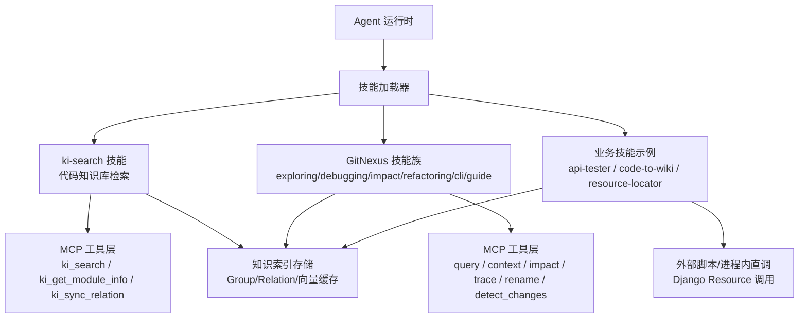
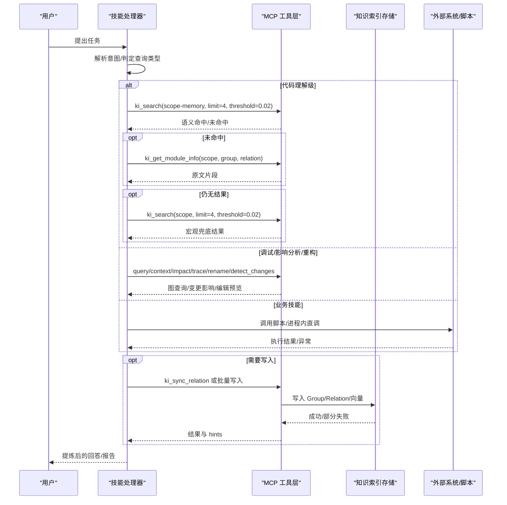
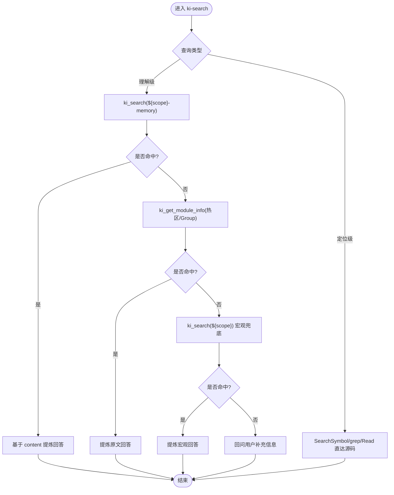
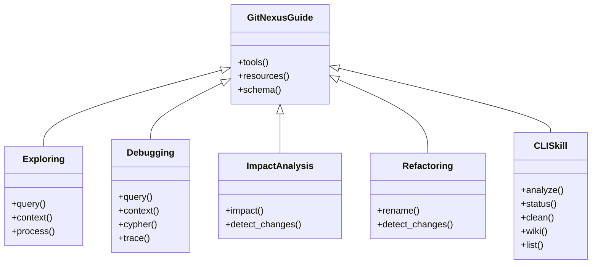
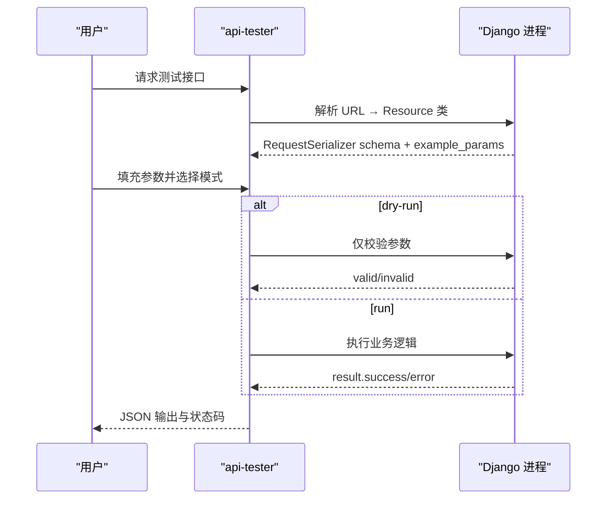
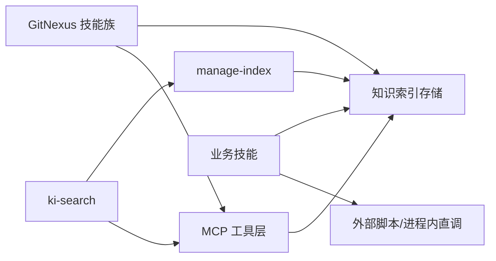

# 技能开发指南

<cite>
**本文引用的文件**
- [SKILL.md](file://skills/ki-search/SKILL.md)
- [gitnexus-cli SKILL.md](file://.claude/skills/gitnexus/gitnexus-cli/SKILL.md)
- [gitnexus-guide SKILL.md](file://.claude/skills/gitnexus/gitnexus-guide/SKILL.md)
- [gitnexus-exploring SKILL.md](file://.claude/skills/gitnexus/gitnexus-exploring/SKILL.md)
- [gitnexus-debugging SKILL.md](file://.claude/skills/gitnexus/gitnexus-debugging/SKILL.md)
- [gitnexus-impact-analysis SKILL.md](file://.claude/skills/gitnexus/gitnexus-impact-analysis/SKILL.md)
- [gitnexus-refactoring SKILL.md](file://.claude/skills/gitnexus/gitnexus-refactoring/SKILL.md)
- [api-tester SKILL.md](file://test_data/bk-monitor-wiki/skills/api-tester/SKILL.md)
- [code-to-wiki SKILL.md](file://test_data/bk-monitor-wiki/skills/code-to-wiki/SKILL.md)
- [resource-locator SKILL.md](file://test_data/bk-monitor-wiki/skills/resource-locator/SKILL.md)
- [AGENTS-template.md](file://skills/agents-md-init/AGENTS-template.md)
- [索引结构管理 SKILL](file://docs/manage-index.md)
- [知识库验证 SKILL](file://docs/verify-index.md)
</cite>

## 目录
1. [引言](#引言)
2. [项目结构与技能定位](#项目结构与技能定位)
3. [核心组件与能力边界](#核心组件与能力边界)
4. [架构总览](#架构总览)
5. [详细组件分析](#详细组件分析)
6. [依赖关系与冲突处理](#依赖关系与冲突处理)
7. [性能与可靠性考虑](#性能与可靠性考虑)
8. [故障排查与常见问题](#故障排查与常见问题)
9. [结论与最佳实践](#结论与最佳实践)
10. [附录：高质量 SKILL.md 模板要点](#附录高质量-skillmd-模板要点)

## 引言
本指南面向需要为 Agent 编写“技能”的开发者，目标是帮助你基于仓库中已有的 SKILL.md 范式，设计、实现并维护高质量的 Agent 技能。文档从标准结构、元数据定义、行为规则、工具调用规范入手，覆盖完整开发流程（需求分析、设计规划、代码实现、测试验证），并结合仓库中的真实示例说明如何组织技能间的依赖关系、处理冲突、保障可观测性与可维护性。

## 项目结构与技能定位
仓库中技能以 Markdown 形式存在，通常位于 skills 或 .claude/skills 等目录，每个技能一个独立文件夹，包含一个 SKILL.md 作为权威行为契约。此外，docs 目录下提供了与知识索引相关的“索引结构管理”和“知识库验证”两类技能文档，用于支撑知识构建、更新与校验。

图表来源
- [SKILL.md:1-198](file://skills/ki-search/SKILL.md#L1-L198)
- [gitnexus-guide SKILL.md:31-133](file://.claude/skills/gitnexus/gitnexus-guide/SKILL.md#L31-L133)
- [api-tester SKILL.md:22-123](file://test_data/bk-monitor-wiki/skills/api-tester/SKILL.md#L22-L123)
- [索引结构管理 SKILL:279-356](file://docs/manage-index.md#L279-L356)

章节来源
- [SKILL.md:1-198](file://skills/ki-search/SKILL.md#L1-L198)
- [gitnexus-guide SKILL.md:1-139](file://.claude/skills/gitnexus/gitnexus-guide/SKILL.md#L1-L139)
- [索引结构管理 SKILL:1-356](file://docs/manage-index.md#L1-L356)

## 核心组件与能力边界
- 元数据定义：每个 SKILL.md 顶部使用 YAML front matter 声明 name 与 description，用于技能识别与触发。
- 行为规则：明确何时触发、不触发、查询类型判定、步骤化工作流、禁忌清单与自检项。
- 工具调用规范：规定 MCP 工具名称、参数约定、返回值解读、错误处理与重试策略。
- 写入权限控制：默认只读，仅在用户明确授权且确需修正知识库时执行写入；提供白名单/黑名单约束。
- 批量写入策略：对大量条目采用分批写入，降低上下文占用与失败面，保证幂等与可重试。
- 范围隔离：通过 scope 进行物理与逻辑隔离，禁止跨 scope 串数据。

章节来源
- [SKILL.md:1-198](file://skills/ki-search/SKILL.md#L1-L198)
- [索引结构管理 SKILL:279-356](file://docs/manage-index.md#L279-L356)

## 架构总览
下图展示 Agent 在调用不同技能时的典型交互路径：技能解析用户意图后，选择合适的工作流，调用 MCP 工具或外部脚本，读取/写入知识索引，最终返回结构化结果。

图表来源
- [SKILL.md:62-167](file://skills/ki-search/SKILL.md#L62-L167)
- [gitnexus-guide SKILL.md:31-133](file://.claude/skills/gitnexus/gitnexus-guide/SKILL.md#L31-L133)
- [api-tester SKILL.md:28-123](file://test_data/bk-monitor-wiki/skills/api-tester/SKILL.md#L28-L123)

## 详细组件分析

### 组件A：ki-search 技能（代码知识库检索）
- 职责：在涉及代码知识的场景下，按“四步走”流程优先语义检索，再回退到索引原位与宏观兜底，必要时经授权写入 KB。
- 关键流程：
  - 对话开始拉取全景缓存（memory scope）。
  - 语义检索优先（limit=4，threshold=0.02，tags 指定）。
  - 未命中则查热区/热点 Group，获取原文并提炼回答。
  - 最后兜底查询 ${scope} 宏观内容。
  - 写入遵循白名单/黑名单，支持单条与批量写入，写入后刷新缓存。
- 禁忌清单：严格限制字面量 scope 直接调用、跳过语义检索、跨 scope 串数据、未经授权使用写操作等。
- 数据存储：Group/Relation 与向量数据分离，分别位于 kb 目录与本地 memory-mcp 向量库。

图表来源
- [SKILL.md:24-113](file://skills/ki-search/SKILL.md#L24-L113)

章节来源
- [SKILL.md:1-198](file://skills/ki-search/SKILL.md#L1-L198)

### 组件B：GitNexus 技能族（探索/调试/影响分析/重构/CLI/指南）
- 共同前提：先读取 repo context 检查索引新鲜度，必要时重新 analyze。
- 探索：通过 query/context/process 资源逐步深入理解代码。
- 调试：结合 query/context/cypher/trace 定位根因。
- 影响分析：impact 评估 d=1/2/3 风险，detect_changes 做提交前检查。
- 重构：rename 多文件协调修改，配合 detect_changes 验证影响范围。
- CLI：analyze/status/clean/wiki/list 等命令，支持嵌入生成与 PDG 分析。
- 指南：统一工具与资源参考，schema 权威来源。

图表来源
- [gitnexus-guide SKILL.md:20-133](file://.claude/skills/gitnexus/gitnexus-guide/SKILL.md#L20-L133)
- [gitnexus-exploring SKILL.md:16-79](file://.claude/skills/gitnexus/gitnexus-exploring/SKILL.md#L16-L79)
- [gitnexus-debugging SKILL.md:16-102](file://.claude/skills/gitnexus/gitnexus-debugging/SKILL.md#L16-L102)
- [gitnexus-impact-analysis SKILL.md:17-98](file://.claude/skills/gitnexus/gitnexus-impact-analysis/SKILL.md#L17-L98)
- [gitnexus-refactoring SKILL.md:16-122](file://.claude/skills/gitnexus/gitnexus-refactoring/SKILL.md#L16-L122)
- [gitnexus-cli SKILL.md:12-87](file://.claude/skills/gitnexus/gitnexus-cli/SKILL.md#L12-L87)

章节来源
- [gitnexus-guide SKILL.md:1-139](file://.claude/skills/gitnexus/gitnexus-guide/SKILL.md#L1-L139)
- [gitnexus-exploring SKILL.md:1-79](file://.claude/skills/gitnexus/gitnexus-exploring/SKILL.md#L1-L79)
- [gitnexus-debugging SKILL.md:1-102](file://.claude/skills/gitnexus/gitnexus-debugging/SKILL.md#L1-L102)
- [gitnexus-impact-analysis SKILL.md:1-98](file://.claude/skills/gitnexus/gitnexus-impact-analysis/SKILL.md#L1-L98)
- [gitnexus-refactoring SKILL.md:1-122](file://.claude/skills/gitnexus/gitnexus-refactoring/SKILL.md#L1-L122)
- [gitnexus-cli SKILL.md:1-87](file://.claude/skills/gitnexus/gitnexus-cli/SKILL.md#L1-L87)

### 组件C：业务技能示例（接口测试/代码转Wiki/资源定位）
- api-tester：在 Django 进程内直调 Resource 类，绕过认证/限流中间件，支持 inspect/dry-run/run 三种模式，强调非 GET 写操作的确认与安全约束。
- code-to-wiki：将代码库转化为结构化 Wiki，强制大纲先行、分批撰写、格式校验（R1-R7）、高质量基准（配图/深度/引用密度）。
- resource-locator：根据 resource.xxx.yyy 或 api.xxx.yyy 路径自动转换为 Python Resource 类名并定位源码，解释自动发现与命名转换机制。

图表来源
- [api-tester SKILL.md:22-123](file://test_data/bk-monitor-wiki/skills/api-tester/SKILL.md#L22-L123)

章节来源
- [api-tester SKILL.md:1-123](file://test_data/bk-monitor-wiki/skills/api-tester/SKILL.md#L1-L123)
- [code-to-wiki SKILL.md:1-300](file://test_data/bk-monitor-wiki/skills/code-to-wiki/SKILL.md#L1-L300)
- [resource-locator SKILL.md:1-167](file://test_data/bk-monitor-wiki/skills/resource-locator/SKILL.md#L1-L167)

## 依赖关系与冲突处理
- 技能间依赖：
  - ki-search 依赖 MCP 工具层与知识索引存储，必要时与 manage-index 协作创建/调整 Group。
  - GitNexus 技能族共享 guide 提供的工具与资源参考，cli 负责索引生命周期管理。
  - 业务技能可能依赖外部脚本或进程内直调，需明确安全约束与错误处理。
- 冲突处理：
  - 范围隔离：通过 scope 严格隔离，禁止跨 scope 串数据。
  - 写入冲突：批量写入时同批重复 (group, relation) 后一条覆盖前一条；超过阈值分批调用，降低失败面。
  - 索引新鲜度：遇到 stale 提示先 re-analyze，避免基于过期索引决策。
  - 权限冲突：默认只读，写入需用户明确授权，遵循白名单/黑名单。

图表来源
- [SKILL.md:116-167](file://skills/ki-search/SKILL.md#L116-L167)
- [索引结构管理 SKILL:279-356](file://docs/manage-index.md#L279-L356)

章节来源
- [SKILL.md:116-167](file://skills/ki-search/SKILL.md#L116-L167)
- [索引结构管理 SKILL:279-356](file://docs/manage-index.md#L279-L356)

## 性能与可靠性考虑
- 检索优化：固定 limit=4、threshold=0.02，确保召回质量与成本平衡。
- 批量写入：每批 ≤5 条，减少上下文组织成本与失败面；服务端总耗时几乎不变但重试更可控。
- 索引新鲜度：stale 检测与 re-analyze 流程，避免误判。
- 安全与幂等：写入前自检（scope 解析、标签、长度拆分、授权），批量覆盖策略保证幂等。
- 可观测性：记录步骤与结果，便于回溯与排障。

章节来源
- [SKILL.md:74-167](file://skills/ki-search/SKILL.md#L74-L167)
- [gitnexus-cli SKILL.md:14-87](file://.claude/skills/gitnexus/gitnexus-cli/SKILL.md#L14-L87)

## 故障排查与常见问题
- 索引 stale：运行 analyze 重建索引后再继续。
- 语义检索无结果：检查 tags、scope、limit/threshold 配置；确认 memory scope 是否存在。
- 写入失败：检查批量输入格式、items 数量上限、重复键覆盖策略；查看 vectorStored 与 hints。
- 业务技能报错：确认 Django 环境初始化、URL 映射、Resource 类存在；非 GET 写操作必须 --confirm。
- 验证建议：使用 verify-index 的流程检查 Group 树、Relations、本地 KB 内容与语义检索结果。

章节来源
- [gitnexus-cli SKILL.md:82-87](file://.claude/skills/gitnexus/gitnexus-cli/SKILL.md#L82-L87)
- [SKILL.md:116-167](file://skills/ki-search/SKILL.md#L116-L167)
- [api-tester SKILL.md:80-123](file://test_data/bk-monitor-wiki/skills/api-tester/SKILL.md#L80-L123)
- [知识库验证 SKILL:1-217](file://docs/verify-index.md#L1-L217)

## 结论与最佳实践
- 明确职责边界：每个 SKILL.md 聚焦单一职责，清晰描述触发条件与工作流。
- 坚持只读优先：默认只读，写入需授权与白名单约束。
- 标准化检索参数：固定 limit/threshold/tags，提升稳定性与可预期性。
- 分批与幂等：批量写入分批次，重复键覆盖，失败可重试。
- 重视验证：构建/更新后执行验证流程，确保数据一致性与可检索性。
- 高质量文档：Wiki 生成遵循 R1-R7 与高质量基准，配图与深度不可省略。

[本节为总结性内容，不直接分析具体文件]

## 附录：高质量 SKILL.md 模板要点
- 元数据：name、description 简洁明确，便于触发与识别。
- 前置条件：声明已了解的工具与心智模型，避免重复语法。
- 速览流程图：用 ASCII 或 Mermaid 给出快速判断路径。
- 范围与类型：明确 scope 约定、查询类型判定（定位级 vs 理解级）。
- 工作流：步骤化流程，标注优先级与回退策略。
- 写入策略：白名单/黑名单、批量格式与分批策略、写入后刷新缓存。
- 禁忌清单：列出红线与自检项，防止常见错误。
- 数据来源：注明存储位置与向量库路径，便于运维与排障。
- 关联技能：与其他技能的依赖关系与协作方式。

章节来源
- [SKILL.md:1-198](file://skills/ki-search/SKILL.md#L1-L198)
- [AGENTS-template.md:1-126](file://skills/agents-md-init/AGENTS-template.md#L1-L126)