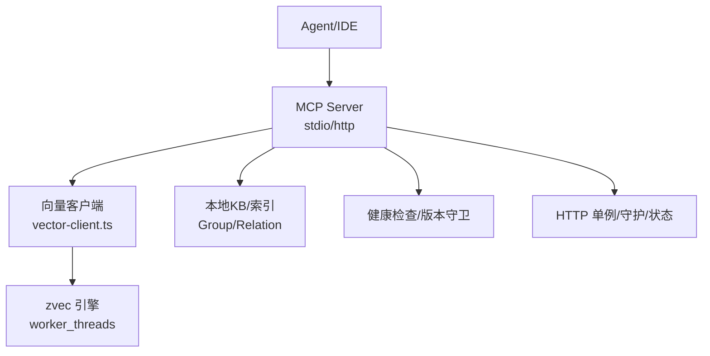
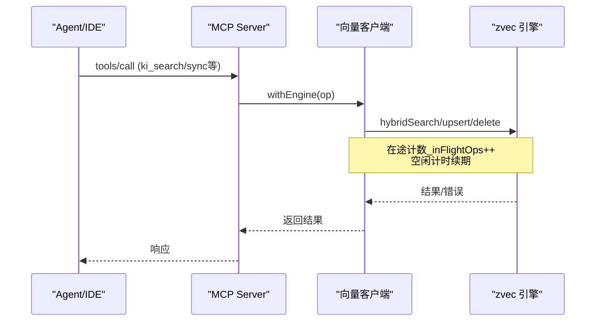
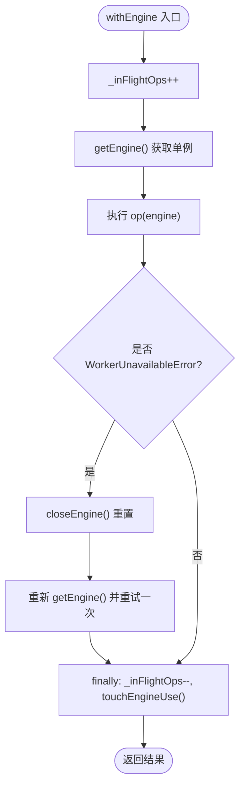
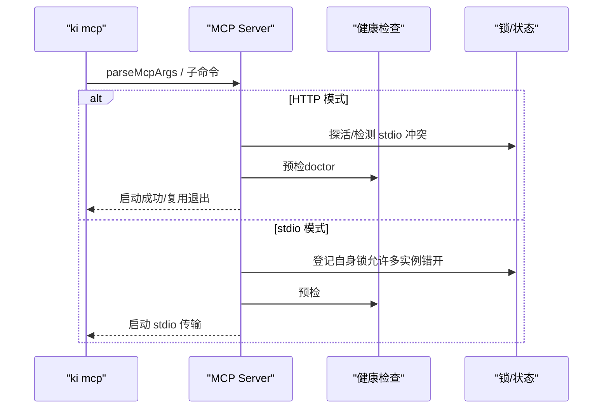
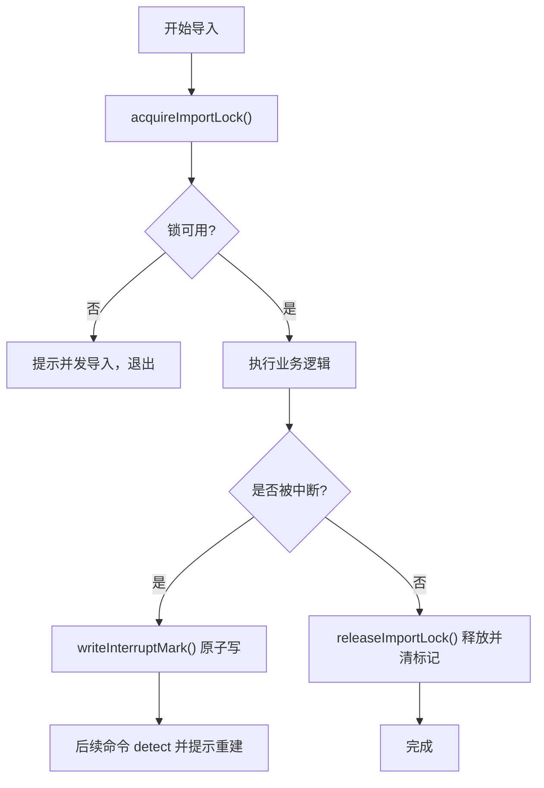
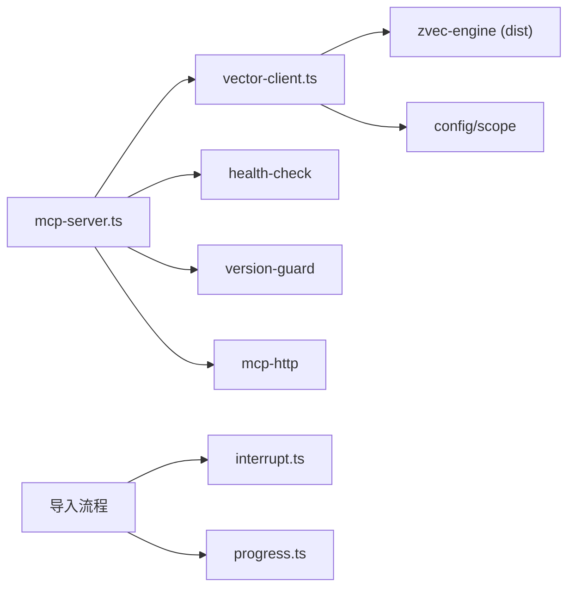

# 最佳实践与陷阱避免

<cite>
**本文引用的文件**
- [README.md](file://README.md)
- [AGENTS.md](file://AGENTS.md)
- [CLAUDE.md](file://CLAUDE.md)
- [vector-client.ts](file://src/lib/vector-client.ts)
- [mcp-server.ts](file://src/mcp-server.ts)
- [error-handling.md](file://docs/error-handling.md)
- [workflows.md](file://docs/workflows.md)
- [progress.ts](file://src/lib/progress.ts)
- [interrupt.ts](file://src/lib/interrupt.ts)
</cite>

## 目录
1. [引言](#引言)
2. [项目结构](#项目结构)
3. [核心组件](#核心组件)
4. [架构总览](#架构总览)
5. [详细组件分析](#详细组件分析)
6. [依赖关系分析](#依赖关系分析)
7. [性能考量](#性能考量)
8. [故障排查指南](#故障排查指南)
9. [结论](#结论)
10. [附录](#附录)

## 引言
本指南面向 Agent 技能开发者，基于仓库中已验证的实现与修复记录，总结在错误处理、资源管理、并发控制、安全与权限、日志与可观测性等方面的最佳实践，并给出常见陷阱（内存泄漏、死锁、竞态条件）的预防与修复方法，以及性能优化建议与监控指标定义。内容以代码级事实为依据，配合流程图与时序图帮助快速理解与落地。

## 项目结构
本项目围绕“结构化知识索引 + 向量语义检索”的双通道能力构建，关键路径包括：
- MCP 服务启动与工具注册（stdio/http），提供统一的 Agent 接入面
- 向量客户端封装（zvec 引擎代理、空闲释放锁、撞锁重试、在途保护）
- 导入/同步/查询工作流（Group/Relation/原文交付）
- 健康检查、版本守卫、进程守护与多实例协调
- 进度展示与中断标记（导入中断恢复）

图表来源
- [mcp-server.ts:492-733](file://src/mcp-server.ts#L492-L733)
- [vector-client.ts:183-407](file://src/lib/vector-client.ts#L183-L407)

章节来源
- [README.md:35-103](file://README.md#L35-L103)
- [mcp-server.ts:492-733](file://src/mcp-server.ts#L492-L733)
- [vector-client.ts:183-407](file://src/lib/vector-client.ts#L183-L407)

## 核心组件
- 向量客户端（vector-client.ts）
  - 进程内引擎单例、串行化 open/create/close、撞锁重试、空闲释放锁、在途计数保护、Worker 不可用自愈
  - 统一检索/存储/删除/枚举接口，按 scope/tag 过滤
- MCP 服务器（mcp-server.ts）
  - stdio/http 双模式、HTTP 共享单例、守护进程、restart、status、token 管理、预检与健康检查
  - 工具注册与鉴权入口（scope 越权校验）
- 导入与中断（interrupt.ts, progress.ts）
  - 导入中断标记与并发导入锁、原子写、pid 存活检测
  - 控制台进度条输出（stderr），不污染 stdout JSON
- 文档与工作流（error-handling.md, workflows.md）
  - 常见错误分类与恢复步骤、典型工作流（手工沉淀/运行时闭环/外部知识库导入）

章节来源
- [vector-client.ts:1-754](file://src/lib/vector-client.ts#L1-L754)
- [mcp-server.ts:1-741](file://src/mcp-server.ts#L1-L741)
- [interrupt.ts:1-141](file://src/lib/interrupt.ts#L1-L141)
- [progress.ts:1-62](file://src/lib/progress.ts#L1-L62)
- [error-handling.md:1-153](file://docs/error-handling.md#L1-L153)
- [workflows.md:1-162](file://docs/workflows.md#L1-L162)

## 架构总览
下图展示了 Agent 通过 MCP 调用工具，进入向量检索/写入流程，并在常驻模式下启用空闲释放锁与撞锁重试，确保多实例错开共享向量库。

图表来源
- [mcp-server.ts:492-733](file://src/mcp-server.ts#L492-L733)
- [vector-client.ts:389-407](file://src/lib/vector-client.ts#L389-L407)

## 详细组件分析

### 向量客户端：并发、资源与自愈
- 并发与锁
  - 串行化引擎操作（_engineOpTail）避免同进程并发 open/close 导致原生阻塞
  - 撞锁重试（probeWithRetry）：检测到 locked 时等待并重试，最多 3 次
  - 空闲释放锁（enableIdleClose）：常驻 MCP 启用，空闲超时自动 closeEngine，让其他实例抢占
- 在途保护与自愈
  - withEngine 包装所有 engine 使用点，维护 _inFlightOps，防止 embedding 网络阶段被 idle close 打断
  - WorkerUnavailableError 捕获后 closeEngine 重开并重试一次
- 资源管理
  - getEngine/closeEngine 成对使用；CLI per-call 结束必须关闭，避免 worker 悬挂
  - 打开/创建带超时（ENGINE_OPEN_TIMEOUT_MS），失败重置缓存，后续调用自愈
- 数据隔离
  - scope/tag 字段过滤；docId 由 text+scope+tag 生成，幂等 upsert

图表来源
- [vector-client.ts:389-407](file://src/lib/vector-client.ts#L389-L407)
- [vector-client.ts:183-216](file://src/lib/vector-client.ts#L183-L216)
- [vector-client.ts:93-104](file://src/lib/vector-client.ts#L93-L104)
- [vector-client.ts:164-181](file://src/lib/vector-client.ts#L164-L181)

章节来源
- [vector-client.ts:1-754](file://src/lib/vector-client.ts#L1-L754)

### MCP 服务器：启动守卫、守护与鉴权
- 启动守卫
  - HTTP 模式：探活复用已有健康实例；检测并拒绝与 stdio 并存（争抢向量库锁）
  - stdio 模式：检测已有 HTTP 单例则拒绝启动，引导迁移 URL 接入
- 守护与重启
  - daemon 后台常驻；restart 子命令 stop + 后台重启，host/port/web 延续上次运行值
  - status 探测目标对齐 restart 语义（CLI > lock > 配置 > 默认）
- 鉴权与 RBAC
  - 非回环绑定强制 Token；支持多 Token + scope 授权集合
  - 工具层按 authScopes 过滤输出（如 scope_list/manage_index_list）

图表来源
- [mcp-server.ts:492-733](file://src/mcp-server.ts#L492-L733)
- [mcp-server.ts:137-212](file://src/mcp-server.ts#L137-L212)
- [mcp-server.ts:410-490](file://src/mcp-server.ts#L410-L490)

章节来源
- [mcp-server.ts:1-741](file://src/mcp-server.ts#L1-L741)

### 导入中断与并发锁：防丢失与可恢复
- 中断标记
  - SIGINT/SIGTERM 时写入 import-interrupt.json（含进度/时间/信号），向量命令前置检测并给出恢复引导
  - 生命周期：rebuild-vector/restore/import 成功后清除
- 并发导入锁
  - .import.lock 记录 pid+startedAt；pid 不存在或损坏视为残留，自动清理
  - 正常完成释放锁并清除中断标记

图表来源
- [interrupt.ts:44-78](file://src/lib/interrupt.ts#L44-L78)
- [interrupt.ts:92-130](file://src/lib/interrupt.ts#L92-L130)

章节来源
- [interrupt.ts:1-141](file://src/lib/interrupt.ts#L1-L141)

### 进度与日志：不污染 JSON 的可观测输出
- 进度条与阶段信息输出到 stderr，保证 stdout 仅承载 JSON 结果
- TTY 下覆盖行显示进度，非 TTY 逐行输出便于管道/文件采集

章节来源
- [progress.ts:1-62](file://src/lib/progress.ts#L1-L62)

## 依赖关系分析
- MCP 服务器依赖向量客户端、健康检查、版本守卫、HTTP 单例与锁管理
- 向量客户端依赖 zvec 引擎（dist 产物）、配置加载、scope 校验、中断引导
- 导入流程依赖中断模块与进度模块，保障可恢复性与可观测性

图表来源
- [mcp-server.ts:1-741](file://src/mcp-server.ts#L1-L741)
- [vector-client.ts:1-754](file://src/lib/vector-client.ts#L1-L754)
- [interrupt.ts:1-141](file://src/lib/interrupt.ts#L1-L141)
- [progress.ts:1-62](file://src/lib/progress.ts#L1-L62)

章节来源
- [mcp-server.ts:1-741](file://src/mcp-server.ts#L1-L741)
- [vector-client.ts:1-754](file://src/lib/vector-client.ts#L1-L754)
- [interrupt.ts:1-141](file://src/lib/interrupt.ts#L1-L141)
- [progress.ts:1-62](file://src/lib/progress.ts#L1-L62)

## 性能考量
- 向量引擎访问
  - 使用 withEngine 包装所有操作，避免 idle close 竞态导致的“worker not open”
  - 撞锁重试降低多实例竞争带来的失败率；空闲释放锁提升整体吞吐
  - 打开/创建带超时，防止底层挂死影响自愈
- 批量与限流
  - 批量存储减少网络/IO 往返；大库扫描限制 LIST_ALL_LIMIT，避免全量拖垮
- 并发控制
  - 引擎操作串行化避免原生竞态；导入并发锁避免重复导入
- 建议指标
  - 向量层：engine 打开耗时、重试次数、idle close 触发次数、withEngine 在途计数峰值
  - 导入层：中断标记出现次数、锁竞争次数、阶段耗时、进度完成率
  - 服务层：HTTP 请求延迟、鉴权失败次数、健康检查失败项数

[本节为通用指导，无需特定文件引用]

## 故障排查指南
- 参数与范围
  - 非法 scope、缺失参数会快速失败并提示有效值与下一步
- 数据文件
  - relations-cache/group-index 损坏或缺失时，优先从备份恢复或重新初始化
- 导入相关
  - sourceDir 不存在/无 md 文件/--group 为空等均有明确恢复指引
- 增量导入
  - 删除失败记录 warning 继续；relations-cache 未找到 sourcePath 时跳过并继续清理 KB
- 推荐排障顺序
  - 参数 → scope → 路径 → 运行时数据 → 工作流顺序

章节来源
- [error-handling.md:1-153](file://docs/error-handling.md#L1-L153)

## 结论
- 将“在途保护 + 空闲释放锁 + 撞锁重试”作为向量访问基线，可显著降低多实例场景下的失败与阻塞
- 通过“导入中断标记 + 并发锁 + 原子写”实现可恢复的导入流程，避免部分完成导致的脏状态
- MCP 启动守卫与鉴权策略确保服务在多实例、多 Token 环境下稳定与安全
- 日志与进度输出遵循“stderr 用于诊断，stdout 仅承载 JSON”的约定，便于自动化采集与分析

[本节为总结，无需特定文件引用]

## 附录
- 典型工作流参考：手工沉淀、运行时查询闭环、外部知识库导入（推荐流程）
- 设计约束与原则：fail-loud、幂等安全、WAL 原子写入、快速失败、异常恢复

章节来源
- [workflows.md:1-162](file://docs/workflows.md#L1-L162)
- [README.md:384-393](file://README.md#L384-L393)