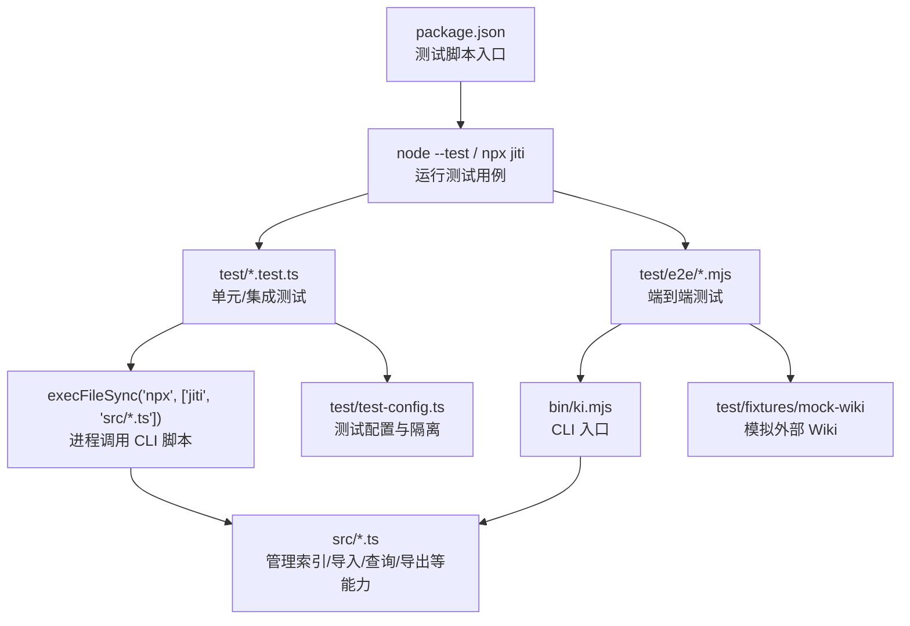
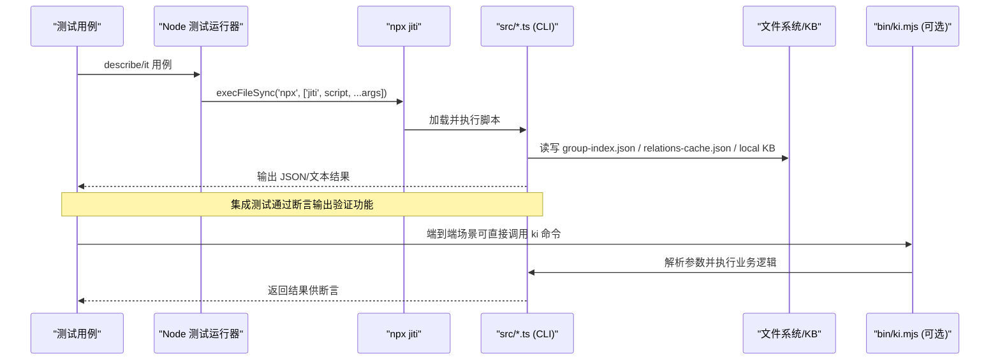
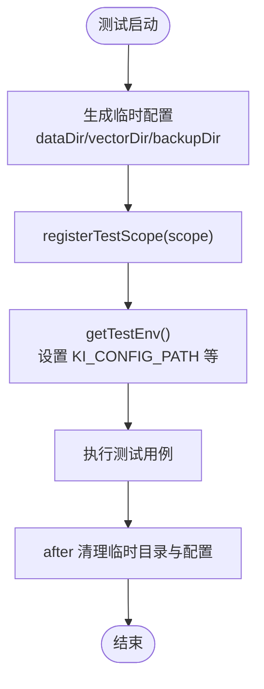
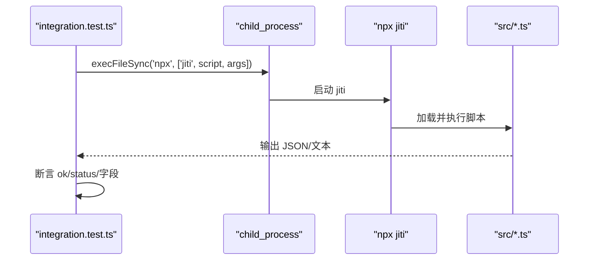
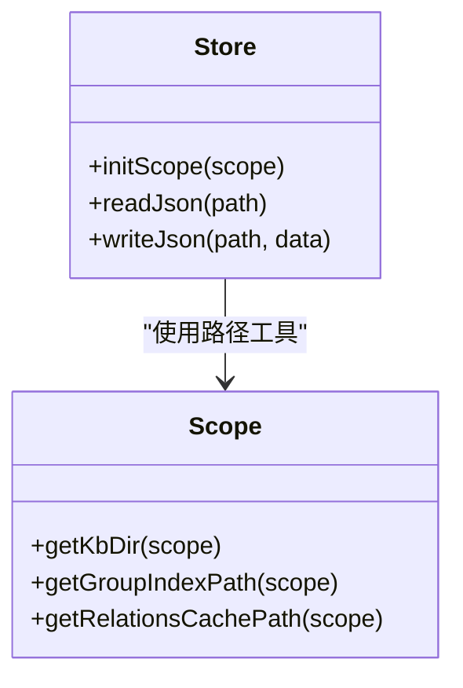
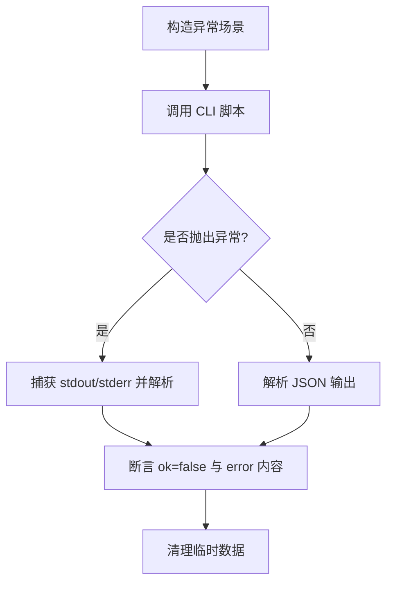
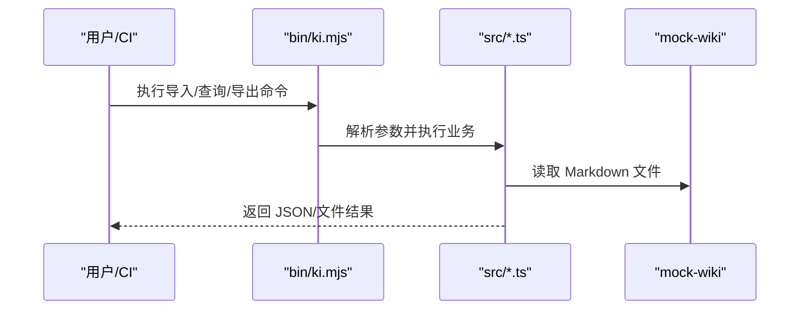
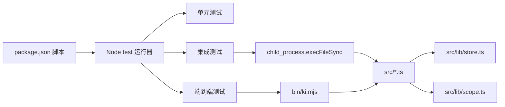

# 技能测试与调试

<cite>
**本文引用的文件**
- [package.json](file://package.json)
- [test/test-config.ts](file://test/test-config.ts)
- [test/integration.test.ts](file://test/integration.test.ts)
- [test/manage-index.test.ts](file://test/manage-index.test.ts)
- [test/error-handling.test.ts](file://test/error-handling.test.ts)
- [test/e2e-guide.md](file://test/e2e-guide.md)
- [test/fixtures/mock-wiki/README.md](file://test/fixtures/mock-wiki/README.md)
- [src/lib/store.ts](file://src/lib/store.ts)
- [src/lib/scope.ts](file://src/lib/scope.ts)
- [bin/ki.mjs](file://bin/ki.mjs)
</cite>

## 目录
1. [简介](#简介)
2. [项目结构](#项目结构)
3. [核心组件](#核心组件)
4. [架构总览](#架构总览)
5. [详细组件分析](#详细组件分析)
6. [依赖关系分析](#依赖关系分析)
7. [性能考虑](#性能考虑)
8. [故障排查指南](#故障排查指南)
9. [结论](#结论)
10. [附录](#附录)

## 简介
本指南面向 Agent 技能的测试与调试，覆盖单元测试、集成测试与端到端测试的编写方法、执行流程、环境模拟、日志与错误定位、性能优化建议，以及覆盖率与质量门禁的实践。文档基于仓库现有测试体系（Node.js 内置 test 运行器、jiti 直跑脚本、CLI 命令驱动）和端到端验证指南，提供可操作的步骤与最佳实践。

## 项目结构
测试相关的关键位置与职责：
- 根级 package.json 定义测试脚本与运行方式，统一入口为 node --test 或 npx jiti 调用具体脚本。
- test 目录下包含：
  - 单元测试与集成测试：以 .test.ts/.test.mjs 命名，使用 Node.js 内置 test 框架与 assert。
  - e2e 子目录：端到端网络/真实环境用例。
  - fixtures/mock-wiki：用于端到端导入与增量差异的模拟 Wiki 数据。
  - test-config.ts：测试配置隔离、临时 scope 注册、环境变量清理等基础设施。
- src 下的 CLI 脚本通过 npx jiti 直接执行，测试通过 child_process.execFileSync 调用这些脚本，形成“进程级”集成测试。
- bin/ki.mjs 是对外 CLI 入口，端到端手册也围绕该入口进行验证。

图示来源
- [package.json:9-32](file://package.json#L9-L32)
- [test/integration.test.ts:11-31](file://test/integration.test.ts#L11-L31)
- [test/e2e-guide.md:27-81](file://test/e2e-guide.md#L27-L81)

章节来源
- [package.json:9-32](file://package.json#L9-L32)
- [test/integration.test.ts:11-31](file://test/integration.test.ts#L11-L31)
- [test/e2e-guide.md:27-81](file://test/e2e-guide.md#L27-L81)

## 核心组件
- 测试运行器与脚本编排
  - 使用 Node.js 内置 test 运行器（describe/it），并通过 npm scripts 聚合执行。
  - 通过 npx jiti 直接运行 TypeScript 源脚本，避免额外编译步骤，便于快速迭代。
- 测试配置与隔离
  - test-config.ts 动态创建临时配置文件，设置 dataDir/vectorDir/backupDir 指向临时目录，确保测试互不干扰。
  - registerTestScope 将随机 scope 名写入临时配置；getTestEnv 剥离 IDE 注入的环境变量，保证子进程行为一致。
- 集成测试模式
  - 通过 execFileSync 调用 src 下的 CLI 脚本（如 manage-index.ts、sync-relation.ts、query-group.ts、scan-kb.ts），断言 JSON 输出或文本输出，覆盖完整链路。
- 端到端测试
  - 基于 test/e2e-guide.md 提供的真实环境验证流程，使用 test/fixtures/mock-wiki 作为外部 wiki 输入，验证导入、查询、导出、增量差异等全链路。

章节来源
- [package.json:9-32](file://package.json#L9-L32)
- [test/test-config.ts:1-92](file://test/test-config.ts#L1-L92)
- [test/integration.test.ts:11-31](file://test/integration.test.ts#L11-L31)
- [test/e2e-guide.md:27-81](file://test/e2e-guide.md#L27-L81)

## 架构总览
下图展示从测试到 CLI 再到核心能力的调用链路与数据流。

图示来源
- [test/integration.test.ts:21-40](file://test/integration.test.ts#L21-L40)
- [test/e2e-guide.md:84-113](file://test/e2e-guide.md#L84-L113)
- [package.json:9-32](file://package.json#L9-L32)

## 详细组件分析

### 测试配置与隔离（test-config.ts）
- 作用：为每个测试进程生成独立配置文件，避免污染用户默认数据目录；动态注册 scope；清理临时资源。
- 关键点：
  - 临时目录隔离：dataDir/vectorDir/backupDir 指向临时路径。
  - 环境变量控制：设置 KI_CONFIG_PATH，剥离 IDE 注入的 NODE_OPTIONS 等。
  - 生命周期：before/after 中初始化与清理 scope 与临时目录。

图示来源
- [test/test-config.ts:15-47](file://test/test-config.ts#L15-L47)
- [test/test-config.ts:49-92](file://test/test-config.ts#L49-L92)

章节来源
- [test/test-config.ts:15-92](file://test/test-config.ts#L15-L92)

### 集成测试（integration.test.ts）
- 覆盖范围：快速路径（manage-index → sync-relation → query-group → get-module-info）、检索回退路径、知识缺失路径、导入路径（scan-kb import --source）。
- 实现要点：
  - 通过 runScript/runScriptJson 封装子进程调用，统一处理 stdout 与异常。
  - 使用 makeScopeInit 初始化 scope 并自动注册。
  - after 钩子清理创建的 scope 与临时目录。

图示来源
- [test/integration.test.ts:21-40](file://test/integration.test.ts#L21-L40)
- [test/integration.test.ts:82-211](file://test/integration.test.ts#L82-L211)
- [test/integration.test.ts:319-356](file://test/integration.test.ts#L319-L356)

章节来源
- [test/integration.test.ts:21-40](file://test/integration.test.ts#L21-L40)
- [test/integration.test.ts:82-211](file://test/integration.test.ts#L82-L211)
- [test/integration.test.ts:319-356](file://test/integration.test.ts#L319-L356)

### 管理索引测试（manage-index.test.ts）
- 覆盖范围：Group 树 CRUD、旧格式迁移、冲突 key 合并、非法 scope 校验。
- 实现要点：
  - 通过 initScope/readJson/writeJson 直接操作存储层，验证数据结构。
  - 构造旧格式数据触发迁移逻辑，断言迁移后结构与键值正确性。

图示来源
- [test/manage-index.test.ts:72-164](file://test/manage-index.test.ts#L72-L164)
- [test/manage-index.test.ts:166-391](file://test/manage-index.test.ts#L166-L391)

章节来源
- [test/manage-index.test.ts:72-164](file://test/manage-index.test.ts#L72-L164)
- [test/manage-index.test.ts:166-391](file://test/manage-index.test.ts#L166-L391)

### 错误处理测试（error-handling.test.ts）
- 覆盖范围：参数校验、Group 树异常、Relations 缓存异常、本地 KB 异常、导入异常。
- 实现要点：
  - 通过 runJson/getOut 封装 CLI 调用，断言 ok=false 及 error 信息。
  - 构造损坏文件、缺失目录等边界条件，验证系统健壮性。

图示来源
- [test/error-handling.test.ts:15-30](file://test/error-handling.test.ts#L15-L30)
- [test/error-handling.test.ts:45-174](file://test/error-handling.test.ts#L45-L174)

章节来源
- [test/error-handling.test.ts:45-174](file://test/error-handling.test.ts#L45-L174)

### 端到端测试（e2e-guide.md）
- 覆盖范围：全量导入、增量差异检测、查询、导出、备份还原等真实环境流程。
- 实现要点：
  - 使用 test/fixtures/mock-wiki 作为外部 wiki，无需真实仓库即可验证。
  - 通过 bin/ki.mjs 执行各命令，检查输出 JSON 与文件结构。

图示来源
- [test/e2e-guide.md:27-81](file://test/e2e-guide.md#L27-L81)
- [test/e2e-guide.md:178-273](file://test/e2e-guide.md#L178-L273)
- [test/e2e-guide.md:667-715](file://test/e2e-guide.md#L667-L715)

章节来源
- [test/e2e-guide.md:27-81](file://test/e2e-guide.md#L27-L81)
- [test/e2e-guide.md:178-273](file://test/e2e-guide.md#L178-L273)
- [test/e2e-guide.md:667-715](file://test/e2e-guide.md#L667-L715)

## 依赖关系分析
- 测试与运行器
  - 使用 Node.js 内置 test 运行器，无第三方测试框架依赖。
  - 通过 npm scripts 聚合执行，支持单测、集成、E2E 分类运行。
- 测试与源码
  - 集成测试通过 child_process 调用 src 下脚本，形成进程级隔离。
  - 端到端测试通过 bin/ki.mjs 调用相同逻辑，覆盖真实 CLI 行为。
- 测试与存储
  - 通过 src/lib/store.ts 与 src/lib/scope.ts 提供的路径与读写接口，验证 group-index.json、relations-cache.json、local KB 的结构与内容。

图示来源
- [package.json:9-32](file://package.json#L9-L32)
- [test/integration.test.ts:21-40](file://test/integration.test.ts#L21-L40)
- [test/e2e-guide.md:84-113](file://test/e2e-guide.md#L84-L113)

章节来源
- [package.json:9-32](file://package.json#L9-L32)
- [test/integration.test.ts:21-40](file://test/integration.test.ts#L21-L40)
- [test/e2e-guide.md:84-113](file://test/e2e-guide.md#L84-L113)

## 性能考虑
- 测试隔离与磁盘 IO
  - 使用临时目录隔离 KB、向量库与备份，避免磁盘竞争与数据污染。
  - 在 after 钩子中及时清理，减少残留文件对后续测试的影响。
- 子进程开销
  - 集成测试通过子进程调用 CLI，存在启动开销；建议按模块分组执行，减少重复初始化。
- 向量化与外部服务
  - 端到端搜索与向量化依赖 memory 服务；在无服务时应跳过或降级验证，避免阻塞流水线。
- 增量差异检测
  - 增量导入基于 git diff，需确保 mock-wiki 为 git 仓库且提交变更；否则无法产生差异。

[本节为通用指导，不直接分析具体文件]

## 故障排查指南
- 常见错误与定位
  - 非法 scope 字符或路径遍历：检查参数校验逻辑，确认拒绝非法输入。
  - Group 不存在或损坏：验证 group-index.json 是否存在且合法；查询空组应返回“暂无 Relations”。
  - Relations 缓存缺失：确认 relations-cache.json 存在；缺失时应报错并提示。
  - 本地 KB 缺失：get-module-info 应返回错误并包含“KB”相关信息。
  - 导入异常：source 目录不存在、无 .md 文件等情况应有明确错误信息。
- 日志与输出
  - 集成测试通过 stdout 输出 JSON 或文本，失败时捕获 stderr/stdout 并解析。
  - 端到端测试依据 e2e-guide.md 的步骤逐项检查输出与文件结构。
- 清理与恢复
  - 使用 test-config.ts 的 cleanupTestConfig 与 after 钩子清理临时数据。
  - 若出现 WAL 锁残留或子进程挂起，检查并移除临时目录与锁文件。

章节来源
- [test/error-handling.test.ts:45-174](file://test/error-handling.test.ts#L45-L174)
- [test/integration.test.ts:214-317](file://test/integration.test.ts#L214-L317)
- [test/test-config.ts:69-92](file://test/test-config.ts#L69-L92)

## 结论
本项目采用 Node.js 内置测试运行器与进程级集成测试，结合端到端验证指南，形成了从单元到 E2E 的完整测试体系。通过 test-config.ts 实现测试隔离，通过集成测试覆盖核心链路，通过端到端测试验证真实环境行为。建议在 CI 中分层执行：快速单元/集成测试优先，E2E 按需启用；对依赖外部服务的用例进行条件跳过或降级，确保流水线稳定。

[本节为总结，不直接分析具体文件]

## 附录

### 测试执行清单
- 单元测试
  - 运行单个测试：参考 package.json 中的 test:* 脚本。
  - 运行全部单元/集成测试：使用 test:all。
- 端到端测试
  - 按照 test/e2e-guide.md 的步骤准备环境与数据，逐步执行导入、查询、导出、增量差异等命令。
- 覆盖率与质量门禁
  - 当前仓库未引入覆盖率统计工具；可在 CI 中引入覆盖率报告（如 c8/nyc）并设置阈值。
  - 建议在 PR 中强制运行关键用例（集成+E2E），并对新增/修改模块补充对应测试。

章节来源
- [package.json:9-32](file://package.json#L9-L32)
- [test/e2e-guide.md:27-81](file://test/e2e-guide.md#L27-L81)

### 模拟不同运行环境与输入场景
- 离线/在线切换
  - 通过环境变量控制 embedding 配置；无密钥时走 fail-loud，向量化相关用例可跳过。
- 多 scope 隔离
  - 使用 registerTestScope 为每个测试创建独立 scope，避免相互影响。
- 外部 Wiki 模拟
  - 使用 test/fixtures/mock-wiki 作为输入，支持全量与增量两种导入模式。

章节来源
- [test/test-config.ts:24-47](file://test/test-config.ts#L24-L47)
- [test/fixtures/mock-wiki/README.md:1-15](file://test/fixtures/mock-wiki/README.md#L1-L15)
- [test/e2e-guide.md:71-81](file://test/e2e-guide.md#L71-L81)