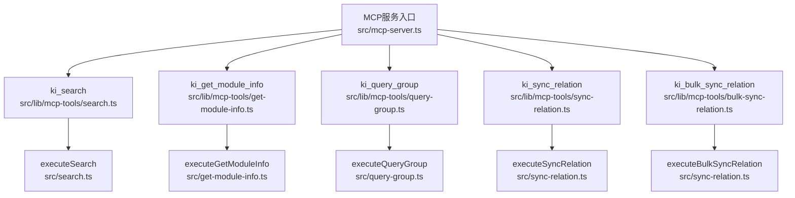
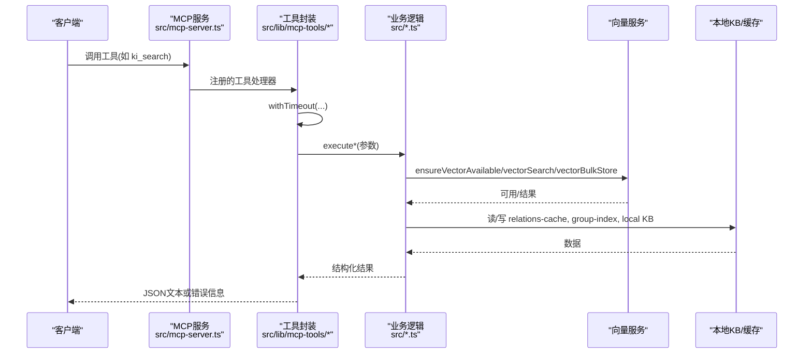
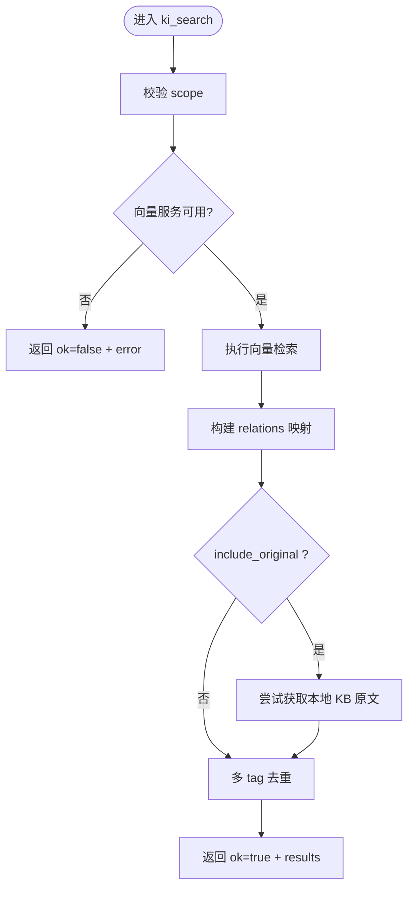
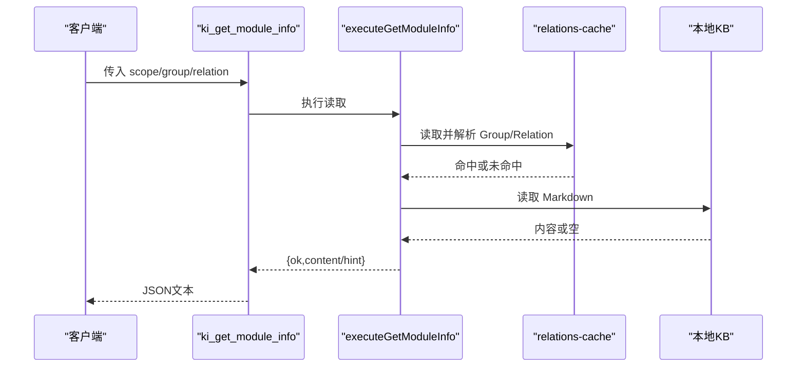
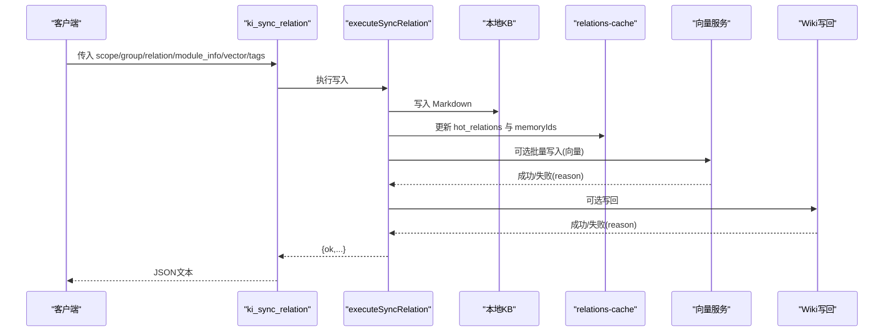
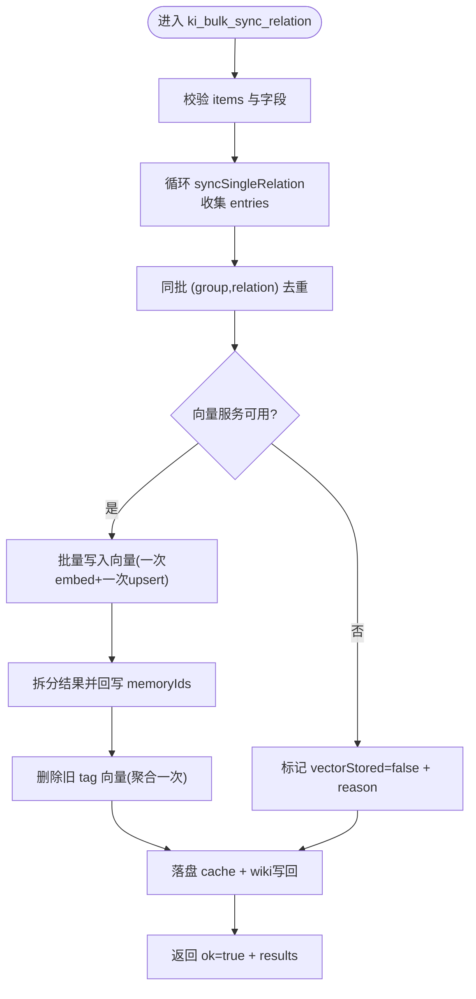
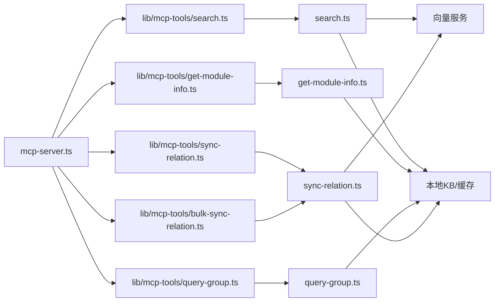

# MCP工具调用指南

<cite>
**本文引用的文件**
- [mcp-server.ts](file://src/mcp-server.ts)
- [search.ts](file://src/search.ts)
- [get-module-info.ts](file://src/get-module-info.ts)
- [query-group.ts](file://src/query-group.ts)
- [sync-relation.ts](file://src/sync-relation.ts)
- [lib/mcp-tools/search.ts](file://src/lib/mcp-tools/search.ts)
- [lib/mcp-tools/get-module-info.ts](file://src/lib/mcp-tools/get-module-info.ts)
- [lib/mcp-tools/query-group.ts](file://src/lib/mcp-tools/query-group.ts)
- [lib/mcp-tools/sync-relation.ts](file://src/lib/mcp-tools/sync-relation.ts)
- [lib/mcp-tools/bulk-sync-relation.ts](file://src/lib/mcp-tools/bulk-sync-relation.ts)
</cite>

## 目录
1. [简介](#简介)
2. [项目结构](#项目结构)
3. [核心组件](#核心组件)
4. [架构总览](#架构总览)
5. [详细组件分析](#详细组件分析)
6. [依赖关系分析](#依赖关系分析)
7. [性能与批量操作建议](#性能与批量操作建议)
8. [故障排查指南](#故障排查指南)
9. [结论](#结论)
10. [附录：参数与返回模型速查](#附录参数与返回模型速查)

## 简介
本指南面向通过MCP协议调用知识索引服务的开发者，聚焦以下核心工具的参数配置、使用场景、返回值处理与错误处理：
- ki_search：语义检索知识库内容（支持标签过滤、相似度阈值、可选原文召回）
- ki_get_module_info：读取指定 Group 下某个 Relation 的本地 KB Markdown 内容
- ki_query_group：查询 Group 树 + Relations + 词云，支持向量语义兜底
- ki_sync_relation / ki_bulk_sync_relation：写入/更新 Relation 到本地 KB 与向量层（单条与批量）

文档同时说明工具间的协作关系与数据传递方式，并提供批量操作最佳实践与性能优化建议。

## 项目结构
MCP服务入口负责注册所有工具，各工具通过统一的withTimeout包装执行对应业务逻辑，最终返回结构化结果。核心路径如下：
- MCP服务启动与工具注册：src/mcp-server.ts
- 工具实现（MCP封装）：src/lib/mcp-tools/*
- 业务逻辑实现：src/search.ts、src/get-module-info.ts、src/query-group.ts、src/sync-relation.ts

图表来源
- [mcp-server.ts:54-70](file://src/mcp-server.ts#L54-L70)
- [lib/mcp-tools/search.ts:6-49](file://src/lib/mcp-tools/search.ts#L6-L49)
- [lib/mcp-tools/get-module-info.ts:6-37](file://src/lib/mcp-tools/get-module-info.ts#L6-L37)
- [lib/mcp-tools/query-group.ts:6-53](file://src/lib/mcp-tools/query-group.ts#L6-L53)
- [lib/mcp-tools/sync-relation.ts:6-43](file://src/lib/mcp-tools/sync-relation.ts#L6-L43)
- [lib/mcp-tools/bulk-sync-relation.ts:6-42](file://src/lib/mcp-tools/bulk-sync-relation.ts#L6-L42)

章节来源
- [mcp-server.ts:54-70](file://src/mcp-server.ts#L54-L70)

## 核心组件
- ki_search：基于向量检索的语义搜索，支持scope隔离、limit/threshold/tags过滤、可选原文召回与多tag去重。
- ki_get_module_info：按group+relation定位并读取本地KB中的Markdown内容，自动更新评分。
- ki_query_group：聚合Group树、Relations热度分区（热/常温/冷/新兴热），支持full模式递归展示与语义兜底。
- ki_sync_relation：单条写入Relation与本地KB，可选择是否向量化；支持自定义tags。
- ki_bulk_sync_relation：批量写入Relation与本地KB，一次embedding+一次向量写入，具备同批去重、部分失败容错、wiki写回等能力。

章节来源
- [lib/mcp-tools/search.ts:6-49](file://src/lib/mcp-tools/search.ts#L6-L49)
- [lib/mcp-tools/get-module-info.ts:6-37](file://src/lib/mcp-tools/get-module-info.ts#L6-L37)
- [lib/mcp-tools/query-group.ts:6-53](file://src/lib/mcp-tools/query-group.ts#L6-L53)
- [lib/mcp-tools/sync-relation.ts:6-43](file://src/lib/mcp-tools/sync-relation.ts#L6-L43)
- [lib/mcp-tools/bulk-sync-relation.ts:6-42](file://src/lib/mcp-tools/bulk-sync-relation.ts#L6-L42)

## 架构总览
MCP工具调用链路统一经过withTimeout包装，调用各自execute*函数完成业务逻辑，再返回标准JSON文本。向量服务可用性检测、Group路径解析、本地KB读写、Wiki写回等由底层模块提供。

图表来源
- [mcp-server.ts:54-70](file://src/mcp-server.ts#L54-L70)
- [lib/mcp-tools/search.ts:6-49](file://src/lib/mcp-tools/search.ts#L6-L49)
- [search.ts:70-199](file://src/search.ts#L70-L199)
- [sync-relation.ts:407-786](file://src/sync-relation.ts#L407-L786)

## 详细组件分析

### ki_search：语义检索
- 作用：在指定scope内执行语义检索，支持标签过滤、相似度阈值、可选原文召回。
- 关键参数
  - scope：项目隔离标识（默认default；strict模式下必填且需白名单）
  - query：自然语言查询文本
  - limit：返回条数上限（默认10）
  - threshold：相似度阈值（0-1，默认不过滤）
  - tags：过滤标签（不传则搜索全部；多个逗号分隔，OR组合）
  - include_original：是否返回local KB文件级原文（默认false）
- 返回值
  - ok=true：包含scope与results数组（每项含memoryId、score、content、可选group/relation/original等）
  - ok=false：error描述，可能带degraded标志
- 错误处理
  - 向量服务不可用：返回ok=false并提示原因
  - 超时：由withTimeout统一拦截，返回错误文本
- 典型流程
  - 校验scope → 检测向量服务 → 执行向量检索 → 构建relations映射 → 可选原文召回 → 多tag去重 → 返回

图表来源
- [lib/mcp-tools/search.ts:6-49](file://src/lib/mcp-tools/search.ts#L6-L49)
- [search.ts:70-199](file://src/search.ts#L70-L199)

章节来源
- [lib/mcp-tools/search.ts:6-49](file://src/lib/mcp-tools/search.ts#L6-L49)
- [search.ts:70-199](file://src/search.ts#L70-L199)

### ki_get_module_info：读取模块信息
- 作用：根据group与relation读取本地KB中的Markdown内容，并更新该relation的使用评分。
- 关键参数
  - scope：项目隔离标识（默认default；strict模式下必填）
  - group：Group路径（支持向量语义兜底）
  - relation：Relation名称（精确匹配）
- 返回值
  - ok=true：包含scope与content（Markdown文本），可能附带hint
  - ok=false：error描述与hint（如relations-cache缺失、Group未匹配、Relation不存在、本地KB缺失等）
- 错误处理
  - 若relations-cache.json不存在：提示先执行sync-relation
  - 若Group/Relation未匹配：给出可用Relation列表或近似匹配提示
  - 若本地KB缺失：给出修复指引（重新写入或检查导入完整性）

图表来源
- [lib/mcp-tools/get-module-info.ts:6-37](file://src/lib/mcp-tools/get-module-info.ts#L6-L37)
- [get-module-info.ts:61-167](file://src/get-module-info.ts#L61-L167)

章节来源
- [lib/mcp-tools/get-module-info.ts:6-37](file://src/lib/mcp-tools/get-module-info.ts#L6-L37)
- [get-module-info.ts:61-167](file://src/get-module-info.ts#L61-L167)

### ki_query_group：查询Group与Relations
- 作用：查询Group树与Relations，支持热门/常温/冷/新兴热分区展示，full模式可递归子Group；当Group未命中时支持语义兜底。
- 关键参数
  - scope：项目隔离标识（默认default；strict模式下必填）
  - groups：逗号分隔的Group路径列表（支持模糊匹配）
  - hot_count：热门展示个数（默认5）
  - depth：索引层级深度（默认4，最大10）
  - mode：展示分区（hot|warm|cold|emerging|full，支持逗号分隔）
  - auto_fallback：是否启用语义兜底（默认开启）
- 返回值
  - ok=true：output为格式化文本（含统计、分区、树视图等）
  - ok=false：error描述
- 错误处理
  - mode为空或非法：返回错误
  - group-index.json不存在：返回错误
  - Group未命中：输出提示并可附加语义兜底结果

```mermaid
flowchart TD
Start(["进入 ki_query_group"]) --> ValidateMode["校验 mode"]
ValidateMode --> LoadData["加载 group-index / relations-cache"]
LoadData --> HasGroups{"指定 groups ?"}
HasGroups -- 是 --> Resolve["解析 Group 路径"]
Resolve --> Render["渲染 Relations + 词云/树"]
HasGroups -- 否 --> Partition["计算分区(热/常温/冷/新兴热)"]
Partition --> RenderFull["渲染全量视图 + 统计"]
Render --> ReturnOk["返回 ok=true + output"]
RenderFull --> ReturnOk
```

图表来源
- [lib/mcp-tools/query-group.ts:6-53](file://src/lib/mcp-tools/query-group.ts#L6-L53)
- [query-group.ts:611-745](file://src/query-group.ts#L611-L745)

章节来源
- [lib/mcp-tools/query-group.ts:6-53](file://src/lib/mcp-tools/query-group.ts#L6-L53)
- [query-group.ts:611-745](file://src/query-group.ts#L611-L745)

### ki_sync_relation：单条写入Relation
- 作用：写入/更新Relation到本地KB，可选择是否写入向量层（ki-search/ki-relation），支持自定义tags。
- 关键参数
  - scope：项目隔离标识（默认default；strict模式下必填）
  - group：Group路径（支持/层级嵌套）
  - relation：Relation名称
  - module_info：本地KB Markdown内容
  - vector：是否写入向量层（默认true；false仅写KB层）
  - tags：文档内容自定义标签（逗号分隔多个，叠加在默认ki-search之上）
- 返回值
  - ok=true：包含scope、relation、evicted（被挤出的旧条目）、可选vectorStored/vectorReason/wikiSynced/wikiFile等
  - ok=false：error描述
- 错误处理
  - 向量服务不可用：标记vectorStored=false并记录reason，不影响KB层
  - Wiki写回失败：记录wikiSynced=false与reason，不阻塞主流程

图表来源
- [lib/mcp-tools/sync-relation.ts:6-43](file://src/lib/mcp-tools/sync-relation.ts#L6-L43)
- [sync-relation.ts:789-800](file://src/sync-relation.ts#L789-L800)

章节来源
- [lib/mcp-tools/sync-relation.ts:6-43](file://src/lib/mcp-tools/sync-relation.ts#L6-L43)
- [sync-relation.ts:789-800](file://src/sync-relation.ts#L789-L800)

### ki_bulk_sync_relation：批量写入Relation
- 作用：批量写入/更新Relation到本地KB与向量层，一次embedding+一次向量写入，具备同批去重、部分失败容错、wiki写回等能力。
- 关键参数
  - scope：项目隔离标识（默认default；strict模式下必填）
  - items：批量条目数组（单次最多50条；超出请分批）
    - group：Group路径（支持/层级嵌套）
    - relation：Relation名称
    - module_info：本地KB Markdown内容
    - tags：文档内容自定义标签（逗号分隔多个）
  - vector：是否写入向量层（默认true；false仅写KB层）
- 返回值
  - ok=true：包含scope、total/succeeded/failed/skipped、results数组、vectorStored、hints等
  - ok=false：error描述
- 错误处理
  - 输入校验失败（缺少字段、非法relation名、空module_info）：跳过并计入skipped/failed
  - 向量服务不可用：标记vectorStored=false并记录reason，不影响KB层
  - 同批重复(group,relation)：后一条覆盖前一条，避免孤儿向量
  - 部分条目向量写入失败：保留旧向量，记录reason供后续rebuild-vector恢复

图表来源
- [lib/mcp-tools/bulk-sync-relation.ts:6-42](file://src/lib/mcp-tools/bulk-sync-relation.ts#L6-L42)
- [sync-relation.ts:407-786](file://src/sync-relation.ts#L407-L786)

章节来源
- [lib/mcp-tools/bulk-sync-relation.ts:6-42](file://src/lib/mcp-tools/bulk-sync-relation.ts#L6-L42)
- [sync-relation.ts:407-786](file://src/sync-relation.ts#L407-L786)

## 依赖关系分析
- MCP服务入口集中注册工具，确保每个工具都有统一的超时与错误包装。
- 工具封装仅做参数校验与超时控制，核心逻辑集中在业务模块中，便于复用与测试。
- 向量服务通过ensureVectorAvailable进行可用性检测，失败时降级为仅KB层写入。
- Group路径解析与本地KB读写由lib/store与lib/scope等模块提供，保证一致性。

图表来源
- [mcp-server.ts:54-70](file://src/mcp-server.ts#L54-L70)
- [lib/mcp-tools/search.ts:6-49](file://src/lib/mcp-tools/search.ts#L6-L49)
- [lib/mcp-tools/get-module-info.ts:6-37](file://src/lib/mcp-tools/get-module-info.ts#L6-L37)
- [lib/mcp-tools/query-group.ts:6-53](file://src/lib/mcp-tools/query-group.ts#L6-L53)
- [lib/mcp-tools/sync-relation.ts:6-43](file://src/lib/mcp-tools/sync-relation.ts#L6-L43)
- [lib/mcp-tools/bulk-sync-relation.ts:6-42](file://src/lib/mcp-tools/bulk-sync-relation.ts#L6-L42)

章节来源
- [mcp-server.ts:54-70](file://src/mcp-server.ts#L54-L70)

## 性能与批量操作建议
- 优先使用批量写入：ki_bulk_sync_relation将多次embedding与向量写入合并为一次，显著降低网络与worker开销。
- 合理设置limit与threshold：在ki_search中限制返回条数与相似度阈值，减少结果集大小与下游处理成本。
- 按需开启原文召回：include_original仅在需要时开启，避免额外的本地KB读取与去重逻辑。
- 控制mode与depth：在ki_query_group中使用full模式时注意depth限制，避免输出过大。
- 利用tags精准过滤：在ki_search中通过tags缩小检索范围，提高命中率与性能。
- 批量条目规模：单次items不超过50条，超过请分批调用，避免触发工具超时。
- 向量服务降级：当向量服务不可用时，仍可完成KB层写入；后续可通过rebuild-vector恢复向量索引。

[本节为通用指导，无需特定文件引用]

## 故障排查指南
- 向量服务不可用
  - 现象：ki_search返回ok=false并提示“向量检索暂不可用”；ki_sync_relation/bulk标注vectorStored=false与reason
  - 处理：检查向量服务状态，必要时重试或等待恢复；KB层写入不受影响
- Group/Relation未匹配
  - 现象：ki_get_module_info或ki_query_group返回error与hint
  - 处理：确认group-index与relations-cache已生成；必要时执行sync-relation重新写入
- 本地KB缺失
  - 现象：ki_get_module_info提示本地KB缺失
  - 处理：使用sync-relation重新写入；检查导入流程是否完整
- 批量写入部分失败
  - 现象：bulk结果中某些项vectorStored=false并带有reason
  - 处理：根据reason判断是否为去重覆盖、服务不可用或部分失败；必要时执行rebuild-vector恢复
- 超时错误
  - 现象：工具调用返回错误文本
  - 处理：检查withTimeout配置与任务复杂度；适当调整参数或分批处理

章节来源
- [search.ts:70-199](file://src/search.ts#L70-L199)
- [sync-relation.ts:407-786](file://src/sync-relation.ts#L407-L786)

## 结论
本指南系统梳理了ki_search、ki_get_module_info、ki_query_group、ki_sync_relation与ki_bulk_sync_relation等核心MCP工具的参数、返回值与错误处理，并通过流程图与序列图展示了工具间的数据流转与协作关系。实际使用中应优先采用批量写入、合理设置检索参数、按需开启原文召回，并结合向量服务状态进行降级与恢复，以获得稳定高效的调用体验。

[本节为总结性内容，无需特定文件引用]

## 附录：参数与返回模型速查
- ki_search
  - 参数：scope、query、limit、threshold、tags、include_original
  - 返回：{ok, scope, results} 或 {ok, error, degraded?}
- ki_get_module_info
  - 参数：scope、group、relation
  - 返回：{ok, scope, content, hint?} 或 {ok, error, hint?}
- ki_query_group
  - 参数：scope、groups、hot_count、depth、mode、auto_fallback
  - 返回：{ok, scope, output} 或 {ok, error}
- ki_sync_relation
  - 参数：scope、group、relation、module_info、vector、tags
  - 返回：{ok, scope, relation, evicted?, hint?, vectorPending?, vectorStored?, vectorReason?, wikiSynced?, wikiFile?, wikiReason?} 或 {ok, error}
- ki_bulk_sync_relation
  - 参数：scope、items[]、vector
  - 返回：{ok, scope, total, succeeded, failed, skipped, results[], vectorStored, hints?} 或 {ok, error}

章节来源
- [lib/mcp-tools/search.ts:6-49](file://src/lib/mcp-tools/search.ts#L6-L49)
- [lib/mcp-tools/get-module-info.ts:6-37](file://src/lib/mcp-tools/get-module-info.ts#L6-L37)
- [lib/mcp-tools/query-group.ts:6-53](file://src/lib/mcp-tools/query-group.ts#L6-L53)
- [lib/mcp-tools/sync-relation.ts:6-43](file://src/lib/mcp-tools/sync-relation.ts#L6-L43)
- [lib/mcp-tools/bulk-sync-relation.ts:6-42](file://src/lib/mcp-tools/bulk-sync-relation.ts#L6-L42)
- [search.ts:70-199](file://src/search.ts#L70-L199)
- [sync-relation.ts:407-786](file://src/sync-relation.ts#L407-L786)