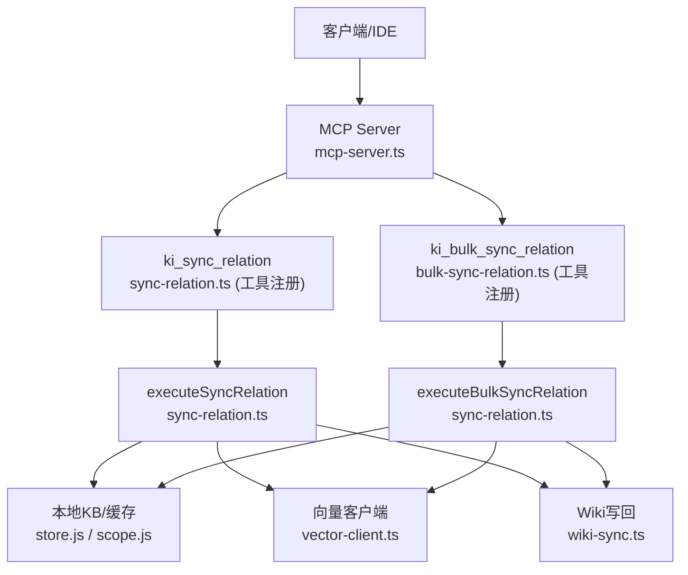
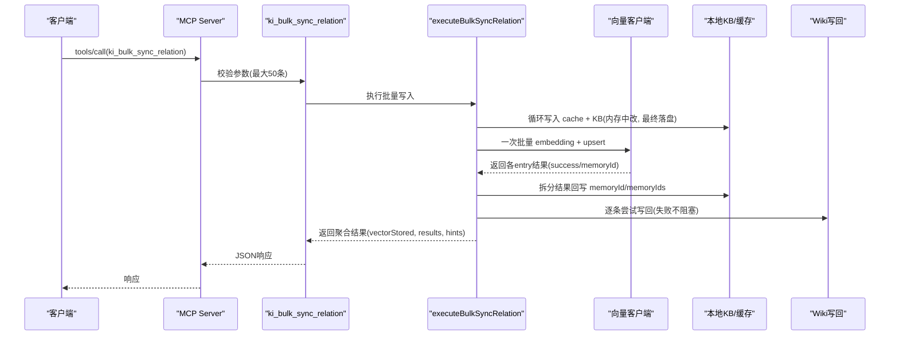
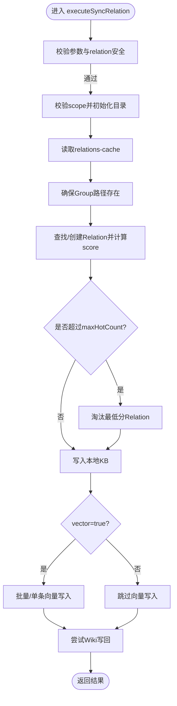
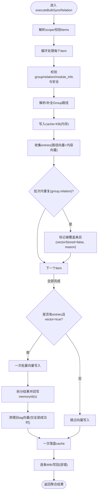
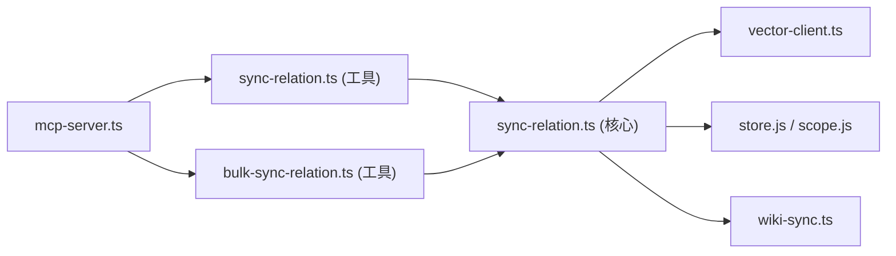

# 同步写入工具

<cite>
**本文引用的文件**
- [src/sync-relation.ts](file://src/sync-relation.ts)
- [src/lib/mcp-tools/sync-relation.ts](file://src/lib/mcp-tools/sync-relation.ts)
- [src/lib/mcp-tools/bulk-sync-relation.ts](file://src/lib/mcp-tools/bulk-sync-relation.ts)
- [src/mcp-server.ts](file://src/mcp-server.ts)
- [src/lib/mcp-token.ts](file://src/lib/mcp-token.ts)
- [docs/cli.md](file://docs/cli.md)
- [test/sync-relation.test.ts](file://test/sync-relation.test.ts)
</cite>

## 目录
1. [简介](#简介)
2. [项目结构](#项目结构)
3. [核心组件](#核心组件)
4. [架构总览](#架构总览)
5. [详细组件分析](#详细组件分析)
6. [依赖关系分析](#依赖关系分析)
7. [性能与最佳实践](#性能与最佳实践)
8. [故障排查指南](#故障排查指南)
9. [结论](#结论)

## 简介
本文件聚焦于 MCP 工具中的“同步写入”能力，重点说明：
- ki_sync_relation（单条写入）与 ki_bulk_sync_relation（批量写入）的区别、适用场景与调用方式。
- 白名单/黑名单规则与写入授权机制（scope 鉴权）。
- 批量写入的最佳实践：分批策略、错误处理、性能优化与数据一致性保障。

## 项目结构
MCP 服务在启动时注册所有工具，其中写入相关工具包括：
- ki_sync_relation：单条 Relation 写入（KB + 向量层可选）。
- ki_bulk_sync_relation：批量 Relation 写入（一次 embedding + 一次向量写入，性能更优）。

图表来源
- [src/mcp-server.ts:54-70](file://src/mcp-server.ts#L54-L70)
- [src/lib/mcp-tools/sync-relation.ts:6-43](file://src/lib/mcp-tools/sync-relation.ts#L6-L43)
- [src/lib/mcp-tools/bulk-sync-relation.ts:6-42](file://src/lib/mcp-tools/bulk-sync-relation.ts#L6-L42)
- [src/sync-relation.ts:893-1079](file://src/sync-relation.ts#L893-L1079)

章节来源
- [src/mcp-server.ts:54-70](file://src/mcp-server.ts#L54-L70)
- [docs/cli.md:1046-1092](file://docs/cli.md#L1046-L1092)

## 核心组件
- ki_sync_relation（单条写入）
  - 作用：写入/更新一条 Relation，自动补建 Group 树，可选写入向量层（默认开启），并尝试写回 Wiki。
  - 关键参数：scope、group、relation、module_info、vector、tags。
  - 返回：包含 evicted、vectorStored、wikiSynced 等字段，便于上层判断结果。
- ki_bulk_sync_relation（批量写入）
  - 作用：一次性写入多条 Relation，内部合并为一次 embedding + 一次向量 upsert，显著降低网络与锁竞争开销。
  - 关键参数：scope、items（数组，单次最多 50 条）、vector。
  - 返回：顶层 vectorStored 表示“全部条目完整成功”，逐条 results[].vectorStored 表示该条主内容向量是否成功；支持 hints 提示 Group 路径解析情况。

章节来源
- [docs/cli.md:1046-1092](file://docs/cli.md#L1046-L1092)
- [src/lib/mcp-tools/sync-relation.ts:6-43](file://src/lib/mcp-tools/sync-relation.ts#L6-L43)
- [src/lib/mcp-tools/bulk-sync-relation.ts:6-42](file://src/lib/mcp-tools/bulk-sync-relation.ts#L6-L42)
- [src/sync-relation.ts:394-787](file://src/sync-relation.ts#L394-L787)

## 架构总览
下图展示从 MCP 工具到存储与向量的整体流程，以及 Wiki 写回的容错路径。

图表来源
- [src/lib/mcp-tools/bulk-sync-relation.ts:6-42](file://src/lib/mcp-tools/bulk-sync-relation.ts#L6-L42)
- [src/sync-relation.ts:407-787](file://src/sync-relation.ts#L407-L787)

章节来源
- [src/sync-relation.ts:407-787](file://src/sync-relation.ts#L407-L787)

## 详细组件分析

### ki_sync_relation（单条写入）
- 功能要点
  - 校验 group/relation/module_info，拒绝非法 relation（含路径穿越字符）。
  - 自动补建 Group 树节点，维护 relations-cache 的 hot_relations 列表与淘汰策略。
  - 写入本地 KB（Markdown 索引），可选写入向量层（ki-search/ki-relation 及自定义 tags）。
  - 尝试写回 Wiki（失败不影响主流程）。
- 典型使用场景
  - 实时新增或更新单个知识条目。
  - 小批量、低吞吐场景，或对每条结果需要独立处理的场景。
- 返回值关键字段
  - evicted：若触发淘汰，返回被淘汰的 relation。
  - vectorStored/vectorReason：向量写入状态与原因。
  - wikiSynced/wikiFile/wikiReason：Wiki 写回状态与原因。

图表来源
- [src/sync-relation.ts:893-1079](file://src/sync-relation.ts#L893-L1079)

章节来源
- [src/sync-relation.ts:893-1079](file://src/sync-relation.ts#L893-L1079)
- [test/sync-relation.test.ts:60-133](file://test/sync-relation.test.ts#L60-L133)

### ki_bulk_sync_relation（批量写入）
- 功能要点
  - 限制单次最多 50 条，避免超时与过大请求。
  - 阶段化执行：
    1) 循环校验与写入 cache/KB（内存中修改，最终一次落盘）。
    2) 收集 entries（ki-relation 路径向量 + ki-search 内容向量 + 自定义 tag 内容向量）。
    3) 同批内重复(group,relation)去重，后一条覆盖前一条，避免孤儿向量。
    4) 一次向量批量写入（embedding HTTP + worker upsert）。
    5) 拆分结果，回写 memoryId/memoryIds，清理旧 tag 向量（仅当本次全部成功）。
    6) 一次落盘 cache。
    7) 逐条 Wiki 写回（失败不阻塞）。
  - 返回：顶层 vectorStored 表示“全部条目完全成功”，逐条 results[].vectorStored 表示该条主内容向量是否成功；hints 提供 Group 路径解析提示。
- 典型使用场景
  - 批量导入历史知识、迁移数据、AI 生成多文档沉淀。
  - 高吞吐写入，追求更低延迟与更少锁竞争。

图表来源
- [src/sync-relation.ts:407-787](file://src/sync-relation.ts#L407-L787)

章节来源
- [src/sync-relation.ts:407-787](file://src/sync-relation.ts#L407-L787)
- [docs/cli.md:1057-1070](file://docs/cli.md#L1057-L1070)

### 白名单与黑名单规则
- 白名单（授权范围）
  - HTTP 模式下，非回环绑定必须配置鉴权 Token。Token 可绑定一个或多个 scope，或使用保留字 'all' 表示全部。
  - 工具层对无 scope 参数的枚举类工具（如 ki_scope_list、ki_manage_index_list）采用“按授权过滤输出”的方式，避免泄露未授权 scope。
- 黑名单（拒绝写入）
  - relation 名称禁止包含 "/"、"\\" 或 ".."，防止破坏 Wiki 文件路径结构。
  - module_info 为空或空白将被跳过或拒绝。
  - 向量服务不可用时，KB 层仍可写入，但向量层会标记失败原因。

章节来源
- [src/lib/mcp-token.ts:43-50](file://src/lib/mcp-token.ts#L43-L50)
- [src/lib/mcp-token.ts:76-95](file://src/lib/mcp-token.ts#L76-L95)
- [src/sync-relation.ts:497-508](file://src/sync-relation.ts#L497-L508)
- [src/sync-relation.ts:910-915](file://src/sync-relation.ts#L910-L915)
- [src/sync-relation.ts:611-619](file://src/sync-relation.ts#L611-L619)

### 写入授权机制
- Token 管理
  - 通过 CLI 命令生成/更新/删除 Token，并记录授权 scope 集合。
  - 存储文件位于用户目录，权限严格（0600），写操作原子替换，损坏保护。
- 鉴权流程
  - 非回环绑定强制要求 Token；回环绑定禁用鉴权。
  - 工具调用时提取 effective scope（缺省为 'default'），与 Token 授权集合比对，越权即拒绝。
  - 对于无 scope 参数的工具，HTTP 层豁免单点校验，交由工具层按 authScopes 过滤输出。

章节来源
- [src/mcp-server.ts:174-211](file://src/mcp-server.ts#L174-L211)
- [src/lib/mcp-token.ts:156-200](file://src/lib/mcp-token.ts#L156-L200)
- [src/lib/mcp-token.ts:245-259](file://src/lib/mcp-token.ts#L245-L259)
- [AGENTS.md:101-120](file://AGENTS.md#L101-L120)

## 依赖关系分析
- 工具注册与调度
  - mcp-server.ts 统一注册所有工具，包括写入工具。
  - sync-relation.ts 与 bulk-sync-relation.ts 工具注册文件将参数校验与超时控制交给 MCP SDK。
- 核心逻辑
  - executeSyncRelation/executeBulkSyncRelation 负责业务编排：参数校验、Group 路径解析、cache/KB 写入、向量写入、Wiki 写回。
- 外部依赖
  - vector-client.ts：向量服务封装（ensureVectorAvailable、vectorBulkStore、vectorDelete）。
  - store.js/scope.js：本地 KB 与缓存读写。
  - wiki-sync.ts：Wiki 写回与安全检查。

图表来源
- [src/mcp-server.ts:54-70](file://src/mcp-server.ts#L54-L70)
- [src/lib/mcp-tools/sync-relation.ts:6-43](file://src/lib/mcp-tools/sync-relation.ts#L6-L43)
- [src/lib/mcp-tools/bulk-sync-relation.ts:6-42](file://src/lib/mcp-tools/bulk-sync-relation.ts#L6-L42)
- [src/sync-relation.ts:394-787](file://src/sync-relation.ts#L394-L787)

章节来源
- [src/mcp-server.ts:54-70](file://src/mcp-server.ts#L54-L70)
- [src/sync-relation.ts:394-787](file://src/sync-relation.ts#L394-L787)

## 性能与最佳实践
- 分批策略
  - 单次批量上限 50 条，超出请分批调用，避免工具超时与过大请求。
  - 建议按 Group 或主题分组，减少跨组切换带来的缓存与路径解析开销。
- 错误处理
  - 单条模式：任一异常不中断整个批量，逐条记录 skipped/skipReason。
  - 批量模式：向量服务不可用或写入失败不会阻塞 KB 层；顶层 vectorStored=false 不代表每条都失败，需结合逐条 results[].vectorStored/vectorReason 定位。
  - Wiki 写回失败不阻塞主流程，可通过 wikiReason 诊断。
- 性能优化
  - 优先使用 ki_bulk_sync_relation，一次 embedding + 一次 upsert，显著降低网络往返与锁竞争。
  - 利用 Group 路径自动补全与 hints 提示，减少歧义与重试。
  - 合理设置 vector=false 进行离线入库（仅 KB 层），后续再按需重建向量。
- 数据一致性
  - 同批内重复(group,relation)后一条覆盖前一条，避免孤儿向量。
  - 旧 tag 向量仅在“本次全部成功”时清理，防止删旧丢新。
  - 最终一次 writeJson 落盘 cache，保证原子性。

章节来源
- [src/lib/mcp-tools/bulk-sync-relation.ts:10-18](file://src/lib/mcp-tools/bulk-sync-relation.ts#L10-L18)
- [src/sync-relation.ts:569-605](file://src/sync-relation.ts#L569-L605)
- [src/sync-relation.ts:611-619](file://src/sync-relation.ts#L611-L619)
- [src/sync-relation.ts:654-705](file://src/sync-relation.ts#L654-L705)
- [src/sync-relation.ts:747-768](file://src/sync-relation.ts#L747-L768)

## 故障排查指南
- 常见错误与定位
  - 缺少必填参数：检查 group/relation/module_info 是否为空或空白。
  - relation 非法路径字符：移除 "/"、"\\" 或 ".."。
  - 向量服务不可用：查看 vectorReason，确认向量服务状态与配置。
  - 批量部分失败：检查逐条 results[].vectorReason，必要时使用 rebuild-vector 恢复缺失 tag 向量。
- 调试步骤
  - 先以 vector=false 写入 KB，确认 KB 层正确后再开启向量写入。
  - 使用 hints 字段核对 Group 路径解析是否精确命中。
  - 检查 Token 授权 scope 是否包含目标 scope，或在 HTTP 模式下启用鉴权。

章节来源
- [src/sync-relation.ts:460-508](file://src/sync-relation.ts#L460-L508)
- [src/sync-relation.ts:611-619](file://src/sync-relation.ts#L611-L619)
- [src/sync-relation.ts:685-694](file://src/sync-relation.ts#L685-L694)
- [src/mcp-server.ts:174-211](file://src/mcp-server.ts#L174-L211)

## 结论
- ki_sync_relation 适合单条实时写入；ki_bulk_sync_relation 适合批量导入与高吞吐场景，具备更好的性能与一致性保障。
- 白名单/黑名单规则与 Token 授权机制共同确保写入的安全性与可控性。
- 遵循分批策略、关注错误码与 hints、合理使用 vector 开关，可在保证数据一致性的同时获得最优性能。