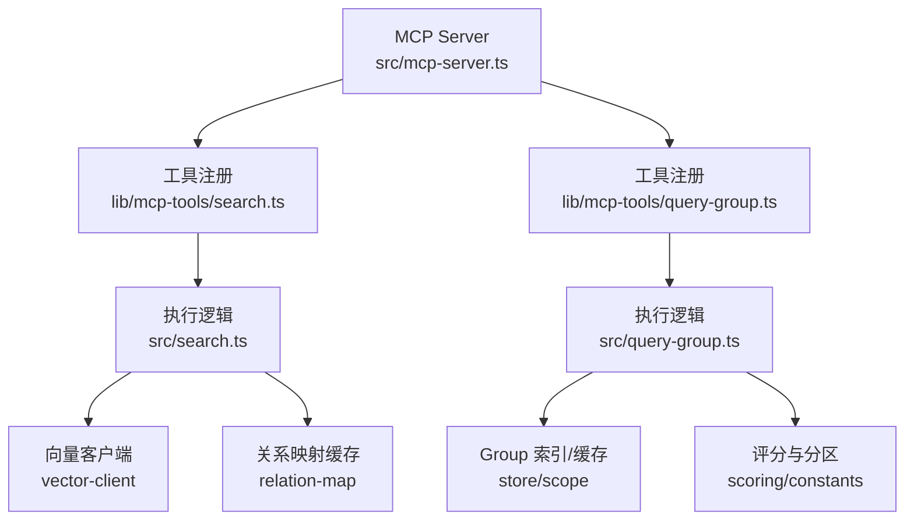
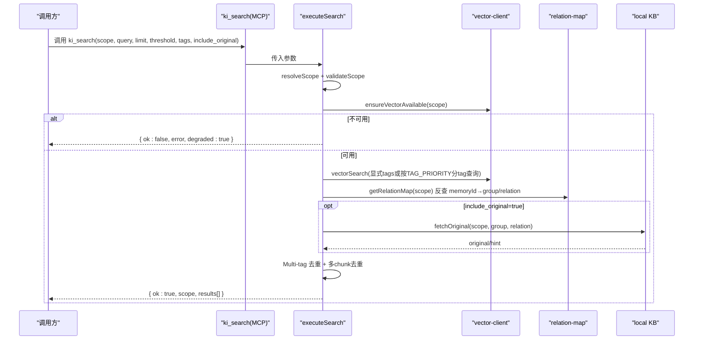
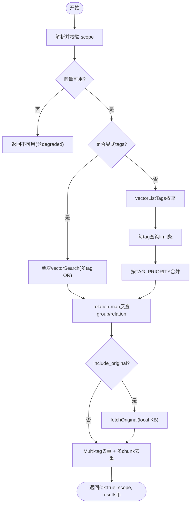
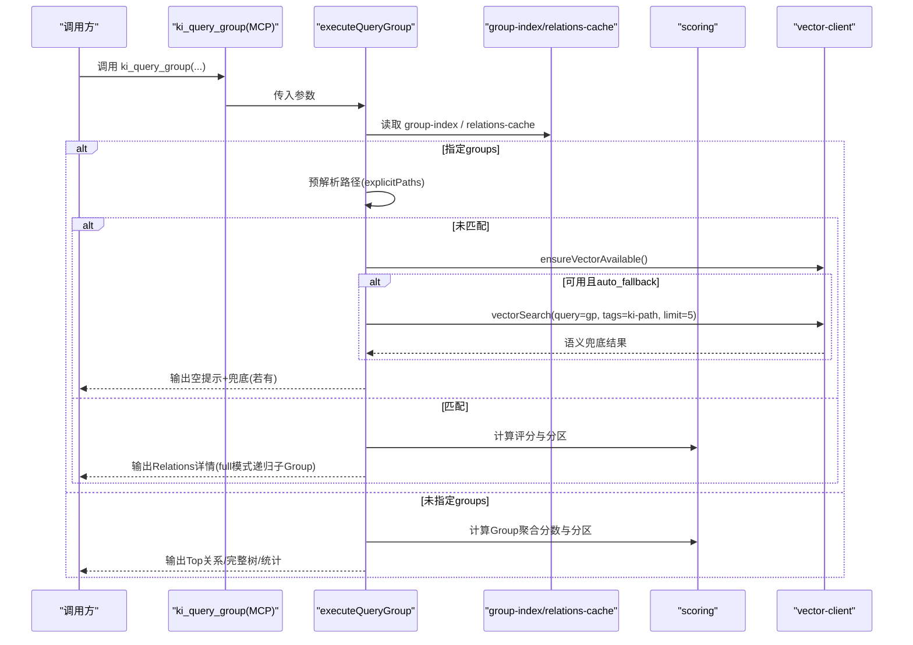
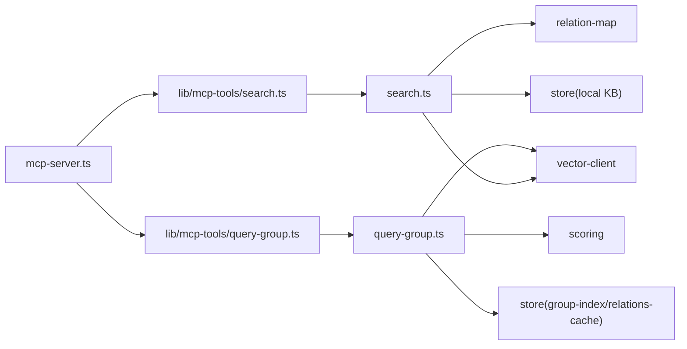

# 搜索相关工具

<cite>
**本文引用的文件**
- [src/search.ts](file://src/search.ts)
- [src/query-group.ts](file://src/query-group.ts)
- [src/mcp-server.ts](file://src/mcp-server.ts)
- [src/lib/mcp-tools/search.ts](file://src/lib/mcp-tools/search.ts)
- [src/lib/mcp-tools/query-group.ts](file://src/lib/mcp-tools/query-group.ts)
- [docs/cli.md](file://docs/cli.md)
- [skills/ki-search/SKILL.md](file://skills/ki-search/SKILL.md)
- [.gitnexus/wiki/search-retrieval.md](file://.gitnexus/wiki/search-retrieval.md)
</cite>

## 目录
1. [简介](#简介)
2. [项目结构](#项目结构)
3. [核心组件](#核心组件)
4. [架构总览](#架构总览)
5. [详细组件分析](#详细组件分析)
6. [依赖关系分析](#依赖关系分析)
7. [性能与可用性](#性能与可用性)
8. [故障排查指南](#故障排查指南)
9. [结论](#结论)
10. [附录：调用示例与结果解析](#附录调用示例与结果解析)

## 简介
本文件面向使用 MCP 工具的开发者，聚焦两个搜索相关能力：
- ki_search：语义检索知识库内容，支持 scope、query、limit、threshold、tags 等参数，并可按需返回本地 KB 原文。
- ki_query_group：全景查询 Group 树与 Relations，支持 mode（hot/warm/cold/emerging/full）、groups 分组、auto_fallback 语义兜底与缓存机制，用于快速定位知识热点与索引结构。

## 项目结构
MCP 服务在启动时注册所有工具，其中搜索相关工具由以下模块提供：
- 工具注册层：MCP Server 统一注册 ki_search、ki_query_group 等工具。
- 工具实现层：search.ts、query-group.ts 暴露可复用的 executeSearch、executeQueryGroup 纯函数。
- 向量与索引层：通过 vector-client 与 relation-map 完成向量检索与元数据反查。

图表来源
- [src/mcp-server.ts:54-70](file://src/mcp-server.ts#L54-L70)
- [src/lib/mcp-tools/search.ts:6-49](file://src/lib/mcp-tools/search.ts#L6-L49)
- [src/lib/mcp-tools/query-group.ts:6-53](file://src/lib/mcp-tools/query-group.ts#L6-L53)
- [src/search.ts:70-199](file://src/search.ts#L70-L199)
- [src/query-group.ts:611-745](file://src/query-group.ts#L611-L745)

章节来源
- [src/mcp-server.ts:54-70](file://src/mcp-server.ts#L54-L70)
- [src/lib/mcp-tools/search.ts:6-49](file://src/lib/mcp-tools/search.ts#L6-L49)
- [src/lib/mcp-tools/query-group.ts:6-53](file://src/lib/mcp-tools/query-group.ts#L6-L53)

## 核心组件
- ki_search（语义检索）
  - 入口：MCP 工具注册 → executeSearch → 向量检索 → 关系映射反查 → 可选原文召回 → 去重 → 返回结果。
  - 关键参数：scope、query、limit、threshold、tags、include_original。
- ki_query_group（全景查询）
  - 入口：MCP 工具注册 → executeQueryGroup → 读取 group-index/relations-cache → 计算评分与分区 → 格式化输出。
  - 关键参数：scope、groups/group、hot_count、depth、mode、auto_fallback。

章节来源
- [src/lib/mcp-tools/search.ts:6-49](file://src/lib/mcp-tools/search.ts#L6-L49)
- [src/search.ts:70-199](file://src/search.ts#L70-L199)
- [src/lib/mcp-tools/query-group.ts:6-53](file://src/lib/mcp-tools/query-group.ts#L6-L53)
- [src/query-group.ts:611-745](file://src/query-group.ts#L611-L745)

## 架构总览
下图展示了 ki_search 的端到端流程，包括 scope 校验、向量可用性检测、标签策略、原文召回与去重。

图表来源
- [src/lib/mcp-tools/search.ts:6-49](file://src/lib/mcp-tools/search.ts#L6-L49)
- [src/search.ts:70-199](file://src/search.ts#L70-L199)

章节来源
- [src/search.ts:70-199](file://src/search.ts#L70-L199)

## 详细组件分析

### ki_search 语义检索
- 功能要点
  - scope：项目隔离标识；default 模式可省略，strict 模式必填且须白名单。
  - query：自然语言查询文本。
  - limit：返回条数上限（默认 10）。
  - threshold：相似度阈值（0-1），过滤低分命中。
  - tags：过滤标签；不传则搜索全部，并按内置优先级合并结果。
  - include_original：是否返回 local KB 文件级原文（默认 false）。
- 行为细节
  - 未传 tags：先枚举该 scope 下所有 tag，每个 tag 单独查询并取 limit 条，再按 TAG_PRIORITY 排序（内容优先于路径/关系辅助向量）。
  - 命中后通过 relation-map 反查 memoryId，附加 group/relation 信息。
  - include_original=true 时尝试从 local KB 取原文；失败则降级为向量文档 content 并附带提示。
  - 去重：同一 (group, relation) 保留最高分；同文件多 chunk 命中仅首次携带 original，后续标记 deduplicated。
- 错误与降级
  - 向量服务不可用：返回 { ok:false, error, degraded:true }，便于上层降级处理。

图表来源
- [src/search.ts:70-199](file://src/search.ts#L70-L199)

章节来源
- [src/search.ts:70-199](file://src/search.ts#L70-L199)
- [docs/cli.md:1094-1103](file://docs/cli.md#L1094-L1103)
- [skills/ki-search/SKILL.md:62-96](file://skills/ki-search/SKILL.md#L62-L96)
- [.gitnexus/wiki/search-retrieval.md:234-250](file://.gitnexus/wiki/search-retrieval.md#L234-L250)

### ki_query_group 全景查询
- 功能要点
  - scope：项目隔离标识。
  - groups/group：逗号分隔的 Group 路径列表（支持模糊匹配）；单数别名 group 兼容旧用法。
  - hot_count：热门展示个数（默认 5）。
  - depth：索引层级深度（默认 4，最大 10）。
  - mode：展示分区 hot|warm|cold|emerging|full（支持逗号分隔多值）。
  - auto_fallback：未匹配 Group 时是否启用语义兜底（默认开启）。
- 行为细节
  - 指定 groups：对每个路径进行预解析，若未匹配，输出空提示并提供 sync-relation 写入建议；若开启 auto_fallback 且向量可用，则以 ki-path 标签做通用语义兜底，最多展示 5 条。
  - full 模式：递归展示子 Group 的 Relations（跳过已显式指定的路径）。
  - 未指定 groups：输出全量索引树、各分区 Top 关系、统计信息（总数/热区/常温/冷区/新兴热）。
  - 评分与分区：基于 useCount 与 lastUsedTime 计算分数，结合 halfLifeHours/recentHours 将 Group/Relation 划分到热/常温/冷/新兴热。
- 缓存机制
  - 读取 relations-cache.json 中的 partition_config 与 groups 数据，作为评分与分区依据。
  - 未命中 Group 时的语义兜底依赖向量服务，属于运行时增强而非持久化缓存。

图表来源
- [src/lib/mcp-tools/query-group.ts:6-53](file://src/lib/mcp-tools/query-group.ts#L6-L53)
- [src/query-group.ts:611-745](file://src/query-group.ts#L611-L745)

章节来源
- [src/query-group.ts:611-745](file://src/query-group.ts#L611-L745)
- [docs/cli.md:1094-1103](file://docs/cli.md#L1094-L1103)
- [.gitnexus/wiki/search-retrieval.md:284-324](file://.gitnexus/wiki/search-retrieval.md#L284-L324)

## 依赖关系分析
- 工具注册依赖
  - mcp-server 统一注册 search 与 query-group 工具。
- 执行逻辑依赖
  - search.ts 依赖 vector-client（向量检索/可用性检测）、relation-map（memoryId→group/relation 反查）、store（local KB 原文读取）。
  - query-group.ts 依赖 store（group-index/relations-cache）、scoring（评分与分区）、vector-client（语义兜底）。
- 配置与范围
  - 两者均通过 loadConfig/resolveScope 解析 scope，并在 strict 模式下强制白名单校验。

图表来源
- [src/mcp-server.ts:54-70](file://src/mcp-server.ts#L54-L70)
- [src/lib/mcp-tools/search.ts:6-49](file://src/lib/mcp-tools/search.ts#L6-L49)
- [src/lib/mcp-tools/query-group.ts:6-53](file://src/lib/mcp-tools/query-group.ts#L6-L53)
- [src/search.ts:70-199](file://src/search.ts#L70-L199)
- [src/query-group.ts:611-745](file://src/query-group.ts#L611-L745)

章节来源
- [src/mcp-server.ts:54-70](file://src/mcp-server.ts#L54-L70)

## 性能与可用性
- ki_search
  - 未传 tags 时会枚举所有 tag 并分别查询，结果条数为各 tag 的 limit 之和；可通过显式 tags 缩小范围以提升性能。
  - include_original=true 会触发 local KB 读取与多 chunk 去重，增加开销但提升可读性。
  - 向量不可用时直接降级返回，避免阻塞。
- ki_query_group
  - 指定 groups 时并发解析路径，减少串行等待。
  - full 模式递归展示子 Group，注意控制 depth 与 hot_count 以避免输出过长。
  - auto_fallback 依赖向量服务，可在精确匹配失败时快速补充候选。

[本节为通用性能讨论，不直接分析具体文件]

## 故障排查指南
- 向量服务不可用
  - ki_search 返回 { ok:false, error, degraded:true }，需检查向量服务状态或重建索引。
- 原文不可用
  - include_original=true 但无法定位 local KB 原文时，返回 content 兜底并附带提示；可考虑同步 relation 或重建向量。
- 未匹配 Group
  - ki_query_group 未匹配时，若开启 auto_fallback 将尝试以 ki-path 标签做语义兜底；关闭后将仅输出空提示与写入建议。
- 参数异常
  - mode、depth、hot_count 等非法值会被回退到默认或限制最大值；请根据提示调整。

章节来源
- [src/search.ts:84-92](file://src/search.ts#L84-L92)
- [src/search.ts:137-155](file://src/search.ts#L137-L155)
- [src/query-group.ts:654-675](file://src/query-group.ts#L654-L675)
- [src/query-group.ts:517-545](file://src/query-group.ts#L517-L545)

## 结论
- ki_search 适合“理解级”问题，优先在 ${scope}-memory 中语义检索，必要时宏观兜底至 ${scope}。
- ki_query_group 适合“全景扫描”，快速掌握 Group 结构与 Relations 热度分布，配合 full 模式与 auto_fallback 提高命中率。
- 合理使用 tags、limit、threshold 与 mode，可在精度与性能之间取得平衡。

[本节为总结，不直接分析具体文件]

## 附录：调用示例与结果解析

- ki_search 示例
  - 语义检索记忆库（推荐）：
    - 调用：ki_search({ scope: "${scope}-memory", query: "核心词", limit: 4, threshold: 0.02, tags: "ki-search" })
    - 说明：优先在记忆库中检索，limit 固定 4，threshold 固定 0.02，确保高相关结果。
  - 宏观兜底：
    - 调用：ki_search({ scope: "${scope}", query: "核心词", limit: 4, threshold: 0.02, tags: "ki-search" })
    - 说明：当记忆库未命中时，使用全局 scope 兜底。
  - 返回解析：
    - 成功：{ ok:true, scope, results[] }，每项含 memoryId、content、score，可能包含 group/relation/original/deduplicated 等字段。
    - 失败：{ ok:false, error, degraded? }，根据 error 与 degraded 判断是否需要降级或修复。

- ki_query_group 示例
  - 全景视图：
    - 调用：ki_query_group({ scope: "${scope}", mode: "full" })
    - 说明：输出 Top 关系、完整索引树与统计信息。
  - 指定 Group 查看：
    - 调用：ki_query_group({ scope: "${scope}", groups: "目标Group路径", mode: "hot,emerging" })
    - 说明：查看该 Group 的热区与新兴热区；若未匹配且 auto_fallback=true，将尝试语义兜底。
  - 返回解析：
    - 成功：{ ok:true, scope, output }，output 为格式化文本，包含分区标题、关系列表与统计。
    - 失败：{ ok:false, error }，根据 error 调整 groups/mode/depth 等参数。

章节来源
- [skills/ki-search/SKILL.md:62-96](file://skills/ki-search/SKILL.md#L62-L96)
- [skills/ki-search/SKILL.md:169-185](file://skills/ki-search/SKILL.md#L169-L185)
- [docs/cli.md:1094-1103](file://docs/cli.md#L1094-L1103)
- [.gitnexus/wiki/search-retrieval.md:284-324](file://.gitnexus/wiki/search-retrieval.md#L284-L324)