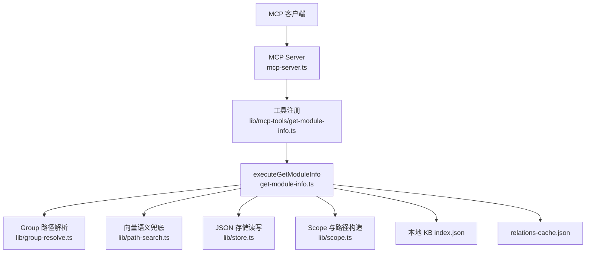
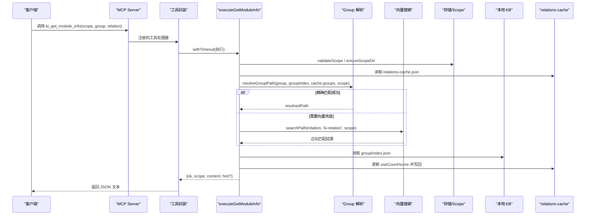
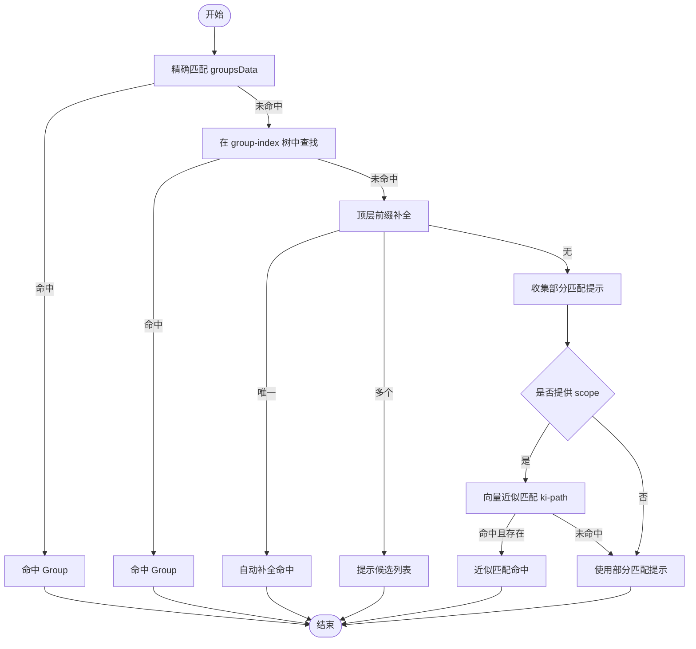
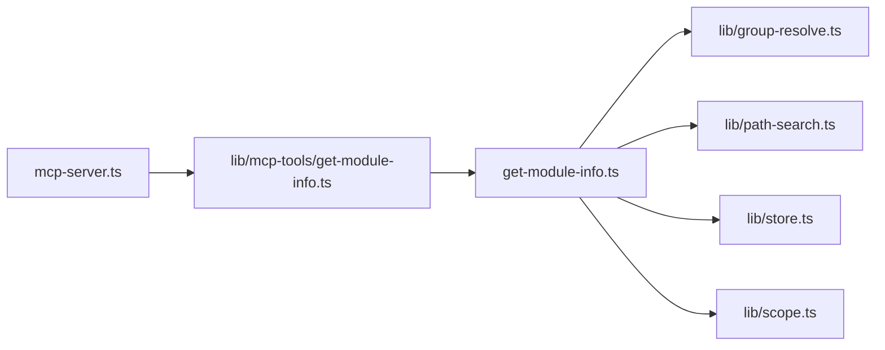

# 模块信息工具

<cite>
**本文引用的文件**
- [src/get-module-info.ts](file://src/get-module-info.ts)
- [src/lib/mcp-tools/get-module-info.ts](file://src/lib/mcp-tools/get-module-info.ts)
- [src/mcp-server.ts](file://src/mcp-server.ts)
- [src/lib/group-resolve.ts](file://src/lib/group-resolve.ts)
- [src/lib/path-search.ts](file://src/lib/path-search.ts)
- [src/lib/store.ts](file://src/lib/store.ts)
- [src/lib/scope.ts](file://src/lib/scope.ts)
- [test/get-module-info.test.ts](file://test/get-module-info.test.ts)
</cite>

## 目录
1. [简介](#简介)
2. [项目结构](#项目结构)
3. [核心组件](#核心组件)
4. [架构总览](#架构总览)
5. [详细组件分析](#详细组件分析)
6. [依赖关系分析](#依赖关系分析)
7. [性能与可用性](#性能与可用性)
8. [故障排查指南](#故障排查指南)
9. [结论](#结论)

## 简介
本文件面向“模块信息相关 MCP 工具”，重点说明 ki_get_module_info 工具的“原位信息查询”能力，包括 scope、group、relation 三个参数的组合使用方式；解释“索引原位”的概念与优势；说明如何从缓存全景中定位目标 Group；并给出查询失败时的重试策略与降级方案。该工具通过 MCP Server 暴露为 ki_get_module_info，内部调用 executeGetModuleInfo，读取 relations-cache.json 与本地 KB 的 index.json，返回指定 Group 下某个 Relation 对应的 Markdown 内容，并在命中时更新评分。

## 项目结构
ki_get_module_info 由三层组成：
- MCP 注册层：在 mcp-server.ts 中统一注册所有工具，其中 registerGetModuleInfoTool 将 ki_get_module_info 暴露给客户端。
- 工具封装层：lib/mcp-tools/get-module-info.ts 负责参数校验（Zod）、超时控制、调用执行函数并包装结果。
- 业务逻辑层：get-module-info.ts 实现 executeGetModuleInfo，完成 scope 校验、Group 解析、Relation 查找、KB 内容读取、评分更新等。

图表来源
- [src/mcp-server.ts:54-70](file://src/mcp-server.ts#L54-L70)
- [src/lib/mcp-tools/get-module-info.ts:6-37](file://src/lib/mcp-tools/get-module-info.ts#L6-L37)
- [src/get-module-info.ts:61-167](file://src/get-module-info.ts#L61-L167)
- [src/lib/group-resolve.ts:117-219](file://src/lib/group-resolve.ts#L117-L219)
- [src/lib/path-search.ts:47-86](file://src/lib/path-search.ts#L47-L86)
- [src/lib/store.ts:23-62](file://src/lib/store.ts#L23-L62)
- [src/lib/scope.ts:49-77](file://src/lib/scope.ts#L49-L77)

章节来源
- [src/mcp-server.ts:54-70](file://src/mcp-server.ts#L54-L70)
- [src/lib/mcp-tools/get-module-info.ts:6-37](file://src/lib/mcp-tools/get-module-info.ts#L6-L37)
- [src/get-module-info.ts:61-167](file://src/get-module-info.ts#L61-L167)

## 核心组件
- MCP 工具注册器：定义工具名 ki_get_module_info，声明参数 schema（scope、group、relation），并以 withTimeout 包裹执行，避免长时间阻塞。
- 执行函数 executeGetModuleInfo：
  - 校验 scope，确保 scope 目录存在。
  - 读取 relations-cache.json，按 group 解析到具体组，再在 hot_relations 中查找 relation（支持 id 或 text）。
  - 若精确匹配失败，尝试对 relation 进行向量近似匹配（ki-relation tag），命中后回退到对应 Relation。
  - 读取本地 KB 的 index.json，取出 Markdown 内容。
  - 更新 useCount 与 score，写回 relations-cache.json。
  - 返回结构化结果 { ok, scope, content, hint? }。
- Group 解析 resolveGroupPath：四层查找 + 向量兜底，支持自动补全、候选提示、部分匹配提示与向量近似匹配。
- 路径搜索 searchPath：基于 vectorSearch 的 RRF 融合分检索，默认阈值 0，由下游做存在性二次校验保证质量。
- 存储与 Scope：提供 JSON 读写、WAL 写入、版本检查、scope 白名单与目录初始化等能力。

章节来源
- [src/lib/mcp-tools/get-module-info.ts:6-37](file://src/lib/mcp-tools/get-module-info.ts#L6-L37)
- [src/get-module-info.ts:61-167](file://src/get-module-info.ts#L61-L167)
- [src/lib/group-resolve.ts:117-219](file://src/lib/group-resolve.ts#L117-L219)
- [src/lib/path-search.ts:47-86](file://src/lib/path-search.ts#L47-L86)
- [src/lib/store.ts:23-62](file://src/lib/store.ts#L23-L62)
- [src/lib/scope.ts:49-77](file://src/lib/scope.ts#L49-L77)

## 架构总览
ki_get_module_info 的请求链路如下：

图表来源
- [src/mcp-server.ts:54-70](file://src/mcp-server.ts#L54-L70)
- [src/lib/mcp-tools/get-module-info.ts:6-37](file://src/lib/mcp-tools/get-module-info.ts#L6-L37)
- [src/get-module-info.ts:61-167](file://src/get-module-info.ts#L61-L167)
- [src/lib/group-resolve.ts:117-219](file://src/lib/group-resolve.ts#L117-L219)
- [src/lib/path-search.ts:47-86](file://src/lib/path-search.ts#L47-L86)
- [src/lib/store.ts:23-62](file://src/lib/store.ts#L23-L62)
- [src/lib/scope.ts:49-77](file://src/lib/scope.ts#L49-L77)

## 详细组件分析

### 参数与组合使用：scope、group、relation
- scope：项目隔离标识。默认 default，strict 模式下必须显式传入且需在配置白名单内。用于确定数据目录 kb/{scope}/。
- group：Group 路径。支持精确匹配、顶层前缀补全、向量近似匹配。最终会落到 relations-cache.json 中的 groups 节点。
- relation：Relation 名称或 ID。先在 Group 的 hot_relations 中精确匹配；若失败，则对 relation 进行向量近似匹配（ki-relation tag）后再落库查找。

典型组合示例（来自测试）：
- 指定完整 group 路径与 relation id/name，成功返回 Markdown。
- 多次调用同一 relation，useCount 防刷不重复计分。
- 缺失 relation 或缺失本地 KB 时返回错误并附带 hint。

章节来源
- [src/lib/mcp-tools/get-module-info.ts:6-37](file://src/lib/mcp-tools/get-module-info.ts#L6-L37)
- [src/get-module-info.ts:61-167](file://src/get-module-info.ts#L61-L167)
- [test/get-module-info.test.ts:95-153](file://test/get-module-info.test.ts#L95-L153)
- [test/get-module-info.test.ts:156-205](file://test/get-module-info.test.ts#L156-L205)

### 索引原位：概念与优势
- 概念：
  - “索引原位”指以 Group 为单位，将知识条目（Markdown）与其元数据（Relations、Keywords、Score）就近组织在 kb/{scope}/{group}/index.json 与 kb/{scope}/relations-cache.json 中。
  - 查询时直接按 Group 路径定位到本地 KB 的 index.json，无需跨仓库或跨服务扫描。
- 优势：
  - 低延迟：直接读本地 JSON，避免远程网络开销。
  - 高可靠：本地文件可备份、可迁移、可审计。
  - 易维护：按 Group 切分，增量导入、局部重建成本低。
  - 强一致：relations-cache.json 作为“缓存全景”，集中记录各 Group 的 Relations 与热度，便于快速定位。

章节来源
- [src/get-module-info.ts:124-147](file://src/get-module-info.ts#L124-L147)
- [src/lib/store.ts:23-62](file://src/lib/store.ts#L23-L62)
- [src/lib/scope.ts:49-77](file://src/lib/scope.ts#L49-L77)

### 从缓存全景定位目标 Group
- relations-cache.json 的 groups 字段是“缓存全景”，每个 key 即一个 Group 路径，包含 hot_relations、keywords、max_hot_count 等。
- 定位流程：
  1) 先对 group 进行精确匹配；
  2) 若失败，尝试在每个顶层 Group 下拼接前缀进行整段补全；
  3) 若仍失败，收集最长存在前缀的部分匹配提示；
  4) 若提供 scope，启用向量语义兜底，搜索 ki-path 标签下的近似路径，并二次校验其存在于 group-index 或 groupsData 中；
  5) 最终得到 resolvedPath，再从 cache.groups[resolvedPath] 获取 hot_relations。

图表来源
- [src/lib/group-resolve.ts:117-219](file://src/lib/group-resolve.ts#L117-L219)
- [src/lib/path-search.ts:47-86](file://src/lib/path-search.ts#L47-L86)

章节来源
- [src/lib/group-resolve.ts:117-219](file://src/lib/group-resolve.ts#L117-L219)
- [src/lib/path-search.ts:47-86](file://src/lib/path-search.ts#L47-L86)

### 查询失败时的重试与降级
- 失败类型与处理：
  - relations-cache.json 不存在：提示先执行 sync-relation 写入关系。
  - Group 未匹配：返回 hint，包含可用顶层 Group 或部分匹配提示。
  - Relation 不存在：先尝试对 relation 进行向量近似匹配（ki-relation tag），若命中则回退使用；否则列出该 Group 可用的 Relation 列表供选择。
  - 本地 KB 缺失：提示重新写入或检查导入流程。
- 重试策略建议：
  - 针对网络或向量服务异常：path-search 已静默降级返回 null，上层应视为未命中并继续走其他分支。
  - 针对临时 IO 异常：可在调用方增加有限次重试（如 2-3 次），每次间隔短退避，避免雪崩。
  - 针对 Group/Relation 拼写问题：优先依赖 resolveGroupPath 的自动补全与向量兜底，减少人工重试。
- 降级方案：
  - 向量不可用时：回退到字符串前缀/子串匹配与候选提示。
  - 本地 KB 不可用时：返回明确错误与修复指引，避免静默失败。
  - 评分更新失败：不影响主流程返回内容，但需记录日志以便后续修复。

章节来源
- [src/get-module-info.ts:72-147](file://src/get-module-info.ts#L72-L147)
- [src/lib/path-search.ts:47-86](file://src/lib/path-search.ts#L47-L86)

### 评分更新与防刷
- 每次命中 Relation 会调用 recordUse 更新 useCount 与 lastUsedTime，并根据 halfLifeHours 计算新 score，写回 relations-cache.json。
- 防刷机制：短时间内重复访问同一 Relation 不会重复计分，避免评分被刷高。

章节来源
- [src/get-module-info.ts:149-157](file://src/get-module-info.ts#L149-L157)
- [test/get-module-info.test.ts:117-153](file://test/get-module-info.test.ts#L117-L153)

## 依赖关系分析
- mcp-server.ts：构建 McpServer 并注册所有工具，包括 ki_get_module_info。
- lib/mcp-tools/get-module-info.ts：定义工具 schema、超时、调用 executeGetModuleInfo。
- get-module-info.ts：核心业务逻辑，依赖 group-resolve、path-search、store、scope。
- group-resolve.ts：Group 路径解析与自动补全。
- path-search.ts：向量语义搜索封装，tag 过滤 ki-path/ki-relation。
- store.ts：JSON 读写、WAL 写入、版本检查、scope 初始化。
- scope.ts：scope 校验、路径构造、group-index 迁移。

图表来源
- [src/mcp-server.ts:54-70](file://src/mcp-server.ts#L54-L70)
- [src/lib/mcp-tools/get-module-info.ts:6-37](file://src/lib/mcp-tools/get-module-info.ts#L6-L37)
- [src/get-module-info.ts:61-167](file://src/get-module-info.ts#L61-L167)

章节来源
- [src/mcp-server.ts:54-70](file://src/mcp-server.ts#L54-L70)
- [src/lib/mcp-tools/get-module-info.ts:6-37](file://src/lib/mcp-tools/get-module-info.ts#L6-L37)
- [src/get-module-info.ts:61-167](file://src/get-module-info.ts#L61-L167)

## 性能与可用性
- 性能特性：
  - 直接读本地 JSON，I/O 开销小；评分更新采用 WAL 写入，提升持久化可靠性。
  - 向量搜索仅在必要时触发，且默认阈值较低，由下游存在性校验保证质量，降低误召回成本。
- 可用性保障：
  - 参数校验严格（scope 白名单、非法字符拦截）。
  - 多阶段降级：精确匹配 → 补全 → 部分匹配提示 → 向量兜底。
  - 超时保护：MCP 工具封装层使用 withTimeout，避免长耗时请求阻塞。
- 优化建议：
  - 高频 Group 可考虑内存缓存 relations-cache 片段，减少磁盘 I/O。
  - 向量搜索可引入本地缓存（最近查询结果），进一步降低网络开销。
  - 批量更新评分时可合并写回，减少频繁 WAL 写入。

## 故障排查指南
- 常见问题与定位：
  - relations-cache.json 不存在：确认是否执行过 sync-relation 写入关系。
  - Group 未匹配：检查 group 路径是否正确，或使用自动补全与向量兜底。
  - Relation 不存在：确认 relation 名称或 ID 是否正确，查看该 Group 下可用的 Relation 列表。
  - 本地 KB 缺失：检查 scan-kb import 是否完整执行，或重新写入 module-info。
- 调试步骤：
  - 打印 hint 信息，根据提示修正 group/relation。
  - 检查 group-index.json 与 relations-cache.json 的结构与版本。
  - 验证 scope 是否在配置白名单内（strict 模式）。
- 恢复操作：
  - 重新执行 sync-relation 写入关系与 KB。
  - 清理损坏的 JSON 文件并从模板初始化 scope。
  - 若向量服务不可用，依赖字符串匹配与候选提示继续工作。

章节来源
- [src/get-module-info.ts:72-147](file://src/get-module-info.ts#L72-L147)
- [src/lib/store.ts:23-62](file://src/lib/store.ts#L23-L62)
- [src/lib/scope.ts:168-223](file://src/lib/scope.ts#L168-L223)

## 结论
ki_get_module_info 通过“索引原位”的方式，将 Group 维度的知识与元数据就近组织，配合 relations-cache.json 的缓存全景，实现了高效、可靠的模块信息查询。其参数设计（scope、group、relation）清晰明确，结合 Group 解析的多层策略与向量语义兜底，能够在拼写错误或路径不完整的情况下依然给出准确结果。同时，评分更新与防刷机制保障了热度的真实性。对于异常情况，系统提供了明确的错误信息与修复指引，并通过超时与降级策略提升了整体可用性。