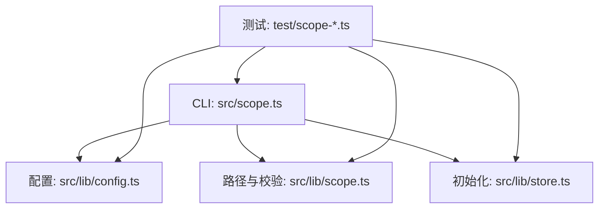
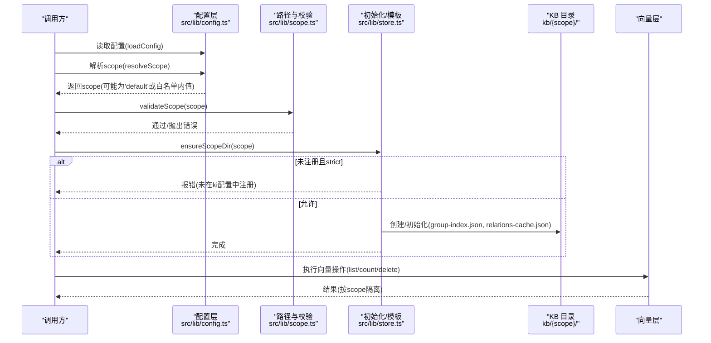
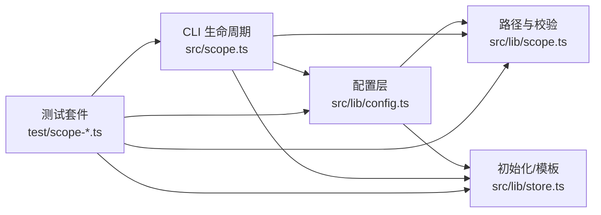
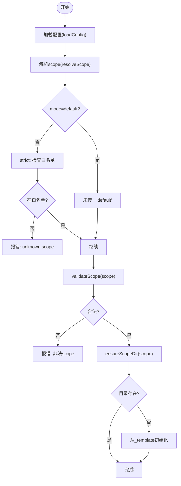
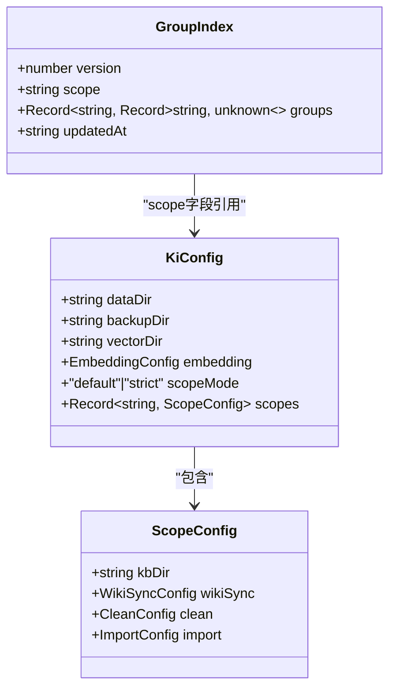

# Scope约定与隔离

<cite>
**本文引用的文件**
- [src/scope.ts](file://src/scope.ts)
- [src/lib/scope.ts](file://src/lib/scope.ts)
- [src/lib/config.ts](file://src/lib/config.ts)
- [src/lib/store.ts](file://src/lib/store.ts)
- [test/scope-isolation.test.ts](file://test/scope-isolation.test.ts)
- [test/scope-doc.test.ts](file://test/scope-doc.test.ts)
- [test/scope-mode.test.ts](file://test/scope-mode.test.ts)
- [.requirements/2026-07-17-KiSearch-zvec-node-mcp/design/REF_S01_Config_DESIGN.md](file://.requirements/2026-07-17-KiSearch-zvec-node-mcp/design/REF_S01_Config_DESIGN.md)
- [test/fixtures/mock-wiki/核心概念/Scope 隔离机制.md](file://test/fixtures/mock-wiki/核心概念/Scope 隔离机制.md)
</cite>

## 目录
1. [简介](#简介)
2. [项目结构](#项目结构)
3. [核心组件](#核心组件)
4. [架构总览](#架构总览)
5. [详细组件分析](#详细组件分析)
6. [依赖关系分析](#依赖关系分析)
7. [性能考量](#性能考量)
8. [故障排查指南](#故障排查指南)
9. [结论](#结论)
10. [附录](#附录)

## 简介
本文件系统性说明 ki 的 scope 约定与隔离机制，覆盖以下要点：
- ${scope} 变量的解析规则、默认值处理与校验机制
- 数据隔离、权限控制（基于 scopeMode 白名单）与命名空间管理
- 最佳实践：如何正确获取和使用 scope，避免跨 scope 串扰
- 常见错误场景与解决方案

## 项目结构
围绕 scope 的关键代码分布在如下位置：
- 配置加载与策略：src/lib/config.ts（含 scopeMode、scopes 白名单、路径解析）
- 路径构造与校验：src/lib/scope.ts（validateScope、getKbDir、listAllScopes 等）
- 初始化与模板：src/lib/store.ts（ensureScopeDir、initScope）
- CLI 生命周期管理：src/scope.ts（list/delete/clear）
- 测试验证：test/scope-*.ts（隔离性、模式语义、文档级操作）

图表来源
- [src/scope.ts:94-132](file://src/scope.ts#L94-L132)
- [src/lib/config.ts:148-175](file://src/lib/config.ts#L148-L175)
- [src/lib/scope.ts:30-53](file://src/lib/scope.ts#L30-L53)
- [src/lib/store.ts:168-205](file://src/lib/store.ts#L168-L205)

章节来源
- [src/scope.ts:94-132](file://src/scope.ts#L94-L132)
- [src/lib/config.ts:148-175](file://src/lib/config.ts#L148-L175)
- [src/lib/scope.ts:30-53](file://src/lib/scope.ts#L30-L53)
- [src/lib/store.ts:168-205](file://src/lib/store.ts#L168-L205)

## 核心组件
- 配置与策略层（config.ts）
  - 提供 KiConfig 模型，包含 dataDir、vectorDir、embedding、scopeMode、scopes 等
  - resolveScope(config, scope?) 实现 default/strict 两种模式下的 scope 解析与白名单校验
  - getScopeDataDir(config, scope) 计算 kb/{scope} 或 scopes[scope].kbDir/kb/{scope}
- 路径与校验层（lib/scope.ts）
  - validateScope(scope) 严格字符集校验，拒绝路径遍历
  - getKbDir/getGroupIndexPath/getRelationsCachePath 等路径构造器
  - listAllScopes() 枚举已初始化 scope（存在 relations-cache.json）
- 初始化与模板层（lib/store.ts）
  - ensureScopeDir(scope) 在 strict 模式下强制白名单；default 模式自动放行并创建
  - initScope(scope) 从 _template 复制 group-index.json、relations-cache.json 并写入 scope 字段
- CLI 生命周期（scope.ts）
  - list/delete/clear 命令统一协调 KB 目录层与向量语义层，保证一致性

章节来源
- [src/lib/config.ts:119-128](file://src/lib/config.ts#L119-L128)
- [src/lib/config.ts:444-459](file://src/lib/config.ts#L444-L459)
- [src/lib/scope.ts:30-53](file://src/lib/scope.ts#L30-L53)
- [src/lib/scope.ts:174-198](file://src/lib/scope.ts#L174-L198)
- [src/lib/store.ts:168-205](file://src/lib/store.ts#L168-L205)
- [src/lib/store.ts:229-266](file://src/lib/store.ts#L229-L266)
- [src/scope.ts:94-132](file://src/scope.ts#L94-L132)

## 架构总览
下图展示 scope 在“配置—路径—存储—向量”之间的协作关系。

图表来源
- [src/lib/config.ts:148-175](file://src/lib/config.ts#L148-L175)
- [src/lib/config.ts:444-459](file://src/lib/config.ts#L444-L459)
- [src/lib/scope.ts:30-53](file://src/lib/scope.ts#L30-L53)
- [src/lib/store.ts:168-205](file://src/lib/store.ts#L168-L205)
- [src/scope.ts:94-132](file://src/scope.ts#L94-L132)

## 详细组件分析

### ${scope} 变量解析规则与默认值
- 解析入口：resolveScope(config, scope?)
  - default 模式：空或未传 → 'default'；任意 scope 放行（后续由其他模块决定是否自动创建）
  - strict 模式：必须显式传入非空 scope，且必须在 config.scopes 白名单中，否则抛错
- 默认值来源：
  - 配置文件 scopeMode 缺省为 'default'
  - 未显式 scope 时回退到 'default'
- 白名单：config.scopes 的 key 集合即为允许的 scope 列表（strict 模式）

章节来源
- [src/lib/config.ts:288-289](file://src/lib/config.ts#L288-L289)
- [src/lib/config.ts:444-459](file://src/lib/config.ts#L444-L459)
- [.requirements/2026-07-17-KiSearch-zvec-node-mcp/design/REF_S01_Config_DESIGN.md:97-107](file://.requirements/2026-07-17-KiSearch-zvec-node-mcp/design/REF_S01_Config_DESIGN.md#L97-L107)

### 校验与路径构造
- 字符校验：validateScope(scope)
  - 仅允许字母、数字、连字符(-)、下划线(_)
  - 拒绝路径遍历字符，非法时抛出 ScopeError（EMPTY_SCOPE / INVALID_SCOPE）
- 路径构造：
  - getKbDir(scope) → 优先使用 scopes[scope].kbDir/kb/{scope}，否则 dataDir/{scope}
  - getGroupIndexPath(scope)、getRelationsCachePath(scope) 等辅助路径函数
- 枚举 scope：listAllScopes() 扫描 dataDir 下含 relations-cache.json 的目录，并合并 config.scopes

章节来源
- [src/lib/scope.ts:30-53](file://src/lib/scope.ts#L30-L53)
- [src/lib/scope.ts:174-198](file://src/lib/scope.ts#L174-L198)

### 初始化与模板
- ensureScopeDir(scope)
  - strict 模式 + 未注册 → 直接拒绝（不创建目录）
  - default 模式 → 放行；若目录不存在则从 _template 初始化
  - 若目录存在但关键文件缺失 → 视为未初始化，进行初始化
- initScope(scope)
  - 从 _template 复制 group-index.json、relations-cache.json
  - 写入 scope 字段与更新时间戳

章节来源
- [src/lib/store.ts:168-205](file://src/lib/store.ts#L168-L205)
- [src/lib/store.ts:229-266](file://src/lib/store.ts#L229-L266)

### CLI 生命周期管理（list/delete/clear）
- list：合并 KB 层、向量层、config.scopes 三处 scope，标注是否存在于各层及是否注册
- delete：删除向量层文档、KB 目录、移除配置条目（default 不可删；需 --yes）
- clear：清空向量层（可按 tag），可选清空 KB 目录内容（保留目录）

章节来源
- [src/scope.ts:94-132](file://src/scope.ts#L94-L132)
- [src/scope.ts:145-179](file://src/scope.ts#L145-L179)
- [src/scope.ts:192-221](file://src/scope.ts#L192-L221)

### 数据隔离与命名空间管理
- 物理隔离：每个 scope 对应独立目录 kb/{scope}/，包含 group-index.json、relations-cache.json
- 逻辑隔离：所有读写均先 resolveScope + validateScope，确保不同 scope 互不影响
- 向量层隔离：向量操作以 scope 为维度（list/count/delete 均带 scope），配合标签过滤进一步细分
- 命名空间：scope 即命名空间，名称全局唯一；strict 模式下由配置白名单约束

章节来源
- [test/scope-isolation.test.ts:50-153](file://test/scope-isolation.test.ts#L50-L153)
- [test/fixtures/mock-wiki/核心概念/Scope 隔离机制.md:1-26](file://test/fixtures/mock-wiki/核心概念/Scope 隔离机制.md#L1-L26)

### 权限控制（基于 scopeMode 的护栏）
- default 模式：宽松，适合单项目/尝鲜；未传 scope 落 default，未注册 scope 自动创建
- strict 模式：严格，适合多项目防串味；必须显式传 scope 且必须在 scopes 白名单中
- 边界说明：strict 可拦截“未传/未注册”，但不能阻止“传了合法但错误的另一个已注册 scope”

章节来源
- [.requirements/2026-07-17-KiSearch-zvec-node-mcp/design/REF_S01_Config_DESIGN.md:97-107](file://.requirements/2026-07-17-KiSearch-zvec-node-mcp/design/REF_S01_Config_DESIGN.md#L97-L107)
- [test/scope-mode.test.ts:49-96](file://test/scope-mode.test.ts#L49-L96)

### 向量层集成与降级
- 当向量服务不可用或无 apiKey 时，部分操作降级（如 scope list 仍返回 KB 层）
- 管理面 API（如 vectorListDocs/vectorCountScope）对未注册 scope 也支持（仅做字符安全校验）

章节来源
- [src/scope.ts:94-132](file://src/scope.ts#L94-L132)
- [test/scope-doc.test.ts:165-192](file://test/scope-doc.test.ts#L165-L192)

## 依赖关系分析

图表来源
- [src/lib/config.ts:148-175](file://src/lib/config.ts#L148-L175)
- [src/lib/scope.ts:30-53](file://src/lib/scope.ts#L30-L53)
- [src/lib/store.ts:168-205](file://src/lib/store.ts#L168-L205)
- [src/scope.ts:94-132](file://src/scope.ts#L94-L132)
- [test/scope-isolation.test.ts:50-153](file://test/scope-isolation.test.ts#L50-L153)

章节来源
- [src/lib/config.ts:148-175](file://src/lib/config.ts#L148-L175)
- [src/lib/scope.ts:30-53](file://src/lib/scope.ts#L30-L53)
- [src/lib/store.ts:168-205](file://src/lib/store.ts#L168-L205)
- [src/scope.ts:94-132](file://src/scope.ts#L94-L132)
- [test/scope-isolation.test.ts:50-153](file://test/scope-isolation.test.ts#L50-L153)

## 性能考量
- 路径与校验均为 O(1) 或极小开销，主要成本在文件系统 I/O
- listAllScopes 会扫描 dataDir，建议仅在必要时调用
- 向量层枚举（listTags/listIds）受 scanLimit 限制，避免全量扫描
- 批量操作（如 clear/delete）应结合 --tags 缩小范围，减少不必要 I/O

## 故障排查指南
- 现象：strict 模式下报 unknown scope
  - 原因：未传 scope 或 scope 不在 config.scopes 白名单
  - 解决：显式传入已注册的 scope，或在配置中添加该 scope
- 现象：删除/清理失败提示需要 --yes
  - 原因：破坏性操作需确认
  - 解决：添加 --yes 参数再次执行
- 现象：向量层不可用导致功能降级
  - 原因：未配置 embedding.apiKey 或向量服务不可达
  - 解决：配置 apiKey 或启动向量服务；此时 scope list 仍可返回 KB 层
- 现象：删除 default scope 被拒绝
  - 原因：default 是系统保留 scope，禁止删除
  - 解决：选择其他 scope 或删除其内容而非删除 scope 本身

章节来源
- [src/lib/config.ts:444-459](file://src/lib/config.ts#L444-L459)
- [src/scope.ts:145-179](file://src/scope.ts#L145-L179)
- [src/scope.ts:192-221](file://src/scope.ts#L192-L221)
- [test/scope-doc.test.ts:199-211](file://test/scope-doc.test.ts#L199-L211)

## 结论
- scope 是 ki 的多项目隔离基本单元，通过“配置策略 + 路径构造 + 模板初始化 + 向量层作用域”形成完整闭环
- default/strict 双模式兼顾易用性与安全性；推荐在多项目环境启用 strict 并以配置白名单约束
- 正确使用方式：始终通过 resolveScope + validateScope 获取 scope，并使用 getKbDir 等路径构造器访问数据
- 最佳实践：明确 scope 命名规范、在 strict 模式下维护 scopes 白名单、谨慎使用破坏性操作并配合 --yes

## 附录

### 流程图：scope 解析与初始化

图表来源
- [src/lib/config.ts:148-175](file://src/lib/config.ts#L148-L175)
- [src/lib/config.ts:444-459](file://src/lib/config.ts#L444-L459)
- [src/lib/scope.ts:30-53](file://src/lib/scope.ts#L30-L53)
- [src/lib/store.ts:168-205](file://src/lib/store.ts#L168-L205)

### 类图：核心类型与关系

图表来源
- [src/lib/config.ts:119-128](file://src/lib/config.ts#L119-L128)
- [src/lib/config.ts:92-97](file://src/lib/config.ts#L92-L97)
- [src/lib/scope.ts:106-112](file://src/lib/scope.ts#L106-L112)