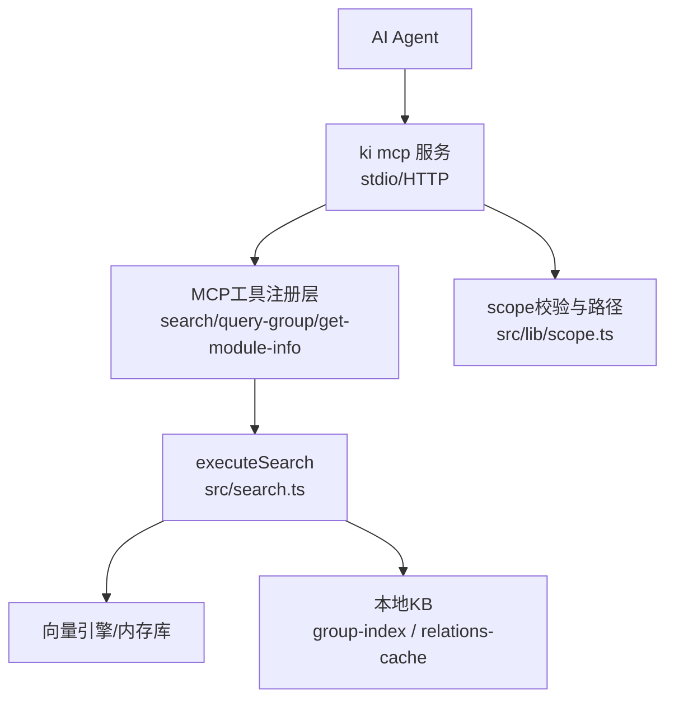
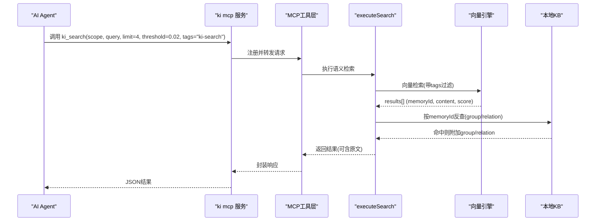
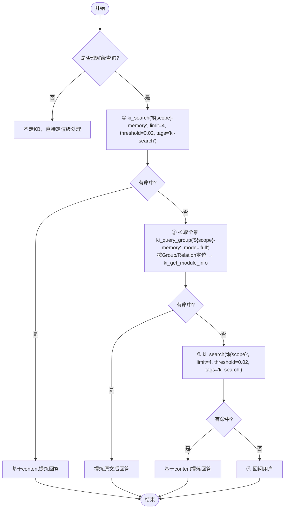
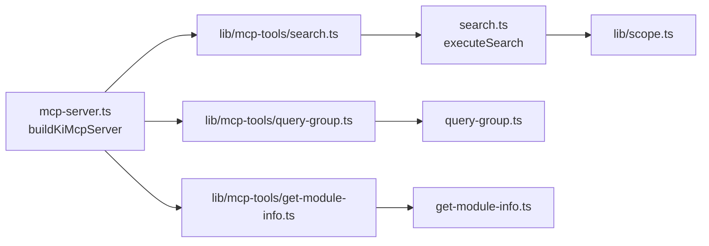

# ki-search技能使用指南

<cite>
**本文引用的文件**
- [skills/ki-search/SKILL.md](file://skills/ki-search/SKILL.md)
- [src/lib/mcp-tools/search.ts](file://src/lib/mcp-tools/search.ts)
- [src/lib/mcp-tools/query-group.ts](file://src/lib/mcp-tools/query-group.ts)
- [src/lib/mcp-tools/get-module-info.ts](file://src/lib/mcp-tools/get-module-info.ts)
- [src/search.ts](file://src/search.ts)
- [src/mcp-server.ts](file://src/mcp-server.ts)
- [src/lib/scope.ts](file://src/lib/scope.ts)
- [memories/ki-search-usage.md](file://memories/ki-search-usage.md)
- [docs/error-handling.md](file://docs/error-handling.md)
</cite>

## 目录
1. [简介](#简介)
2. [项目结构](#项目结构)
3. [核心组件](#核心组件)
4. [架构总览](#架构总览)
5. [详细组件分析](#详细组件分析)
6. [依赖关系分析](#依赖关系分析)
7. [性能考量](#性能考量)
8. [故障排查指南](#故障排查指南)
9. [结论](#结论)
10. [附录：MCP工具调用示例与参数说明](#附录mcp工具调用示例与参数说明)

## 简介
本指南面向需要基于代码知识库进行“理解级”查询的AI Agent或使用者，重点说明ki-search技能的“四步走查询策略”：语义检索优先、索引原位兜底、宏观兜底、回问用户。同时明确scope约定、代码相关性判定规则、定位级与理解级的区别，并提供MCP工具ki_search、ki_get_module_info、ki_query_group的参数配置与使用场景，以及白名单/黑名单写入规则与授权机制。

## 项目结构
ki-search技能由“行为规则文档 + MCP工具注册 + 搜索实现 + 范围与权限控制”共同构成：
- 行为规则：skills/ki-search/SKILL.md 定义四步走流程、scope约定、标签与阈值等约束。
- MCP工具：src/lib/mcp-tools/* 将能力暴露给上层Agent（ki_search、ki_query_group、ki_get_module_info等）。
- 搜索实现：src/search.ts 提供executeSearch，串联向量检索、原文召回、多标签去重等逻辑。
- 服务入口：src/mcp-server.ts 统一注册工具、启动stdio/HTTP模式、鉴权与预检。
- 范围与路径：src/lib/scope.ts 负责scope校验与KB路径构造。
- 记忆提示：memories/ki-search-usage.md 强调“遇事不决先查”。

图表来源
- [src/mcp-server.ts:54-70](file://src/mcp-server.ts#L54-L70)
- [src/lib/mcp-tools/search.ts:6-49](file://src/lib/mcp-tools/search.ts#L6-L49)
- [src/search.ts:70-199](file://src/search.ts#L70-L199)
- [src/lib/scope.ts:30-77](file://src/lib/scope.ts#L30-L77)

章节来源
- [skills/ki-search/SKILL.md:1-198](file://skills/ki-search/SKILL.md#L1-L198)
- [src/mcp-server.ts:54-70](file://src/mcp-server.ts#L54-L70)
- [src/search.ts:70-199](file://src/search.ts#L70-L199)
- [src/lib/scope.ts:30-77](file://src/lib/scope.ts#L30-L77)

## 核心组件
- ki_search：语义检索知识库内容，支持scope、query、limit、threshold、tags、include_original等参数；返回results[]含memoryId、content、score，并可附带group/relation及原文。
- ki_query_group：查询Group树与Relations，支持hot/warm/cold/emerging/full模式与向量语义兜底，用于步骤②的Group/Relation定位。
- ki_get_module_info：读取指定Group下Relation的本地KB Markdown内容，用于索引原位兜底。
- executeSearch：核心搜索函数，负责向量检索、多标签优先级合并、按memoryId反查relations-cache、可选原文召回与多chunk去重。
- scope校验：确保scope仅包含字母、数字、连字符、下划线，防止路径穿越与跨scope污染。

章节来源
- [src/lib/mcp-tools/search.ts:6-49](file://src/lib/mcp-tools/search.ts#L6-L49)
- [src/lib/mcp-tools/query-group.ts:6-53](file://src/lib/mcp-tools/query-group.ts#L6-L53)
- [src/lib/mcp-tools/get-module-info.ts:6-37](file://src/lib/mcp-tools/get-module-info.ts#L6-L37)
- [src/search.ts:70-199](file://src/search.ts#L70-L199)
- [src/lib/scope.ts:30-77](file://src/lib/scope.ts#L30-L77)

## 架构总览
ki-search在Agent侧以“行为规则驱动”，通过MCP工具调用完成检索与定位，底层由向量引擎与本地KB协同支撑。

图表来源
- [src/mcp-server.ts:54-70](file://src/mcp-server.ts#L54-L70)
- [src/lib/mcp-tools/search.ts:6-49](file://src/lib/mcp-tools/search.ts#L6-L49)
- [src/search.ts:70-199](file://src/search.ts#L70-L199)

## 详细组件分析

### 四步走查询策略（理解级）
- 步骤① 语义检索优先：调用ki_search(scope: "${scope}-memory", limit: 4, threshold: 0.02, tags: "ki-search")，从向量空间召回最相关片段，基于content提炼回答。
- 步骤② 索引原位兜底：若未命中，先用ki_query_group(scope: "${scope}-memory", mode: "full")拉取全景，再按Group/Relation定位，调用ki_get_module_info获取原文，Agent需提炼后回答。
- 步骤③ 宏观兜底：仍无命中时，调用ki_search(scope: "${scope}", limit: 4, threshold: 0.02, tags: "ki-search")作为宏观兜底。
- 步骤④ 回问用户：全部未命中时，向用户询问模块名称/文件路径/功能描述，不自动写回KB。

图表来源
- [skills/ki-search/SKILL.md:13-113](file://skills/ki-search/SKILL.md#L13-L113)
- [src/lib/mcp-tools/query-group.ts:6-53](file://src/lib/mcp-tools/query-group.ts#L6-L53)
- [src/lib/mcp-tools/get-module-info.ts:6-37](file://src/lib/mcp-tools/get-module-info.ts#L6-L37)
- [src/lib/mcp-tools/search.ts:6-49](file://src/lib/mcp-tools/search.ts#L6-L49)

章节来源
- [skills/ki-search/SKILL.md:13-113](file://skills/ki-search/SKILL.md#L13-L113)

### 代码相关性判定与查询类型
- 触发条件：涉及文件路径、函数/类名、bug排查、重构、架构、代码审查、测试、性能优化等。
- 不触发：闲聊、产品方向讨论、会议纪要、纯文档写作。
- 查询类型：
  - 定位级：目标明确，找位置，使用SearchSymbol/grep/Read，不走KB。
  - 理解级：需要架构/流程/设计意图，走KB四步走。
- 判断口诀：能用一个grep回答→定位级；需要读完文件才能回答→理解级。

章节来源
- [skills/ki-search/SKILL.md:45-59](file://skills/ki-search/SKILL.md#L45-L59)

### 语义检索实现要点（executeSearch）
- 向量可用性检测：不可用时返回降级错误信息。
- 标签优先级：默认全搜时按ki-search > ki-relation > ki-path顺序合并，避免低质量结果干扰。
- 原文召回：显式开启时按memoryId反查local KB，失败则降级为向量content并给出提示。
- 多标签去重：同一(group, relation)多tag写入导致重复命中时，保留score最高的一条。
- 同文件多chunk去重：同一文件多个chunk命中时，仅首次返回original，后续标记deduplicated避免重复。

章节来源
- [src/search.ts:70-199](file://src/search.ts#L70-L199)

### 范围隔离与路径安全（scope）
- 合法字符：仅允许字母、数字、连字符(-)、下划线(_)，拒绝路径穿越。
- 路径构造：getKbDir、getLocalKbDir等函数保证KB目录安全访问。
- 列表与迁移：支持列出已初始化scope、迁移旧格式group-index.json。

章节来源
- [src/lib/scope.ts:30-77](file://src/lib/scope.ts#L30-L77)
- [src/lib/scope.ts:174-198](file://src/lib/scope.ts#L174-L198)
- [src/lib/scope.ts:117-146](file://src/lib/scope.ts#L117-L146)

## 依赖关系分析
- MCP服务注册：buildKiMcpServer集中注册所有工具，包括search、query-group、get-module-info等。
- 工具到实现：每个工具文件通过withTimeout包装对应execute*函数，统一超时与错误处理。
- 搜索链路：ki_search → executeSearch → vectorSearch → relations-cache → local KB。
- 范围控制：所有工具均依赖scope校验，确保跨scope数据隔离。

图表来源
- [src/mcp-server.ts:54-70](file://src/mcp-server.ts#L54-L70)
- [src/lib/mcp-tools/search.ts:6-49](file://src/lib/mcp-tools/search.ts#L6-L49)
- [src/lib/mcp-tools/query-group.ts:6-53](file://src/lib/mcp-tools/query-group.ts#L6-L53)
- [src/lib/mcp-tools/get-module-info.ts:6-37](file://src/lib/mcp-tools/get-module-info.ts#L6-L37)
- [src/search.ts:70-199](file://src/search.ts#L70-L199)
- [src/lib/scope.ts:30-77](file://src/lib/scope.ts#L30-L77)

章节来源
- [src/mcp-server.ts:54-70](file://src/mcp-server.ts#L54-L70)

## 性能考量
- 固定limit=4与threshold=0.02：减少无关结果，提高命中率与可读性。
- 多标签优先级合并：避免低质量tag污染结果，提升整体相关性。
- 原文召回按需启用：默认关闭，仅在需要时打开，降低IO开销。
- 批量写入建议分批≤5条：组织成本低、单批失败重试代价小，服务端总耗时几乎不变。
- 向量引擎空闲释放锁：常驻模式下空闲超时自动释放LOCK，允许多实例错开共享。

章节来源
- [skills/ki-search/SKILL.md:74-160](file://skills/ki-search/SKILL.md#L74-L160)
- [src/search.ts:94-199](file://src/search.ts#L94-L199)
- [src/mcp-server.ts:680-685](file://src/mcp-server.ts#L680-L685)

## 故障排查指南
- 向量检索暂不可用：检查向量服务可用性与配置，必要时降级或修复embedding Key。
- scope非法：仅允许字母、数字、连字符、下划线；避免路径穿越字符。
- Group/Relation不存在：使用ki_query_group --mode full确认实际路径与名称。
- 原文不可用：本地KB缺失relation或读取异常，可尝试sync-relation或rebuild-vector。
- 常见恢复口诀：参数先补齐、路径先确认、scope先注册、索引先生成、再做下一步。

章节来源
- [src/search.ts:84-92](file://src/search.ts#L84-L92)
- [src/lib/scope.ts:30-43](file://src/lib/scope.ts#L30-L43)
- [docs/error-handling.md:13-60](file://docs/error-handling.md#L13-L60)
- [docs/error-handling.md:130-146](file://docs/error-handling.md#L130-L146)

## 结论
ki-search技能通过“语义检索优先、索引原位兜底、宏观兜底、回问用户”的四步走策略，在保证检索精度的同时兼顾鲁棒性。配合严格的scope约定、标签与阈值约束、以及白名单/黑名单写入规则，能够在复杂工程环境中稳定地为Agent提供高质量的知识检索与定位能力。

## 附录：MCP工具调用示例与参数说明

### ki_search
- 用途：语义检索知识库内容，优先在${scope}-memory中检索。
- 关键参数：
  - scope：项目隔离标识（省略默认default；strict模式必填且须白名单内）
  - query：自然语言查询文本
  - limit：返回条数上限（推荐4）
  - threshold：相似度阈值（推荐0.02）
  - tags：过滤标签（推荐ki-search；也可组合ki-relation/ki-path）
  - include_original：是否返回local KB文件级原文（默认false）
- 返回：ok/scope/results[]，每项含memoryId、content、score，可能附加group/relation/original等字段。

章节来源
- [src/lib/mcp-tools/search.ts:6-49](file://src/lib/mcp-tools/search.ts#L6-L49)
- [src/search.ts:70-199](file://src/search.ts#L70-L199)

### ki_query_group
- 用途：查询Group树与Relations，支持多种模式与向量语义兜底，用于步骤②的定位。
- 关键参数：
  - scope：项目隔离标识
  - groups/group：逗号分隔的Group路径（支持模糊匹配）
  - hot_count：热门展示个数
  - depth：索引层级深度
  - mode：展示分区（hot/warm/cold/emerging/full，支持逗号分隔）
  - auto_fallback：是否启用语义兜底（默认true）

章节来源
- [src/lib/mcp-tools/query-group.ts:6-53](file://src/lib/mcp-tools/query-group.ts#L6-L53)

### ki_get_module_info
- 用途：读取指定Group下某个Relation的本地KB Markdown内容，用于索引原位兜底。
- 关键参数：
  - scope：项目隔离标识
  - group：Group路径（支持向量语义兜底）
  - relation：Relation名称（精确匹配）

章节来源
- [src/lib/mcp-tools/get-module-info.ts:6-37](file://src/lib/mcp-tools/get-module-info.ts#L6-L37)

### 写入KB与授权机制
- 默认只读：正常检索不写入；发现知识库与实际代码不符需修正时，必须先说明差异并获得用户明确授权。
- 白名单（8类）：模块职责、API接口、架构约束、项目通用约定、bug模式与排查、重构策略、依赖版本约束、测试策略。
- 黑名单（6类）：用户喜好、项目记忆/进度、用户个人信息、一次性诊断、临时偏好、会话短期上下文。
- 写入方式：
  - 1~2条：ki_sync_relation逐条写
  - ≥3条：ki_bulk_sync_relation批量写（一次embed+一次向量写入），推荐每批≤5条
- 批量格式：items数组，每项含group、relation、module_info、tags（可选）、vector（可选，默认true）
- 返回值：results[].vectorStored表示该条向量是否写入；顶层vectorStored在所有条目全部成功时为true；hints可选，含Group路径解析提示

章节来源
- [skills/ki-search/SKILL.md:116-166](file://skills/ki-search/SKILL.md#L116-L166)

### 实际使用案例
- 了解模块职责/架构决策：先ki_query_group(scope: "${scope}-memory", mode: "full")拉取全景，再按Group/Relation定位，必要时ki_get_module_info获取原文。
- 查API接口/设计约束：优先ki_search(scope: "${scope}-memory", query: "接口名/约束关键词", limit: 4, threshold: 0.02, tags: "ki-search")。
- 排查bug：结合ki_search与ki_get_module_info，定位相关模块与实现细节。
- 代码审查：理解级问题一律走KB四步走；定位级问题直接用SearchSymbol/grep/Read。

章节来源
- [memories/ki-search-usage.md:1-12](file://memories/ki-search-usage.md#L1-L12)
- [skills/ki-search/SKILL.md:62-113](file://skills/ki-search/SKILL.md#L62-L113)