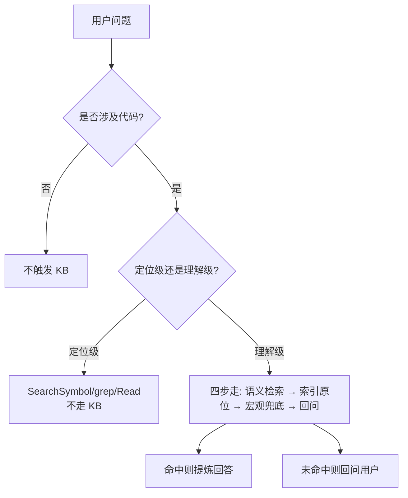
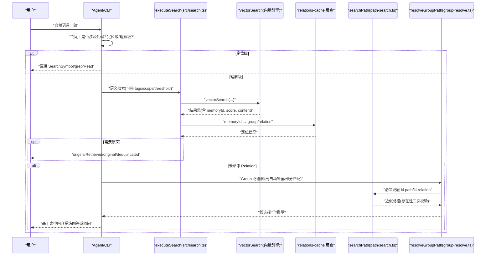
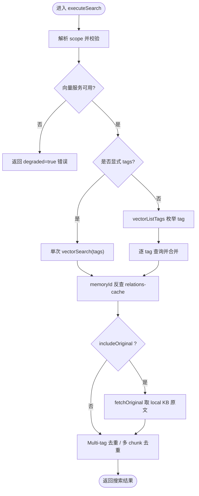
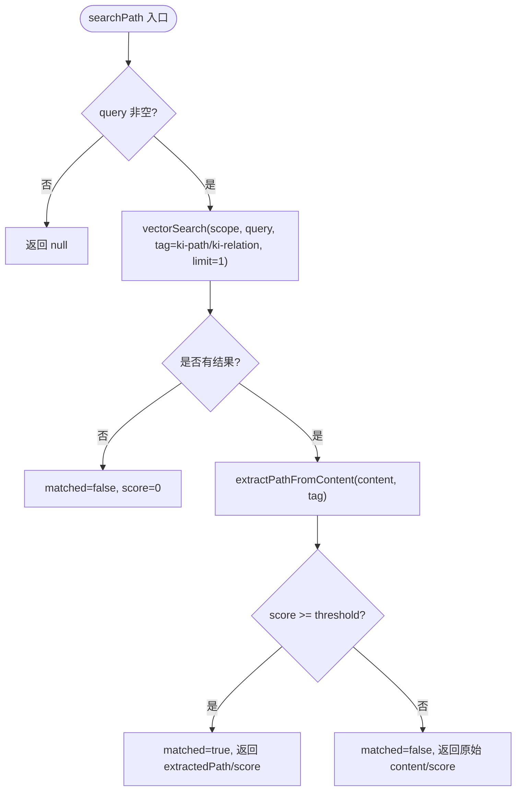
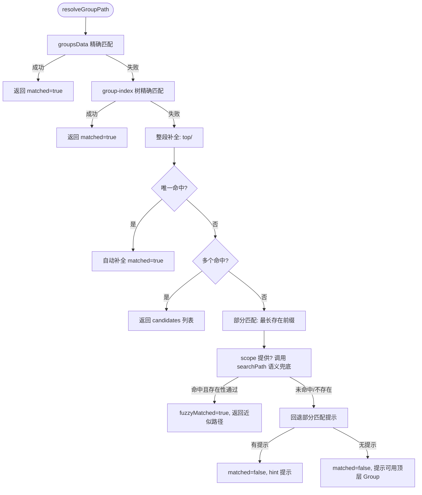
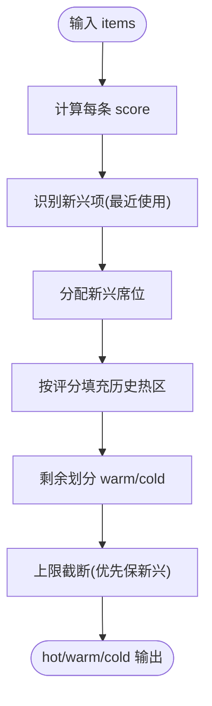
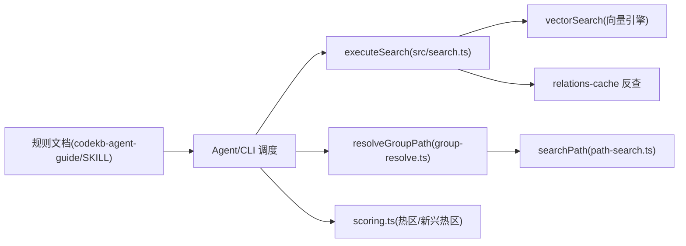

# 代码相关性判定

<cite>
**本文引用的文件**
- [docs/codekb-agent-guide.md](file://docs/codekb-agent-guide.md)
- [src/search.ts](file://src/search.ts)
- [src/lib/path-search.ts](file://src/lib/path-search.ts)
- [src/lib/group-resolve.ts](file://src/lib/group-resolve.ts)
- [src/lib/scoring.ts](file://src/lib/scoring.ts)
- [docs/cli.md](file://docs/cli.md)
- [skills/ki-search/SKILL.md](file://skills/ki-search/SKILL.md)
</cite>

## 目录
1. [引言](#引言)
2. [项目结构](#项目结构)
3. [核心组件](#核心组件)
4. [架构总览](#架构总览)
5. [详细组件分析](#详细组件分析)
6. [依赖关系分析](#依赖关系分析)
7. [性能考量](#性能考量)
8. [故障排查指南](#故障排查指南)
9. [结论](#结论)
10. [附录：决策树与判断口诀](#附录决策树与判断口诀)

## 引言
本文件面向“代码知识库检索”的入口判定与执行路径选择，目标是明确：
- 何时触发 KB 查询（触发场景特征）
- 如何区分“定位级”和“理解级”查询（判断标准、决策树、判断口诀）
- 为什么必须优先语义检索而非按索引遍历
- 具体场景示例与误用处理

## 项目结构
围绕“代码相关性判定”，仓库提供了规则文档、检索实现、路径解析与评分等关键模块：
- 规则与流程：docs/codekb-agent-guide.md、skills/ki-search/SKILL.md
- 语义检索入口：src/search.ts
- 路径语义兜底：src/lib/path-search.ts
- Group 路径解析：src/lib/group-resolve.ts
- 评分与冷热分区：src/lib/scoring.ts
- CLI 输出字段说明：docs/cli.md

图表来源
- [docs/codekb-agent-guide.md:50-92](file://docs/codekb-agent-guide.md#L50-L92)
- [skills/ki-search/SKILL.md:13-33](file://skills/ki-search/SKILL.md#L13-L33)

章节来源
- [docs/codekb-agent-guide.md:50-92](file://docs/codekb-agent-guide.md#L50-L92)
- [skills/ki-search/SKILL.md:13-33](file://skills/ki-search/SKILL.md#L13-L33)

## 核心组件
- 语义检索入口 executeSearch：负责 scope 校验、向量服务可用性检测、按 tag 分查或单次查询、memoryId 反查 relations-cache、原文召回与去重。
- 路径语义搜索 searchPath：对 Group 路径/Relation 名称做语义模糊匹配，异常静默降级，阈值默认 0（RRF 融合分），由调用方二次校验存在性。
- Group 路径解析 resolveGroupPath：四层查找 + 向量兜底，返回补全提示、候选列表、近似匹配分数。
- 评分引擎 scoring：密度评分、防刷使用记录、冷热分区与边界衰减，支撑热区/新兴热区展示与排序。
- 规则文档 codekb-agent-guide 与 SKILL：定义触发条件、查询类型判定、四步走流程与禁忌清单。

章节来源
- [src/search.ts:70-199](file://src/search.ts#L70-L199)
- [src/lib/path-search.ts:38-87](file://src/lib/path-search.ts#L38-L87)
- [src/lib/group-resolve.ts:117-219](file://src/lib/group-resolve.ts#L117-L219)
- [src/lib/scoring.ts:44-117](file://src/lib/scoring.ts#L44-L117)
- [docs/codekb-agent-guide.md:50-92](file://docs/codekb-agent-guide.md#L50-L92)
- [skills/ki-search/SKILL.md:13-33](file://skills/ki-search/SKILL.md#L13-L33)

## 架构总览
下图展示了从“用户问题”到“KB 检索/定位”的端到端流程，以及各模块的职责边界。

图表来源
- [src/search.ts:70-199](file://src/search.ts#L70-L199)
- [src/lib/path-search.ts:38-87](file://src/lib/path-search.ts#L38-L87)
- [src/lib/group-resolve.ts:117-219](file://src/lib/group-resolve.ts#L117-L219)
- [docs/codekb-agent-guide.md:50-92](file://docs/codekb-agent-guide.md#L50-L92)

## 详细组件分析

### 组件A：语义检索入口 executeSearch
- 职责
  - Scope 护栏与向量服务可用性检测
  - 显式 tags 单次查询；不传 tags 时枚举所有 tag 并合并，按优先级排序
  - memoryId 反查 relations-cache，附加 group/relation
  - 可选原文召回与多 chunk 去重
  - Multi-tag 去重（同一 group|relation 保留最高分）
- 关键点
  - 默认搜索全部 tag 时，按 TAG_PRIORITY 排序（内容优先）
  - 原文获取失败降级为向量文档并给出 hint
  - 多 chunk 命中仅首条携带 original，其余标注 deduplicated

图表来源
- [src/search.ts:70-199](file://src/search.ts#L70-L199)

章节来源
- [src/search.ts:70-199](file://src/search.ts#L70-L199)
- [docs/cli.md:511-524](file://docs/cli.md#L511-L524)

### 组件B：路径语义搜索 searchPath
- 职责
  - 封装 vectorSearch，针对 ki-path/ki-relation 做语义模糊匹配
  - 默认阈值 0（RRF 融合分），接受 top-1，由调用方做存在性二次校验
  - 任何异常静默降级返回 null
- 关键点
  - 提取路径/名称：ki-path 将空格转回斜杠；ki-relation 取 | 前名称
  - 异常统一 stderr 提示并返回 null，避免中断主流程

图表来源
- [src/lib/path-search.ts:38-87](file://src/lib/path-search.ts#L38-L87)

章节来源
- [src/lib/path-search.ts:38-87](file://src/lib/path-search.ts#L38-L87)

### 组件C：Group 路径解析 resolveGroupPath
- 职责
  - 四层查找 + 向量兜底：精确匹配 → 整段补全 → 部分匹配 → 向量语义兜底
  - 向量兜底后需二次校验路径真实存在于 group-index/groupsData
- 关键点
  - 唯一命中自动补全；多个命中返回候选列表
  - 向量兜底失败回退到部分匹配提示
  - 完全无匹配时提示可用顶层 Group

图表来源
- [src/lib/group-resolve.ts:117-219](file://src/lib/group-resolve.ts#L117-L219)
- [src/lib/path-search.ts:38-87](file://src/lib/path-search.ts#L38-L87)

章节来源
- [src/lib/group-resolve.ts:117-219](file://src/lib/group-resolve.ts#L117-L219)

### 组件D：评分与冷热分区 scoring
- 职责
  - calculateScore：密度评分（useCount 与最近使用时间）
  - recordUse：防刷（间隔与上限）
  - hybridPartition/partitionByScore：相对排名分区（新兴热区 + 历史热门 + 常温/冷区）
  - boundaryDecay：新内容进入热区时的边界衰减
- 关键点
  - 新兴项优先占位，再按评分填充
  - 上限截断保护 hot/warm/cold 规模
  - 边界衰减防止分数膨胀

图表来源
- [src/lib/scoring.ts:44-117](file://src/lib/scoring.ts#L44-L117)
- [src/lib/scoring.ts:136-209](file://src/lib/scoring.ts#L136-L209)
- [src/lib/scoring.ts:222-274](file://src/lib/scoring.ts#L222-L274)

章节来源
- [src/lib/scoring.ts:44-117](file://src/lib/scoring.ts#L44-L117)
- [src/lib/scoring.ts:136-209](file://src/lib/scoring.ts#L136-L209)
- [src/lib/scoring.ts:222-274](file://src/lib/scoring.ts#L222-L274)

## 依赖关系分析
- 规则层（codekb-agent-guide、SKILL）驱动上层 Agent/CLI 的行为决策：触发条件、查询类型、四步走流程。
- 执行层（search.ts）依赖向量客户端与 relations-cache，完成语义检索与原文召回。
- 辅助层（path-search.ts、group-resolve.ts）提供路径/关系的语义兜底与智能补全。
- 数据层（scoring.ts）为热区/新兴热区提供评分与分区能力，影响展示与排序。

图表来源
- [docs/codekb-agent-guide.md:50-92](file://docs/codekb-agent-guide.md#L50-L92)
- [skills/ki-search/SKILL.md:13-33](file://skills/ki-search/SKILL.md#L13-L33)
- [src/search.ts:70-199](file://src/search.ts#L70-L199)
- [src/lib/group-resolve.ts:117-219](file://src/lib/group-resolve.ts#L117-L219)
- [src/lib/path-search.ts:38-87](file://src/lib/path-search.ts#L38-L87)
- [src/lib/scoring.ts:44-117](file://src/lib/scoring.ts#L44-L117)

章节来源
- [docs/codekb-agent-guide.md:50-92](file://docs/codekb-agent-guide.md#L50-L92)
- [skills/ki-search/SKILL.md:13-33](file://skills/ki-search/SKILL.md#L13-L33)
- [src/search.ts:70-199](file://src/search.ts#L70-L199)
- [src/lib/group-resolve.ts:117-219](file://src/lib/group-resolve.ts#L117-L219)
- [src/lib/path-search.ts:38-87](file://src/lib/path-search.ts#L38-L87)
- [src/lib/scoring.ts:44-117](file://src/lib/scoring.ts#L44-L117)

## 性能考量
- 语义检索优先：一次 vectorSearch 即可召回最相关片段，避免遍历索引的低效与高成本。
- 标签优先级：默认搜索全部时按 TAG_PRIORITY 合并，保证内容向量优先。
- 去重策略：Multi-tag 与多 chunk 命中去重，减少冗余输出与后续处理开销。
- 原文召回按需开启：仅在 includeOriginal 时读取 local KB，降低 IO。
- 评分与分区：hybridPartition 与 boundaryDecay 控制热区规模，提升展示与排序效率。

[本节为通用指导，不直接分析具体文件]

## 故障排查指南
- 向量服务不可用：executeSearch 会返回 degraded=true 的错误信息，应提示用户检查向量服务状态。
- 原文不可用：当 local KB 缺失 relation 或读取异常时，返回 originalHint 并降级为向量文档内容。
- 路径语义兜底失败：searchPath 异常静默降级返回 null，调用方应继续原有精确匹配逻辑。
- 多 chunk 重复：deduplicated 标记用于消费方识别重复原文，避免重复展示。

章节来源
- [src/search.ts:84-92](file://src/search.ts#L84-L92)
- [src/search.ts:137-155](file://src/search.ts#L137-L155)
- [src/lib/path-search.ts:82-86](file://src/lib/path-search.ts#L82-L86)
- [docs/cli.md:511-524](file://docs/cli.md#L511-L524)

## 结论
- 触发 KB 的关键在于“是否涉及代码”与“查询类型”。
- 定位级走快速路径（符号/全文检索），理解级走四步走（语义检索优先）。
- 必须优先语义检索：能一次性召回最相关内容，避免低效的索引遍历。
- 路径/关系模糊匹配通过 searchPath + group-resolve 提供鲁棒性，并以存在性二次校验保障质量。
- 评分与分区确保热区/新兴热区的时效性与可控规模。

[本节为总结，不直接分析具体文件]

## 附录：决策树与判断口诀

### 触发 KB 的场景特征
- 正例（触发）：提到具体文件路径、函数名/类名/变量名；询问 bug 排查/报错信息；涉及重构/迁移/依赖/版本/部署/CI；涉及架构/设计模式/代码审查/测试；涉及性能优化/数据库 schema。
- 反例（不触发）：纯闲聊/问候；产品方向讨论（无代码指向）；会议纪要/团队沟通；纯文档写作（不涉及代码引用）。
- 边界模糊：不确定时先确认是否需要加载知识库索引。

章节来源
- [docs/codekb-agent-guide.md:50-92](file://docs/codekb-agent-guide.md#L50-L92)

### 定位级 vs 理解级
- 定位级：目标明确，只需找到位置（如“X 在哪”“URL 是什么”“报错在第几行”）→ 使用 SearchSymbol/grep/Read，不走 KB。
- 理解级：需要架构/流程/设计意图等上下文（如“如何实现”“模块架构”“依赖关系”）→ 走 KB 四步走。
- 判断口诀：能用一个 grep 回答的 → 定位级；需要读完一个文件才能回答的 → 理解级。

章节来源
- [docs/codekb-agent-guide.md:75-86](file://docs/codekb-agent-guide.md#L75-L86)
- [skills/ki-search/SKILL.md:45-59](file://skills/ki-search/SKILL.md#L45-L59)

### 为什么必须优先语义检索
- 语义检索一次召回最相关内容，避免按索引逐项遍历的高成本与低命中率。
- 支持 tags 过滤与优先级合并，兼顾内容与路径/关系向量。
- 结合 relations-cache 反查与原文召回，形成“语义 → 定位 → 原文”的高效链路。

章节来源
- [src/search.ts:94-121](file://src/search.ts#L94-L121)
- [skills/ki-search/SKILL.md:62-69](file://skills/ki-search/SKILL.md#L62-L69)

### 具体场景示例
- 场景1：定位接口 URL
  - 判定：定位级
  - 路径：SearchSymbol/grep/Read
  - 不触发 KB
- 场景2：告警收敛机制如何实现
  - 判定：理解级
  - 路径：语义检索 → 若未命中 Relation，查热区/新兴热区 → 取原文 → 仍无则语义兜底
- 场景3：路径拼写错误
  - 判定：理解级（Group 定位）
  - 路径：resolveGroupPath → searchPath 语义兜底 → 存在性二次校验 → 返回补全/候选

章节来源
- [docs/codekb-agent-guide.md:75-86](file://docs/codekb-agent-guide.md#L75-L86)
- [src/lib/group-resolve.ts:117-219](file://src/lib/group-resolve.ts#L117-L219)
- [src/lib/path-search.ts:38-87](file://src/lib/path-search.ts#L38-L87)

### 误用情况的处理方法
- 误用1：把闲聊/产品讨论当作代码问题
  - 处理：不触发 KB，直接对话回复
- 误用2：理解级却直接遍历索引
  - 处理：改为语义检索优先，命中后再取原文
- 误用3：路径模糊但跳过存在性校验
  - 处理：searchPath 返回候选后，必须在 group-index/groupsData 中二次校验存在性
- 误用4：原文不可用时强行展示空内容
  - 处理：降级为向量文档并附带 originalHint，引导用户补充线索

章节来源
- [docs/codekb-agent-guide.md:50-92](file://docs/codekb-agent-guide.md#L50-L92)
- [src/lib/path-search.ts:82-86](file://src/lib/path-search.ts#L82-L86)
- [src/search.ts:137-155](file://src/search.ts#L137-L155)