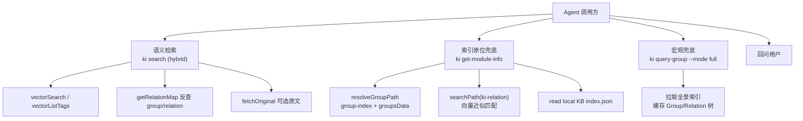
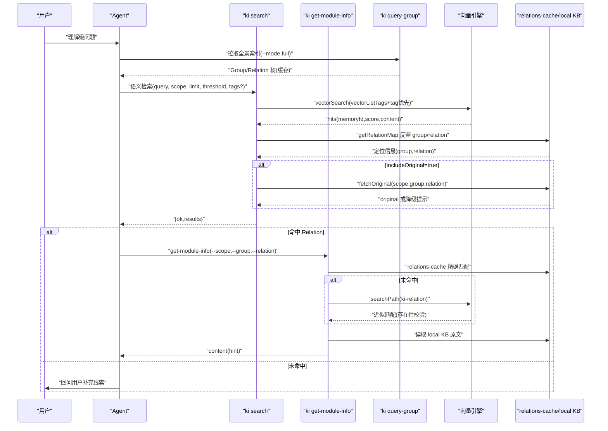
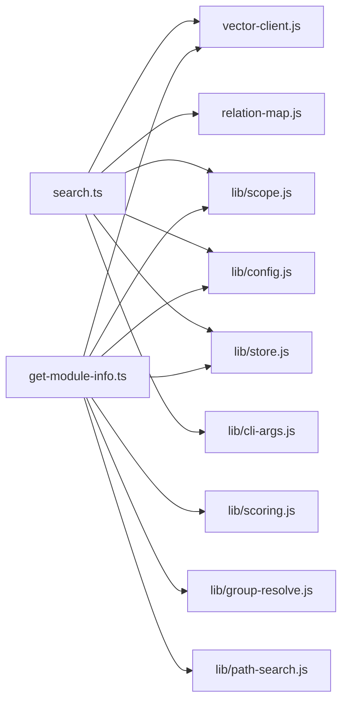

# 四步走查询策略

<cite>
**本文引用的文件**
- [src/search.ts](file://src/search.ts)
- [src/get-module-info.ts](file://src/get-module-info.ts)
- [src/lib/group-resolve.ts](file://src/lib/group-resolve.ts)
- [src/lib/path-search.ts](file://src/lib/path-search.ts)
- [docs/codekb-agent-guide.md](file://docs/codekb-agent-guide.md)
- [docs/cli.md](file://docs/cli.md)
- [docs/ki-command-guide.md](file://docs/ki-command-guide.md)
- [.gitnexus/wiki/search-retrieval.md](file://.gitnexus/wiki/search-retrieval.md)
</cite>

## 目录
1. [引言](#引言)
2. [项目结构](#项目结构)
3. [核心组件](#核心组件)
4. [架构总览](#架构总览)
5. [详细组件分析](#详细组件分析)
6. [依赖关系分析](#依赖关系分析)
7. [性能考量](#性能考量)
8. [故障排查指南](#故障排查指南)
9. [结论](#结论)

## 引言
本文件面向“理解级”知识查询，系统化阐述“四步走查询策略”的完整流程与实现细节：
- 第①步：语义检索优先（${scope}-memory）
- 第②步：索引原位兜底（ki get-module-info）
- 第③步：宏观兜底（${scope}）
- 第④步：回问用户

该顺序设计兼顾“召回质量、响应时延、可解释性、容错降级”。每一步都有明确的触发条件、参数配置与返回处理规则；步骤之间通过结构化数据流转衔接，确保在向量服务不可用或命中不足时仍能稳定输出。

## 项目结构
围绕四步走策略的关键代码与文档分布如下：
- 语义检索入口与混合检索逻辑：src/search.ts
- 模块原文读取与评分更新：src/get-module-info.ts
- Group 路径解析与向量兜底：src/lib/group-resolve.ts
- 路径/关系名称的向量语义搜索封装：src/lib/path-search.ts
- Agent 行为规则与四步走流程图：docs/codekb-agent-guide.md
- CLI 命令参考与 search/query-group 用法：docs/cli.md, docs/ki-command-guide.md
- 检索策略与 tag 优先级说明：.gitnexus/wiki/search-retrieval.md

图表来源
- [src/search.ts:70-199](file://src/search.ts#L70-L199)
- [src/get-module-info.ts:61-167](file://src/get-module-info.ts#L61-L167)
- [src/lib/group-resolve.ts:117-219](file://src/lib/group-resolve.ts#L117-L219)
- [src/lib/path-search.ts:47-86](file://src/lib/path-search.ts#L47-L86)
- [docs/codekb-agent-guide.md:128-262](file://docs/codekb-agent-guide.md#L128-L262)

章节来源
- [docs/codekb-agent-guide.md:128-262](file://docs/codekb-agent-guide.md#L128-L262)
- [docs/cli.md:467-531](file://docs/cli.md#L467-L531)
- [docs/ki-command-guide.md:19-63](file://docs/ki-command-guide.md#L19-L63)

## 核心组件
- 语义检索（ki search）：支持显式 tags 或全量 tag 分查，按 TAG_PRIORITY 排序，附加 memoryId 反查定位 group/relation，可选返回本地 KB 原文并做多 chunk 去重。
- 索引原位兜底（ki get-module-info）：基于 relations-cache 中的 hot_relations 精确匹配 Relation，失败则调用 searchPath(ki-relation) 做近似匹配，最终从 local KB 读取 Markdown 并更新评分。
- 宏观兜底（ki query-group --mode full）：拉取 scope 下全部 Group 与 Relation 树，用于快速确认目标范围或发现候选 Relation。
- 路径/关系名称向量兜底（searchPath）：对 ki-path/ki-relation 标签执行 hybrid 检索，默认阈值 0（RRF 融合分），由上游进行存在性二次校验保证质量。

章节来源
- [src/search.ts:20-199](file://src/search.ts#L20-L199)
- [src/get-module-info.ts:61-167](file://src/get-module-info.ts#L61-L167)
- [src/lib/path-search.ts:16-86](file://src/lib/path-search.ts#L16-L86)
- [docs/cli.md:467-531](file://docs/cli.md#L467-L531)

## 架构总览
四步走策略的执行顺序与数据流如下：

图表来源
- [src/search.ts:70-199](file://src/search.ts#L70-L199)
- [src/get-module-info.ts:61-167](file://src/get-module-info.ts#L61-L167)
- [src/lib/group-resolve.ts:117-219](file://src/lib/group-resolve.ts#L117-L219)
- [src/lib/path-search.ts:47-86](file://src/lib/path-search.ts#L47-L86)
- [docs/codekb-agent-guide.md:128-262](file://docs/codekb-agent-guide.md#L128-L262)

## 详细组件分析

### 第①步：语义检索优先（${scope}-memory）
- 触发条件：理解级查询首选，优先尝试记忆层语义检索，以获取最相关片段。
- 关键参数：
  - query：自然语言查询文本（必填）
  - scope：项目隔离标识（default/strict 模式）
  - limit：返回条数上限（默认 10）
  - threshold：融合得分阈值（默认 0，不过滤）
  - tags：过滤标签（不传则搜索全部 tag，按优先级合并）
  - original：是否返回本地 KB 原文（默认 false）
- 执行要点：
  - 显式 tags：单次 vectorSearch（多 tag OR）
  - 不传 tags：先 vectorListTags 枚举，每个 tag 单独查询（各取 limit 条），再按 TAG_PRIORITY 排序合并
  - 反查 memoryId → 附加 group/relation 定位
  - 可选 fetchOriginal 并做 multi-tag 与多 chunk 去重
- 返回处理：
  - ok=true：包含 results[]，每条带 score/content/tag/group/relation/originalRetrieved/original/originalHint/deduplicated
  - ok=false：degraded=true 表示向量服务不可用，应降级到后续步骤

章节来源
- [src/search.ts:20-199](file://src/search.ts#L20-L199)
- [docs/cli.md:467-531](file://docs/cli.md#L467-L531)
- [.gitnexus/wiki/search-retrieval.md:234-251](file://.gitnexus/wiki/search-retrieval.md#L234-L251)

### 第②步：索引原位兜底（ki get-module-info）
- 触发条件：语义检索未直接命中目标 Relation，或需要原文支撑回答时。
- 关键参数：
  - scope：项目隔离标识
  - group：Group 路径（支持自动补全与向量兜底）
  - relation：Relation ID 或名称
- 执行要点：
  - resolveGroupPath：先在 relations-cache 与 group-index 中精确匹配，再尝试顶层前缀补全，最后调用 searchPath(ki-path) 做向量近似匹配并二次校验存在性
  - 若 relation 未命中，调用 searchPath(ki-relation) 做近似匹配，成功后继续
  - 从 local KB 读取 Markdown 原文，并 recordUse 更新评分
- 返回处理：
  - ok=true：content=Markdown 原文，可能附带 hint（如近似匹配提示）
  - ok=false：error/hint 明确指示缺失原因（Group/Relation 不存在、local KB 缺失等）

章节来源
- [src/get-module-info.ts:61-167](file://src/get-module-info.ts#L61-L167)
- [src/lib/group-resolve.ts:117-219](file://src/lib/group-resolve.ts#L117-L219)
- [src/lib/path-search.ts:47-86](file://src/lib/path-search.ts#L47-L86)

### 第③步：宏观兜底（${scope}）
- 触发条件：当第①步未命中且第②步无法定位 Relation 时，使用全景索引确认范围或发现候选。
- 关键参数：
  - scope：项目隔离标识
  - mode：full（拉取完整索引树）
- 执行要点：
  - 拉取 scope 下所有 Group 与 Relation 树，用于重新确认目标范围或扩大范围
  - 可用于修正 Group 路径、发现 Relation 名称差异
- 返回处理：
  - 输出 Group/Relation 树与热度统计，辅助决策下一步动作

章节来源
- [docs/ki-command-guide.md:19-63](file://docs/ki-command-guide.md#L19-L63)
- [docs/codekb-agent-guide.md:153-160](file://docs/codekb-agent-guide.md#L153-L160)

### 第④步：回问用户
- 触发条件：索引与语义检索均未命中，或无法解析 Group/Relation。
- 行为：
  - 暂停并请求用户提供模块名称/文件路径/功能描述等线索
  - 根据反馈重新执行第①~③步，必要时写入新条目沉淀到知识库

章节来源
- [docs/codekb-agent-guide.md:257-262](file://docs/codekb-agent-guide.md#L257-L262)

### 为什么采用这种顺序设计
- 语义检索优先：利用向量语义召回高相关片段，减少人工定位成本，提升首屏命中率与时延表现。
- 索引原位兜底：在已有 relations-cache 与 local KB 上直接取原文，避免额外网络开销，同时更新评分促进热知识持续曝光。
- 宏观兜底：当局部定位失败时，通过全景索引校正范围，提高鲁棒性。
- 回问用户：作为最终兜底，确保系统在未知场景下仍可引导用户补充信息，形成闭环。

章节来源
- [docs/codekb-agent-guide.md:128-262](file://docs/codekb-agent-guide.md#L128-L262)

## 依赖关系分析
- search.ts 依赖：
  - lib/scope.js：scope 解析与校验
  - lib/config.js：配置加载与 scope 模式
  - lib/vector-client.js：vectorSearch/vectorListTags/ensureVectorAvailable/closeEngine
  - lib/relation-map.js：memoryId → group/relation 反查映射
  - lib/store.js：JSON 读写
  - lib/cli-args.js：CLI 数值参数解析与告警回退
- get-module-info.ts 依赖：
  - lib/store.js：readJson/writeJson/readGroupIndex
  - lib/scope.js：getRelationsCachePath/getLocalKbDir/validateScope
  - lib/scoring.js：recordUse/calculateScore
  - lib/group-resolve.js：resolveGroupPath
  - lib/path-search.js：searchPath
  - lib/vector-client.js：closeEngine
  - lib/config.js：loadConfig/resolveScope

图表来源
- [src/search.ts:11-18](file://src/search.ts#L11-L18)
- [src/get-module-info.ts:11-25](file://src/get-module-info.ts#L11-L25)

章节来源
- [src/search.ts:11-18](file://src/search.ts#L11-L18)
- [src/get-module-info.ts:11-25](file://src/get-module-info.ts#L11-L25)

## 性能考量
- 混合检索优化：
  - 显式 tags 单次查询 vs 全量 tag 分查后按优先级合并，避免重复计算
  - memoryId 反查映射带 TTL+mtime 缓存，首次构建 O(N)，后续 O(1)
- 原文召回优化：
  - includeOriginal 默认关闭，仅在需要时开启
  - 同一文件多 chunk 命中仅保留首个原文，其余标注 deduplicated，减少冗余 IO
- 向量兜底降级：
  - path-search 异常静默降级为 null，不影响主流程
  - ensureVectorAvailable 不可用时直接返回 degraded，上层可快速降级

章节来源
- [src/search.ts:123-199](file://src/search.ts#L123-L199)
- [src/lib/path-search.ts:55-86](file://src/lib/path-search.ts#L55-L86)
- [.gitnexus/wiki/search-retrieval.md:234-251](file://.gitnexus/wiki/search-retrieval.md#L234-L251)

## 故障排查指南
- 向量服务不可用：
  - 现象：search 返回 {ok:false, error:"向量检索暂不可用...", degraded:true}
  - 处理：检查 ensureVectorAvailable 结果，必要时切换到宏观兜底或回问用户
- Group/Relation 未匹配：
  - 现象：get-module-info 返回 error 含“未匹配到有效路径”或“Relation ... 不存在”
  - 处理：使用 query-group --mode full 确认 Group/Relation 名称；必要时借助 searchPath 近似匹配提示
- 原文不可用：
  - 现象：search 返回 originalRetrieved=false 与 originalHint
  - 处理：执行 sync-relation 重新写入；或接受 content 作为降级内容
- 常见错误与修复：
  - memory_recall 参数误用 text 导致解析失败：改为 query 参数
  - 非法数值参数：cli-args 提供告警与回退，避免 NaN 丢光结果

章节来源
- [src/search.ts:84-92](file://src/search.ts#L84-L92)
- [src/get-module-info.ts:79-121](file://src/get-module-info.ts#L79-L121)
- [docs/codekb-agent-guide.md:232-235](file://docs/codekb-agent-guide.md#L232-L235)

## 结论
四步走查询策略通过“语义检索优先、索引原位兜底、宏观兜底、回问用户”的顺序，实现了高质量召回、低延迟响应与强鲁棒性的平衡。每一步均有清晰的触发条件、参数配置与返回处理规则，并通过 structured 数据在步骤间流转。结合向量兜底与原文召回机制，系统能在多种异常场景下保持稳定输出，并在命中后将热门知识逐步沉淀至本地索引，持续提升后续查询效率。