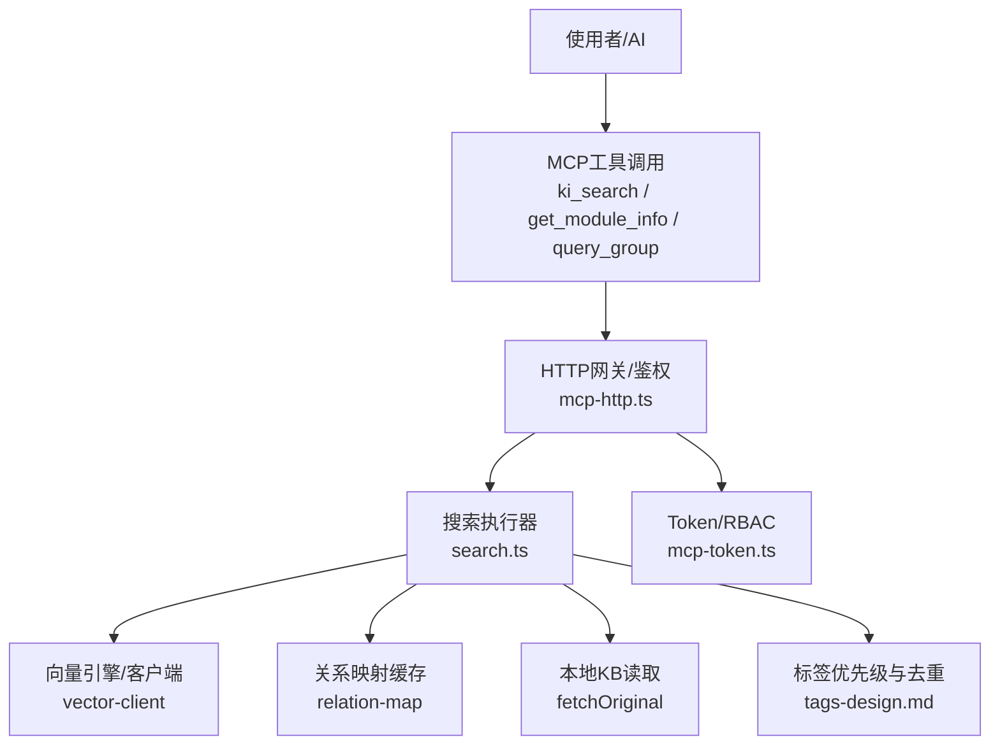
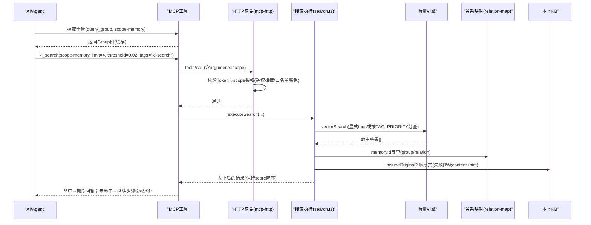
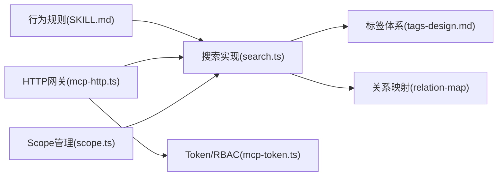

# 最佳实践与禁忌

<cite>
**本文引用的文件**
- [skills/ki-search/SKILL.md](file://skills/ki-search/SKILL.md)
- [memories/ki-search-usage.md](file://memories/ki-search-usage.md)
- [src/search.ts](file://src/search.ts)
- [src/scope.ts](file://src/scope.ts)
- [src/lib/mcp-token.ts](file://src/lib/mcp-token.ts)
- [src/lib/mcp-http.ts](file://src/lib/mcp-http.ts)
- [docs/tags-design.md](file://docs/tags-design.md)
- [.gitnexus/wiki/search-retrieval.md](file://.gitnexus/wiki/search-retrieval.md)
- [test/fixtures/mock-wiki/核心概念/Scope 隔离机制.md](file://test/fixtures/mock-wiki/核心概念/Scope 隔离机制.md)
- [AGENTS.md](file://AGENTS.md)
</cite>

## 目录
1. [简介](#简介)
2. [项目结构](#项目结构)
3. [核心组件](#核心组件)
4. [架构总览](#架构总览)
5. [详细组件分析](#详细组件分析)
6. [依赖关系分析](#依赖关系分析)
7. [性能考量](#性能考量)
8. [故障排查指南](#故障排查指南)
9. [结论](#结论)
10. [附录](#附录)

## 简介
本文件面向使用 ki-search 技能进行代码知识库检索的工程师，总结“最佳实践与禁忌清单”，重点解释 11 条红线规则的含义、违反后果，并给出写前自检清单、常见错误排查方法、经验总结与性能优化建议。内容基于仓库中的技能说明、搜索实现、scope 管理、标签体系、HTTP 鉴权与授权等源码与文档提炼而成。

## 项目结构
- 行为规则：skills/ki-search/SKILL.md 定义了理解级四步走、写入策略、禁忌清单与存储位置。
- 记忆与场景：memories/ki-search-usage.md 强调“遇事不决先查”的原则。
- 搜索实现：src/search.ts 提供语义检索、tag 优先级、原文召回、去重等逻辑。
- Scope 管理：src/scope.ts 提供 scope 生命周期（list/delete/clear）与两层一致性保障。
- 标签设计：docs/tags-design.md 定义 ki-search/ki-path/ki-relation 三类 tag 的用途与解析。
- 检索流程文档：.gitnexus/wiki/search-retrieval.md 描述检索步骤、tag 优先级、原文召回与多 chunk 去重。
- 权限与授权：src/lib/mcp-token.ts 与 src/lib/mcp-http.ts 实现多 Token RBAC、HTTP 层 scope 越权拦截与白名单豁免。
- 隔离机制：test/fixtures/mock-wiki/核心概念/Scope 隔离机制.md 说明 scope 隔离的数据目录与配置。
- 安全加固记录：AGENTS.md 记录了 HTTP 闸门豁免、批量越权绕过修复、损坏保护等关键修复点。

**图表来源**
- [src/lib/mcp-http.ts:100-138](file://src/lib/mcp-http.ts#L100-L138)
- [src/search.ts:70-199](file://src/search.ts#L70-L199)
- [docs/tags-design.md:74-108](file://docs/tags-design.md#L74-L108)

**章节来源**
- [skills/ki-search/SKILL.md:1-198](file://skills/ki-search/SKILL.md#L1-L198)
- [memories/ki-search-usage.md:1-12](file://memories/ki-search-usage.md#L1-L12)
- [src/search.ts:1-248](file://src/search.ts#L1-L248)
- [src/scope.ts:1-303](file://src/scope.ts#L1-L303)
- [docs/tags-design.md:74-108](file://docs/tags-design.md#L74-L108)
- [.gitnexus/wiki/search-retrieval.md:234-349](file://.gitnexus/wiki/search-retrieval.md#L234-L349)
- [test/fixtures/mock-wiki/核心概念/Scope 隔离机制.md:1-26](file://test/fixtures/mock-wiki/核心概念/Scope 隔离机制.md#L1-L26)
- [AGENTS.md:101-112](file://AGENTS.md#L101-L112)

## 核心组件
- 行为规则与流程：四步走查询、写入白名单/黑名单、批量写入策略、Group 管理。
- 搜索执行：scope 护栏、向量可用性检测、显式 tags 单次查询或默认全量分 tag 查询、memoryId 反查、原文召回、multi-tag 与多 chunk 去重。
- 标签体系：ki-search（内容）、ki-relation（关系名）、ki-path（路径），以及 TAG_PRIORITY 排序。
- Scope 隔离：每个 scope 独立数据目录，支持 list/delete/clear，确保 KB 与向量层一致。
- 权限与授权：多 Token + scope 集合 RBAC；HTTP 层统一拦截 tools/call 的 scope 参数，白名单豁免枚举工具；缺省 effective scope='default' 防越权。

**章节来源**
- [skills/ki-search/SKILL.md:37-167](file://skills/ki-search/SKILL.md#L37-L167)
- [src/search.ts:20-199](file://src/search.ts#L20-L199)
- [docs/tags-design.md:74-108](file://docs/tags-design.md#L74-L108)
- [src/scope.ts:94-221](file://src/scope.ts#L94-L221)
- [src/lib/mcp-token.ts:43-95](file://src/lib/mcp-token.ts#L43-L95)
- [src/lib/mcp-http.ts:100-138](file://src/lib/mcp-http.ts#L100-L138)

## 架构总览
下图展示一次理解级查询的典型调用链：AI 先拉取全景，再按四步走执行语义检索、索引原位兜底、宏观兜底，必要时回问用户；写入需用户明确授权且遵循白名单/黑名单与批量策略。

**图表来源**
- [skills/ki-search/SKILL.md:24-113](file://skills/ki-search/SKILL.md#L24-L113)
- [src/search.ts:70-199](file://src/search.ts#L70-L199)
- [src/lib/mcp-http.ts:100-138](file://src/lib/mcp-http.ts#L100-L138)

## 详细组件分析

### 11条红线规则详解与违反后果
- 红线1：${scope}仍是字面量时禁止执行任何 ki MCP 调用
  - 含义：在 scope 未解析为具体值前，不得发起任何工具调用。
  - 违反后果：可能访问到 default 或其他未授权 scope，触发 HTTP 层越权拦截（403），或误读他人项目数据。
  - 依据：行为规则要求暂停询问；HTTP 层对有效 scope 做越权校验。
- 红线2：ki_search 未指定正确的 tags
  - 含义：应按意图选择 ki-search/ki-path/ki-relation；不传 tags 会按 TAG_PRIORITY 分 tag 查询，影响命中率与性能。
  - 违反后果：召回精度下降、重复命中增多、响应变慢。
  - 依据：search.ts 中 TAG_PRIORITY 与分 tag 查询逻辑。
- 红线3：超长 module-info 不拆分直接写入
  - 含义：长文档应拆分后分批写入，避免上下文膨胀与失败重试成本高。
  - 违反后果：组织成本过高、单批失败重试代价大、易出错。
  - 依据：SKILL.md 批量写入策略建议每批 ≤5 条。
- 红线4：跨 scope 串数据
  - 含义：不同 scope 数据严格隔离，禁止混用。
  - 违反后果：越权访问、数据污染、RBAC 拦截。
  - 依据：scope 隔离机制与 RBAC 授权。
- 红线5：把用户喜好/项目记忆/临时上下文写入 KB
  - 含义：仅允许写入白名单类知识；黑名单类禁止持久化。
  - 违反后果：KB 膨胀、检索噪声增加、隐私泄露风险。
  - 依据：SKILL.md 白名单/黑名单分类。
- 红线6：用 memory_store 逐条塞入应走批量导入的内容
  - 含义：大批量应走批量接口，减少 embed/写入次数。
  - 违反后果：性能差、资源浪费、失败重试成本高。
  - 依据：SKILL.md 批量写入方式与策略。
- 红线7：shell/模板中让 ${scope} 被展开
  - 含义：不要在脚本或模板中提前展开 scope，应由运行时解析。
  - 违反后果：可能导致硬编码 scope 或越权访问。
  - 依据：行为规则与 HTTP 层 effective scope='default' 防护。
- 红线8：理解级查询跳过①直接按索引遍历
  - 含义：必须先走 ki_search(${scope}-memory)，再考虑索引定位。
  - 违反后果：召回精度低、体验差、违背“语义优先”原则。
  - 依据：SKILL.md 四步走顺序。
- 红线9：ki_search 未按 limit:4, threshold:0.02 执行
  - 含义：固定 limit 与阈值保证命中质量与稳定性。
  - 违反后果：结果过多或过少、低相似度干扰。
  - 依据：SKILL.md 固定参数约定。
- 红线10：优先查询 ${scope} 而非 ${scope}-memory
  - 含义：${scope}-memory 更精准，${scope} 仅作宏观兜底。
  - 违反后果：召回噪音大、效率低。
  - 依据：SKILL.md 兜底策略说明。
- 红线11：未经用户明确授权修改 ${scope} 知识库
  - 含义：默认只读；仅在发现 KB 与实际不符且获授权后才可改。
  - 违反后果：越权写入、数据不一致、合规风险。
  - 依据：SKILL.md 写入策略与授权要求；HTTP 层 RBAC 拦截。

**章节来源**
- [skills/ki-search/SKILL.md:37-185](file://skills/ki-search/SKILL.md#L37-L185)
- [src/lib/mcp-http.ts:100-138](file://src/lib/mcp-http.ts#L100-L138)
- [src/search.ts:20-121](file://src/search.ts#L20-L121)

### 写前自检清单
- scope 是否已解析为具体值？
- 是否为项目代码知识（非闲聊/纯文档写作）？
- 是否走对了通道（理解级→四步走；定位级→SearchSymbol/grep/Read）？
- 是否选择了正确 tags（ki-search/ki-path/ki-relation）？
- 是否遵守 limit 与 threshold 固定值？
- 是否需要写入？若需要，是否获得用户明确授权？
- 写入条数是否分批（≤5 条/批）？
- 是否刷新了全景缓存（写入后必须重新拉取）？

**章节来源**
- [skills/ki-search/SKILL.md:62-167](file://skills/ki-search/SKILL.md#L62-L167)
- [docs/ki-command-guide.md:196-212](file://docs/ki-command-guide.md#L196-L212)

### 常见错误与排查方法
- “向量检索暂不可用”
  - 现象：executeSearch 返回 degraded=true。
  - 排查：检查向量服务状态；确认 ensureVectorAvailable 可用；必要时重建向量。
  - 依据：search.ts 可用性检测与返回体。
- “scope not found”
  - 现象：scope 尚未创建。
  - 排查：使用 manage-index list-scopes 确认；创建顶层 Group 或写入任意数据自动创建。
  - 依据：命令指南错误对照表。
- “Group 不存在/路径不精确”
  - 现象：Relation 名称或 Group 路径不匹配。
  - 排查：query-group --mode full 确认实际路径；利用内置向量兜底近似匹配提示。
  - 依据：命令指南与 group-resolve 向量兜底。
- “${scope}仍是字面量”
  - 现象：未解析 scope 即调用工具。
  - 排查：在调用前暂停并询问用户；确保运行时解析。
  - 依据：命令指南错误对照表与行为规则。
- “写入到错误的 scope”
  - 现象：混淆 scope 导致写入目标错误。
  - 排查：核对当前 scope；使用 scope list 确认。
  - 依据：命令指南错误对照表。
- “原文不可用”
  - 现象：includeOriginal 开启但无法定位本地 KB。
  - 排查：确认 relation 是否存在；必要时 sync-relation 或 rebuild-vector。
  - 依据：search.ts fetchOriginal 降级逻辑。

**章节来源**
- [src/search.ts:70-199](file://src/search.ts#L70-L199)
- [docs/ki-command-guide.md:196-212](file://docs/ki-command-guide.md#L196-L212)
- [src/query-group.ts:650-678](file://src/query-group.ts#L650-L678)

### 权限与授权要点
- 多 Token + scope 集合 RBAC：每个 Token 绑定 scopes（单个/多个/all）。
- HTTP 层统一拦截：所有 tools/call 的 arguments.scope 统一位于顶层，缺省 effective scope='default'，防止不传 scope 绕过授权。
- 白名单豁免：无 scope 参数的枚举工具（如 ki_scope_list、ki_manage_index_list）由工具层按 authScopes 过滤输出，不在 HTTP 层做单点 scope 校验。
- 越权拦截：任一越权即 403，服务端 stderr 留痕，响应体脱敏（不下发 scope 名）。
- 安全加固：批量越权绕过修复、缺失 arguments 视为 {} 参与校验、原子写与损坏保护。

**章节来源**
- [src/lib/mcp-token.ts:43-95](file://src/lib/mcp-token.ts#L43-L95)
- [src/lib/mcp-http.ts:100-138](file://src/lib/mcp-http.ts#L100-L138)
- [AGENTS.md:101-112](file://AGENTS.md#L101-L112)
- [AGENTS.md:114-130](file://AGENTS.md#L114-L130)
- [AGENTS.md:492-514](file://AGENTS.md#L492-L514)

### 标签体系与检索策略
- 三类标签：
  - ki-search：通用内容向量，优先召回。
  - ki-relation：关系名辅助向量，用于 Relation 模糊匹配。
  - ki-path：路径辅助向量，用于 Group 路径模糊匹配。
- 检索策略：
  - 显式 tags：单次 vectorSearch（多 tag OR）。
  - 不传 tags：先 vectorListTags 枚举该 scope 下所有 tag，每个 tag 单独查询（各取 limit 条），再按 TAG_PRIORITY 排序合并。
- 去重：
  - Multi-tag 去重：同一 (group, relation) 多条命中保留 score 最高的一条。
  - 多 chunk 去重：同一文件多个 chunk 命中，保留首个命中的原文，后续标注 deduplicated。

**章节来源**
- [docs/tags-design.md:74-108](file://docs/tags-design.md#L74-L108)
- [src/search.ts:20-121](file://src/search.ts#L20-L121)
- [.gitnexus/wiki/search-retrieval.md:234-251](file://.gitnexus/wiki/search-retrieval.md#L234-L251)
- [.gitnexus/wiki/search-retrieval.md:316-349](file://.gitnexus/wiki/search-retrieval.md#L316-L349)

### Scope 隔离与生命周期
- 隔离机制：每个 scope 拥有独立数据目录 kb/{scope}/，包含 group-index.json、relations-cache.json。
- 生命周期：
  - list：列出两层（KB/向量）并集，标注存在性与注册状态。
  - delete：清向量文档 + 删 KB 目录 + 移除 config.scopes 条目（需 --yes）。
  - clear：清向量文档 + 清 KB 目录内容（保留目录与配置）；带 --tags 时仅清向量层对应 tag。
- 一致性：破坏性操作需向量服务可用，避免两层不一致。

**章节来源**
- [test/fixtures/mock-wiki/核心概念/Scope 隔离机制.md:1-26](file://test/fixtures/mock-wiki/核心概念/Scope 隔离机制.md#L1-L26)
- [src/scope.ts:94-221](file://src/scope.ts#L94-L221)

## 依赖关系分析
- 行为规则依赖搜索实现：四步走流程依赖 search.ts 的语义检索与原文召回。
- 搜索实现依赖标签体系：TAG_PRIORITY 与 multi-tag 去重影响召回质量。
- 搜索实现依赖关系映射：memoryId → group/relation 的反查提升可解释性。
- 权限与授权贯穿全流程：HTTP 层拦截与 RBAC 决定能否访问特定 scope。
- Scope 管理保障数据隔离：list/delete/clear 维护两层一致性。

**图表来源**
- [skills/ki-search/SKILL.md:24-113](file://skills/ki-search/SKILL.md#L24-L113)
- [src/search.ts:70-199](file://src/search.ts#L70-L199)
- [docs/tags-design.md:74-108](file://docs/tags-design.md#L74-L108)
- [src/lib/mcp-http.ts:100-138](file://src/lib/mcp-http.ts#L100-L138)
- [src/lib/mcp-token.ts:43-95](file://src/lib/mcp-token.ts#L43-L95)
- [src/scope.ts:94-221](file://src/scope.ts#L94-L221)

**章节来源**
- [skills/ki-search/SKILL.md:24-113](file://skills/ki-search/SKILL.md#L24-L113)
- [src/search.ts:70-199](file://src/search.ts#L70-L199)
- [docs/tags-design.md:74-108](file://docs/tags-design.md#L74-L108)
- [src/lib/mcp-http.ts:100-138](file://src/lib/mcp-http.ts#L100-L138)
- [src/lib/mcp-token.ts:43-95](file://src/lib/mcp-token.ts#L43-L95)
- [src/scope.ts:94-221](file://src/scope.ts#L94-L221)

## 性能考量
- 语义优先：优先使用 ${scope}-memory 语义检索，避免直接遍历索引。
- 固定参数：limit=4、threshold=0.02 控制召回规模与质量。
- 标签策略：显式 tags 单次查询更高效；不传 tags 会分 tag 查询并按优先级合并。
- 去重优化：Multi-tag 与多 chunk 去重减少冗余与重复原文。
- 批量写入：每批 ≤5 条，降低组织成本与失败重试代价。
- 向量可用性：ensureVectorAvailable 前置检测，不可用时快速降级。

**章节来源**
- [skills/ki-search/SKILL.md:72-167](file://skills/ki-search/SKILL.md#L72-L167)
- [src/search.ts:20-199](file://src/search.ts#L20-L199)
- [.gitnexus/wiki/search-retrieval.md:234-349](file://.gitnexus/wiki/search-retrieval.md#L234-L349)

## 故障排查指南
- 向量服务不可用
  - 现象：degraded=true。
  - 处理：检查向量服务状态；必要时重建向量。
  - 依据：search.ts 可用性检测。
- 越权拦截（403）
  - 现象：HTTP 层返回 Forbidden。
  - 处理：核对 Token 授权 scopes；确认 effective scope 是否正确；检查白名单工具豁免。
  - 依据：mcp-http.ts 越权拦截与 AGENTS.md 修复记录。
- 原文不可用
  - 现象：originalRetrieved=false，originalHint 提示。
  - 处理：确认 relation 是否存在；必要时 sync-relation 或 rebuild-vector。
  - 依据：search.ts fetchOriginal 降级逻辑。
- Group/Relation 路径不精确
  - 现象：无法精确匹配。
  - 处理：使用 query-group --mode full 确认；利用向量兜底近似匹配。
  - 依据：query-group 向量兜底与命令指南。
- 批量写入失败
  - 现象：部分条目失败。
  - 处理：按每批 ≤5 条重试；检查 items 格式与重复 (group, relation)。
  - 依据：SKILL.md 批量写入策略。

**章节来源**
- [src/search.ts:70-199](file://src/search.ts#L70-L199)
- [src/lib/mcp-http.ts:100-138](file://src/lib/mcp-http.ts#L100-L138)
- [AGENTS.md:114-130](file://AGENTS.md#L114-L130)
- [src/query-group.ts:650-678](file://src/query-group.ts#L650-L678)
- [skills/ki-search/SKILL.md:137-167](file://skills/ki-search/SKILL.md#L137-L167)

## 结论
ki-search 技能以“语义优先、四步走、严格 scope 隔离、RBAC 授权、标签体系与去重优化”为核心，配合严格的 11 条红线规则与写前自检清单，确保检索准确性、安全性与性能。实践中应始终遵循“遇事不决先查”的原则，避免盲目猜测；写入需谨慎授权与分批策略；遇到异常按故障排查指南逐步定位。

## 附录
- 数据存储位置：kb/${scope}/ 下的 group-index.json、relations-cache.json；向量数据位于 ~/.local/share/memory-mcp/lancedb/。
- 记忆与场景：遇到不确定问题一律先 ki-search，代码问题同样先查知识再读代码。

**章节来源**
- [skills/ki-search/SKILL.md:189-198](file://skills/ki-search/SKILL.md#L189-L198)
- [memories/ki-search-usage.md:1-12](file://memories/ki-search-usage.md#L1-L12)