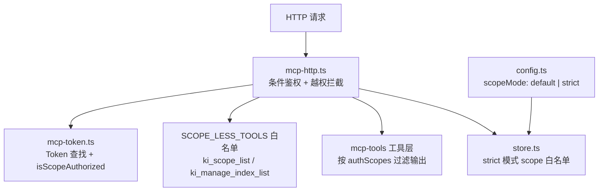
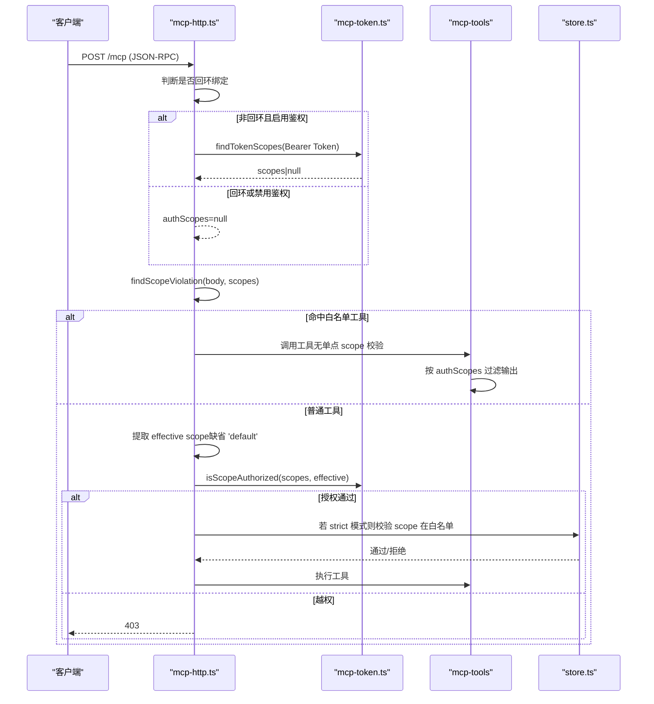
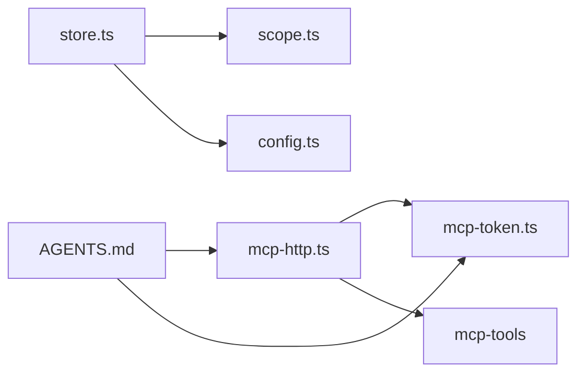

# 权限控制与白名单

<cite>
**本文引用的文件**
- [src/lib/mcp-token.ts](file://src/lib/mcp-token.ts)
- [src/lib/mcp-http.ts](file://src/lib/mcp-http.ts)
- [src/lib/scope.ts](file://src/lib/scope.ts)
- [src/config.ts](file://src/config.ts)
- [src/lib/store.ts](file://src/lib/store.ts)
- [AGENTS.md](file://AGENTS.md)
- [test/mcp-token.test.ts](file://test/mcp-token.test.ts)
- [test/mcp-http.test.ts](file://test/mcp-http.test.ts)
- [docs/cli.md](file://docs/cli.md)
</cite>

## 目录
1. [简介](#简介)
2. [项目结构](#项目结构)
3. [核心组件](#核心组件)
4. [架构总览](#架构总览)
5. [详细组件分析](#详细组件分析)
6. [依赖关系分析](#依赖关系分析)
7. [性能与安全考量](#性能与安全考量)
8. [故障排查指南](#故障排查指南)
9. [结论](#结论)
10. [附录：八类白名单与六类黑名单映射](#附录八类白名单与六类黑名单映射)

## 简介
本文件系统性说明 ki 的权限控制与白名单机制，覆盖以下目标：
- 明确“八类白名单”的定义与使用场景：模块职责、API接口、架构约束、项目通用约定、bug模式与排查、重构策略、依赖版本约束、测试策略。
- 明确“六类黑名单”的识别与处理：用户喜好、项目记忆/进度、用户个人信息、一次性诊断、临时偏好、会话短期上下文。
- 解释用户授权流程与只读模式的实现机制（基于 Token + scope 的 RBAC）。

本仓库在 MCP HTTP 模式下实现了条件鉴权与按 scope 的越权校验；通过多 Token 存储与白名单工具豁免，形成“默认安全”的访问控制模型。同时，scope 配置提供 strict/default 两种模式，作为项目级白名单护栏。

## 项目结构
与权限控制直接相关的代码集中在以下位置：
- 多 Token 与 scope 授权：src/lib/mcp-token.ts
- HTTP 层鉴权与越权拦截：src/lib/mcp-http.ts
- Scope 校验与路径构造：src/lib/scope.ts
- 配置模板与 scopeMode 策略：src/config.ts
- 运行时 scope 白名单校验（strict 模式）：src/lib/store.ts
- 行为与修复记录（含白名单工具豁免等）：AGENTS.md
- 测试用例：test/mcp-token.test.ts、test/mcp-http.test.ts
- CLI 文档（多 Token、条件鉴权）：docs/cli.md

图表来源
- [src/lib/mcp-http.ts:100-138](file://src/lib/mcp-http.ts#L100-L138)
- [src/lib/mcp-token.ts:43-50](file://src/lib/mcp-token.ts#L43-L50)
- [src/lib/store.ts:164-169](file://src/lib/store.ts#L164-L169)
- [src/config.ts:101-104](file://src/config.ts#L101-L104)

章节来源
- [src/lib/mcp-http.ts:1-200](file://src/lib/mcp-http.ts#L1-L200)
- [src/lib/mcp-token.ts:1-265](file://src/lib/mcp-token.ts#L1-L265)
- [src/lib/scope.ts:1-230](file://src/lib/scope.ts#L1-L230)
- [src/config.ts:1-204](file://src/config.ts#L1-L204)
- [src/lib/store.ts:160-175](file://src/lib/store.ts#L160-L175)

## 核心组件
- 多 Token 与 scope 授权（RBAC）
  - Token 存储：~/.ki/mcp-tokens.json（0600），每条记录包含 id、token、scopes、createdAt。
  - 授权判定：isScopeAuthorized(authScopes, scope)，支持 null（免鉴权）、['all']（全部）、具体 scope 列表。
  - 常量时间比较：findTokenScopes 使用 timingSafeEqual 避免时序侧信道。
- HTTP 层鉴权与越权拦截
  - 条件鉴权：回环绑定免鉴权；非回环绑定强制 Bearer Token。
  - 越权拦截：对 tools/call 的 arguments.scope 做越权校验，缺省为 'default'；白名单工具跳过单点 scope 校验，交由工具层按 authScopes 过滤输出。
  - 白名单工具：SCOPE_LESS_TOOLS = {ki_scope_list, ki_manage_index_list}。
- Scope 校验与路径隔离
  - validateScope 仅允许字母、数字、连字符、下划线，拒绝路径遍历。
  - getKbDir/getGroupIndexPath 等统一走 validateScope，确保路径安全。
- 配置与 scopeMode
  - scopeMode=default：未传 scope 落 default；未注册 scope 自动创建。
  - scopeMode=strict：必须显式传已注册 scope；scopes 即白名单。
- 运行时严格白名单
  - store.ts 在 strict 模式下强制 scope 注册白名单校验。

章节来源
- [src/lib/mcp-token.ts:20-50](file://src/lib/mcp-token.ts#L20-L50)
- [src/lib/mcp-http.ts:100-138](file://src/lib/mcp-http.ts#L100-L138)
- [src/lib/scope.ts:11-53](file://src/lib/scope.ts#L11-L53)
- [src/config.ts:101-104](file://src/config.ts#L101-L104)
- [src/lib/store.ts:164-169](file://src/lib/store.ts#L164-L169)

## 架构总览
下图展示从 HTTP 请求到工具执行的完整鉴权与白名单流程。

图表来源
- [src/lib/mcp-http.ts:100-138](file://src/lib/mcp-http.ts#L100-L138)
- [src/lib/mcp-token.ts:43-50](file://src/lib/mcp-token.ts#L43-L50)
- [src/lib/store.ts:164-169](file://src/lib/store.ts#L164-L169)

## 详细组件分析

### 多 Token 与 scope 授权（RBAC）
- Token 存储与生命周期
  - createToken/updateTokenScopes/deleteToken 使用原子写（临时文件+rename），防止半写损坏。
  - listTokensStrict 在文件损坏时抛错（MCP_TOKEN_CORRUPT），避免静默覆盖丢失数据。
  - findTokenScopes 使用常量时间比较，返回 scopes 或未命中。
- 授权判定
  - isScopeAuthorized(null, scope) → true（免鉴权）
  - isScopeAuthorized(['all'], scope) → true
  - isScopeAuthorized([a,b], scope) → 是否在集合内
- 测试覆盖
  - 通配 all、精确匹配、多 scope 授权、损坏保护等用例。

章节来源
- [src/lib/mcp-token.ts:97-265](file://src/lib/mcp-token.ts#L97-L265)
- [test/mcp-token.test.ts:202-269](file://test/mcp-token.test.ts#L202-L269)

### HTTP 层鉴权与越权拦截
- 条件鉴权
  - 回环绑定（127.0.0.1/::1）免鉴权；非回环绑定需 Bearer Token。
- 越权拦截
  - findScopeViolation 遍历所有 tools/call（含 batch），任一越权即拒绝。
  - effective scope 缺省为 'default'，防止不传 scope 绕过授权。
- 白名单工具
  - SCOPE_LESS_TOOLS 豁免单点 scope 校验，交由工具层按 authScopes 过滤输出。
- 测试覆盖
  - 白名单工具无参调用通过、batch 混合越权整体拒绝、省略 arguments 视为缺省 default 校验。

章节来源
- [src/lib/mcp-http.ts:100-138](file://src/lib/mcp-http.ts#L100-L138)
- [test/mcp-http.test.ts:1-200](file://test/mcp-http.test.ts#L1-L200)

### Scope 校验与路径隔离
- validateScope 仅允许字母、数字、连字符、下划线，拒绝路径遍历。
- 所有 KB 路径函数（getKbDir、getGroupIndexPath、getLocalKbDir）均先校验 scope，保证路径安全。
- listAllScopes 枚举已初始化 scope（KB + config 层并集）。

章节来源
- [src/lib/scope.ts:11-77](file://src/lib/scope.ts#L11-L77)
- [src/lib/scope.ts:174-198](file://src/lib/scope.ts#L174-L198)

### 配置与 scopeMode（项目级白名单）
- scopeMode=default：未传 scope 落 default；未注册 scope 自动创建（零摩擦）。
- scopeMode=strict：必须显式传已注册 scope；scopes 即白名单（防串味）。
- 运行时严格白名单：store.ts 在 strict 模式下强制 scope 注册白名单校验。

章节来源
- [src/config.ts:101-104](file://src/config.ts#L101-L104)
- [src/lib/store.ts:164-169](file://src/lib/store.ts#L164-L169)

### 用户授权流程（Token 生成与使用）
- 生成 Token：ki mcp token generate --scope <scope(s)>，写入 ~/.ki/mcp-tokens.json（0600）。
- 使用 Token：非回环绑定时，请求头 Authorization: Bearer <token>，服务端解析 scopes 并做越权校验。
- 全权临时 Token：--token/KI_MCP_TOKEN 等价于 scopes=['all']，进程级生效。
- CLI 文档：docs/cli.md 描述多 Token 子命令与条件鉴权。

章节来源
- [docs/cli.md:960-976](file://docs/cli.md#L960-L976)
- [AGENTS.md:92-120](file://AGENTS.md#L92-L120)

### 只读模式的实现机制
- 回环绑定默认免鉴权，适合本机只读/调试。
- 非回环绑定开启鉴权后，受限 Token（不含 'all'）只能访问其授权的 scope，天然形成“受限只读”效果。
- 白名单工具（ki_scope_list/ki_manage_index_list）由工具层按 authScopes 过滤输出，避免泄露未授权 scope。

章节来源
- [src/lib/mcp-http.ts:100-138](file://src/lib/mcp-http.ts#L100-L138)
- [src/lib/mcp-token.ts:43-50](file://src/lib/mcp-token.ts#L43-L50)

## 依赖关系分析
- mcp-http.ts 依赖 mcp-token.ts（Token 查找与授权判定）与 mcp-tools（工具层过滤）。
- store.ts 依赖 scope.ts（validateScope）与 config.ts（scopeMode）。
- AGENTS.md 记录了关键决策与修复（如白名单工具豁免、批量越权绕过修复）。

图表来源
- [src/lib/mcp-http.ts:100-138](file://src/lib/mcp-http.ts#L100-L138)
- [src/lib/mcp-token.ts:43-50](file://src/lib/mcp-token.ts#L43-L50)
- [src/lib/store.ts:164-169](file://src/lib/store.ts#L164-L169)
- [src/lib/scope.ts:11-53](file://src/lib/scope.ts#L11-L53)
- [src/config.ts:101-104](file://src/config.ts#L101-L104)
- [AGENTS.md:92-120](file://AGENTS.md#L92-L120)

章节来源
- [src/lib/mcp-http.ts:100-138](file://src/lib/mcp-http.ts#L100-L138)
- [src/lib/mcp-token.ts:43-50](file://src/lib/mcp-token.ts#L43-L50)
- [src/lib/store.ts:164-169](file://src/lib/store.ts#L164-L169)
- [src/lib/scope.ts:11-53](file://src/lib/scope.ts#L11-L53)
- [src/config.ts:101-104](file://src/config.ts#L101-L104)
- [AGENTS.md:92-120](file://AGENTS.md#L92-L120)

## 性能与安全考量
- 性能
  - 常量时间比较避免时序侧信道。
  - 原子写（临时文件+rename）减少并发写风险。
  - 会话上限与空闲回收防止资源耗尽。
- 安全
  - 默认安全：回环免鉴权，非回环强制鉴权。
  - 白名单工具豁免单点 scope 校验，但由工具层按 authScopes 过滤输出，安全边界清晰。
  - strict 模式将 scopes 作为项目级白名单，防止误用未注册 scope。
  - Token 存储文件权限 0600，限制仅属主可读写。

[本节为通用指导，不直接分析具体文件]

## 故障排查指南
- Token 存储损坏
  - 现象：listTokensStrict 抛出 MCP_TOKEN_CORRUPT。
  - 处理：检查 ~/.ki/mcp-tokens.json 内容完整性；必要时恢复备份。
- 越权 403
  - 现象：受限 Token 调用 tools/call 被拒绝。
  - 处理：确认 Token 的 scopes 是否包含 effective scope（缺省 'default'）；或使用 'all'。
- 白名单工具不可用
  - 现象：ki_scope_list/ki_manage_index_list 返回 403。
  - 处理：确认是否为非回环绑定且 Token 不含 'all'；工具层会按 authScopes 过滤输出。
- strict 模式报错 unknown scope
  - 现象：未传或传入未注册 scope。
  - 处理：在 config.yaml 中注册 scope，或切换为 default 模式。

章节来源
- [src/lib/mcp-token.ts:132-147](file://src/lib/mcp-token.ts#L132-L147)
- [src/lib/mcp-http.ts:100-138](file://src/lib/mcp-http.ts#L100-L138)
- [src/lib/store.ts:164-169](file://src/lib/store.ts#L164-L169)

## 结论
ki 的权限控制以“Token + scope”的 RBAC 为核心，结合 HTTP 层的条件鉴权与越权拦截，以及白名单工具的精细化控制，形成了默认安全、可扩展的访问模型。配合 scopeMode 的项目级白名单，可在多项目场景下有效隔离数据与操作。只读模式通过受限 Token 与回环绑定自然实现，满足审计与只读需求。

[本节为总结性内容，不直接分析具体文件]

## 附录：八类白名单与六类黑名单映射
以下将“八类白名单”与“六类黑名单”映射到 ki 的实际实现与使用场景，帮助理解其在系统中的定位与作用。

- 八类白名单
  - 模块职责：mcp-http.ts 负责 HTTP 层鉴权与越权拦截；mcp-token.ts 负责 Token 与 scope 授权；scope.ts 负责 scope 校验与路径隔离；store.ts 负责 strict 模式下的 scope 白名单校验。
  - API接口：/mcp 与 /api/* 在 HTTP 层进行 scope 校验；tools/call 的 arguments.scope 是主要授权点。
  - 架构约束：默认安全（回环免鉴权，非回环强制鉴权）；白名单工具豁免单点 scope 校验，但由工具层按 authScopes 过滤输出。
  - 项目通用约定：scope 仅允许字母、数字、连字符、下划线；effective scope 缺省为 'default'。
  - bug模式与排查：批量越权绕过、枚举工具泄露 scope、文件损坏静默失效等问题已在 AGENTS.md 记录并修复。
  - 重构策略：将 scope 校验下沉到 HTTP 层，避免分散；引入白名单工具豁免与工具层过滤，解耦授权与输出。
  - 依赖版本约束：embedding.provider/baseURL/model/dimension 需在配置中明确，避免跨提供商误用密钥。
  - 测试策略：mcp-token.test.ts 覆盖授权判定与损坏保护；mcp-http.test.ts 覆盖白名单工具与越权拦截。

- 六类黑名单
  - 用户喜好：不在系统内持久化；如需个性化，应通过外部配置或环境变量管理，避免影响权限边界。
  - 项目记忆/进度：存储在 kb/{scope}/ 下，受 scope 隔离与 strict 白名单保护；删除/清理需确认。
  - 用户个人信息：Token 明文仅落盘于 ~/.ki/mcp-tokens.json（0600），list 命令按需回显明文（用户明确要求的决策）。
  - 一次性诊断：/healthz 与健康检查用于状态自查；不持久化敏感信息。
  - 临时偏好：HTTP 层临时参数（如 --token）仅进程级生效，不写入配置文件。
  - 会话短期上下文：MCP 会话独立，空闲超时回收；不跨会话持久化敏感上下文。

[本节为概念性映射，不直接分析具体文件]