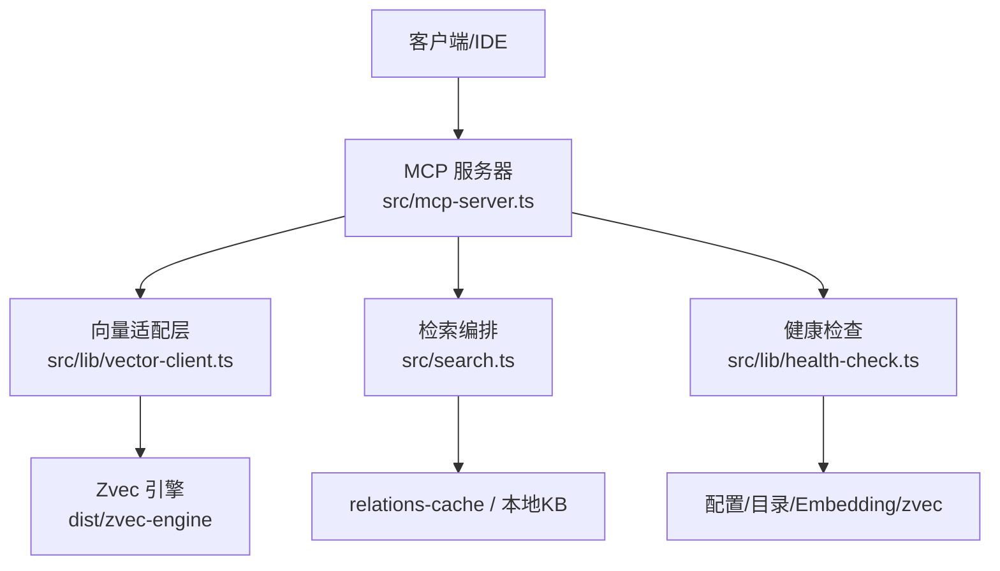
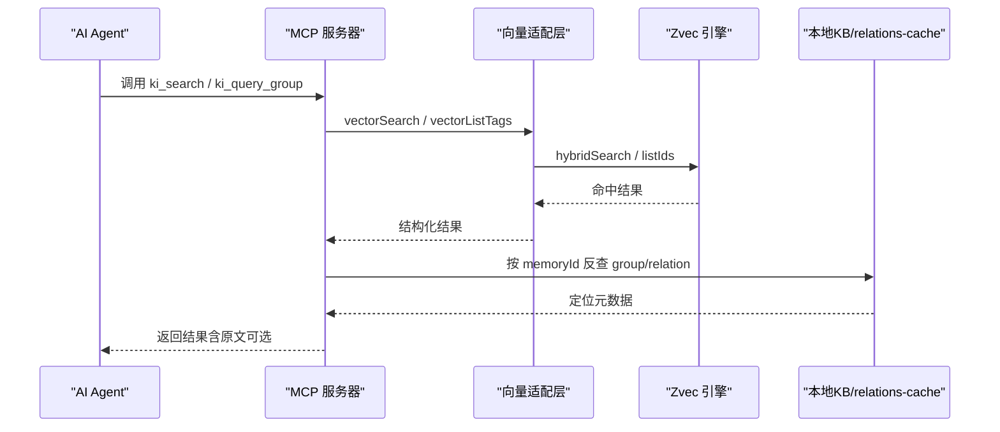
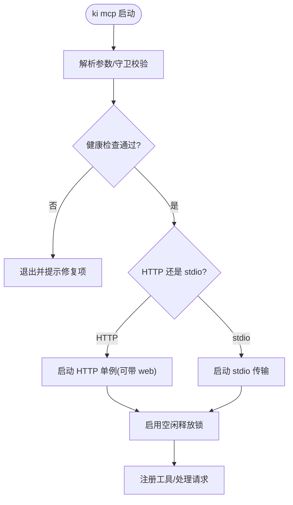
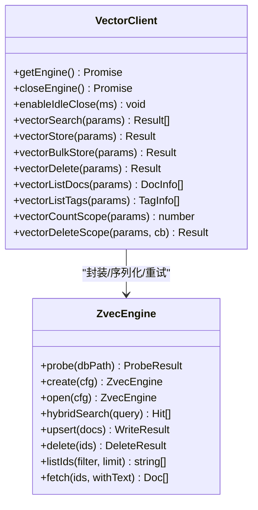
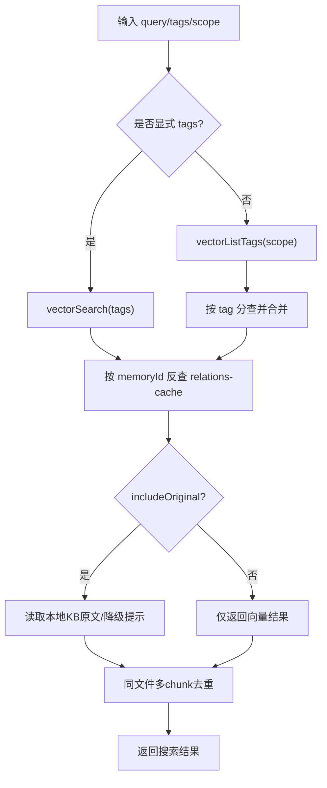
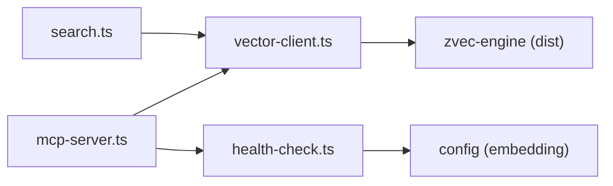

# 最佳实践与故障排查

<cite>
**本文引用的文件**
- [README.md](file://README.md)
- [AGENTS.md](file://AGENTS.md)
- [CLAUDE.md](file://CLAUDE.md)
- [src/mcp-server.ts](file://src/mcp-server.ts)
- [src/lib/vector-client.ts](file://src/lib/vector-client.ts)
- [src/search.ts](file://src/search.ts)
- [docs/error-handling.md](file://docs/error-handling.md)
- [src/lib/health-check.ts](file://src/lib/health-check.ts)
- [src/doctor.ts](file://src/doctor.ts)
- [docs/cli.md](file://docs/cli.md)
- [.requirements/2026-06-18-向量存储与KB写入并行化优化/design/DESIGN.md](file://.requirements/2026-06-18-向量存储与KB写入并行化优化/design/DESIGN.md)
- [.requirements/2026-06-18-向量存储与KB写入并行化优化/design/challenge-report.md](file://.requirements/2026-06-18-向量存储与KB写入并行化优化/design/challenge-report.md)
</cite>

## 目录
1. [简介](#简介)
2. [项目结构](#项目结构)
3. [核心组件](#核心组件)
4. [架构总览](#架构总览)
5. [详细组件分析](#详细组件分析)
6. [依赖关系分析](#依赖关系分析)
7. [性能考虑](#性能考虑)
8. [故障排查指南](#故障排查指南)
9. [结论](#结论)
10. [附录](#附录)

## 简介
本指南面向使用 kisearch（ki）作为 AI Agent 知识索引与语义检索能力的团队，总结在 MCP 集成、查询优化、错误处理、性能调优、监控诊断等方面的最佳实践，并给出常见问题的定位方法与解决方案。kisearch 提供“结构化知识索引 + 向量语义检索”的双路径能力：已知 Group/Relation 时可直接精准命中原文；未知时通过混合检索（语义+BM25+RRF）兜底召回，并通过 memoryId 反查定位到本地 KB 原文。

## 项目结构
- 入口与协议层
  - MCP Server 启动、参数解析、守护进程与重启、多 Token 鉴权、HTTP/stdio 双通道
- 向量适配层
  - 统一封装 ZvecEngine，提供搜索、批量存储、删除、枚举等接口，内置空闲释放锁与撞锁重试
- 检索编排层
  - 标签优先级、按 tag 分查合并、memoryId 反查 relations-cache、可选返回原文
- 健康检查与诊断
  - 配置、目录、Embedding 连通性/密钥/维度、zvec collection 状态的一键诊断

图表来源
- [src/mcp-server.ts:492-734](file://src/mcp-server.ts#L492-L734)
- [src/lib/vector-client.ts:314-407](file://src/lib/vector-client.ts#L314-L407)
- [src/search.ts:70-199](file://src/search.ts#L70-L199)
- [src/lib/health-check.ts:148-213](file://src/lib/health-check.ts#L148-L213)

章节来源
- [README.md:35-103](file://README.md#L35-L103)
- [src/mcp-server.ts:492-734](file://src/mcp-server.ts#L492-L734)

## 核心组件
- MCP 服务与工具注册
  - 构建 McpServer，注册查询组、模块信息、同步/批量同步 Relation、管理索引、搜索、存储、删除、Scope/Tag 列表等工具
  - 支持 stdio 与 HTTP 共享单例，HTTP 可开启前端页面，支持后台常驻与重启
- 向量适配层
  - 进程内 Engine 单例，带撞锁重试、空闲释放锁、在途保护与自愈重试
  - 统一 search/store/bulkStore/delete/list/count 等接口
- 检索编排
  - 默认按 tag 优先级分查合并（内容优先），支持显式 tags 过滤
  - 通过 memoryId 反查 relations-cache 附加 group/relation 定位，可选返回原文
- 健康检查与诊断
  - 启动前预检：配置文件、目录权限、apiKey、Embedding 连通性/密钥/维度、collection 状态
  - doctor 命令输出可读报告，失败项退出码非零便于脚本 gate

章节来源
- [src/mcp-server.ts:49-71](file://src/mcp-server.ts#L49-L71)
- [src/lib/vector-client.ts:120-141](file://src/lib/vector-client.ts#L120-L141)
- [src/search.ts:20-47](file://src/search.ts#L20-L47)
- [src/lib/health-check.ts:148-213](file://src/lib/health-check.ts#L148-L213)

## 架构总览
kisearch 以 MCP 为统一接入面，向 AI Agent 暴露 11 个只读/安全工具；底层通过向量适配层访问 zvec 引擎，结合本地 KB 与 relations-cache 实现“索引直查 + 语义兜底”的双路径检索。

图表来源
- [src/mcp-server.ts:54-71](file://src/mcp-server.ts#L54-L71)
- [src/lib/vector-client.ts:477-506](file://src/lib/vector-client.ts#L477-L506)
- [src/search.ts:123-199](file://src/search.ts#L123-L199)

## 详细组件分析

### MCP 服务器与工具链
- 启动守卫
  - 健康检查前置，失败拒绝启动；检测存活 HTTP 实例复用；阻止 stdio 与 HTTP 并存争抢锁
- 多 Token + Scope 授权
  - 非回环绑定强制鉴权；Token 可绑定一个或多个 scope；越权拦截并返回 403
- 守护进程与重启
  - --daemon 后台常驻；restart 幂等重启，自动延续上次 host/port/web；status 探测目标对齐 restart 语义
- 工具注册
  - 统一注册 11 个工具，屏蔽破坏性操作，遵循零破坏约束

图表来源
- [src/mcp-server.ts:137-212](file://src/mcp-server.ts#L137-L212)
- [src/mcp-server.ts:492-734](file://src/mcp-server.ts#L492-L734)

章节来源
- [src/mcp-server.ts:492-734](file://src/mcp-server.ts#L492-L734)
- [README.md:219-293](file://README.md#L219-L293)

### 向量适配层（vector-client）
- 引擎生命周期
  - getEngine：首次 create/open，失败重置缓存允许重试；open/create 串行化避免原生竞态
  - closeEngine：先置空再关闭，close 也串行化，避免 reopen/close 并发导致阻塞
- 撞锁与空闲释放
  - probeWithRetry：检测到 locked 等待并重试（最多 3 次）
  - enableIdleClose：常驻模式启用空闲释放锁，超时后自动 closeEngine 释放 LOCK
- 在途保护与自愈
  - withEngine：进入 ++inFlightOps，finally 恢复计数并续期空闲起点；捕获 WorkerUnavailableError 后重开重试一次
- 检索与存储
  - vectorSearch：hybridSearch（语义+FTS+RRF），按 scope/tag 过滤
  - vectorStore/vectorBulkStore：幂等 upsert，tag 参与 docId 生成保证多标签独立
  - vectorDelete/vectorListDocs/vectorListTags/vectorCountScope/vectorDeleteScope：管理面能力

图表来源
- [src/lib/vector-client.ts:183-216](file://src/lib/vector-client.ts#L183-L216)
- [src/lib/vector-client.ts:314-407](file://src/lib/vector-client.ts#L314-L407)
- [src/lib/vector-client.ts:477-754](file://src/lib/vector-client.ts#L477-L754)

章节来源
- [src/lib/vector-client.ts:88-141](file://src/lib/vector-client.ts#L88-L141)
- [src/lib/vector-client.ts:183-216](file://src/lib/vector-client.ts#L183-L216)
- [src/lib/vector-client.ts:314-407](file://src/lib/vector-client.ts#L314-L407)
- [src/lib/vector-client.ts:477-754](file://src/lib/vector-client.ts#L477-L754)

### 检索编排（search）
- 标签优先级与分查合并
  - 默认不传 tags 时，按 tag 分查（每个 tag 取 limit），再按优先级排序（ki-search > ki-relation > ki-path）
  - 显式传 tags 则按 OR 组合单次查询
- 原文定位与去重
  - 通过 memoryId 反查 relations-cache 获取 group/relation，可选返回本地 KB 原文
  - 同一文件多 chunk 命中去重，保留 score 最高的一条；重复条目标记 deduplicated

图表来源
- [src/search.ts:70-199](file://src/search.ts#L70-L199)

章节来源
- [src/search.ts:20-47](file://src/search.ts#L20-L47)
- [src/search.ts:70-199](file://src/search.ts#L70-L199)

### 健康检查与诊断（doctor）
- 检查项
  - 配置文件存在且可解析
  - dataDir/backupDir/vectorDir 存在且可写
  - apiKey 已配置
  - Embedding URL 连通性、密钥有效性、维度匹配（发送最短文本请求）
  - zvec collection 是否存在（目录非空判定）
  - scopes.default 是否配置
- 输出与退出码
  - 渲染可读报告；有失败项退出码非零，便于 CI gate

章节来源
- [src/lib/health-check.ts:148-213](file://src/lib/health-check.ts#L148-L213)
- [src/doctor.ts:1-55](file://src/doctor.ts#L1-L55)

## 依赖关系分析
- 组件耦合
  - MCP 服务器依赖向量适配层与工具注册；检索编排依赖向量适配层与 relations-cache
  - 健康检查依赖配置与 embedding provider，不修改任何数据
- 外部依赖
  - zvec 引擎（dist 产物）、Embedding 提供商（SiliconFlowProvider）
- 潜在风险
  - 向量库锁竞争：通过空闲释放锁与撞锁重试缓解
  - 网络抖动：健康检查与 embedding 请求具备超时与重试

图表来源
- [src/mcp-server.ts:492-734](file://src/mcp-server.ts#L492-L734)
- [src/lib/vector-client.ts:314-407](file://src/lib/vector-client.ts#L314-L407)
- [src/lib/health-check.ts:148-213](file://src/lib/health-check.ts#L148-L213)

章节来源
- [src/mcp-server.ts:492-734](file://src/mcp-server.ts#L492-L734)
- [src/lib/vector-client.ts:314-407](file://src/lib/vector-client.ts#L314-L407)
- [src/lib/health-check.ts:148-213](file://src/lib/health-check.ts#L148-L213)

## 性能考虑
- 批量操作
  - 使用 vectorBulkStore 进行批量写入，减少往返与嵌入开销
  - import 流程中 Phase 2（向量化）与 Phase 3/4（Group树+KB）并行执行，显著缩短整体耗时
- 缓存利用
  - relations-cache 带 TTL+mtime 缓存，反查定位 O(1)
  - 向量层 tag/scope 字段索引用于快速过滤
- 并发控制
  - 向量库锁串行化（serializeEngineOp）避免原生竞态
  - 空闲释放锁让多实例错开共享；撞锁重试避免立即失败
  - withEngine 在途保护防止 idle close 打断进行中的 embedding 网络阶段
- 建议
  - 大库场景下合理设置 limit/threshold，避免全量扫描
  - 对高频查询使用显式 tags 缩小范围
  - 使用 HTTP 共享单例减少进程间锁冲突

章节来源
- [.requirements/2026-06-18-向量存储与KB写入并行化优化/design/DESIGN.md:29-76](file://.requirements/2026-06-18-向量存储与KB写入并行化优化/design/DESIGN.md#L29-L76)
- [.requirements/2026-06-18-向量存储与KB写入并行化优化/design/DESIGN.md:204-290](file://.requirements/2026-06-18-向量存储与KB写入并行化优化/design/DESIGN.md#L204-L290)
- [src/lib/vector-client.ts:183-216](file://src/lib/vector-client.ts#L183-L216)
- [src/lib/vector-client.ts:314-407](file://src/lib/vector-client.ts#L314-L407)

## 故障排查指南
- 常见问题与恢复
  - 非法 scope/参数缺失：快速失败并提示正确用法
  - 数据文件缺失或损坏：从备份恢复或重新初始化
  - 增量导入相关错误：记录 warning 继续执行，旧残留不影响新写入
- 向量库被占用/损坏
  - 提示停止其他实例、等待锁释放、rebuild-vector 或 restore 重建
- 启动预检失败
  - 检查 apiKey、Embedding 连通性与维度、目录权限；根据报告逐项修复
- 日志与诊断
  - 使用 ki doctor 一键诊断；MCP 启动预检将报告写 stderr 不污染 stdout
  - 查看 HTTP 单例状态：ki mcp --status；必要时重启：ki mcp restart

章节来源
- [docs/error-handling.md:13-146](file://docs/error-handling.md#L13-L146)
- [src/lib/vector-client.ts:71-86](file://src/lib/vector-client.ts#L71-L86)
- [src/lib/health-check.ts:148-213](file://src/lib/health-check.ts#L148-L213)
- [src/doctor.ts:1-55](file://src/doctor.ts#L1-L55)

## 结论
kisearch 通过 MCP 统一接入、向量适配层的健壮性与检索编排的灵活性，为 AI Agent 提供了高可用、高性能的知识索引与检索能力。实践中应优先采用批量写入、标签过滤、原文定位与并行化策略，并结合健康检查与诊断工具进行持续监控与排障。

## 附录
- 常用命令参考
  - 导入、搜索、管理索引、scope/doc/tag 管理等命令说明与参数详见 CLI 文档
- 经验与避坑
  - 多 stdio 实例与 CLI 共享向量库需借助空闲释放锁与撞锁重试，避免同时使用造成阻塞
  - 非回环绑定必须配置鉴权 Token，否则拒绝启动
  - 向量库损坏或被占用时，优先尝试 rebuild-vector 或 restore 重建

章节来源
- [docs/cli.md:1013-1049](file://docs/cli.md#L1013-L1049)
- [AGENTS.md:3-52](file://AGENTS.md#L3-L52)
- [AGENTS.md:83-136](file://AGENTS.md#L83-L136)
- [AGENTS.md:138-222](file://AGENTS.md#L138-L222)
- [AGENTS.md:440-484](file://AGENTS.md#L440-L484)
- [AGENTS.md:516-539](file://AGENTS.md#L516-L539)