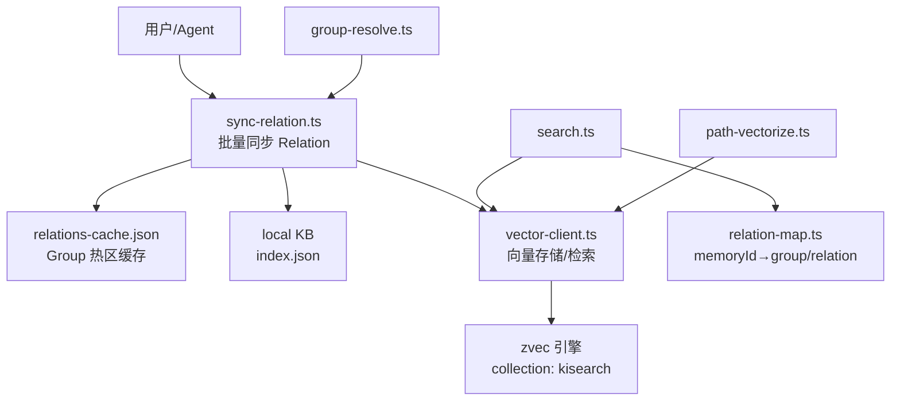
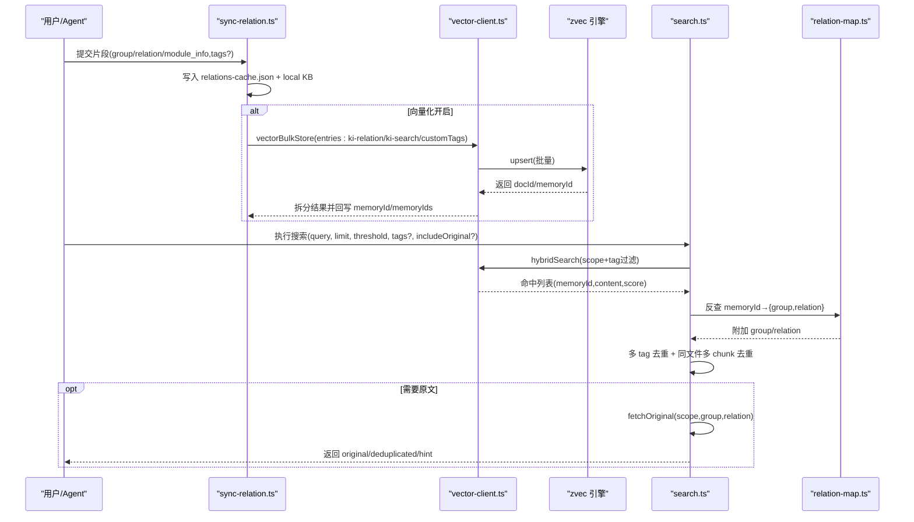
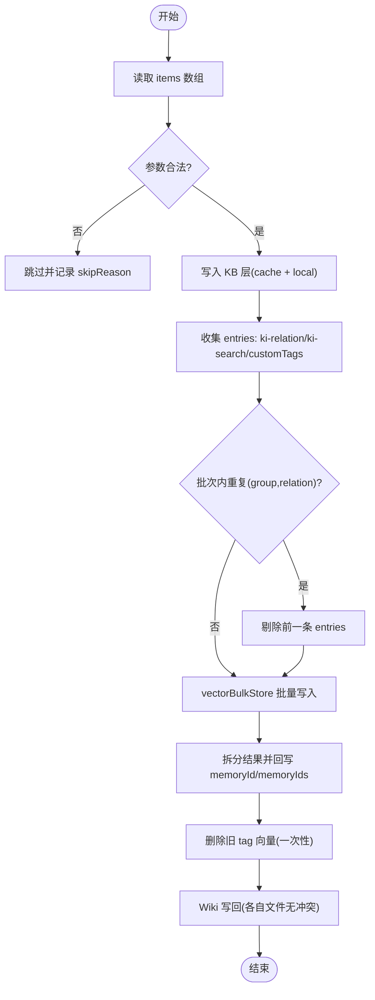
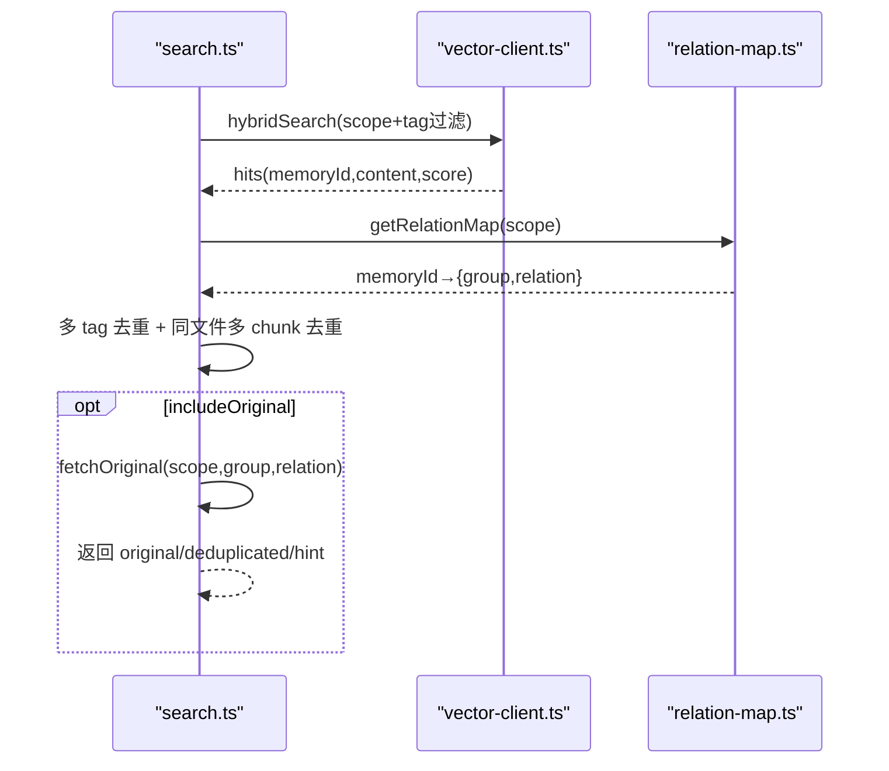
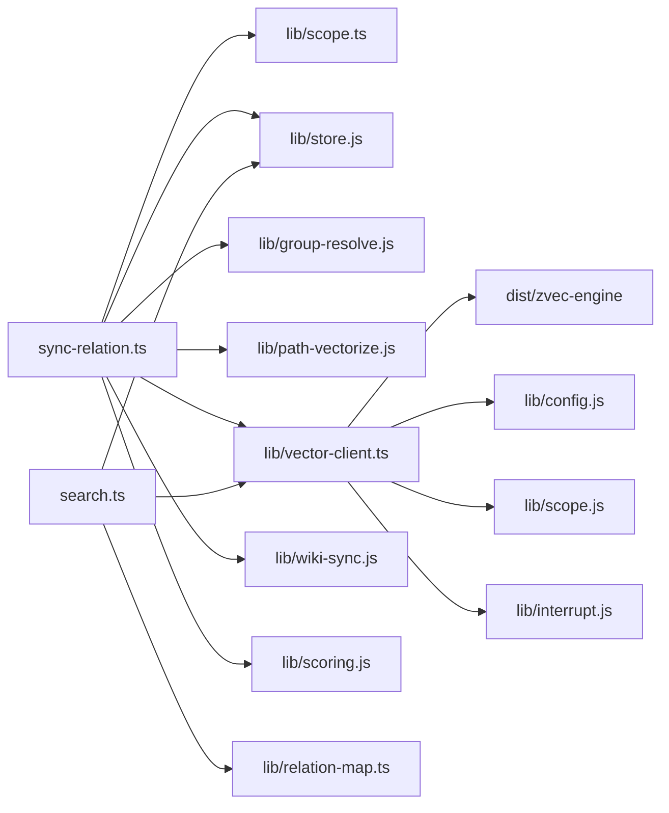

# 代码片段记忆管理

<cite>
**本文引用的文件**
- [src/sync-relation.ts](file://src/sync-relation.ts)
- [src/lib/vector-client.ts](file://src/lib/vector-client.ts)
- [src/search.ts](file://src/search.ts)
- [src/lib/relation-map.ts](file://src/lib/relation-map.ts)
- [src/lib/group-resolve.ts](file://src/lib/group-resolve.ts)
- [src/lib/path-vectorize.ts](file://src/lib/path-vectorize.ts)
- [src/lib/scope.ts](file://src/lib/scope.ts)
- [src/store.ts](file://src/store.ts)
- [src/bulk-store.ts](file://src/bulk-store.ts)
- [docs/cli.md](file://docs/cli.md)
- [memories/memory-storage-strategy.md](file://memories/memory-storage-strategy.md)
</cite>

## 目录
1. [简介](#简介)
2. [项目结构](#项目结构)
3. [核心组件](#核心组件)
4. [架构总览](#架构总览)
5. [详细组件分析](#详细组件分析)
6. [依赖关系分析](#依赖关系分析)
7. [性能考虑](#性能考虑)
8. [故障排查指南](#故障排查指南)
9. [结论](#结论)
10. [附录](#附录)

## 简介
本文件面向“代码片段记忆管理”的配置与使用，聚焦以下目标：
- 明确片段分类体系：预定义 Group（工具库、项目踩坑点、部署运维）与通用记忆片段的组织方式。
- 规定片段格式铁律：首行描述要求、符号与位置字段规范、禁止 YAML 元数据块的原因。
- 给出片段提取规则：可复用函数识别、核心逻辑提取、API 调用记录等场景。
- 说明批量写入优化策略：ki_bulk_sync_relation 的使用方法与分批建议。
- 解释片段查询优化以及与知识库的边界划分。

## 项目结构
围绕片段记忆管理的核心路径如下：
- 片段写入与同步：sync-relation.ts 负责将片段写入本地 KB、relations-cache.json，并可选向量化。
- 向量层：vector-client.ts 提供统一存储/检索接口；search.ts 实现语义检索与原文召回；relation-map.ts 提供 memoryId → group/relation 的反查映射。
- 分组与路径：group-resolve.ts 提供 Group 路径解析与自动补全；path-vectorize.ts 为路径与 relation 名称建立辅助向量索引。
- Scope 与存储：scope.ts 管理 scope 校验、KB 目录与 group-index.json 路径；store.ts 提供基础 JSON 读写。
- CLI 入口：store.ts、bulk-store.ts 暴露单条与批量存储命令；docs/cli.md 提供 MCP 工具契约（含 ki_bulk_sync_relation）。

图表来源
- [src/sync-relation.ts:407-787](file://src/sync-relation.ts#L407-L787)
- [src/lib/vector-client.ts:477-590](file://src/lib/vector-client.ts#L477-L590)
- [src/search.ts:70-199](file://src/search.ts#L70-L199)
- [src/lib/relation-map.ts:48-114](file://src/lib/relation-map.ts#L48-L114)
- [src/lib/group-resolve.ts:117-219](file://src/lib/group-resolve.ts#L117-L219)
- [src/lib/path-vectorize.ts:75-116](file://src/lib/path-vectorize.ts#L75-L116)

章节来源
- [src/sync-relation.ts:407-787](file://src/sync-relation.ts#L407-L787)
- [src/lib/vector-client.ts:477-590](file://src/lib/vector-client.ts#L477-L590)
- [src/search.ts:70-199](file://src/search.ts#L70-L199)
- [src/lib/relation-map.ts:48-114](file://src/lib/relation-map.ts#L48-L114)
- [src/lib/group-resolve.ts:117-219](file://src/lib/group-resolve.ts#L117-L219)
- [src/lib/path-vectorize.ts:75-116](file://src/lib/path-vectorize.ts#L75-L116)

## 核心组件
- 片段同步与落盘：sync-relation.ts 负责将片段按 Group/Relation 写入 relations-cache.json 与 local KB，并在向量化模式下批量写入向量层。
- 向量存储与检索：vector-client.ts 封装 zvec 引擎，提供 vectorStore/vectorBulkStore/vectorSearch 等能力；search.ts 组合 tag 优先级、去重与原文召回。
- 路径与分组：group-resolve.ts 提供 Group 路径解析与自动补全；path-vectorize.ts 为路径与 relation 名称建立辅助向量索引，用于模糊匹配兜底。
- 反查映射：relation-map.ts 维护 memoryId → {group, relation} 的映射，带 TTL 与 mtime/size 失效策略。
- Scope 与存储：scope.ts 管理 scope 校验、KB 目录、group-index.json 路径；store.ts 提供 JSON 读写。
- CLI 与 MCP：store.ts、bulk-store.ts 提供命令行；docs/cli.md 定义 ki_bulk_sync_relation 等工具契约。

章节来源
- [src/sync-relation.ts:407-787](file://src/sync-relation.ts#L407-L787)
- [src/lib/vector-client.ts:477-590](file://src/lib/vector-client.ts#L477-L590)
- [src/search.ts:70-199](file://src/search.ts#L70-L199)
- [src/lib/relation-map.ts:48-114](file://src/lib/relation-map.ts#L48-L114)
- [src/lib/group-resolve.ts:117-219](file://src/lib/group-resolve.ts#L117-L219)
- [src/lib/path-vectorize.ts:75-116](file://src/lib/path-vectorize.ts#L75-L116)
- [src/lib/scope.ts:45-77](file://src/lib/scope.ts#L45-L77)
- [src/store.ts:23-51](file://src/store.ts#L23-L51)
- [docs/cli.md:1046-1069](file://docs/cli.md#L1046-L1069)

## 架构总览
片段从 Agent/CLI 进入 sync-relation.ts，完成 KB 层写入后，可选择向量化：
- 路径向量：ki-path/ki-relation 标签，用于路径与 relation 名称的语义兜底。
- 内容向量：ki-search 与自定义 tags 各一条内容向量，支持多标签独立召回。
- 检索时 search.ts 按 tag 优先级聚合结果，并通过 relation-map.ts 定位 group/relation，必要时回读 local KB 原文。

图表来源
- [src/sync-relation.ts:407-787](file://src/sync-relation.ts#L407-L787)
- [src/lib/vector-client.ts:547-590](file://src/lib/vector-client.ts#L547-L590)
- [src/search.ts:70-199](file://src/search.ts#L70-L199)
- [src/lib/relation-map.ts:48-114](file://src/lib/relation-map.ts#L48-L114)

## 详细组件分析

### 片段分类体系与组织结构
- 预定义 Group：
  - 工具库：存放可复用的工具函数、公共模块用法与最佳实践。
  - 项目踩坑点：沉淀常见陷阱、修复方案与验证步骤。
  - 部署运维：容器化、发布流程、监控告警、故障排查等。
- 通用记忆片段：跨项目通用的经验、约定与模板，适合放入“通用记忆片段/关键逻辑”等组。
- 组织原则：
  - 以 Group 为一级分类，Relation 为具体知识点标题。
  - 每个 Relation 对应一个 Markdown 片段，置于 local KB 的 index.json 中。
  - Group 树由 group-index.json 维护，支持自动补建与解析。

章节来源
- [src/lib/scope.ts:45-77](file://src/lib/scope.ts#L45-L77)
- [src/sync-relation.ts:129-221](file://src/sync-relation.ts#L129-L221)

### 片段格式铁律
- 首行描述要求：
  - 每个片段应以简洁的一行描述开头，概括该片段的核心用途或结论，便于检索与摘要。
- 符号与位置字段规范：
  - 使用标准 Markdown 结构：标题、段落、列表、代码块。
  - 涉及代码位置时，采用“文件路径:行号”形式标注，如 “src/lib/vector-client.ts:547-590”。
  - 避免在片段正文中使用 YAML 元数据块（即 front matter），原因：
    - 系统读取 local KB 与 relations-cache 均为 JSON/Markdown 文本，不解析 YAML 元数据。
    - 引入 YAML 会增加解析歧义与迁移成本，且与现有 schema 不一致。
    - 所有结构化信息应通过 Group/Relation/tags 与 metadata 字段表达，而非嵌入文档体。
- 标签与分组：
  - 通过 tags 指定内容标签（默认 ki-search），可叠加自定义标签（逗号分隔）。
  - 路径向量与 relation 向量分别走 ki-path/ki-relation 标签，用于路径与名称的语义兜底。

章节来源
- [src/sync-relation.ts:439-547](file://src/sync-relation.ts#L439-L547)
- [src/lib/path-vectorize.ts:42-66](file://src/lib/path-vectorize.ts#L42-L66)
- [src/lib/vector-client.ts:218-242](file://src/lib/vector-client.ts#L218-L242)

### 片段提取规则
- 可复用函数识别：
  - 识别高内聚、低耦合、可独立调用的函数或模块。
  - 提取其输入输出契约、异常处理与典型用例，形成“工具库”类片段。
- 核心逻辑提取：
  - 聚焦关键算法、状态机、调度与容错逻辑，提炼为“关键逻辑”片段。
  - 标注数据来源、依赖服务与边界条件。
- API 调用记录：
  - 记录外部 API 的调用方式、参数约束、返回值结构与异常分支。
  - 结合 tags 标记业务域（如 api、auth），便于定向检索。
- 路径与 relation 辅助索引：
  - 对 Group 路径与 relation 名称建立 ki-path/ki-relation 向量，提升路径与名称的语义召回能力。

章节来源
- [src/lib/path-vectorize.ts:42-66](file://src/lib/path-vectorize.ts#L42-L66)
- [src/sync-relation.ts:534-547](file://src/sync-relation.ts#L534-L547)

### 批量写入优化策略（ki_bulk_sync_relation）
- 设计要点：
  - 一次 embedding HTTP + 一次 worker upsert，替代多次并发单条调用带来的 N 次往返与串行写入。
  - 同批重复 (group, relation) 去重，后一条覆盖前一条，避免孤儿向量。
  - 失败隔离：向量写入失败不影响 KB 层写入，逐条透出 vectorStored/vectorReason。
- 使用方法：
  - 通过 MCP 工具 ki_bulk_sync_relation 传入 items 数组（每项含 group、relation、module_info、tags?）。
  - 单次最多 50 条，超出请分批调用。
- 分批建议：
  - 按业务域或 Group 维度分批，控制每批大小 ≤50。
  - 若向量服务不可用，KB 层仍成功，后续可通过 rebuild-vector 恢复。
- 结果解读：
  - results[].vectorStored：该条主内容向量是否成功写入。
  - vectorStored（顶层）：所有需向量化的条目全部完整写入才为 true。
  - hints：Group 路径解析提示（自动补全/多候选/未匹配）。

图表来源
- [src/sync-relation.ts:407-787](file://src/sync-relation.ts#L407-L787)
- [docs/cli.md:1046-1069](file://docs/cli.md#L1046-L1069)

章节来源
- [src/sync-relation.ts:407-787](file://src/sync-relation.ts#L407-L787)
- [docs/cli.md:1046-1069](file://docs/cli.md#L1046-L1069)

### 片段查询优化
- Tag 优先级：
  - 默认搜全部时，ki-search（内容）优先，其次 ki-relation / ki-path，其余自定义 tag 垫底。
- 多 tag 聚合与去重：
  - 多 tag 以 OR 组合；同一 (group, relation) 因多 tag 写入产生多条命中时，保留 score 最高的一条。
  - 同一文件多 chunk 命中去重：保留首个命中，其余 original 置空并标注 deduplicated。
- 原文召回：
  - 显式开启 includeOriginal 时，按 memoryId 反查 relations-cache 获取 group/relation，再读取 local KB 原文；缺失则降级返回向量 content 并提示。
- 路径与名称兜底：
  - 当 Group 路径解析失败时，通过 ki-path/ki-relation 向量近似匹配兜底，提升鲁棒性。

图表来源
- [src/search.ts:70-199](file://src/search.ts#L70-L199)
- [src/lib/relation-map.ts:48-114](file://src/lib/relation-map.ts#L48-L114)

章节来源
- [src/search.ts:70-199](file://src/search.ts#L70-L199)
- [src/lib/relation-map.ts:48-114](file://src/lib/relation-map.ts#L48-L114)

### 与知识库的边界划分
- KB 通道：relations-cache + local KB + wiki，供 query-group/get-module-info 快速访问（毫秒级）。
- 向量通道：mem CLI（ki-relation + ki-search），供 search 语义检索（秒级）。
- 边界原则：
  - 结构化导航与快速定位走 KB 通道。
  - 自然语言语义检索与模糊匹配走向量通道。
  - 两者通过 memoryId/memoryIds 关联，search 可回查 KB 原文。

章节来源
- [src/search.ts:70-199](file://src/search.ts#L70-L199)
- [src/sync-relation.ts:407-787](file://src/sync-relation.ts#L407-L787)

## 依赖关系分析
- sync-relation.ts 依赖：
  - lib/scope.ts：scope 校验、KB 目录与 group-index.json 路径。
  - lib/store.js：JSON 读写、ensureScopeDir。
  - lib/scoring.js：评分计算与使用记录。
  - lib/group-resolve.js：Group 路径解析与自动补全。
  - lib/path-vectorize.js：路径与 relation 向量构建与批量写入。
  - lib/vector-client.js：向量存储/检索/删除。
  - lib/wiki-sync.js：Wiki 写回。
- search.ts 依赖：
  - lib/vector-client.js：hybridSearch、listTags。
  - lib/relation-map.js：memoryId 反查映射。
  - lib/store.js：readJson 获取 local KB。
- vector-client.ts 依赖：
  - dist/zvec-engine：底层向量引擎（worker proxy）。
  - lib/config.js：配置加载与向量目录。
  - lib/scope.js：scope 校验。
  - lib/interrupt.js：中断引导。

图表来源
- [src/sync-relation.ts:16-35](file://src/sync-relation.ts#L16-L35)
- [src/search.ts:11-18](file://src/search.ts#L11-L18)
- [src/lib/vector-client.ts:16-33](file://src/lib/vector-client.ts#L16-L33)

章节来源
- [src/sync-relation.ts:16-35](file://src/sync-relation.ts#L16-L35)
- [src/search.ts:11-18](file://src/search.ts#L11-L18)
- [src/lib/vector-client.ts:16-33](file://src/lib/vector-client.ts#L16-L33)

## 性能考虑
- 批量写入：
  - 使用 ki_bulk_sync_relation 一次 embedding + 一次 upsert，显著降低网络与引擎开销。
  - 批次大小建议 ≤50，避免单次过大导致超时或内存压力。
- 向量层锁与空闲释放：
  - 共享向量库通过撞锁重试与空闲释放锁机制，错开多进程/MCP 实例使用。
- 检索优化：
  - tag 优先级聚合与多 tag OR 过滤减少无效扫描。
  - 同文件多 chunk 去重与多 tag 去重降低冗余返回。
- 原文召回：
  - 仅在 includeOriginal 开启时触发，避免不必要的 IO。

章节来源
- [src/sync-relation.ts:407-787](file://src/sync-relation.ts#L407-L787)
- [src/lib/vector-client.ts:129-181](file://src/lib/vector-client.ts#L129-L181)
- [src/search.ts:94-121](file://src/search.ts#L94-L121)

## 故障排查指南
- 向量服务不可用：
  - ensureVectorAvailable 检测 locked/corrupted/probe_error，给出恢复引导（rebuild-vector/restore）。
- 撞锁与占用：
  - 其他进程持有 LOCK 时，等待并重试；常驻 MCP 启用空闲释放锁，CLI per-call 结束后关闭 engine。
- 原文不可用：
  - local KB 缺失 relation 或反查失败时，降级返回向量 content 并提示。
- 批量写入部分失败：
  - 逐条透出 vectorReason，顶层 vectorStored 仅在所有条目完全成功时为 true。

章节来源
- [src/lib/vector-client.ts:420-467](file://src/lib/vector-client.ts#L420-L467)
- [src/search.ts:54-68](file://src/search.ts#L54-L68)
- [src/sync-relation.ts:607-745](file://src/sync-relation.ts#L607-L745)

## 结论
- 片段记忆管理通过 KB 层与向量层双通道协作，兼顾快速导航与语义检索。
- 预定义 Group（工具库、项目踩坑点、部署运维）与通用记忆片段构成清晰分类体系。
- 片段格式铁律确保可读性与一致性；批量写入策略显著提升吞吐与稳定性。
- 查询优化与原文召回机制保障检索质量与可追溯性。

## 附录
- 记忆存储策略参考：平台内置记忆与 ki 记忆的分工与禁忌。
- CLI/MCP 契约：ki_bulk_sync_relation 的参数与返回结构。

章节来源
- [memories/memory-storage-strategy.md:1-14](file://memories/memory-storage-strategy.md#L1-L14)
- [docs/cli.md:1046-1069](file://docs/cli.md#L1046-L1069)