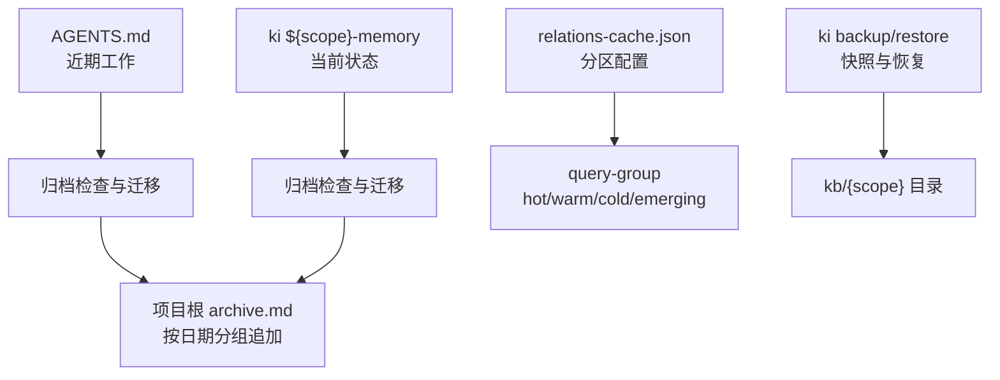
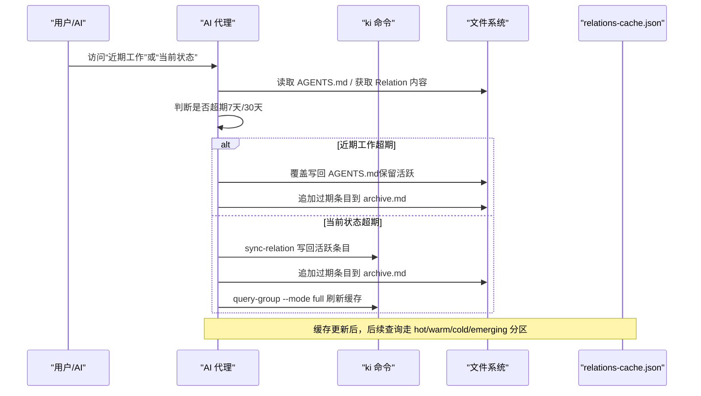
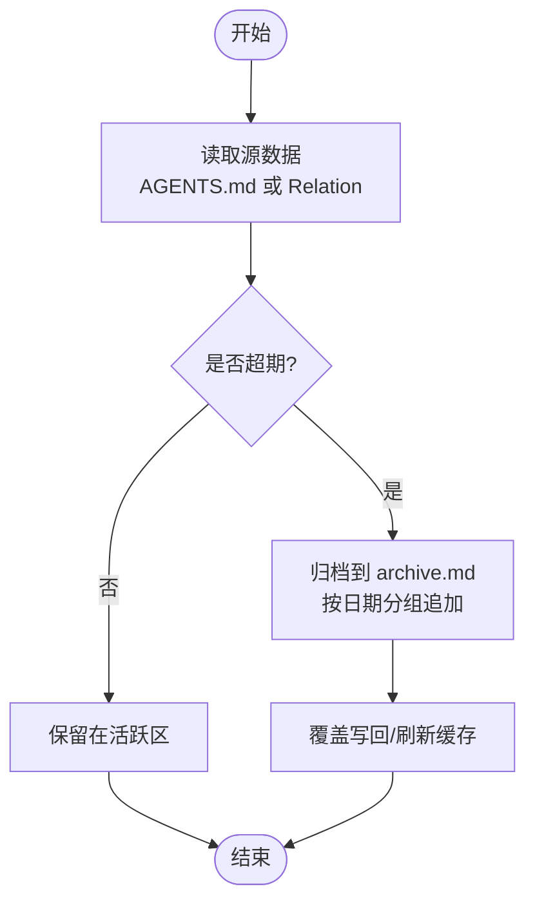
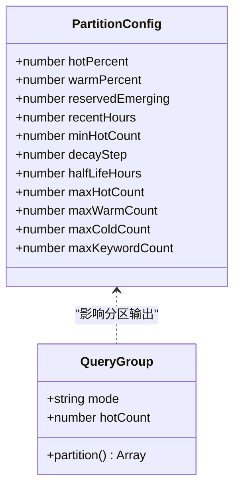
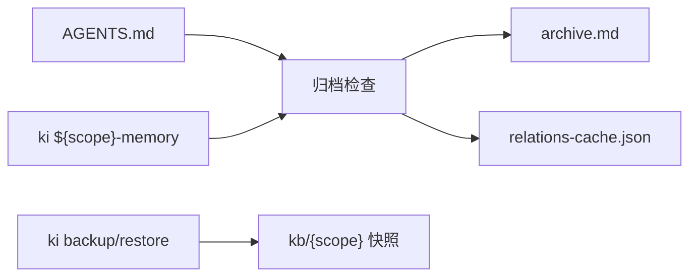

# 归档策略配置

<cite>
**本文引用的文件**
- [memory-agent-guide.md](file://docs/memory-agent-guide.md)
- [configuration.md](file://docs/configuration.md)
- [cli.md](file://docs/cli.md)
- [backup-restore.md](file://docs/backup-restore.md)
- [relations-cache.json](file://_template/relations-cache.json)
- [group-index.json](file://_template/group-index.json)
- [query-group.ts](file://src/query-group.ts)
</cite>

## 目录
1. [简介](#简介)
2. [项目结构](#项目结构)
3. [核心组件](#核心组件)
4. [架构总览](#架构总览)
5. [详细组件分析](#详细组件分析)
6. [依赖关系分析](#依赖关系分析)
7. [性能与冷热分离](#性能与冷热分离)
8. [故障排查与维护](#故障排查与维护)
9. [结论](#结论)
10. [附录](#附录)

## 简介
本文件为知识索引系统的“归档策略”完整配置指南，覆盖不同数据类型的保留规则、归档流程实现细节、archive.md 的组织结构与格式规范，以及冷热数据分离的配置方法、性能调优与资源管理建议，并给出归档监控与维护的最佳实践。目标是帮助使用者在保障可追溯性的前提下，合理控制活跃数据规模，提升检索与写入性能。

## 项目结构
归档相关的数据与行为分布在以下位置：
- 记忆系统（ki scope）：${scope}-memory，用于项目记忆与代码片段；其中“当前状态”Group 受 30 天过期标记约束。
- 用户画像与近期工作：直接维护在项目根 AGENTS.md 的“近期工作”章节，遵循 7 天保留策略。
- 归档目标：项目根 archive.md，按日期分组追加历史条目，不删除原始信息。
- 缓存与分区：relations-cache.json 定义热/温/冷分区参数，query-group 命令按分区输出热点与新兴内容。
- 备份与恢复：通过 ki backup/restore 对 scope 快照进行备份与回滚，确保归档过程可回溯。

图表来源
- [memory-agent-guide.md:338-386](file://docs/memory-agent-guide.md#L338-L386)
- [relations-cache.json:1-19](file://_template/relations-cache.json#L1-L19)
- [cli.md:1245-1308](file://docs/cli.md#L1245-L1308)
- [backup-restore.md:102-170](file://docs/backup-restore.md#L102-L170)

章节来源
- [memory-agent-guide.md:338-386](file://docs/memory-agent-guide.md#L338-L386)
- [configuration.md:27-177](file://docs/configuration.md#L27-L177)
- [cli.md:1245-1308](file://docs/cli.md#L1245-L1308)
- [backup-restore.md:102-170](file://docs/backup-restore.md#L102-L170)

## 核心组件
- 归档策略与触发点
  - 近期工作（AGENTS.md）：仅保留最近 7 天的“最近需求/已完成进度”，每条必须带日期前缀；“进行中进度”永久保留。
  - 当前状态（ki ${scope}-memory）：超过 30 天自动标记过期，并迁移至 archive.md。
  - 其他 Group（含代码片段）：永久保留，不参与归档。
- 归档时机
  - 每次访问 AGENTS.md“近期工作”或“当前状态”时，AI 必须检查并归档过期条目。
- 归档操作
  - 近期工作：解析条目 → 标记超期 → 覆盖写回 AGENTS.md → 过期条目追加到 archive.md。
  - 当前状态：读取 Relation 内容 → 标记超期 → 活跃条目写回 → 过期条目追加到 archive.md → 刷新缓存。
- 归档目标格式
  - archive.md 位于项目根目录，按日期分组追加，首次归档自动创建。

章节来源
- [memory-agent-guide.md:338-386](file://docs/memory-agent-guide.md#L338-L386)

## 架构总览
归档流程由 AI 驱动，结合 ki 命令与文件系统操作完成。整体链路如下：

图表来源
- [memory-agent-guide.md:353-372](file://docs/memory-agent-guide.md#L353-L372)
- [relations-cache.json:1-19](file://_template/relations-cache.json#L1-L19)

## 详细组件分析

### 归档策略与处理逻辑
- 近期工作（AGENTS.md）
  - 保留规则：仅保留最近 7 天的“最近需求/已完成进度”，每条必须带日期前缀；“进行中进度”永久保留。
  - 处理逻辑：解析条目 → 标记超期 → 覆盖写回 → 归档到 archive.md。
- 当前状态（ki ${scope}-memory）
  - 保留规则：超过 30 天自动标记过期。
  - 处理逻辑：读取 Relation → 标记超期 → 活跃条目写回 → 归档到 archive.md → 刷新缓存。
- 其他 Group（含代码片段）
  - 保留规则：永久保留，不参与归档。

图表来源
- [memory-agent-guide.md:353-372](file://docs/memory-agent-guide.md#L353-L372)

章节来源
- [memory-agent-guide.md:338-386](file://docs/memory-agent-guide.md#L338-L386)

### 过期检测与数据迁移
- 过期检测
  - 近期工作：基于条目日期与当前时间差，超过 7 天即视为过期（进行中进度除外）。
  - 当前状态：Relation 内容超过 30 天即视为过期。
- 数据迁移
  - 近期工作：从 AGENTS.md 移除超期条目，并追加到 archive.md。
  - 当前状态：通过 ki sync-relation 写回活跃条目，并将过期条目追加到 archive.md。

章节来源
- [memory-agent-guide.md:353-372](file://docs/memory-agent-guide.md#L353-L372)

### 历史保留策略
- 原则：归档不等于删除。过期条目移动到 archive.md，保持历史信息可追溯。
- 组织方式：archive.md 按日期分组追加，便于审计与回溯。

章节来源
- [memory-agent-guide.md:374-386](file://docs/memory-agent-guide.md#L374-L386)

### archive.md 组织结构与格式规范
- 位置：项目根目录，与 AGENTS.md 同级。
- 结构：以日期作为二级标题，每个日期下列出该日归档的条目，条目需带日期前缀。
- 示例结构：
  - # 归档记录
  - ## YYYY-MM-DD
  - - [YYYY-MM-DD] 描述

章节来源
- [memory-agent-guide.md:374-386](file://docs/memory-agent-guide.md#L374-L386)

### 冷热数据分离与分区配置
- 分区概念：relations-cache.json 定义热/温/冷分区比例与阈值，query-group 命令按分区展示结果。
- 关键参数：
  - hotPercent、warmPercent：热/温分区占比
  - reservedEmerging：新兴热区保留数量
  - recentHours：近期使用窗口
  - minHotCount、maxHotCount、maxWarmCount、maxColdCount：各分区数量限制
  - decayStep、halfLifeHours：衰减步长与半衰期
  - maxKeywordCount：关键词上限
- 查询模式：hot、warm、cold、emerging 四种模式，支持截断到 hotCount 显示。

图表来源
- [relations-cache.json:1-19](file://_template/relations-cache.json#L1-L19)
- [query-group.ts:455-477](file://src/query-group.ts#L455-L477)

章节来源
- [relations-cache.json:1-19](file://_template/relations-cache.json#L1-L19)
- [query-group.ts:455-477](file://src/query-group.ts#L455-L477)

## 依赖关系分析
- 归档流程依赖：
  - 文件读写：AGENTS.md、archive.md
  - ki 命令：sync-relation、query-group
  - 缓存：relations-cache.json（分区配置）
- 备份与恢复：
  - ki backup/restore 提供快照能力，确保归档过程可回滚。

图表来源
- [memory-agent-guide.md:353-372](file://docs/memory-agent-guide.md#L353-L372)
- [cli.md:1245-1308](file://docs/cli.md#L1245-L1308)
- [backup-restore.md:102-170](file://docs/backup-restore.md#L102-L170)

章节来源
- [memory-agent-guide.md:353-372](file://docs/memory-agent-guide.md#L353-L372)
- [cli.md:1245-1308](file://docs/cli.md#L1245-L1308)
- [backup-restore.md:102-170](file://docs/backup-restore.md#L102-L170)

## 性能与冷热分离
- 分区调优建议
  - 根据业务活跃度调整 hotPercent、warmPercent，确保高频内容优先命中热区。
  - 设置合理的 maxHotCount、maxWarmCount，避免热点膨胀影响查询延迟。
  - 使用 reservedEmerging 保留新兴内容，提高新知识的召回率。
- 资源管理建议
  - 定期执行 query-group --mode full 刷新缓存，确保分区与使用统计一致。
  - 结合 ki backup/restore 定期备份，防止缓存损坏导致分区失效。
- 性能优化
  - 控制 Relation 大小与数量，避免单次同步过长；超长内容建议拆分导入。
  - 利用 clean/import 配置过滤无关内容，减少无效数据进入索引。

章节来源
- [configuration.md:130-177](file://docs/configuration.md#L130-L177)
- [relations-cache.json:1-19](file://_template/relations-cache.json#L1-L19)
- [query-group.ts:455-477](file://src/query-group.ts#L455-L477)

## 故障排查与维护
- 常见问题
  - 归档失败：检查 AGENTS.md 与 archive.md 权限与路径是否正确。
  - 缓存不一致：执行 query-group --mode full 刷新缓存。
  - 备份异常：使用 ki restore 列出可用快照并选择目标恢复。
- 健康检查
  - 配置文件存在且可解析；dataDir/backupDir/vectorDir 存在且可写；apiKey 已解析；embedding 连通性正常；zvec collection 目录非空；scopes.default 配置检查。
- 维护最佳实践
  - 定期归档：每次访问“近期工作”或“当前状态”时执行归档检查。
  - 定期备份：使用 ki backup 生成快照，配合 ki restore 快速恢复。
  - 监控指标：关注 query-group 输出中 hot/warm/cold 分布变化，评估分区效果。

章节来源
- [cli.md:1245-1308](file://docs/cli.md#L1245-L1308)
- [backup-restore.md:102-170](file://docs/backup-restore.md#L102-L170)
- [configuration.md:119-134](file://docs/configuration.md#L119-L134)

## 结论
本归档策略通过明确的保留规则与自动化流程，平衡了活跃数据的时效性与历史数据的可追溯性。结合冷热分区与备份恢复机制，可在保障性能的同时降低存储压力。建议在生产环境中定期执行归档检查与备份，并根据业务特点调优分区参数，以获得更佳的检索体验与资源利用率。

## 附录
- 常用命令参考
  - 归档检查：访问“近期工作”或“当前状态”时自动触发。
  - 刷新缓存：ki query-group --mode full。
  - 备份与恢复：ki backup/restore。
- 配置项参考
  - dataDir、backupDir、vectorDir、embedding、scopeMode、scopes 等详见配置文档。

章节来源
- [memory-agent-guide.md:338-386](file://docs/memory-agent-guide.md#L338-L386)
- [configuration.md:27-177](file://docs/configuration.md#L27-L177)
- [cli.md:1245-1308](file://docs/cli.md#L1245-L1308)