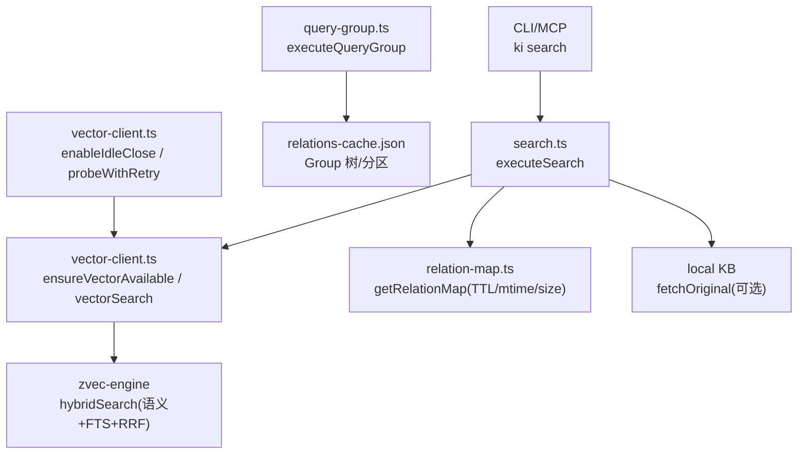
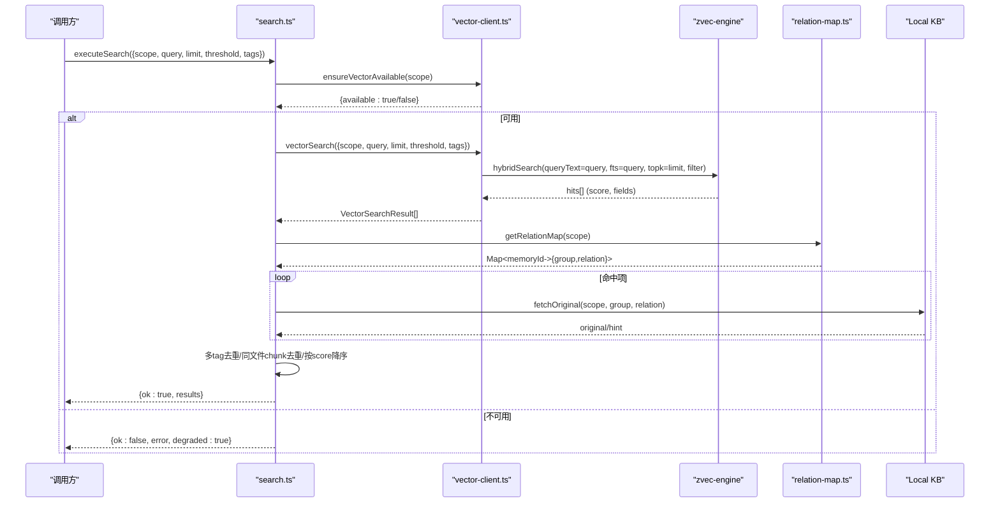
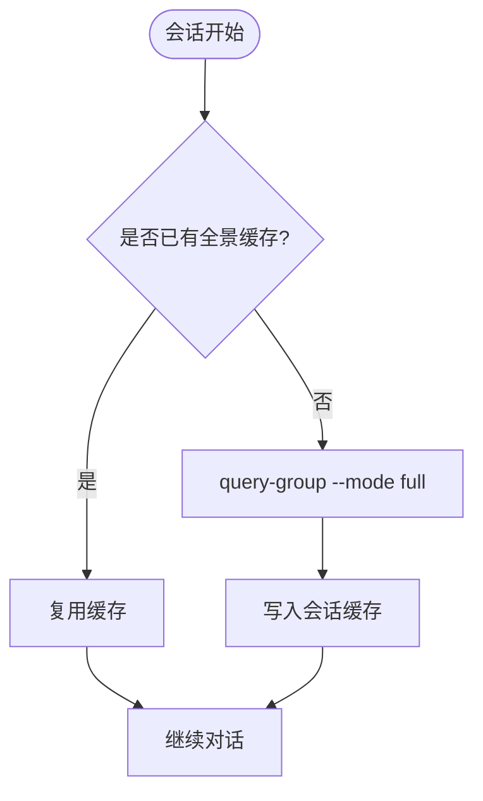
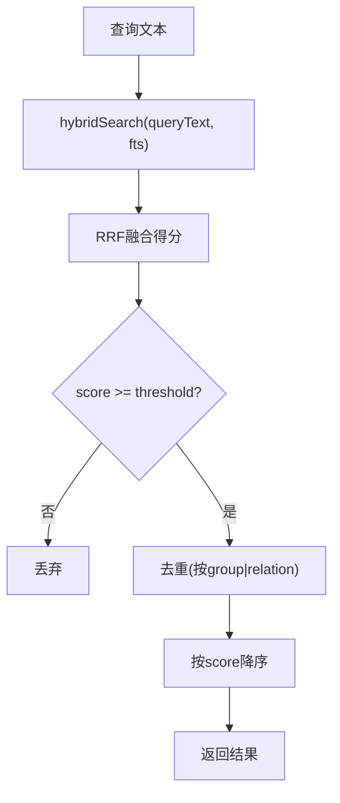
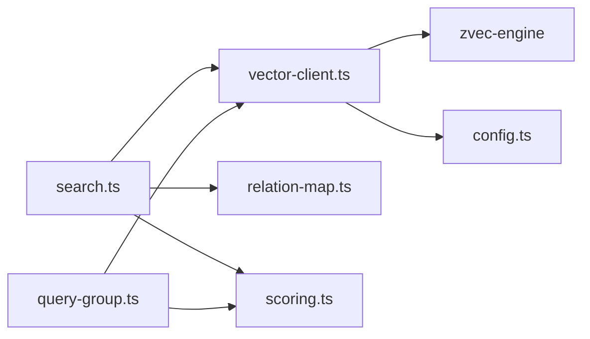

# 查询优化策略

<cite>
**本文引用的文件**
- [AGENTS.md](file://AGENTS.md)
- [search.ts](file://src/search.ts)
- [vector-client.ts](file://src/lib/vector-client.ts)
- [relation-map.ts](file://src/lib/relation-map.ts)
- [scoring.ts](file://src/lib/scoring.ts)
- [query-group.ts](file://src/query-group.ts)
- [config.ts](file://src/config.ts)
- [cli.md](file://docs/cli.md)
</cite>

## 目录
1. [简介](#简介)
2. [项目结构](#项目结构)
3. [核心组件](#核心组件)
4. [架构总览](#架构总览)
5. [详细组件分析](#详细组件分析)
6. [依赖关系分析](#依赖关系分析)
7. [性能考量](#性能考量)
8. [故障排查指南](#故障排查指南)
9. [结论](#结论)
10. [附录](#附录)

## 简介
本配置文档面向“查询优化策略”，覆盖以下关键主题：
- 缓存机制与失效：包括 AGENTS.md 的维护时机、刷新策略、失效机制，以及内存映射缓存（memoryId→group/relation）的 TTL 与 mtime/size 失效。
- 预加载机制：跨会话首次对话时强制拉取 scope-memory 全景的策略与触发点。
- 结果排序算法：语义检索与符号匹配的融合排序（hybridSearch + RRF）、阈值调整策略。
- 查询词构造最佳实践：语义描述+关键代码符号的组合模式。
- 性能调优建议与常见问题解决方案。

## 项目结构
围绕查询链路的关键文件与职责：
- 搜索入口与流程编排：src/search.ts
- 向量客户端与引擎管理：src/lib/vector-client.ts
- 反查映射缓存（memoryId→group/relation）：src/lib/relation-map.ts
- 评分与分区（热/温/冷/新兴）：src/lib/scoring.ts
- Group 树与全景展示（用于预加载）：src/query-group.ts
- 配置模板与默认路径：src/config.ts
- CLI 文档与阈值建议：docs/cli.md
- 工程级行为与并发锁/空闲释放等说明：AGENTS.md

图表来源
- [search.ts:70-199](file://src/search.ts#L70-L199)
- [vector-client.ts:420-506](file://src/lib/vector-client.ts#L420-L506)
- [relation-map.ts:48-78](file://src/lib/relation-map.ts#L48-L78)
- [query-group.ts:611-745](file://src/query-group.ts#L611-L745)

章节来源
- [search.ts:1-248](file://src/search.ts#L1-L248)
- [vector-client.ts:1-754](file://src/lib/vector-client.ts#L1-L754)
- [relation-map.ts:1-120](file://src/lib/relation-map.ts#L1-L120)
- [query-group.ts:1-784](file://src/query-group.ts#L1-L784)

## 核心组件
- 搜索执行器（search.ts）
  - 负责 scope 解析、向量可用性检测、按 tag 分查与合并、原文召回、多 tag 去重与最终排序。
- 向量客户端（vector-client.ts）
  - 封装 ZvecEngine，提供 ensureVectorAvailable、vectorSearch、批量存储/删除、空闲释放锁、撞锁重试、withEngine 在途保护与自愈。
- 反查映射缓存（relation-map.ts）
  - memoryId → {group, relation} 的懒构建 Map，带 TTL、mtime/size 失效。
- 评分与分区（scoring.ts）
  - 使用密度评分、冷热分区、边界衰减，支撑 Group/Relation 的热度组织。
- Group 全景（query-group.ts）
  - 读取 group-index.json 与 relations-cache.json，支持 full 模式输出完整索引树，用于跨会话首次对话的“全景预加载”。

章节来源
- [search.ts:70-199](file://src/search.ts#L70-L199)
- [vector-client.ts:420-506](file://src/lib/vector-client.ts#L420-L506)
- [relation-map.ts:48-114](file://src/lib/relation-map.ts#L48-L114)
- [scoring.ts:44-209](file://src/lib/scoring.ts#L44-L209)
- [query-group.ts:611-745](file://src/query-group.ts#L611-L745)

## 架构总览
查询主流程（语义检索 + 符号匹配融合 + 原文召回）：

图表来源
- [search.ts:70-199](file://src/search.ts#L70-L199)
- [vector-client.ts:420-506](file://src/lib/vector-client.ts#L420-L506)
- [relation-map.ts:48-78](file://src/lib/relation-map.ts#L48-L78)

## 详细组件分析

### 缓存机制与失效（AGENTS.md 相关）
- 向量库锁与空闲释放
  - 常驻 MCP 层启用空闲释放锁（enableIdleClose），空闲超时自动 closeEngine 释放 LOCK，使其他实例/CLI 可错开抢锁。
  - 撞锁重试（probeWithRetry）：检测到 locked 时等待并重试，最多若干次。
  - withEngine 在途保护：embedding 网络阶段计入在途计数，避免 idle close 打断进行中的检索。
- 反查映射缓存（memoryId→group/relation）
  - 懒构建 Map，命中条件：mtime/size 未变且未超 TTL（默认 10 分钟）。
  - 失效条件：文件被写入（mtime/size 变化）或 TTL 过期；文件缺失/损坏返回空 Map 降级。
- AGENTS.md 维护时机与刷新策略
  - 写入操作（如 sync-relation/import）后，relations-cache.json 会更新，下次访问 relation-map 将因 mtime/size 变化而重建。
  - 向量库占用/损坏场景通过 ensureVectorAvailable 返回 code 区分（LOCKED/CORRUPTED/PROBE_ERROR），上层据此提示恢复步骤。

章节来源
- [vector-client.ts:129-181](file://src/lib/vector-client.ts#L129-L181)
- [vector-client.ts:389-407](file://src/lib/vector-client.ts#L389-L407)
- [vector-client.ts:420-467](file://src/lib/vector-client.ts#L420-L467)
- [relation-map.ts:48-78](file://src/lib/relation-map.ts#L48-L78)
- [AGENTS.md:1-539](file://AGENTS.md#L1-L539)

### 预加载机制（跨会话首次对话的全景拉取）
- 触发点
  - 跨会话首次对话时，先执行 query-group --mode full 获取 scope 的完整索引树与分区统计，作为上下文记忆，后续对话无需重复拉取。
- 实现要点
  - query-group 读取 group-index.json 与 relations-cache.json，计算分组分数并按 hot/warm/cold/emerging/full 输出。
  - 若指定 groups 精确匹配失败，可开启 autoFallback 尝试 ki-path 语义兜底。
- 缓存与刷新
  - 该“全景”由上层（Agent/会话）缓存于当前会话；写入类操作（sync-relation/import）后需刷新。

图表来源
- [query-group.ts:611-745](file://src/query-group.ts#L611-L745)
- [docs/codekb-agent-guide.md:94-127](file://docs/codekb-agent-guide.md#L94-L127)

章节来源
- [query-group.ts:611-745](file://src/query-group.ts#L611-L745)
- [docs/codekb-agent-guide.md:94-127](file://docs/codekb-agent-guide.md#L94-L127)

### 结果排序算法（语义检索与符号匹配融合）
- 融合方式
  - hybridSearch：同时传入 queryText（语义）与 fts（关键词），底层使用 RRF（rankConstant 默认 60）融合两路结果。
  - 向量路 score 归一化（余弦距离转换），fts 路为 BM25 原值，融合后统一为相关性分。
- 阈值调整
  - 推荐阈值区间 0.02~0.03；超过 0.033 可能过滤掉所有结果（RRF 理论上限约 0.033）。
  - 可通过 --threshold 控制过滤低分命中，结合 --tags 精准过滤。
- 去重与排序
  - 多 tag 命中按 memoryId 去重，保留 score 最高的一条；同文件多 chunk 命中去重（original 仅首条返回）。
  - 最终按 score 降序输出。

图表来源
- [vector-client.ts:477-506](file://src/lib/vector-client.ts#L477-L506)
- [cli.md:525-538](file://docs/cli.md#L525-L538)
- [search.ts:123-199](file://src/search.ts#L123-L199)

章节来源
- [vector-client.ts:477-506](file://src/lib/vector-client.ts#L477-L506)
- [cli.md:525-538](file://docs/cli.md#L525-L538)
- [search.ts:123-199](file://src/search.ts#L123-L199)

### 查询词构造最佳实践
- 组合模式
  - 语义描述 + 关键代码符号：例如“仪表盘配置”搭配“hybridSearch”“ftsSearch”等符号，提升召回精度。
  - 使用 --tags 限定 ki-search/ki-relation/ki-path 等标签，缩小范围。
- 阈值策略
  - 宽泛查询适当提高 threshold（如 0.03）以收紧结果；具体数据需校准。
- 示例参考
  - 见 docs/cli.md 中关于 hybrid 检索与 threshold 的建议。

章节来源
- [cli.md:525-538](file://docs/cli.md#L525-L538)
- [search.ts:206-237](file://src/search.ts#L206-L237)

### 评分与热度分区（辅助理解“热门/常温/冷区/新兴”）
- 使用密度评分：基于 useCount 与 lastUsedTime 计算衰减分数。
- 分区策略：hot/warm/cold/emerging，支持边界衰减与上限截断，便于展示与缓存热点。
- 应用：query-group 对 Group/Relation 进行分区展示，指导用户聚焦高价值内容。

章节来源
- [scoring.ts:44-209](file://src/lib/scoring.ts#L44-L209)
- [query-group.ts:79-193](file://src/query-group.ts#L79-L193)

## 依赖关系分析
- search.ts 依赖 vector-client.ts（检索/可用性）、relation-map.ts（反查定位）、store/scope（路径与校验）。
- vector-client.ts 依赖 zvec-engine（底层检索/存储）、config（向量目录/Embedding 配置）。
- query-group.ts 依赖 store/scope（group-index/relations-cache）、scoring.ts（评分/分区）。
- relation-map.ts 依赖 scope（relations-cache 路径）。

图表来源
- [search.ts:70-199](file://src/search.ts#L70-L199)
- [vector-client.ts:420-506](file://src/lib/vector-client.ts#L420-L506)
- [query-group.ts:611-745](file://src/query-group.ts#L611-L745)

章节来源
- [search.ts:70-199](file://src/search.ts#L70-L199)
- [vector-client.ts:420-506](file://src/lib/vector-client.ts#L420-L506)
- [query-group.ts:611-745](file://src/query-group.ts#L611-L745)

## 性能考量
- 向量库锁与并发
  - 空闲释放锁 + 撞锁重试：常驻服务空闲超时释放锁，短命令可错开使用；避免立即失败。
  - withEngine 在途保护：防止 embedding 网络阶段被 idle close 中断。
- 缓存命中
  - relation-map 的 TTL/mtime/size 三重失效，减少频繁重建。
- 检索效率
  - hybridSearch 一次请求融合语义与关键词，减少多次往返；合理设置 topk 与 threshold 降低后续处理开销。
- 原文召回
  - includeOriginal 默认关闭，按需开启以避免额外 IO。

章节来源
- [vector-client.ts:129-181](file://src/lib/vector-client.ts#L129-L181)
- [vector-client.ts:389-407](file://src/lib/vector-client.ts#L389-L407)
- [relation-map.ts:48-78](file://src/lib/relation-map.ts#L48-L78)
- [search.ts:70-199](file://src/search.ts#L70-L199)

## 故障排查指南
- 向量服务不可用
  - 检查 ensureVectorAvailable 返回的 code：LOCKED（被占用）、CORRUPTED（损坏）、PROBE_ERROR（异常）。
  - 根据提示执行 rebuild-vector 或 restore 恢复。
- 结果过少或为空
  - 调整 threshold（建议 0.02~0.03），或使用更具体的语义+符号查询词。
  - 使用 --tags 限定 ki-path/ki-relation 等标签。
- 原文不可用
  - 检查 local KB 是否存在对应 relation；必要时执行 sync-relation 或 rebuild-vector。
- 多实例冲突
  - 遵循空闲释放锁与撞锁重试策略；确认无残留进程占用向量库。

章节来源
- [vector-client.ts:420-467](file://src/lib/vector-client.ts#L420-L467)
- [cli.md:525-538](file://docs/cli.md#L525-L538)
- [search.ts:54-68](file://src/search.ts#L54-L68)

## 结论
本方案通过“语义+关键词”融合检索、严格的阈值与标签过滤、TTL/mtime/size 多级缓存失效、以及跨会话的首次全景预加载，实现了高效、稳定、可解释的知识检索体验。配合空闲释放锁与在途保护，确保在高并发与网络延迟场景下的鲁棒性。实践中建议：
- 首次对话执行 query-group --mode full 建立全局认知。
- 查询词采用“语义描述+关键符号”，并结合 --tags 与 --threshold 微调。
- 遇到不可用时依据错误码采取恢复措施。

## 附录
- 配置模板生成与默认路径：见 config.ts 的 init 逻辑与默认 dataDir/backupDir/vectorDir。
- CLI 参数速查：search、query-group 等命令的参数与用法详见 cli.md。

章节来源
- [config.ts:128-177](file://src/config.ts#L128-L177)
- [cli.md:525-563](file://docs/cli.md#L525-L563)