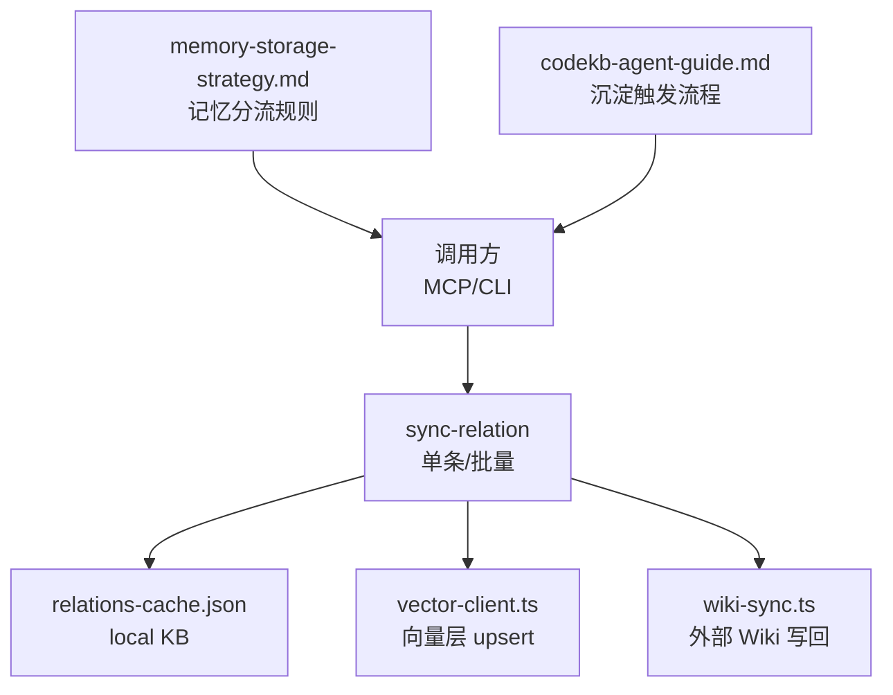
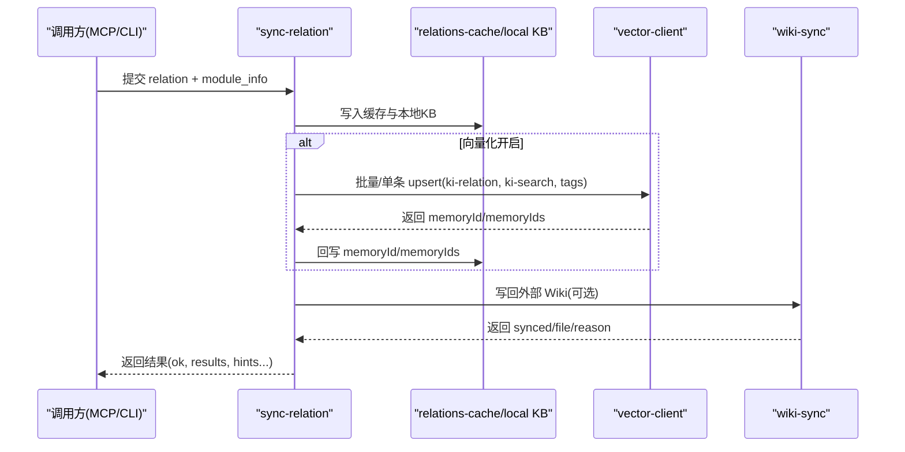
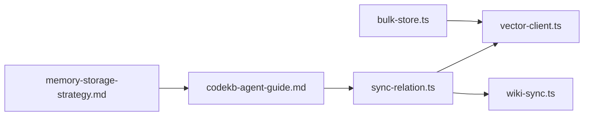

# 自动沉淀机制

<cite>
**本文引用的文件**
- [AGENTS.md](file://AGENTS.md)
- [src/sync-relation.ts](file://src/sync-relation.ts)
- [src/bulk-store.ts](file://src/bulk-store.ts)
- [src/lib/vector-client.ts](file://src/lib/vector-client.ts)
- [src/lib/wiki-sync.ts](file://src/lib/wiki-sync.ts)
- [memories/memory-storage-strategy.md](file://memories/memory-storage-strategy.md)
- [memories/ki-search-usage.md](file://memories/ki-search-usage.md)
- [docs/codekb-agent-guide.md](file://docs/codekb-agent-guide.md)
- [.requirements/2026-06-18-向量存储与KB写入并行化优化/design/DESIGN.md](file://.requirements/2026-06-18-向量存储与KB写入并行化优化/design/DESIGN.md)
</cite>

## 目录
1. [简介](#简介)
2. [项目结构](#项目结构)
3. [核心组件](#核心组件)
4. [架构总览](#架构总览)
5. [详细组件分析](#详细组件分析)
6. [依赖关系分析](#依赖关系分析)
7. [性能考量](#性能考量)
8. [故障排查指南](#故障排查指南)
9. [结论](#结论)
10. [附录：配置示例与最佳实践](#附录配置示例与最佳实践)

## 简介
本文件面向“自动沉淀机制”的配置与使用，聚焦以下目标：
- 明确触发条件的识别逻辑：如何从项目信息、踩坑经验、代码要点、需求进度、用户偏好等信号中判断是否应沉淀到本地知识库（KB）与向量索引。
- 解释写入策略选择原则：何时使用单条写入（ki_sync_relation），何时使用批量写入（ki_bulk_sync_relation），以及批量操作的优化策略与性能考虑。
- 说明 AGENTS.md 与 ki 记忆系统的分工边界，以及记忆失实检测与处理机制。
- 提供具体配置示例与最佳实践建议，确保在真实项目中可落地执行。

## 项目结构
自动沉淀机制由“触发识别—写入决策—持久化—写回”的链路构成，涉及 CLI/MCP 入口、关系同步、向量客户端、Wiki 写回与记忆策略等模块。

图示来源
- [src/sync-relation.ts:129-339](file://src/sync-relation.ts#L129-L339)
- [src/lib/vector-client.ts:513-590](file://src/lib/vector-client.ts#L513-L590)
- [src/lib/wiki-sync.ts:66-151](file://src/lib/wiki-sync.ts#L66-L151)
- [memories/memory-storage-strategy.md:1-14](file://memories/memory-storage-strategy.md#L1-L14)
- [docs/codekb-agent-guide.md:128-210](file://docs/codekb-agent-guide.md#L128-L210)

章节来源
- [src/sync-relation.ts:129-339](file://src/sync-relation.ts#L129-L339)
- [src/lib/vector-client.ts:513-590](file://src/lib/vector-client.ts#L513-L590)
- [src/lib/wiki-sync.ts:66-151](file://src/lib/wiki-sync.ts#L66-L151)
- [memories/memory-storage-strategy.md:1-14](file://memories/memory-storage-strategy.md#L1-L14)
- [docs/codekb-agent-guide.md:128-210](file://docs/codekb-agent-guide.md#L128-L210)

## 核心组件
- 关系同步器（sync-relation）：负责将 AI 提供的 relation + 模块信息校验后写入缓存与本地 KB，支持单条与批量模式，并可选向量化与 Wiki 写回。
- 向量客户端（vector-client）：封装向量引擎，提供单条/批量存储、检索、删除与管理能力；内置撞锁重试、空闲释放锁、在途保护与自愈。
- Wiki 写回（wiki-sync）：将 relation 内容写回外部 Wiki，支持自动补齐历史、门禁控制与幂等覆盖。
- 记忆策略（memory-storage-strategy）：定义平台内置记忆与 ki 记忆的分工，指导沉淀位置选择。
- Agent 沉淀流程（codekb-agent-guide）：给出“查询—定位—回写—提炼回答”的标准流程，作为触发沉淀的参考。

章节来源
- [src/sync-relation.ts:129-339](file://src/sync-relation.ts#L129-L339)
- [src/lib/vector-client.ts:513-590](file://src/lib/vector-client.ts#L513-L590)
- [src/lib/wiki-sync.ts:66-151](file://src/lib/wiki-sync.ts#L66-L151)
- [memories/memory-storage-strategy.md:1-14](file://memories/memory-storage-strategy.md#L1-L14)
- [docs/codekb-agent-guide.md:128-210](file://docs/codekb-agent-guide.md#L128-L210)

## 架构总览
自动沉淀机制的整体数据流如下：

图示来源
- [src/sync-relation.ts:407-787](file://src/sync-relation.ts#L407-L787)
- [src/lib/vector-client.ts:547-590](file://src/lib/vector-client.ts#L547-L590)
- [src/lib/wiki-sync.ts:66-151](file://src/lib/wiki-sync.ts#L66-L151)

## 详细组件分析

### 触发条件识别逻辑
- 项目信息：当 Agent 通过 query-group/get-module-info 命中 Group/Relation 或语义搜索命中记忆时，若该知识具备复用价值（如高频、关键路径、易遗忘），则触发沉淀。
- 踩坑经验：出现异常、修复方案、规避策略等，适合沉淀为“踩坑点/关键逻辑”，优先走 ki-search 或 rules 记忆。
- 代码要点：函数/流程/模式类知识，按记忆策略分流至 rules 或 ki-search。
- 需求进度：阶段性进展、里程碑、阻塞项，沉淀为项目背景/进度记忆。
- 用户偏好：简洁通用、跨项目、每次对话都需要的内容进入平台内置记忆；其他偏好沉淀到 ki。

章节来源
- [docs/codekb-agent-guide.md:128-210](file://docs/codekb-agent-guide.md#L128-L210)
- [memories/memory-storage-strategy.md:1-14](file://memories/memory-storage-strategy.md#L1-L14)
- [memories/ki-search-usage.md:1-12](file://memories/ki-search-usage.md#L1-L12)

### 写入策略选择原则
- 单条写入（ki_sync_relation）：
  - 适用场景：实时性要求高、单次 relation 较小、需要立即落盘并回写 Wiki；或 MCP 逐条调用。
  - 优点：简单直接、失败影响面小、便于细粒度控制。
  - 缺点：多次 HTTP embedding 与 worker 写入开销大。
- 批量写入（ki_bulk_sync_relation / bulk-store）：
  - 适用场景：大量 relation 同时沉淀、导入阶段、批量构建索引。
  - 优点：一次 embedding HTTP + 一次 worker upsert，显著降低网络与进程开销；同批去重避免孤儿向量。
  - 缺点：需构造批量输入、错误聚合更复杂。
- 选择建议：
  - 高频、低延迟场景优先单条；批量构建/导入优先批量。
  - 批量时尽量合并相同 group/relation，减少重复写入与内存占用。
  - 向量服务不可用时降级为仅 KB 写入，不阻塞主流程。

章节来源
- [src/sync-relation.ts:407-787](file://src/sync-relation.ts#L407-L787)
- [src/bulk-store.ts:32-78](file://src/bulk-store.ts#L32-L78)
- [.requirements/2026-06-18-向量存储与KB写入并行化优化/design/DESIGN.md:1-417](file://.requirements/2026-06-18-向量存储与KB写入并行化优化/design/DESIGN.md#L1-L417)

### 批量操作优化与性能考虑
- 同批去重：对相同 (group, relation) 的后一条覆盖前一条，剔除前一条的向量 entries，避免孤儿向量与误删。
- 批量 upsert：一次 embedding HTTP + 一次 worker upsert，减少网络往返与进程启动开销。
- 旧向量清理：聚合 stale docId 后一次性删除，避免 N 次串行删除稀释批量收益。
- 可用性检测：ensureVectorAvailable 快速判定向量服务状态，不可用时标记 vectorStored=false 并继续 KB 写入。
- 空闲释放锁与撞锁重试：常驻 MCP 启用空闲释放锁，CLI 短命令 per-call 关闭；撞锁时等待并重试，提升多实例共享向量库的稳定性。
- 在途保护：withEngine 包装所有 engine 操作，防止 idle close 竞态导致 worker 不可用。

章节来源
- [src/sync-relation.ts:569-745](file://src/sync-relation.ts#L569-L745)
- [src/lib/vector-client.ts:88-104](file://src/lib/vector-client.ts#L88-L104)
- [src/lib/vector-client.ts:164-181](file://src/lib/vector-client.ts#L164-L181)
- [src/lib/vector-client.ts:389-407](file://src/lib/vector-client.ts#L389-L407)
- [src/lib/vector-client.ts:420-467](file://src/lib/vector-client.ts#L420-L467)

### AGENTS.md 与 ki 记忆系统分工边界
- AGENTS.md：记录需求、踩坑、修复过程与参数说明，作为工程变更与问题回溯的权威文档；不适合存放频繁变化的运行时知识。
- ki 记忆系统：承载可检索、可沉淀的知识（代码要点、架构决策、踩坑经验、需求记录等），通过 sync-relation 写入 KB 与向量层，供后续查询与沉淀。
- 分工原则：
  - 静态/低频/工程级记录 → AGENTS.md
  - 动态/高频/可检索知识 → ki 记忆（rules/ai-codekb-memory.md 或 ki-search）
  - 简洁通用偏好 → 平台内置记忆；详细知识 → ki

章节来源
- [AGENTS.md:1-539](file://AGENTS.md#L1-L539)
- [memories/memory-storage-strategy.md:1-14](file://memories/memory-storage-strategy.md#L1-L14)

### 记忆失实检测与处理机制
- 检测时机：
  - 查询阶段：先查 ki-search/索引，未命中再语义搜索；若命中但内容陈旧或不准确，结合上下文二次确认。
  - 写入阶段：批量去重与 stale 清理，避免旧 tag 向量残留导致召回偏差。
- 处理策略：
  - 部分失败保留旧向量：当新 tag 向量写入部分失败时，不清理旧向量，避免“删旧丢新”。
  - 重建恢复：向量损坏或被占用时，提示执行 rebuild-vector 或 restore 恢复。
  - 幂等覆盖：backfill 默认跳过已存在文件，避免刷新时间戳造成脏 diff；强制覆盖时需显式参数。

章节来源
- [src/sync-relation.ts:654-705](file://src/sync-relation.ts#L654-L705)
- [src/lib/vector-client.ts:74-86](file://src/lib/vector-client.ts#L74-L86)
- [src/lib/wiki-sync.ts:194-284](file://src/lib/wiki-sync.ts#L194-L284)

## 依赖关系分析

图示来源
- [src/sync-relation.ts:407-787](file://src/sync-relation.ts#L407-L787)
- [src/lib/vector-client.ts:513-590](file://src/lib/vector-client.ts#L513-L590)
- [src/lib/wiki-sync.ts:66-151](file://src/lib/wiki-sync.ts#L66-L151)
- [src/bulk-store.ts:32-78](file://src/bulk-store.ts#L32-L78)
- [docs/codekb-agent-guide.md:128-210](file://docs/codekb-agent-guide.md#L128-L210)
- [memories/memory-storage-strategy.md:1-14](file://memories/memory-storage-strategy.md#L1-L14)

章节来源
- [src/sync-relation.ts:407-787](file://src/sync-relation.ts#L407-L787)
- [src/lib/vector-client.ts:513-590](file://src/lib/vector-client.ts#L513-L590)
- [src/lib/wiki-sync.ts:66-151](file://src/lib/wiki-sync.ts#L66-L151)
- [src/bulk-store.ts:32-78](file://src/bulk-store.ts#L32-L78)
- [docs/codekb-agent-guide.md:128-210](file://docs/codekb-agent-guide.md#L128-L210)
- [memories/memory-storage-strategy.md:1-14](file://memories/memory-storage-strategy.md#L1-L14)

## 性能考量
- 串行→并行/异步：设计文档指出 KB 通道与向量通道原串行执行导致延迟高，优化后 KB 写入立即返回，向量异步执行，显著提升吞吐。
- 批量 upsert：一次 embedding HTTP + 一次 worker upsert，减少网络与进程开销。
- 空闲释放锁与撞锁重试：常驻 MCP 空闲释放锁，CLI 短命令 per-call 关闭；撞锁等待并重试，提升多实例共享稳定性。
- 在途保护：withEngine 防止 idle close 竞态，避免 worker 不可用错误。
- 降级策略：向量服务不可用时仅写 KB，不阻塞主流程。

章节来源
- [.requirements/2026-06-18-向量存储与KB写入并行化优化/design/DESIGN.md:1-417](file://.requirements/2026-06-18-向量存储与KB写入并行化优化/design/DESIGN.md#L1-L417)
- [src/lib/vector-client.ts:164-181](file://src/lib/vector-client.ts#L164-L181)
- [src/lib/vector-client.ts:389-407](file://src/lib/vector-client.ts#L389-L407)
- [src/lib/vector-client.ts:420-467](file://src/lib/vector-client.ts#L420-L467)

## 故障排查指南
- 向量库被占用：
  - 现象：ensureVectorAvailable 返回 LOCKED。
  - 处置：停止常驻进程、等待锁释放、或执行 rebuild-vector/restore 恢复。
- 向量服务损坏：
  - 现象：PROBE_ERROR 或 CORRUPTED。
  - 处置：执行 restore --from-snapshot 重建向量库。
- 批量写入部分失败：
  - 现象：vectorReason 提示部分内容向量写入失败。
  - 处置：保留旧向量，必要时 rebuild-vector 恢复。
- Wiki 写回失败：
  - 现象：synced=false 且 reason 非空。
  - 处置：检查 wikiSync.enabled/sourceDir、relation 合法性、目标目录权限。

章节来源
- [src/lib/vector-client.ts:74-86](file://src/lib/vector-client.ts#L74-L86)
- [src/lib/vector-client.ts:420-467](file://src/lib/vector-client.ts#L420-L467)
- [src/sync-relation.ts:654-705](file://src/sync-relation.ts#L654-L705)
- [src/lib/wiki-sync.ts:66-151](file://src/lib/wiki-sync.ts#L66-L151)

## 结论
自动沉淀机制通过明确的触发识别、灵活的写入策略与健壮的向量/KB/Wiki 协同，实现了高效、可靠的知识沉淀。合理选择单条与批量写入、利用批量优化与降级策略、遵循记忆分流规则，可在真实项目中稳定运行并持续积累高质量知识。

## 附录：配置示例与最佳实践

### 触发沉淀的典型场景
- 查询未命中 → 语义搜索命中记忆 → 提炼摘要 → sync-relation 回写本地（提升后续查询效率）。
- 踩坑经验/关键逻辑 → 沉淀到 rules/ai-codekb-memory.md 或 ki-search。
- 项目背景/进度/偏好 → 按记忆策略分流到内置记忆或 ki。

章节来源
- [docs/codekb-agent-guide.md:128-210](file://docs/codekb-agent-guide.md#L128-L210)
- [memories/memory-storage-strategy.md:1-14](file://memories/memory-storage-strategy.md#L1-L14)

### 写入策略配置建议
- 单条写入（ki_sync_relation）：
  - 适用：实时回写、少量 relation、需立即 Wiki 写回。
  - 注意：向量服务不可用时降级为仅 KB 写入。
- 批量写入（ki_bulk_sync_relation / bulk-store）：
  - 适用：导入阶段、批量构建、大量 relation 同时沉淀。
  - 注意：同批去重、聚合 stale 删除、向量不可用降级。

章节来源
- [src/sync-relation.ts:407-787](file://src/sync-relation.ts#L407-L787)
- [src/bulk-store.ts:32-78](file://src/bulk-store.ts#L32-L78)

### Wiki 写回配置
- 启用 wikiSync：
  - scopes.{scope}.wikiSync.enabled = true
  - scopes.{scope}.wikiSync.sourceDir = "/path/to/wiki"
- 自动补齐：
  - wikiSync.autoBackfill 默认 true，目录不存在或为空时自动补齐历史关系。
  - 可通过 autoBackfill: false 关闭自动补齐。

章节来源
- [src/lib/wiki-sync.ts:66-151](file://src/lib/wiki-sync.ts#L66-L151)
- [src/lib/wiki-sync.ts:194-284](file://src/lib/wiki-sync.ts#L194-L284)

### 最佳实践
- 优先使用批量写入进行导入与批量构建，减少网络与进程开销。
- 单条写入用于实时回写与即时 Wiki 写回。
- 定期执行 rebuild-vector 或 restore 恢复向量库。
- 遵循记忆分流规则，避免将详细知识存入内置记忆或将简洁偏好存入 ki。
- 使用 ensureVectorAvailable 检测向量服务状态，不可用时降级为仅 KB 写入。

章节来源
- [src/lib/vector-client.ts:420-467](file://src/lib/vector-client.ts#L420-L467)
- [memories/memory-storage-strategy.md:1-14](file://memories/memory-storage-strategy.md#L1-L14)