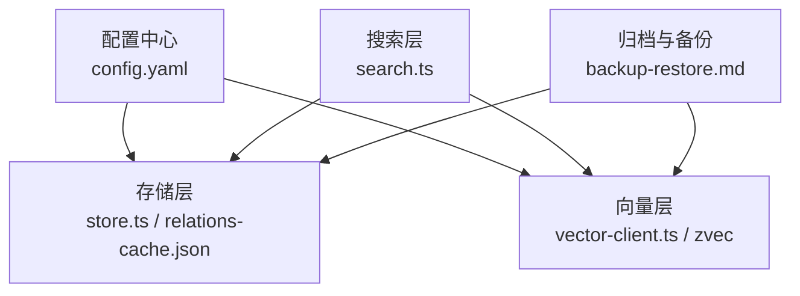
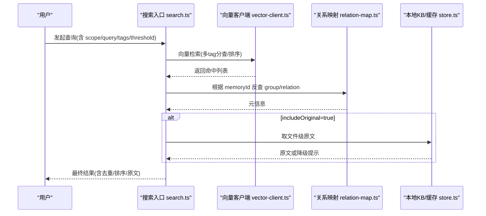
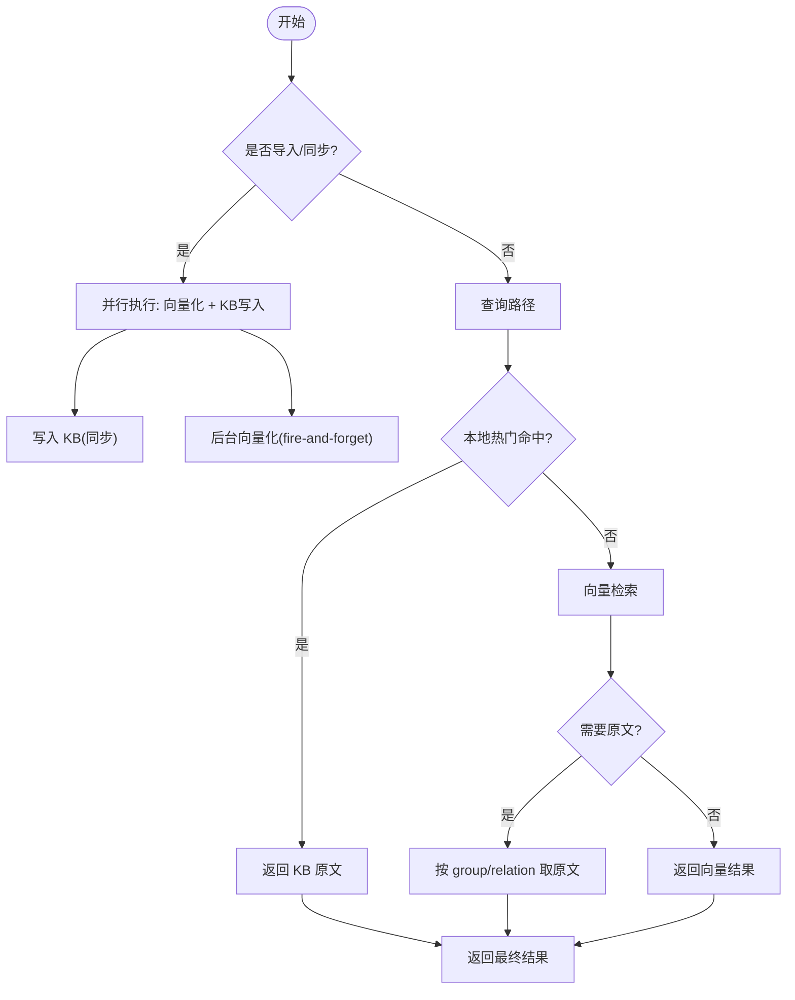
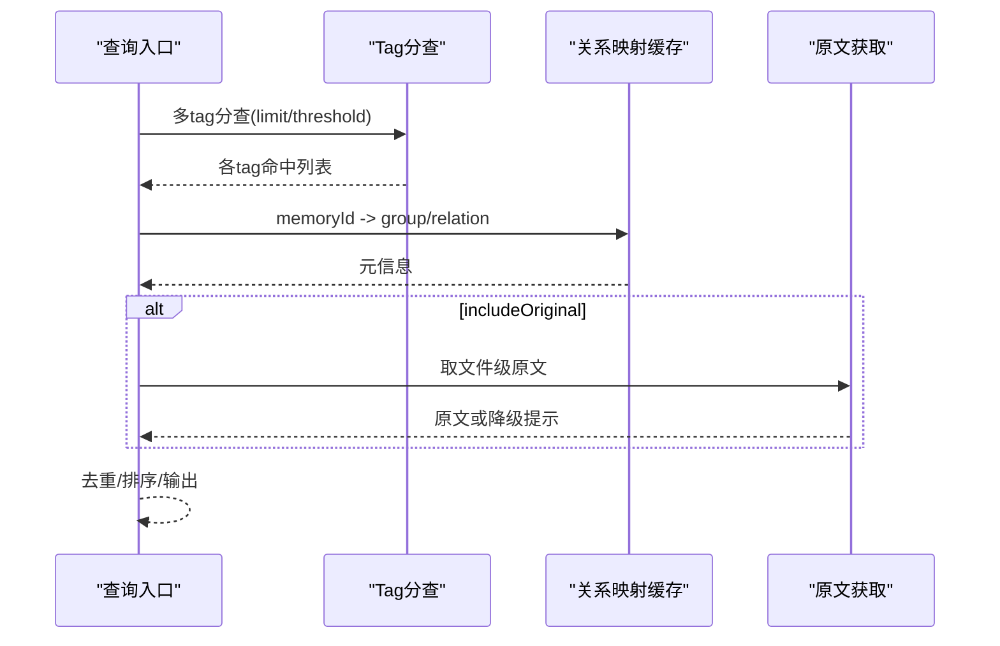
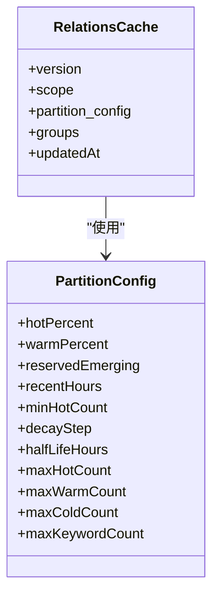
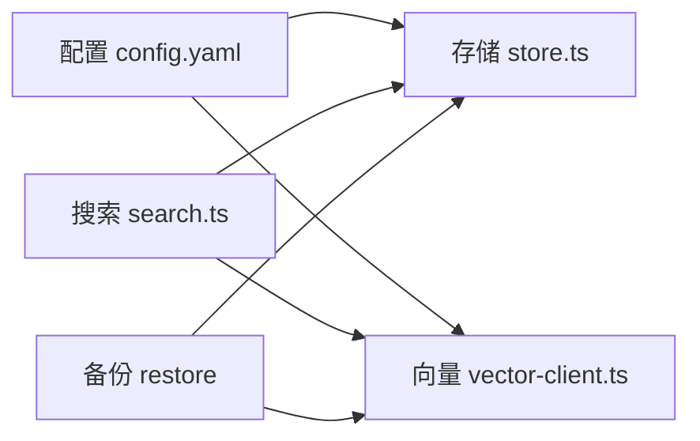

# 记忆系统配置

<cite>
**本文引用的文件**
- [src/config.ts](file://src/config.ts)
- [docs/configuration.md](file://docs/configuration.md)
- [src/lib/store.ts](file://src/lib/store.ts)
- [_template/relations-cache.json](file://_template/relations-cache.json)
- [src/search.ts](file://src/search.ts)
- [src/lib/vector-client.ts](file://src/lib/vector-client.ts)
- [src/lib/relation-map.ts](file://src/lib/relation-map.ts)
- [memories/memory-storage-strategy.md](file://memories/memory-storage-strategy.md)
- [test_data/bk-monitor-wiki/configs/mem /config.yaml](file://test_data/bk-monitor-wiki/configs/mem /config.yaml)
- [.e2e-run/ki-config.yaml](file://.e2e-run/ki-config.yaml)
- [docs/architecture.md](file://docs/architecture.md)
- [docs/backup-restore.md](file://docs/backup-restore.md)
- [src/lib/path-search.ts](file://src/lib/path-search.ts)
</cite>

## 目录
1. [简介](#简介)
2. [项目结构](#项目结构)
3. [核心组件](#核心组件)
4. [架构总览](#架构总览)
5. [详细组件分析](#详细组件分析)
6. [依赖关系分析](#依赖关系分析)
7. [性能考虑](#性能考虑)
8. [故障排查指南](#故障排查指南)
9. [结论](#结论)
10. [附录：配置示例与最佳实践](#附录配置示例与最佳实践)

## 简介
本文件面向“记忆系统”的完整配置与运维，覆盖自动沉淀机制、查询优化策略、归档与冷热分离、代码片段记忆的提取与禁忌规则，以及可落地的配置文件示例与最佳实践。记忆系统在项目中由两条通道组成：
- KB 通道：本地索引与缓存（group-index、relations-cache、local KB），用于快速命中与原文定位。
- 向量通道：通过 mem CLI/zvec 引擎进行语义检索，支持混合检索、重排与标签过滤。

## 项目结构
记忆系统相关的关键位置与职责如下：
- 配置中心：CLI 生成模板与运行时加载配置（YAML/JSON）。
- 存储层：WAL 写入、scope 初始化、旧数据迁移、relations-cache 分区配置。
- 搜索层：多 tag 分查、结果排序、去重、原文召回与降级。
- 向量层：zvec 集合、embedding 提供商、re-ranker、降采样与阈值过滤。
- 归档与备份：快照备份、恢复、清理策略。

图表来源
- [docs/configuration.md:27-37](file://docs/configuration.md#L27-L37)
- [src/lib/store.ts:55-62](file://src/lib/store.ts#L55-L62)
- [src/search.ts:70-199](file://src/search.ts#L70-L199)
- [docs/backup-restore.md:102-170](file://docs/backup-restore.md#L102-L170)

章节来源
- [docs/configuration.md:27-37](file://docs/configuration.md#L27-L37)
- [src/config.ts:66-118](file://src/config.ts#L66-L118)

## 核心组件
- 配置管理：提供 init 命令生成带注释的 YAML 模板，包含 dataDir、backupDir、vectorDir、embedding、scopeMode、scopes 等关键项。
- 存储与生命周期：WAL 原子写入、版本兼容、scope 初始化与旧格式迁移、relations-cache 分区参数。
- 搜索与优化：多 tag 分查、按优先级合并、score 排序、同文件去重、原文召回与降级。
- 向量与重排：embedding 提供商、维度一致性、混合检索权重、重排模型与端点、阈值过滤。
- 归档与清理：快照备份、恢复流程、向量库重建注意事项。

章节来源
- [src/config.ts:66-118](file://src/config.ts#L66-L118)
- [src/lib/store.ts:55-62](file://src/lib/store.ts#L55-L62)
- [src/search.ts:70-199](file://src/search.ts#L70-L199)
- [docs/configuration.md:67-88](file://docs/configuration.md#L67-L88)
- [_template/relations-cache.json:1-19](file://_template/relations-cache.json#L1-L19)

## 架构总览
记忆系统采用“双通道 + 分层缓存 + 向量语义”的架构：
- 写入时：KB 同步写入，向量异步后台执行；import 阶段向量化与 KB 写入并行化。
- 读取时：优先命中本地热门 Relation，未命中则走向量检索；必要时回写本地索引与 KB。
- 降级：向量不可用时静默降级，保留原有行为。

图表来源
- [src/search.ts:70-199](file://src/search.ts#L70-L199)
- [src/lib/vector-client.ts](file://src/lib/vector-client.ts)
- [src/lib/relation-map.ts](file://src/lib/relation-map.ts)
- [src/lib/store.ts:55-62](file://src/lib/store.ts#L55-L62)

章节来源
- [docs/architecture.md:83-127](file://docs/architecture.md#L83-L127)
- [src/search.ts:70-199](file://src/search.ts#L70-L199)

## 详细组件分析

### 自动沉淀机制（触发条件、存储策略、生命周期）
- 触发条件
  - 导入阶段：scan-kb import 将向量化与 KB 写入并行化，减少串行等待。
  - 同步阶段：sync-relation 先完成 KB 同步并立即返回，向量写入以 fire-and-forget 方式后台执行。
- 存储策略
  - KB 通道：group-index.json、relations-cache.json、local KB 原文。
  - 向量通道：zvec collection 与 embedding 配置；memoryId 与 sourcePath 关联。
- 生命周期
  - WAL 写入确保原子性；version 检查保证兼容性；scope 初始化从 _template 复制基础结构。
  - 旧数据迁移：group-index 的 roots→groups 迁移，relations-cache 中“项目根/”前缀 key 的重命名与合并。

图表来源
- [docs/architecture.md:83-127](file://docs/architecture.md#L83-L127)
- [src/lib/store.ts:168-223](file://src/lib/store.ts#L168-L223)
- [src/search.ts:70-199](file://src/search.ts#L70-L199)

章节来源
- [docs/architecture.md:83-127](file://docs/architecture.md#L83-L127)
- [src/lib/store.ts:168-223](file://src/lib/store.ts#L168-L223)
- [src/search.ts:70-199](file://src/search.ts#L70-L199)

### 查询优化策略（缓存、预加载、排序、去重）
- 缓存机制
  - 会话内索引缓存：首次查询后，当前会话有效，避免重复拉取。
  - 关系映射缓存：getRelationMap 带 TTL+mtime 缓存，构建一次后续 O(1)。
- 预加载
  - 多 tag 分查：默认不传 tags 时按 tag 分别检索，再按优先级合并，提升命中率。
- 排序与去重
  - 按 score 降序；同一 (group, relation) 仅保留最高分；同一文件多 chunk 命中去重，避免重复原文。
- 原文召回
  - 显式开启才返回原文；失败时降级为向量文档并给出提示。

图表来源
- [src/search.ts:70-199](file://src/search.ts#L70-L199)
- [src/lib/relation-map.ts](file://src/lib/relation-map.ts)

章节来源
- [src/search.ts:70-199](file://src/search.ts#L70-L199)

### 归档策略（冷热分离、历史清理、性能调优）
- 冷热分离
  - relations-cache 的 partition_config 控制 hot/warm/cold/emerging 比例与上限，结合最近使用时间衰减。
- 历史清理
  - 通过备份与恢复机制保障数据安全；向量库 schema 变更需重建 collection，注意数据丢失风险。
- 性能调优
  - 向量库 optimize/flush 维护操作；合理设置 threshold、limit 与 re-ranker 权重；避免过大 maxFileSize 导致导入缓慢。

图表来源
- [_template/relations-cache.json:1-19](file://_template/relations-cache.json#L1-L19)

章节来源
- [_template/relations-cache.json:1-19](file://_template/relations-cache.json#L1-L19)
- [docs/backup-restore.md:102-170](file://docs/backup-restore.md#L102-L170)

### 代码片段记忆的提取规则与禁忌规则
- 提取规则
  - 清洗规则：frontmatter、HTML 注释、mermaid、codePath、codeBlock、keepShortSamples、emptyChunk 等可按 scope 开关。
  - 导入限制：extensions 白名单、maxFileSize 单文件大小上限。
- 禁忌规则
  - 平台内置记忆仅用于简洁通用偏好；详细知识应存入 ki 记忆并按类型分流。
  - 禁止将详细知识存入内置记忆，禁止将简洁偏好存入 ki。

章节来源
- [docs/configuration.md:130-163](file://docs/configuration.md#L130-L163)
- [memories/memory-storage-strategy.md:1-14](file://memories/memory-storage-strategy.md#L1-L14)

## 依赖关系分析
- 配置依赖：config.yaml 决定 dataDir、vectorDir、embedding、scopeMode、scopes。
- 存储依赖：store.ts 负责 WAL 写入、scope 初始化、旧数据迁移。
- 搜索依赖：search.ts 依赖 vector-client.ts 与 relation-map.ts，实现多 tag 分查、排序、去重与原文召回。
- 向量依赖：embedding provider/baseURL/model/dimension 必须一致；re-ranker 可配置。
- 备份依赖：backup-restore.md 提供快照备份与恢复流程。

图表来源
- [docs/configuration.md:27-37](file://docs/configuration.md#L27-L37)
- [src/lib/store.ts:55-62](file://src/lib/store.ts#L55-L62)
- [src/search.ts:70-199](file://src/search.ts#L70-L199)
- [docs/backup-restore.md:102-170](file://docs/backup-restore.md#L102-L170)

章节来源
- [docs/configuration.md:27-37](file://docs/configuration.md#L27-L37)
- [src/lib/store.ts:55-62](file://src/lib/store.ts#L55-L62)
- [src/search.ts:70-199](file://src/search.ts#L70-L199)
- [docs/backup-restore.md:102-170](file://docs/backup-restore.md#L102-L170)

## 性能考虑
- 向量检索
  - 合理设置 limit 与 threshold，避免过多低质量结果。
  - 使用 re-ranker 提升相关性；调整 vectorWeight/bm25Weight 平衡关键词与语义。
- 本地缓存
  - 利用会话内索引缓存与关系映射缓存降低重复开销。
- 导入与清洗
  - 控制 maxFileSize，启用必要的清洗规则以减少噪声。
- 向量库维护
  - 定期 optimize/flush，schema 变更需重建 collection。

[本节为通用指导，无需具体文件引用]

## 故障排查指南
- 向量服务不可用
  - 现象：search 返回 degraded 错误。
  - 处理：检查 embedding 配置、网络与 API Key；必要时降级到本地 KB。
- 原文不可用
  - 现象：includeOriginal 开启但无法定位 local KB。
  - 处理：执行 sync-relation 或 rebuild-vector；确认 group/relation 存在。
- 向量兜底超时/失败
  - 现象：path-search 调用 mem 超时或异常。
  - 处理：查看 path-search 降级日志；确认 mem CLI 可用与超时阈值。
- 备份与恢复
  - 使用 ki backup/restore 进行快照备份与恢复；注意 --backup-dir 指定备份根目录。

章节来源
- [src/search.ts:70-199](file://src/search.ts#L70-L199)
- [src/lib/path-search.ts](file://src/lib/path-search.ts)
- [docs/backup-restore.md:102-170](file://docs/backup-restore.md#L102-L170)

## 结论
记忆系统通过“KB 快速命中 + 向量语义检索 + 原文召回”的组合，实现了高可用、高性能的知识检索与沉淀。配合合理的配置、清洗与归档策略，可在不同规模与场景下稳定运行。建议在生产环境严格管理 embedding 密钥、定期维护向量库、并基于 relations-cache 的分区配置优化热点访问。

[本节为总结，无需具体文件引用]

## 附录：配置示例与最佳实践

### 配置文件示例
- 最小可用配置（E2E 隔离）
  - 参考：[.e2e-run/ki-config.yaml](file://.e2e-run/ki-config.yaml)
- 完整示例（含 scopes、clean、import、mcp）
  - 参考：[docs/configuration.md:180-227](file://docs/configuration.md#L180-L227)
- 向量与重排（mem 侧）
  - 参考：[test_data/bk-monitor-wiki/configs/mem /config.yaml](file://test_data/bk-monitor-wiki/configs/mem /config.yaml)

### 最佳实践建议
- 安全
  - apiKey 使用环境变量引用，避免明文入库。
- 稳定性
  - 向量不可用时静默降级，不阻断主流程。
- 可维护性
  - 使用 WAL 写入与版本检查；定期备份与恢复演练。
- 性能
  - 合理设置 limit/threshold、re-ranker 权重；控制导入文件大小；定期优化向量库。

章节来源
- [docs/configuration.md:67-88](file://docs/configuration.md#L67-L88)
- [docs/configuration.md:180-227](file://docs/configuration.md#L180-L227)
- [test_data/bk-monitor-wiki/configs/mem /config.yaml:1-49](file://test_data/bk-monitor-wiki/configs/mem /config.yaml#L1-L49)
- [docs/backup-restore.md:102-170](file://docs/backup-restore.md#L102-L170)