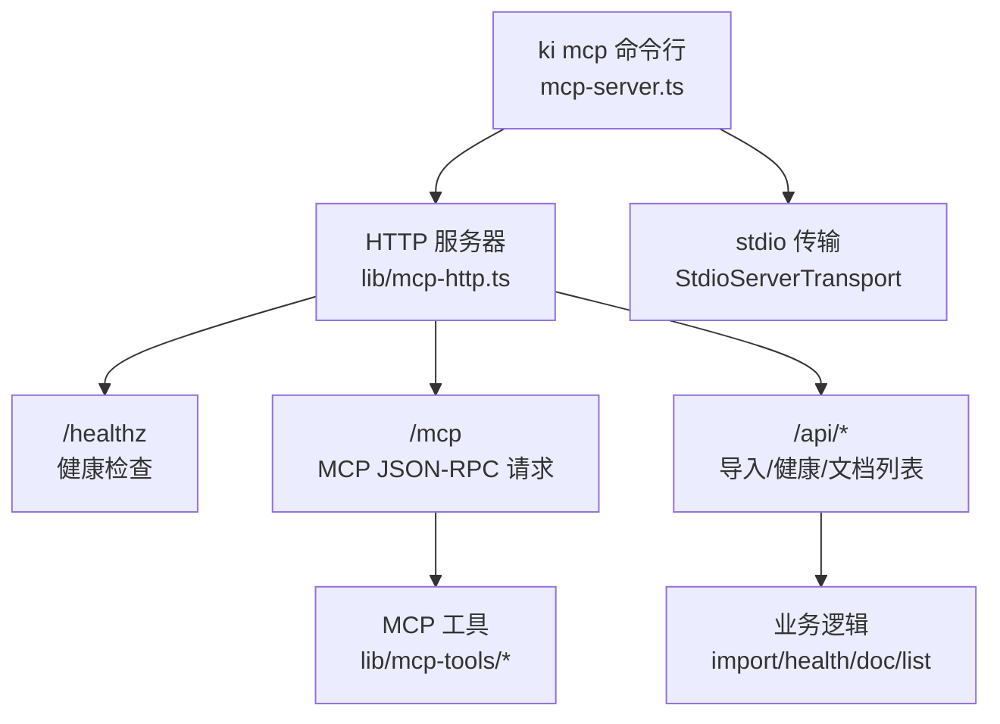
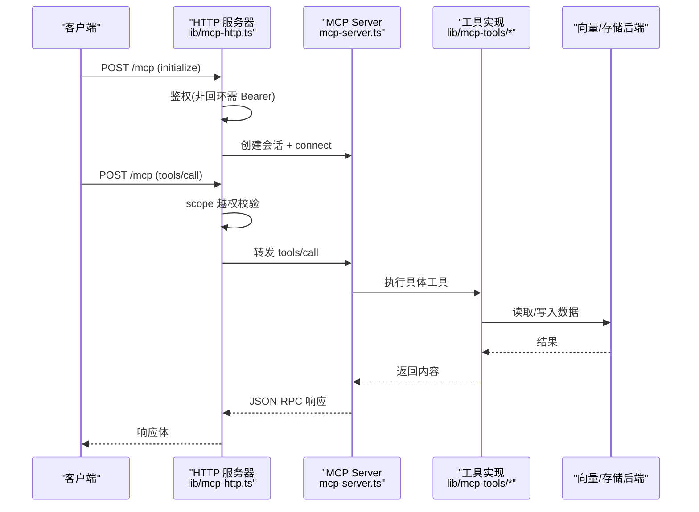
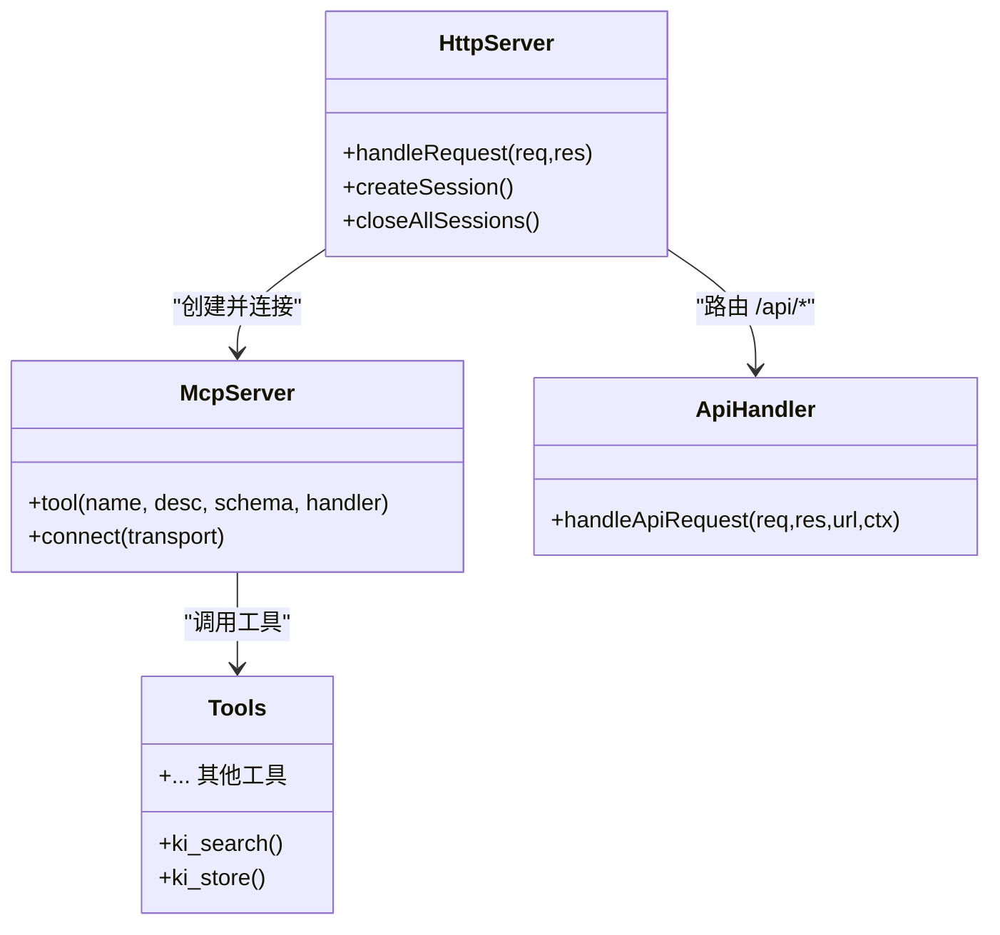

# API 参考文档

<cite>
**本文引用的文件**
- [mcp-server.ts](file://src/mcp-server.ts)
- [mcp-http.ts](file://src/lib/mcp-http.ts)
- [mcp-http-api.ts](file://src/lib/mcp-http-api.ts)
- [search.ts](file://src/lib/mcp-tools/search.ts)
- [store.ts](file://src/lib/mcp-tools/store.ts)
- [config-schema.ts](file://src/lib/config-schema.ts)
- [constants.ts](file://src/lib/constants.ts)
- [mcp-http.md](file://docs/mcp-http.md)
</cite>

## 目录
1. [简介](#简介)
2. [项目结构](#项目结构)
3. [核心组件](#核心组件)
4. [架构总览](#架构总览)
5. [详细接口规范](#详细接口规范)
6. [依赖与关系分析](#依赖与关系分析)
7. [性能与限流](#性能与限流)
8. [错误处理与状态码](#错误处理与状态码)
9. [客户端集成示例](#客户端集成示例)
10. [调试与监控](#调试与监控)
11. [结论](#结论)

## 简介
本参考文档面向使用 kisearch MCP 服务的开发者，系统化说明 HTTP 端点、MCP 工具接口、认证与授权、会话模型、数据模型、错误码、限流策略、版本兼容性以及客户端集成方式。服务支持两种传输模式：
- stdio：默认单客户端单进程，适合 IDE 本地调用。
- HTTP：Streamable HTTP 共享单例，多 IDE/远程接入，统一持锁访问向量库，避免并发冲突。

## 项目结构
- 入口与生命周期管理：mcp-server.ts
- HTTP 传输与会话路由：lib/mcp-http.ts
- /api/* 扩展接口（导入、健康、文档列表）：lib/mcp-http-api.ts
- MCP 工具注册与实现：lib/mcp-tools/*（如 search.ts、store.ts 等）
- 配置校验与常量：lib/config-schema.ts、lib/constants.ts
- 用户文档：docs/mcp-http.md



图表来源
- [mcp-server.ts:492-734](file://src/mcp-server.ts#L492-L734)
- [mcp-http.ts:413-626](file://src/lib/mcp-http.ts#L413-L626)
- [mcp-http-api.ts:216-272](file://src/lib/mcp-http-api.ts#L216-L272)

章节来源
- [mcp-server.ts:492-734](file://src/mcp-server.ts#L492-L734)
- [mcp-http.ts:413-626](file://src/lib/mcp-http.ts#L413-L626)
- [mcp-http-api.ts:216-272](file://src/lib/mcp-http-api.ts#L216-L272)

## 核心组件
- MCP Server 构建与工具注册：buildKiMcpServer 注册全部工具，供 stdio 与 HTTP 复用。
- HTTP 传输与会话：createMcpHttpServer 提供 Streamable HTTP 传输，维护会话 Map、空闲回收、鉴权中间件。
- /api/* 扩展：handleApiRequest 提供健康报告、文档列表、导入上传/运行/状态查询。
- 配置与常量：config-schema.ts 负责字段级校验；constants.ts 定义服务名、默认标签等。

章节来源
- [mcp-server.ts:49-71](file://src/mcp-server.ts#L49-L71)
- [mcp-http.ts:363-642](file://src/lib/mcp-http.ts#L363-L642)
- [mcp-http-api.ts:216-272](file://src/lib/mcp-http-api.ts#L216-L272)
- [config-schema.ts:125-166](file://src/lib/config-schema.ts#L125-L166)
- [constants.ts:12-17](file://src/lib/constants.ts#L12-L17)

## 架构总览
kisearch MCP 服务以“单进程单锁”为核心，通过 HTTP 共享实例解决多 IDE 并发争抢向量库锁的问题。所有工具调用经 MCP SDK 的 JSON-RPC 2.0 协议进行，HTTP 模式下每个 initialize 建立独立会话，但共享模块级 engine。



图表来源
- [mcp-http.ts:476-612](file://src/lib/mcp-http.ts#L476-L612)
- [mcp-server.ts:54-71](file://src/mcp-server.ts#L54-L71)
- [search.ts:6-49](file://src/lib/mcp-tools/search.ts#L6-L49)

## 详细接口规范

### HTTP 端点

- GET /healthz
  - 鉴权：免鉴权
  - 响应：{ ok, name, pid, version?, host?, port?, authFailures? }
  - 用途：服务健康检查、单例探活、运维诊断

- POST /mcp
  - 鉴权：非回环绑定强制 Authorization: Bearer <token>
  - 请求体：JSON-RPC 2.0 消息（支持 batch），首次需 include method: initialize
  - 会话：POST 携带 mcp-session-id 可复用；无 session 且为 initialize 则新建
  - 响应：JSON-RPC 2.0 响应或 SSE 下行（GET /mcp）、关闭会话（DELETE /mcp）

- GET /mcp、DELETE /mcp
  - 鉴权：同 POST
  - 用途：SSE 下行与关闭会话

- GET /api/health
  - 鉴权：与 /mcp 一致（非回环需 Bearer）
  - 响应：{ ok, report }（runHealthCheck 报告，含 zvec 探活，10s 超时）

- GET /api/tags
  - 鉴权：与 /mcp 一致
  - 参数：scope（query，缺省 'default'）
  - 响应：{ ok, tags[], scope }（过滤内部保留 tag）

- GET /api/doc/list
  - 鉴权：与 /mcp 一致
  - 参数：scope（query，缺省 'default'）、q（模糊搜索）、group（精确组）、tag（自定义 tag 过滤）、limit（上限 500）
  - 响应：{ ok, scope, docs[], total, truncated, groups[], tags[] }

- POST /api/import/upload
  - 鉴权：与 /mcp 一致
  - 请求体：{ scope?, files: [{ name, content(base64), size? }] }
  - 限制：仅 .md/.markdown/.mdx，单文件 ≤1MB，请求体 ≤16MB
  - 响应：{ ok, uploadId, scope, files[], total, errors? }

- POST /api/import/run
  - 鉴权：与 /mcp 一致
  - 请求体：{ scope, uploadId, group?, chunkSize?, chunkOverlap?, vector?, tags? }
  - 行为：异步 job，返回 jobId
  - 响应：{ ok, jobId, scope }（202 Accepted）

- GET /api/import/status
  - 鉴权：与 /mcp 一致
  - 参数：jobId
  - 响应：{ ok, job: { id, scope, state, phase, progress, result, error, startedAt, finishedAt } }

章节来源
- [mcp-http.ts:437-521](file://src/lib/mcp-http.ts#L437-L521)
- [mcp-http-api.ts:276-565](file://src/lib/mcp-http-api.ts#L276-L565)
- [mcp-http.md:92-103](file://docs/mcp-http.md#L92-L103)

### MCP 工具接口（JSON-RPC tools/call）

以下工具通过 MCP SDK 注册，参数由 zod schema 描述并生成 JSON Schema。常见字段：
- scope：string，可选，缺省 'default'（strict 模式下必须传且在白名单内）
- 其他参数因工具而异，详见各工具注册处

已实现的工具包括（部分示例）：
- ki_search：语义检索知识库内容
  - 参数：scope?, query, limit?, threshold?, tags?, include_original?
  - 超时：WRITE 超时保护
  - 响应：content[{ type:'text', text: JSON.stringify(result) }]

- ki_store：向量化存储文本
  - 参数：scope?, text, tags?
  - 超时：WRITE 超时保护
  - 响应：content[{ type:'text', text: JSON.stringify(result) }]

更多工具（如 ki_query_group、ki_get_module_info、ki_sync_relation、ki_bulk_sync_relation、ki_delete_relation、ki_manage_index_create、ki_manage_index_list、ki_scope_list、ki_tag_list）在 buildKiMcpServer 中统一注册。

章节来源
- [mcp-server.ts:54-71](file://src/mcp-server.ts#L54-L71)
- [search.ts:6-49](file://src/lib/mcp-tools/search.ts#L6-L49)
- [store.ts:6-44](file://src/lib/mcp-tools/store.ts#L6-L44)

### 认证与授权

- 条件鉴权：按绑定地址决定
  - 回环地址（127.0.0.1/localhost/::1）：免鉴权
  - 非回环地址（0.0.0.0/外网 IP）：强制 Bearer Token
- Token 来源优先级：--token/KI_MCP_TOKEN（全权临时 Token）> 多 Token 存储（~/.ki/mcp-tokens.json）
- scope 越权校验：拦截 tools/call 的 arguments.scope（缺省 'default'），不在授权集合内返回 403
- 枚举工具例外：ki_scope_list、ki_manage_index_list 无 scope 参数的工具跳过此校验，交由工具层按授权集合过滤输出

章节来源
- [mcp-http.ts:476-561](file://src/lib/mcp-http.ts#L476-L561)
- [mcp-http-api.ts:222-258](file://src/lib/mcp-http-api.ts#L222-L258)
- [mcp-http.md:132-145](file://docs/mcp-http.md#L132-L145)

### 会话模型与实时交互

- 会话建立：POST /mcp 发送 initialize，服务端返回 mcp-session-id
- 会话复用：后续请求携带 mcp-session-id 复用同一 transport
- SSE 下行：GET /mcp 用于服务端推送事件（SSE）
- 会话关闭：DELETE /mcp 关闭会话
- 会话上限：默认 256 个并发会话，超出返回 503
- 空闲回收：默认 30 分钟无活动会话自动回收

章节来源
- [mcp-http.ts:563-626](file://src/lib/mcp-http.ts#L563-L626)
- [mcp-http.md:234-242](file://docs/mcp-http.md#L234-L242)

### 数据模型

- 配置模型：config-schema.ts 定义了 dataDir、backupDir、vectorDir、embedding、scopeMode、scopes、mcp.http 等字段的类型与取值约束
- 服务标识：constants.ts 定义 SERVICE_NAME = 'kisearch'，用于 healthz 与单例探活匹配
- 默认标签：DEFAULT_TAGS = ['ki-search','ki-path','ki-relation']

章节来源
- [config-schema.ts:125-166](file://src/lib/config-schema.ts#L125-L166)
- [constants.ts:12-17](file://src/lib/constants.ts#L12-L17)
- [constants.ts:55-60](file://src/lib/constants.ts#L55-L60)

## 依赖与关系分析



图表来源
- [mcp-http.ts:363-642](file://src/lib/mcp-http.ts#L363-L642)
- [mcp-http-api.ts:216-272](file://src/lib/mcp-http-api.ts#L216-L272)
- [mcp-server.ts:54-71](file://src/mcp-server.ts#L54-L71)

章节来源
- [mcp-http.ts:363-642](file://src/lib/mcp-http.ts#L363-L642)
- [mcp-http-api.ts:216-272](file://src/lib/mcp-http-api.ts#L216-L272)
- [mcp-server.ts:54-71](file://src/mcp-server.ts#L54-L71)

## 性能与限流

- 会话上限：默认 256 个并发会话，防止内存耗尽
- 空闲回收：默认 30 分钟无活动会话自动关闭
- 请求体大小：/mcp 与 /api/* 均限制 16MB，防止滥用
- 导入文件大小：单文件 ≤1MB，仅允许 .md/.markdown/.mdx
- 健康检查超时：/api/health 超时 10s，避免阻塞
- 向量库锁：单进程单锁，HTTP 共享实例避免多进程冲突；空闲释放锁机制支持错开共享

章节来源
- [mcp-http.ts:47-57](file://src/lib/mcp-http.ts#L47-L57)
- [mcp-http.ts:167-192](file://src/lib/mcp-http.ts#L167-L192)
- [mcp-http-api.ts:33-42](file://src/lib/mcp-http-api.ts#L33-L42)
- [mcp-http.md:234-242](file://docs/mcp-http.md#L234-L242)

## 错误处理与状态码

- HTTP 状态码
  - 200：正常响应
  - 400：无效请求（如无有效 session ID、非 JSON、缺少必填参数）
  - 401：鉴权失败（WWW-Authenticate: Bearer）
  - 403：scope 越权（Forbidden）
  - 404：路径不存在
  - 405：方法不允许
  - 500：内部错误
  - 503：会话数超限

- JSON-RPC 错误码
  - -32000：Bad Request（无有效 session ID）
  - -32001：Unauthorized（Bearer token 无效或缺失）
  - -32002：Forbidden（scope 越权）
  - -32603：Internal error（内部错误）

- 启动预检失败：存在 ❌ 检查项拒绝启动，仅 ⚠️ 警告继续启动

章节来源
- [mcp-http.ts:498-506](file://src/lib/mcp-http.ts#L498-L506)
- [mcp-http.ts:544-561](file://src/lib/mcp-http.ts#L544-L561)
- [mcp-http.ts:571-582](file://src/lib/mcp-http.ts#L571-L582)
- [mcp-server.ts:660-678](file://src/mcp-server.ts#L660-L678)

## 客户端集成示例

- stdio 模式（IDE 配置）
  ```json
  {
    "mcpServers": {
      "ki": {
        "command": "ki",
        "args": ["mcp"],
        "env": { "SILICONFLOW_API_KEY": "<your-api-key>" }
      }
    }
  }
  ```

- HTTP 模式（URL 型接入）
  ```json
  {
    "mcpServers": {
      "ki": {
        "url": "http://<host>:7423/mcp",
        "headers": { "Authorization": "Bearer <your-token>" }
      }
    }
  }
  ```

- 前端静态页面（--web）
  - 浏览器访问 http://<host>:<port>/
  - 前端通过 MCP SDK 同源调用 /mcp，/api/* 走同源 fetch

章节来源
- [mcp-http.md:24-39](file://docs/mcp-http.md#L24-L39)
- [mcp-http.md:72-90](file://docs/mcp-http.md#L72-L90)

## 调试与监控

- 健康检查
  - curl http://<host>:<port>/healthz → { ok, name, pid, version, host?, port?, authFailures? }
  - ki mcp --status → 只读诊断，输出 lock、健康状态、stdio 实例、托管 token 数量

- 日志与排障
  - 鉴权失败：服务端 stderr 记录失败原因与次数（限流防刷屏）
  - scope 越权：服务端 stderr 记录被拒 scope 与授权范围
  - 端口占用：EADDRINUSE 提示排查占用进程或更换端口
  - 权限不足：EACCES 提示改用高位端口

- 守护进程与重启
  - ki mcp --http --daemon：后台常驻
  - ki mcp restart：一键重启 HTTP 单例（幂等）
  - ki mcp stop：关闭所有实例并清理 lock

章节来源
- [mcp-http.ts:667-705](file://src/lib/mcp-http.ts#L667-L705)
- [mcp-http.md:105-131](file://docs/mcp-http.md#L105-L131)
- [mcp-http.md:170-233](file://docs/mcp-http.md#L170-L233)

## 结论
kisearch MCP 服务通过 HTTP 共享单例模式解决了多 IDE 并发访问向量库的锁冲突问题，提供了标准化的 MCP 工具接口与 /api/* 扩展能力。服务具备完善的鉴权、授权、限流、错误处理与监控能力，支持 stdio 与 HTTP 两种传输模式，便于不同场景下的集成与部署。建议在生产环境前置 TLS 反向代理，结合防火墙与安全组收敛来源 IP，并使用托管 Token 进行最小授权。