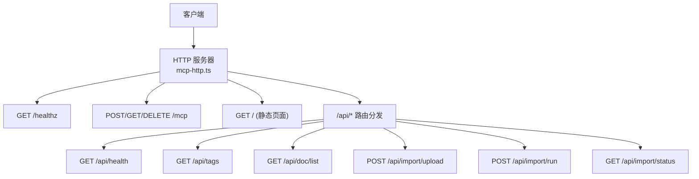
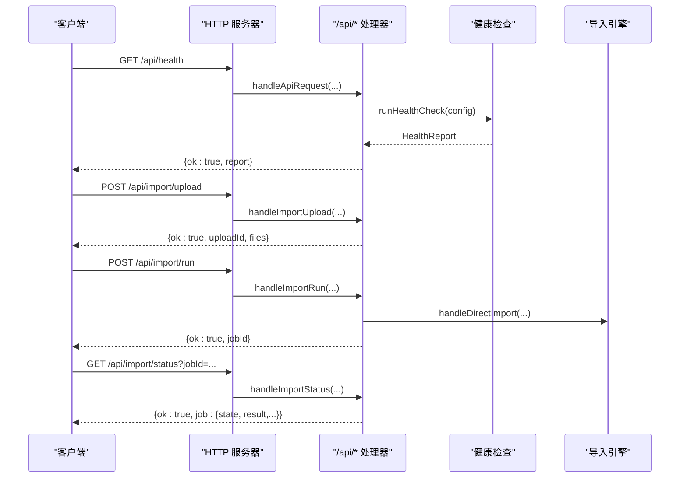

# HTTP 接口

<cite>
**本文引用的文件**
- [mcp-http.ts](file://src/lib/mcp-http.ts)
- [mcp-http-api.ts](file://src/lib/mcp-http-api.ts)
- [health-check.ts](file://src/lib/health-check.ts)
- [import.ts](file://src/lib/import.ts)
- [tag.ts](file://src/tag.ts)
- [mcp-http.md](file://docs/mcp-http.md)
</cite>

## 目录
1. [简介](#简介)
2. [项目结构](#项目-结构)
3. [核心组件](#核心组件)
4. [架构总览](#架构总览)
5. [详细接口说明](#详细接口说明)
6. [认证与权限控制](#认证与权限控制)
7. [限流与容量保护](#限流与容量保护)
8. [错误响应与状态码](#错误响应与状态码)
9. [重试策略](#重试策略)
10. [curl 示例](#curl-示例)
11. [JavaScript 客户端调用示例](#javascript-客户端调用示例)
12. [性能与可观测性](#性能与可观测性)
13. [故障排查指南](#故障排查指南)
14. [结论](#结论)

## 简介
本文件为知识索引服务（kisearch）的 HTTP 接口文档，覆盖健康检查、状态监控、文档列表、标签查询、文件上传与导入等 RESTful API。服务基于 Node.js 内建 http 模块提供 Streamable MCP HTTP 传输，并在 /api/* 下扩展业务接口；同时支持可选的前端静态页面托管。默认监听地址为回环地址，远程暴露需显式配置并启用 Bearer Token 鉴权。

## 项目结构
HTTP 服务由两个核心模块组成：
- mcp-http.ts：HTTP 服务器构建、会话管理、/healthz、/mcp、静态页面服务、鉴权中间件、/api/* 路由转发。
- mcp-http-api.ts：/api/* 具体实现，包括健康报告、标签列表、文档列表、文件上传、导入任务启动与状态轮询。

图表来源
- [mcp-http.ts:413-474](file://src/lib/mcp-http.ts#L413-L474)
- [mcp-http-api.ts:216-272](file://src/lib/mcp-http-api.ts#L216-L272)

章节来源
- [mcp-http.ts:1-120](file://src/lib/mcp-http.ts#L1-L120)
- [mcp-http-api.ts:1-60](file://src/lib/mcp-http-api.ts#L1-L60)

## 核心组件
- HTTP 服务器与会话管理：维护 MCP 会话、空闲回收、最大并发会话限制。
- 鉴权中间件：按绑定地址决定是否启用 Bearer Token 校验，解析授权 scope。
- /api/* 处理器：统一鉴权、scope 越权校验、请求体大小限制、路径穿越防护。
- 健康检查：聚合配置、目录、embedding 连通性、向量集合状态。
- 导入流水线：文件上传落盘、异步导入 job、进度与结果查询。

章节来源
- [mcp-http.ts:363-642](file://src/lib/mcp-http.ts#L363-L642)
- [mcp-http-api.ts:216-272](file://src/lib/mcp-http-api.ts#L216-L272)
- [health-check.ts:150-240](file://src/lib/health-check.ts#L150-L240)
- [import.ts:1-120](file://src/lib/import.ts#L1-L120)

## 架构总览
服务以单进程 HTTP 形式运行，作为向量库唯一持锁者，所有 IDE 或客户端通过 URL 共享同一实例，避免多进程锁冲突。/api/* 与 /mcp 隔离，/api/* 不依赖 MCP 会话生命周期。

图表来源
- [mcp-http.ts:413-474](file://src/lib/mcp-http.ts#L413-L474)
- [mcp-http-api.ts:276-564](file://src/lib/mcp-http-api.ts#L276-L564)

## 详细接口说明

### 通用约定
- 内容类型：application/json
- 请求体大小上限：16MB（读取 JSON 时拒绝超限）
- 成功响应统一包含 ok 字段；失败响应包含 error 与可选 code
- 鉴权：非回环绑定时需要 Authorization: Bearer <token>；回环绑定免鉴权

章节来源
- [mcp-http.ts:166-200](file://src/lib/mcp-http.ts#L166-L200)
- [mcp-http-api.ts:90-128](file://src/lib/mcp-http-api.ts#L90-L128)

### GET /healthz
- 用途：服务探活与健康信息（pid、版本、绑定地址、鉴权失败计数）
- 鉴权：无需鉴权
- 响应体字段：ok、name、pid、version、host、port、authFailures

章节来源
- [mcp-http.ts:437-448](file://src/lib/mcp-http.ts#L437-L448)

### GET /api/health
- 用途：完整健康报告（配置、目录、apiKey、embedding 连通性、维度匹配、zvec collection）
- 鉴权：遵循 /api/* 规则（非回环需 Bearer Token）
- 超时：健康检查整体超时 10s
- 响应体字段：ok、report（items、pass、warn、fail）

章节来源
- [mcp-http-api.ts:276-288](file://src/lib/mcp-http-api.ts#L276-L288)
- [health-check.ts:150-240](file://src/lib/health-check.ts#L150-L240)

### GET /api/tags
- 用途：列出当前 scope 下使用过的自定义标签（过滤内部保留 tag）
- 参数：
  - scope：字符串，缺省为 default（受鉴权 scope 约束）
- 鉴权：对 query.scope 做越权校验
- 响应体字段：ok、tags（数组）、scope

章节来源
- [mcp-http-api.ts:292-304](file://src/lib/mcp-http-api.ts#L292-L304)
- [tag.ts:34-50](file://src/tag.ts#L34-L50)

### GET /api/doc/list
- 用途：获取 Group 路径 + 文档列表，支持模糊搜索、tag 过滤、分页
- 参数：
  - scope：字符串，缺省为 default（受鉴权 scope 约束）
  - q：文件名模糊搜索（小写匹配）
  - group：精确指定 group，返回该组全部文档（不受 limit 截断影响）
  - tag：按 relation.tags 精确匹配（小写）
  - limit：分页上限，默认 500，全局搜索场景放宽到 2000
- 鉴权：对 query.scope 做越权校验
- 缓存：按 scope 缓存 relations-cache 构建结果（mtime 与 size 命中）
- 响应体字段：ok、scope、docs（数组）、total、truncated、groups（[{name,count}]）、tags（去重列表）

章节来源
- [mcp-http-api.ts:308-369](file://src/lib/mcp-http-api.ts#L308-L369)

### POST /api/import/upload
- 用途：上传 Markdown 文件至受控目录，返回 uploadId
- 请求体 Schema：
  - scope：字符串，缺省为 default（受鉴权 scope 约束）
  - files：数组，元素为 { name, content(base64), size }
- 限制：
  - 仅允许 .md/.markdown/.mdx
  - 单文件大小上限：1MB
  - 文件名防路径穿越
- 鉴权：对 body.scope 做越权校验
- 响应体字段：ok、uploadId、scope、files（已保存）、total、errors（部分失败时）

章节来源
- [mcp-http-api.ts:373-450](file://src/lib/mcp-http-api.ts#L373-L450)

### POST /api/import/run
- 用途：触发导入（幂等追加），异步执行，返回 jobId
- 请求体 Schema：
  - scope：必填，受鉴权 scope 约束
  - uploadId：必填，来自 upload 接口
  - group：可选，目标 Group 落点（缺省按推断规则）
  - chunkSize：可选，切分长度
  - chunkOverlap：可选，重叠字符数
  - vector：可选，是否写入向量层
  - tags：可选，逗号分隔的文档级自定义标签
- 安全：校验 sourceDir 在受控目录内
- 鉴权：对 body.scope 做越权校验
- 响应体字段：ok、jobId、scope

章节来源
- [mcp-http-api.ts:454-506](file://src/lib/mcp-http-api.ts#L454-L506)
- [import.ts:97-117](file://src/lib/import.ts#L97-L117)

### GET /api/import/status
- 用途：轮询导入任务状态与结果
- 参数：
  - jobId：必填，来自 import/run
- 响应体字段：ok、job（id、scope、state、phase、progress、result、error、startedAt、finishedAt）

章节来源
- [mcp-http-api.ts:543-564](file://src/lib/mcp-http-api.ts#L543-L564)

## 认证与权限控制
- 条件鉴权：
  - 回环绑定（127.0.0.1/localhost/::1）：免鉴权
  - 非回环绑定（0.0.0.0/外网 IP）：强制 Bearer Token
- Token 来源优先级：
  - --token/KI_MCP_TOKEN（全权临时 Token）
  - 多 Token 存储 ~/.ki/mcp-tokens.json（按明文查找授权 scope）
- 授权 scope 校验：
  - /api/* 接口对 query/body 中的 scope 进行越权校验
  - 枚举工具（无 scope 参数）由工具层按授权集合过滤输出
- 失败响应：
  - 401 Unauthorized：缺少或无效 Bearer Token
  - 403 Forbidden：请求 scope 不在授权范围内

章节来源
- [mcp-http.ts:476-509](file://src/lib/mcp-http.ts#L476-L509)
- [mcp-http-api.ts:222-258](file://src/lib/mcp-http-api.ts#L222-L258)

## 限流与容量保护
- 请求体大小限制：16MB，超限直接拒绝
- 会话上限：默认 256 个并发会话，超出返回 503
- 导入 Job 数量：内存 Map 最多 50 个，超过则淘汰最早完成的
- 空闲会话回收：默认 30 分钟无活动自动关闭
- DNS rebinding 保护：可选 allowedHosts 白名单

章节来源
- [mcp-http.ts:166-192](file://src/lib/mcp-http.ts#L166-L192)
- [mcp-http.ts:571-581](file://src/lib/mcp-http.ts#L571-L581)
- [mcp-http-api.ts:63-66](file://src/lib/mcp-http-api.ts#L63-L66)
- [mcp-http.ts:585-587](file://src/lib/mcp-http.ts#L585-L587)

## 错误响应与状态码
- 200 OK：成功
- 202 Accepted：导入任务已接受（异步）
- 400 Bad Request：请求体非法、参数缺失、JSON 解析失败
- 401 Unauthorized：缺少或无效 Bearer Token
- 403 Forbidden：scope 越权
- 404 Not Found：API 未匹配或 job 不存在
- 503 Service Unavailable：会话数超限
- 500 Internal Error：服务器内部错误

统一错误格式：
- ok: false
- error: 错误描述
- code: 可选的错误码（如 API_ERROR、MCP 相关错误码）

章节来源
- [mcp-http-api.ts:267-271](file://src/lib/mcp-http-api.ts#L267-L271)
- [mcp-http.ts:498-505](file://src/lib/mcp-http.ts#L498-L505)
- [mcp-http.ts:554-559](file://src/lib/mcp-http.ts#L554-L559)

## 重试策略
- 健康检查：embedding 检查使用 8s 超时、重试 1 次，容忍瞬时网络抖动
- 会话空闲回收：后台定时器定期清理，避免残留会话占用资源
- 导入 Job：内存 Map 带 TTL 清理，防止无限增长

章节来源
- [health-check.ts:54-144](file://src/lib/health-check.ts#L54-L144)
- [mcp-http.ts:400-411](file://src/lib/mcp-http.ts#L400-L411)
- [mcp-http-api.ts:67-86](file://src/lib/mcp-http-api.ts#L67-L86)

## curl 示例
- 健康检查
  - curl http://127.0.0.1:7423/healthz
- 健康报告
  - curl http://127.0.0.1:7423/api/health
- 标签列表
  - curl "http://127.0.0.1:7423/api/tags?scope=default"
- 文档列表
  - curl "http://127.0.0.1:7423/api/doc/list?scope=default&q=api&limit=100"
- 文件上传
  - curl -X POST http://127.0.0.1:7423/api/import/upload -H "Content-Type: application/json" -d '{"scope":"default","files":[{"name":"test.md","content":"base64内容"}]}'
- 触发导入
  - curl -X POST http://127.0.0.1:7423/api/import/run -H "Content-Type: application/json" -d '{"scope":"default","uploadId":"xxx","group":"wiki/测试"}'
- 查询导入状态
  - curl "http://127.0.0.1:7423/api/import/status?jobId=yyy"

章节来源
- [mcp-http.ts:437-448](file://src/lib/mcp-http.ts#L437-L448)
- [mcp-http-api.ts:276-564](file://src/lib/mcp-http-api.ts#L276-L564)

## JavaScript 客户端调用示例
- 健康检查
  - fetch('/healthz').then(r => r.json()).then(console.log)
- 健康报告
  - fetch('/api/health').then(r => r.json()).then(console.log)
- 标签列表
  - fetch('/api/tags?scope=default').then(r => r.json()).then(console.log)
- 文档列表
  - fetch('/api/doc/list?scope=default&q=api&limit=100').then(r => r.json()).then(console.log)
- 文件上传
  - fetch('/api/import/upload', { method:'POST', headers:{'Content-Type':'application/json'}, body:JSON.stringify({scope:'default',files:[{name:'test.md',content:'base64'}]}) }).then(r => r.json()).then(console.log)
- 触发导入
  - fetch('/api/import/run', { method:'POST', headers:{'Content-Type':'application/json'}, body:JSON.stringify({scope:'default',uploadId:'xxx',group:'wiki/测试'}) }).then(r => r.json()).then(console.log)
- 查询导入状态
  - fetch('/api/import/status?jobId=yyy').then(r => r.json()).then(console.log)

章节来源
- [mcp-http-api.ts:276-564](file://src/lib/mcp-http-api.ts#L276-L564)

## 性能与可观测性
- 文档列表缓存：按 scope 缓存 relations-cache 构建结果，减少重复 IO
- 健康检查超时：10s 超时，避免阻塞
- 会话空闲回收：30 分钟无活动自动关闭，防止内存泄漏
- 鉴权失败统计：/healthz 返回 authFailures，便于定位客户端配置问题

章节来源
- [mcp-http-api.ts:154-199](file://src/lib/mcp-http-api.ts#L154-L199)
- [mcp-http-api.ts:276-288](file://src/lib/mcp-http-api.ts#L276-L288)
- [mcp-http.ts:400-411](file://src/lib/mcp-http.ts#L400-L411)
- [mcp-http.ts:437-448](file://src/lib/mcp-http.ts#L437-L448)

## 故障排查指南
- 401 Unauthorized：检查 Authorization: Bearer 是否与 ki mcp token list 输出一致
- 403 Forbidden：确认请求 scope 是否在 Token 授权范围内
- 400 Bad Request：检查请求体格式、文件大小、扩展名白名单
- 503 Service Unavailable：会话数超限，等待空闲或关闭闲置连接
- 导入失败：查看 /api/import/status 中 job.error 字段

章节来源
- [mcp-http.ts:498-505](file://src/lib/mcp-http.ts#L498-L505)
- [mcp-http-api.ts:267-271](file://src/lib/mcp-http-api.ts#L267-L271)
- [mcp-http-api.ts:543-564](file://src/lib/mcp-http-api.ts#L543-L564)

## 结论
本服务提供完整的 HTTP 接口，涵盖健康检查、状态监控、文档与标签查询、文件上传与导入等功能。通过条件鉴权、scope 越权校验、请求体大小限制、会话上限保护等机制，确保服务的安全性与稳定性。建议在生产环境中结合反向代理 TLS、防火墙策略与 Token 最小授权原则部署。