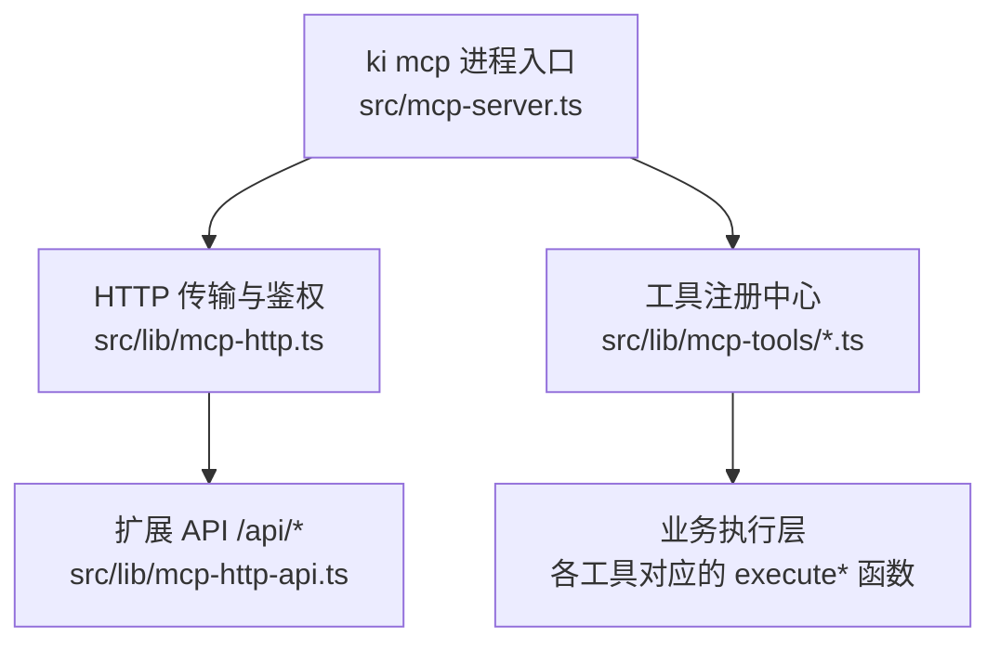
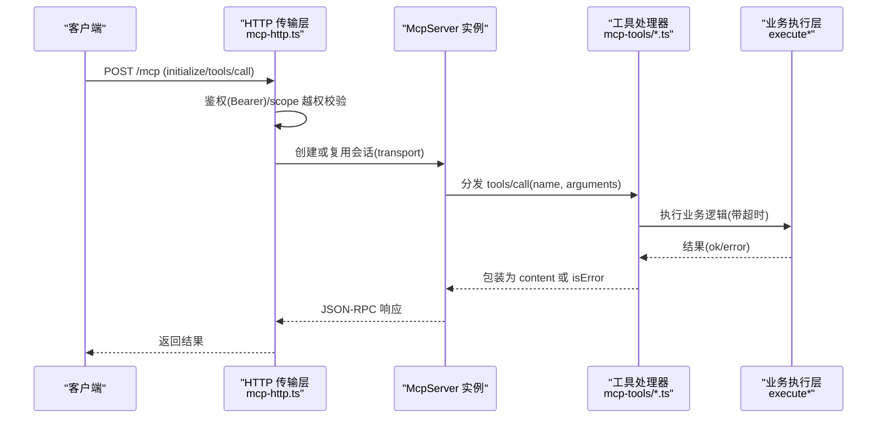
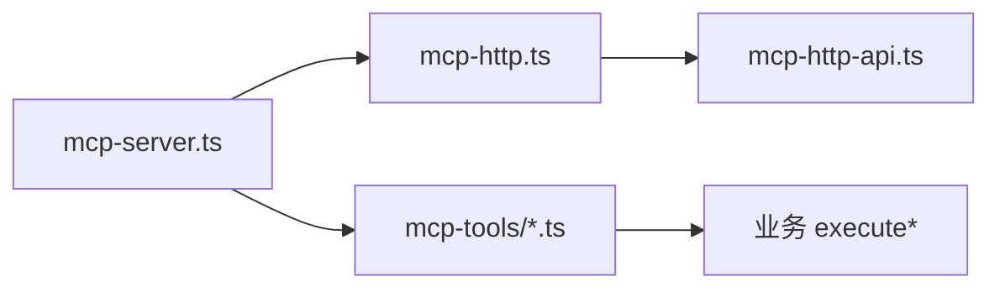

# MCP 工具 API

<cite>
**本文引用的文件**
- [src/mcp-server.ts](file://src/mcp-server.ts)
- [src/lib/mcp-http.ts](file://src/lib/mcp-http.ts)
- [src/lib/mcp-http-api.ts](file://src/lib/mcp-http-api.ts)
- [src/lib/mcp-tools/util.ts](file://src/lib/mcp-tools/util.ts)
- [src/lib/mcp-tools/query-group.ts](file://src/lib/mcp-tools/query-group.ts)
- [src/lib/mcp-tools/search.ts](file://src/lib/mcp-tools/search.ts)
- [src/lib/mcp-tools/sync-relation.ts](file://src/lib/mcp-tools/sync-relation.ts)
- [src/lib/mcp-tools/bulk-sync-relation.ts](file://src/lib/mcp-tools/bulk-sync-relation.ts)
- [src/lib/mcp-tools/delete-relation.ts](file://src/lib/mcp-tools/delete-relation.ts)
- [src/lib/mcp-tools/store.ts](file://src/lib/mcp-tools/store.ts)
- [src/lib/mcp-tools/bulk-store.ts](file://src/lib/mcp-tools/bulk-store.ts)
- [src/lib/mcp-tools/manage-index.ts](file://src/lib/mcp-tools/manage-index.ts)
- [src/lib/mcp-tools/scope-list.ts](file://src/lib/mcp-tools/scope-list.ts)
- [src/lib/mcp-tools/tag-list.ts](file://src/lib/mcp-tools/tag-list.ts)
- [src/lib/mcp-tools/get-module-info.ts](file://src/lib/mcp-tools/get-module-info.ts)
</cite>

## 目录
1. [简介](#简介)
2. [项目结构](#项目结构)
3. [核心组件](#核心组件)
4. [架构总览](#架构总览)
5. [详细组件分析](#详细组件分析)
6. [依赖关系分析](#依赖关系分析)
7. [性能与超时配置](#性能与超时配置)
8. [故障排查指南](#故障排查指南)
9. [结论](#结论)
10. [附录：客户端集成与最佳实践](#附录客户端集成与最佳实践)

## 简介
本文件系统化记录 ki-search 提供的 MCP（Model Context Protocol）工具 API，覆盖全部 11 个工具的接口规范、参数定义、返回值格式、错误处理、超时策略、鉴权与会话管理，以及 HTTP/stdio 两种传输模式的连接建立过程。文档同时提供客户端集成建议与最佳实践，帮助开发者在 IDE 或 Agent 中稳定调用这些工具。

## 项目结构
MCP 服务由“进程入口 + HTTP 传输层 + 工具注册层”组成：
- 进程入口负责启动 stdio 或 HTTP 模式、预检健康、单例守护、Token 管理等。
- HTTP 传输层实现 StreamableHTTPServerTransport、会话管理、鉴权、静态页面与扩展 /api/* 路由。
- 工具注册层将 11 个工具以 server.tool 形式挂载到 McpServer，统一通过 withTimeout 控制超时。

**图示来源**
- [src/mcp-server.ts:54-70](file://src/mcp-server.ts#L54-L70)
- [src/lib/mcp-http.ts:363-641](file://src/lib/mcp-http.ts#L363-L641)
- [src/lib/mcp-http-api.ts:216-272](file://src/lib/mcp-http-api.ts#L216-L272)

**章节来源**
- [src/mcp-server.ts:49-70](file://src/mcp-server.ts#L49-L70)
- [src/lib/mcp-http.ts:1-15](file://src/lib/mcp-http.ts#L1-L15)

## 核心组件
- 工具注册器：每个工具一个文件，使用 zod 校验参数，withTimeout 包裹执行，返回 content 文本或 isError 标记。
- 传输层：支持 stdio 与 HTTP；HTTP 模式下按会话创建独立 McpServer，共享向量引擎单例。
- 鉴权与会话：非回环绑定强制 Bearer Token；每请求可携带 mcp-session-id；空闲会话自动回收。
- 扩展 API：/api/health、/api/tags、/api/doc/list、/api/import/* 等，复用同一鉴权与 scope 校验逻辑。

**章节来源**
- [src/lib/mcp-http.ts:476-521](file://src/lib/mcp-http.ts#L476-L521)
- [src/lib/mcp-http.ts:523-612](file://src/lib/mcp-http.ts#L523-L612)
- [src/lib/mcp-http-api.ts:216-272](file://src/lib/mcp-http-api.ts#L216-L272)

## 架构总览
下图展示一次 tools/call 的完整调用链：从 HTTP 请求进入，经鉴权与 scope 越权检查，创建/复用会话，交由具体工具处理器执行，最后返回 JSON-RPC 响应。

**图示来源**
- [src/lib/mcp-http.ts:476-612](file://src/lib/mcp-http.ts#L476-L612)
- [src/lib/mcp-tools/util.ts:24-31](file://src/lib/mcp-tools/util.ts#L24-L31)

## 详细组件分析

### 通用约定
- 参数校验：所有工具使用 zod 定义 schema，未传可选参数时采用默认值。
- 超时保护：统一通过 withTimeout 限制执行时间，避免长驻进程被阻塞。
- 返回值：成功返回 content 文本（JSON 字符串），失败返回 { isError: true, content }。
- scope 语义：多数工具支持 scope 参数，缺省为 default；strict 模式下必须显式传入且需白名单。

**章节来源**
- [src/lib/mcp-tools/util.ts:24-42](file://src/lib/mcp-tools/util.ts#L24-L42)

### 工具清单与接口规范

#### 1) ki_query_group
- 功能：查询 Group 树 + Relations + 词云，支持向量语义兜底。
- 参数
  - scope: string，可选，默认 "default"
  - groups: string，可选，逗号分隔 Group 路径（支持模糊匹配）
  - group: string，可选，groups 的单数别名
  - hot_count: number，可选，默认 5
  - depth: number，可选，默认 4，范围 1-10
  - mode: string，可选，默认 "hot"，支持逗号分隔枚举：hot|warm|cold|emerging|full
  - auto_fallback: boolean，可选，默认 true
- 返回：content 文本（结构化输出）；异常时 isError 为 true。
- 超时：READ 超时。

**章节来源**
- [src/lib/mcp-tools/query-group.ts:6-53](file://src/lib/mcp-tools/query-group.ts#L6-L53)
- [src/lib/mcp-tools/util.ts:34-42](file://src/lib/mcp-tools/util.ts#L34-L42)

#### 2) ki_search
- 功能：语义检索知识库内容。
- 参数
  - scope: string，可选，默认 "default"
  - query: string，必填
  - limit: number，可选，默认 10
  - threshold: number，可选，范围 0-1
  - tags: string，可选，逗号分隔多标签（OR 组合）
  - include_original: boolean，可选，默认 false
- 返回：content 文本（JSON 字符串）；异常时 isError 为 true。
- 超时：WRITE 超时。

**章节来源**
- [src/lib/mcp-tools/search.ts:6-49](file://src/lib/mcp-tools/search.ts#L6-L49)
- [src/lib/mcp-tools/util.ts:34-42](file://src/lib/mcp-tools/util.ts#L34-L42)

#### 3) ki_import（通过 HTTP 扩展 API 实现）
- 说明：MCP 工具层未直接暴露 ki_import，但 HTTP 层提供导入能力，供前端/Agent 使用。
- 端点
  - POST /api/import/upload：上传文件（base64 内容），受控目录落盘，返回 uploadId。
  - POST /api/import/run：触发导入（幂等追加），返回 jobId。
  - GET /api/import/status?jobId=...：轮询导入进度/结果。
- 鉴权：与 /mcp 一致，非回环需 Bearer Token；body.scope 参与越权校验（缺省 'default'）。
- 安全：仅允许 .md/.markdown/.mdx，单文件上限 1MB，路径穿越防护。
- 超时：服务端对 health 有超时保护；导入为异步 job，状态通过 status 查询。

**章节来源**
- [src/lib/mcp-http-api.ts:371-565](file://src/lib/mcp-http-api.ts#L371-L565)
- [src/lib/mcp-http.ts:450-464](file://src/lib/mcp-http.ts#L450-L464)

#### 4) ki_scan_kb（通过 CLI/HTTP 扩展能力间接支持）
- 说明：仓库提供 scan-kb 子命令与导入链路；MCP 工具层未直接暴露同名工具。可通过 HTTP /api/import/* 完成导入流程。
- 参考：README 中关于首次导入与增量更新的说明。

**章节来源**
- [README.md:296-321](file://README.md#L296-L321)

#### 5) ki_sync_relation
- 功能：写入/更新 Relation + 本地 KB（自动补建 Group 树）。
- 参数
  - scope: string，可选，默认 "default"
  - group: string，必填
  - relation: string，必填
  - module_info: string，必填
  - vector: boolean，可选，默认 true
  - tags: string，可选，逗号分隔多个自定义标签
- 返回：content 文本（JSON 字符串）；异常时 isError 为 true。
- 超时：WRITE 超时。

**章节来源**
- [src/lib/mcp-tools/sync-relation.ts:6-43](file://src/lib/mcp-tools/sync-relation.ts#L6-L43)
- [src/lib/mcp-tools/util.ts:34-42](file://src/lib/mcp-tools/util.ts#L34-L42)

#### 6) ki_bulk_sync_relation
- 功能：批量写入/更新 Relation + 本地 KB + 向量层（一次 embedding + 一次向量写入）。
- 参数
  - scope: string，可选，默认 "default"
  - items: array，必填，每项包含 group/relation/module_info/tags；长度 1-50
  - vector: boolean，可选，默认 true
- 返回：content 文本（JSON 字符串）；异常时 isError 为 true。
- 超时：BULK 超时。

**章节来源**
- [src/lib/mcp-tools/bulk-sync-relation.ts:6-42](file://src/lib/mcp-tools/bulk-sync-relation.ts#L6-L42)
- [src/lib/mcp-tools/util.ts:34-42](file://src/lib/mcp-tools/util.ts#L34-L42)

#### 7) ki_delete_relation
- 功能：删除 Relation 及其关联数据（relations-cache + 本地KB + wiki + 向量）。
- 参数
  - scope: string，可选，默认 "default"
  - group: string，必填（支持模糊匹配）
  - relation: string，必填（精确匹配）
- 返回：content 文本（JSON 字符串）；异常时 isError 为 true。
- 超时：WRITE 超时。

**章节来源**
- [src/lib/mcp-tools/delete-relation.ts:6-37](file://src/lib/mcp-tools/delete-relation.ts#L6-L37)
- [src/lib/mcp-tools/util.ts:34-42](file://src/lib/mcp-tools/util.ts#L34-L42)

#### 8) ki_store
- 功能：存储文本到向量索引。
- 参数
  - scope: string，可选，默认 "default"
  - text: string，必填
  - tags: string，可选，默认 "ki-search"
- 返回：content 文本（JSON 字符串）；异常时 isError 为 true。
- 超时：WRITE 超时。

**章节来源**
- [src/lib/mcp-tools/store.ts:6-43](file://src/lib/mcp-tools/store.ts#L6-L43)
- [src/lib/mcp-tools/util.ts:34-42](file://src/lib/mcp-tools/util.ts#L34-L42)

#### 9) ki_bulk_store
- 功能：批量存储文本到向量索引。
- 参数
  - scope: string，可选，默认 "default"
  - input: string，必填（批量数据 JSON 文件路径）
- 返回：content 文本（JSON 字符串）；异常时 isError 为 true。
- 超时：BULK 超时。

**章节来源**
- [src/lib/mcp-tools/bulk-store.ts:6-41](file://src/lib/mcp-tools/bulk-store.ts#L6-L41)
- [src/lib/mcp-tools/util.ts:34-42](file://src/lib/mcp-tools/util.ts#L34-L42)

#### 10) ki_manage_index_*（create / list / delete）
- 功能：Group 树管理（创建节点、列出 scope、删除空节点）。
- 参数
  - create：scope/name/parent
  - list：无参（按授权过滤）
  - delete：scope/name/parent
- 返回：content 文本（JSON 字符串）；异常时 isError 为 true。
- 超时：WRITE 超时（list 走 READ 超时）。
- 注意：delete 仅限空节点；非空节点引导使用 ki_delete_relation 或 CLI 级联删除。

**章节来源**
- [src/lib/mcp-tools/manage-index.ts:13-112](file://src/lib/mcp-tools/manage-index.ts#L13-L112)
- [src/lib/mcp-tools/util.ts:34-42](file://src/lib/mcp-tools/util.ts#L34-L42)

#### 11) ki_scope_list / ki_tag_list / ki_get_module_info
- ki_scope_list：列出所有 scope（KB 目录层 + 向量语义层并集），按授权过滤。
- ki_tag_list：列出指定 scope 下用过的 tag（只读）。
- ki_get_module_info：读取指定 Group 下某个 Relation 的本地 KB Markdown 内容。
- 超时：READ 超时。

**章节来源**
- [src/lib/mcp-tools/scope-list.ts:11-41](file://src/lib/mcp-tools/scope-list.ts#L11-L41)
- [src/lib/mcp-tools/tag-list.ts:6-37](file://src/lib/mcp-tools/tag-list.ts#L6-L37)
- [src/lib/mcp-tools/get-module-info.ts:6-37](file://src/lib/mcp-tools/get-module-info.ts#L6-L37)
- [src/lib/mcp-tools/util.ts:34-42](file://src/lib/mcp-tools/util.ts#L34-L42)

## 依赖关系分析
- 工具层依赖业务执行层（execute*），并通过 withTimeout 统一注入超时。
- HTTP 层负责鉴权、会话、跨域 Host 头保护、静态页面与 /api/* 路由。
- 进程入口负责启动守卫、预检、单例守护、Token 管理与信号处理。

**图示来源**
- [src/mcp-server.ts:54-70](file://src/mcp-server.ts#L54-L70)
- [src/lib/mcp-http.ts:363-641](file://src/lib/mcp-http.ts#L363-L641)
- [src/lib/mcp-http-api.ts:216-272](file://src/lib/mcp-http-api.ts#L216-L272)

**章节来源**
- [src/mcp-server.ts:492-733](file://src/mcp-server.ts#L492-L733)
- [src/lib/mcp-http.ts:413-641](file://src/lib/mcp-http.ts#L413-L641)

## 性能与超时配置
- 工具超时预设
  - READ：30 秒（只读/轻量查询）
  - WRITE：60 秒（单条写入/语义检索）
  - BULK：300 秒（批量写入）
- 会话空闲回收：默认 30 分钟，定时清扫。
- 最大并发会话：默认 256。
- 向量库锁释放：空闲后自动 closeEngine，避免持锁阻塞其他实例。

**章节来源**
- [src/lib/mcp-tools/util.ts:34-42](file://src/lib/mcp-tools/util.ts#L34-L42)
- [src/lib/mcp-http.ts:47-57](file://src/lib/mcp-http.ts#L47-L57)
- [src/mcp-server.ts:36-38](file://src/mcp-server.ts#L36-L38)

## 故障排查指南
- 鉴权失败（401）
  - 现象：非回环绑定下未携带或携带无效 Bearer Token。
  - 排查：核对 Authorization: Bearer 与 ki mcp token list 输出完全一致；查看服务端 stderr 日志中的鉴权失败计数与原因。
- 越权拦截（403）
  - 现象：tools/call 的 arguments.scope 不在 Token 授权范围内。
  - 排查：确认 Token 授权 scope 是否包含目标 scope；必要时使用 all 或调整 scope 列表。
- 会话错误（400）
  - 现象：缺少有效 session ID 或请求体非法。
  - 排查：确保 initialize 成功后再调用 tools/call，并传递正确的 mcp-session-id。
- 端口占用（EADDRINUSE）
  - 现象：监听失败。
  - 排查：更换端口或清理残留实例；使用 ki mcp --status 查看运行实例。
- 导入失败
  - 现象：/api/import/upload 或 /api/import/run 报错。
  - 排查：检查文件格式、大小、路径穿越防护；通过 /api/import/status 轮询 job 状态。

**章节来源**
- [src/lib/mcp-http.ts:476-521](file://src/lib/mcp-http.ts#L476-L521)
- [src/lib/mcp-http.ts:523-612](file://src/lib/mcp-http.ts#L523-L612)
- [src/lib/mcp-http-api.ts:371-565](file://src/lib/mcp-http-api.ts#L371-L565)
- [src/lib/mcp-http.ts:644-665](file://src/lib/mcp-http.ts#L644-L665)

## 结论
本 MCP 服务通过统一的工具注册与传输层，提供了稳定的知识索引管理能力。借助严格的参数校验、超时保护、鉴权与会话管理，可在多 IDE 共享单例场景下安全高效地工作。推荐优先使用 HTTP 模式配合 URL 接入，以获得更好的稳定性与可观测性。

## 附录：客户端集成与最佳实践
- 传输选择
  - stdio：适合单 IDE 直连；注意与 HTTP 单例并存会争抢向量库锁，应迁移至 URL 型接入。
  - HTTP：推荐用于多 IDE 共享；默认回环免鉴权，远程需配置 Bearer Token。
- 连接建立
  - 先发送 initialize 建立会话，获取 mcp-session-id。
  - 后续 tools/call 携带该 session ID。
- 鉴权
  - 非回环绑定必须提供 Authorization: Bearer <token>。
  - 可使用 ki mcp token generate/update/list/delete 管理 Token。
- 超时与重试
  - 遵循工具超时预设；遇到 TOOL_TIMEOUT 可稍后重试。
  - 批量操作优先使用 bulk 工具以减少开销。
- 示例（概念流程）
  - 初始化：POST /mcp，method=initialize
  - 查询：POST /mcp，method=tools/call，name=ki_search，arguments={query, limit, ...}
  - 导入：POST /api/import/upload → POST /api/import/run → GET /api/import/status?jobId=...

[本节为概念性指导，不直接分析具体代码文件]