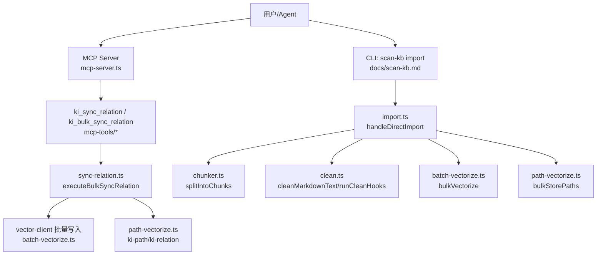
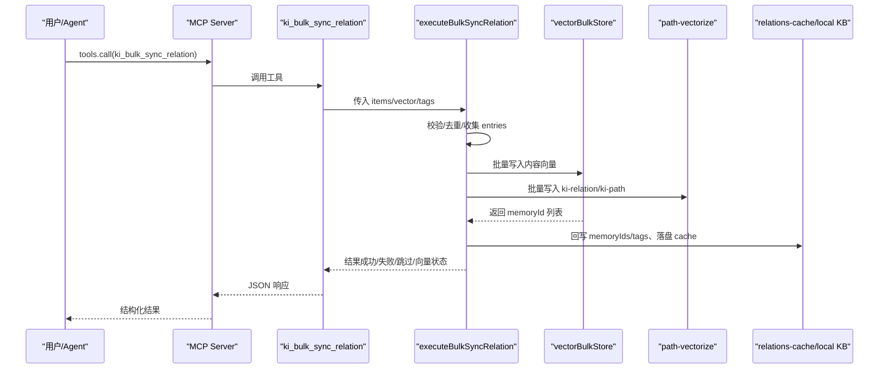
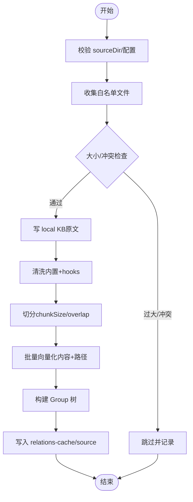
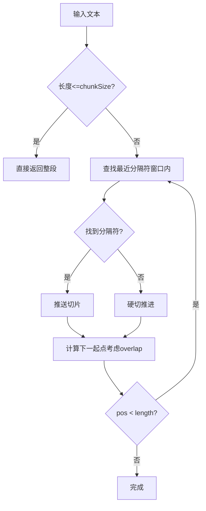
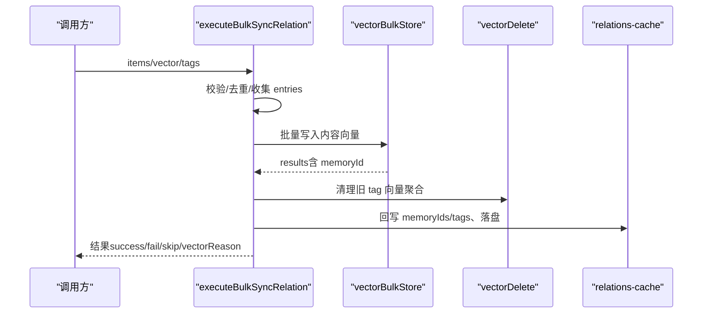
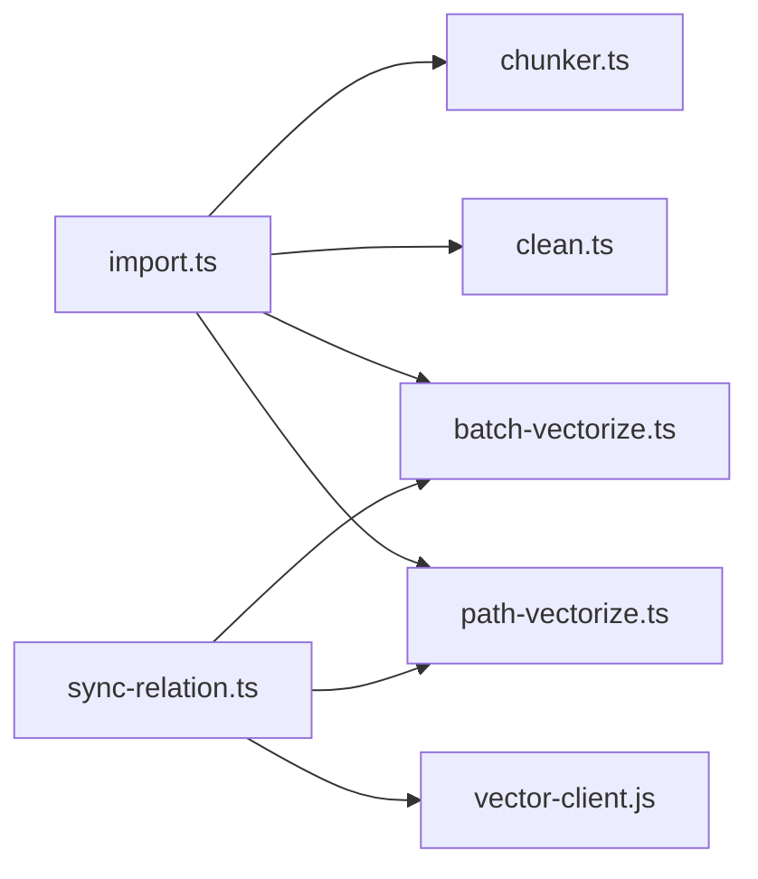

# 导入类工具

<cite>
**本文引用的文件**
- [src/lib/import.ts](file://src/lib/import.ts)
- [src/lib/chunker.ts](file://src/lib/chunker.ts)
- [src/lib/clean.ts](file://src/lib/clean.ts)
- [src/lib/batch-vectorize.ts](file://src/lib/batch-vectorize.ts)
- [src/lib/path-vectorize.ts](file://src/lib/path-vectorize.ts)
- [src/sync-relation.ts](file://src/sync-relation.ts)
- [src/mcp-server.ts](file://src/mcp-server.ts)
- [src/lib/mcp-tools/sync-relation.ts](file://src/lib/mcp-tools/sync-relation.ts)
- [src/lib/mcp-tools/bulk-sync-relation.ts](file://src/lib/mcp-tools/bulk-sync-relation.ts)
- [docs/scan-kb.md](file://docs/scan-kb.md)
- [README.md](file://README.md)
</cite>

## 目录
1. [简介](#简介)
2. [项目结构](#项目结构)
3. [核心组件](#核心组件)
4. [架构总览](#架构总览)
5. [详细组件分析](#详细组件分析)
6. [依赖关系分析](#依赖关系分析)
7. [性能考虑](#性能考虑)
8. [故障排查指南](#故障排查指南)
9. [结论](#结论)
10. [附录](#附录)

## 简介
本文件面向“导入类 MCP 工具”的完整技术文档，聚焦 ki_import（外部知识库原文直导）能力。内容覆盖：
- 接口规范与参数说明（文件路径、批量选项、增量更新、冲突处理）
- 支持的导入格式与解析规则（Markdown、JSON、Wiki 等）
- 内容切分算法与清洗机制
- 批量导入、增量同步、断点续传的使用示例
- 进度反馈、错误恢复、数据验证机制
- 大规模导入的性能优化建议与排障指南

## 项目结构
导入链路围绕以下模块协作：
- 入口与流程编排：import.ts（直导主流程）、sync-relation.ts（批量/单条写入）
- 文本切分：chunker.ts（固定长度+段落边界优先）
- 文本清洗：clean.ts（内置规则 + 外部 hook）
- 向量化：batch-vectorize.ts（bulkVectorize）、path-vectorize.ts（ki-path/ki-relation）
- MCP 暴露：mcp-server.ts 注册工具；sync-relation.ts / bulk-sync-relation.ts 作为 MCP 工具封装
- 文档与使用：docs/scan-kb.md、README.md

图表来源
- [src/mcp-server.ts:54-70](file://src/mcp-server.ts#L54-L70)
- [src/lib/mcp-tools/sync-relation.ts:6-43](file://src/lib/mcp-tools/sync-relation.ts#L6-L43)
- [src/lib/mcp-tools/bulk-sync-relation.ts:6-42](file://src/lib/mcp-tools/bulk-sync-relation.ts#L6-L42)
- [src/sync-relation.ts:407-787](file://src/sync-relation.ts#L407-L787)
- [src/lib/import.ts:214-564](file://src/lib/import.ts#L214-L564)
- [src/lib/chunker.ts:57-92](file://src/lib/chunker.ts#L57-L92)
- [src/lib/clean.ts:48-130](file://src/lib/clean.ts#L48-L130)
- [src/lib/batch-vectorize.ts:132-182](file://src/lib/batch-vectorize.ts#L132-L182)
- [src/lib/path-vectorize.ts:75-116](file://src/lib/path-vectorize.ts#L75-L116)

章节来源
- [src/mcp-server.ts:54-70](file://src/mcp-server.ts#L54-L70)
- [docs/scan-kb.md:13-67](file://docs/scan-kb.md#L13-L67)
- [README.md:296-321](file://README.md#L296-L321)

## 核心组件
- 直导入口 handleDirectImport：负责扫描源目录/文件、校验格式与大小、写 local KB、清洗、切分、构建向量条目、批量向量化、Group 树构建、relations-cache 写入、source 记录、中断保护与锁管理。
- 切分器 splitIntoChunks：按 chunkSize 递归切分，优先在段落边界（\n\n、\n、句号、分号），支持 overlap。
- 清洗 cleanMarkdownText 与 runCleanHooks：内置规则（BOM/frontmatter/HTML注释/mermaid/代码块/路径剥离/空行折叠）+ 外部 hook（stdin→stdout，超时保护）。
- 批量向量化 bulkVectorize：分批提交（默认 200 条/批），共享一次 engine，返回 path→memoryId 映射与 errors。
- 路径向量 bulkStorePaths：为每个 chunk 写 ki-relation，为每个 group 写 ki-path，供路径检索兜底。
- 批量同步 executeBulkSyncRelation：MCP/CLI 共享实现，支持批量写入 Relation + 本地 KB + 向量层，含去重、旧向量清理、wiki 写回。

章节来源
- [src/lib/import.ts:214-564](file://src/lib/import.ts#L214-L564)
- [src/lib/chunker.ts:57-92](file://src/lib/chunker.ts#L57-L92)
- [src/lib/clean.ts:48-130](file://src/lib/clean.ts#L48-L130)
- [src/lib/batch-vectorize.ts:132-182](file://src/lib/batch-vectorize.ts#L132-L182)
- [src/lib/path-vectorize.ts:75-116](file://src/lib/path-vectorize.ts#L75-L116)
- [src/sync-relation.ts:407-787](file://src/sync-relation.ts#L407-L787)

## 架构总览
导入类工具提供两条主要通道：
- CLI 直导：scan-kb import → handleDirectImport → 清洗/切分 → 批量向量化 → 元数据落盘
- MCP 写入：ki_sync_relation / ki_bulk_sync_relation → executeBulkSyncRelation → 批量向量化 → 元数据落盘

图表来源
- [src/lib/mcp-tools/bulk-sync-relation.ts:6-42](file://src/lib/mcp-tools/bulk-sync-relation.ts#L6-L42)
- [src/sync-relation.ts:407-787](file://src/sync-relation.ts#L407-L787)
- [src/lib/batch-vectorize.ts:132-182](file://src/lib/batch-vectorize.ts#L132-L182)
- [src/lib/path-vectorize.ts:75-116](file://src/lib/path-vectorize.ts#L75-L116)

## 详细组件分析

### 直导入口 handleDirectImport（CLI 外部 Wiki 导入）
- 输入参数
  - scope：项目隔离标识
  - sourceDir：外部 Wiki 根目录或单个 Markdown 文件绝对路径
  - group：目标 Group 落点（缺省时目录导入按顶层子目录名各建根节点，单文档导入用 scope name）
  - chunkSize/chunkOverlap：切分参数（默认 1000/150）
  - maxFileSizeBytes：单文件大小上限（默认 1MB，可配置）
  - vector：是否写入向量层（默认 true；false 仅写 KB 层）
  - cleanEnabled/cleanRules：清洗开关与规则覆盖
  - tags：文档级自定义标签（逗号分隔）
- 处理流程
  - 校验 sourceDir（文件或目录），读取 scope 导入配置（extensions、maxFileSize）
  - 收集白名单格式文件（默认 .md），非白名单跳过并汇总提示
  - 前置检查：大小超限、relation 冲突（同名不同 sourcePath 跳过；同名同 sourcePath 幂等覆盖）
  - 写 local KB（文件原文），执行清洗（内置规则 + 外部 hooks），切分为 chunks
  - 构建向量化条目（ki-search 内容向量 + ki-relation/ki-path 辅助向量），批量向量化
  - 构建 Group 树，写入 relations-cache（文件级 relation 挂 memoryIds 多值），记录 source（含切分参数）
  - 中断保护：捕获 SIGINT/SIGTERM 写中断标记，并发导入锁（import.lock）
- 输出
  - ImportResult：包含 stats（total/vectorized/errors/skipped/vector）、errors、groups、source

图表来源
- [src/lib/import.ts:214-564](file://src/lib/import.ts#L214-L564)
- [docs/scan-kb.md:13-67](file://docs/scan-kb.md#L13-L67)

章节来源
- [src/lib/import.ts:214-564](file://src/lib/import.ts#L214-L564)
- [docs/scan-kb.md:13-67](file://docs/scan-kb.md#L13-L67)

### 内容切分算法（chunker.ts）
- 触发条件：基于字符长度阈值（非段落数），份数 = ceil(字符数 / chunkSize)
- 切分点偏好：\n\n > \n > 。 > ； > 硬切
- overlap：相邻 chunk 尾部重叠字符，保护跨 chunk 上下文
- 内存中执行，不落盘；单文件 chunk 上限 MAX_CHUNKS_PER_FILE=500

图表来源
- [src/lib/chunker.ts:31-92](file://src/lib/chunker.ts#L31-L92)

章节来源
- [src/lib/chunker.ts:57-92](file://src/lib/chunker.ts#L57-L92)

### 清洗机制（clean.ts）
- 内置规则：BOM 剥离、frontmatter 剥离、HTML 注释、mermaid 块、代码块剥离（短示例保留）、路径剥离（file://、行号引用、裸路径）、空 inline code、孤儿标题清理、空行折叠
- 外部 hook：顺序执行 sh -c 命令，stdin→stdout，超时保护（默认 10s），失败跳过并记录 failedHooks
- 异常兜底：normalize('NFC') 异常降级返回原文

章节来源
- [src/lib/clean.ts:48-130](file://src/lib/clean.ts#L48-L130)
- [src/lib/clean.ts:177-227](file://src/lib/clean.ts#L177-L227)

### 批量向量化（batch-vectorize.ts）
- bulkVectorize：分批提交（默认 200 条/批），共享一次 engine，返回 ok Map（path→memoryId）与 errors
- 兼容 batchVectorize（串行逐条）与 vectorizeOne（单条）
- deleteMemory：按 docId 删除（用于 modify/delete 场景）

章节来源
- [src/lib/batch-vectorize.ts:77-95](file://src/lib/batch-vectorize.ts#L77-L95)
- [src/lib/batch-vectorize.ts:132-182](file://src/lib/batch-vectorize.ts#L132-L182)

### 路径向量索引（path-vectorize.ts）
- 为每个 chunk 写 ki-relation（relation 名称），为每个 group 写 ki-path（空格分隔层级）
- bulkStorePaths：按 scope 分组后批量写入，失败不阻塞主流程

章节来源
- [src/lib/path-vectorize.ts:51-66](file://src/lib/path-vectorize.ts#L51-L66)
- [src/lib/path-vectorize.ts:75-116](file://src/lib/path-vectorize.ts#L75-L116)

### MCP 工具封装（ki_sync_relation / ki_bulk_sync_relation）
- ki_sync_relation：单条写入 Relation + 本地 KB（自动补建 Group 树），可选向量层
- ki_bulk_sync_relation：批量写入（单次最多 50 条），一次 embedding + 一次向量写入，性能更优
- 超时保护：withTimeout 包装，避免工具长时间阻塞

章节来源
- [src/lib/mcp-tools/sync-relation.ts:6-43](file://src/lib/mcp-tools/sync-relation.ts#L6-L43)
- [src/lib/mcp-tools/bulk-sync-relation.ts:6-42](file://src/lib/mcp-tools/bulk-sync-relation.ts#L6-L42)

### 批量同步核心（executeBulkSyncRelation）
- 阶段 1：循环 syncSingleRelation 改 cache + 收集 entries（ki-relation、ki-search、自定义 tag）
- 阶段 1.5：同批重复 (group, relation) 去重，剔除前一条的向量 entries
- 阶段 2：批量向量写入（vectorBulkStore），拆分结果并回写 memoryId/memoryIds
- 阶段 3：清理旧 tag 向量（聚合一次 vectorDelete）
- 阶段 4：一次 writeJson 落盘 cache
- 阶段 5：各自 wiki 写回（容错）

图表来源
- [src/sync-relation.ts:407-787](file://src/sync-relation.ts#L407-L787)

章节来源
- [src/sync-relation.ts:407-787](file://src/sync-relation.ts#L407-L787)

## 依赖关系分析
- import.ts 依赖：
  - chunker.ts（切分）
  - clean.ts（清洗）
  - batch-vectorize.ts（向量化）
  - path-vectorize.ts（路径向量）
  - store.js/scope.js（读写索引与 KB）
  - interrupt.js（中断与锁）
- sync-relation.ts 依赖：
  - vector-client.js（向量存储/删除）
  - path-vectorize.ts（路径向量）
  - wiki-sync.js（可选写回 Wiki）
  - config.js/scope.js（配置与范围）

图表来源
- [src/lib/import.ts:1-49](file://src/lib/import.ts#L1-L49)
- [src/sync-relation.ts:16-39](file://src/sync-relation.ts#L16-L39)

章节来源
- [src/lib/import.ts:1-49](file://src/lib/import.ts#L1-L49)
- [src/sync-relation.ts:16-39](file://src/sync-relation.ts#L16-L39)

## 性能考虑
- 批量向量化分批提交（200 条/批），减少一次性提交开销，提升可观测性
- 路径向量按 scope 分组批量写入，消除逐条 embed 开销
- 旧 tag 向量清理聚合一次 vectorDelete，避免多次串行删除稀释性能
- 非向量化模式（--no-vector）跳过向量写入，仅写 KB 层，适合离线归档或后续重建
- 大文件限制：默认 1MB（可配置），单文件 chunk 上限 500，防止向量爆炸
- 并发导入锁（import.lock）避免同 scope 并发导致竞争

[本节为通用指导，无需特定文件来源]

## 故障排查指南
- 导入中断
  - 现象：SIGINT/SIGTERM 中断后残留 lock 或未完成
  - 处理：等待 probe 清理残留 lock；重新导入或执行 restore --rebuild-vector 恢复
  - 参考：import.ts 中断标记与锁清理逻辑
- 格式不支持
  - 现象：未发现 .md 文件或文件格式不在白名单
  - 处理：调整 extensions 配置或使用支持的格式（默认 .md）
- 文件过大或 chunk 超限
  - 现象：跳过文件并告警
  - 处理：手动切分文件或增大 chunk-size
- 清洗 hook 失败
  - 现象：hook 超时或退出码非零，文件被跳过并回滚 local KB
  - 处理：修复 hook 脚本或关闭相关规则
- 向量服务不可用
  - 现象：向量写入失败，KB 层仍成功
  - 处理：检查向量服务可用性；后续可用 restore --rebuild-vector 重建
- 冲突处理
  - 现象：同名不同 sourcePath 的文件被跳过
  - 处理：确认是否为预期行为；如需覆盖，确保 sourcePath 一致

章节来源
- [src/lib/import.ts:240-264](file://src/lib/import.ts#L240-L264)
- [src/lib/import.ts:310-383](file://src/lib/import.ts#L310-L383)
- [src/lib/clean.ts:177-227](file://src/lib/clean.ts#L177-L227)
- [src/sync-relation.ts:607-744](file://src/sync-relation.ts#L607-L744)

## 结论
导入类工具提供了从外部 Wiki 到本地知识索引的完整流水线，具备：
- 幂等追加语义（重复执行即增量）
- 灵活的清洗与切分策略
- 批量向量化与路径向量索引
- 中断保护与并发控制
- MCP 与 CLI 双通道接入

推荐在生产环境结合配置项（extensions、maxFileSize、clean.hooks）与监控日志进行调优，并在必要时使用 restore --rebuild-vector 进行向量重建。

[本节为总结，无需特定文件来源]

## 附录

### 接口规范与使用示例

#### CLI 直导（scan-kb import）
- 首次导入
  - 命令：ki scan-kb import --scope my-project --source /path/to/wiki --group Wiki
  - 说明：格式白名单校验 → 自动切分 → 批量向量化 → local KB 原文写入 → relations-cache 写入
- 增量更新
  - 命令：ki scan-kb import --scope my-project --source /path/to/wiki --group Wiki
  - 说明：幂等追加（同 sourcePath 覆盖更新；同名不同 sourcePath 跳过；新文件导入）

章节来源
- [docs/scan-kb.md:13-67](file://docs/scan-kb.md#L13-L67)
- [README.md:296-321](file://README.md#L296-L321)

#### MCP 批量写入（ki_bulk_sync_relation）
- 用途：批量写入 Relation + 本地 KB + 向量层（一次 embedding + 一次向量写入）
- 参数：
  - scope：项目隔离标识（可选，默认 default）
  - items：数组，每项包含 group、relation、module_info、tags（可选）
  - vector：是否写入向量层（默认 true）
- 限制：单次最多 50 条，超出请分批调用

章节来源
- [src/lib/mcp-tools/bulk-sync-relation.ts:6-42](file://src/lib/mcp-tools/bulk-sync-relation.ts#L6-L42)
- [src/sync-relation.ts:407-787](file://src/sync-relation.ts#L407-L787)

#### 断点续传与恢复
- 中断标记：导入过程中捕获 SIGINT/SIGTERM 写中断标记（processedFiles/totalFiles/signal）
- 恢复方式：
  - 重新执行 import（幂等追加）
  - 或执行 restore --rebuild-vector 重建向量层
- 并发锁：import.lock 存在时拒绝新的导入，残留由 probe 清理

章节来源
- [src/lib/import.ts:240-264](file://src/lib/import.ts#L240-L264)
- [docs/scan-kb.md:65-67](file://docs/scan-kb.md#L65-L67)