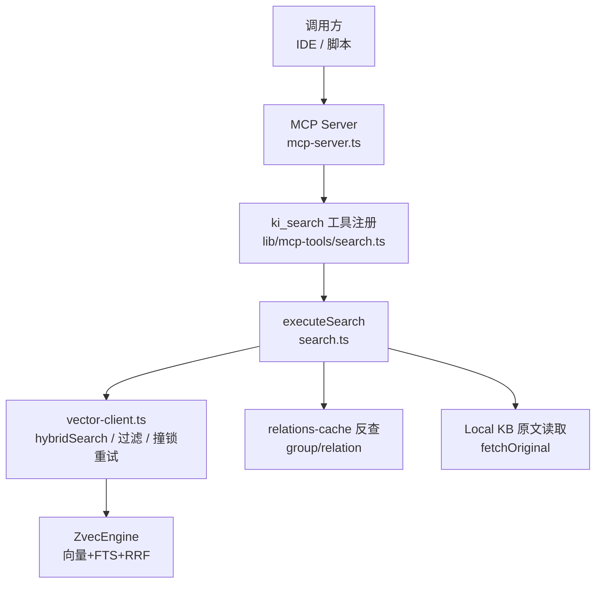
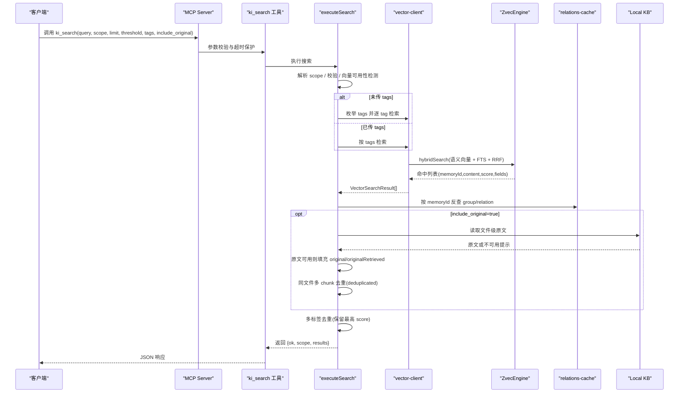
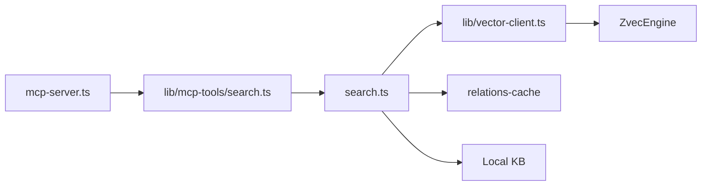

# 搜索类工具

<cite>
**本文引用的文件**   
- [src/search.ts](file://src/search.ts)
- [src/lib/mcp-tools/search.ts](file://src/lib/mcp-tools/search.ts)
- [src/mcp-server.ts](file://src/mcp-server.ts)
- [src/lib/vector-client.ts](file://src/lib/vector-client.ts)
- [skills/ki-search/SKILL.md](file://skills/ki-search/SKILL.md)
- [README.md](file://README.md)
- [docs/cli.md](file://docs/cli.md)
- [docs/mcp-http.md](file://docs/mcp-http.md)
</cite>

## 目录
1. [简介](#简介)
2. [项目结构](#项目结构)
3. [核心组件](#核心组件)
4. [架构总览](#架构总览)
5. [详细组件分析](#详细组件分析)
6. [依赖关系分析](#依赖关系分析)
7. [性能考量](#性能考量)
8. [故障排查指南](#故障排查指南)
9. [结论](#结论)
10. [附录](#附录)

## 简介
本文件面向 ki_search 搜索类 MCP 工具的完整接口与实现说明，覆盖查询参数、混合检索算法（语义向量 + 全文 BM25 + RRF 融合）、结果排序机制、原文定位能力、不同搜索场景调用示例、评分与去重策略、以及性能优化与常见问题。目标是帮助使用者准确理解并高效使用 ki_search 进行知识库检索。

## 项目结构
围绕搜索能力的核心代码分布在以下位置：
- MCP 工具注册与参数校验：src/lib/mcp-tools/search.ts
- 搜索执行主流程（含原文召回、多标签优先级、去重）：src/search.ts
- 向量客户端封装（hybridSearch、过滤、撞锁重试、空闲释放锁）：src/lib/vector-client.ts
- MCP 服务启动与工具装配：src/mcp-server.ts
- 行为规则与最佳实践：skills/ki-search/SKILL.md
- CLI 参考与阈值建议：docs/cli.md
- HTTP 共享单例与安全鉴权：docs/mcp-http.md
- 概念与特性概览：README.md

图表来源
- [src/mcp-server.ts:54-70](file://src/mcp-server.ts#L54-L70)
- [src/lib/mcp-tools/search.ts:6-49](file://src/lib/mcp-tools/search.ts#L6-L49)
- [src/search.ts:70-199](file://src/search.ts#L70-L199)
- [src/lib/vector-client.ts:498-533](file://src/lib/vector-client.ts#L498-L533)

章节来源
- [src/mcp-server.ts:54-70](file://src/mcp-server.ts#L54-L70)
- [src/lib/mcp-tools/search.ts:6-49](file://src/lib/mcp-tools/search.ts#L6-L49)
- [src/search.ts:70-199](file://src/search.ts#L70-L199)
- [src/lib/vector-client.ts:498-533](file://src/lib/vector-client.ts#L498-L533)

## 核心组件
- ki_search 工具定义与参数校验：通过 zod 声明 scope、query、limit、threshold、tags、include_original，并以超时保护调用 executeSearch。
- 搜索执行器 executeSearch：负责 scope 解析与校验、向量可用性检测、按 tag 分查或指定 tag 检索、relations-cache 反查 group/relation、可选原文召回、多标签去重与同文件多 chunk 去重、最终返回统一结果。
- 向量客户端 vector-client：封装 ZvecEngine，提供 hybridSearch（语义向量 + FTS 关键词 + RRF 融合），支持 scope/tag 过滤、撞锁重试、空闲释放锁等。
- MCP 服务：注册所有工具并提供 stdio/HTTP 两种传输模式；HTTP 模式支持鉴权与会话管理。

章节来源
- [src/lib/mcp-tools/search.ts:6-49](file://src/lib/mcp-tools/search.ts#L6-L49)
- [src/search.ts:70-199](file://src/search.ts#L70-L199)
- [src/lib/vector-client.ts:498-533](file://src/lib/vector-client.ts#L498-L533)
- [src/mcp-server.ts:54-70](file://src/mcp-server.ts#L54-L70)

## 架构总览
ki_search 的端到端流程如下：
- 客户端通过 MCP 协议调用 ki_search，传入 query、scope、limit、threshold、tags、include_original。
- 工具层将请求转发给 executeSearch。
- executeSearch 先做 scope 解析与向量可用性检查，再根据是否显式传入 tags 决定“全量分 tag 检索”或“指定 tag 检索”。
- 底层通过 vector-client.hybridSearch 执行混合检索（语义向量 + 全文 BM25 + RRF 融合）。
- 对命中结果，利用 relations-cache 反查 group 与 relation，用于原文定位。
- 若 include_original 为 true，则尝试从 Local KB 读取文件级原文；失败时降级返回向量 content 并附带提示。
- 对同一 (group, relation) 的多条命中进行去重（保留最高 score），并对同一文件多 chunk 命中进行 deduplicated 标记。
- 最终返回结构化结果，包含 memoryId、content、score、tag、group、relation、originalRetrieved、original、originalHint、deduplicated 等字段。

图表来源
- [src/lib/mcp-tools/search.ts:6-49](file://src/lib/mcp-tools/search.ts#L6-L49)
- [src/search.ts:70-199](file://src/search.ts#L70-L199)
- [src/lib/vector-client.ts:498-533](file://src/lib/vector-client.ts#L498-L533)

## 详细组件分析

### ki_search 工具接口规范
- 名称：ki_search
- 描述：语义检索知识库内容
- 参数
  - scope: string，可选，默认 default。项目隔离标识；strict 模式下必须显式且须白名单内。
  - query: string，必填。自然语言查询文本。
  - limit: number，可选，默认 10。返回条数上限。
  - threshold: number，可选，范围 0~1。相似度阈值，低于该值的命中将被过滤。
  - tags: string，可选。过滤标签；不传则搜索全部；多个用逗号分隔，OR 组合。
  - include_original: boolean，可选，默认 false。是否返回 local KB 文件级原文。
- 返回值：JSON 字符串，结构为 { ok: true/false; scope?: string; results?: SearchHit[]; error?: string }。

章节来源
- [src/lib/mcp-tools/search.ts:6-49](file://src/lib/mcp-tools/search.ts#L6-L49)

### 搜索执行器 executeSearch
- 职责
  - 解析与校验 scope，确保向量服务可用。
  - 根据是否显式传入 tags 选择检索策略：
    - 未传 tags：枚举当前 scope 下所有 tag，分别检索并按 TAG_PRIORITY 排序（ki-search > ki-relation > ki-path），合并结果。
    - 已传 tags：直接按 tags 过滤检索。
  - 通过 relations-cache 反查 group/relation，用于原文定位。
  - 可选原文召回：当 include_original 为 true 时，尝试从 Local KB 读取文件级原文；失败则降级返回向量 content 并附带提示。
  - 去重策略：
    - 多标签去重：同一 (group, relation) 多条命中保留 score 最高的一条。
    - 同文件多 chunk 去重：同一文件多次命中仅首次携带 original，其余标记 deduplicated。
  - 返回统一结果集。

章节来源
- [src/search.ts:70-199](file://src/search.ts#L70-L199)

### 向量客户端与混合检索
- hybridSearch：同时使用语义向量与 FTS（BM25）两路召回，并通过 RRF（Reciprocal Rank Fusion）融合排序。
- 过滤：按 scope 必等，tags 非空时以 OR 组合；大小写忽略（写入与查询均小写化）。
- 撞锁重试：检测到 locked 时等待对方释放后重试，最多 3 次，间隔 2s。
- 空闲释放锁：常驻 MCP 启用空闲释放锁，避免多实例争抢向量库锁。
- 结果映射：memoryId、content、score、tag、group。

章节来源
- [src/lib/vector-client.ts:498-533](file://src/lib/vector-client.ts#L498-L533)
- [src/lib/vector-client.ts:106-124](file://src/lib/vector-client.ts#L106-L124)
- [src/lib/vector-client.ts:173-201](file://src/lib/vector-client.ts#L173-L201)

### 搜索结果数据结构
- SearchHit（扩展自 VectorSearchResult）
  - memoryId: string，文档 ID（sha256(text+scope) 截 32）。
  - content: string，向量文档内容。
  - score: number，越大越相关（基座已归一化）。
  - tag?: string，所属标签。
  - group?: string，Group 路径（relations-cache 反查）。
  - relation?: string，文件级 relation（方案 D：basename 去扩展名）。
  - originalRetrieved?: boolean，原文是否成功获取。
  - original?: string，local KB 文件级原文（获取失败时缺失）。
  - originalHint?: string，原文不可用提示（精简，与引导去重）。
  - deduplicated?: boolean，同一文件多 chunk 命中去重标记。

章节来源
- [src/search.ts:33-47](file://src/search.ts#L33-L47)
- [src/lib/vector-client.ts:38-45](file://src/lib/vector-client.ts#L38-L45)

### 混合检索算法与排序机制
- 两路召回：
  - 语义向量：dense 字段，基于嵌入模型生成向量，计算余弦相似度。
  - 全文检索：content 字段，jieba 分词，BM25 匹配。
- 融合排序：RRF（Reciprocal Rank Fusion），rankConstant=60，综合两路排名得到最终排序。
- 阈值过滤：threshold 控制最终返回的最低分数（RRF 融合分），建议区间 0.02~0.03。

章节来源
- [src/lib/vector-client.ts:498-533](file://src/lib/vector-client.ts#L498-L533)
- [docs/cli.md:527-540](file://docs/cli.md#L527-L540)

### 原文定位与召回
- 通过 relations-cache 反查 memoryId 对应的 group 与 relation。
- 若 include_original 为 true，则从 Local KB 读取文件级原文；失败时降级返回向量 content 并附带提示。
- 同一文件多 chunk 命中时，仅首次携带 original，其余标记 deduplicated，避免重复输出。

章节来源
- [src/search.ts:123-194](file://src/search.ts#L123-L194)

### 不同搜索场景调用示例
- 精确匹配（已知 Group/Relation）
  - 使用 tags 限定 ki-relation，配合较高 threshold（如 0.03）提升精度。
  - 示例：ki_search(scope, query="模块A配置", tags="ki-relation", limit=5, threshold=0.03)
- 模糊搜索（自然语言）
  - 使用默认 tags（搜索全部），limit=4，threshold=0.02，优先语义检索。
  - 示例：ki_search(scope, query="如何配置告警阈值", limit=4, threshold=0.02)
- 范围查询（时间/版本/状态）
  - 在 query 中明确范围词（如“v2.3 之后”、“生产环境”），结合 tags 缩小范围。
  - 示例：ki_search(scope, query="v2.3 之后部署变更", tags="ki-search", limit=6, threshold=0.02)
- 多标签 OR 过滤
  - 使用逗号分隔多个 tags，如 "ki-search,ki-path"。
  - 示例：ki_search(scope, query="API 网关路由", tags="ki-search,ki-path", limit=8, threshold=0.02)

章节来源
- [skills/ki-search/SKILL.md:72-106](file://skills/ki-search/SKILL.md#L72-L106)
- [docs/cli.md:527-540](file://docs/cli.md#L527-L540)

## 依赖关系分析
- MCP 服务依赖工具注册：mcp-server.ts 注册 search 工具。
- 工具层依赖搜索执行器：lib/mcp-tools/search.ts 调用 search.ts 的 executeSearch。
- 搜索执行器依赖向量客户端：search.ts 调用 vector-client.ts 的 vectorSearch/hybridSearch。
- 向量客户端依赖 ZvecEngine：提供 hybridSearch、撞锁重试、空闲释放锁。
- 搜索执行器依赖 relations-cache：用于 group/relation 反查与原文定位。
- 搜索执行器依赖 Local KB：用于原文召回。

图表来源
- [src/mcp-server.ts:54-70](file://src/mcp-server.ts#L54-L70)
- [src/lib/mcp-tools/search.ts:6-49](file://src/lib/mcp-tools/search.ts#L6-L49)
- [src/search.ts:70-199](file://src/search.ts#L70-L199)
- [src/lib/vector-client.ts:498-533](file://src/lib/vector-client.ts#L498-L533)

章节来源
- [src/mcp-server.ts:54-70](file://src/mcp-server.ts#L54-L70)
- [src/lib/mcp-tools/search.ts:6-49](file://src/lib/mcp-tools/search.ts#L6-L49)
- [src/search.ts:70-199](file://src/search.ts#L70-L199)
- [src/lib/vector-client.ts:498-533](file://src/lib/vector-client.ts#L498-L533)

## 性能考量
- 混合检索效率：hybridSearch 一次调用完成语义向量与 FTS 召回，并通过 RRF 融合排序，减少多次往返开销。
- 撞锁重试与空闲释放锁：多实例共享向量库时，自动重试与空闲释放锁降低冲突影响，提高吞吐。
- 阈值过滤：合理设置 threshold（0.02~0.03）可过滤低分边缘结果，提升结果质量与后续处理效率。
- 多标签分查：未传 tags 时按 tag 分查并限制每 tag 的 limit，避免单次查询过大。
- 原文召回开关：默认关闭 include_original，仅在需要时开启，减少 I/O 压力。

章节来源
- [src/lib/vector-client.ts:106-124](file://src/lib/vector-client.ts#L106-L124)
- [src/lib/vector-client.ts:173-201](file://src/lib/vector-client.ts#L173-L201)
- [docs/cli.md:527-540](file://docs/cli.md#L527-L540)
- [src/search.ts:94-121](file://src/search.ts#L94-L121)

## 故障排查指南
- 向量服务不可用
  - 现象：ensureVectorAvailable 返回 available=false，reason 可能为 LOCKED/CORRUPTED/PROBE_ERROR。
  - 处理：查看 lock 文件与进程状态；必要时重建向量库（restore --rebuild-vector）。
- 撞锁等待
  - 现象：probeWithRetry 日志显示被其他进程占用，等待重试。
  - 处理：确认是否有其他 ki mcp/server 实例运行；等待释放或迁移到 HTTP 单例。
- 原文不可用
  - 现象：originalRetrieved=false，originalHint 提示本地 KB 缺失或读取异常。
  - 处理：执行 sync-relation 或 restore --rebuild-vector 恢复；或接受降级返回向量 content。
- 结果过少或为空
  - 现象：threshold 过高导致过滤掉所有结果。
  - 处理：降低 threshold 至 0.02~0.03；或使用 tags 精确过滤。
- 多标签重复命中
  - 现象：同一 (group, relation) 多条命中。
  - 处理：系统已自动去重保留最高 score；如需进一步控制，调整 tags 或 limit。

章节来源
- [src/lib/vector-client.ts:440-494](file://src/lib/vector-client.ts#L440-L494)
- [src/search.ts:135-194](file://src/search.ts#L135-L194)
- [docs/mcp-http.md:105-143](file://docs/mcp-http.md#L105-L143)

## 结论
ki_search 提供了统一的搜索入口，结合语义向量、全文 BM25 与 RRF 融合排序，兼顾召回广度与排序精度。通过 scope/tags 过滤、原文定位与去重策略，满足不同搜索场景需求。配合撞锁重试与空闲释放锁，保障多实例共享下的稳定性与性能。建议根据数据规模与查询意图合理设置 threshold、limit 与 tags，以获得最佳效果。

## 附录
- 行为规则与最佳实践：优先使用 ${scope}-memory 进行语义检索，未命中再回退到索引原位与宏观兜底。
- HTTP 共享单例：推荐在多 IDE 环境下使用 HTTP 模式，避免锁冲突；非回环绑定需 Token 鉴权。
- CLI 参考：threshold 建议区间 0.02~0.03，结合 tags 精确过滤。

章节来源
- [skills/ki-search/SKILL.md:72-106](file://skills/ki-search/SKILL.md#L72-L106)
- [docs/mcp-http.md:105-143](file://docs/mcp-http.md#L105-L143)
- [docs/cli.md:527-540](file://docs/cli.md#L527-L540)