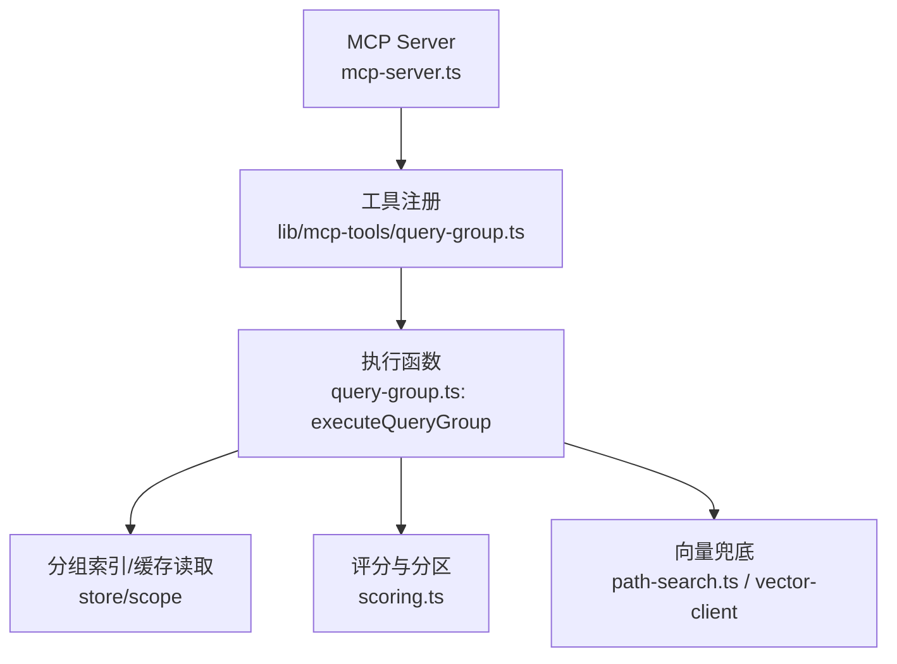
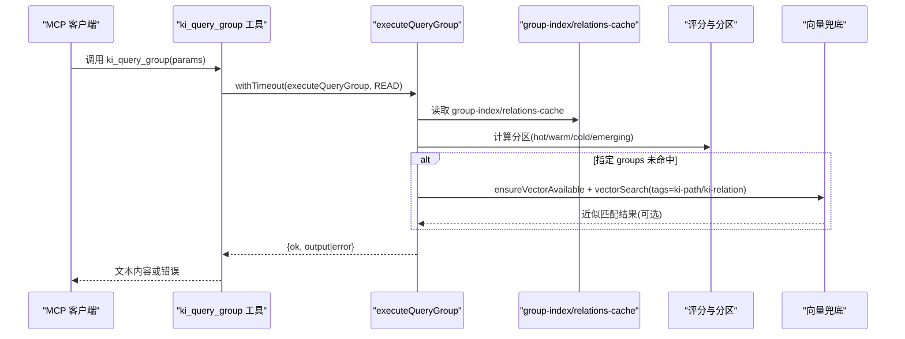
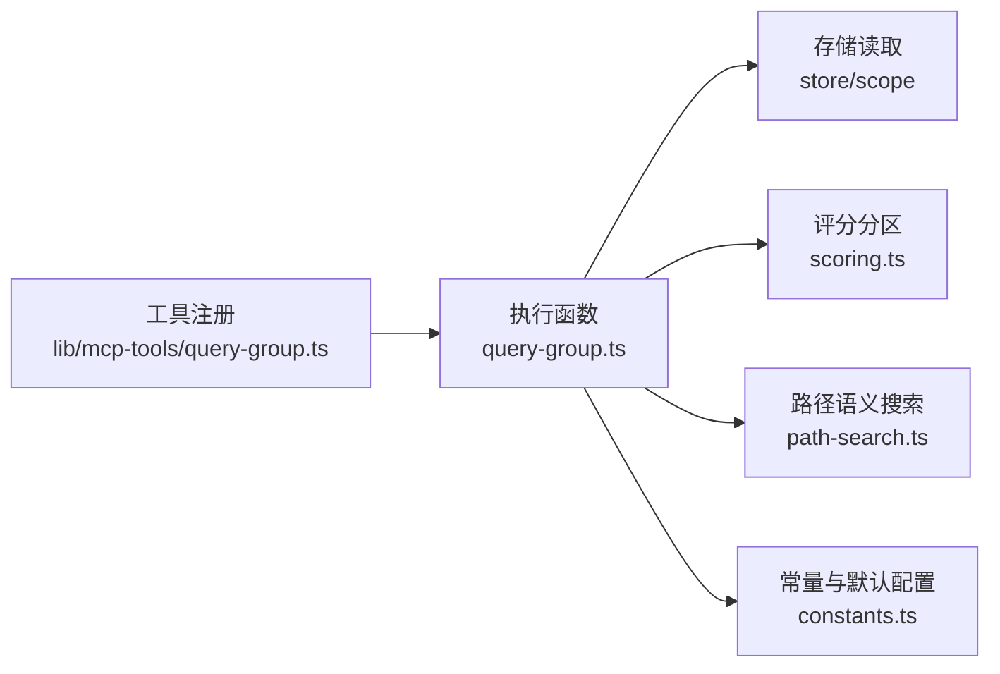

# 查询类工具

<cite>
**本文引用的文件**
- [src/query-group.ts](file://src/query-group.ts)
- [src/lib/mcp-tools/query-group.ts](file://src/lib/mcp-tools/query-group.ts)
- [src/mcp-server.ts](file://src/mcp-server.ts)
- [src/lib/constants.ts](file://src/lib/constants.ts)
- [src/lib/path-search.ts](file://src/lib/path-search.ts)
- [src/lib/scoring.ts](file://src/lib/scoring.ts)
- [test/query-group.test.ts](file://test/query-group.test.ts)
- [.requirements/vector-fallback/design/DESIGN.md](file://.requirements/vector-fallback/design/DESIGN.md)
</cite>

## 目录
1. [简介](#简介)
2. [项目结构](#项目结构)
3. [核心组件](#核心组件)
4. [架构总览](#架构总览)
5. [详细组件分析](#详细组件分析)
6. [依赖关系分析](#依赖关系分析)
7. [性能考量](#性能考量)
8. [故障排查指南](#故障排查指南)
9. [结论](#结论)
10. [附录：调用示例与返回格式](#附录调用示例与返回格式)

## 简介
本文档面向 MCP 客户端与使用者，系统化说明查询类工具 ki_query_group 的接口规范、参数校验、默认值、Group 树查询工作原理、支持模式（hot|warm|cold|emerging|full）、向量语义兜底机制、错误处理与超时配置，并给出最佳实践与性能优化建议。

## 项目结构
ki_query_group 由三层组成：
- MCP 工具注册层：定义工具名、参数 Schema、超时与错误包装。
- 业务执行层：解析参数、加载 Group 索引与 Relations 缓存、计算分区与输出。
- 数据与检索层：评分与分区、路径/关系向量语义兜底、向量引擎可用性检查。

图表来源
- [src/mcp-server.ts:54-70](file://src/mcp-server.ts#L54-L70)
- [src/lib/mcp-tools/query-group.ts:6-53](file://src/lib/mcp-tools/query-group.ts#L6-L53)
- [src/query-group.ts:596-746](file://src/query-group.ts#L596-L746)
- [src/lib/scoring.ts:81-192](file://src/lib/scoring.ts#L81-L192)
- [src/lib/path-search.ts:1-87](file://src/lib/path-search.ts#L1-L87)

章节来源
- [src/mcp-server.ts:54-70](file://src/mcp-server.ts#L54-L70)
- [src/lib/mcp-tools/query-group.ts:6-53](file://src/lib/mcp-tools/query-group.ts#L6-L53)
- [src/query-group.ts:596-746](file://src/query-group.ts#L596-L746)

## 核心组件
- ki_query_group 工具：暴露给 MCP 客户端，负责参数校验、超时控制与结果封装。
- executeQueryGroup：核心执行逻辑，包含 Group 树遍历、Relations 展示、分区与统计、向量兜底。
- 评分与分区：基于使用频次与时间衰减计算热/温/冷/新兴热分区。
- 向量语义兜底：在精确匹配失败时，通过 ki-path/ki-relation 标签进行语义近似匹配。

章节来源
- [src/lib/mcp-tools/query-group.ts:6-53](file://src/lib/mcp-tools/query-group.ts#L6-L53)
- [src/query-group.ts:596-746](file://src/query-group.ts#L596-L746)
- [src/lib/scoring.ts:81-192](file://src/lib/scoring.ts#L81-L192)
- [src/lib/path-search.ts:1-87](file://src/lib/path-search.ts#L1-L87)

## 架构总览
ki_query_group 的调用链路如下：
- MCP 客户端调用工具 ki_query_group。
- 工具注册层使用 Zod 校验参数，并通过 withTimeout 包裹执行，设置 READ 超时。
- 执行层加载 group-index.json 与 relations-cache.json，按 mode 过滤并渲染输出。
- 若指定 groups 未命中，且 auto_fallback 为真，则尝试向量语义搜索 ki-path/ki-relation 做兜底。
- 最终返回文本内容或错误信息。

图表来源
- [src/lib/mcp-tools/query-group.ts:21-53](file://src/lib/mcp-tools/query-group.ts#L21-L53)
- [src/query-group.ts:611-746](file://src/query-group.ts#L611-L746)
- [src/lib/path-search.ts:47-87](file://src/lib/path-search.ts#L47-L87)

## 详细组件分析

### ki_query_group 工具接口规范
- 工具名：ki_query_group
- 描述：查询 Group 树 + Relations + 词云，支持向量语义兜底
- 参数定义与验证
  - scope: string，可选，默认 'default'；strict 模式下必须传且在白名单内
  - groups: string，可选；逗号分隔的 Group 路径列表，支持模糊匹配
  - group: string，可选；groups 的单数别名（同时传入时以 groups 为准）
  - hot_count: number，可选，默认 5；正整数，热门展示个数
  - depth: number，可选，默认 4；范围 1-10；索引层级深度
  - mode: string，可选，默认 'hot'；支持逗号分隔多值：hot|warm|cold|emerging|full
  - auto_fallback: boolean，可选，默认 true；是否启用语义兜底
- 返回值
  - 成功：content 数组，text 为格式化后的查询结果字符串
  - 失败：isError=true，content.text 为错误消息
- 超时
  - 使用 TOOL_TIMEOUT.READ 作为读操作超时上限

章节来源
- [src/lib/mcp-tools/query-group.ts:6-53](file://src/lib/mcp-tools/query-group.ts#L6-L53)

### executeQueryGroup 执行流程
- 参数校验
  - modes 不能为空；每个 mode 必须在允许集合中
  - scope 校验与目录存在性检查
- 数据加载
  - 读取 group-index.json 与 relations-cache.json
  - 若 group-index 不存在，返回错误
- 指定 Group 查询
  - 解析 groupsParam，预解析所有路径，记录显式指定路径避免重复
  - 对每个 Group：
    - 若未匹配：当 auto_fallback=true 时尝试向量语义搜索 ki-path/ki-relation，追加“近似匹配”提示
    - 若已匹配但无 Relations：输出引导文案，建议使用 sync-relation 写入
    - 若已匹配且有 Relations：按 mode 输出分区与 Top N
    - 若 mode 含 full：递归展示子 Group 的 Relations（跳过显式指定路径）
- 完整索引展示（不传 groups）
  - 收集全部 Group 路径，聚合评分，分区（hot/warm/cold/emerging）
  - 按 PARTITION_DISPLAY_ORDER 输出各分区 Top N
  - 若 mode 含 full：输出完整索引树（受 depth 限制）
  - 输出统计信息：总数、热区（新兴热/历史热）、常温区、冷区数量
- 异常处理
  - 捕获异常并返回 { ok:false, error }

章节来源
- [src/query-group.ts:596-746](file://src/query-group.ts#L596-L746)

### Group 树查询与分区算法
- 分组路径收集：从 group-index 的 groups 树递归收集所有路径
- 评分聚合：对每个 Group 的 hot_relations 求和 calculateScore，得到 Group 级分数
- 分区策略
  - 新兴热：最近 recentHours 内使用过（Group 内任一 Relation 满足）
  - 历史热：按评分排序填充，保留最小热区席位
  - 常温/冷：剩余内容按比例分配
- 标签输出
  - Group 级：[新兴热]、[热]、[常温]、[冷]
  - Relation 级：[📥]（导入）、[新兴热]、[热]、[常温]、[冷]

章节来源
- [src/query-group.ts:77-147](file://src/query-group.ts#L77-L147)
- [src/lib/scoring.ts:81-192](file://src/lib/scoring.ts#L81-L192)

### 向量语义兜底机制
- 触发条件：指定 groups 精确匹配失败，且 auto_fallback=true
- 实现方式
  - 确保向量服务可用
  - 使用 tags=ki-path 进行语义搜索，limit=5
  - 将 top-N 结果以“近似匹配”形式附加到输出
- 降级策略
  - 向量服务不可用或异常：静默降级，不阻塞原有流程
  - 阈值：RRF 融合分默认阈值 0，接受 top-1，由下游存在性校验保证质量

章节来源
- [src/query-group.ts:640-705](file://src/query-group.ts#L640-L705)
- [src/lib/path-search.ts:1-87](file://src/lib/path-search.ts#L1-L87)
- [.requirements/vector-fallback/design/DESIGN.md:1-58](file://.requirements/vector-fallback/design/DESIGN.md#L1-L58)

### 错误处理与超时配置
- 工具层
  - 使用 withTimeout(TOOL_TIMEOUT.READ, 'ki_query_group') 包裹执行
  - 捕获异常并返回 isError=true 的错误文本
- 执行层
  - 参数校验失败：返回 { ok:false, error }
  - 数据缺失：如 group-index.json 不存在，返回错误
  - 向量兜底失败：静默降级，不影响主流程
- CLI 行为
  - 非 HTTP 模式每调用关闭 engine，避免进程无法退出
  - 启动预检失败拒绝启动，健康检查报告写 stderr

章节来源
- [src/lib/mcp-tools/query-group.ts:21-53](file://src/lib/mcp-tools/query-group.ts#L21-L53)
- [src/query-group.ts:748-784](file://src/query-group.ts#L748-L784)
- [src/mcp-server.ts:660-678](file://src/mcp-server.ts#L660-L678)

## 依赖关系分析
- 工具注册依赖 MCP SDK 与 Zod 参数校验
- 执行逻辑依赖 store/scope 读取 group-index 与 relations-cache
- 评分与分区依赖 scoring 模块的 calculateScore 与 partitionByScore
- 向量兜底依赖 path-search 与 vector-client
- 常量与默认分区配置来自 constants

图表来源
- [src/lib/mcp-tools/query-group.ts:6-53](file://src/lib/mcp-tools/query-group.ts#L6-L53)
- [src/query-group.ts:596-746](file://src/query-group.ts#L596-L746)
- [src/lib/scoring.ts:81-192](file://src/lib/scoring.ts#L81-L192)
- [src/lib/path-search.ts:1-87](file://src/lib/path-search.ts#L1-L87)
- [src/lib/constants.ts:23-50](file://src/lib/constants.ts#L23-L50)

章节来源
- [src/lib/mcp-tools/query-group.ts:6-53](file://src/lib/mcp-tools/query-group.ts#L6-L53)
- [src/query-group.ts:596-746](file://src/query-group.ts#L596-L746)
- [src/lib/scoring.ts:81-192](file://src/lib/scoring.ts#L81-L192)
- [src/lib/path-search.ts:1-87](file://src/lib/path-search.ts#L1-L87)
- [src/lib/constants.ts:23-50](file://src/lib/constants.ts#L23-L50)

## 性能考量
- 分区与评分
  - 使用相对排名与比例分配，避免全量排序开销
  - emerging 预留席位，减少热点抖动
- 输出控制
  - depth 限制索引树深度（默认 4，最大 10）
  - hot_count 控制 Top N 数量（默认 5）
  - full 模式对每个分区设置上限（maxFullCount=50），防止输出过长
- 向量兜底
  - 仅在精确匹配失败时触发，limit=5，降低网络与计算成本
  - 服务不可用时静默降级，不阻塞主流程
- 资源释放
  - CLI 每调用后关闭 engine，避免进程悬挂
  - 常驻进程启用空闲释放锁，错开共享向量库

章节来源
- [src/query-group.ts:235-340](file://src/query-group.ts#L235-L340)
- [src/query-group.ts:415-480](file://src/query-group.ts#L415-L480)
- [src/query-group.ts:748-784](file://src/query-group.ts#L748-L784)
- [src/lib/path-search.ts:47-87](file://src/lib/path-search.ts#L47-L87)

## 故障排查指南
- 常见错误
  - --mode 为空或无效：检查传入的 mode 是否为 hot|warm|cold|emerging|full 之一
  - group-index.json 不存在：确认 scope 已初始化并完成导入
  - 向量服务不可用：自动降级，检查 embedding 配置与网络
  - 超时：READ 超时导致请求中断，适当调整客户端超时或减少 hot_count/depth
- 诊断步骤
  - 使用 ki mcp --status 查看 HTTP 单例状态
  - 运行 ki doctor 检查配置与健康项
  - 检查 relations-cache.json 中 groups 与 hot_relations 是否完整
- 日志与输出
  - 启动预检失败会写 stderr 并拒绝启动
  - 向量兜底失败会写 stderr 并跳过，不影响主流程

章节来源
- [src/query-group.ts:611-648](file://src/query-group.ts#L611-L648)
- [src/mcp-server.ts:660-678](file://src/mcp-server.ts#L660-L678)
- [src/lib/path-search.ts:81-87](file://src/lib/path-search.ts#L81-L87)

## 结论
ki_query_group 提供了灵活的 Group 树查询能力，支持多模式分区展示与向量语义兜底，适合在 MCP 场景下快速定位知识条目。通过合理的参数组合与性能优化，可在保证响应速度的同时提升命中率与用户体验。

## 附录：调用示例与返回格式

### 基础查询（默认 hot 模式）
- 参数
  - scope: 必填或在 default 模式下省略
  - mode: 默认 'hot'
  - hot_count: 默认 5
  - depth: 默认 4
  - auto_fallback: 默认 true
- 预期输出
  - 包含“知识索引”、“热门索引”、“统计信息”等标题
  - 显示 Top N 热门 Relation 及其所属 Group

章节来源
- [test/query-group.test.ts:130-166](file://test/query-group.test.ts#L130-L166)

### 指定 Group 查询
- 参数
  - groups: 逗号分隔的 Group 路径列表
  - mode: 可指定 hot|warm|cold|emerging|full
- 预期输出
  - 显示指定 Group 的 Relations，空 Group 输出引导文案
  - full 模式递归展示子 Group 的 Relations

章节来源
- [test/query-group.test.ts:204-215](file://test/query-group.test.ts#L204-L215)
- [src/query-group.ts:640-705](file://src/query-group.ts#L640-L705)

### 多模式组合
- 参数
  - mode: 支持逗号分隔多值，如 'hot,warm'
- 预期输出
  - 依次输出各分区 Top N，按 PARTITION_DISPLAY_ORDER 顺序

章节来源
- [src/query-group.ts:717-728](file://src/query-group.ts#L717-L728)

### 向量语义兜底示例
- 场景
  - 传入的 Group 路径存在偏差，精确匹配失败
- 行为
  - 若 auto_fallback=true，尝试向量搜索 ki-path/ki-relation
  - 返回“近似匹配”结果，附带 score 与内容片段
- 降级
  - 向量服务不可用时静默降级，不阻塞主流程

章节来源
- [src/query-group.ts:657-672](file://src/query-group.ts#L657-L672)
- [src/lib/path-search.ts:47-87](file://src/lib/path-search.ts#L47-L87)

### 返回格式
- 成功
  - content: [{ type: 'text', text: '格式化输出字符串' }]
- 失败
  - isError: true
  - content: [{ type: 'text', text: '错误消息' }]

章节来源
- [src/lib/mcp-tools/query-group.ts:36-49](file://src/lib/mcp-tools/query-group.ts#L36-L49)