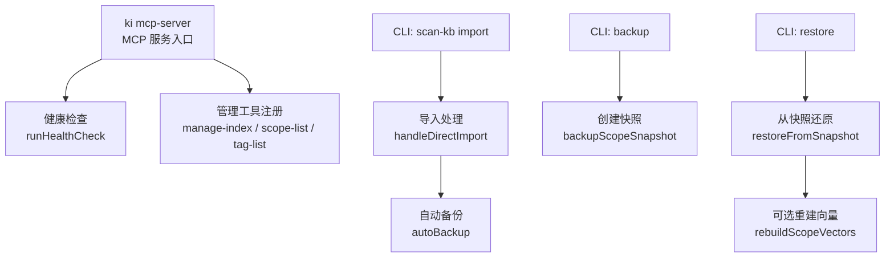
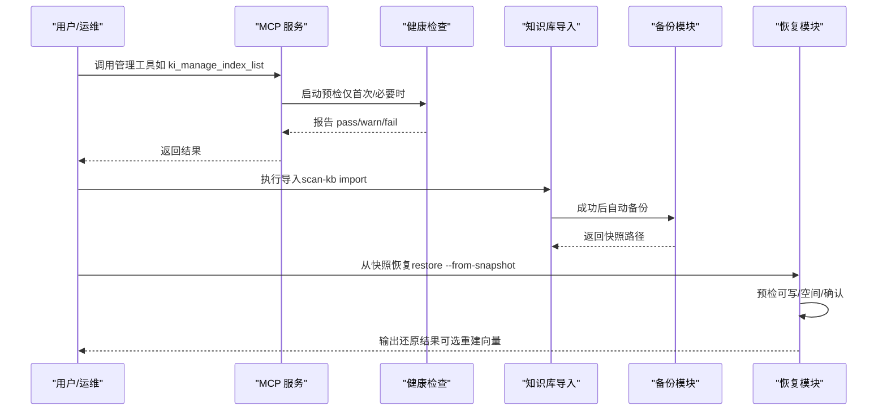
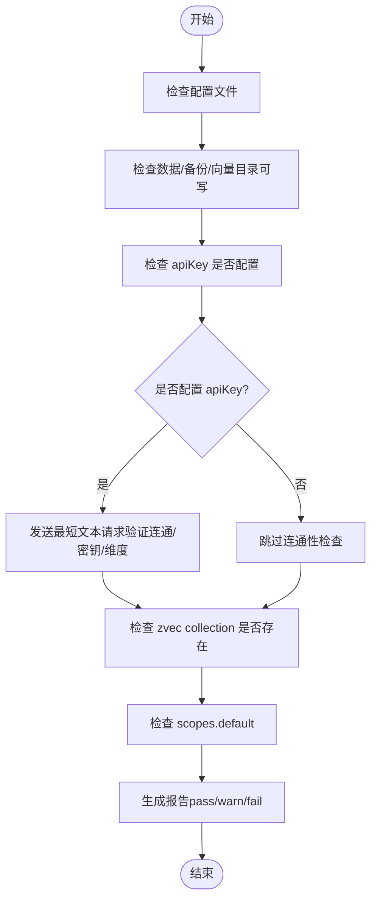
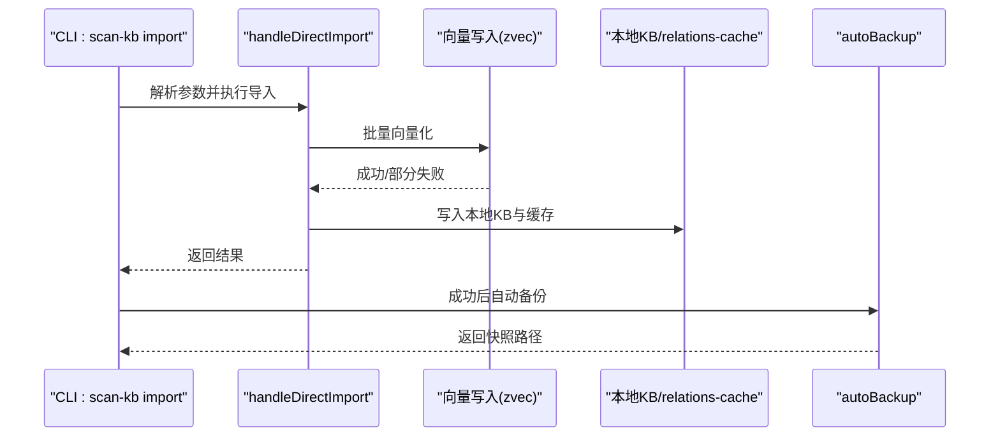
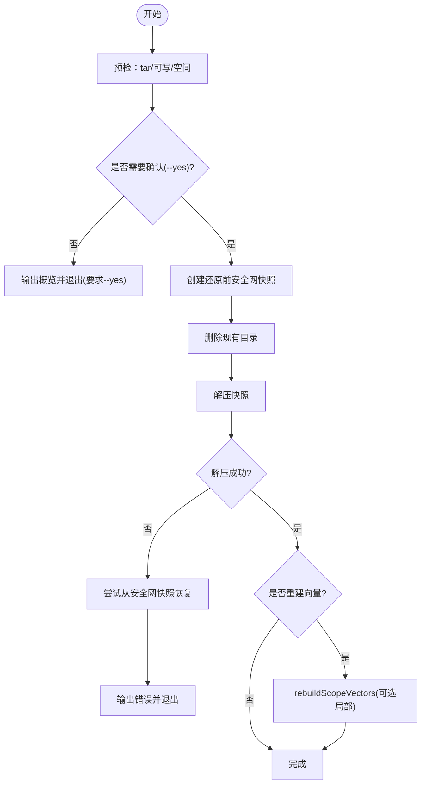
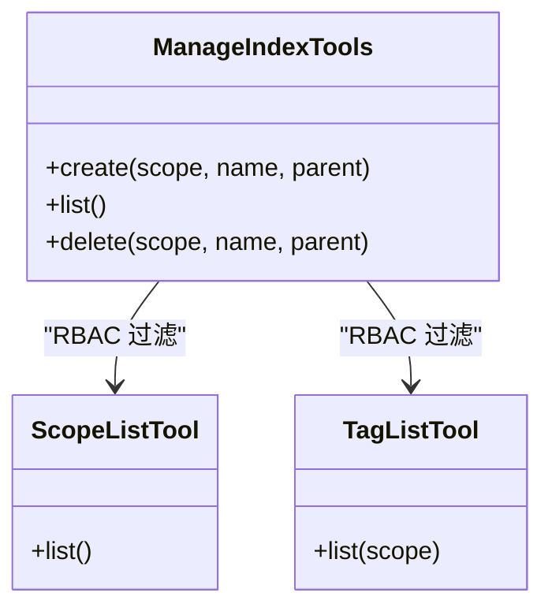
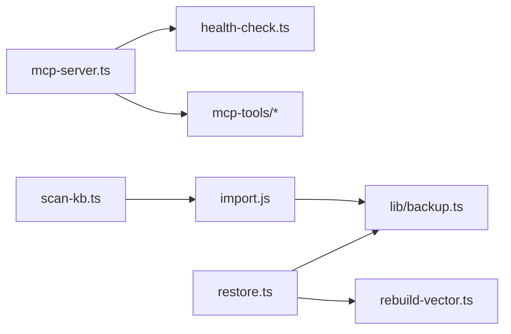

# 管理类工具

<cite>
**本文引用的文件**
- [src/mcp-server.ts](file://src/mcp-server.ts)
- [src/lib/health-check.ts](file://src/lib/health-check.ts)
- [src/scan-kb.ts](file://src/scan-kb.ts)
- [src/backup.ts](file://src/backup.ts)
- [src/restore.ts](file://src/restore.ts)
- [src/lib/backup.ts](file://src/lib/backup.ts)
- [src/lib/mcp-tools/manage-index.ts](file://src/lib/mcp-tools/manage-index.ts)
- [src/lib/mcp-tools/scope-list.ts](file://src/lib/mcp-tools/scope-list.ts)
- [src/lib/mcp-tools/tag-list.ts](file://src/lib/mcp-tools/tag-list.ts)
- [docs/backup-restore.md](file://docs/backup-restore.md)
</cite>

## 目录
1. [简介](#简介)
2. [项目结构](#项目结构)
3. [核心组件](#核心组件)
4. [架构总览](#架构总览)
5. [详细组件分析](#详细组件分析)
6. [依赖关系分析](#依赖关系分析)
7. [性能与可用性](#性能与可用性)
8. [故障诊断与排错](#故障诊断与排错)
9. [自动化运维与监控告警](#自动化运维与监控告警)
10. [权限控制、审计与安全](#权限控制审计与安全)
11. [结论](#结论)

## 简介
本文件面向“管理类 MCP 工具”的规范与使用，覆盖知识库扫描机制、健康检查指标、备份恢复流程，并提供系统监控、维护操作、故障诊断的使用示例。同时说明工具间的依赖关系和执行顺序，给出自动化运维脚本示例和监控告警配置建议，并解释权限控制、审计日志与安全考虑。

## 项目结构
本项目通过 MCP Server 暴露管理工具，并通过 CLI 命令完成知识库导入、备份与恢复等运维操作。关键路径：
- MCP 服务入口与工具注册：src/mcp-server.ts
- 健康检查（启动预检）：src/lib/health-check.ts
- 知识库导入（扫描）：src/scan-kb.ts
- 备份与恢复：src/backup.ts、src/restore.ts、src/lib/backup.ts
- 管理工具（索引/范围/标签）：src/lib/mcp-tools/*

图表来源
- [src/mcp-server.ts:54-70](file://src/mcp-server.ts#L54-L70)
- [src/lib/health-check.ts:150-240](file://src/lib/health-check.ts#L150-L240)
- [src/scan-kb.ts:35-78](file://src/scan-kb.ts#L35-L78)
- [src/lib/backup.ts:87-143](file://src/lib/backup.ts#L87-L143)
- [src/restore.ts:124-284](file://src/restore.ts#L124-L284)

章节来源
- [src/mcp-server.ts:54-70](file://src/mcp-server.ts#L54-L70)
- [src/lib/health-check.ts:150-240](file://src/lib/health-check.ts#L150-L240)
- [src/scan-kb.ts:35-78](file://src/scan-kb.ts#L35-L78)
- [src/lib/backup.ts:87-143](file://src/lib/backup.ts#L87-L143)
- [src/restore.ts:124-284](file://src/restore.ts#L124-L284)

## 核心组件
- MCP 服务与工具注册：构建 McpServer，统一注册查询、写入、索引管理等工具；支持 stdio 与 HTTP 两种传输模式，HTTP 模式提供鉴权、守护进程、重启、状态查询等能力。
- 健康检查：启动前执行只读检查，涵盖配置文件、目录可写性、apiKey、embedding 连通性与维度匹配、zvec collection 存在性、scopes.default 配置等。
- 知识库扫描导入：外部 Markdown 直导，自动切分、向量化、写入本地 KB 与 relations-cache，并在成功后触发自动备份。
- 备份与恢复：基于 tar.gz 的 scope 快照备份；恢复时提供安全网快照、空间与可写性预检、破坏性确认、可选向量重建。

章节来源
- [src/mcp-server.ts:54-70](file://src/mcp-server.ts#L54-L70)
- [src/lib/health-check.ts:150-240](file://src/lib/health-check.ts#L150-L240)
- [src/scan-kb.ts:35-78](file://src/scan-kb.ts#L35-L78)
- [src/lib/backup.ts:87-143](file://src/lib/backup.ts#L87-L143)
- [src/restore.ts:124-284](file://src/restore.ts#L124-L284)

## 架构总览
MCP 服务作为统一入口，对外暴露管理工具；CLI 命令用于离线或批量的导入、备份、恢复等操作。健康检查贯穿服务启动与预检阶段，确保运行环境正确。

图表来源
- [src/mcp-server.ts:660-698](file://src/mcp-server.ts#L660-L698)
- [src/lib/health-check.ts:150-240](file://src/lib/health-check.ts#L150-L240)
- [src/scan-kb.ts:47-78](file://src/scan-kb.ts#L47-L78)
- [src/lib/backup.ts:125-143](file://src/lib/backup.ts#L125-L143)
- [src/restore.ts:124-284](file://src/restore.ts#L124-L284)

## 详细组件分析

### 健康检查（ki_health_check）
- 目标：在 MCP 启动前执行只读检查，避免错误配置导致服务不可用。
- 检查项：
  - 配置文件存在且可解析（字段级校验由加载阶段完成）。
  - dataDir、backupDir、vectorDir 存在且可写。
  - embedding.apiKey 是否配置。
  - embedding 连通性、密钥有效性、维度匹配（发送最短请求验证）。
  - zvec collection 是否存在（目录非空判定，避免打开锁冲突）。
  - scopes.default 是否配置。
- 输出：结构化报告（pass/warn/fail），失败项拒绝启动。

图表来源
- [src/lib/health-check.ts:150-240](file://src/lib/health-check.ts#L150-L240)

章节来源
- [src/lib/health-check.ts:150-240](file://src/lib/health-check.ts#L150-L240)

### 知识库扫描机制（ki_scan_kb）
- 入口：scan-kb import
- 功能：
  - 指定 scope、source 目录、group、chunk 参数、清洗规则、tags 等。
  - 无 AI 依赖的原文直导，自动切分、批量向量化、写入本地 KB 与 relations-cache。
  - 成功后自动触发备份，保证首次导入也生成快照。
- 幂等性：重复执行追加更新，不重复导入相同内容。

图表来源
- [src/scan-kb.ts:35-78](file://src/scan-kb.ts#L35-L78)
- [src/lib/backup.ts:125-143](file://src/lib/backup.ts#L125-L143)

章节来源
- [src/scan-kb.ts:35-78](file://src/scan-kb.ts#L35-L78)
- [src/lib/backup.ts:125-143](file://src/lib/backup.ts#L125-L143)

### 备份与恢复流程（ki_backup、ki_restore）
- 备份：
  - 命令：ki backup <scope> [--list]
  - 实现：打包 scope 目录为 tar.gz，落盘到 {backupDir}/{scope}/snapshots，时间戳命名并防覆盖。
  - 自动备份：导入成功后自动触发，失败不阻断主流程。
- 恢复：
  - 命令：ki restore <scope> [--from-snapshot] [--timestamp] [--yes] [--rebuild-vector] [--group] [--tags]
  - 流程：
    - 预检：tar 可用、目标父目录可写、磁盘空间估算（按解压膨胀倍数保守估计）。
    - 确认：展示将被覆盖的数据规模与来源，未加 --yes 则退出并要求重新执行。
    - 安全网：还原前创建当前状态快照，若后续失败可自动恢复。
    - 删除并解压：删除现有目录后解压快照。
    - 可选重建向量：还原后需重建向量以启用语义检索，支持全量或局部重建（--group/--tags）。

图表来源
- [src/restore.ts:124-284](file://src/restore.ts#L124-L284)
- [src/lib/backup.ts:87-117](file://src/lib/backup.ts#L87-L117)

章节来源
- [src/backup.ts:28-108](file://src/backup.ts#L28-L108)
- [src/restore.ts:124-284](file://src/restore.ts#L124-L284)
- [src/lib/backup.ts:87-143](file://src/lib/backup.ts#L87-L143)
- [docs/backup-restore.md:75-178](file://docs/backup-restore.md#L75-L178)

### 管理工具（索引/范围/标签）
- ki_manage_index_*：
  - create：创建 Group 节点（scope 不存在则自动创建）。
  - list：列出所有 scope（含 registered/initialized 标注），受授权 scope 过滤。
  - delete：仅限空节点删除（无子节点、无 relation、无本地 KB），非空节点引导走逐条删除或 CLI 级联删除。
- ki_scope_list：列出所有 scope（KB 层 + 向量层并集），受授权 scope 过滤。
- ki_tag_list：列出指定 scope 下用过的 tag 及文档数（只读）。

图表来源
- [src/lib/mcp-tools/manage-index.ts:13-113](file://src/lib/mcp-tools/manage-index.ts#L13-L113)
- [src/lib/mcp-tools/scope-list.ts:11-42](file://src/lib/mcp-tools/scope-list.ts#L11-L42)
- [src/lib/mcp-tools/tag-list.ts:6-38](file://src/lib/mcp-tools/tag-list.ts#L6-L38)

章节来源
- [src/lib/mcp-tools/manage-index.ts:13-113](file://src/lib/mcp-tools/manage-index.ts#L13-L113)
- [src/lib/mcp-tools/scope-list.ts:11-42](file://src/lib/mcp-tools/scope-list.ts#L11-L42)
- [src/lib/mcp-tools/tag-list.ts:6-38](file://src/lib/mcp-tools/tag-list.ts#L6-L38)

## 依赖关系分析
- MCP 服务依赖健康检查进行启动预检；依赖向量客户端生命周期管理（空闲释放锁、关闭引擎）。
- 导入流程依赖向量化与本地 KB 写入，成功后触发自动备份。
- 备份模块依赖 tar 命令与磁盘空间/可写性预检。
- 恢复模块依赖备份模块与安全网快照，支持可选向量重建。

图表来源
- [src/mcp-server.ts:54-70](file://src/mcp-server.ts#L54-L70)
- [src/scan-kb.ts:35-78](file://src/scan-kb.ts#L35-L78)
- [src/lib/backup.ts:87-143](file://src/lib/backup.ts#L87-L143)
- [src/restore.ts:124-284](file://src/restore.ts#L124-L284)

章节来源
- [src/mcp-server.ts:54-70](file://src/mcp-server.ts#L54-L70)
- [src/scan-kb.ts:35-78](file://src/scan-kb.ts#L35-L78)
- [src/lib/backup.ts:87-143](file://src/lib/backup.ts#L87-L143)
- [src/restore.ts:124-284](file://src/restore.ts#L124-L284)

## 性能与可用性
- 健康检查：embedding 请求设置超时与重试，避免单次网络抖动导致误判；zvec collection 检查采用目录非空判定，避免打开锁冲突。
- 导入：批量向量化与本地 KB 写入并行化优化，减少端到端耗时；自动备份不影响主流程。
- 备份：tar 压缩体积较小，落盘前进行空间与可写性预检，失败清理半截产物。
- 恢复：解压前估算所需空间（保守倍数），失败自动回滚至安全网快照，保障数据一致性。

[本节为通用性能讨论，无需具体文件引用]

## 故障诊断与排错
- 启动失败：查看健康检查报告（stderr），定位缺失配置、目录权限、embedding 连通性或维度不匹配等问题。
- 导入失败：检查 source 目录格式、chunk 参数、清洗规则；关注自动备份是否生成（失败会输出警告）。
- 备份失败：确认 tar 可用、目标目录可写、磁盘空间充足；查看 stderr 中的警告信息。
- 恢复失败：确认快照文件完整、目标目录可写、空间足够；若 tar 解压失败将尝试从安全网快照恢复。

章节来源
- [src/lib/health-check.ts:150-240](file://src/lib/health-check.ts#L150-L240)
- [src/scan-kb.ts:47-78](file://src/scan-kb.ts#L47-L78)
- [src/lib/backup.ts:87-117](file://src/lib/backup.ts#L87-L117)
- [src/restore.ts:124-284](file://src/restore.ts#L124-L284)

## 自动化运维与监控告警
- 自动化脚本示例：
  - 定期备份：定时任务执行 ki backup <scope>，记录输出与退出码，异常时告警。
  - 增量导入：修改 source 目录后执行 ki scan-kb import，成功后检查自动备份是否生成。
  - 恢复演练：周期性执行 ki restore <scope> --list 并选择历史快照进行演练恢复（--yes 仅在演练环境）。
- 监控告警配置建议：
  - 健康检查：对 runHealthCheck 的 fail 计数设置阈值，超过即告警。
  - 导入成功率：统计导入成功/失败比例，失败率超阈值告警。
  - 备份可用性：检测 snapshots 目录是否存在最新快照，过期或未生成告警。
  - 恢复演练：记录演练恢复成功/失败，失败立即告警。

[本节为通用实践建议，无需具体文件引用]

## 权限控制、审计与安全
- 权限控制：
  - MCP 工具列表与结果受授权 scope 过滤（ki_manage_index_list、ki_scope_list），避免泄露未授权 scope。
  - HTTP 模式非回环绑定强制鉴权（Bearer Token），支持多 Token 管理与作用域限制。
- 审计日志：
  - 启动预检与健康检查报告写入 stderr，便于集中采集。
  - 鉴权失败与探活接口（/healthz）提供 authFailures 计数，便于监控。
- 安全考虑：
  - 恢复为破坏性操作，需显式 --yes 确认，并展示将被覆盖的数据规模。
  - 备份与恢复均进行预检（可写性、磁盘空间），失败时清理或回滚，避免中间态残留。
  - 向量库锁冲突防护：stdio 与 HTTP 模式互斥，避免并发争抢导致降级或死锁。

章节来源
- [src/lib/mcp-tools/manage-index.ts:13-113](file://src/lib/mcp-tools/manage-index.ts#L13-L113)
- [src/lib/mcp-tools/scope-list.ts:11-42](file://src/lib/mcp-tools/scope-list.ts#L11-L42)
- [src/mcp-server.ts:174-212](file://src/mcp-server.ts#L174-L212)
- [src/restore.ts:201-284](file://src/restore.ts#L201-L284)

## 结论
本文件系统性地梳理了管理类 MCP 工具的接口规范与实现细节，涵盖健康检查、知识库扫描导入、备份恢复流程，以及权限控制、审计与安全策略。通过标准化 CLI 与 MCP 工具，结合自动化运维与监控告警，可有效提升系统的可维护性与可靠性。建议在生产环境中严格执行健康检查与备份恢复演练，确保数据一致性与业务连续性。