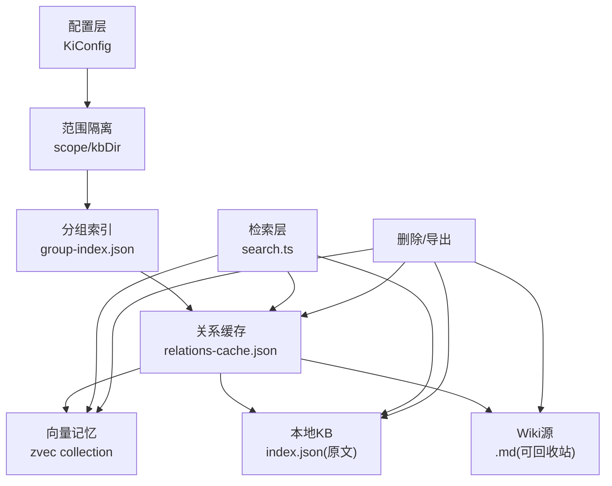
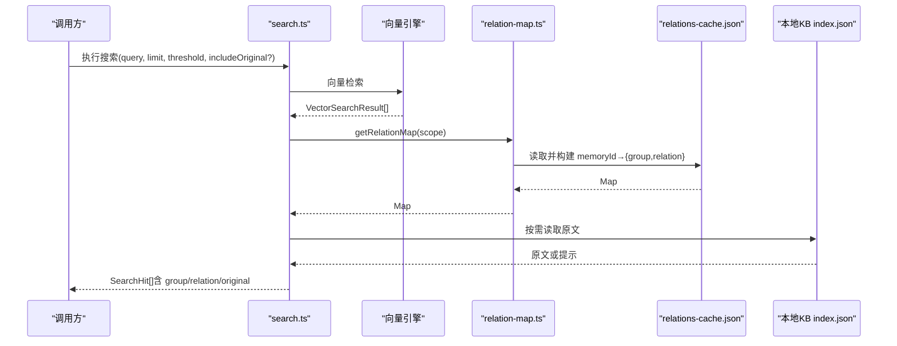
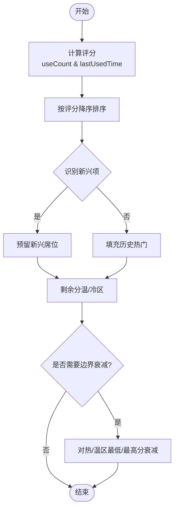
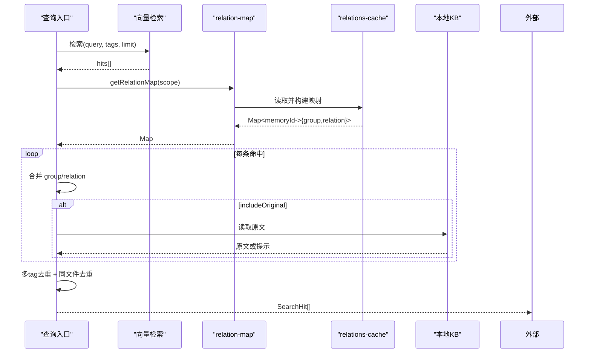
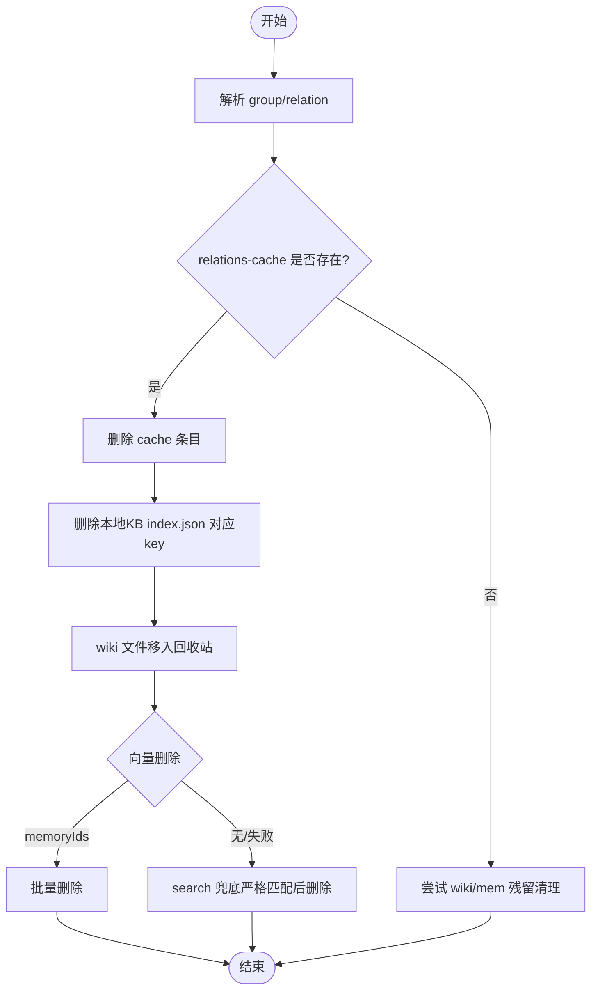
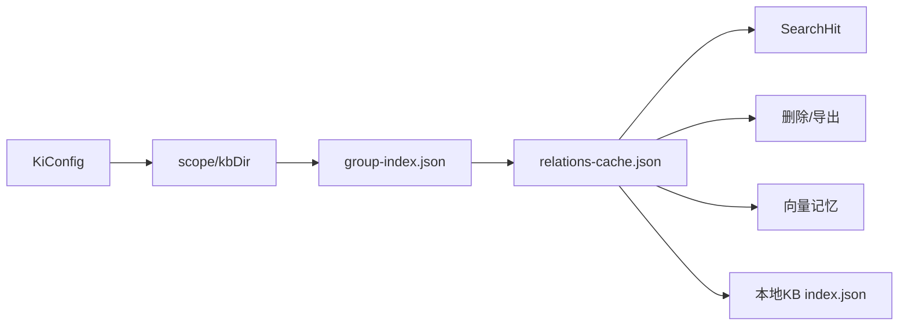

# 数据模型

<cite>
**本文引用的文件**
- [src/lib/scoring.ts](file://src/lib/scoring.ts)
- [src/lib/relation-map.ts](file://src/lib/relation-map.ts)
- [src/lib/scope.ts](file://src/lib/scope.ts)
- [src/lib/store.ts](file://src/lib/store.ts)
- [src/search.ts](file://src/search.ts)
- [src/delete-relation.ts](file://src/delete-relation.ts)
- [src/export.ts](file://src/export.ts)
- [src/lib/import.ts](file://src/lib/import.ts)
- [src/lib/group-resolve.ts](file://src/lib/group-resolve.ts)
- [src/lib/config-schema.ts](file://src/lib/config-schema.ts)
- [src/config.ts](file://src/config.ts)
</cite>

## 目录
1. [简介](#简介)
2. [项目结构](#项目结构)
3. [核心数据模型](#核心数据模型)
4. [架构总览](#架构总览)
5. [详细组件分析](#详细组件分析)
6. [依赖关系分析](#依赖关系分析)
7. [性能与一致性](#性能与一致性)
8. [故障排查](#故障排查)
9. [结论](#结论)
10. [附录：JSON Schema、TypeScript 类型与数据库映射](#附录json-schematypescript-类型与数据库映射)

## 简介
本文件系统化梳理知识索引系统的数据模型，覆盖核心实体 KiConfig、Group、Relation、SearchHit 等字段定义、数据类型、约束规则；说明实体关系图、主键/外键约定、索引设计；给出数据验证规则、业务逻辑约束、数据生命周期管理；并提供 JSON Schema 建议、TypeScript 类型定位、以及“本地文件系统 + WAL”的持久化映射与迁移策略。

## 项目结构
围绕数据模型的关键代码分布在以下模块：
- 配置与校验：KiConfig 结构与字段校验
- 分组与路径：GroupIndex、Group 树与路径解析
- 关系与评分：Relation 定义、冷热分区、使用记录
- 检索结果：SearchHit 扩展与原文获取
- 缓存与反查：relations-cache.json 与 memoryId 反查
- 存储与迁移：WAL 写入、版本兼容、旧格式迁移
- 删除与导出：跨层一致删除与导出

图表来源
- [src/lib/scope.ts:58-77](file://src/lib/scope.ts#L58-L77)
- [src/lib/store.ts:23-62](file://src/lib/store.ts#L23-L62)
- [src/search.ts:33-47](file://src/search.ts#L33-L47)
- [src/delete-relation.ts:34-56](file://src/delete-relation.ts#L34-L56)
- [src/export.ts:136-178](file://src/export.ts#L136-L178)

章节来源
- [src/lib/scope.ts:58-77](file://src/lib/scope.ts#L58-L77)
- [src/lib/store.ts:23-62](file://src/lib/store.ts#L23-L62)
- [src/search.ts:33-47](file://src/search.ts#L33-L47)

## 核心数据模型
本节聚焦四个核心实体：KiConfig、Group（GroupIndex）、Relation、SearchHit。

### KiConfig（配置）
- 作用：描述数据目录、备份目录、向量目录、Embedding 提供方、scope 模式、MCP HTTP 等全局配置。
- 关键字段（节选）：
  - dataDir、backupDir、vectorDir：字符串路径
  - embedding.provider/baseURL/model/dimension/apiKey：嵌入服务配置
  - scopeMode：枚举 default | strict
  - scopes.<name>.kbDir/wikiSync/clean/import/mcp.http.*：按 scope 扩展
- 约束：
  - 未知字段报错（带拼写建议）
  - 废弃字段仅告警不阻断
  - 数值/端口/URL/数组等强类型校验
  - null 的 scope 条目降级为告警或错误
- 参考实现：字段级 schema 声明与遍历校验

章节来源
- [src/lib/config-schema.ts:17-166](file://src/lib/config-schema.ts#L17-L166)
- [src/lib/config-schema.ts:174-274](file://src/lib/config-schema.ts#L174-L274)
- [src/lib/config-schema.ts:328-339](file://src/lib/config-schema.ts#L328-L339)
- [src/config.ts:32-64](file://src/config.ts#L32-L64)

### Group（分组）与 GroupIndex（分组索引）
- 作用：以树形结构组织知识分组，提供路径解析、补全与存在性检查。
- 关键字段：
  - version：当前 1
  - scope：所属 scope
  - groups：嵌套对象表示的 Group 树
  - updatedAt：更新时间戳
  - source：可选的知识源基线（dir、chunkSize、chunkOverlap）
- 约束与行为：
  - 自动迁移旧格式 roots → groups
  - 确保 groupPath 在树中完整存在
  - 支持最长前缀匹配、候选提示、向量兜底
- 参考实现：GroupIndex 类型、迁移函数、路径解析

章节来源
- [src/lib/scope.ts:81-112](file://src/lib/scope.ts#L81-L112)
- [src/lib/scope.ts:117-146](file://src/lib/scope.ts#L117-L146)
- [src/lib/scope.ts:151-167](file://src/lib/scope.ts#L151-L167)
- [src/lib/group-resolve.ts:12-25](file://src/lib/group-resolve.ts#L12-L25)
- [src/lib/group-resolve.ts:117-219](file://src/lib/group-resolve.ts#L117-L219)

### Relation（关系）
- 作用：表示某个 Group 下可被检索和命中的知识条目，承载热度、来源、关联记忆 ID、自定义标签等。
- 关键字段：
  - id：自增编号（rel_XXX）
  - text：relation 名称（唯一主键之一，与 groupPath 组合）
  - score：评分（基于 useCount 与时间衰减）
  - useCount：使用次数
  - lastUsedTime：最后使用时间
  - isImported：是否导入产生
  - memoryId：单值记忆 ID（旧链路）
  - memoryIds：多值记忆 ID（新链路，文件级 relation 的全部 chunk memoryId）
  - sourcePath：原始文件相对路径（用于 diff 关联）
  - tags：文档级自定义标签（如 api/auth），用于重建向量 tag
- 约束与行为：
  - 防刷使用记录（最小间隔、上限）
  - 冷热分区（hot/warm/cold）与边界衰减
  - upsert 以 (groupPath + text) 为主键去重
- 参考实现：Relation 接口、recordUse、hybridPartition、boundaryDecay、upsert

章节来源
- [src/lib/scoring.ts:19-36](file://src/lib/scoring.ts#L19-L36)
- [src/lib/scoring.ts:44-79](file://src/lib/scoring.ts#L44-L79)
- [src/lib/scoring.ts:90-117](file://src/lib/scoring.ts#L90-L117)
- [src/lib/scoring.ts:136-209](file://src/lib/scoring.ts#L136-L209)
- [src/lib/scoring.ts:222-274](file://src/lib/scoring.ts#L222-L274)
- [src/lib/import.ts:572-611](file://src/lib/import.ts#L572-L611)

### SearchHit（搜索结果）
- 作用：向量检索返回的结果，附加 Group/relation 定位信息，并可携带原文。
- 关键字段：
  - 继承向量结果字段（memoryId、content、score 等）
  - group：所属 Group 路径（可能缺失）
  - relation：文件级 relation（可能缺失）
  - originalRetrieved：原文是否成功获取
  - original：原文内容（失败时缺失）
  - originalHint：原文不可用提示
  - deduplicated：同一文件多 chunk 命中去重标记
- 约束与行为：
  - 通过 relations-cache 反查 group/relation
  - 可选开启原文获取（CLI/MCP 显式参数）
  - Multi-tag 去重与同文件多 chunk 去重
- 参考实现：SearchHit 接口、executeSearch 流程

章节来源
- [src/search.ts:33-47](file://src/search.ts#L33-L47)
- [src/search.ts:70-199](file://src/search.ts#L70-L199)

## 架构总览
下图展示从配置到检索、删除、导出的数据流与实体交互。

图表来源
- [src/search.ts:70-199](file://src/search.ts#L70-L199)
- [src/lib/relation-map.ts:48-78](file://src/lib/relation-map.ts#L48-L78)
- [src/lib/relation-map.ts:80-114](file://src/lib/relation-map.ts#L80-L114)
- [src/lib/store.ts:23-62](file://src/lib/store.ts#L23-L62)

## 详细组件分析

### 组件A：Relation 评分与冷热分区
- 目标：根据使用频率与时间衰减计算评分，划分热/温/冷区，并在边界进入时进行衰减调整。
- 关键算法：
  - calculateScore：useCount / (1 + hoursSinceLastUse / halfLifeHours)
  - recordUse：防刷（最小间隔）+ 上限截断
  - hybridPartition：新兴热区 + 历史热门 + 常温/冷区比例分配
  - boundaryDecay：新项进入热区时对现有热/温区分数做衰减
- 复杂度：O(N log N) 排序 + O(N) 扫描；空间 O(N)

图表来源
- [src/lib/scoring.ts:44-79](file://src/lib/scoring.ts#L44-L79)
- [src/lib/scoring.ts:90-117](file://src/lib/scoring.ts#L90-L117)
- [src/lib/scoring.ts:136-209](file://src/lib/scoring.ts#L136-L209)
- [src/lib/scoring.ts:222-274](file://src/lib/scoring.ts#L222-L274)

章节来源
- [src/lib/scoring.ts:44-79](file://src/lib/scoring.ts#L44-L79)
- [src/lib/scoring.ts:90-117](file://src/lib/scoring.ts#L90-L117)
- [src/lib/scoring.ts:136-209](file://src/lib/scoring.ts#L136-L209)
- [src/lib/scoring.ts:222-274](file://src/lib/scoring.ts#L222-L274)

### 组件B：SearchHit 生成与原文获取
- 目标：将向量检索结果与 relations-cache 反查结合，必要时拉取本地 KB 原文，并进行多 tag 去重与同文件多 chunk 去重。
- 关键步骤：
  - 向量检索（支持 tag 过滤与优先级）
  - 反查 memoryId → {group, relation}
  - 可选获取原文（local KB index.json）
  - Multi-tag 去重（保留最高 score）
  - 同文件多 chunk 去重（original 仅首条返回）
- 复杂度：反查 O(1)，去重 O(N)

图表来源
- [src/search.ts:70-199](file://src/search.ts#L70-L199)
- [src/lib/relation-map.ts:48-78](file://src/lib/relation-map.ts#L48-L78)
- [src/lib/relation-map.ts:80-114](file://src/lib/relation-map.ts#L80-L114)

章节来源
- [src/search.ts:70-199](file://src/search.ts#L70-L199)
- [src/lib/relation-map.ts:48-78](file://src/lib/relation-map.ts#L48-L78)
- [src/lib/relation-map.ts:80-114](file://src/lib/relation-map.ts#L80-L114)

### 组件C：删除与一致性保障
- 目标：删除 Relation 或整个 Group，保证 cache、KB、wiki、向量四层一致。
- 关键点：
  - 优先按 memoryIds 批量删除向量，失败则 search 兜底严格匹配后删除
  - 删除 relations-cache 对应条目
  - 删除本地 KB index.json 对应 key
  - Wiki 文件移入回收站（非物理删除）
  - 目录删除级联清理子 group
- 复杂度：删除 O(N) 聚合 ids，向量删除取决于后端

图表来源
- [src/delete-relation.ts:83-176](file://src/delete-relation.ts#L83-L176)
- [src/delete-relation.ts:207-310](file://src/delete-relation.ts#L207-L310)
- [src/delete-relation.ts:383-473](file://src/delete-relation.ts#L383-L473)

章节来源
- [src/delete-relation.ts:83-176](file://src/delete-relation.ts#L83-L176)
- [src/delete-relation.ts:207-310](file://src/delete-relation.ts#L207-L310)
- [src/delete-relation.ts:383-473](file://src/delete-relation.ts#L383-L473)

### 组件D：导出与只读视图
- 目标：将 KB scope 的结构化数据反向导出为 Markdown 文件目录。
- 关键点：
  - 读取 group-index.json、relations-cache.json、local KB index.json
  - 支持指定 group 子树导出或全量导出
  - 输出目录命名规则与冲突保护
- 复杂度：遍历 O(N)，写盘顺序 IO

章节来源
- [src/export.ts:136-178](file://src/export.ts#L136-L178)
- [src/export.ts:198-322](file://src/export.ts#L198-L322)
- [src/export.ts:324-399](file://src/export.ts#L324-L399)

## 依赖关系分析
- 配置层（KiConfig）影响 scope 模式与数据路径，决定后续所有操作的作用域与落盘位置。
- GroupIndex 提供 Group 树与路径解析能力，支撑查询、删除、导出等操作。
- Relation 作为核心业务实体，贯穿导入、评分、检索、删除、导出全流程。
- SearchHit 是检索层的对外契约，依赖 relations-cache 反查与本地 KB 原文。
- 存储层通过 WAL 写入 JSON 文件，保证原子性与版本兼容。

图表来源
- [src/lib/config-schema.ts:125-166](file://src/lib/config-schema.ts#L125-L166)
- [src/lib/scope.ts:58-77](file://src/lib/scope.ts#L58-L77)
- [src/search.ts:70-199](file://src/search.ts#L70-L199)
- [src/delete-relation.ts:83-176](file://src/delete-relation.ts#L83-L176)
- [src/export.ts:136-178](file://src/export.ts#L136-L178)

章节来源
- [src/lib/config-schema.ts:125-166](file://src/lib/config-schema.ts#L125-L166)
- [src/lib/scope.ts:58-77](file://src/lib/scope.ts#L58-L77)
- [src/search.ts:70-199](file://src/search.ts#L70-L199)
- [src/delete-relation.ts:83-176](file://src/delete-relation.ts#L83-L176)
- [src/export.ts:136-178](file://src/export.ts#L136-L178)

## 性能与一致性
- 反查缓存：getRelationMap 采用 TTL + mtime/size 失效策略，首次构建 O(N)，后续 O(1)。
- 评分与分区：基于 useCount 与时间衰减，避免频繁更新导致抖动；分区上限截断控制内存占用。
- 去重策略：Multi-tag 去重与同文件多 chunk 去重减少冗余输出。
- 存储一致性：WAL 写入 JSON，version 检查与旧格式自动迁移，避免损坏与不一致。
- 删除一致性：优先 memoryIds 批量删除，失败回退 search 严格匹配，确保向量层与索引层一致。

[本节为通用性能讨论，无需具体文件引用]

## 故障排查
- 配置错误：validateConfigFields 会收集 errors 与 warns，常见包括未知字段、类型不符、非法取值、null scope 条目。
- JSON 损坏：readJson 抛出 CORRUPT_JSON 错误，建议从备份恢复或重新初始化 scope。
- 向量不可用：ensureVectorAvailable 检测失败时，search 返回 degraded 状态并给出原因。
- 删除失败：delete-relation 会记录 memMethod 与 reason，便于定位是 memoryId 未命中还是 search 兜底失败。
- 路径解析失败：resolveGroupPath 返回 matched=false 与 hint，提示可用顶层 Group 或子节点。

章节来源
- [src/lib/config-schema.ts:328-339](file://src/lib/config-schema.ts#L328-L339)
- [src/lib/store.ts:23-49](file://src/lib/store.ts#L23-L49)
- [src/search.ts:84-92](file://src/search.ts#L84-L92)
- [src/delete-relation.ts:383-473](file://src/delete-relation.ts#L383-L473)
- [src/lib/group-resolve.ts:117-219](file://src/lib/group-resolve.ts#L117-L219)

## 结论
本数据模型以 GroupIndex 与 Relation 为核心，配合 KiConfig 的范围隔离与 SearchHit 的检索契约，形成“配置—分组—关系—检索—删除—导出”的闭环。通过 WAL 写入、版本兼容、TTL 缓存、评分分区与去重策略，兼顾了正确性、性能与可维护性。

[本节为总结，无需具体文件引用]

## 附录：JSON Schema、TypeScript 类型与数据库映射

### JSON Schema（建议）
- KiConfig：
  - type: object
  - required: [dataDir, backupDir, vectorDir, embedding, scopeMode]
  - properties:
    - dataDir: string
    - backupDir: string
    - vectorDir: string
    - embedding: object (required: provider, baseURL, model, dimension, apiKey)
    - scopeMode: enum ["default", "strict"]
    - scopes: object of ScopeEntry
- GroupIndex：
  - type: object
  - required: [version, scope, groups]
  - properties:
    - version: integer
    - scope: string
    - groups: object of nested objects
    - updatedAt: string|null
    - source: object|null
- RelationsCache：
  - type: object
  - required: [version, scope, groups]
  - properties:
    - version: integer
    - scope: string
    - partition_config: object
    - groups: object of GroupData
    - updatedAt: string|null
- GroupData：
  - type: object
  - required: [hot_relations, keywords, max_hot_count]
  - properties:
    - hot_relations: array of Relation
    - keywords: array of string
    - max_hot_count: integer
- Relation：
  - type: object
  - required: [id, text, score, useCount, lastUsedTime, isImported]
  - properties:
    - id: string
    - text: string
    - score: number
    - useCount: integer
    - lastUsedTime: number|null
    - isImported: boolean
    - memoryId: string|null
    - memoryIds: array of string
    - sourcePath: string|null
    - tags: array of string
- SearchHit：
  - type: object
  - required: []
  - properties:
    - memoryId: string
    - content: string
    - score: number
    - group: string|null
    - relation: string|null
    - originalRetrieved: boolean
    - original: string|null
    - originalHint: string|null
    - deduplicated: boolean

[本节为概念性 Schema 建议，无需具体文件引用]

### TypeScript 类型定位
- KiConfig：见配置 schema 与模板渲染
  - [src/lib/config-schema.ts:125-166](file://src/lib/config-schema.ts#L125-L166)
  - [src/config.ts:32-64](file://src/config.ts#L32-L64)
- GroupIndex：
  - [src/lib/scope.ts:106-112](file://src/lib/scope.ts#L106-L112)
- Relation：
  - [src/lib/scoring.ts:19-36](file://src/lib/scoring.ts#L19-L36)
- SearchHit：
  - [src/search.ts:33-47](file://src/search.ts#L33-L47)

章节来源
- [src/lib/config-schema.ts:125-166](file://src/lib/config-schema.ts#L125-L166)
- [src/config.ts:32-64](file://src/config.ts#L32-L64)
- [src/lib/scope.ts:106-112](file://src/lib/scope.ts#L106-L112)
- [src/lib/scoring.ts:19-36](file://src/lib/scoring.ts#L19-L36)
- [src/search.ts:33-47](file://src/search.ts#L33-L47)

### 数据库表结构映射（本地文件系统 + WAL）
- 表：group-index.json
  - 字段：version, scope, groups(JSON), updatedAt, source(JSON)
  - 主键：无（逻辑主键为 scope + groups 路径）
  - 索引：无（按路径访问）
- 表：relations-cache.json
  - 字段：version, scope, partition_config(JSON), groups(JSON), updatedAt
  - 主键：无（逻辑主键为 groupPath + hot_relations[].text）
  - 索引：无（按 groupPath 访问）
- 表：local KB index.json（每个 group 一个）
  - 字段：relationName → content/moduleInfo(JSON/string)
  - 主键：relationName
  - 索引：无（按 relationName 访问）
- 表：向量集合（zvec）
  - 字段：memoryId(docId), content, tags, metadata.scope
  - 主键：memoryId
  - 索引：向量索引 + 标量过滤（scope、tags）

章节来源
- [src/lib/store.ts:23-62](file://src/lib/store.ts#L23-L62)
- [src/lib/scope.ts:58-77](file://src/lib/scope.ts#L58-L77)
- [src/export.ts:136-178](file://src/export.ts#L136-L178)

### 数据迁移策略与版本兼容性
- 版本字段：所有 JSON 文件包含 version，当前为 1；读取时若高于当前版本发出警告。
- 旧格式迁移：
  - group-index.json：roots → groups 自动迁移
  - relations-cache.json：移除“项目根/”前缀的 group key，必要时合并重复数据
- 写入增强：writeJson 自动注入 version 与 updatedAt，并通过 WAL 写入保证原子性。
- 兼容性：
  - Relation.memoryId/memoryIds 双字段兼容（旧链路单值，新链路多值）
  - keywords/isFullText 字段只读兼容，不再写入

章节来源
- [src/lib/store.ts:23-49](file://src/lib/store.ts#L23-L49)
- [src/lib/store.ts:73-92](file://src/lib/store.ts#L73-L92)
- [src/lib/store.ts:97-159](file://src/lib/store.ts#L97-L159)
- [src/lib/scope.ts:117-146](file://src/lib/scope.ts#L117-L146)
- [src/lib/import.ts:597-611](file://src/lib/import.ts#L597-L611)