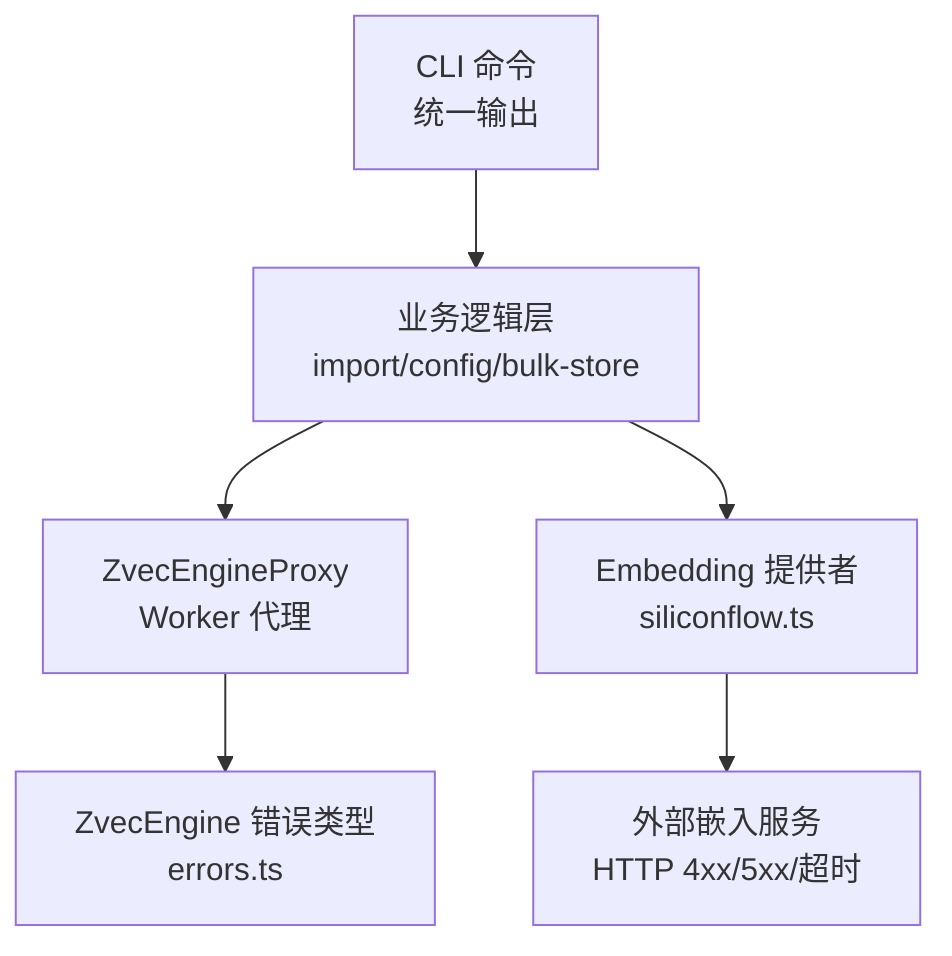
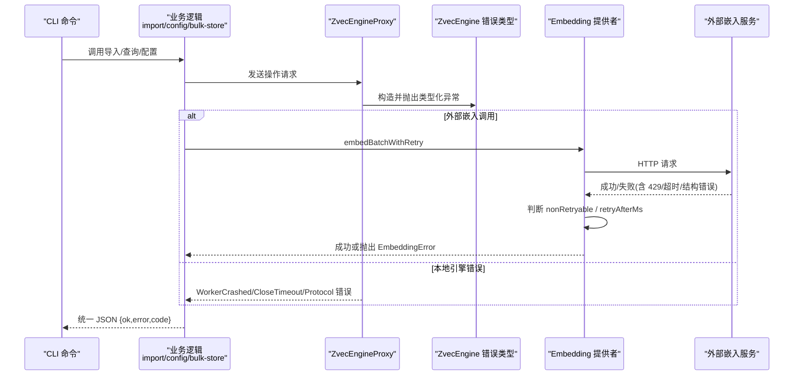
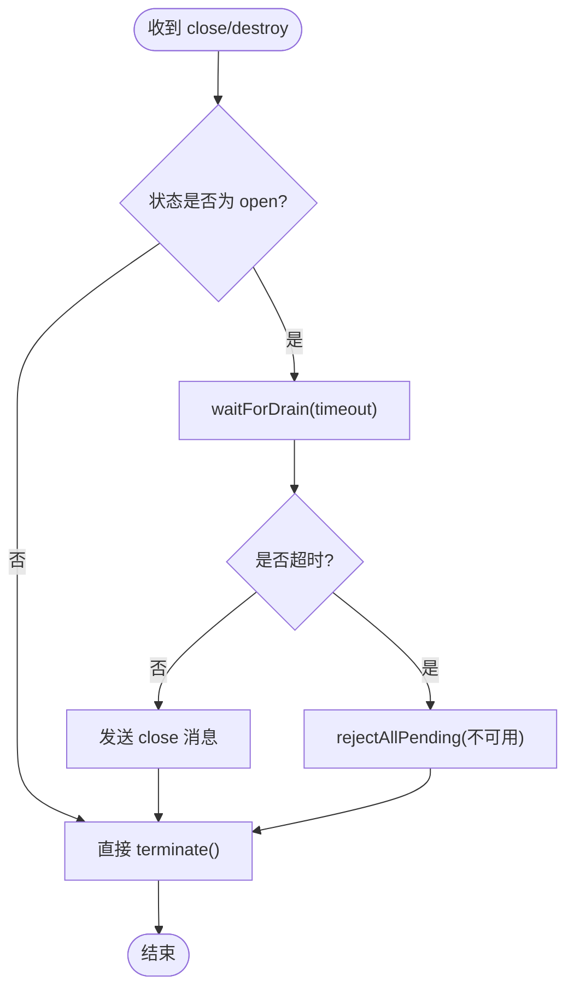
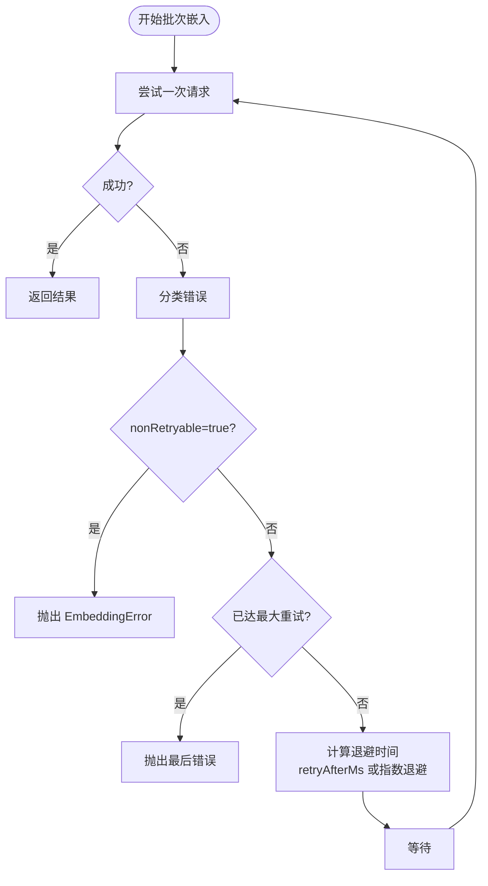
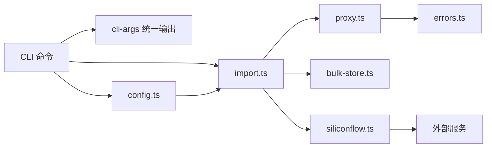

# 错误处理

<cite>
**本文引用的文件**
- [src/zvec-engine/errors.ts](file://src/zvec-engine/errors.ts)
- [src/zvec-engine/proxy.ts](file://src/zvec-engine/proxy.ts)
- [src/zvec-engine/embedding/siliconflow.ts](file://src/zvec-engine/embedding/siliconflow.ts)
- [src/lib/cli-args.ts](file://src/lib/cli-args.ts)
- [src/lib/import.ts](file://src/lib/import.ts)
- [src/lib/config.ts](file://src/lib/config.ts)
- [src/bulk-store.ts](file://src/bulk-store.ts)
- [test/error-handling.test.ts](file://test/error-handling.test.ts)
- [docs/error-handling.md](file://docs/error-handling.md)
</cite>

## 目录
1. [简介](#简介)
2. [项目结构](#项目结构)
3. [核心组件](#核心组件)
4. [架构总览](#架构总览)
5. [详细组件分析](#详细组件分析)
6. [依赖关系分析](#依赖关系分析)
7. [性能与可靠性考虑](#性能与可靠性考虑)
8. [故障排查指南](#故障排查指南)
9. [结论](#结论)
10. [附录：错误码与消息规范](#附录错误码与消息规范)

## 简介
本参考文档聚焦于知识索引系统的错误处理体系，覆盖错误类型、错误码约定、错误消息格式、异常处理策略、错误恢复与降级方案、常见错误场景的诊断方法、日志分析与调试技巧、错误捕获示例、自定义错误实现、错误上报机制，以及与外部服务的交互（超时、重试、退避）等。目标是帮助开发者快速定位问题、统一错误表达、提升系统健壮性。

## 项目结构
错误处理相关代码主要分布在以下位置：
- ZvecEngine 类型化异常定义与跨线程序列化支持
- Worker 代理的崩溃/关闭/不可用处理
- Embedding 外部服务调用的重试与退避
- CLI 命令的统一错误输出与结构化返回
- 导入流程的参数校验与数据完整性检查
- 配置加载与字段校验失败处理
- 批量存储与向量操作的错误封装

**图表来源**
- [src/zvec-engine/errors.ts:17-99](file://src/zvec-engine/errors.ts#L17-L99)
- [src/zvec-engine/proxy.ts:44-185](file://src/zvec-engine/proxy.ts#L44-L185)
- [src/zvec-engine/embedding/siliconflow.ts:104-128](file://src/zvec-engine/embedding/siliconflow.ts#L104-L128)
- [src/lib/cli-args.ts:13-27](file://src/lib/cli-args.ts#L13-L27)

**章节来源**
- [docs/error-handling.md:1-167](file://docs/error-handling.md#L1-L167)

## 核心组件
- 类型化异常基类与分类：所有引擎级异常继承统一基类，便于 instanceof 识别与跨线程反序列化重建。
- Worker 代理：负责进程间通信、在途请求拒绝、崩溃事件广播、关闭超时控制。
- Embedding 重试：对可重试错误采用指数退避与 Retry-After 优先策略；对不可重试错误直接抛出。
- CLI 统一输出：将异常转换为结构化 JSON 响应，包含 ok、error、code 等字段，便于上层消费。
- 导入与配置校验：参数缺失、路径不存在、文件格式不支持、scope 未注册等场景均给出明确错误提示与恢复建议。

**章节来源**
- [src/zvec-engine/errors.ts:17-99](file://src/zvec-engine/errors.ts#L17-L99)
- [src/zvec-engine/proxy.ts:44-185](file://src/zvec-engine/proxy.ts#L44-L185)
- [src/zvec-engine/embedding/siliconflow.ts:104-128](file://src/zvec-engine/embedding/siliconflow.ts#L104-L128)
- [src/lib/cli-args.ts:13-27](file://src/lib/cli-args.ts#L13-L27)
- [src/lib/import.ts:237-292](file://src/lib/import.ts#L237-L292)
- [src/lib/config.ts:197-275](file://src/lib/config.ts#L197-L275)

## 架构总览
下图展示了从 CLI 到引擎与外部服务的错误传播路径，以及关键的重试与降级点。

**图表来源**
- [src/zvec-engine/proxy.ts:114-185](file://src/zvec-engine/proxy.ts#L114-L185)
- [src/zvec-engine/errors.ts:17-99](file://src/zvec-engine/errors.ts#L17-L99)
- [src/zvec-engine/embedding/siliconflow.ts:104-128](file://src/zvec-engine/embedding/siliconflow.ts#L104-L128)
- [src/lib/cli-args.ts:13-27](file://src/lib/cli-args.ts#L13-L27)

## 详细组件分析

### ZvecEngine 类型化异常
- 设计要点
  - 所有引擎异常继承统一基类，携带 code 与 data，支持 cause 链式原因。
  - 提供 ERROR_CONSTRUCTORS 映射，用于 worker-protocol 跨线程反序列化重建异常。
  - 按领域划分：Schema/配置、集合生命周期、Embedding、Worker 通信与关闭。
- 复杂度与影响
  - 异常对象轻量，构造 O(1)，便于快速传递上下文信息。
  - 通过 code/data 使上层可按语义分支处理（如区分可重试与不可重试）。

```mermaid
classDiagram
class ZvecEngineError {
+string? code
+Record~string, unknown~? data
+cause? : unknown
}
class DimensionMismatchError
class InvalidSchemaError
class InvalidDocInputError
class InvalidSearchError
class InvalidFilterError
class SchemaMismatchError
class InconsistentUpdateError
class CollectionNotFoundError
class CollectionLockedException
class CollectionCorruptedException
class CollectionAlreadyExistsError
class EmbeddingError
class EmbeddingConfigError
class WorkerSpawnError
class WorkerCrashedError
class WorkerUnavailableError
class WorkerProtocolError
class CloseTimeoutError
ZvecEngineError <|-- DimensionMismatchError
ZvecEngineError <|-- InvalidSchemaError
ZvecEngineError <|-- InvalidDocInputError
ZvecEngineError <|-- InvalidSearchError
ZvecEngineError <|-- InvalidFilterError
ZvecEngineError <|-- SchemaMismatchError
ZvecEngineError <|-- InconsistentUpdateError
ZvecEngineError <|-- CollectionNotFoundError
ZvecEngineError <|-- CollectionLockedException
ZvecEngineError <|-- CollectionCorruptedException
ZvecEngineError <|-- CollectionAlreadyExistsError
ZvecEngineError <|-- EmbeddingError
ZvecEngineError <|-- EmbeddingConfigError
ZvecEngineError <|-- WorkerSpawnError
ZvecEngineError <|-- WorkerCrashedError
ZvecEngineError <|-- WorkerUnavailableError
ZvecEngineError <|-- WorkerProtocolError
ZvecEngineError <|-- CloseTimeoutError
```

**图表来源**
- [src/zvec-engine/errors.ts:17-99](file://src/zvec-engine/errors.ts#L17-L99)

**章节来源**
- [src/zvec-engine/errors.ts:17-99](file://src/zvec-engine/errors.ts#L17-L99)

### Worker 代理的错误与恢复
- 职责
  - 管理 worker 生命周期（spawn/open/close/terminate）。
  - 维护 pending 请求队列，并在 crash/exit 时统一拒绝。
  - 关闭时等待在途请求 drain，超时则抛出关闭超时错误。
- 恢复策略
  - 检测到 worker 崩溃后标记为 crashed，阻止后续请求，避免雪崩。
  - 提供 onCrash 回调，供上层记录日志或触发告警。
  - terminate 强制释放资源，确保进程退出。

**图表来源**
- [src/zvec-engine/proxy.ts:131-185](file://src/zvec-engine/proxy.ts#L131-L185)
- [src/zvec-engine/proxy.ts:244-276](file://src/zvec-engine/proxy.ts#L244-L276)

**章节来源**
- [src/zvec-engine/proxy.ts:44-185](file://src/zvec-engine/proxy.ts#L44-L185)
- [src/zvec-engine/proxy.ts:244-276](file://src/zvec-engine/proxy.ts#L244-L276)

### Embedding 外部服务：重试、超时与降级
- 重试策略
  - 指数退避：默认 1s 起，最大 8s。
  - Retry-After 优先：若错误 data 中包含 retryAfterMs 或 HTTP 头，优先使用。
  - 非可重试错误：4xx（除 429）、响应结构错误、维度不匹配等，立即抛出。
- 超时处理
  - 超时错误包装为 EmbeddingError(code=TIMEOUT)，nonRetryable=false，允许重试。
- 降级方案
  - 当连续失败达到上限，抛出最后一次错误，由上层决定回退策略（例如跳过该批或走离线缓存）。

**图表来源**
- [src/zvec-engine/embedding/siliconflow.ts:104-128](file://src/zvec-engine/embedding/siliconflow.ts#L104-L128)

**章节来源**
- [src/zvec-engine/embedding/siliconflow.ts:104-128](file://src/zvec-engine/embedding/siliconflow.ts#L104-L128)

### CLI 统一错误输出与结构化返回
- 统一格式
  - 成功：{ ok: true, ... }
  - 失败：{ ok: false, error: string, code?: string }
- 错误提取
  - 从异常对象中读取 code（若存在），否则仅保留 message。
- 适用场景
  - 批量导入、删除关系、文档操作、向量批量写入等命令。

**章节来源**
- [src/lib/cli-args.ts:13-27](file://src/lib/cli-args.ts#L13-L27)
- [src/bulk-store.ts:70-76](file://src/bulk-store.ts#L70-L76)

### 导入流程错误与恢复
- 参数校验
  - sourceDir 不存在或不是目录：拒绝执行并提示正确路径。
  - 无 .md 文件：提示白名单扩展名，调整配置或补充文件。
  - scope 未注册：需在配置中声明 scopes.definitions。
- 数据完整性
  - relations-cache.json 缺失：需先初始化 scope。
  - group-index.json 损坏：从备份或模板恢复。
- 增量导入
  - 删除失败不阻塞主流程，记录 warning 继续执行。

**章节来源**
- [src/lib/import.ts:237-292](file://src/lib/import.ts#L237-L292)
- [docs/error-handling.md:55-131](file://docs/error-handling.md#L55-L131)

### 配置加载与字段校验失败
- 配置文件不存在或解析失败：直接报错并提示具体文件与详情。
- 字段校验失败：列出非法字段、期望类型与可用取值，要求逐条修复。
- strict 模式：未显式传入 scope 或未注册时报错，防止误操作。

**章节来源**
- [src/lib/config.ts:197-275](file://src/lib/config.ts#L197-L275)
- [src/lib/config.ts:468-478](file://src/lib/config.ts#L468-L478)

### 测试覆盖的关键错误场景
- 非法 scope 字符被拒绝
- Group 树索引异常（不存在、损坏、重复创建、删除非空节点）
- Relations 缓存异常（空 module-info、单条模式缺参）
- 本地 KB 缺失（KB 目录、relations-cache）
- 展示参数无效 mode
- 导入异常（source 不存在、无 md 文件）

**章节来源**
- [test/error-handling.test.ts:45-173](file://test/error-handling.test.ts#L45-L173)

## 依赖关系分析
- 模块耦合
  - CLI 命令依赖 cli-args 统一输出，降低各命令错误处理差异。
  - 业务逻辑依赖 import/config/bulk-store 进行参数与数据校验。
  - 引擎层通过 errors.ts 提供稳定异常契约，proxy.ts 负责进程边界错误传播。
  - embedding 层与外部服务解耦，通过错误 data 字段传递重试策略。
- 外部依赖
  - HTTP 客户端错误（4xx/5xx/超时）被包装为 EmbeddingError，并通过 data 字段标注可重试性与退避时间。
- 循环依赖
  - 当前错误处理链路单向向下（CLI→业务→引擎/外部），未见循环依赖迹象。

**图表来源**
- [src/lib/cli-args.ts:13-27](file://src/lib/cli-args.ts#L13-L27)
- [src/lib/import.ts:237-292](file://src/lib/import.ts#L237-L292)
- [src/lib/config.ts:197-275](file://src/lib/config.ts#L197-L275)
- [src/zvec-engine/proxy.ts:44-185](file://src/zvec-engine/proxy.ts#L44-L185)
- [src/zvec-engine/errors.ts:17-99](file://src/zvec-engine/errors.ts#L17-L99)
- [src/zvec-engine/embedding/siliconflow.ts:104-128](file://src/zvec-engine/embedding/siliconflow.ts#L104-L128)
- [src/bulk-store.ts:70-76](file://src/bulk-store.ts#L70-L76)

**章节来源**
- [src/lib/cli-args.ts:13-27](file://src/lib/cli-args.ts#L13-L27)
- [src/lib/import.ts:237-292](file://src/lib/import.ts#L237-L292)
- [src/lib/config.ts:197-275](file://src/lib/config.ts#L197-L275)
- [src/zvec-engine/proxy.ts:44-185](file://src/zvec-engine/proxy.ts#L44-L185)
- [src/zvec-engine/errors.ts:17-99](file://src/zvec-engine/errors.ts#L17-L99)
- [src/zvec-engine/embedding/siliconflow.ts:104-128](file://src/zvec-engine/embedding/siliconflow.ts#L104-L128)
- [src/bulk-store.ts:70-76](file://src/bulk-store.ts#L70-L76)

## 性能与可靠性考虑
- 重试与退避
  - Embedding 调用采用指数退避与 Retry-After 优先，避免瞬时拥塞导致雪崩。
  - 非可重试错误立即失败，减少无效重试开销。
- 关闭与资源释放
  - Worker 关闭时等待在途请求 drain，超时则强制终止，避免资源泄漏。
- 降级策略
  - 增量导入删除失败不阻塞主流程，保证整体进度。
  - 配置校验失败快速拒绝，避免带着错误配置运行造成更大损失。

[本节为通用指导，无需特定文件引用]

## 故障排查指南
- 常见错误场景
  - 参数缺失或不合法：检查 --scope、--group、--relation、--module-info 等必填项。
  - 数据文件缺失或损坏：确认 relations-cache.json、group-index.json 是否存在且可读。
  - 外部服务错误：关注 429 限流、超时、响应结构不符等问题，结合 data.nonRetryable 与 data.retryAfterMs 判断。
- 日志分析技巧
  - 查看 CLI 输出的 JSON 错误体，提取 error 与 code 字段。
  - 对于 Embedding 错误，关注 data 中的非重试标志与退避时间。
  - 对于 Worker 错误，关注崩溃事件与 in-flight 请求拒绝日志。
- 调试工具
  - 使用单元测试脚本复现错误路径（如 test/error-handling.test.ts）。
  - 通过 onCrash 回调记录崩溃堆栈与上下文。
  - 逐步缩小范围：先验证参数与路径，再检查数据文件，最后定位外部服务。

**章节来源**
- [docs/error-handling.md:144-167](file://docs/error-handling.md#L144-L167)
- [test/error-handling.test.ts:45-173](file://test/error-handling.test.ts#L45-L173)
- [src/zvec-engine/proxy.ts:183-185](file://src/zvec-engine/proxy.ts#L183-L185)

## 结论
本项目的错误处理以“类型化异常 + 统一输出 + 可重试/不可重试分类”为核心，配合 Worker 代理的生命周期管理与 Embedding 外部服务的智能重试，形成了较为完善的错误捕获、恢复与降级体系。建议在新增功能时遵循以下原则：
- 输入非法时快速失败，给出明确恢复指引。
- 可恢复场景尽量降级而非崩溃。
- 对外部服务错误进行分类，合理设置重试与退避。
- 统一 CLI 输出格式，便于自动化消费与监控。

[本节为总结，无需特定文件引用]

## 附录：错误码与消息规范
- 错误码约定
  - 引擎异常：通过 ZvecEngineError 及其子类的 code 字段标识（如 TIMEOUT、HTTP_401、dimension mismatch 等）。
  - CLI 输出：{ ok: false, error: string, code?: string }，code 可选，便于上层分类处理。
- 消息格式
  - 人类可读：message 描述具体问题与上下文。
  - 机器可读：data 携带结构化信息（如 nonRetryable、retryAfterMs、维度信息等）。
- 最佳实践
  - 抛错时附带最小必要上下文，避免泄露敏感信息。
  - 对可重试错误设置 nonRetryable=false，并提供 retryAfterMs。
  - 对不可重试错误设置 nonRetryable=true，避免无效重试。

**章节来源**
- [src/zvec-engine/errors.ts:17-99](file://src/zvec-engine/errors.ts#L17-L99)
- [src/zvec-engine/embedding/siliconflow.ts:104-128](file://src/zvec-engine/embedding/siliconflow.ts#L104-L128)
- [src/lib/cli-args.ts:13-27](file://src/lib/cli-args.ts#L13-L27)