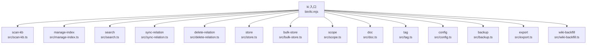
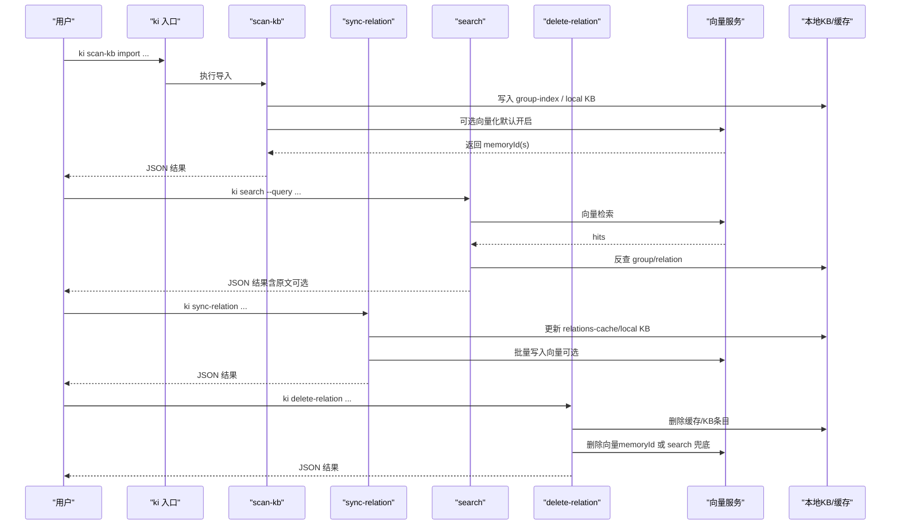
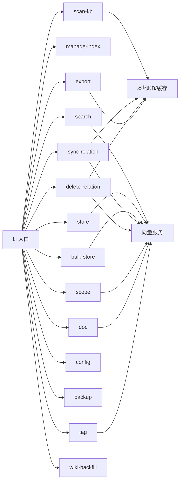

# CLI 命令参考

<cite>
**本文引用的文件**
- [bin/ki.mjs](file://bin/ki.mjs)
- [src/scan-kb.ts](file://src/scan-kb.ts)
- [src/manage-index.ts](file://src/manage-index.ts)
- [src/search.ts](file://src/search.ts)
- [src/sync-relation.ts](file://src/sync-relation.ts)
- [src/delete-relation.ts](file://src/delete-relation.ts)
- [src/store.ts](file://src/store.ts)
- [src/bulk-store.ts](file://src/bulk-store.ts)
- [src/scope.ts](file://src/scope.ts)
- [src/doc.ts](file://src/doc.ts)
- [src/tag.ts](file://src/tag.ts)
- [src/config.ts](file://src/config.ts)
- [src/backup.ts](file://src/backup.ts)
- [src/export.ts](file://src/export.ts)
- [src/wiki-backfill.ts](file://src/wiki-backfill.ts)
</cite>

## 目录
1. [简介](#简介)
2. [项目结构](#项目结构)
3. [核心组件](#核心组件)
4. [架构总览](#架构总览)
5. [详细命令参考](#详细命令参考)
6. [依赖关系分析](#依赖关系分析)
7. [性能与使用建议](#性能与使用建议)
8. [故障排除指南](#故障排除指南)
9. [结论](#结论)

## 简介
本参考文档面向使用者，系统化说明 ki 命令行工具的全部 19 个命令及其子命令。覆盖知识库导入、索引管理、搜索查询、关系操作、存储管理、范围与文档标签管理等常用场景。每个命令提供语法、参数、返回值格式、示例与错误处理要点，帮助快速上手并稳定集成到自动化流程中。

## 项目结构
ki 的入口为 bin/ki.mjs，负责解析全局参数（如 --config）、分发到具体命令脚本；各命令脚本基于 commander 定义子命令与选项，调用 lib 层能力完成实际工作。

图表来源
- [bin/ki.mjs:29-49](file://bin/ki.mjs#L29-L49)

章节来源
- [bin/ki.mjs:1-133](file://bin/ki.mjs#L1-L133)

## 核心组件
- 统一入口：bin/ki.mjs 提供版本、帮助、命令路由、--config 全局参数、守护进程模式（mcp）等。
- 向量服务：多数命令通过 vector-client 与 zvec 引擎交互，支持可用性检测、批量写入/删除、列表/计数等。
- 本地 KB：relations-cache.json、group-index.json、local KB index.json 构成结构化知识层。
- Wiki 写回：部分命令支持将关系内容写回 wiki 目录，便于版本管理与协作。

章节来源
- [bin/ki.mjs:29-49](file://bin/ki.mjs#L29-L49)
- [src/search.ts:11-18](file://src/search.ts#L11-L18)
- [src/sync-relation.ts:16-35](file://src/sync-relation.ts#L16-L35)

## 架构总览
下图展示典型“导入→索引→检索”的数据流：外部 Markdown 经 scan-kb import 写入 KB 层与向量层；search 通过向量检索并反查 relations-cache 定位原文；sync-relation 用于 AI 生成的关系回写；delete-relation 清理缓存、KB、Wiki 与向量。

图表来源
- [src/scan-kb.ts:35-78](file://src/scan-kb.ts#L35-L78)
- [src/search.ts:70-199](file://src/search.ts#L70-L199)
- [src/sync-relation.ts:407-786](file://src/sync-relation.ts#L407-L786)
- [src/delete-relation.ts:83-176](file://src/delete-relation.ts#L83-L176)

## 详细命令参考

### 通用约定
- 所有命令输出均为 JSON 对象，便于脚本解析。
- scope 行为受配置 mode 影响：default 可省略，strict 必须显式传入已注册 scope。
- 破坏性操作通常需要 --yes 确认。

章节来源
- [bin/ki.mjs:74-131](file://bin/ki.mjs#L74-L131)

### 1) scan-kb（知识库导入）
- 子命令：import
- 用途：从外部 Markdown 目录导入知识库，自动切分，幂等追加；可选择是否向量化。
- 语法：
  - ki scan-kb import --source <dir> [--scope <s>] [--group <g>] [--chunk-size <n>] [--chunk-overlap <n>] [--no-vector] [--tags <t1,t2,...>] [--no-clean] [--clean-rules <rules>]
- 关键参数：
  - --source：必填，外部 Wiki 根目录
  - --scope：隔离标识（default 模式可省略）
  - --group：目标 Group 路径（不存在自动创建）
  - --chunk-size/--chunk-overlap：文本切分参数
  - --no-vector：仅写 KB 层，不产生 memoryId
  - --tags：文档级自定义标签（逗号分隔），非向量化时仅持久化到 relation.tags
  - --no-clean/--clean-rules：数据清洗开关与规则覆盖
- 返回值（JSON）：
  - ok: true/false
  - 成功时包含导入统计信息；失败时包含 error 字段
- 示例：
  - ki scan-kb import --source ./wiki --scope my-project --group docs
- 错误处理：
  - 向量不可用或非向量化模式会跳过向量写入
  - 自动备份失败不影响主流程，仅告警

章节来源
- [src/scan-kb.ts:35-78](file://src/scan-kb.ts#L35-L78)

### 2) manage-index（Group 树索引管理）
- 子命令：create | delete | list-scopes
- 用途：创建/删除 Group 节点，列出所有 scope 及顶层 Group
- 语法：
  - ki manage-index --action create|delete|list-scopes [--scope <s>] [--parent <path>] [--name <name>] [--force]
- 关键参数：
  - --action：create/delete/list-scopes
  - --scope：除 list-scopes 外均需
  - --parent/--name：创建/删除时的父节点与名称
  - --force：强制删除非空节点
- 返回值（JSON）：
  - create/delete：ok + path/hint/cascade 统计
  - list-scopes：ok + scopes[] + total
- 示例：
  - ki manage-index --action create --scope my-project --parent wiki --name API
  - ki manage-index --action delete --scope my-project --name API --force
  - ki manage-index --action list-scopes
- 错误处理：
  - 父路径不存在、重复节点名、非空节点未加 --force 均报错并给出提示

章节来源
- [src/manage-index.ts:415-635](file://src/manage-index.ts#L415-L635)

### 3) search（语义检索）
- 用途：对知识库进行语义检索，支持 tag 过滤、阈值、返回原文等
- 语法：
  - ki search [query] [--scope <s>] [--query <q>] [--limit <n>] [--threshold <f>] [--tags <t1,t2>] [--original]
- 关键参数：
  - query：位置参数或 --query
  - limit/threshold/tags：限制条数、相似度阈值、标签过滤
  - original：返回 local KB 文件级原文（默认不返回）
- 返回值（JSON）：
  - ok: true/false
  - results[]：每条命中包含 score、content、group、relation、originalRetrieved/original/originalHint/deduplicated 等
- 示例：
  - ki search "登录流程" --scope my-project --limit 5 --threshold 0.6
- 错误处理：
  - 向量服务不可用时返回 degraded=true 的错误消息

章节来源
- [src/search.ts:204-237](file://src/search.ts#L204-L237)
- [src/search.ts:70-199](file://src/search.ts#L70-L199)

### 4) sync-relation（关系写入）
- 用途：将 AI 提供的关系与模块信息写入缓存与本地 KB，支持单条与批量；可选择向量化
- 语法：
  - 单条：ki sync-relation --scope <s> --group <g> --relation <r> --module-info <text> [--vector|--no-vector] [--tags <t>]
  - 批量：ki sync-relation --scope <s> --input <jsonFile> [--vector|--no-vector]
- 关键参数：
  - --input：批量输入文件，格式 {"items":[{"group","relation","module_info","tags"}]}
  - --vector/--no-vector：是否写入向量层（默认写入）
  - --tags：文档级自定义标签（叠加在默认 ki-search 之上）
- 返回值（JSON）：
  - 单条：ok + scope + relation + evicted + vectorStored/vectorReason + wikiSynced/wikiFile/wikiReason
  - 批量：ok + total/succeeded/failed/skipped/results[] + vectorStored + hints[]
- 示例：
  - ki sync-relation --scope my-project --group wiki/docs --relation "认证流程" --module-info "# 认证流程\n..."
  - ki sync-relation --scope my-project --input batch.json
- 错误处理：
  - module_info 为空或 relation 含非法字符会被跳过并计入 failed
  - 向量服务不可用或写入失败会记录 reason，但不阻塞 KB 层

章节来源
- [src/sync-relation.ts:407-786](file://src/sync-relation.ts#L407-L786)

### 5) delete-relation（删除关系）
- 用途：删除指定 Relation 或整个 Group 及其关联数据（cache + KB + wiki + 向量）
- 语法：
  - 单条：ki delete-relation --scope <s> --group <g> --relation <r>
  - 目录：ki delete-relation --scope <s> --group <g>
  - 批量：ki delete-relation --scope <s> --input <jsonFile>
- 关键参数：
  - --group：必填；省略 --relation 表示删除整个 group
  - --input：批量删除，格式 {"items":[{"group","relation"}]}
- 返回值（JSON）：
  - 单条：ok + result{deleted, cacheRemoved, kbRemoved, wikiRemoved, memRemoved, memMethod, reason}
  - 目录：ok + result{deleted, relationCount, wikiMoved, nodeRemoved, vectorRemoved, reason}
  - 批量：ok + results[] + total + failed
- 示例：
  - ki delete-relation --scope my-project --group wiki/docs --relation "认证流程"
  - ki delete-relation --scope my-project --group wiki/docs
- 错误处理：
  - 向量服务不可用会跳过向量删除并记录 reason
  - 无 memoryId 时走 search 严格匹配兜底删除

章节来源
- [src/delete-relation.ts:598-662](file://src/delete-relation.ts#L598-L662)
- [src/delete-relation.ts:83-176](file://src/delete-relation.ts#L83-L176)

### 6) store（存储文本到向量索引）
- 用途：将文本向量化并存储到向量索引
- 语法：
  - ki store [text] [--scope <s>] [--text <t>] [--tags <tag>]
- 关键参数：
  - text：位置参数或 --text
  - tags：默认 ki-search
- 返回值（JSON）：
  - ok: true/false; 成功时包含 docId
- 示例：
  - ki store "用户权限模型" --scope my-project
- 错误处理：
  - 向量服务不可用直接返回错误

章节来源
- [src/store.ts:55-80](file://src/store.ts#L55-L80)

### 7) bulk-store（批量存储）
- 用途：批量向量化并存储文本
- 语法：
  - ki bulk-store --scope <s> --input <batch.json>
- 输入格式：
  - [{"text":"...","tags":"ki-search"}, ...]
- 返回值（JSON）：
  - ok: true/false; 成功时包含 total/succeeded/failed/results[]
- 示例：
  - ki bulk-store --scope my-project --input items.json
- 错误处理：
  - 输入文件不存在或格式错误会返回明确错误

章节来源
- [src/bulk-store.ts:82-99](file://src/bulk-store.ts#L82-L99)

### 8) scope（范围管理）
- 子命令：list | delete | clear
- 用途：管理 scope 的生命周期（KB 目录层 + 向量语义层）
- 语法：
  - ki scope list [--json]
  - ki scope delete <name> [--yes]
  - ki scope clear <name> [--tags <t1,t2>] [--yes]
- 关键参数：
  - --json：以 JSON 输出
  - --tags：仅清向量层对应 tag（不清 KB）
  - --yes：确认执行
- 返回值（JSON）：
  - list：ok + scopeMode + vectorAvailable + scopes[] + count
  - delete/clear：ok + 删除数量/状态
- 示例：
  - ki scope list
  - ki scope delete my-project --yes
  - ki scope clear my-project --tags ki-search --yes
- 错误处理：
  - default 不可删除；向量服务不可用时拒绝破坏性操作

章节来源
- [src/scope.ts:235-294](file://src/scope.ts#L235-L294)

### 9) doc（向量文档管理）
- 子命令：list | delete
- 用途：查看与删除向量层文档（管理面）
- 语法：
  - ki doc list [--scope <s>] [--limit <n>] [--tags <t1,t2>] [--full]
  - ki doc delete <docid...> [--scope <s>] [--yes]
- 关键参数：
  - --limit/--tags/--full：限制条数、按 tag 过滤、显示完整内容
  - --yes：确认删除
- 返回值（JSON）：
  - list：ok + scope + tags + count + docs[]
  - delete：ok + requested/deleted/errors 或 requireConfirm/willDelete/notFound/scopeMismatch
- 示例：
  - ki doc list --scope my-project --limit 20 --tags ki-search
  - ki doc delete d1 d2 --scope my-project --yes
- 错误处理：
  - 跨 scope 的 docid 会被跳过（防误删）；未找到或向量不可用会返回相应提示

章节来源
- [src/doc.ts:150-189](file://src/doc.ts#L150-L189)

### 10) tag（标签发现）
- 子命令：list
- 用途：只读发现某 scope 下用过的 tag（含文档数）
- 语法：
  - ki tag list [--scope <s>] [--scan-limit <n>]
- 关键参数：
  - --scan-limit：扫描上限，超出则 truncated:true
- 返回值（JSON）：
  - ok + scope + count + scanned + truncated + tags[]
- 示例：
  - ki tag list --scope my-project
- 错误处理：
  - 向量服务不可用返回 degraded 错误

章节来源
- [src/tag.ts:55-72](file://src/tag.ts#L55-L72)

### 11) config（配置管理）
- 子命令：init
- 用途：生成 .ki/config.yaml 模板（含注释）
- 语法：
  - ki config init [--dir <path>] [--force]
- 关键参数：
  - --dir：目标目录（默认 $HOME）
  - --force：覆盖已有配置文件
- 返回值（JSON）：
  - ok + action + configPath + existed + createdDirs + message
- 示例：
  - ki config init --dir ~/my-ki --force
- 错误处理：
  - 目录创建失败不阻断 init，后续 doctor 可检出

章节来源
- [src/config.ts:179-204](file://src/config.ts#L179-L204)

### 12) backup（备份）
- 用途：手动备份 scope 目录快照或列出已有备份
- 语法：
  - ki backup <scope> [--list]
- 关键参数：
  - --list：列出备份
- 返回值（JSON）：
  - 备份：ok + action + scope + snapshot + snapshotPath + message
  - 列表：ok + action + scope + backups[]
- 示例：
  - ki backup my-project
  - ki backup my-project --list
- 错误处理：
  - 未初始化或缺少 relations-cache.json 时报错

章节来源
- [src/backup.ts:26-108](file://src/backup.ts#L26-L108)

### 13) export（导出）
- 用途：将 KB scope 的结构化数据导出为 Markdown 目录
- 语法：
  - ki export <scope> --output <dir> [--group <path>] [--yes]
- 关键参数：
  - --output：输出目录（必填）
  - --group：指定导出 group 路径（缺省全量导出）
  - --yes：确认覆盖非空输出目录
- 返回值（JSON）：
  - ok + action + scope + outputDir + stats{total/exported/empty} + skipped[]
- 示例：
  - ki export my-project --output ./wiki-output --group wiki/docs
- 错误处理：
  - 输出目录存在且非空需 --yes；未初始化或缺少必要文件时报错

章节来源
- [src/export.ts:324-399](file://src/export.ts#L324-L399)

### 14) wiki-backfill（历史补齐）
- 用途：将 KB 中已有 Relations 全量写回 Wiki（幂等）
- 语法：
  - ki wiki-backfill <scope> [--force]
- 关键参数：
  - --force：全量覆盖写（刷新 exportedAt）
- 返回值（JSON）：
  - ok + 统计信息（由 backfillWiki 实现决定）
- 示例：
  - ki wiki-backfill my-project --force
- 错误处理：
  - 未启用 wikiSync 或缺少目标目录时会失败

章节来源
- [src/wiki-backfill.ts:39-69](file://src/wiki-backfill.ts#L39-L69)

### 15) mcp（MCP 服务）
- 用途：启动 MCP Server（stdio 默认；--http 共享单例；支持 daemon 后台常驻）
- 语法：
  - ki mcp
  - ki mcp --http [--host <addr>] [--daemon|-d]
  - ki mcp restart
  - ki mcp token generate/list/update/delete
  - ki mcp --status
- 关键参数：
  - --http：HTTP 模式（默认回环 127.0.0.1，本机免鉴权）
  - --daemon/-d：后台常驻（仅 HTTP 模式有效）
  - --host：监听地址（远程需 Bearer Token）
- 返回值：
  - 后台启动成功后打印提示信息；--status 返回运行状态
- 示例：
  - ki mcp --http --daemon
  - ki mcp token generate --scope team-a
- 错误处理：
  - 预检失败（token 缺失/端口冲突）会前台报错；daemon 模式下父进程探测退出码并提示

章节来源
- [bin/ki.mjs:154-197](file://bin/ki.mjs#L154-L197)

### 16) get-module-info（读取本地 KB 原文）
- 用途：读取本地 KB 中的原文内容（配合其他命令使用）
- 语法：
  - ki get-module-info --scope <s> --group <g> --relation <r>
- 返回值（JSON）：
  - ok + scope + content/moduleInfo
- 示例：
  - ki get-module-info --scope my-project --group wiki/docs --relation "认证流程"
- 错误处理：
  - 文件不存在或读取异常返回错误

章节来源
- [bin/ki.mjs:33-33](file://bin/ki.mjs#L33-L33)

### 17) query-group（查询 Group + 分区）
- 用途：查询 Group 树结构与分区信息
- 语法：
  - ki query-group --scope <s> [--group <g>]
- 返回值（JSON）：
  - ok + groups[] + partitions[]
- 示例：
  - ki query-group --scope my-project
- 错误处理：
  - 未初始化或缺少 group-index.json 时报错

章节来源
- [bin/ki.mjs:32-32](file://bin/ki.mjs#L32-L32)

### 18) restore（还原）
- 用途：从快照还原 scope 数据
- 语法：
  - ki restore <scope> --from-snapshot <snapshot> [--rebuild-vector] [--yes]
- 关键参数：
  - --from-snapshot：指定快照文件
  - --rebuild-vector：重建向量索引
  - --yes：确认还原
- 返回值（JSON）：
  - ok + restoredScope + rebuiltVector?
- 示例：
  - ki restore my-project --from-snapshot snapshot.tar.gz --rebuild-vector --yes
- 错误处理：
  - 快照不存在或还原失败返回错误

章节来源
- [bin/ki.mjs:46-46](file://bin/ki.mjs#L46-L46)

### 19) doctor（诊断）
- 用途：检查配置、apiKey 连通性、维度、目录等
- 语法：
  - ki doctor
- 返回值（JSON）：
  - ok + checks[] + issues[]
- 示例：
  - ki doctor
- 错误处理：
  - 检测到问题会列出具体原因与建议修复步骤

章节来源
- [bin/ki.mjs:44-44](file://bin/ki.mjs#L44-L44)

## 依赖关系分析
- 入口与命令映射：bin/ki.mjs 维护命令到脚本的映射，支持 --config 全局参数与守护进程模式。
- 向量服务依赖：search/store/bulk-store/sync-relation/delete-relation/scope/doc/tag 等均依赖 vector-client。
- 本地 KB 依赖：scan-kb/sync-relation/export 依赖 group-index.json、relations-cache.json、local KB index.json。
- Wiki 写回：sync-relation 与 delete-relation 支持将关系写回或移入回收站。

图表来源
- [bin/ki.mjs:29-49](file://bin/ki.mjs#L29-L49)
- [src/search.ts:11-18](file://src/search.ts#L11-L18)
- [src/sync-relation.ts:16-35](file://src/sync-relation.ts#L16-L35)

章节来源
- [bin/ki.mjs:29-49](file://bin/ki.mjs#L29-L49)

## 性能与使用建议
- 批量优先：sync-relation 与 bulk-store 支持批量写入，减少 HTTP 往返与 worker 调用开销。
- 阈值与限制：search 使用 threshold 控制召回质量；doc list/tag list 使用 limit/scan-limit 控制负载。
- 非向量化模式：scan-kb 与 sync-relation 支持 --no-vector，适用于仅需 KB 层的场景。
- 原文获取：search 的 --original 仅在需要时开启，避免额外 IO。
- 向量服务可用性：多数命令在执行前检测向量服务，不可用时降级或报错，建议在自动化流程中捕获并重试。

[本节为通用指导，无需特定文件引用]

## 故障排除指南
- 向量服务不可用：
  - 现象：search/store/bulk-store/sync-relation/delete-relation/scope/doc/tag 返回错误并标注原因
  - 处理：检查 embedding 配置、网络连通性与端口占用；必要时重启服务或切换 provider
- 未初始化 scope：
  - 现象：backup/export 提示缺少 relations-cache.json
  - 处理：先执行 scan-kb import 或相关导入流程
- 覆盖保护：
  - 现象：export 输出目录非空需 --yes；scope delete/clear 需 --yes
  - 处理：确认业务意图后添加 --yes；或使用不同输出目录
- 路径与命名：
  - 现象：manage-index 创建/删除报父路径不存在或重复节点名
  - 处理：检查 parent/name 合法性；使用 list-scopes 与 query-group 辅助定位
- 向量删除兜底：
  - 现象：delete-relation 无 memoryId 时走 search 严格匹配兜底
  - 处理：确保 relation 名称作为标题前缀出现；必要时重建向量

章节来源
- [src/search.ts:84-92](file://src/search.ts#L84-L92)
- [src/backup.ts:84-90](file://src/backup.ts#L84-L90)
- [src/export.ts:375-387](file://src/export.ts#L375-L387)
- [src/manage-index.ts:469-496](file://src/manage-index.ts#L469-L496)
- [src/delete-relation.ts:431-473](file://src/delete-relation.ts#L431-L473)

## 结论
本参考文档覆盖了 ki 的全部 19 个命令，提供了清晰的语法、参数、返回值与示例，并结合架构图与流程图帮助理解数据流向与依赖关系。结合故障排除指南，可在生产环境中稳定使用这些命令完成知识库导入、索引管理、检索与关系维护等任务。建议在实际使用中结合 --help 与 JSON 输出进行自动化编排，并根据业务需求选择合适的向量化策略与批处理方式。