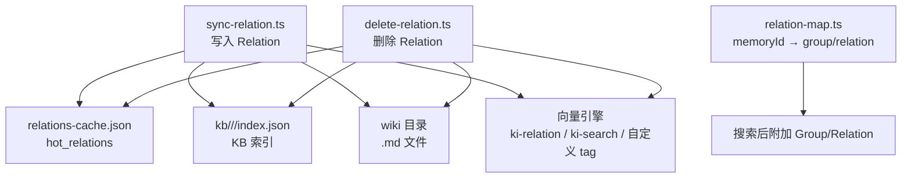
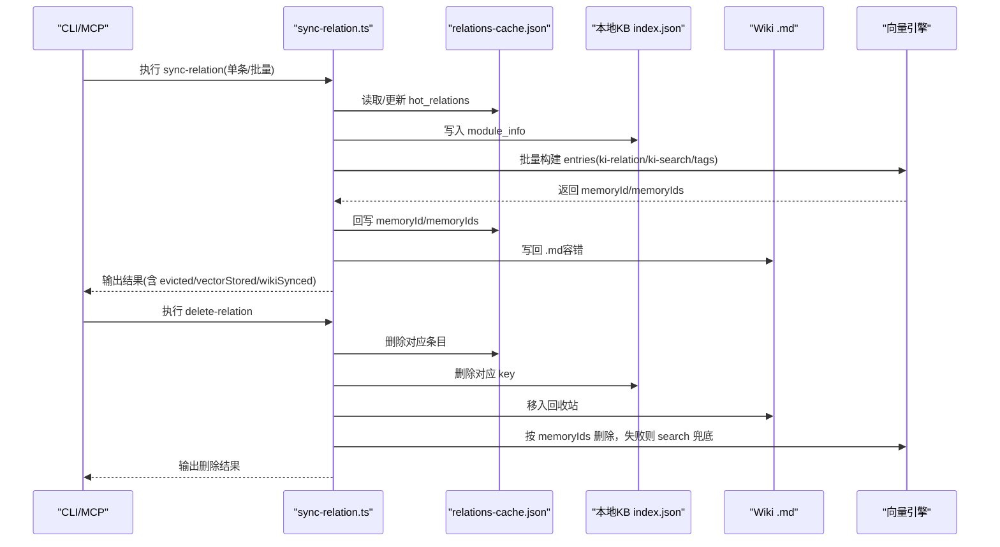
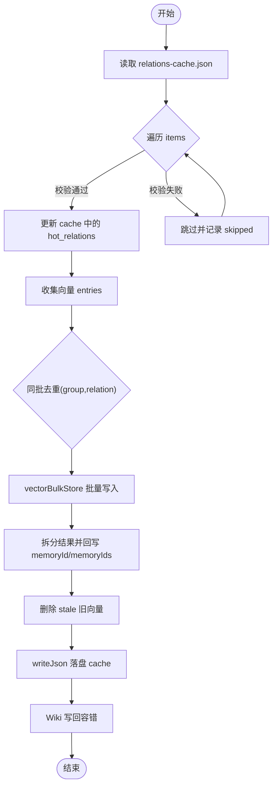
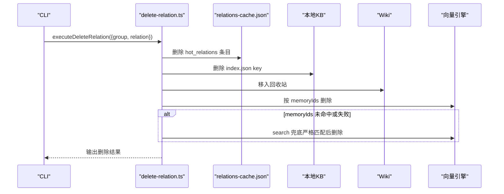
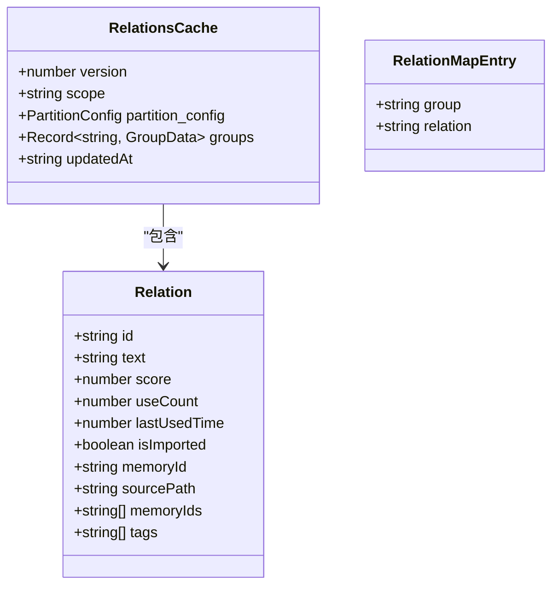
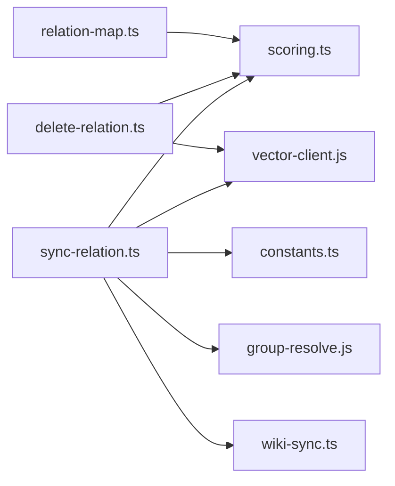

# 关系管理命令

<cite>
**本文引用的文件**
- [src/sync-relation.ts](file://src/sync-relation.ts)
- [src/delete-relation.ts](file://src/delete-relation.ts)
- [src/lib/relation-map.ts](file://src/lib/relation-map.ts)
- [src/lib/scoring.ts](file://src/lib/scoring.ts)
- [src/lib/constants.ts](file://src/lib/constants.ts)
- [src/lib/wiki-sync.ts](file://src/lib/wiki-sync.ts)
- [test/sync-relation.test.ts](file://test/sync-relation.test.ts)
</cite>

## 目录
1. [简介](#简介)
2. [项目结构](#项目结构)
3. [核心组件](#核心组件)
4. [架构总览](#架构总览)
5. [详细组件分析](#详细组件分析)
6. [依赖关系分析](#依赖关系分析)
7. [性能考量](#性能考量)
8. [故障排查指南](#故障排查指南)
9. [结论](#结论)
10. [附录：实用示例与恢复方法](#附录实用示例与恢复方法)

## 简介
本文件面向“关系管理”相关命令，聚焦以下目标：
- 详细说明 sync-relation 命令如何写入 Relation 及其关联数据（缓存、本地 KB、Wiki、向量），包括批量处理、事务性保证、冲突解决机制。
- 记录 delete-relation 命令删除 Relation 及其关联数据（cache + KB + wiki + 向量）的完整清理流程。
- 解释关系映射的数据结构、缓存策略和一致性保证。
- 提供关系操作的实用示例与故障恢复方法。

## 项目结构
围绕关系管理的代码主要分布在以下模块：
- 命令入口与业务编排：sync-relation.ts、delete-relation.ts
- 评分与数据结构：scoring.ts、constants.ts
- 反查映射与缓存：relation-map.ts
- Wiki 同步与路径解析：wiki-sync.ts（被 sync-relation.ts 调用）
- 测试用例：test/sync-relation.test.ts（覆盖单条/批量/淘汰等场景）

图表来源
- [src/sync-relation.ts:129-221](file://src/sync-relation.ts#L129-L221)
- [src/delete-relation.ts:83-176](file://src/delete-relation.ts#L83-L176)
- [src/lib/relation-map.ts:48-78](file://src/lib/relation-map.ts#L48-L78)

章节来源
- [src/sync-relation.ts:1-800](file://src/sync-relation.ts#L1-L800)
- [src/delete-relation.ts:1-662](file://src/delete-relation.ts#L1-L662)
- [src/lib/relation-map.ts:1-120](file://src/lib/relation-map.ts#L1-L120)

## 核心组件
- sync-relation.ts：负责 Relation 的写入（单条/批量）、缓存更新、KB 写入、Wiki 写回、向量写入（批量 embed + upsert）、结果拆分与 memoryId/memoryIds 回写。
- delete-relation.ts：负责 Relation 或整个 Group 的删除，覆盖 cache、KB、wiki（移入回收站）、向量（优先 memoryIds，search 兜底）。
- relation-map.ts：维护 memoryId 到 {group, relation} 的反查映射，带 TTL 与 mtime/size 失效策略。
- scoring.ts：定义 Relation 数据结构、评分计算、使用防刷、分区逻辑。
- constants.ts：默认分区配置、标签解析、常量。
- wiki-sync.ts：用于将 Relation 内容写回 Wiki 文件（sync-relation 中调用）。

章节来源
- [src/sync-relation.ts:129-221](file://src/sync-relation.ts#L129-L221)
- [src/delete-relation.ts:83-176](file://src/delete-relation.ts#L83-L176)
- [src/lib/relation-map.ts:48-78](file://src/lib/relation-map.ts#L48-L78)
- [src/lib/scoring.ts:19-36](file://src/lib/scoring.ts#L19-L36)
- [src/lib/constants.ts:24-50](file://src/lib/constants.ts#L24-L50)

## 架构总览
下图展示了 sync-relation 与 delete-relation 在写入/删除时的端到端交互，包括缓存、KB、Wiki、向量层。

图表来源
- [src/sync-relation.ts:245-339](file://src/sync-relation.ts#L245-L339)
- [src/sync-relation.ts:407-787](file://src/sync-relation.ts#L407-L787)
- [src/delete-relation.ts:83-176](file://src/delete-relation.ts#L83-L176)
- [src/delete-relation.ts:383-473](file://src/delete-relation.ts#L383-L473)

## 详细组件分析

### sync-relation：写入 Relation 及关联数据
- 单条写入流程
  - 确保 Group 路径在 group-index.json 中存在（自动补建缺失节点）。
  - 若 group 不存在则初始化 hot_relations、keywords、max_hot_count。
  - 查找或创建 Relation；重复写入会更新 useCount、lastUsedTime、score，并重新排序。
  - 达到 maxHotCount 时淘汰最低分 Relation。
  - 写入本地 KB（module_info）。
  - 可选 Wiki 写回（容错）。
  - 可选向量写入（见下节批量模式）。

- 批量模式（executeBulkSyncRelation）
  - 阶段 1：循环 syncSingleRelation 修改内存中的 cache，同时收集向量 entries（ki-relation、ki-search、自定义 tags）。
  - 阶段 1.5：同批内 (group, relation) 去重，避免重复向量写入与后续误删。
  - 阶段 2：一次 vectorBulkStore 批量 embed + upsert（显著减少 HTTP 往返与 worker 串行写入）。
  - 阶段 3：拆分结果，回写 memoryId/memoryIds 到 cache；聚合删除 stale 旧向量（先写后删，写失败不删旧）。
  - 阶段 4：一次 writeJson 落盘 cache。
  - 阶段 5：各自 Wiki 写回（文件路径不同，天然无冲突）。
  - 非向量化模式（vector=false）：跳过步骤 2-3，仅 KB 层。

- 冲突解决机制
  - 同组内重复 Relation：更新 useCount/score，不新增条目。
  - 同批重复 (group, relation)：后一条覆盖前一条，剔除前一条的向量 entries，避免孤儿向量。
  - 向量服务不可用或部分失败：不阻塞 KB 层；结果透出 vectorStored/vectorReason，便于上层感知与重试。

- 事务性保证
  - 采用“先写后删”的策略：新向量写入成功后才删除旧向量；若删除失败，保留旧向量，避免“删旧丢新”。
  - 批量写入异常时，标记所有未跳过项的向量状态为失败，但不影响已落盘的 cache/KB。
  - Wiki 写回失败不影响主流程（容错）。

图表来源
- [src/sync-relation.ts:407-787](file://src/sync-relation.ts#L407-L787)

章节来源
- [src/sync-relation.ts:129-221](file://src/sync-relation.ts#L129-L221)
- [src/sync-relation.ts:245-339](file://src/sync-relation.ts#L245-L339)
- [src/sync-relation.ts:407-787](file://src/sync-relation.ts#L407-L787)

### delete-relation：删除 Relation 及其关联数据
- 单条删除流程
  - 从 relations-cache.json 删除对应条目（若存在）。
  - 从本地 KB index.json 删除对应 key（若存在）。
  - 将 wiki .md 文件移入回收站（不再物理删除）。
  - 删除向量记忆：优先按 memoryIds 多值删除；若无 memoryId 或失败，则走 search 兜底严格匹配后删除。
  - 持久化 cache。

- 目录级删除（executeDeleteGroup）
  - 级联收集该 group 及其子 group 的所有 Relation。
  - 聚合 memoryIds 并批量删除向量（忽略 NOT_FOUND）。
  - 从 relations-cache 删除全部子 group 键。
  - 递归删除本地 KB 目录。
  - 将该 group 的 wiki 目录移入回收站。
  - 删除 group-index 树节点（空父节点一并清理）。

- 向量删除策略
  - 优先 memoryIds：支持多 tag 内容向量全部清理。
  - Search 兜底：对 relation 名称进行严格匹配（标题行前缀），确认后再删除，避免误删。
  - 失败/部分失败：记录 reason，便于上层判断是否需要重建或重试。

图表来源
- [src/delete-relation.ts:83-176](file://src/delete-relation.ts#L83-L176)
- [src/delete-relation.ts:383-473](file://src/delete-relation.ts#L383-L473)

章节来源
- [src/delete-relation.ts:83-176](file://src/delete-relation.ts#L83-L176)
- [src/delete-relation.ts:207-310](file://src/delete-relation.ts#L207-L310)
- [src/delete-relation.ts:383-473](file://src/delete-relation.ts#L383-L473)

### 关系映射的数据结构与缓存策略
- 数据结构
  - Relation：包含 id、text、score、useCount、lastUsedTime、isImported、memoryId、sourcePath、memoryIds[]、tags[]。
  - RelationsCache：version、scope、partition_config、groups（每个 group 含 hot_relations、keywords、max_hot_count）、updatedAt。
  - RelationMapEntry：{group, relation}，用于 memoryId 反查。

- 缓存策略（relation-map.ts）
  - 模块级单例 Map<scope, {builtAt, mtimeMs, size, map}>。
  - 命中条件：relations-cache.json 的 mtime + size 均未变且距构建时间未超 TTL（默认 10 分钟）。
  - 失效条件：文件被写入（mtime/size 变化）或 TTL 过期。
  - 懒构建：首次访问 O(N)，后续 O(1)。
  - 文件缺失/损坏：返回空 Map，搜索降级为不带附加字段。

图表来源
- [src/lib/scoring.ts:19-36](file://src/lib/scoring.ts#L19-L36)
- [src/sync-relation.ts:43-55](file://src/sync-relation.ts#L43-L55)
- [src/lib/relation-map.ts:23-28](file://src/lib/relation-map.ts#L23-L28)

章节来源
- [src/lib/scoring.ts:19-36](file://src/lib/scoring.ts#L19-L36)
- [src/sync-relation.ts:43-55](file://src/sync-relation.ts#L43-L55)
- [src/lib/relation-map.ts:48-78](file://src/lib/relation-map.ts#L48-L78)

### 评分与分区
- 评分计算：基于 useCount 与 lastUsedTime 的衰减公式，halfLifeHours 控制衰减速度。
- 使用防刷：5 分钟内重复使用不计分，上限 MAX_USE_COUNT。
- 分区：新兴热区、历史热区、常温区、冷区的划分与截断策略，确保热点容量可控。

章节来源
- [src/lib/scoring.ts:44-79](file://src/lib/scoring.ts#L44-L79)
- [src/lib/scoring.ts:90-200](file://src/lib/scoring.ts#L90-L200)
- [src/lib/constants.ts:24-50](file://src/lib/constants.ts#L24-L50)

## 依赖关系分析
- sync-relation.ts 依赖：
  - lib/store.js：读写 JSON（readJson/writeJson）。
  - lib/scope.js：路径解析与校验（getRelationsCachePath/getLocalKbDir/validateScope）。
  - lib/scoring.js：评分与 Relation 类型。
  - lib/constants.js：默认分区配置与标签解析。
  - lib/group-resolve.js：Group 路径解析。
  - lib/path-vectorize.js：构建 relation 内容。
  - lib/vector-client.js：向量批量存储与删除。
  - lib/wiki-sync.js：Wiki 写回。
  - lib/config.js：加载配置与 scope 解析。

- delete-relation.ts 依赖：
  - lib/store.js：读写 JSON。
  - lib/scope.js：路径解析与校验。
  - lib/group-resolve.js：Group 路径解析。
  - lib/vector-client.js：向量搜索与删除。
  - lib/config.js：加载配置与 wikiSync 信息。

- relation-map.ts 依赖：
  - lib/scope.js：获取 relations-cache 路径。
  - lib/scoring.js：Relation 类型。

图表来源
- [src/sync-relation.ts:16-35](file://src/sync-relation.ts#L16-L35)
- [src/delete-relation.ts:18-30](file://src/delete-relation.ts#L18-L30)
- [src/lib/relation-map.ts:19-21](file://src/lib/relation-map.ts#L19-L21)

章节来源
- [src/sync-relation.ts:16-35](file://src/sync-relation.ts#L16-L35)
- [src/delete-relation.ts:18-30](file://src/delete-relation.ts#L18-L30)
- [src/lib/relation-map.ts:19-21](file://src/lib/relation-map.ts#L19-L21)

## 性能考量
- 批量向量写入：一次 embedding HTTP + 一次 worker upsert，显著降低网络与序列化开销。
- 去重优化：同批内 (group, relation) 去重，避免重复向量写入与后续误删。
- 聚合删除：stale 旧向量聚合一次 vectorDelete，避免 N 次串行删除稀释性能。
- 缓存命中：relation-map 使用 mtime/size + TTL 策略，减少频繁重建映射。
- 容错设计：向量服务不可用或部分失败不阻塞主流程，保障 KB 层可用性。

[本节为通用性能讨论，无需特定文件引用]

## 故障排查指南
- 向量服务不可用
  - 现象：vectorStored=false，vectorReason 提示“向量服务不可用”。
  - 处理：检查向量服务健康状态；必要时启用非向量化模式（vector=false）仅写 KB 层。

- 部分内容向量写入失败
  - 现象：vectorStored=true 但带有 vectorReason，提示“部分内容向量写入失败，已保留旧向量”。
  - 处理：运行重建命令恢复缺失 tag 向量（如 ki restore --rebuild-vector）。

- 向量删除失败
  - 现象：memRemoved=false，reason 提示“search 兜底失败”或“vectorDelete 未删除任何条目”。
  - 处理：确认 memoryIds 是否正确；必要时手动重建向量或再次执行删除。

- Wiki 写回失败
  - 现象：wikiSynced=false，可能因权限或路径问题。
  - 处理：检查 wiki 目录权限与路径；可忽略（不影响主流程）。

章节来源
- [src/sync-relation.ts:607-745](file://src/sync-relation.ts#L607-L745)
- [src/delete-relation.ts:383-473](file://src/delete-relation.ts#L383-L473)

## 结论
- sync-relation 提供了健壮的关系写入能力，支持单条与批量模式，具备冲突解决、事务性保证与容错机制。
- delete-relation 实现了完整的清理流程，覆盖 cache、KB、wiki（回收站）与向量（memoryIds + search 兜底）。
- relation-map 提供高效的 memoryId 反查映射，结合 TTL 与文件变更检测，保障搜索体验与一致性。
- 建议在生产环境中监控向量服务状态，合理设置 maxHotCount 与 TTL，定期重建向量以保持一致性。

[本节为总结，无需特定文件引用]

## 附录：实用示例与恢复方法
- 单条写入 Relation
  - 命令：npx jiti src/sync-relation.ts --scope <scope> --group <group> --relation <relation> --module-info "<markdown>"
  - 验证：检查 relations-cache.json 中 hot_relations 是否新增；检查 kb/<scope>/<group>/index.json 是否写入。

- 批量写入 Relation
  - 输入格式：{"items":[{"group","relation","module_info"},...]}
  - 命令：npx jiti src/sync-relation.ts --scope <scope> --input <jsonFile>
  - 验证：检查结果中的 vectorStored、wikiSynced 字段；如有失败，根据 vectorReason 处理。

- 删除单个 Relation
  - 命令：npx jiti src/delete-relation.ts --scope <scope> --group <group> --relation <relation>
  - 验证：检查 cache/KB/Wiki/向量是否清理；wiki 文件应位于回收站。

- 删除整个 Group
  - 命令：npx jiti src/delete-relation.ts --scope <scope> --group <group>
  - 验证：检查 cache/KB/Wiki/group-index 是否清理；向量是否删除。

- 恢复方法
  - 向量重建：当部分向量缺失时，运行重建命令恢复（如 ki restore --rebuild-vector）。
  - Wiki 恢复：从回收站恢复误删的 .md 文件。
  - 缓存修复：若 cache 损坏，可从备份恢复或使用导入工具重建。

章节来源
- [test/sync-relation.test.ts:60-133](file://test/sync-relation.test.ts#L60-L133)
- [test/sync-relation.test.ts:136-190](file://test/sync-relation.test.ts#L136-L190)
- [test/sync-relation.test.ts:193-200](file://test/sync-relation.test.ts#L193-L200)