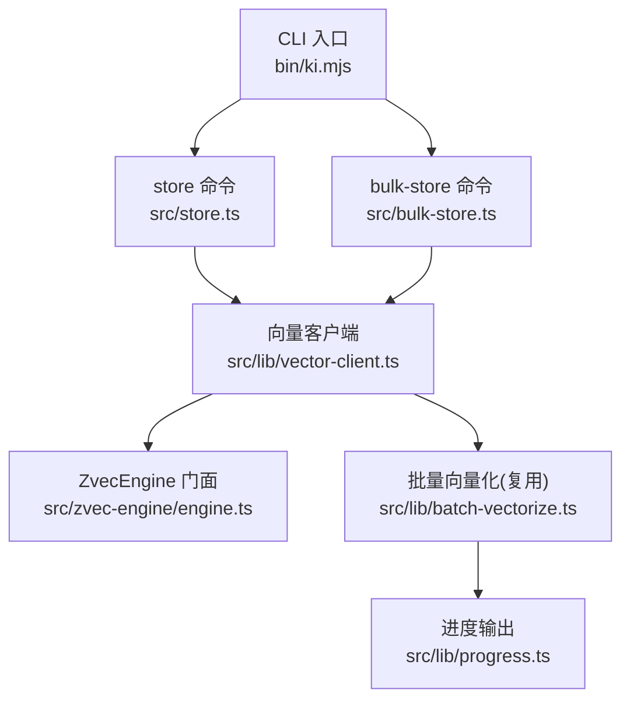
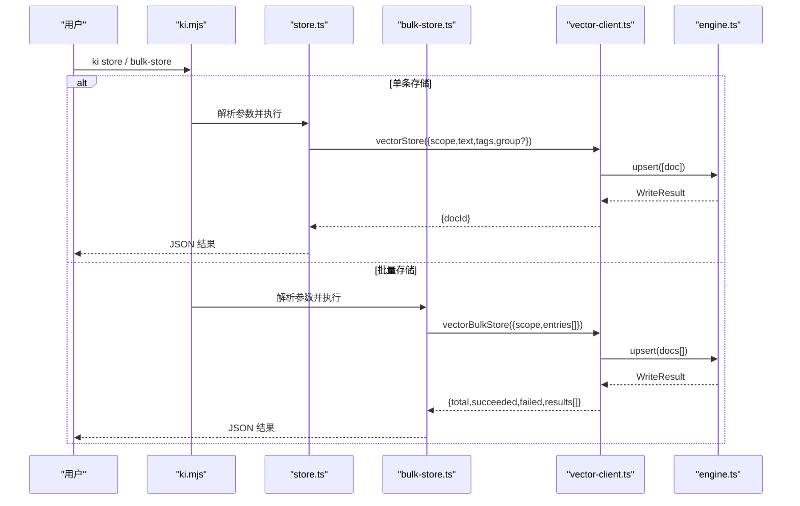
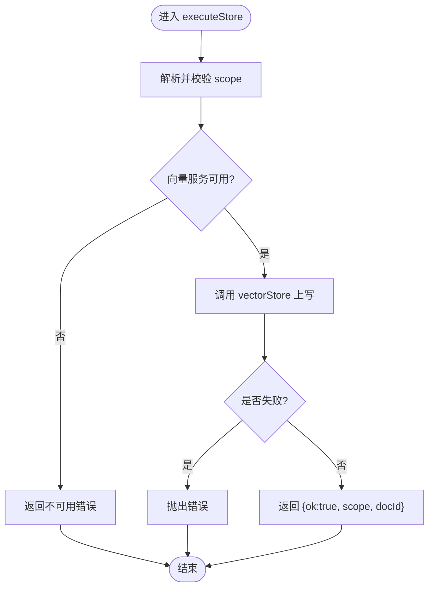
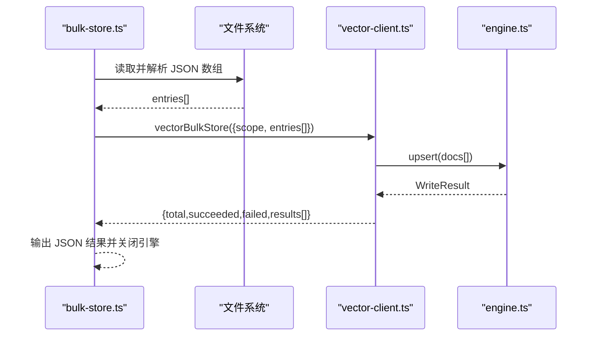
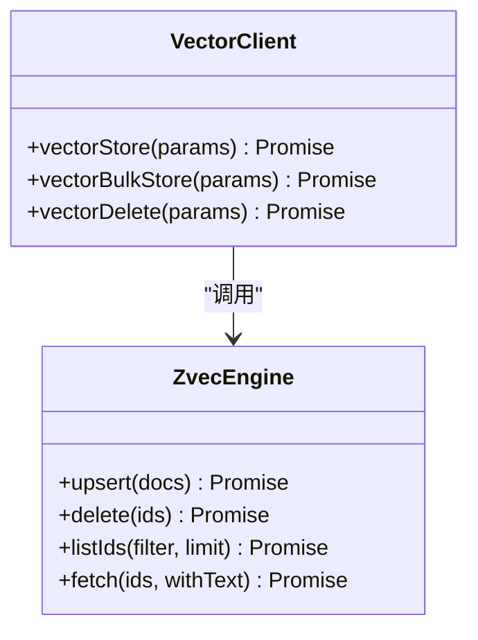
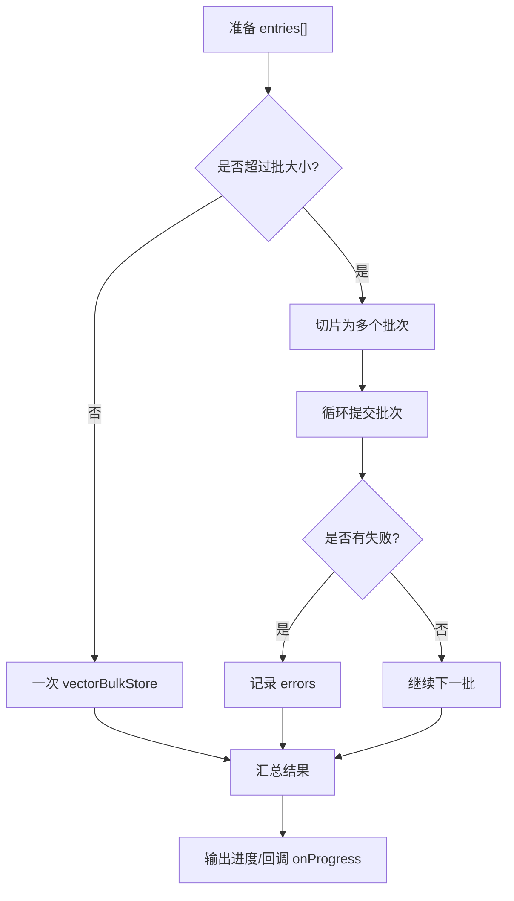
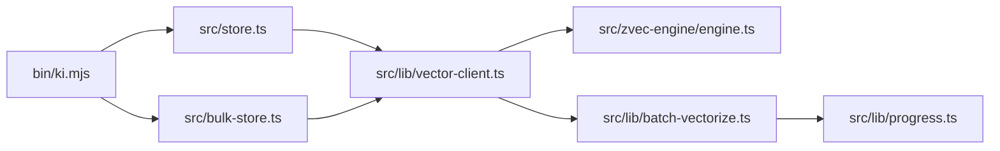

# 存储管理命令

<cite>
**本文引用的文件**
- [bin/ki.mjs](file://bin/ki.mjs)
- [src/store.ts](file://src/store.ts)
- [src/bulk-store.ts](file://src/bulk-store.ts)
- [src/lib/vector-client.ts](file://src/lib/vector-client.ts)
- [src/zvec-engine/engine.ts](file://src/zvec-engine/engine.ts)
- [src/lib/batch-vectorize.ts](file://src/lib/batch-vectorize.ts)
- [src/lib/progress.ts](file://src/lib/progress.ts)
- [docs/cli.md](file://docs/cli.md)
</cite>

## 目录
1. [简介](#简介)
2. [项目结构](#项目结构)
3. [核心组件](#核心组件)
4. [架构总览](#架构总览)
5. [详细组件分析](#详细组件分析)
6. [依赖关系分析](#依赖关系分析)
7. [性能考量](#性能考量)
8. [故障排查指南](#故障排查指南)
9. [结论](#结论)
10. [附录](#附录)

## 简介
本章节面向“存储管理”能力，聚焦以下目标：
- store 命令：将单条文本存储到向量索引，支持元数据（scope、tag、group）设置与标签管理。
- bulk-store 命令：批量存储文本到向量索引，提供批处理大小优化、错误重试策略说明、进度跟踪方式。
- 向量存储内部机制：upsert 幂等写入、索引构建过程、关键性能参数。
- 监控方法与性能优化建议：如何观察进度、定位失败项、调优批大小与嵌入批次。

## 项目结构
存储相关入口与实现分布在 CLI 入口、命令脚本、向量客户端与引擎层：
- CLI 入口负责命令路由与子进程执行。
- store.ts 与 bulk-store.ts 分别实现单条与批量存储的 CLI 与业务编排。
- vector-client.ts 封装向量存储/删除/列举等能力，并对接底层引擎。
- zvec-engine/engine.ts 提供引擎门面，组织嵌入、写入、检索等流程。
- batch-vectorize.ts 提供批量向量化与分批提交逻辑（供导入链路复用）。
- progress.ts 提供控制台进度输出（stderr），不污染 JSON 结果。
- docs/cli.md 提供 CLI 使用说明与参数约定。

图表来源
- [bin/ki.mjs:29-49](file://bin/ki.mjs#L29-L49)
- [src/store.ts:12-16](file://src/store.ts#L12-L16)
- [src/bulk-store.ts:19-24](file://src/bulk-store.ts#L19-L24)
- [src/lib/vector-client.ts:535-617](file://src/lib/vector-client.ts#L535-L617)
- [src/zvec-engine/engine.ts:62-93](file://src/zvec-engine/engine.ts#L62-L93)
- [src/lib/batch-vectorize.ts:129-173](file://src/lib/batch-vectorize.ts#L129-L173)
- [src/lib/progress.ts:36-49](file://src/lib/progress.ts#L36-L49)

章节来源
- [bin/ki.mjs:29-49](file://bin/ki.mjs#L29-L49)
- [docs/cli.md:5-19](file://docs/cli.md#L5-L19)

## 核心组件
- store 命令：解析参数、校验 scope、确保向量服务可用、调用 vectorStore 完成幂等 upsert，返回 docId。
- bulk-store 命令：读取 JSON 数组输入、校验字段、构造 entries 并调用 vectorBulkStore，返回 total/succeeded/failed/results。
- 向量客户端：统一封装 upsert/delete/list/count 等操作；对 text 长度、tag 规范化、docId 生成进行约束。
- ZvecEngine：维护 schema、允许字段集、默认批大小与嵌入批次；通过 proxy 与 worker 通信完成实际写入与检索。
- 批量向量化：按固定批次大小分片提交，避免一次性过大负载，并提供进度回调。
- 进度输出：stderr 进度条，非 TTY 时逐行输出，保证 JSON stdout 纯净。

章节来源
- [src/store.ts:23-51](file://src/store.ts#L23-L51)
- [src/bulk-store.ts:32-78](file://src/bulk-store.ts#L32-L78)
- [src/lib/vector-client.ts:535-617](file://src/lib/vector-client.ts#L535-L617)
- [src/zvec-engine/engine.ts:62-93](file://src/zvec-engine/engine.ts#L62-L93)
- [src/lib/batch-vectorize.ts:129-173](file://src/lib/batch-vectorize.ts#L129-L173)
- [src/lib/progress.ts:36-49](file://src/lib/progress.ts#L36-L49)

## 架构总览
下图展示从 CLI 到引擎的完整调用链，以及单条与批量两条路径的分流与汇聚点。

图表来源
- [bin/ki.mjs:29-49](file://bin/ki.mjs#L29-L49)
- [src/store.ts:55-80](file://src/store.ts#L55-L80)
- [src/bulk-store.ts:82-99](file://src/bulk-store.ts#L82-L99)
- [src/lib/vector-client.ts:535-617](file://src/lib/vector-client.ts#L535-L617)
- [src/zvec-engine/engine.ts:62-93](file://src/zvec-engine/engine.ts#L62-L93)

## 详细组件分析

### store 命令（单条存储）
- 功能要点
  - 支持位置参数或 --text 传入待存储文本。
  - 支持 --scope 指定隔离空间，strict 模式下需已注册。
  - 支持 --tags 设置标签，默认 ki-search。
  - 自动校验向量服务可用性，不可用时给出明确原因。
  - 调用 vectorStore 完成幂等 upsert，返回 docId。
  - CLI 每次调用结束后关闭引擎，避免进程无法退出。
- 元数据与标签
  - 元数据包含 scope、tag、可选 group，均写入 fields。
  - tag 会做规范化处理，便于后续过滤与检索。
- 错误处理
  - 文本超长直接抛错。
  - 向量服务不可用返回结构化错误信息。
  - 其他异常捕获后以 ok:false + error 形式返回。

图表来源
- [src/store.ts:23-51](file://src/store.ts#L23-L51)
- [src/lib/vector-client.ts:535-569](file://src/lib/vector-client.ts#L535-L569)

章节来源
- [src/store.ts:23-80](file://src/store.ts#L23-L80)
- [src/lib/vector-client.ts:535-569](file://src/lib/vector-client.ts#L535-L569)

### bulk-store 命令（批量存储）
- 功能要点
  - 通过 --input 指定 JSON 数组文件，每项至少包含 text，可选 tags。
  - 自动为缺失 tags 补默认值。
  - 调用 vectorBulkStore 批量 upsert，返回 total/succeeded/failed/results。
  - 逐项 results 包含 index/success/memoryId/error，便于定位失败条目。
- 批处理大小与优化
  - 上层未强制切分，由 vector-client 与 engine 内部批处理控制。
  - 推荐在导入链路使用 batch-vectorize 的 200 条/批策略，以获得更好的进度反馈与稳定性。
- 错误重试
  - 当前实现无内置重试；失败项记录在 results 中，调用方可据此自行重试。
- 进度跟踪
  - CLI 本身不输出进度；如需进度，可在上层调用处结合 batch-vectorize 的进度回调与 progress.ts 输出。

图表来源
- [src/bulk-store.ts:32-78](file://src/bulk-store.ts#L32-L78)
- [src/bulk-store.ts:82-99](file://src/bulk-store.ts#L82-L99)
- [src/lib/vector-client.ts:571-617](file://src/lib/vector-client.ts#L571-L617)
- [src/zvec-engine/engine.ts:62-93](file://src/zvec-engine/engine.ts#L62-L93)

章节来源
- [src/bulk-store.ts:32-99](file://src/bulk-store.ts#L32-L99)
- [src/lib/vector-client.ts:571-617](file://src/lib/vector-client.ts#L571-L617)

### 向量存储内部机制
- 幂等 upsert
  - 单条与批量均基于 engine.upsert，重复写入同一 docId 会覆盖更新。
  - docId 由 text+scope+tag 确定性生成，保证幂等性。
- 元数据与字段
  - fields 中包含 tag、scope、可选 group，用于检索过滤与分组。
- 索引构建过程
  - 写入时由引擎负责 embedding（如需要）与持久化；引擎内部维护 schema、允许字段集与默认批大小。
  - 首次 open/create 会加载索引与词典，冷启动存在一定开销。
- 性能参数
  - 默认写入批大小：100（引擎内部常量）。
  - 嵌入小批大小：64（与外部 provider 对齐，使失败粒度可控）。
  - listIds 扫描限制：10000（枚举类操作受此限制）。

图表来源
- [src/lib/vector-client.ts:535-617](file://src/lib/vector-client.ts#L535-L617)
- [src/zvec-engine/engine.ts:62-93](file://src/zvec-engine/engine.ts#L62-L93)

章节来源
- [src/lib/vector-client.ts:535-617](file://src/lib/vector-client.ts#L535-L617)
- [src/zvec-engine/engine.ts:62-93](file://src/zvec-engine/engine.ts#L62-L93)

### 批量向量化与进度（导入链路参考）
- 分批策略
  - 采用 200 条/批进行提交，避免单次过大导致内存与网络压力。
- 进度反馈
  - 多批场景下，每批完成后输出进度（stderr），便于观测整体进度。
- 错误处理
  - 失败条目计入 errors，不中断整体流程；可据此进行重试或告警。

图表来源
- [src/lib/batch-vectorize.ts:129-173](file://src/lib/batch-vectorize.ts#L129-L173)
- [src/lib/progress.ts:36-49](file://src/lib/progress.ts#L36-L49)

章节来源
- [src/lib/batch-vectorize.ts:129-173](file://src/lib/batch-vectorize.ts#L129-L173)
- [src/lib/progress.ts:36-49](file://src/lib/progress.ts#L36-L49)

## 依赖关系分析
- CLI 入口仅负责命令分发与子进程生命周期管理，不承载业务逻辑。
- store 与 bulk-store 强依赖 vector-client 提供的存储能力。
- vector-client 依赖 engine 完成实际的 upsert/delete/list/fetch。
- batch-vectorize 作为通用批量工具，被导入链路复用，也可作为 bulk-store 的上层扩展参考。
- progress 模块仅负责 stderr 进度输出，不影响 JSON 结果。

图表来源
- [bin/ki.mjs:29-49](file://bin/ki.mjs#L29-L49)
- [src/store.ts:12-16](file://src/store.ts#L12-L16)
- [src/bulk-store.ts:19-24](file://src/bulk-store.ts#L19-L24)
- [src/lib/vector-client.ts:535-617](file://src/lib/vector-client.ts#L535-L617)
- [src/zvec-engine/engine.ts:62-93](file://src/zvec-engine/engine.ts#L62-L93)
- [src/lib/batch-vectorize.ts:129-173](file://src/lib/batch-vectorize.ts#L129-L173)
- [src/lib/progress.ts:36-49](file://src/lib/progress.ts#L36-L49)

章节来源
- [bin/ki.mjs:29-49](file://bin/ki.mjs#L29-L49)
- [src/lib/vector-client.ts:535-617](file://src/lib/vector-client.ts#L535-L617)

## 性能考量
- 批大小优化
  - 引擎默认写入批大小为 100，适合大多数场景。
  - 对于大规模导入，建议使用 batch-vectorize 的 200 条/批策略，平衡吞吐与进度可见性。
- 嵌入批次
  - 嵌入小批大小为 64，与外部 provider 对齐，失败粒度更细，便于定位问题。
- 冷启动开销
  - 引擎 open 时会加载索引与词典，存在冷启动延迟；常驻模式可减少重复开销。
- 文本长度限制
  - 单条文本有最大长度限制，超长将直接报错；建议在入库前进行切分或压缩。
- 扫描限制
  - 枚举类操作（如 listIds）默认限制为 10000，大库下需注意 truncated 情况。

[本节为通用性能指导，不直接分析具体代码文件]

## 故障排查指南
- 向量服务不可用
  - store/bulk-store 在调用前会检测服务可用性，不可用时返回明确 reason。
  - 检查向量服务状态与配置，必要时重启或重建集合。
- 输入文件格式错误
  - bulk-store 要求 JSON 数组，且每项必须包含 text；否则返回解析错误。
  - 请检查输入文件结构与编码。
- 文本超长
  - 单条文本超过限制会抛错；请按业务语义拆分内容后再存储。
- 失败项定位
  - bulk-store 返回 results 列表，每项包含 index/success/error；根据 index 定位失败条目并单独重试。
- 进程无法退出
  - CLI 会在每次调用结束后关闭引擎；若自定义集成，请确保调用 closeEngine。

章节来源
- [src/store.ts:33-50](file://src/store.ts#L33-L50)
- [src/bulk-store.ts:41-77](file://src/bulk-store.ts#L41-L77)
- [src/lib/vector-client.ts:535-617](file://src/lib/vector-client.ts#L535-L617)

## 结论
- store 与 bulk-store 提供了简洁可靠的单条与批量存储能力，支持 scope/tag/group 元数据与幂等 upsert。
- 内部通过 vector-client 与 ZvecEngine 协作，具备明确的批大小与嵌入批次策略，兼顾吞吐与可观测性。
- 对于大规模导入，建议采用 batch-vectorize 的分批策略与进度输出，提升用户体验与可维护性。
- 故障排查围绕服务可用性、输入格式、文本长度与失败项定位展开，配合 results 与进度输出可快速定位问题。

[本节为总结性内容，不直接分析具体代码文件]

## 附录
- CLI 使用提示
  - 所有命令通过 ki 执行，支持短别名与位置参数。
  - 配置文件优先级：命令行 --config > 环境变量/默认路径 > 内置默认值。
  - 首次使用建议运行 ki config init 生成模板，并使用 ki doctor 校验配置与环境。

章节来源
- [docs/cli.md:5-19](file://docs/cli.md#L5-L19)