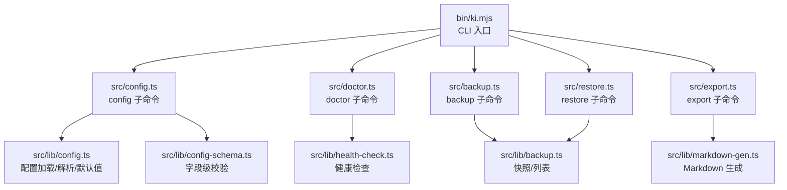
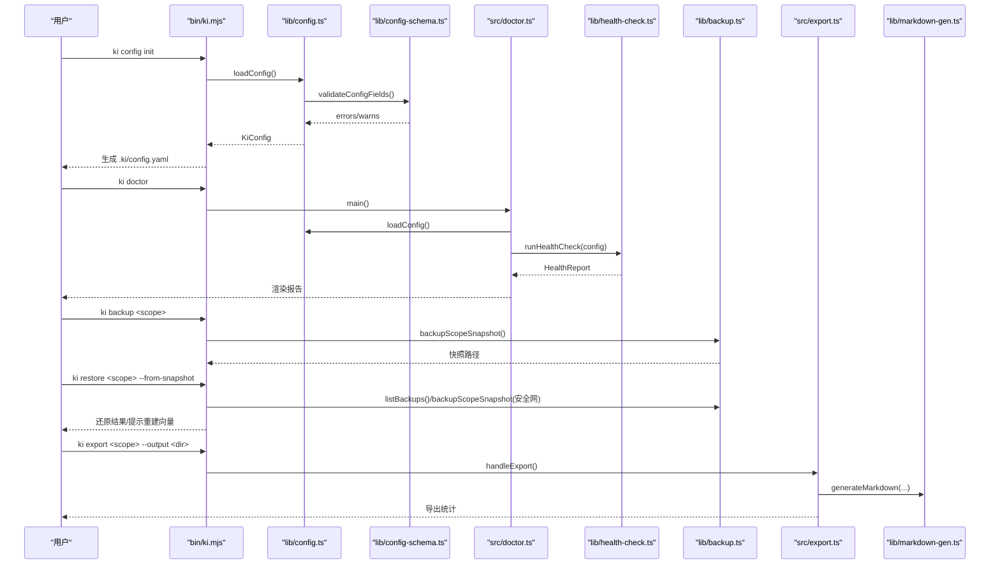
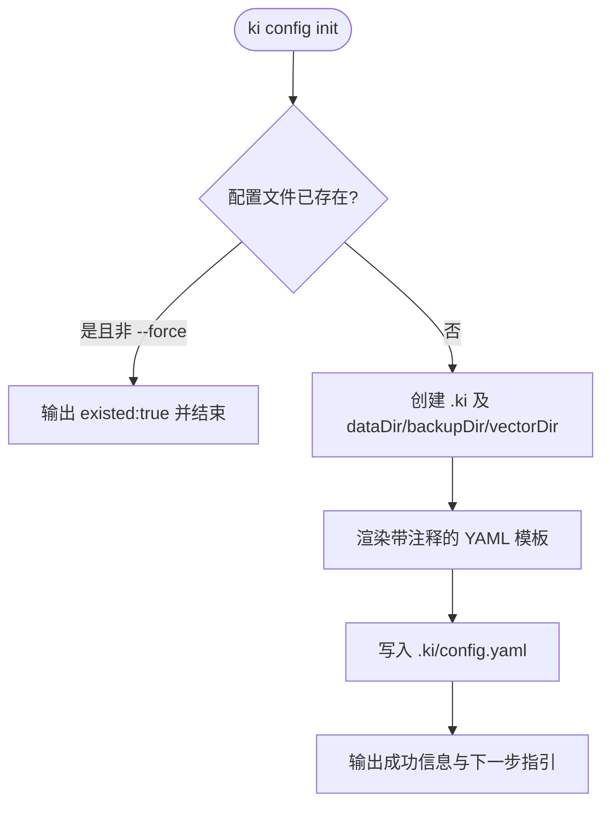
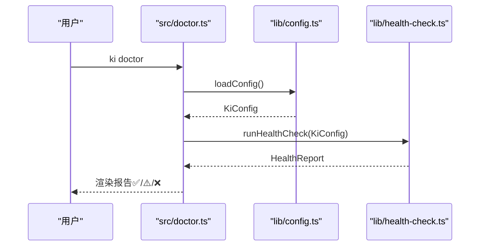
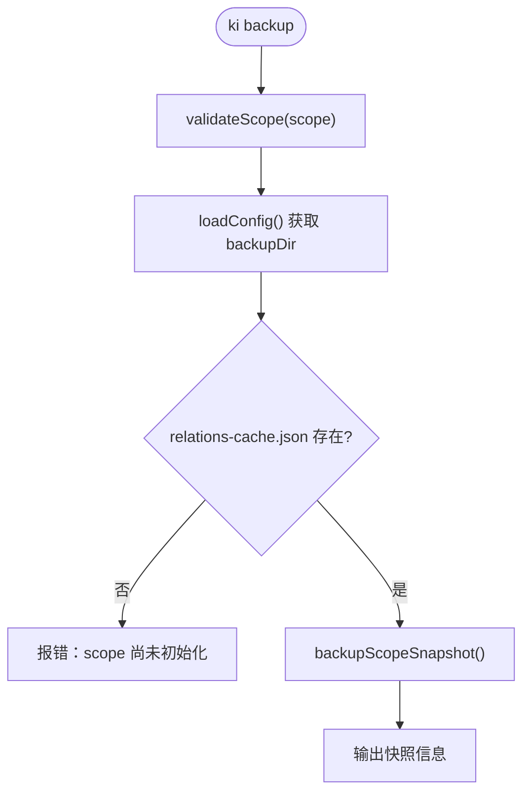
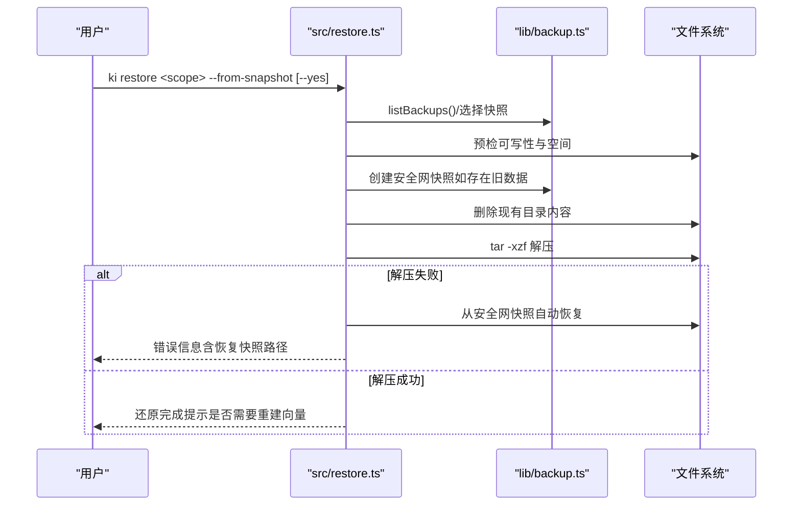
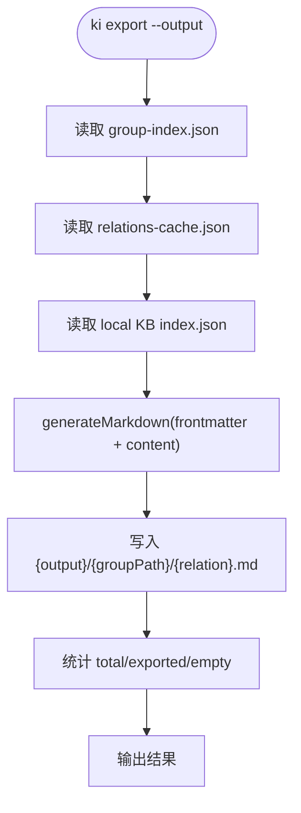
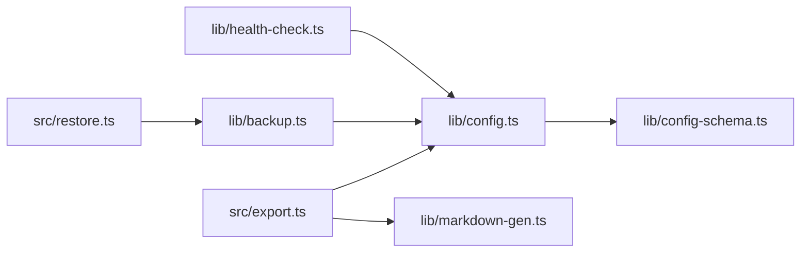

# 工具命令

<cite>
**本文引用的文件**
- [bin/ki.mjs](file://bin/ki.mjs)
- [src/config.ts](file://src/config.ts)
- [src/lib/config.ts](file://src/lib/config.ts)
- [src/lib/config-schema.ts](file://src/lib/config-schema.ts)
- [src/doctor.ts](file://src/doctor.ts)
- [src/lib/health-check.ts](file://src/lib/health-check.ts)
- [src/backup.ts](file://src/backup.ts)
- [src/lib/backup.ts](file://src/lib/backup.ts)
- [src/restore.ts](file://src/restore.ts)
- [src/export.ts](file://src/export.ts)
- [src/lib/markdown-gen.ts](file://src/lib/markdown-gen.ts)
- [docs/cli.md](file://docs/cli.md)
</cite>

## 目录
1. [简介](#简介)
2. [项目结构](#项目-结构)
3. [核心组件](#核心组件)
4. [架构总览](#架构总览)
5. [详细组件分析](#详细组件分析)
6. [依赖关系分析](#依赖关系分析)
7. [性能与可靠性](#性能与可靠性)
8. [故障排查指南](#故障排查指南)
9. [运维最佳实践](#运维最佳实践)
10. [结论](#结论)

## 简介
本章节面向使用 ki CLI 的运维与研发人员，系统化说明以下命令的能力与用法：
- config：配置管理（init 生成模板、字段校验、路径展开）
- doctor：配置与环境诊断（apiKey、服务连通性、维度、目录权限等）
- backup / restore：备份与恢复（快照创建、安全网、还原流程）
- export：导出 KB 为 Wiki Markdown（结构化输出、frontmatter 规范）

这些命令共同构成知识索引系统的“配置—健康—数据—交付”闭环。

## 项目结构
ki CLI 通过统一入口分发到各子命令脚本；配置加载、校验、健康检查、备份恢复、导出等能力集中在 src/lib 下的模块中复用。

图表来源
- [bin/ki.mjs:28-49](file://bin/ki.mjs#L28-L49)
- [src/config.ts:12-16](file://src/config.ts#L12-L16)
- [src/lib/config.ts:156-183](file://src/lib/config.ts#L156-L183)
- [src/lib/config-schema.ts:323-339](file://src/lib/config-schema.ts#L323-L339)
- [src/doctor.ts:15-16](file://src/doctor.ts#L15-L16)
- [src/lib/health-check.ts:150-240](file://src/lib/health-check.ts#L150-L240)
- [src/backup.ts:14-17](file://src/backup.ts#L14-L17)
- [src/lib/backup.ts:87-117](file://src/lib/backup.ts#L87-L117)
- [src/export.ts:13-25](file://src/export.ts#L13-L25)
- [src/lib/markdown-gen.ts:25-41](file://src/lib/markdown-gen.ts#L25-L41)

章节来源
- [bin/ki.mjs:28-49](file://bin/ki.mjs#L28-L49)
- [docs/cli.md:1235-1273](file://docs/cli.md#L1235-L1273)

## 核心组件
- 配置体系
  - 配置文件查找优先级：--config > $HOME/.ki/config.yaml/yml/json > 内置默认
  - 路径展开：$HOME/~/ 展开为用户目录；相对路径基于配置文件所在目录解析
  - 字段级校验：未知字段报错并给出相近建议；废弃字段仅告警；类型/取值非法直接 fail-loud
  - embedding 配置：provider/baseURL/model/dimension/apiKey；apiKey 支持明文或 ${VAR} 引用，不做隐式回退
- 健康诊断
  - 10 项检查：配置文件、配置字段告警、dataDir/backupDir/vectorDir 可写、apiKey、embedding 三合一（连通性/密钥/维度）、zvec collection、scopes.default
  - 只读不修改；有失败项退出码 1
- 备份与恢复
  - 快照：tar.gz 格式，时间戳命名，防覆盖序号；自动预检磁盘空间与可写性
  - 恢复：破坏性操作需 --yes；还原前自动创建安全网快照；解压失败自动回滚；可选重建向量
- 导出
  - 读取 group-index.json + relations-cache.json + local KB index.json
  - 按 Group 树输出 Markdown，含 frontmatter（groupPath/relation/exportedAt），支持 --group 局部导出

章节来源
- [src/lib/config.ts:4-21](file://src/lib/config.ts#L4-L21)
- [src/lib/config.ts:193-226](file://src/lib/config.ts#L193-L226)
- [src/lib/config-schema.ts:125-166](file://src/lib/config-schema.ts#L125-L166)
- [src/lib/config-schema.ts:289-319](file://src/lib/config-schema.ts#L289-L319)
- [src/lib/health-check.ts:150-240](file://src/lib/health-check.ts#L150-L240)
- [src/lib/backup.ts:87-117](file://src/lib/backup.ts#L87-L117)
- [src/restore.ts:124-284](file://src/restore.ts#L124-L284)
- [src/export.ts:198-322](file://src/export.ts#L198-L322)
- [src/lib/markdown-gen.ts:25-41](file://src/lib/markdown-gen.ts#L25-L41)

## 架构总览
下图展示命令到库的调用链路与关键数据流。

图表来源
- [bin/ki.mjs:28-49](file://bin/ki.mjs#L28-L49)
- [src/config.ts:128-177](file://src/config.ts#L128-L177)
- [src/lib/config.ts:156-183](file://src/lib/config.ts#L156-L183)
- [src/lib/config-schema.ts:323-339](file://src/lib/config-schema.ts#L323-L339)
- [src/doctor.ts:18-52](file://src/doctor.ts#L18-L52)
- [src/lib/health-check.ts:150-240](file://src/lib/health-check.ts#L150-L240)
- [src/lib/backup.ts:87-117](file://src/lib/backup.ts#L87-L117)
- [src/restore.ts:124-284](file://src/restore.ts#L124-L284)
- [src/export.ts:198-322](file://src/export.ts#L198-L322)
- [src/lib/markdown-gen.ts:25-41](file://src/lib/markdown-gen.ts#L25-L41)

## 详细组件分析

### config 命令（配置管理）
- 功能要点
  - init：在 $HOME/.ki 下生成 YAML 模板，包含 dataDir/backupDir/vectorDir/embedding/scopes 等字段注释与示例
  - 幂等：若已存在配置文件，除非 --force 否则不会覆盖
  - 路径：模板中的路径采用可移植形式（$HOME/...），便于跨机器迁移
  - 默认值：dataDir 默认 ~/.ki/kb，backupDir 默认 ~/.ki/backup，vectorDir 默认 ~/.ki/vector
- 配置加载与校验
  - 查找顺序：--config > $HOME/.ki/config.yaml/yml/json > 内置默认
  - 字段级校验：未知字段报错并给出相近建议；废弃字段仅告警；类型/取值非法直接 fail-loud
  - apiKey：支持明文或 ${VAR} 引用；未配置时向量相关操作 fail-loud
- 常用场景
  - 初始化配置：ki config init
  - 指定配置路径：ki --config ./my-config.yaml doctor/backup/...

图表来源
- [src/config.ts:128-177](file://src/config.ts#L128-L177)
- [src/lib/config.ts:53-65](file://src/lib/config.ts#L53-L65)
- [src/lib/config.ts:193-226](file://src/lib/config.ts#L193-L226)
- [src/lib/config-schema.ts:125-166](file://src/lib/config-schema.ts#L125-L166)

章节来源
- [src/config.ts:128-177](file://src/config.ts#L128-L177)
- [src/lib/config.ts:156-183](file://src/lib/config.ts#L156-L183)
- [src/lib/config-schema.ts:323-339](file://src/lib/config-schema.ts#L323-L339)

### doctor 命令（配置诊断）
- 检查项（约 10 项）
  - 配置文件：是否成功加载（语法+字段均合法）
  - 配置字段：废弃字段/空 scope 条目等告警
  - dataDir/backupDir/vectorDir：是否存在且可写
  - apiKey：是否已从配置解析出有效值
  - embedding 三合一：URL 连通性、密钥有效性、维度匹配（一次请求拆分三项）
  - zvec collection：目录非空即视为已创建；首次使用为 warn
  - scopes.default：是否显式配置
- 行为约定
  - 只读不修改；有失败项退出码 1；帮助模式不进入诊断
- 典型问题定位
  - 未配置 apiKey：三项均为 fail，先补齐 embedding.apiKey
  - 维度不匹配：实际维度与配置不一致，调整 dimension 或模型
  - 目录不可写：修复权限或更换路径

图表来源
- [src/doctor.ts:18-52](file://src/doctor.ts#L18-L52)
- [src/lib/health-check.ts:150-240](file://src/lib/health-check.ts#L150-L240)

章节来源
- [src/doctor.ts:18-52](file://src/doctor.ts#L18-L52)
- [src/lib/health-check.ts:150-240](file://src/lib/health-check.ts#L150-L240)
- [docs/cli.md:1235-1252](file://docs/cli.md#L1235-L1252)

### backup 命令（备份）
- 功能要点
  - 备份 scope 目录快照为 tar.gz，落至 <backupDir>/<scope>/snapshots
  - 支持 --list 列出已有备份
  - 自动预检：目标目录可写、磁盘空间估算
  - 防覆盖：同秒内多次备份自动追加序号
- 前置条件
  - scope 必须已初始化（relations-cache.json 存在）
- 输出
  - JSON 结果包含 action/scope/snapshot/snapshotPath/message

图表来源
- [src/backup.ts:63-103](file://src/backup.ts#L63-L103)
- [src/lib/backup.ts:87-117](file://src/lib/backup.ts#L87-L117)

章节来源
- [src/backup.ts:63-103](file://src/backup.ts#L63-L103)
- [src/lib/backup.ts:87-117](file://src/lib/backup.ts#L87-L117)

### restore 命令（恢复）
- 功能要点
  - 从 tar.gz 快照覆盖还原 scope 数据（破坏性操作，需 --yes）
  - 还原前自动创建安全网快照（写入受管 backupDir）
  - 解压失败自动尝试从安全网恢复原始数据
  - 可选 --rebuild-vector 重建向量（支持 --group/--tags 局部重建）
  - 支持 --timestamp 选择特定快照，--backup-dir 指定备份根目录
- 安全策略
  - 预检：目标父目录可写、解压所需空间估算（保守倍数）
  - 确认：非交互，展示总览并要求 --yes 才执行
- 输出
  - JSON 结果包含 action/scope/snapshot/restoredAt/hint（如需重建向量）

图表来源
- [src/restore.ts:124-284](file://src/restore.ts#L124-L284)
- [src/lib/backup.ts:87-117](file://src/lib/backup.ts#L87-L117)

章节来源
- [src/restore.ts:124-284](file://src/restore.ts#L124-L284)
- [src/lib/backup.ts:87-117](file://src/lib/backup.ts#L87-L117)

### export 命令（导出为 Wiki Markdown）
- 功能要点
  - 读取 scope 本地数据：group-index.json、relations-cache.json、local KB index.json
  - 按 Group 树组织输出目录；支持 --group 局部导出
  - 每个 Relation 生成 Markdown，包含 frontmatter（groupPath/relation/exportedAt）
  - 输出目录非空时需 --yes 确认覆盖
- 输出结构
  - 顶层目录名：缺省为 scope name；--group 时为 group 最后一段
  - 文件命名：<relation>.md
- 统计
  - total/exported/empty 计数；skipped 记录跳过原因

图表来源
- [src/export.ts:198-322](file://src/export.ts#L198-L322)
- [src/lib/markdown-gen.ts:25-41](file://src/lib/markdown-gen.ts#L25-L41)

章节来源
- [src/export.ts:198-322](file://src/export.ts#L198-L322)
- [src/lib/markdown-gen.ts:25-41](file://src/lib/markdown-gen.ts#L25-L41)

## 依赖关系分析
- 配置层
  - config.ts 负责加载、解析、默认值合并与辅助函数（getScopeDataDir/getBackupDir/getVectorDir/getEmbeddingConfig/resolveScope）
  - config-schema.ts 提供声明式 schema 与 walkObject 遍历，集中处理类型/取值/废弃字段/拼写建议
- 健康层
  - health-check.ts 复用配置层接口进行只读检查；embedding 检查通过 SiliconFlowProvider 发起真实探测
- 备份/恢复层
  - lib/backup.ts 提供快照打包与列表；restore.ts 组合预检、安全网、解压与回滚逻辑
- 导出层
  - export.ts 组合 scope 元数据与 local KB 内容，markdown-gen.ts 统一 frontmatter 格式

图表来源
- [src/lib/config.ts:156-183](file://src/lib/config.ts#L156-L183)
- [src/lib/config-schema.ts:323-339](file://src/lib/config-schema.ts#L323-L339)
- [src/lib/health-check.ts:150-240](file://src/lib/health-check.ts#L150-L240)
- [src/lib/backup.ts:87-117](file://src/lib/backup.ts#L87-L117)
- [src/restore.ts:124-284](file://src/restore.ts#L124-L284)
- [src/export.ts:198-322](file://src/export.ts#L198-L322)
- [src/lib/markdown-gen.ts:25-41](file://src/lib/markdown-gen.ts#L25-L41)

章节来源
- [src/lib/config.ts:156-183](file://src/lib/config.ts#L156-L183)
- [src/lib/config-schema.ts:323-339](file://src/lib/config-schema.ts#L323-L339)
- [src/lib/health-check.ts:150-240](file://src/lib/health-check.ts#L150-L240)
- [src/lib/backup.ts:87-117](file://src/lib/backup.ts#L87-L117)
- [src/restore.ts:124-284](file://src/restore.ts#L124-L284)
- [src/export.ts:198-322](file://src/export.ts#L198-L322)
- [src/lib/markdown-gen.ts:25-41](file://src/lib/markdown-gen.ts#L25-L41)

## 性能与可靠性
- 健康检查
  - embedding 探测超时 8s，重试 1 次，避免网络抖动导致误判；zvec collection 以目录非空判定，避开文件锁冲突
- 备份/恢复
  - 快照命名防覆盖（秒级时间戳 + 递增序号）；解压失败自动回滚；预检磁盘空间与可写性
- 导出
  - 仅读取本地数据，不依赖外部服务；输出前预检可写性，避免半截产物

[本节为通用指导，无需具体文件引用]

## 故障排查指南
- 配置加载失败
  - 现象：CONFIG_FIELD_INVALID 或直接抛错
  - 处理：根据错误清单逐项修正字段名/类型/取值；参考 docs/configuration.md 字段含义
- doctor 报告出现 ❌
  - 未配置 apiKey：在 embedding.apiKey 中写明文或用 ${VAR} 引用环境变量
  - URL 不通/超时：检查 baseURL 可达性与网络策略
  - 维度不匹配：调整 dimension 与实际模型返回一致
  - 目录不可写：修复权限或更换路径
- 备份/恢复异常
  - tar 不可用：安装 tar（Linux/macOS 内置，Windows 请安装 Git for Windows）
  - 解压失败：查看安全网快照路径，手动恢复；必要时重新备份
- 导出失败
  - 输出目录非空：加 --yes 确认覆盖；或更换输出目录
  - 无内容 Relation：属正常情况，会统计为空文件

章节来源
- [src/doctor.ts:39-45](file://src/doctor.ts#L39-L45)
- [src/lib/health-check.ts:150-240](file://src/lib/health-check.ts#L150-L240)
- [src/restore.ts:67-75](file://src/restore.ts#L67-L75)
- [src/restore.ts:240-271](file://src/restore.ts#L240-L271)
- [src/export.ts:375-387](file://src/export.ts#L375-L387)

## 运维最佳实践
- 初始化与验证
  - 首次部署：ki config init → 编辑 embedding.apiKey → ki doctor 确认全绿
- 日常巡检
  - 定期运行 ki doctor，关注 ⚠️ 与 ❌ 项；确保 dataDir/backupDir/vectorDir 可写
- 备份策略
  - 导入完成后自动触发快照；重要变更前手动执行 ki backup
  - 保留多份快照，结合 --timestamp 精确回溯
- 恢复策略
  - 恢复前务必阅读总览并加 --yes；优先使用安全网快照兜底
  - 恢复后按需执行 --rebuild-vector 重建向量（支持 --group/--tags 局部重建）
- 导出与交付
  - 使用 ki export 将 KB 导出为 Wiki Markdown；--group 用于局部交付
  - 对输出目录执行版本化归档，便于审计与回滚

[本节为通用指导，无需具体文件引用]

## 结论
通过 config/doctor/backup/restore/export 的命令组合，系统实现了“配置即文档、诊断即保障、备份即底线、导出即交付”的完整运维闭环。建议在 CI/CD 中集成 ki doctor 作为门禁，结合定时备份与按需恢复，确保知识库的稳定与可追溯。