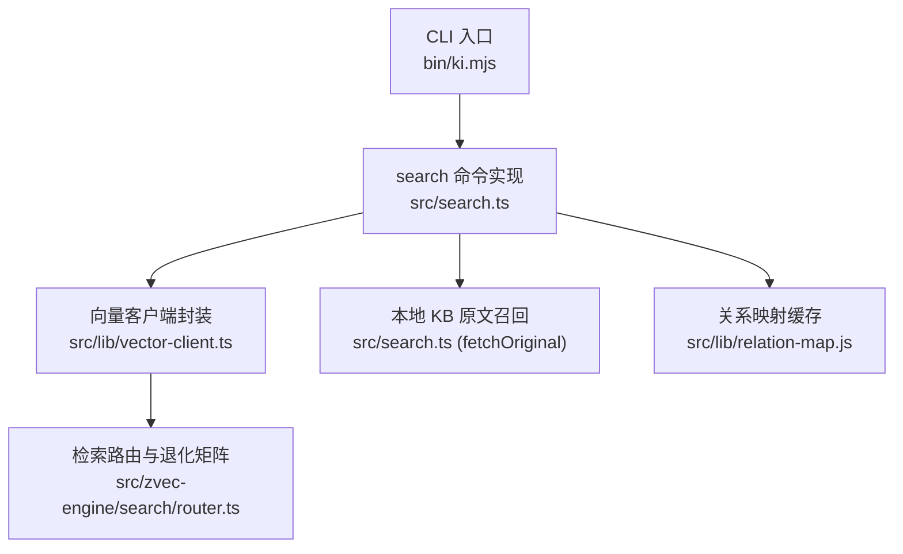
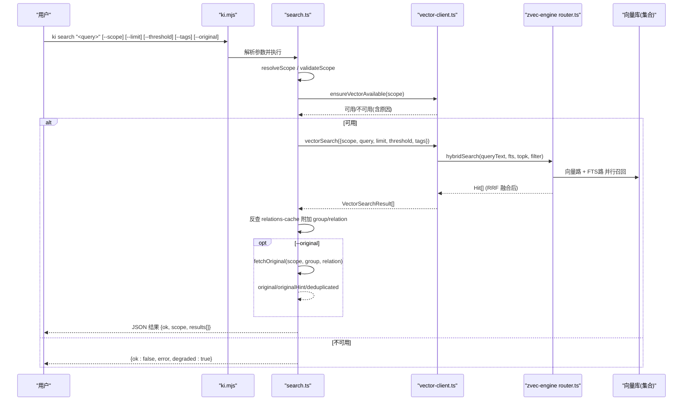
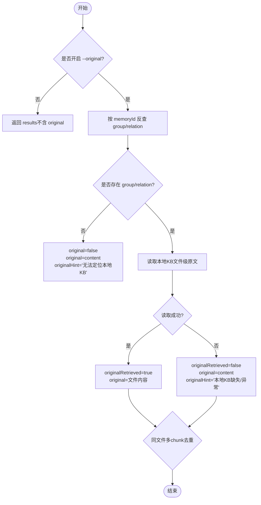
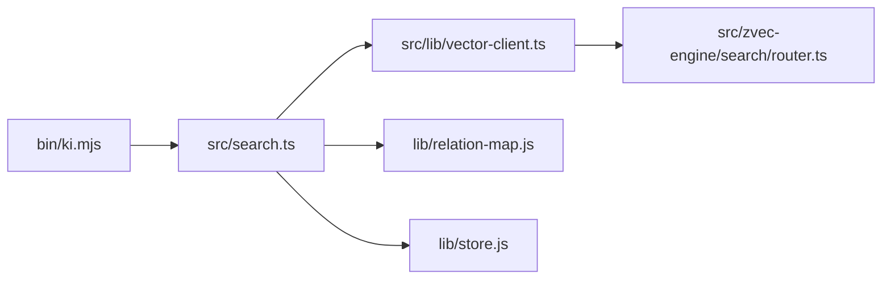

# 搜索查询命令

<cite>
**本文引用的文件**
- [bin/ki.mjs](file://bin/ki.mjs)
- [src/search.ts](file://src/search.ts)
- [src/lib/vector-client.ts](file://src/lib/vector-client.ts)
- [src/zvec-engine/search/router.ts](file://src/zvec-engine/search/router.ts)
- [docs/cli.md](file://docs/cli.md)
- [memories/ki-search-usage.md](file://memories/ki-search-usage.md)
</cite>

## 目录
1. [简介](#简介)
2. [项目结构](#项目结构)
3. [核心组件](#核心组件)
4. [架构总览](#架构总览)
5. [详细组件分析](#详细组件分析)
6. [依赖关系分析](#依赖关系分析)
7. [性能与调优](#性能与调优)
8. [故障排查](#故障排查)
9. [结论](#结论)
10. [附录：查询示例速查](#附录：查询示例速查)

## 简介
本文件面向 ki search 命令的语义检索能力，聚焦以下目标：
- 明确查询语法与参数（--scope、--query、--limit、--score-threshold、--tags、--original）
- 解释混合检索算法（向量 + BM25 + RRF）
- 说明搜索结果格式、评分机制与路径定位字段
- 提供覆盖基础搜索、高级过滤、性能优化的丰富示例
- 给出错误处理与调试技巧

## 项目结构
search 命令由 CLI 入口分发到具体实现，再调用向量客户端与底层引擎完成混合检索。

图表来源
- [bin/ki.mjs:29-49](file://bin/ki.mjs#L29-L49)
- [src/search.ts:204-237](file://src/search.ts#L204-L237)
- [src/lib/vector-client.ts:498-533](file://src/lib/vector-client.ts#L498-L533)
- [src/zvec-engine/search/router.ts:43-127](file://src/zvec-engine/search/router.ts#L43-L127)

章节来源
- [bin/ki.mjs:29-49](file://bin/ki.mjs#L29-L49)
- [src/search.ts:204-237](file://src/search.ts#L204-L237)

## 核心组件
- CLI 分发器：解析命令并转发至对应脚本
- search 命令：参数校验、范围解析、标签策略、结果增强（group/relation/original）、去重
- 向量客户端：engine 单例、撞锁重试、hybridSearch 调用、阈值过滤
- 检索路由：根据是否提供 queryText/fts/vector 选择单路或混合两路，并配置 RRF 融合
- 原文召回：按 group+relation 从本地 KB 读取文件级原文，失败降级并提示

章节来源
- [bin/ki.mjs:29-49](file://bin/ki.mjs#L29-L49)
- [src/search.ts:70-199](file://src/search.ts#L70-L199)
- [src/lib/vector-client.ts:498-533](file://src/lib/vector-client.ts#L498-L533)
- [src/zvec-engine/search/router.ts:43-127](file://src/zvec-engine/search/router.ts#L43-L127)

## 架构总览
下图展示一次 ki search 请求从 CLI 到引擎再到返回结果的完整流程，包括混合检索与 RRF 融合。

图表来源
- [bin/ki.mjs:148-219](file://bin/ki.mjs#L148-L219)
- [src/search.ts:70-199](file://src/search.ts#L70-L199)
- [src/lib/vector-client.ts:498-533](file://src/lib/vector-client.ts#L498-L533)
- [src/zvec-engine/search/router.ts:43-127](file://src/zvec-engine/search/router.ts#L43-L127)

## 详细组件分析

### 命令与参数
- 位置参数：<query>（必填），也可用 -q/--query 兼容
- --scope/-s：项目隔离标识，默认 default；strict 模式必须显式且注册
- --limit：返回条数上限（结果截断），默认 10
- --threshold：融合得分阈值，过滤低于该值的命中，默认 0（不过滤）
- --tags：过滤标签，逗号分隔多值（OR 组合）；不传则搜索全部 tag
- --original：返回 local KB 文件级原文（仅开启时携带 original 字段）

章节来源
- [src/search.ts:206-237](file://src/search.ts#L206-L237)
- [docs/cli.md:469-541](file://docs/cli.md#L469-L541)

### 混合检索算法（向量 + BM25 + RRF）
- 当同时提供 queryText 与 fts 时，走 multiQuery 两路召回，并使用 RRF（rankConstant=60）进行融合排序
- 若缺 fts，退化为单路向量检索；若缺 queryText/vector，退化为单路 FTS
- 向量路与全文路各自独立召回，最终通过 RRF 合并为统一排序结果
- 向量客户端在返回前按 threshold 过滤低分命中

章节来源
- [src/zvec-engine/search/router.ts:43-127](file://src/zvec-engine/search/router.ts#L43-L127)
- [src/lib/vector-client.ts:498-533](file://src/lib/vector-client.ts#L498-L533)

### 评分机制与阈值
- score 为 RRF 融合后的相对分数，通常处于 0.0x 量级
- 理论上限约 0.033（两路均排第 1）；超过此值会过滤掉所有结果
- 建议阈值区间：0.02~0.03；更严格保留强相关，更宽松保留单路强命中
- 阈值在向量客户端层对 hits 做过滤

章节来源
- [docs/cli.md:527-541](file://docs/cli.md#L527-L541)
- [src/lib/vector-client.ts:517-533](file://src/lib/vector-client.ts#L517-L533)

### 路径定位与原文召回
- 通过 memoryId 反查 relations-cache，附加 group（Group 路径）与 relation（文件级 relation 名）
- 开启 --original 时，按 group+relation 从本地 KB 读取文件级原文
- 同一文件多 chunk 命中去重：首条携带 original，后续标记 deduplicated 且不重复返回原文
- 原文不可用时降级：返回向量 content 作为兜底，并附带 originalHint 提示

图表来源
- [src/search.ts:123-199](file://src/search.ts#L123-L199)

章节来源
- [src/search.ts:123-199](file://src/search.ts#L123-L199)

### 标签策略与多 Tag 行为
- 未指定 --tags 时，系统枚举当前 scope 下的所有 tag，分别以 OR 方式检索
- 每个 tag 最多取 limit 条，并按内置优先级合并（ki-search > ki-relation > ki-path）
- 指定 --tags 时，直接按传入 tag 列表（逗号分隔）进行 OR 过滤检索

章节来源
- [src/search.ts:20-29](file://src/search.ts#L20-L29)
- [src/search.ts:94-121](file://src/search.ts#L94-L121)
- [src/lib/vector-client.ts:648-655](file://src/lib/vector-client.ts#L648-L655)

### 结果数据结构
- ok：布尔，表示本次调用是否成功
- scope：实际生效的 scope
- results：数组，每项包含：
  - memoryId：向量文档 ID
  - content：向量层存储文本
  - score：RRF 融合分
  - tag：所属 tag
  - group：Group 路径（可能缺失）
  - relation：文件级 relation（可能缺失）
  - originalRetrieved：是否成功获取原文（仅 --original 时存在）
  - original：文件级原文（仅 --original 且成功时存在）
  - originalHint：原文不可用时的降级提示（仅 --original 时存在）
  - deduplicated：同一文件多 chunk 命中去重标记（仅 --original 时存在）

章节来源
- [src/search.ts:33-51](file://src/search.ts#L33-L51)
- [docs/cli.md:496-525](file://docs/cli.md#L496-L525)

## 依赖关系分析
- CLI 入口将 search 命令映射到 src/search.ts
- search.ts 依赖：
  - 配置与 scope 解析（loadConfig、resolveScope、validateScope）
  - 向量服务可用性检测（ensureVectorAvailable）
  - 向量检索（vectorSearch）
  - 关系映射缓存（getRelationMap）
  - 本地 KB 原文读取（fetchOriginal）
- 向量客户端依赖：
  - 引擎单例管理（getEngine/closeEngine）
  - 撞锁重试与空闲释放锁
  - hybridSearch 调用与阈值过滤
- 检索路由负责：
  - 输入合法性校验
  - 选择单路/混合两路
  - 配置 RRF 融合参数

图表来源
- [bin/ki.mjs:29-49](file://bin/ki.mjs#L29-L49)
- [src/search.ts:11-18](file://src/search.ts#L11-L18)
- [src/lib/vector-client.ts:16-35](file://src/lib/vector-client.ts#L16-L35)
- [src/zvec-engine/search/router.ts:14-21](file://src/zvec-engine/search/router.ts#L14-L21)

章节来源
- [bin/ki.mjs:29-49](file://bin/ki.mjs#L29-L49)
- [src/search.ts:11-18](file://src/search.ts#L11-L18)
- [src/lib/vector-client.ts:16-35](file://src/lib/vector-client.ts#L16-L35)
- [src/zvec-engine/search/router.ts:14-21](file://src/zvec-engine/search/router.ts#L14-L21)

## 性能与调优
- 使用 --limit 控制返回条数，避免大结果集带来的传输与渲染开销
- 使用 --threshold 过滤低分命中，减少无关结果；推荐 0.02~0.03
- 使用 --tags 精确限定召回范围，降低检索面
- 向量客户端具备撞锁重试与空闲释放锁，适合常驻服务场景；CLI 短命令每次结束后关闭 engine
- 关系映射缓存带 TTL 与 mtime 感知，连续调用无额外 IO 开销

章节来源
- [src/lib/vector-client.ts:107-124](file://src/lib/vector-client.ts#L107-L124)
- [src/lib/vector-client.ts:166-201](file://src/lib/vector-client.ts#L166-L201)
- [src/search.ts:123-128](file://src/search.ts#L123-L128)
- [docs/cli.md:363-371](file://docs/cli.md#L363-L371)

## 故障排查
- 向量服务不可用：返回 {ok:false, error, degraded:true}，常见原因为被占用或损坏
  - 被占用：等待其他进程释放或停止常驻服务
  - 损坏：执行恢复重建（如 restore --from-snapshot --rebuild-vector）
- 原文不可用：开启 --original 但无法定位本地 KB 或读取失败，会返回 originalHint 提示
- 空结果：检查 --threshold 是否过高；RRF 融合分超过 ~0.033 会过滤掉所有结果
- 标签不生效：确认 tag 名称大小写（内部统一小写），或使用 ki tag list 发现可用标签

章节来源
- [src/search.ts:84-92](file://src/search.ts#L84-L92)
- [src/search.ts:137-155](file://src/search.ts#L137-L155)
- [src/lib/vector-client.ts:440-494](file://src/lib/vector-client.ts#L440-L494)
- [docs/cli.md:527-541](file://docs/cli.md#L527-L541)

## 结论
ki search 提供基于“向量语义 + 全文 BM25 + RRF 融合”的混合检索能力，支持灵活的 scope/tag 过滤与可配置的阈值控制。通过 group/relation 定位与可选的原文召回，既能满足快速知识查找，也能支撑深入溯源。合理设置 --limit、--threshold、--tags 可获得稳定且高效的检索体验。

## 附录：查询示例速查
- 基础搜索
  - ki search "仪表盘配置" -s monitor
- 限制返回条数
  - ki search "登录流程" --limit 5
- 提高相关性（收紧阈值）
  - ki search "API 网关" --threshold 0.03
- 按标签过滤
  - ki search "部署" --tags "deploy,ops"
- 结合标签与阈值
  - ki search "监控指标" --tags "metrics" --threshold 0.025
- 返回原文（用于精读与溯源）
  - ki search "通知渠道" --original
- 多标签 OR 组合
  - ki search "认证授权" --tags "auth,security"
- 查看可用标签
  - ki tag list --scope my-project

章节来源
- [docs/cli.md:488-541](file://docs/cli.md#L488-L541)
- [memories/ki-search-usage.md:1-12](file://memories/ki-search-usage.md#L1-L12)