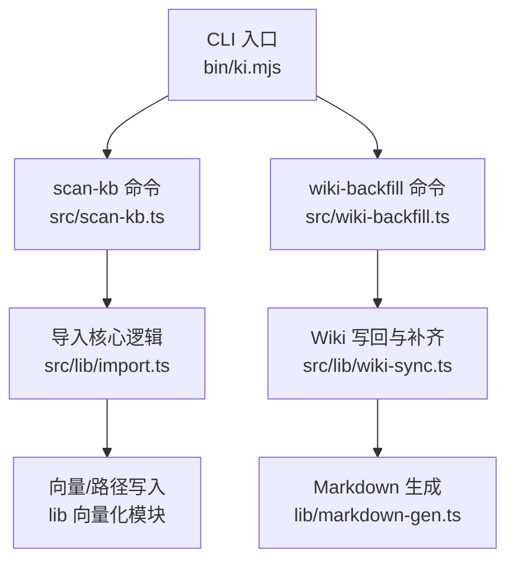
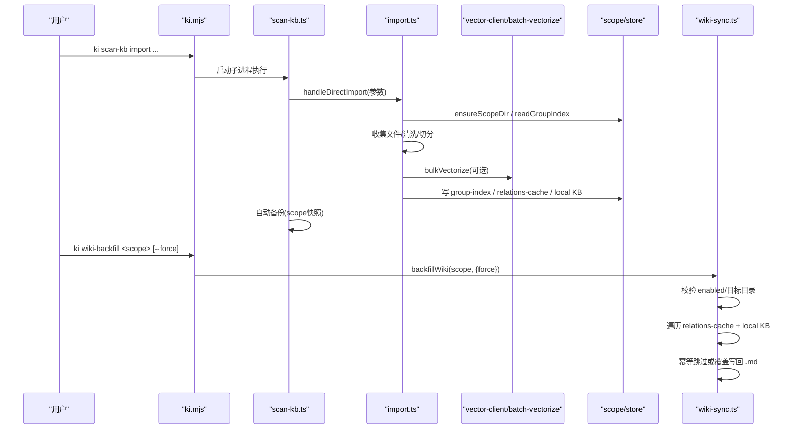
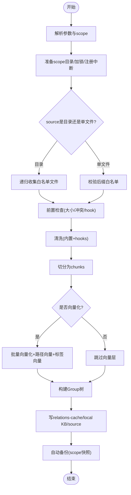
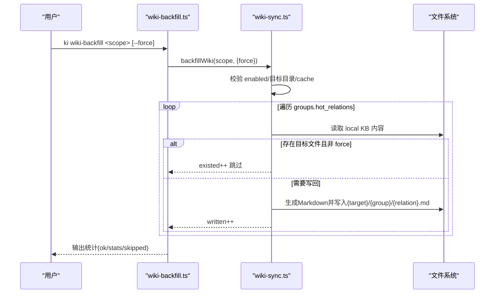
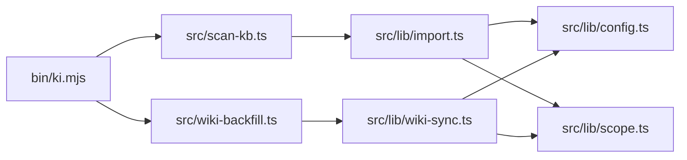

# 知识库管理命令

<cite>
**本文引用的文件**
- [bin/ki.mjs](file://bin/ki.mjs)
- [src/scan-kb.ts](file://src/scan-kb.ts)
- [src/lib/import.ts](file://src/lib/import.ts)
- [src/wiki-backfill.ts](file://src/wiki-backfill.ts)
- [src/lib/wiki-sync.ts](file://src/lib/wiki-sync.ts)
- [docs/cli.md](file://docs/cli.md)
- [test/wiki-backfill.test.ts](file://test/wiki-backfill.test.ts)
</cite>

## 目录
1. [简介](#简介)
2. [项目结构](#项目结构)
3. [核心组件](#核心组件)
4. [架构总览](#架构总览)
5. [详细组件分析](#详细组件分析)
6. [依赖关系分析](#依赖关系分析)
7. [性能与并发特性](#性能与并发特性)
8. [故障排查指南](#故障排查指南)
9. [结论](#结论)
10. [附录：使用示例](#附录使用示例)

## 简介
本文件聚焦知识库管理中的两个关键命令：
- scan-kb import：外部 Markdown 知识库的“原文直导 + 自动切分 + 幂等追加”导入。
- wiki-backfill：将 KB 中已有 Relations 全量写回 Wiki（历史补齐），支持幂等补齐与批量处理。

文档覆盖参数选项、导入流程、幂等机制、错误处理，并提供实际使用示例与常见问题解决方案。

## 项目结构
命令入口统一由 CLI 分发到具体实现脚本；scan-kb 与 wiki-backfill 分别对应独立的 TypeScript 脚本，并通过 lib 层提供核心能力。

图表来源
- [bin/ki.mjs:29-49](file://bin/ki.mjs#L29-L49)
- [src/scan-kb.ts:26-78](file://src/scan-kb.ts#L26-L78)
- [src/wiki-backfill.ts:39-67](file://src/wiki-backfill.ts#L39-L67)
- [src/lib/import.ts:214-564](file://src/lib/import.ts#L214-L564)
- [src/lib/wiki-sync.ts:194-284](file://src/lib/wiki-sync.ts#L194-L284)

章节来源
- [bin/ki.mjs:29-49](file://bin/ki.mjs#L29-L49)

## 核心组件
- scan-kb import：负责解析参数、准备 scope、扫描源文件、清洗与切分、构建 Group 树、写入 relations-cache 与 local KB、可选向量化、记录 source 元信息，并在成功后触发自动备份。
- wiki-backfill：校验配置与目标目录，遍历 relations-cache 与 local KB，逐条写回 Wiki，默认幂等跳过已存在文件，支持 --force 全量覆盖刷新。

章节来源
- [src/scan-kb.ts:26-78](file://src/scan-kb.ts#L26-L78)
- [src/lib/import.ts:214-564](file://src/lib/import.ts#L214-L564)
- [src/wiki-backfill.ts:39-67](file://src/wiki-backfill.ts#L39-L67)
- [src/lib/wiki-sync.ts:194-284](file://src/lib/wiki-sync.ts#L194-L284)

## 架构总览

图表来源
- [bin/ki.mjs:154-219](file://bin/ki.mjs#L154-L219)
- [src/scan-kb.ts:47-77](file://src/scan-kb.ts#L47-L77)
- [src/lib/import.ts:214-564](file://src/lib/import.ts#L214-L564)
- [src/lib/wiki-sync.ts:194-284](file://src/lib/wiki-sync.ts#L194-L284)

## 详细组件分析

### scan-kb import：参数与流程
- 参数选项
  - --source：必填，外部 Markdown 根目录或单个 .md 文件。
  - --group：可选，目标 Group 落点；缺省时按目录顶层子目录名各建根节点，单文档导入用 scope name。
  - --scope：可选，项目隔离标识（strict 模式必填）。
  - --chunk-size：可选，切分目标长度（字符，默认 1000）。
  - --chunk-overlap：可选，相邻 chunk 重叠字符数（默认 150）。
  - --no-vector：可选，仅写 KB 层（relations-cache + local KB），不写向量。
  - --tags：可选，文档级自定义标签（逗号分隔）；向量化时每个 tag 写一条内容向量；--no-vector 时仅持久化 relation.tags。
  - --no-clean：可选，关闭全部数据清洗（含外部 hooks）。
  - --clean-rules：可选，覆盖内置清洗规则开关（逗号分隔）。
- 导入流程（简化）
  1) 解析参数并 resolve scope/source/group/chunk/clean/tags/vector。
  2) 准备 scope 目录、获取导入锁、注册中断信号处理。
  3) 收集白名单格式文件（默认 .md），单文件/目录两种模式。
  4) 前置检查：大小超限、relation 冲突（同名不同 sourcePath 跳过）、hook 失败回滚。
  5) 清洗与切分：内置规则 + 外部 hooks；按段落边界切分，生成 chunk 条目。
  6) 向量化（可选）：批量向量化 + 路径向量写入；自定义标签向量写入（每个 tag 一条）。
  7) 构建 Group 树：确保 groupPath 及父路径存在。
  8) 写入元数据：relations-cache（文件级 relation + memoryIds/tags）、local KB（原文）、group-index.source（记录 dir/chunkSize/chunkOverlap）。
  9) 成功清理锁与中断标记，输出统计结果；随后触发自动备份。
- 幂等追加机制
  - 同 file（相同 sourcePath）重跑：覆盖更新（重新写 local KB 与向量）。
  - 同名不同文件（相同 relation 文本但不同 sourcePath）：跳过并提示冲突。
  - 新文件：正常导入。
  - 因此重复执行同一命令即增量同步（新增/更新/跳过）。
- 错误处理
  - 参数/路径校验失败：直接报错退出。
  - 导入锁冲突：拒绝并发导入。
  - 清洗 hook 失败：回滚 local KB 并计入 skipped。
  - 向量写入失败：记录 errors，不影响 KB 层写入。
  - 中断信号：写入中断标记并清锁，便于恢复。

章节来源
- [src/scan-kb.ts:35-77](file://src/scan-kb.ts#L35-L77)
- [src/lib/import.ts:214-564](file://src/lib/import.ts#L214-L564)
- [docs/cli.md:23-77](file://docs/cli.md#L23-L77)

#### 导入流程图（算法视角）

图表来源
- [src/lib/import.ts:214-564](file://src/lib/import.ts#L214-L564)

### wiki-backfill：历史关系全量写回 Wiki
- 功能定位
  - 将 KB 中已有 Relations 全量写回 Wiki，用于“先导入数据、后开启 wikiSync”的历史补齐场景。
- 参数选项
  - <scope>：必填，目标 scope。
  - --force：可选，全量覆盖写（刷新已存在文件的 exportedAt）。
- 幂等补齐机制
  - 默认幂等：已存在的 .md 文件跳过（不刷新时间戳，避免 git 脏 diff）。
  - --force：覆盖所有已存在文件（刷新 exportedAt）。
- 批量处理能力
  - 遍历 relations-cache 的全部 group 键（平铺完整路径），从 local KB 读取每条 relation 的内容，复用 writeBackToWikiInner 逐条写回。
  - 非法 relation（含路径分隔符或 ..）跳过，防止路径穿越。
  - 若 wiki 目标目录不存在或为空，且未显式关闭 autoBackfill，则在写回前自动触发一次全量补齐（防递归：内部调用传 allowAutoBackfill=false）。
- 前置校验（fail-fast）
  - wikiSync.enabled=false 整体拒绝。
  - 无可用 wiki 目标目录（source.dir 与 wikiSync.sourceDir 均未配置）整体拒绝。
  - relations-cache 不存在则拒绝（无数据可补齐）。

章节来源
- [src/wiki-backfill.ts:18-67](file://src/wiki-backfill.ts#L18-L67)
- [src/lib/wiki-sync.ts:44-151](file://src/lib/wiki-sync.ts#L44-L151)
- [src/lib/wiki-sync.ts:194-284](file://src/lib/wiki-sync.ts#L194-L284)
- [test/wiki-backfill.test.ts:115-173](file://test/wiki-backfill.test.ts#L115-L173)

#### Wiki 写回序列图

图表来源
- [src/lib/wiki-sync.ts:194-284](file://src/lib/wiki-sync.ts#L194-L284)
- [src/wiki-backfill.ts:39-67](file://src/wiki-backfill.ts#L39-L67)

## 依赖关系分析
- CLI 层：bin/ki.mjs 通过命令映射分发到具体脚本，支持 --config 全局参数与守护进程模式。
- scan-kb 层：基于 commander 定义 import 子命令，解析参数后调用 lib/import.ts 的 handleDirectImport。
- 导入核心：import.ts 串联文件收集、清洗、切分、向量化、Group 树构建、relations-cache/local KB/source 写入。
- Wiki 写回：wiki-backfill.ts 调用 lib/wiki-sync.ts 的 backfillWiki，复用 writeBackToWikiInner 保证路径构造与安全策略一致。
- 配置与范围：config.ts 提供 scope/wikisync/clean/import 等配置解析；scope.ts 提供 group-index/relations-cache/local KB 路径与操作。

图表来源
- [bin/ki.mjs:29-49](file://bin/ki.mjs#L29-L49)
- [src/scan-kb.ts:13-20](file://src/scan-kb.ts#L13-L20)
- [src/lib/import.ts:13-48](file://src/lib/import.ts#L13-L48)
- [src/lib/wiki-sync.ts:14-18](file://src/lib/wiki-sync.ts#L14-L18)

章节来源
- [bin/ki.mjs:29-49](file://bin/ki.mjs#L29-L49)
- [src/scan-kb.ts:13-20](file://src/scan-kb.ts#L13-L20)
- [src/lib/import.ts:13-48](file://src/lib/import.ts#L13-L48)
- [src/lib/wiki-sync.ts:14-18](file://src/lib/wiki-sync.ts#L14-L18)

## 性能与并发特性
- 导入并发控制
  - 同 scope 并发导入互斥：通过 import.lock 文件实现，避免重复导入导致的数据竞争。
  - 中断保护：捕获 SIGINT/SIGTERM，写入中断标记并清锁，便于恢复。
- 向量化批处理
  - 批量向量化：bulkVectorize 对 entries 进行批量处理，减少网络/IO 往返。
  - 路径向量与标签向量：为 group-path 与自定义标签分别写入向量索引，提升检索召回能力。
- Wiki 写回批量
  - 遍历 relations-cache 的 group 键，逐条写回；默认幂等跳过已存在文件，避免不必要的 I/O。
  - 自动补齐：当目标目录不存在或为空时，自动触发一次全量补齐（防递归）。

[本节为通用性能讨论，不直接分析具体代码行]

## 故障排查指南
- 常见错误与处理
  - source 不存在或不是目录/文件：检查 --source 路径是否正确。
  - 未发现 .md 文件：确认文件格式在白名单内（默认 .md），必要时调整 scopes.<scope>.import.extensions。
  - 文件过大被跳过：增大 --chunk-size 或手动拆分文件；也可在配置中调大 maxFileSize。
  - relation 冲突：同 group 下同名 relation 但不同 sourcePath 会跳过，需重命名文件或调整 group。
  - 清洗 hook 失败：检查外部 hook 脚本返回与输入协议；失败会回滚 local KB 并计入 skipped。
  - 向量写入失败：查看 errors 列表；不影响 KB 层写入，可后续重试或重建向量。
  - wiki-backfill 被拒绝：检查 wikiSync.enabled 是否为 false；确认存在 wiki 目标目录（source.dir 或 wikiSync.sourceDir）。
  - 幂等行为异常：默认跳过已存在文件；如需刷新 exportedAt，使用 --force。
- 恢复与自愈
  - 导入中断：根据中断标记（processedFiles/totalFiles）判断进度，重新执行同一命令即可继续。
  - 向量重建：可使用 restore --rebuild-vector 或相关重建工具恢复向量层。

章节来源
- [src/lib/import.ts:214-564](file://src/lib/import.ts#L214-L564)
- [src/lib/wiki-sync.ts:194-284](file://src/lib/wiki-sync.ts#L194-L284)
- [test/wiki-backfill.test.ts:115-173](file://test/wiki-backfill.test.ts#L115-L173)

## 结论
- scan-kb import 提供了稳定可靠的“原文直导 + 自动切分 + 幂等追加”能力，适合首次导入与持续增量更新。
- wiki-backfill 解决了“先导入、后开启 wikiSync”的历史补齐问题，具备幂等与批量处理能力，保障 Wiki 与 KB 的一致性。
- 两者均具备完善的错误处理与恢复机制，可在生产环境中安全使用。

[本节为总结性内容，不直接分析具体代码行]

## 附录：使用示例
- 首次导入（推荐）
  - 命令：ki scan-kb import --scope my-project --source ./wiki --group wiki
  - 说明：自动切分、幂等追加；可配合 --chunk-size/--chunk-overlap 调节切分粒度。
- 非向量化导入（仅 KB 层）
  - 命令：ki scan-kb import --scope my-project --source ./wiki --group wiki --no-vector
  - 说明：不产生 memoryId，无法被 ki search 召回，但可用于 query-group/get-module-info。
- 带标签导入（向量化）
  - 命令：ki scan-kb import --scope my-project --source ./wiki --group wiki --tags "api,auth"
  - 说明：为导入文件附加标签，每个 tag 写一条内容向量，可通过 ki search -t <tag> 召回。
- 历史补齐（Wiki 写回）
  - 命令：ki wiki-backfill my-project
  - 说明：幂等补齐，已存在文件跳过；如需刷新 exportedAt，使用 --force。
- 参考文档
  - CLI 命令参考：docs/cli.md

章节来源
- [docs/cli.md:23-77](file://docs/cli.md#L23-L77)
- [src/scan-kb.ts:35-77](file://src/scan-kb.ts#L35-L77)
- [src/wiki-backfill.ts:18-67](file://src/wiki-backfill.ts#L18-L67)