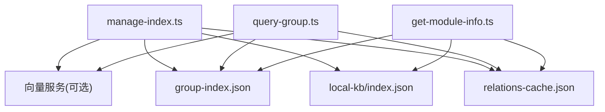
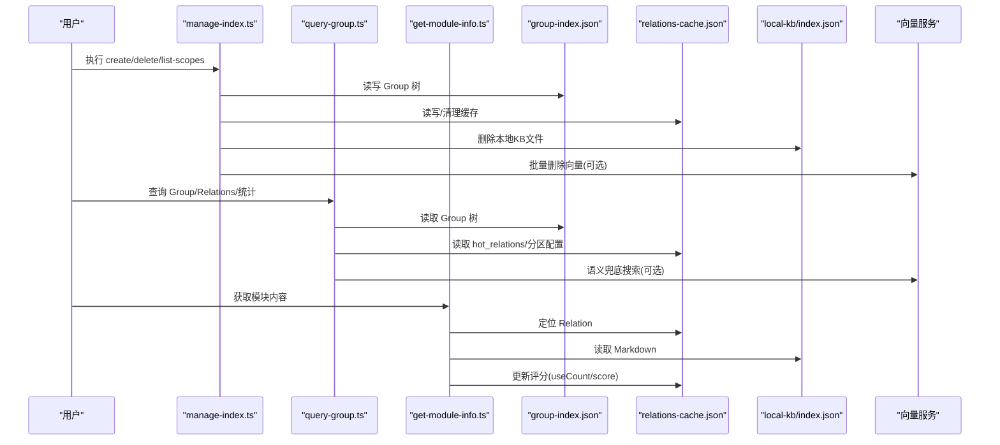
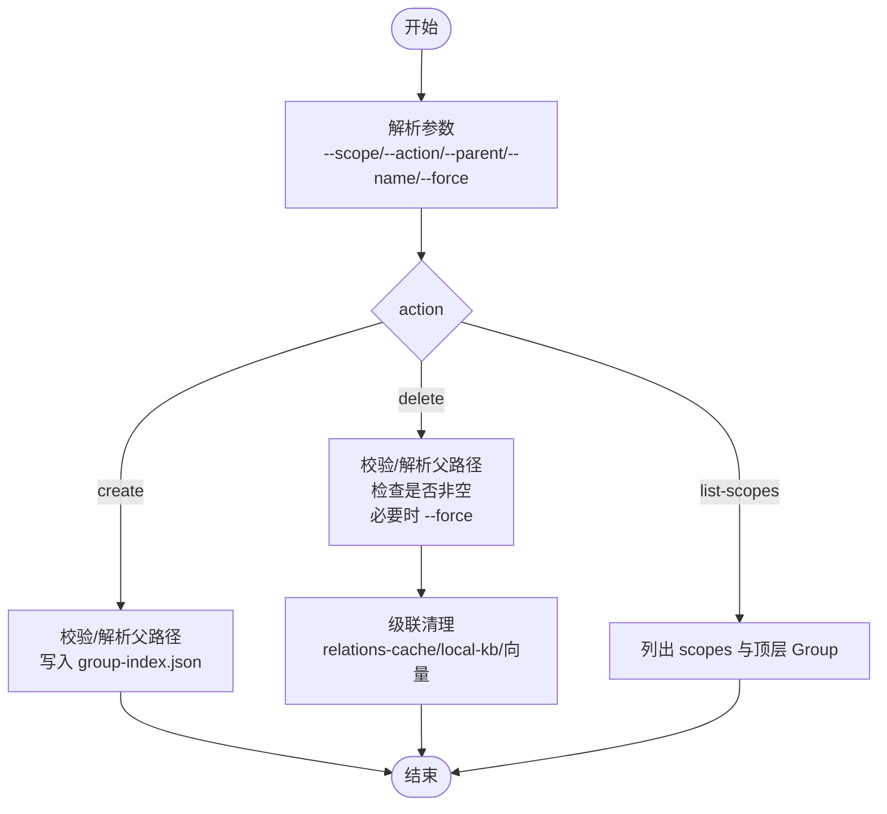
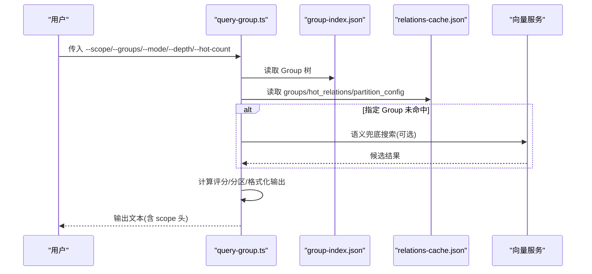
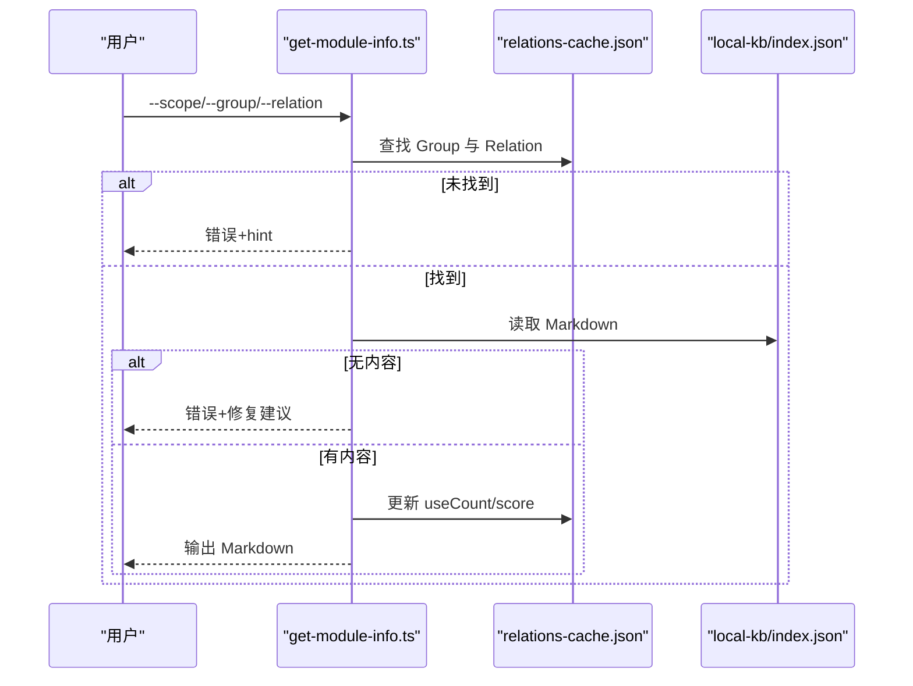
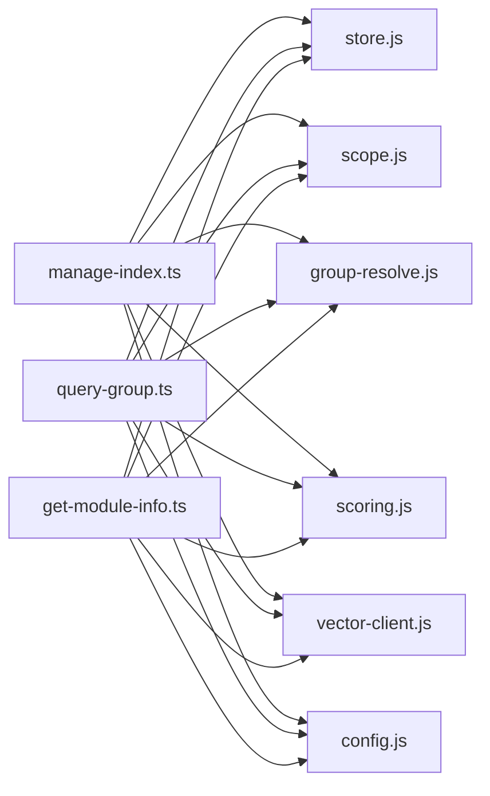

# 索引管理命令

<cite>
**本文引用的文件**
- [src/manage-index.ts](file://src/manage-index.ts)
- [src/query-group.ts](file://src/query-group.ts)
- [src/get-module-info.ts](file://src/get-module-info.ts)
- [docs/manage-index.md](file://docs/manage-index.md)
- [test/manage-index.test.ts](file://test/manage-index.test.ts)
- [test/query-group.test.ts](file://test/query-group.test.ts)
- [test/get-module-info.test.ts](file://test/get-module-info.test.ts)
</cite>

## 目录
1. [简介](#简介)
2. [项目结构](#项目结构)
3. [核心组件](#核心组件)
4. [架构总览](#架构总览)
5. [详细组件分析](#详细组件分析)
6. [依赖关系分析](#依赖关系分析)
7. [性能与使用建议](#性能与使用建议)
8. [故障排查指南](#故障排查指南)
9. [结论](#结论)
10. [附录：参数速查与示例](#附录参数速查与示例)

## 简介
本文件面向“索引管理”相关 CLI 命令，系统性说明 manage-index、query-group、get-module-info 三大命令的用途、参数、返回值格式与典型用法。重点覆盖：
- manage-index：创建根节点（create-root）、添加分组（add-group）、删除分组（remove-group）、更新分组（update-group）等子命令的参数与使用方法；
- query-group：查询 Group 树结构与分区信息（热/常温/冷/新兴热），支持按 Group 查看 Relations；
- get-module-info：读取本地 KB 原文（Markdown），并更新 Relation 评分。

## 项目结构
索引管理相关能力由三个入口脚本组成，分别负责索引结构管理、索引查询展示、以及模块内容检索：
- manage-index.ts：Group 树索引的 CRUD、scope 列表查询、级联清理（relations-cache、local-kb、向量记忆）。
- query-group.ts：聚合评分、分区、格式化输出（热门/常温/冷区/新兴热/完整树）。
- get-module-info.ts：根据 group + relation 定位本地 KB 中的 Markdown 内容，并记录使用次数以更新评分。

图表来源
- [src/manage-index.ts:413-646](file://src/manage-index.ts#L413-L646)
- [src/query-group.ts:748-784](file://src/query-group.ts#L748-L784)
- [src/get-module-info.ts:170-208](file://src/get-module-info.ts#L170-L208)

章节来源
- [src/manage-index.ts:1-646](file://src/manage-index.ts#L1-L646)
- [src/query-group.ts:1-784](file://src/query-group.ts#L1-L784)
- [src/get-module-info.ts:1-208](file://src/get-module-info.ts#L1-L208)

## 核心组件
- manage-index
  - 提供 create/delete/list-scopes 三类操作；
  - 支持父路径解析、自动补全、非空节点强制删除提示；
  - 级联删除 relations-cache、local-kb、向量记忆（批量 vectorDelete）。
- query-group
  - 计算 Group 聚合分数并按阈值分区（hot/warm/cold/emerging）；
  - 支持多模式组合（逗号分隔），full 模式递归展示子 Group Relations；
  - 支持语义兜底搜索（当指定 Group 未命中时尝试通用向量搜索）。
- get-module-info
  - 通过 group + relation 在 relations-cache 中定位条目；
  - 从 local-kb 读取对应 Markdown 文本；
  - 调用 recordUse 更新 useCount/lastUsedTime，并重新计算 score。

章节来源
- [src/manage-index.ts:72-166](file://src/manage-index.ts#L72-L166)
- [src/manage-index.ts:300-411](file://src/manage-index.ts#L300-L411)
- [src/query-group.ts:77-193](file://src/query-group.ts#L77-L193)
- [src/query-group.ts:596-746](file://src/query-group.ts#L596-L746)
- [src/get-module-info.ts:61-168](file://src/get-module-info.ts#L61-L168)

## 架构总览
下图展示了三个命令与底层数据文件的交互关系，以及可选的向量服务集成点。

图表来源
- [src/manage-index.ts:413-646](file://src/manage-index.ts#L413-L646)
- [src/query-group.ts:748-784](file://src/query-group.ts#L748-L784)
- [src/get-module-info.ts:170-208](file://src/get-module-info.ts#L170-L208)

## 详细组件分析

### manage-index：Group 树索引管理
- 支持的 action
  - create：创建 Group（顶层或子节点），支持父路径自动补全与冲突检测。
  - delete：删除 Group，非空节点需 --force；删除会触发级联清理（relations-cache、local-kb、向量记忆）。
  - list-scopes：列出所有已初始化 scope，并附带顶层 Group 列表。
- 关键行为
  - 父路径解析：若直接路径不存在，尝试基于 relations-cache 进行路径补全，并返回 hint。
  - 非空保护：delete 对含子节点的 Group 拒绝删除，除非显式 --force。
  - 级联清理：删除 Group 后，清理 relations-cache 中以该路径为前缀的所有 key；删除 local-kb 下 index.json；收集 memoryId 批量调用 vectorDelete 删除向量记忆。
- 返回值
  - 成功：包含 ok、scope、path、hint（可选）、cascade（删除时返回清理统计）。
  - 失败：包含 ok=false、error、hint（可选）。

图表来源
- [src/manage-index.ts:413-646](file://src/manage-index.ts#L413-L646)
- [src/manage-index.ts:300-411](file://src/manage-index.ts#L300-L411)

章节来源
- [src/manage-index.ts:72-166](file://src/manage-index.ts#L72-L166)
- [src/manage-index.ts:168-298](file://src/manage-index.ts#L168-L298)
- [src/manage-index.ts:300-411](file://src/manage-index.ts#L300-L411)
- [src/manage-index.ts:413-646](file://src/manage-index.ts#L413-L646)

### query-group：Group 树与分区信息查询
- 功能要点
  - 聚合评分：对每个 Group 的 hot_relations 求和得到 Group 总分。
  - 分区策略：依据 recentHours/halfLifeHours 将 Group 分为 hot/warm/cold，并将最近活跃且处于 hot 的标记为 emerging。
  - 展示模式：--mode 支持 hot|warm|cold|emerging|full，可逗号分隔组合；full 模式递归展示子 Group Relations。
  - 指定 Group：--groups 支持多个 Group，显示其 Relations 与分区标签；未命中时可开启语义兜底（默认开启）。
- 返回值
  - 成功：ok=true，scope，output（格式化文本，包含头部标注 scope）。
  - 失败：ok=false，error。

图表来源
- [src/query-group.ts:596-746](file://src/query-group.ts#L596-L746)
- [src/query-group.ts:748-784](file://src/query-group.ts#L748-L784)

章节来源
- [src/query-group.ts:77-193](file://src/query-group.ts#L77-L193)
- [src/query-group.ts:596-746](file://src/query-group.ts#L596-L746)
- [src/query-group.ts:748-784](file://src/query-group.ts#L748-L784)

### get-module-info：读取本地 KB 原文并更新评分
- 功能要点
  - 通过 group + relation 在 relations-cache 中定位条目（支持 id 或 text 匹配）。
  - 从 local-kb 读取对应 Markdown 内容。
  - 调用 recordUse 更新 useCount/lastUsedTime，并重新计算 score 写回 relations-cache。
  - 支持近似匹配（searchPath）与可用 Relation 提示。
- 返回值
  - 成功：ok=true，scope，content（Markdown 文本），hint（可选）。
  - 失败：ok=false，error，hint（可选）。

图表来源
- [src/get-module-info.ts:61-168](file://src/get-module-info.ts#L61-L168)
- [src/get-module-info.ts:170-208](file://src/get-module-info.ts#L170-L208)

章节来源
- [src/get-module-info.ts:61-168](file://src/get-module-info.ts#L61-L168)
- [src/get-module-info.ts:170-208](file://src/get-module-info.ts#L170-L208)

## 依赖关系分析
- 文件依赖
  - manage-index.ts 依赖 store/scope/group-resolve/scoring/vector-client/config 等库。
  - query-group.ts 依赖 store/scope/scoring/constants/group-resolve/vector-client/config。
  - get-module-info.ts 依赖 store/scope/scoring/constants/group-resolve/path-search/vector-client/config。
- 外部集成
  - 向量服务：manage-index 在级联删除时批量删除向量记忆；query-group 支持语义兜底搜索；get-module-info 不直接调用向量服务。
- 数据耦合
  - group-index.json：Group 树结构；
  - relations-cache.json：Relation 列表、评分、分区配置；
  - local-kb/index.json：Markdown 原文。

图表来源
- [src/manage-index.ts:11-20](file://src/manage-index.ts#L11-L20)
- [src/query-group.ts:13-28](file://src/query-group.ts#L13-L28)
- [src/get-module-info.ts:11-25](file://src/get-module-info.ts#L11-L25)

章节来源
- [src/manage-index.ts:11-20](file://src/manage-index.ts#L11-L20)
- [src/query-group.ts:13-28](file://src/query-group.ts#L13-L28)
- [src/get-module-info.ts:11-25](file://src/get-module-info.ts#L11-L25)

## 性能与使用建议
- manage-index
  - 删除非空节点时使用 --force 会触发级联清理，可能涉及大量 relations-cache 遍历与向量批量删除，建议在低峰期执行。
  - 批量删除向量记忆时，若无 memoryId 的条目会被跳过并计入 memSkipped，不影响整体流程。
- query-group
  - full 模式会递归展示子 Group Relations，数据量大时输出较长，可通过 --hot-count 控制展示数量。
  - 语义兜底搜索默认开启，可在网络或向量服务不可用时静默降级。
- get-module-info
  - 每次成功读取后会更新评分，注意防刷间隔内不会重复计分。
  - 若本地 KB 缺失，优先通过 sync-relation 重新写入。

[本节为通用指导，无需具体文件引用]

## 故障排查指南
- manage-index
  - 父路径不存在：检查是否存在该 Group，或使用 --parent 指向正确路径；系统会给出可用子节点提示。
  - 节点非空删除：使用 --force 强制删除；或删除前先清理子节点与 Relation。
  - 向量服务不可用：级联删除时会记录 errors 并跳过向量删除，不影响其他清理。
- query-group
  - 指定 Group 未命中：检查拼写；可使用 --mode full 查看完整树；或关闭语义兜底(--no-auto-fallback)。
  - 输出为空：确认 relations-cache 中是否有 hot_relations。
- get-module-info
  - Relation 不存在：检查 group 是否正确，或查看可用 Relation 列表；支持近似匹配。
  - 本地 KB 缺失：使用 sync-relation 重新写入；或检查导入流程是否完整。

章节来源
- [src/manage-index.ts:454-627](file://src/manage-index.ts#L454-L627)
- [src/query-group.ts:611-746](file://src/query-group.ts#L611-L746)
- [src/get-module-info.ts:61-168](file://src/get-module-info.ts#L61-L168)

## 结论
manage-index、query-group、get-module-info 共同构成知识索引的“增删改查读”闭环：
- manage-index 维护 Group 树与关联数据的完整性；
- query-group 提供多维度的索引视图与分区洞察；
- get-module-info 实现从索引到内容的快速定位与评分更新。
三者配合，既能支撑日常运维管理，也能满足分析与检索需求。

[本节为总结性内容，无需具体文件引用]

## 附录：参数速查与示例

### manage-index
- 常用参数
  - --scope：项目隔离标识（list-scopes 时可省略）。
  - --action：create | delete | list-scopes（默认 create）。
  - --parent：父 Group 路径（为空时在顶层操作）。
  - --name：节点名称（create/delete 必填）。
  - --force：强制删除非空节点。
- 子命令映射
  - create-root / add-group：均通过 --action create 实现，区别在于 --parent 是否为空。
  - remove-group：--action delete，非空需 --force。
  - update-group：当前版本未提供独立 update 动作；如需更新 Group 元信息，请通过编辑 group-index.json 或使用后续扩展接口。
- 返回值
  - 成功：{ ok: true, scope, path, hint? }；删除时额外包含 cascade 统计。
  - 失败：{ ok: false, error, hint? }。
- 示例
  - 创建顶层 Group：ki manage-index --scope <scope> --action create --name <name>
  - 创建子 Group：ki manage-index --scope <scope> --action create --parent "<父路径>" --name <name>
  - 删除 Group：ki manage-index --scope <scope> --action delete --parent "<父路径>" --name <name> [--force]
  - 列出 scopes：ki manage-index --action list-scopes

章节来源
- [src/manage-index.ts:413-646](file://src/manage-index.ts#L413-L646)
- [docs/manage-index.md:65-129](file://docs/manage-index.md#L65-L129)

### query-group
- 常用参数
  - --scope：项目隔离标识。
  - --groups：逗号分隔的 Group 路径列表。
  - --hot-count：热门展示个数（默认 5）。
  - --depth：索引层级深度（默认 4，最大 10）。
  - --mode：展示分区：hot|warm|cold|emerging|full（支持逗号分隔多值，默认 hot）。
  - --no-auto-fallback：禁用语义兜底（默认开启）。
- 返回值
  - 成功：ok=true，scope，output（文本，开头标注 scope）。
  - 失败：ok=false，error。
- 示例
  - 查看热门索引：ki query-group --scope <scope> --mode hot
  - 查看完整树：ki query-group --scope <scope> --mode full
  - 查看指定 Group Relations：ki query-group --scope <scope> --groups "<group>"
  - 多模式组合：ki query-group --scope <scope> --mode hot,warm

章节来源
- [src/query-group.ts:748-784](file://src/query-group.ts#L748-L784)
- [docs/manage-index.md:208-260](file://docs/manage-index.md#L208-L260)

### get-module-info
- 常用参数
  - --scope：项目隔离标识。
  - --group：Group 路径（必填）。
  - --relation：Relation ID 或名称（必填）。
- 返回值
  - 成功：ok=true，scope，content（Markdown 文本），hint?。
  - 失败：ok=false，error，hint?。
- 示例
  - 读取模块内容：ki get-module-info --scope <scope> --group "<group>" --relation "<id或text>"

章节来源
- [src/get-module-info.ts:170-208](file://src/get-module-info.ts#L170-L208)
- [docs/manage-index.md:321-327](file://docs/manage-index.md#L321-L327)