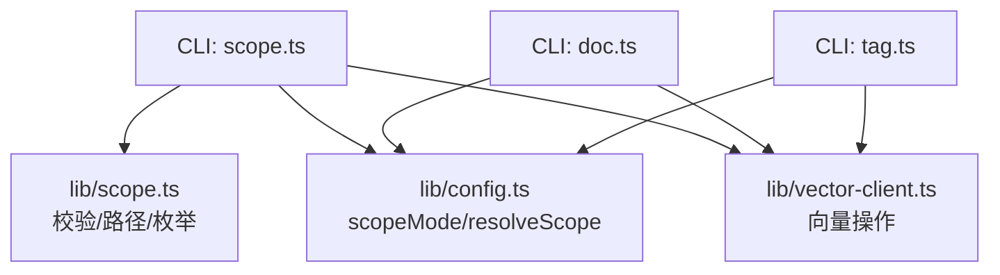
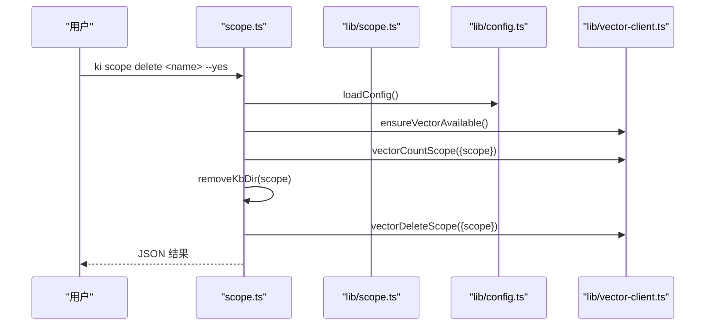
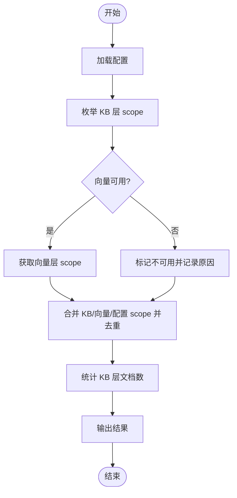
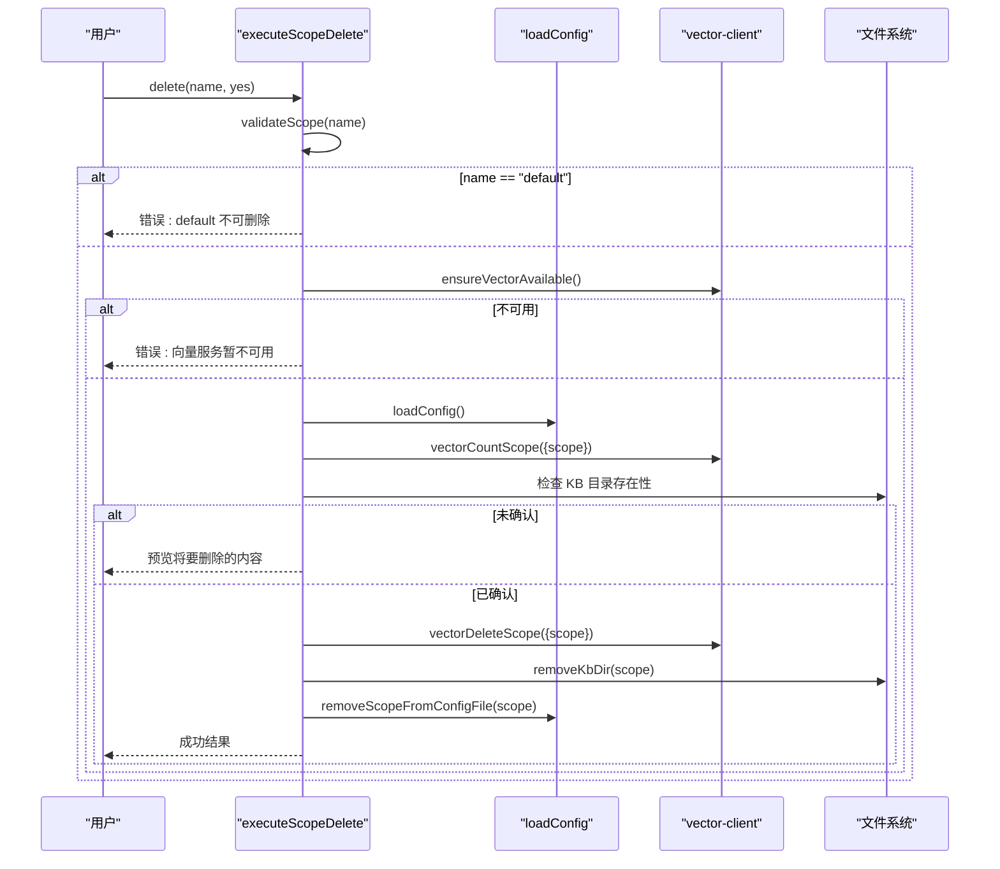
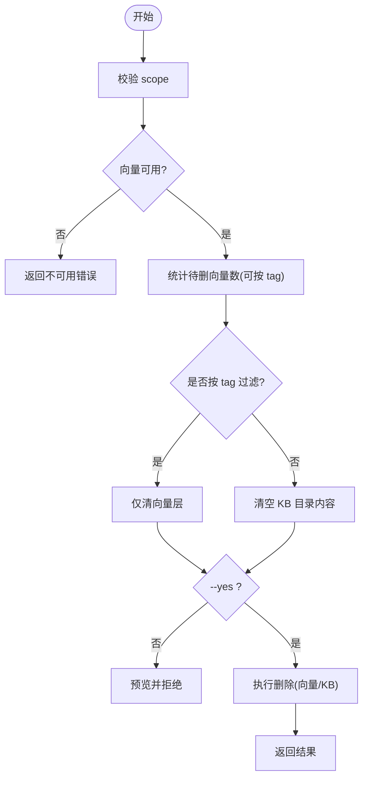
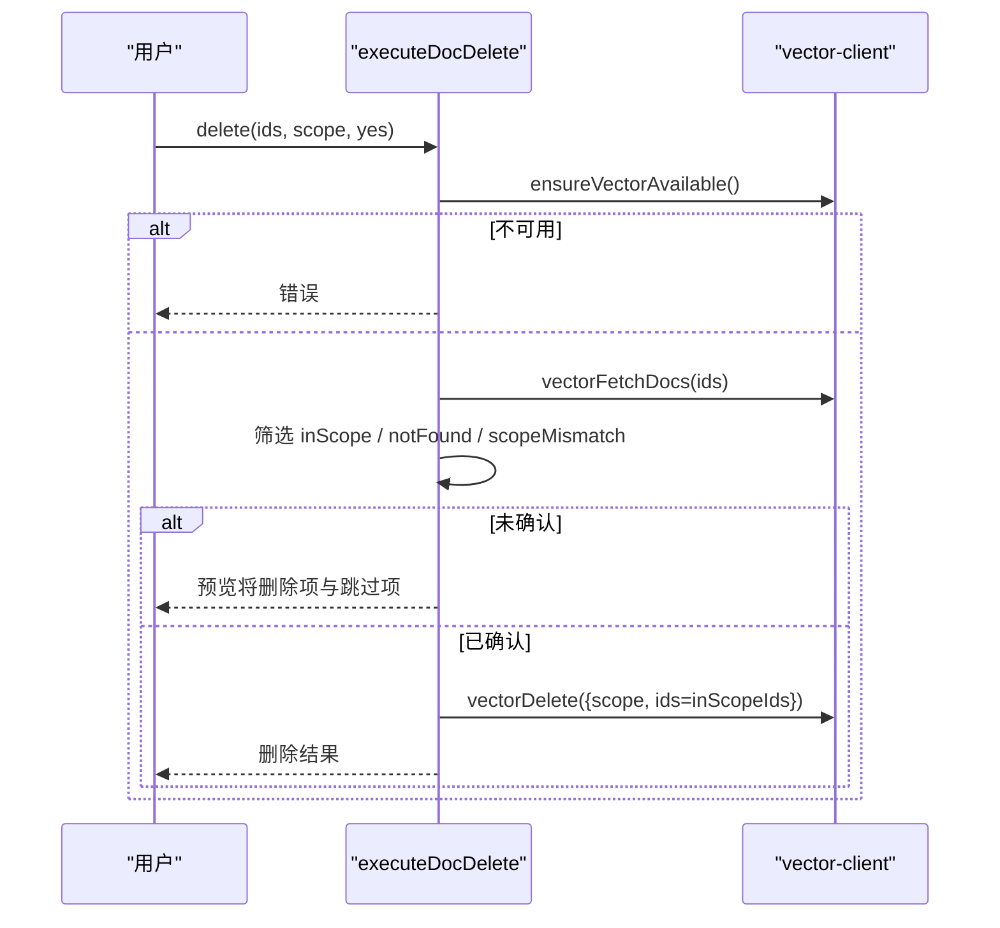
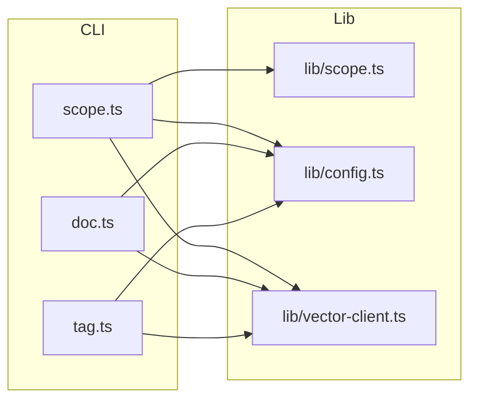

# 范围管理命令

<cite>
**本文引用的文件**
- [src/scope.ts](file://src/scope.ts)
- [src/doc.ts](file://src/doc.ts)
- [src/tag.ts](file://src/tag.ts)
- [src/lib/scope.ts](file://src/lib/scope.ts)
- [src/lib/config.ts](file://src/lib/config.ts)
- [src/lib/vector-client.ts](file://src/lib/vector-client.ts)
- [test/scope-isolation.test.ts](file://test/scope-isolation.test.ts)
</cite>

## 目录
1. [简介](#简介)
2. [项目结构](#项目结构)
3. [核心组件](#核心组件)
4. [架构总览](#架构总览)
5. [详细组件分析](#详细组件分析)
6. [依赖关系分析](#依赖关系分析)
7. [性能考量](#性能考量)
8. [故障排查指南](#故障排查指南)
9. [结论](#结论)

## 简介
本文件面向“范围（scope）管理”相关命令，系统性说明 scope、doc、tag 三类 CLI 的能力与行为：
- scope 命令：提供 list、delete、clear，覆盖 KB 目录层与向量语义层的双层一致性清理。
- doc 命令：提供 list、delete，用于查看和删除向量层文档，并内置 scope 护栏防止跨 scope 误删。
- tag 命令：提供 list，用于发现某 scope 下已使用的标签及对应文档数量。
同时解释 scope 隔离机制的实现原理与数据清理策略，帮助在多租户/多项目场景下安全地管理知识索引与向量记忆。

## 项目结构
围绕范围管理的代码主要分布在以下位置：
- src/scope.ts：scope 子命令入口与执行逻辑（list/delete/clear）。
- src/doc.ts：doc 子命令入口与执行逻辑（list/delete）。
- src/tag.ts：tag 子命令入口与执行逻辑（list）。
- src/lib/scope.ts：scope 校验、路径构造、KB 层枚举等基础能力。
- src/lib/config.ts：配置加载、scopeMode 解析、resolveScope 护栏。
- src/lib/vector-client.ts：向量客户端封装，提供 list/delete/count/listTags 等能力，并以 scope/tag 字段实现隔离。
- test/scope-isolation.test.ts：验证不同 scope 下的物理隔离与互不影响。

图表来源
- [src/scope.ts:19-30](file://src/scope.ts#L19-L30)
- [src/lib/scope.ts:30-67](file://src/lib/scope.ts#L30-L67)
- [src/lib/config.ts:463-485](file://src/lib/config.ts#L463-L485)
- [src/lib/vector-client.ts:126-147](file://src/lib/vector-client.ts#L126-L147)

章节来源
- [src/scope.ts:1-305](file://src/scope.ts#L1-L305)
- [src/doc.ts:1-200](file://src/doc.ts#L1-L200)
- [src/tag.ts:1-83](file://src/tag.ts#L1-L83)
- [src/lib/scope.ts:1-230](file://src/lib/scope.ts#L1-L230)
- [src/lib/config.ts:1-200](file://src/lib/config.ts#L1-L200)
- [src/lib/vector-client.ts:1-200](file://src/lib/vector-client.ts#L1-L200)
- [test/scope-isolation.test.ts:1-155](file://test/scope-isolation.test.ts#L1-L155)

## 核心组件
- scope 命令
  - list：合并 KB 目录层与向量层的 scope 集合，标注每个 scope 存在于哪一层、是否注册、KB 层文档数。
  - delete：删除指定 scope（禁止删除 default），依次删除向量层数据、KB 目录、配置条目；需 --yes 确认。
  - clear：清空 scope 内容（保留 scope 与配置），支持按 tag 仅清向量层；未带 tag 时同时清空 KB 目录内容；需 --yes 确认。
- doc 命令
  - list：列出指定 scope 下的文档（可限制条数、按 tag 过滤、显示完整或截断预览）。
  - delete：按 docid 删除向量层记忆，强制 scope 护栏（只删归属该 scope 的 docid），跨 scope 跳过。
- tag 命令
  - list：扫描指定 scope 下的标签及其文档数量，支持扫描上限控制，超限时返回 truncated 近似结果。

章节来源
- [src/scope.ts:56-223](file://src/scope.ts#L56-L223)
- [src/doc.ts:55-146](file://src/doc.ts#L55-L146)
- [src/tag.ts:28-51](file://src/tag.ts#L28-L51)

## 架构总览
范围管理命令通过“配置层 + 存储层 + 向量层”三层协作完成：
- 配置层：读取 scopeMode（default/strict），在 strict 模式下强制要求显式传入 scope 且必须在 scopes 白名单内。
- 存储层：基于 KB 目录（kb/{scope}）维护 group-index.json、relations-cache.json 等元数据，提供路径构造与枚举。
- 向量层：使用单一 collection，以 scope/tag 标量字段进行隔离与过滤；所有写读删均携带 scope 条件。

图表来源
- [src/scope.ts:147-181](file://src/scope.ts#L147-L181)
- [src/lib/config.ts:463-485](file://src/lib/config.ts#L463-L485)
- [src/lib/vector-client.ts:749-761](file://src/lib/vector-client.ts#L749-L761)

## 详细组件分析

### scope 命令：list
- 功能要点
  - 合并 KB 目录层（listAllScopes）、向量层（vectorListScopes）、配置项（config.scopes）三者得到并集。
  - 对每个 scope 标注 kb/vector/registered 以及 KB 层文档数（统计 relations-cache 中 hot_relations 总数）。
  - 向量层不可用时降级为仅 KB 层+配置，并输出原因提示。
- 关键流程
  - 快速探测向量可用性（fastFail=true，避免锁等待影响列表体验）。
  - 若可用则调用 vectorListScopes；否则记录不可用原因。
  - 计算 wikiCount 时读取 relations-cache 并求和。
- 输出
  - 默认人类可读表格；--json 输出结构化结果。

图表来源
- [src/scope.ts:94-134](file://src/scope.ts#L94-L134)
- [src/lib/scope.ts:174-198](file://src/lib/scope.ts#L174-L198)

章节来源
- [src/scope.ts:56-134](file://src/scope.ts#L56-L134)
- [src/lib/scope.ts:174-198](file://src/lib/scope.ts#L174-L198)

### scope 命令：delete
- 功能要点
  - 禁止删除 default scope。
  - 必须向量服务可用，否则拒绝以避免两层不一致。
  - 先预览将要删除的数据量（向量计数、KB 是否存在、是否注册），需要 --yes 确认。
  - 确认后顺序执行：删除向量层数据 → 删除 KB 目录 → 从配置文件移除 scope 条目。
- 错误处理
  - 参数非法、向量不可用、未确认等均返回结构化错误信息。

图表来源
- [src/scope.ts:147-181](file://src/scope.ts#L147-L181)
- [src/lib/vector-client.ts:749-761](file://src/lib/vector-client.ts#L749-L761)

章节来源
- [src/scope.ts:136-181](file://src/scope.ts#L136-L181)

### scope 命令：clear
- 功能要点
  - 支持按 tag 仅清向量层对应标签，不触碰 KB 目录。
  - 未指定 tag 时，既清向量层也清空 KB 目录内容（保留目录本身）。
  - 同样需要 --yes 确认，并在不可用时拒绝。
- 关键差异
  - 与 delete 不同，clear 不会删除 scope 配置条目，也不会删除 KB 目录本身。

图表来源
- [src/scope.ts:194-223](file://src/scope.ts#L194-L223)

章节来源
- [src/scope.ts:183-223](file://src/scope.ts#L183-L223)

### doc 命令：list
- 功能要点
  - 列出指定 scope 下的文档，支持 limit、tags、full 选项。
  - 向量服务不可用时返回降级错误。
  - 默认截断预览内容长度，--full 显示完整内容。
- 行为约束
  - 列表顺序不保证（引擎无排序/时间字段），limit 返回任意前 N 条。

章节来源
- [src/doc.ts:55-85](file://src/doc.ts#L55-L85)
- [src/doc.ts:153-171](file://src/doc.ts#L153-L171)

### doc 命令：delete
- 功能要点
  - 按 docid 删除向量层记忆，支持多个 id。
  - 删除前先取回文档用于预览与核对，防误删。
  - 强制 scope 护栏：只删除归属目标 scope 的 docid；跨 scope 的列入 scopeMismatch 跳过。
  - 未确认时返回预览与跳过信息；确认后执行删除。
- 注意事项
  - 若 docid 来自 scan-kb/sync-relation，KB 层 relations-cache 的 memoryId 可能变为悬空引用（需用 delete-relation 清理关系）。

图表来源
- [src/doc.ts:91-146](file://src/doc.ts#L91-L146)
- [src/lib/vector-client.ts:126-147](file://src/lib/vector-client.ts#L126-L147)

章节来源
- [src/doc.ts:87-146](file://src/doc.ts#L87-L146)

### tag 命令：list
- 功能要点
  - 扫描指定 scope 下的标签及文档数量，按数量降序排列。
  - 支持 --scan-limit 控制扫描上限，超过时返回 truncated:true 表示结果为近似值。
  - 向量服务不可用时返回降级错误。
- 设计背景
  - 引擎无 distinct，采用一次扫描 + 内存去重计数方式。

章节来源
- [src/tag.ts:28-51](file://src/tag.ts#L28-L51)
- [src/tag.ts:58-72](file://src/tag.ts#L58-L72)

## 依赖关系分析
- scope 命令依赖
  - lib/scope.ts：validateScope、getKbDir、listAllScopes、getRelationsCachePath。
  - lib/config.ts：loadConfig、removeScopeFromConfigFile。
  - lib/vector-client.ts：ensureVectorAvailable、vectorListScopes、vectorCountScope、vectorDeleteScope、closeEngine。
- doc 命令依赖
  - lib/config.ts：loadConfig、resolveScope。
  - lib/vector-client.ts：vectorListDocs、vectorFetchDocs、vectorDelete、ensureVectorAvailable、closeEngine。
- tag 命令依赖
  - lib/config.ts：loadConfig、resolveScope。
  - lib/vector-client.ts：vectorListTags、ensureVectorAvailable、closeEngine。

图表来源
- [src/scope.ts:19-30](file://src/scope.ts#L19-L30)
- [src/doc.ts:19-30](file://src/doc.ts#L19-L30)
- [src/tag.ts:18-27](file://src/tag.ts#L18-L27)

章节来源
- [src/scope.ts:19-30](file://src/scope.ts#L19-L30)
- [src/doc.ts:19-30](file://src/doc.ts#L19-L30)
- [src/tag.ts:18-27](file://src/tag.ts#L18-L27)

## 性能考量
- scope list 的向量探测使用 fastFail=true，避免因向量锁导致列表卡顿。
- tag list 的扫描受 --scan-limit 限制，超出时返回 truncated 近似结果，避免全量扫描带来的性能压力。
- doc list 默认限制返回条数（limit=10），减少网络与序列化开销。
- 向量客户端具备撞锁重试与空闲释放锁机制，提升共享向量库场景下的并发稳定性。

[本节为通用性能建议，不直接分析具体文件]

## 故障排查指南
- 向量服务不可用
  - 现象：scope delete/clear、doc list/delete、tag list 返回“向量服务暂不可用”。
  - 处理：检查向量进程状态、锁占用情况；必要时恢复或重建向量库。
- 未确认破坏性操作
  - 现象：scope delete/clear、doc delete 在未传 --yes 时返回预览并拒绝。
  - 处理：确认要删除的数据后追加 --yes。
- strict 模式未传或未注册 scope
  - 现象：resolveScope 抛出错误，提示必须显式传入 scope 或在配置中注册。
  - 处理：在配置 scopes 中添加对应 scope，或切换到 default 模式。
- 跨 scope 误删防护
  - 现象：doc delete 时出现 scopeMismatch 跳过。
  - 处理：确认 docid 所属 scope，或使用正确的 scope 参数执行删除。

章节来源
- [src/scope.ts:147-181](file://src/scope.ts#L147-L181)
- [src/doc.ts:91-146](file://src/doc.ts#L91-L146)
- [src/lib/config.ts:463-485](file://src/lib/config.ts#L463-L485)

## 结论
- scope 命令提供了双层（KB 与向量）一致性的生命周期管理能力，支持 list、delete、clear，并通过 --yes 保护破坏性操作。
- doc 命令聚焦向量层文档的查看与删除，内置严格的 scope 护栏，防止跨 scope 误删。
- tag 命令提供只读的标签发现能力，便于后续精确过滤。
- scope 隔离机制通过“配置层 resolveScope + 存储层路径隔离 + 向量层 scope/tag 字段过滤”共同实现，确保多租户/多项目间数据互不串扰。
- 数据清理策略遵循“最小破坏”原则：clear 保留 scope 与配置，delete 彻底移除；向量与 KB 层保持一致性，必要时需手动修复关系缓存。

[本节为总结性内容，不直接分析具体文件]