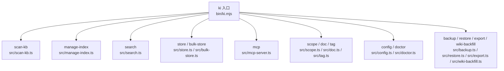
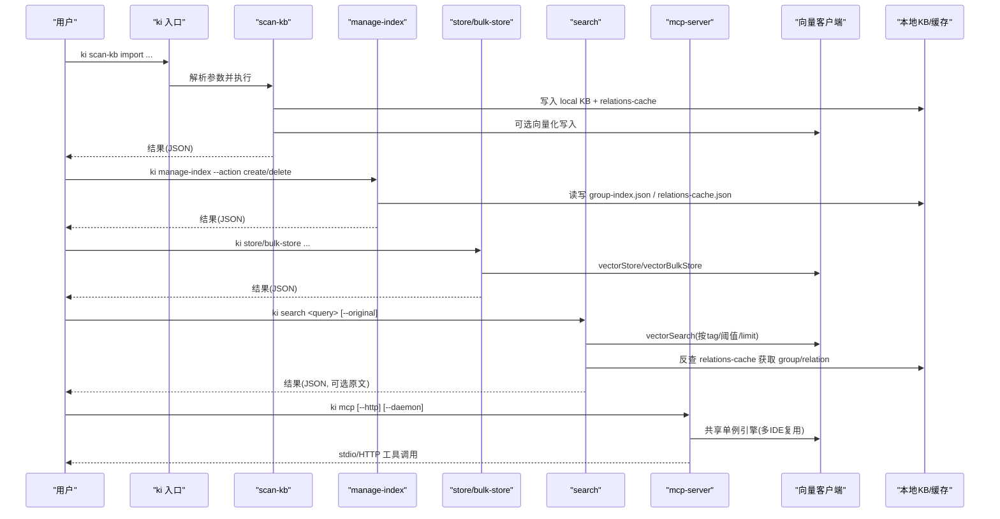
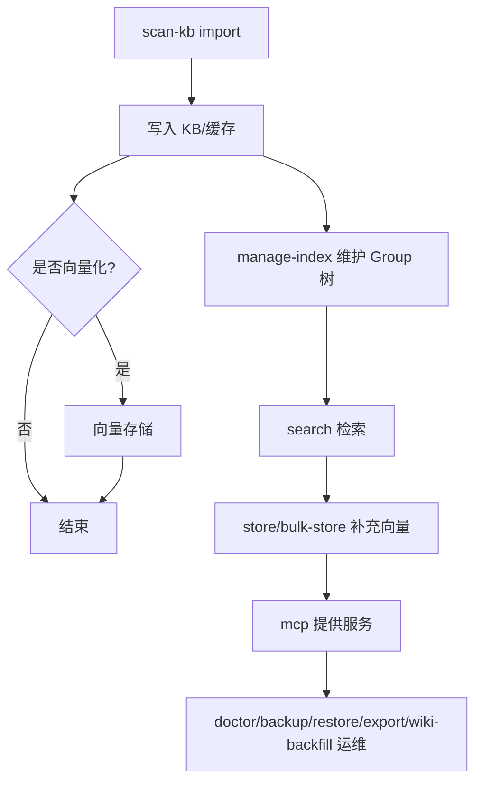

# CLI命令参考

<cite>
**本文引用的文件**
- [bin/ki.mjs](file://bin/ki.mjs)
- [src/scan-kb.ts](file://src/scan-kb.ts)
- [src/manage-index.ts](file://src/manage-index.ts)
- [src/search.ts](file://src/search.ts)
- [src/store.ts](file://src/store.ts)
- [src/mcp-server.ts](file://src/mcp-server.ts)
- [src/scope.ts](file://src/scope.ts)
- [src/doc.ts](file://src/doc.ts)
- [src/tag.ts](file://src/tag.ts)
- [src/config.ts](file://src/config.ts)
- [src/doctor.ts](file://src/doctor.ts)
- [src/backup.ts](file://src/backup.ts)
- [src/restore.ts](file://src/restore.ts)
- [src/export.ts](file://src/export.ts)
- [src/wiki-backfill.ts](file://src/wiki-backfill.ts)
- [src/bulk-store.ts](file://src/bulk-store.ts)
- [src/lib/cli-args.ts](file://src/lib/cli-args.ts)
</cite>

## 目录
1. [简介](#简介)
2. [项目结构](#项目结构)
3. [核心组件](#核心组件)
4. [架构总览](#架构总览)
5. [详细命令参考](#详细命令参考)
6. [依赖关系与执行顺序](#依赖关系与执行顺序)
7. [性能考虑](#性能考虑)
8. [故障排查指南](#故障排查指南)
9. [结论](#结论)
10. [附录](#附录)

## 简介
本参考文档面向使用 ki CLI 的用户，系统化梳理全部 19 个命令的功能、参数、使用场景与示例，覆盖主要命令组：scan-kb（知识库导入）、manage-index（索引管理）、search（搜索检索）、store（数据存储）、mcp（MCP服务管理），以及 scope/doc/tag、配置与健康诊断、备份恢复、导出与Wiki补齐等。文档同时说明命令间的依赖关系、错误处理策略、常用工作流与性能优化建议，帮助读者高效完成知识入库、检索与管理的全流程。

## 项目结构
ki 的命令行入口为 bin/ki.mjs，负责解析全局参数（如 --config）、显示版本与帮助、路由到具体命令脚本（位于 src/*.ts）。各命令脚本基于 commander 或手写 argv 解析，调用 lib/* 中的能力模块（配置、向量客户端、存储、健康检查等）完成实际业务逻辑。

图表来源
- [bin/ki.mjs:28-49](file://bin/ki.mjs#L28-L49)

章节来源
- [bin/ki.mjs:1-133](file://bin/ki.mjs#L1-L133)

## 核心组件
- 统一入口与路由：bin/ki.mjs 提供版本、帮助、--config 预解析、子进程转发与守护模式支持。
- 公共校验工具：src/lib/cli-args.ts 提供未知参数检测、JSON 错误契约、数值参数解析等。
- 向量能力封装：lib/vector-client.js（被 search/store/bulk-store/scope/doc/tag 等引用）提供 ensureVectorAvailable、vectorStore/vectorSearch/vectorBulkStore 等。
- 配置与范围：lib/config.js、lib/scope.js 提供加载配置、scope 解析与路径计算。
- 健康检查：lib/health-check.js 用于 doctor 与 mcp 启动前预检。

章节来源
- [bin/ki.mjs:51-133](file://bin/ki.mjs#L51-L133)
- [src/lib/cli-args.ts:1-152](file://src/lib/cli-args.ts#L1-L152)

## 架构总览
下图展示典型“导入→索引→检索”的数据流：scan-kb import 将外部 Wiki 切分写入本地 KB 与 relations-cache；可选向量化后写入向量库；search 通过向量检索并反查 relations-cache 定位原文；store/bulk-store 直接写入向量层；manage-index 维护 Group 树；mcp 暴露工具供 IDE/Agent 调用。

图表来源
- [bin/ki.mjs:28-49](file://bin/ki.mjs#L28-L49)
- [src/scan-kb.ts:35-77](file://src/scan-kb.ts#L35-L77)
- [src/manage-index.ts:415-635](file://src/manage-index.ts#L415-L635)
- [src/search.ts:204-237](file://src/search.ts#L204-L237)
- [src/store.ts:55-80](file://src/store.ts#L55-L80)
- [src/mcp-server.ts:492-734](file://src/mcp-server.ts#L492-L734)

## 详细命令参考

### 全局参数
- --config <path>：指定配置文件路径，可在任意命令位置使用。入口会将其注入子进程环境变量，供后续命令读取。

章节来源
- [bin/ki.mjs:54-63](file://bin/ki.mjs#L54-L63)

### 命令组：scan-kb（知识库导入）
- 子命令：import
- 功能：从外部 Markdown 目录直导知识库，自动切分，幂等追加到目标 group；可选择关闭向量化仅写 KB 层。
- 关键参数
  - --source <sourceDir>：外部 Wiki 根目录（必填）
  - --scope <scope>：项目隔离标识（default 可省略，strict 必填）
  - --group <group>：目标 Group 落点（不存在时自动新建）
  - --chunk-size <n>：切分目标长度（字符）
  - --chunk-overlap <n>：切分重叠字符数
  - --no-vector：仅写 KB 层，不写向量
  - --no-clean：关闭数据清洗
  - --clean-rules <rules>：覆盖内置清洗规则开关（逗号分隔）
- 行为要点
  - 导入成功后触发自动备份（失败不阻断）
  - 输出 JSON 结果，异常返回 {ok:false,...}
- 示例
  - ki scan-kb import --scope my-project --source ./wiki --group wiki
  - ki scan-kb import --source ./wiki --no-vector

章节来源
- [src/scan-kb.ts:35-77](file://src/scan-kb.ts#L35-L77)
- [bin/ki.mjs:74-133](file://bin/ki.mjs#L74-L133)

### 命令组：manage-index（索引管理）
- 功能：Group 树 CRUD 与 scope 列表查询。
- 关键参数
  - --scope <scope>：项目隔离标识（list-scopes 时可省略）
  - --action <action>：create | delete | list-scopes（默认 create）
  - --parent <parent>：父节点路径
  - -n, --name <name>：节点名称
  - --force：强制删除非空节点
- 行为要点
  - create：在指定父节点下创建新节点，支持路径自动补全与冲突提示
  - delete：删除节点，非空需 --force；级联清理 relations-cache、local-kb、向量记忆
  - list-scopes：列出已注册与已初始化的 scope 及其顶层 Group
- 示例
  - ki manage-index --scope my-project --action create-root --root-name "我的项目"
  - ki manage-index --scope my-project --action delete --name "旧分组" --force
  - ki manage-index --action list-scopes

章节来源
- [src/manage-index.ts:415-635](file://src/manage-index.ts#L415-L635)

### 命令组：search（搜索检索）
- 功能：语义检索知识库内容，支持标签过滤、相似度阈值、返回原文。
- 关键参数
  - 位置参数 query 或 -q, --query <query>：查询文本（必填）
  - -s, --scope <scope>：项目隔离标识
  - --limit <n>：返回条数上限（默认 10）
  - --threshold <n>：相似度阈值（默认 0）
  - --tags <tags>：过滤标签（逗号分隔，OR）
  - --original：返回 local KB 文件级原文（默认不返回）
- 行为要点
  - 未传 tags 时按 tag 优先级（ki-search > ki-relation > ki-path）分别检索并合并
  - 支持 Multi-tag 去重与同文件多 chunk 去重
  - 向量不可用时返回降级信息
- 示例
  - ki search "用户登录流程" --scope my-project --limit 5
  - ki search --query "权限模型" --tags ki-relation,ki-path --original

章节来源
- [src/search.ts:204-237](file://src/search.ts#L204-L237)

### 命令组：store（数据存储）
- 功能：存储文本到向量索引。
- 关键参数
  - 位置参数 text 或 -t, --text <text>：待向量化文本（必填）
  - -s, --scope <scope>：项目隔离标识
  - --tags <tags>：标签（默认 ki-search）
- 行为要点
  - 向量不可用时报错并退出
  - 成功返回 docId
- 示例
  - ki store "临时笔记内容" --scope my-project
  - ki store --text "API 变更摘要" --tags ki-search,ki-relation

章节来源
- [src/store.ts:55-80](file://src/store.ts#L55-L80)

### 命令组：bulk-store（批量存储）
- 功能：批量存储文本到向量索引。
- 关键参数
  - -i, --input <file>：批量数据 JSON 文件路径（必填）
  - -s, --scope <scope>：项目隔离标识
- 输入格式
  - JSON 数组，每项包含 text（必填），可选 tags（默认 ki-search）
- 行为要点
  - 对每条记录进行校验，返回成功/失败明细
- 示例
  - ki bulk-store --input ./batch.json --scope my-project

章节来源
- [src/bulk-store.ts:82-99](file://src/bulk-store.ts#L82-L99)

### 命令组：mcp（MCP服务管理）
- 功能：启动 MCP Server（stdio 默认；HTTP 共享单例），并提供 token 管理与状态查看。
- 关键参数
  - --http：启用 HTTP 共享单例（默认回环地址，本机免鉴权）
  - --host <addr>：绑定地址（默认 127.0.0.1）
  - --port <port>：端口（默认 7423）
  - --token <value>：全权临时 Token（也可通过环境变量 KI_MCP_TOKEN）
  - --allowed-hosts <a,b>：允许的 Host 头白名单
  - --web：HTTP 模式下提供前端静态页面
  - --daemon/-d：后台常驻运行（仅 HTTP 模式）
  - --status：查看 HTTP 单例运行状态（只读）
  - stop：关闭本机所有 ki mcp 实例并清理 lock
  - restart：重启 HTTP 单例（仅 HTTP 模式，后台常驻）
  - token generate/list/update/delete：Token 生命周期管理（generate 必须显式 --scope）
- 行为要点
  - 非回环绑定必须可鉴权（优先 --token/env，否则需多 Token 存储）
  - 启动前执行健康检查（ki doctor 逻辑），失败拒绝启动
  - stdio 与 HTTP 共享向量引擎单例，避免锁冲突
- 示例
  - ki mcp
  - ki mcp --http
  - ki mcp --http --daemon
  - ki mcp --status
  - ki mcp token generate --scope team-a
  - ki mcp token list
  - ki mcp token update <id> --scope all
  - ki mcp token delete <id>
  - ki mcp --http --host 0.0.0.0

章节来源
- [src/mcp-server.ts:83-107](file://src/mcp-server.ts#L83-L107)
- [src/mcp-server.ts:137-212](file://src/mcp-server.ts#L137-L212)
- [src/mcp-server.ts:227-351](file://src/mcp-server.ts#L227-L351)
- [src/mcp-server.ts:492-734](file://src/mcp-server.ts#L492-L734)

### 命令：scope（范围管理）
- 子命令
  - list：列出所有 scope（两层并集，标注所在层）
  - delete <name>：彻底删除 scope（向量+KB目录+配置条目），default 不可删
  - clear <name>：清空 scope 内容（保留 scope 与配置），带 --tags 仅清向量层对应 tag
- 关键参数
  - --yes：确认执行破坏性操作
  - --tags <tags>：仅清指定标签（逗号分隔）
- 示例
  - ki scope list
  - ki scope delete my-project --yes
  - ki scope clear my-project --tags ki-search --yes

章节来源
- [src/scope.ts:233-292](file://src/scope.ts#L233-L292)

### 命令：doc（向量文档管理）
- 子命令
  - list：列出指定 scope 下文档（可限制数量、按 tag 过滤、完整内容预览）
  - delete <docid...>：按 docid 删除向量层记忆（可多个）
- 关键参数
  - -s, --scope <scope>：项目隔离标识
  - --limit <n>：返回条数上限（默认 10）
  - --tags <tags>：过滤标签（逗号分隔）
  - --full：显示完整内容（默认截断预览 200 字）
  - --yes：确认执行删除
- 行为要点
  - 删除时进行 scope 护栏：仅删除归属该 scope 的 docid，跨 scope 跳过
- 示例
  - ki doc list --scope my-project --limit 20 --tags ki-search
  - ki doc delete abc123 --scope my-project --yes

章节来源
- [src/doc.ts:150-189](file://src/doc.ts#L150-L189)

### 命令：tag（标签发现）
- 子命令
  - list：列出指定 scope 下用过的 tag（含文档数，按数量降序）
- 关键参数
  - -s, --scope <scope>：项目隔离标识
  - --scan-limit <n>：扫描上限（超出则结果为近似，truncated:true）
- 示例
  - ki tag list --scope my-project --scan-limit 5000

章节来源
- [src/tag.ts:55-72](file://src/tag.ts#L55-L72)

### 命令：config（配置管理）
- 子命令
  - init：生成配置文件模板到 .ki/config.yaml（YAML 格式，含注释）
- 关键参数
  - --dir <path>：目标目录（默认 $HOME）
  - --force：强制覆盖已有配置文件
- 行为要点
  - 自动生成 dataDir/backupDir/vectorDir 目录（若可写）
- 示例
  - ki config init
  - ki config init --dir ~/my-config --force

章节来源
- [src/config.ts:181-203](file://src/config.ts#L181-L203)

### 命令：doctor（健康诊断）
- 功能：一键诊断配置有效性（apiKey/连通性/维度/目录等），输出 ✅/⚠️/❌ 报告。
- 行为要点
  - 只读，不修改任何配置或数据；有失败项时退出码 1
- 示例
  - ki doctor
  - ki --config ./custom.yaml doctor

章节来源
- [src/doctor.ts:18-49](file://src/doctor.ts#L18-L49)

### 命令：backup（备份）
- 功能：手动备份 scope 目录快照；或列出已有备份。
- 关键参数
  - --list：列出已有备份（只读）
- 行为要点
  - 要求 scope 已初始化（存在 relations-cache.json）
- 示例
  - ki backup my-project
  - ki backup my-project --list

章节来源
- [src/backup.ts:26-103](file://src/backup.ts#L26-L103)

### 命令：restore（还原）
- 功能：从 tar.gz 快照还原 scope；或仅重建向量；或列出可用备份。
- 关键参数
  - --from-snapshot [<file>]：从快照覆盖还原（破坏性，需 --yes）
  - --rebuild-vector：还原后（或独立）从已还原 KB 重建向量
  - --timestamp <ts>：指定快照时间戳（默认取最新）
  - --backup-dir <dir>：指定备份根目录
  - --yes：跳过确认直接执行
- 行为要点
  - 还原前创建安全网快照；tar 解压失败尝试自动恢复
  - 向量文档不随快照还原，需单独重建
- 示例
  - ki restore my-project --from-snapshot --yes
  - ki restore my-project --rebuild-vector
  - ki restore my-project --list

章节来源
- [src/restore.ts:310-446](file://src/restore.ts#L310-L446)

### 命令：export（导出）
- 功能：将 KB scope 的结构化数据反向导出为 Markdown 文件目录。
- 关键参数
  - --output <dir>：导出输出目录（必填）
  - --group <path>：指定导出的 Group 路径（缺省全量导出）
  - --yes：确认覆盖已存在的输出目录（防误覆盖）
- 行为要点
  - 写盘前预检输出目录可写性；输出目录非空且无 --yes 时拒绝覆盖
- 示例
  - ki export my-project --output ./wiki-output
  - ki export my-project --output ./wiki-output --group "核心概念/认证"

章节来源
- [src/export.ts:324-399](file://src/export.ts#L324-L399)

### 命令：wiki-backfill（Wiki历史补齐）
- 功能：将 KB 中已有 Relations 全量写回 Wiki（幂等覆盖）。
- 关键参数
  - --force：全量覆盖写（刷新 exportedAt）
- 前置条件
  - wikiSync.enabled 不为 false，且存在 wiki 目标目录
- 示例
  - ki wiki-backfill my-project
  - ki wiki-backfill my-project --force

章节来源
- [src/wiki-backfill.ts:18-66](file://src/wiki-backfill.ts#L18-L66)

## 依赖关系与执行顺序
- 导入阶段：scan-kb import → 写入 local KB + relations-cache → 可选向量化 → 自动备份
- 索引阶段：manage-index 维护 Group 树；delete 级联清理 cache/local-kb/向量
- 检索阶段：search → 向量检索 → 反查 relations-cache → 可选原文
- 存储阶段：store/bulk-store → 向量存储
- 服务阶段：mcp → 共享向量引擎（stdio/HTTP），token 鉴权，健康检查
- 运维阶段：doctor → 健康检查；backup/restore → 快照；export → 导出；wiki-backfill → 历史补齐

图表来源
- [src/scan-kb.ts:35-77](file://src/scan-kb.ts#L35-L77)
- [src/manage-index.ts:415-635](file://src/manage-index.ts#L415-L635)
- [src/search.ts:204-237](file://src/search.ts#L204-L237)
- [src/store.ts:55-80](file://src/store.ts#L55-L80)
- [src/mcp-server.ts:492-734](file://src/mcp-server.ts#L492-L734)

## 性能考虑
- 向量服务可用性：search/store/bulk-store/scope/doc/tag 均先检测 ensureVectorAvailable，避免无效请求。
- 批量操作：bulk-store 适合大批量写入；search 支持 limit/threshold/tags 控制结果规模。
- 级联删除：manage-index delete 批量收集 memoryId 一次 vectorDelete，减少网络往返。
- 空闲释放：mcp 长驻进程启用向量库空闲释放锁，避免多实例争抢导致阻塞。
- 预检与防护：restore/export/backup 在写盘前进行可写性与空间检查，降低失败风险。

[本节为通用指导，无需特定文件来源]

## 故障排查指南
- 未知参数：cli-args 提供 detectUnknownFlags，未知 flag 会输出帮助并给出最接近的正确参数建议。
- 数值参数非法：parseIntArg/parseFloatArg 会警告并回退默认值，避免静默错误。
- 向量不可用：search/store/bulk-store 返回降级信息，需检查 embedding 配置与连接。
- MCP 启动失败：
  - 非回环绑定需鉴权：确保设置 KI_MCP_TOKEN 或多 Token 存储
  - 健康检查失败：运行 ki doctor 查看详细问题
  - 守护模式启动失败：前台运行同样命令查看具体错误
- 还原失败：restore 会在 tar 解压失败时尝试从安全网快照恢复；若仍失败，按提示手动恢复。

章节来源
- [src/lib/cli-args.ts:77-106](file://src/lib/cli-args.ts#L77-L106)
- [src/lib/cli-args.ts:117-150](file://src/lib/cli-args.ts#L117-L150)
- [src/search.ts:84-92](file://src/search.ts#L84-L92)
- [src/mcp-server.ts:186-212](file://src/mcp-server.ts#L186-L212)
- [src/mcp-server.ts:660-678](file://src/mcp-server.ts#L660-L678)
- [src/restore.ts:239-270](file://src/restore.ts#L239-L270)

## 结论
ki CLI 提供了完整的知识库导入、索引管理、检索、存储与服务管理能力。通过统一的参数规范、健壮的参数校验与错误处理、以及完善的运维工具链，用户可以高效地完成从数据入库到检索应用的全流程。建议在生产环境中结合 doctor 预检、backup/restore 快照机制与 mcp 共享单例模式，保障稳定性与可维护性。

[本节为总结，无需特定文件来源]

## 附录
- 常用工作流最佳实践
  - 首次使用：ki config init → ki doctor → ki scan-kb import → ki manage-index 组织 Group → ki search 验证检索
  - 增量更新：重复执行 scan-kb import（幂等追加）→ 按需 rebuild-vector
  - 批量入库：准备 batch.json → ki bulk-store → ki search 验证
  - 服务化接入：ki mcp --http → IDE 配置 URL 型接入 → 使用 ki mcp token 管理鉴权
  - 运维保障：定期 ki backup → 必要时 ki restore → 导出归档 ki export → 历史补齐 ki wiki-backfill
- 性能优化建议
  - 合理设置 chunk-size/chunk-overlap 平衡检索精度与体积
  - 使用 tags 精确过滤缩小检索范围
  - 批量写入优先使用 bulk-store
  - 长驻服务使用 mcp --http 共享单例，避免多进程锁竞争

[本节为通用指导，无需特定文件来源]