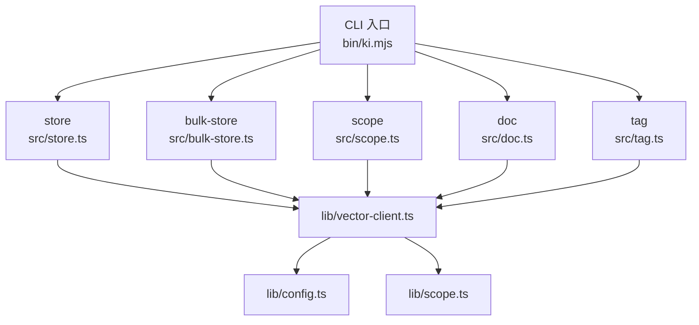
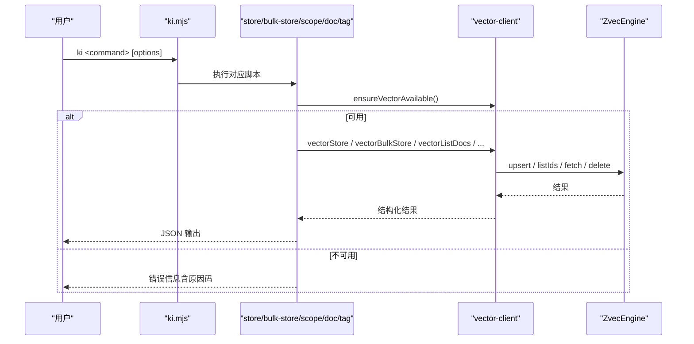
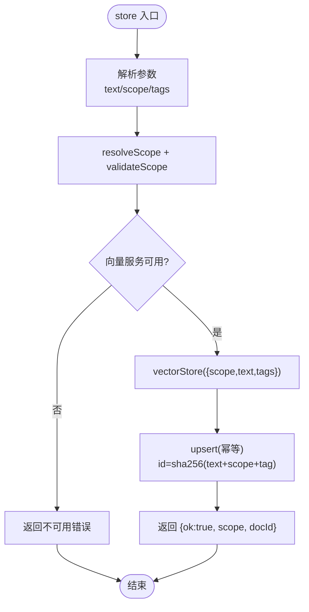
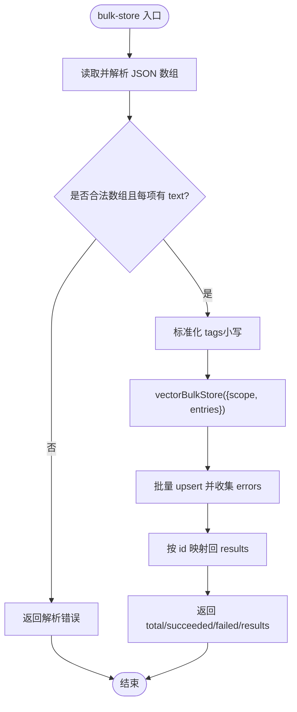
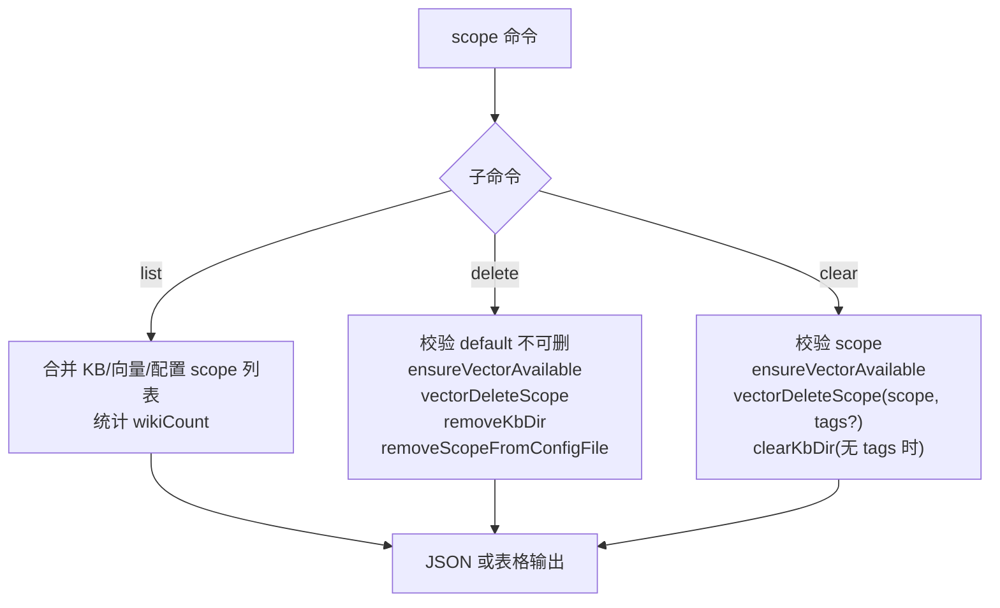
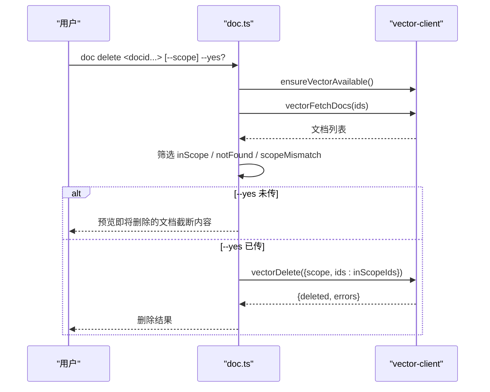
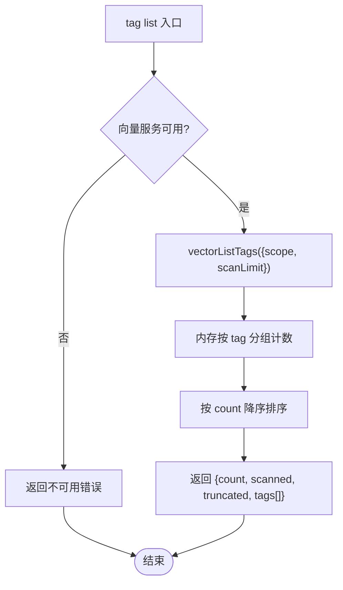
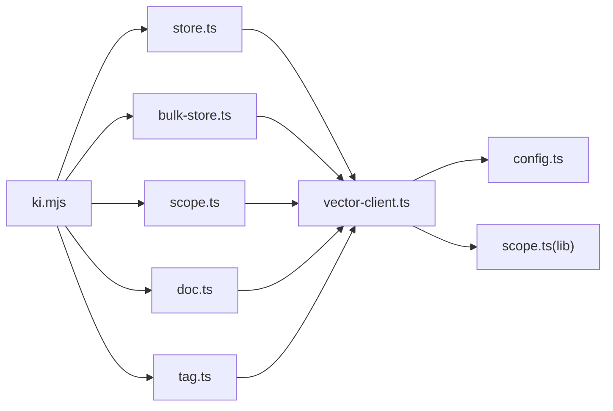

# 存储管理命令

<cite>
**本文引用的文件**
- [bin/ki.mjs](file://bin/ki.mjs)
- [src/store.ts](file://src/store.ts)
- [src/bulk-store.ts](file://src/bulk-store.ts)
- [src/scope.ts](file://src/scope.ts)
- [src/doc.ts](file://src/doc.ts)
- [src/tag.ts](file://src/tag.ts)
- [src/lib/vector-client.ts](file://src/lib/vector-client.ts)
- [src/lib/scope.ts](file://src/lib/scope.ts)
- [src/lib/config.ts](file://src/lib/config.ts)
- [test/scope-isolation.test.ts](file://test/scope-isolation.test.ts)
</cite>

## 目录
1. [简介](#简介)
2. [项目结构](#项目结构)
3. [核心组件](#核心组件)
4. [架构总览](#架构总览)
5. [详细组件分析](#详细组件分析)
6. [依赖关系分析](#依赖关系分析)
7. [性能与一致性](#性能与一致性)
8. [故障排查](#故障排查)
9. [结论](#结论)
10. [附录：命令速查与示例](#附录命令速查与示例)

## 简介
本文件面向“存储管理”相关命令，覆盖 store（文本存储）、bulk-store（批量存储）、scope（作用域管理）、doc（文档管理）、tag（标签发现）等能力。重点说明：
- 数据存储格式与字段约定（scope、tag、content、group）
- 批量操作优化策略与幂等 upsert
- 作用域隔离机制（KB 目录层 + 向量语义层）
- 文档生命周期管理（创建、查看、删除）
- 标签发现与过滤
- 参数选项、数据结构与返回值格式
- 数据导入导出、批量处理、作用域管理的实际使用场景
- 存储性能优化与数据一致性最佳实践

## 项目结构
存储管理命令由 CLI 入口统一分发到具体实现模块，并通过 lib 层封装向量引擎与配置、作用域校验等通用能力。

图表来源
- [bin/ki.mjs:29-49](file://bin/ki.mjs#L29-L49)
- [src/store.ts:12-16](file://src/store.ts#L12-L16)
- [src/bulk-store.ts:19-24](file://src/bulk-store.ts#L19-L24)
- [src/scope.ts:19-30](file://src/scope.ts#L19-L30)
- [src/doc.ts:19-27](file://src/doc.ts#L19-L27)
- [src/tag.ts:18-24](file://src/tag.ts#L18-L24)
- [src/lib/vector-client.ts:16-33](file://src/lib/vector-client.ts#L16-L33)
- [src/lib/config.ts:148-175](file://src/lib/config.ts#L148-L175)
- [src/lib/scope.ts:30-43](file://src/lib/scope.ts#L30-L43)

章节来源
- [bin/ki.mjs:29-49](file://bin/ki.mjs#L29-L49)

## 核心组件
- store：单条文本向量化并持久化到向量索引，支持 scope 与 tag，返回 docId
- bulk-store：批量读取 JSON 数组，按条目进行幂等 upsert，返回逐条结果统计
- scope：列出/清理/删除 scope，协调 KB 目录层与向量语义层
- doc：列出/删除向量层文档，支持 scope 护栏与预览
- tag：只读扫描指定 scope 下的标签及计数，用于后续过滤
- vector-client：封装 ZvecEngine，提供存储、检索、删除、枚举、可用性检测、空闲锁释放等能力
- config：加载配置、解析 embedding、scopeMode、路径展开等
- scope 工具：校验 scope、构造 KB 路径、枚举 scope、读写 group-index.json

章节来源
- [src/store.ts:23-51](file://src/store.ts#L23-L51)
- [src/bulk-store.ts:32-78](file://src/bulk-store.ts#L32-L78)
- [src/scope.ts:94-132](file://src/scope.ts#L94-L132)
- [src/doc.ts:59-85](file://src/doc.ts#L59-L85)
- [src/tag.ts:34-51](file://src/tag.ts#L34-L51)
- [src/lib/vector-client.ts:513-590](file://src/lib/vector-client.ts#L513-L590)
- [src/lib/config.ts:148-175](file://src/lib/config.ts#L148-L175)
- [src/lib/scope.ts:30-43](file://src/lib/scope.ts#L30-L43)

## 架构总览
存储管理命令通过 CLI 入口分发到对应脚本，脚本负责参数解析、scope 解析与校验、调用 vector-client 完成底层向量库操作。vector-client 维护进程内引擎单例，具备撞锁重试、空闲释放锁、在途保护与自愈重试等机制，确保多实例共享同一向量库时的稳定性。

图表来源
- [bin/ki.mjs:29-49](file://bin/ki.mjs#L29-L49)
- [src/lib/vector-client.ts:420-467](file://src/lib/vector-client.ts#L420-L467)
- [src/lib/vector-client.ts:513-590](file://src/lib/vector-client.ts#L513-L590)

## 详细组件分析

### store（文本存储）
- 功能：将文本向量化后写入向量索引，支持 scope 与 tag；默认 tag 为 ki-search
- 参数
  - 位置参数或 --text：待存储的文本
  - --scope：作用域标识（default 模式可省略，strict 模式必填）
  - --tags：标签（逗号分隔多个），默认 ki-search
- 数据结构
  - 输入：{ text, scope?, tags? }
  - 输出：{ ok: true/false; scope?; docId?; error? }
- 行为要点
  - 解析并校验 scope（resolveScope + validateScope）
  - 检查向量服务可用性（ensureVectorAvailable）
  - 生成 docId = sha256(text + scope + tag) 前 32 位，幂等 upsert
  - CLI 每次调用结束后关闭 engine，避免进程无法退出

图表来源
- [src/store.ts:23-51](file://src/store.ts#L23-L51)
- [src/lib/vector-client.ts:513-542](file://src/lib/vector-client.ts#L513-L542)
- [src/lib/vector-client.ts:240-242](file://src/lib/vector-client.ts#L240-L242)

章节来源
- [src/store.ts:23-51](file://src/store.ts#L23-L51)
- [src/lib/vector-client.ts:513-542](file://src/lib/vector-client.ts#L513-L542)

### bulk-store（批量存储）
- 功能：从 JSON 数组批量写入向量索引，支持逐条成功/失败统计
- 参数
  - --input：批量数据 JSON 文件路径（必需）
  - --scope：作用域标识（default 模式可省略，strict 模式必填）
- 输入文件格式
  - JSON 数组，每项包含 text（必填）与可选 tags（默认 ki-search）
- 输出结构
  - { ok: true/false; scope?; total; succeeded; failed; results[] }
  - results 中每项包含 index、memoryId?、success、error?
- 行为要点
  - 校验输入文件存在性与格式
  - 对每条记录标准化 tag（小写）
  - 批量 upsert，聚合错误并按 id 映射回结果项
  - CLI 结束后关闭 engine

图表来源
- [src/bulk-store.ts:32-78](file://src/bulk-store.ts#L32-L78)
- [src/lib/vector-client.ts:547-590](file://src/lib/vector-client.ts#L547-L590)

章节来源
- [src/bulk-store.ts:32-78](file://src/bulk-store.ts#L32-L78)
- [src/lib/vector-client.ts:547-590](file://src/lib/vector-client.ts#L547-L590)

### scope（作用域管理）
- 功能：管理 KB 目录层与向量语义层的 scope 生命周期
- 子命令
  - list：列出所有 scope，标注存在于 KB/向量/配置注册情况，以及 KB 层文档数
  - delete：彻底删除 scope（向量 + KB 目录 + 配置条目），需 --yes 确认，default 不可删
  - clear：清空 scope 内容（保留 scope 与配置），带 --tags 时仅清向量层对应 tag，否则清全部并清 KB 目录内容
- 关键行为
  - 破坏性操作需 --yes 确认，未确认则返回预览信息
  - 删除/清理前检查向量服务可用性，防止两层不一致
  - 统计 KB 层文档数基于 relations-cache 的 hot_relations 总数
  - 删除 scope 时会尝试移除配置文件中的 scopes 条目

图表来源
- [src/scope.ts:94-132](file://src/scope.ts#L94-L132)
- [src/scope.ts:145-179](file://src/scope.ts#L145-L179)
- [src/scope.ts:192-221](file://src/scope.ts#L192-L221)
- [src/lib/vector-client.ts:732-753](file://src/lib/vector-client.ts#L732-L753)
- [src/lib/config.ts:476-508](file://src/lib/config.ts#L476-L508)

章节来源
- [src/scope.ts:94-132](file://src/scope.ts#L94-L132)
- [src/scope.ts:145-179](file://src/scope.ts#L145-L179)
- [src/scope.ts:192-221](file://src/scope.ts#L192-L221)

### doc（文档管理）
- 功能：查看与删除向量层文档（管理面）
- 子命令
  - list：列出指定 scope 下文档，支持 --limit、--tags、--full
  - delete：按 docid 删除（可多个），支持 --scope 护栏与 --yes 确认
- 行为要点
  - list：顺序不保证，--full 显示完整内容，否则截断预览
  - delete：先取回文档用于预览与核对；按 scope 护栏仅删除归属该 scope 的 docid；跨 scope 的 docid 列入 scopeMismatch 跳过
  - 若 docid 来自 scan-kb/sync-relation，KB 层 relations-cache 可能出现悬空引用（需用 delete-relation 清理）

图表来源
- [src/doc.ts:59-85](file://src/doc.ts#L59-L85)
- [src/doc.ts:91-146](file://src/doc.ts#L91-L146)
- [src/lib/vector-client.ts:661-667](file://src/lib/vector-client.ts#L661-L667)
- [src/lib/vector-client.ts:597-608](file://src/lib/vector-client.ts#L597-L608)

章节来源
- [src/doc.ts:59-85](file://src/doc.ts#L59-L85)
- [src/doc.ts:91-146](file://src/doc.ts#L91-L146)

### tag（标签发现）
- 功能：只读扫描指定 scope 下出现过的标签及其文档数，用于后续搜索或过滤
- 参数
  - --scope：作用域标识
  - --scan-limit：扫描上限（默认 10000），超出时 truncated=true 表示近似结果
- 输出结构
  - { ok: true/false; scope; count; scanned; truncated; tags[] }
  - tags[] 每项包含 tag 与 count，按数量降序排序
- 行为要点
  - 引擎无 distinct/group-by：一次 listIds(scope) + fetch，内存分组计数
  - 受 scanLimit 约束，大库下结果为“已扫描范围内”的近似值

图表来源
- [src/tag.ts:34-51](file://src/tag.ts#L34-L51)
- [src/lib/vector-client.ts:693-717](file://src/lib/vector-client.ts#L693-L717)

章节来源
- [src/tag.ts:34-51](file://src/tag.ts#L34-L51)
- [src/lib/vector-client.ts:693-717](file://src/lib/vector-client.ts#L693-L717)

### 数据模型与字段约定
- 集合名：kisearch
- 标量字段
  - tag：STRING，已索引，写入时转小写
  - scope：STRING，已索引，一 doc 一个 scope
  - group：STRING，已索引，可选
  - content：STRING，FTS 字段，jieba 分词
- 向量字段：dense，维度由 embedding 配置决定（默认 4096）
- docId：sha256(text + scope + tag) 前 32 位，幂等 upsert

章节来源
- [src/lib/vector-client.ts:120-127](file://src/lib/vector-client.ts#L120-L127)
- [src/lib/vector-client.ts:240-242](file://src/lib/vector-client.ts#L240-L242)
- [src/lib/vector-client.ts:271-294](file://src/lib/vector-client.ts#L271-L294)

## 依赖关系分析
- CLI 入口 bin/ki.mjs 将命令路由到 src 下的各脚本
- 各脚本依赖 lib/vector-client.ts 进行向量库交互
- vector-client 依赖 lib/config.ts（配置、embedding、路径）与 lib/scope.ts（scope 校验与路径）
- scope 命令还直接操作文件系统（KB 目录、relations-cache、group-index.json）

图表来源
- [bin/ki.mjs:29-49](file://bin/ki.mjs#L29-L49)
- [src/lib/vector-client.ts:16-33](file://src/lib/vector-client.ts#L16-L33)
- [src/lib/config.ts:148-175](file://src/lib/config.ts#L148-L175)
- [src/lib/scope.ts:30-43](file://src/lib/scope.ts#L30-L43)

章节来源
- [bin/ki.mjs:29-49](file://bin/ki.mjs#L29-L49)

## 性能与一致性
- 批量写入优化
  - vectorBulkStore 将多条记录一次性 upsert，减少网络往返与引擎开销
  - 错误聚合与逐项结果便于定位失败条目
- 幂等 upsert
  - docId 由 text、scope、tag 共同决定，重复写入覆盖，避免重复数据
- 作用域隔离
  - 查询/删除均按 scope 过滤，跨 scope 互不影响
  - 测试验证了相同 Group/Relation 在不同 scope 下独立存储与读取
- 引擎并发与锁
  - 进程内引擎单例，open/create 串行化队列，避免原生竞态
  - 撞锁重试与空闲释放锁，支持多 MCP/CLI 共享向量库
  - 在途保护与 worker 不可用自愈重试，提升鲁棒性
- 扫描限制
  - tag 发现与 scope 枚举受 scanLimit 约束，大库下结果为近似值，truncated 标志提示

章节来源
- [src/lib/vector-client.ts:187-216](file://src/lib/vector-client.ts#L187-L216)
- [src/lib/vector-client.ts:314-340](file://src/lib/vector-client.ts#L314-L340)
- [src/lib/vector-client.ts:389-407](file://src/lib/vector-client.ts#L389-L407)
- [src/lib/vector-client.ts:693-717](file://src/lib/vector-client.ts#L693-L717)
- [test/scope-isolation.test.ts:50-153](file://test/scope-isolation.test.ts#L50-L153)

## 故障排查
- 向量服务不可用
  - 现象：ensureVectorAvailable 返回不可用，常见原因为 LOCKED/CORRUPTED/PROBE_ERROR
  - 处置：停止占用进程、等待锁释放、执行 rebuild-vector 或 restore 重建
- 损坏向量库
  - 现象：probe 检测到 exists 但 healthy=false
  - 处置：执行 restore --from-snapshot 重建
- 锁冲突
  - 现象：CollectionLockedException
  - 处置：停止其他 ki mcp/server 或 CLI 写入，稍后重试
- 配置问题
  - 现象：embedding.apiKey 缺失或维度不匹配
  - 处置：在配置文件中设置 apiKey（明文或环境变量引用），确保 dimension 与 collection 一致
- 作用域非法
  - 现象：validateScope 抛出 ScopeError
  - 处置：仅允许字母、数字、连字符、下划线，禁止路径遍历字符

章节来源
- [src/lib/vector-client.ts:74-86](file://src/lib/vector-client.ts#L74-L86)
- [src/lib/vector-client.ts:420-467](file://src/lib/vector-client.ts#L420-L467)
- [src/lib/config.ts:244-286](file://src/lib/config.ts#L244-L286)
- [src/lib/scope.ts:30-43](file://src/lib/scope.ts#L30-L43)

## 结论
存储管理命令围绕“文本存储、批量存储、作用域管理、文档管理、标签发现”形成完整闭环。通过统一的向量客户端抽象，实现了高可用的写入与查询能力；通过 scope 隔离与严格的参数校验，保障了多项目环境下的数据独立性；通过幂等 upsert、批量写入与引擎级锁与重试机制，兼顾了性能与一致性。建议在生产环境中结合备份恢复流程与合理的 scanLimit，以获得稳定可靠的存储体验。

## 附录：命令速查与示例
- store
  - 用法：ki store "<text>" --scope <scope> --tags <tags>
  - 输出：{ ok, scope, docId } 或 { ok:false, error }
- bulk-store
  - 用法：ki bulk-store --input <batch.json> --scope <scope>
  - 输入：[{ text, tags? }, ...]
  - 输出：{ ok, scope, total, succeeded, failed, results[] }
- scope
  - 用法：ki scope list | delete <name> --yes | clear <name> [--tags t1,t2] --yes
  - 输出：JSON 或表格（list），其余命令返回操作结果
- doc
  - 用法：ki doc list --scope <scope> [--limit n] [--tags t1,t2] [--full]
  - 用法：ki doc delete <docid...> --scope <scope> --yes
  - 输出：JSON（list 返回 docs 列表；delete 返回删除统计与错误）
- tag
  - 用法：ki tag list --scope <scope> [--scan-limit n]
  - 输出：{ ok, scope, count, scanned, truncated, tags[] }

章节来源
- [src/store.ts:57-80](file://src/store.ts#L57-L80)
- [src/bulk-store.ts:84-99](file://src/bulk-store.ts#L84-L99)
- [src/scope.ts:236-292](file://src/scope.ts#L236-L292)
- [src/doc.ts:153-189](file://src/doc.ts#L153-L189)
- [src/tag.ts:58-72](file://src/tag.ts#L58-L72)