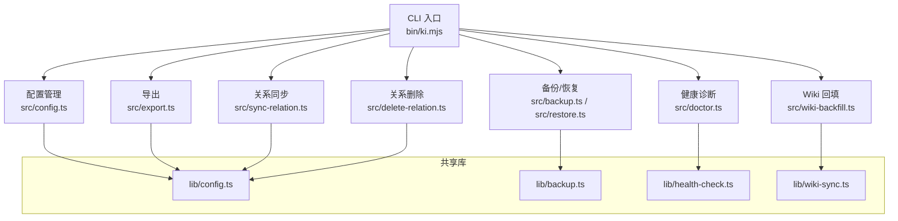
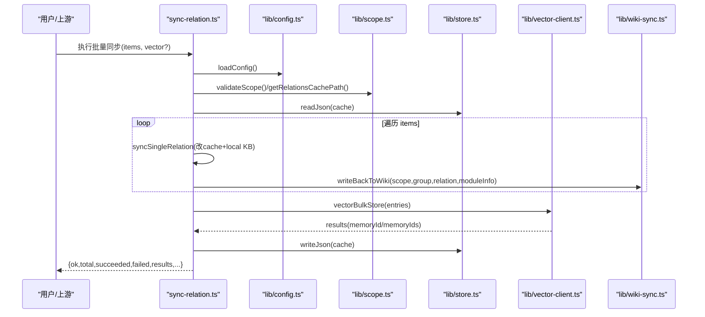
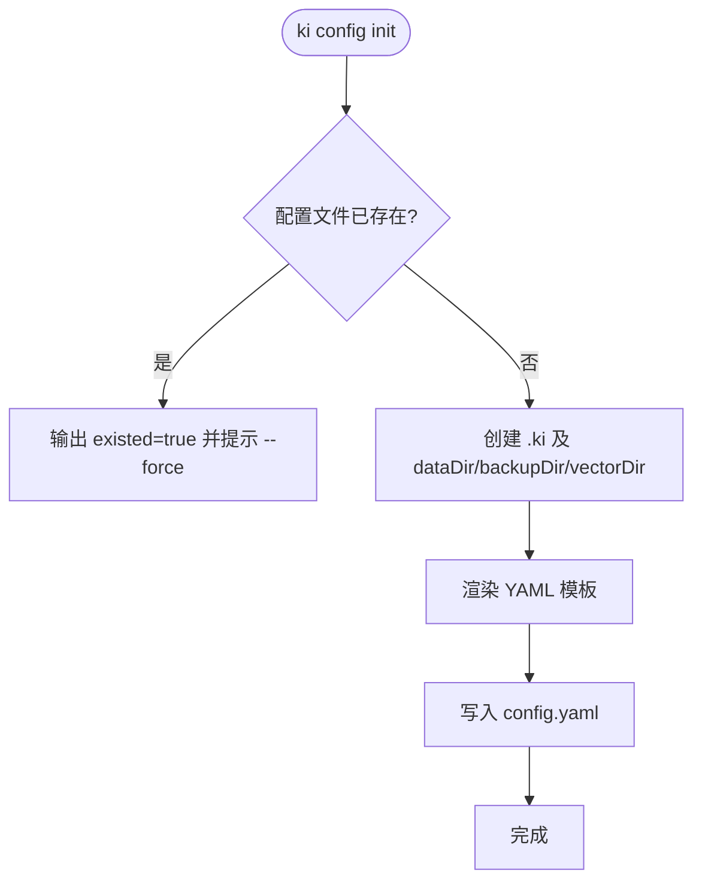
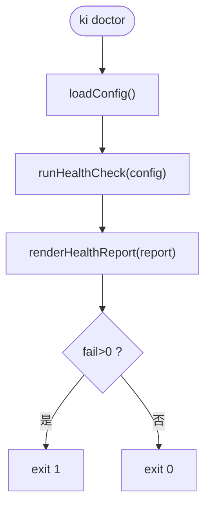
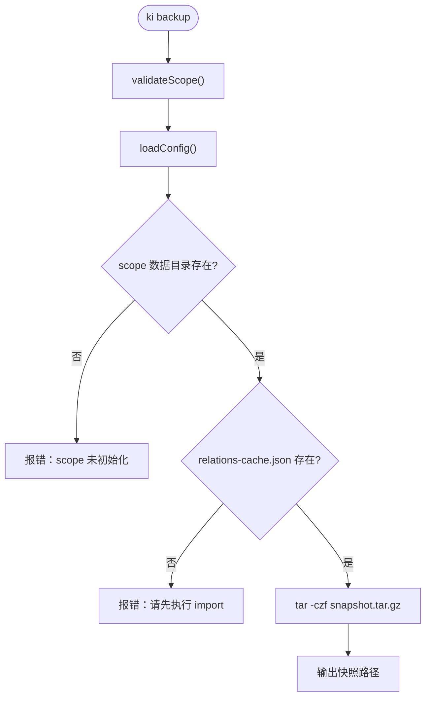
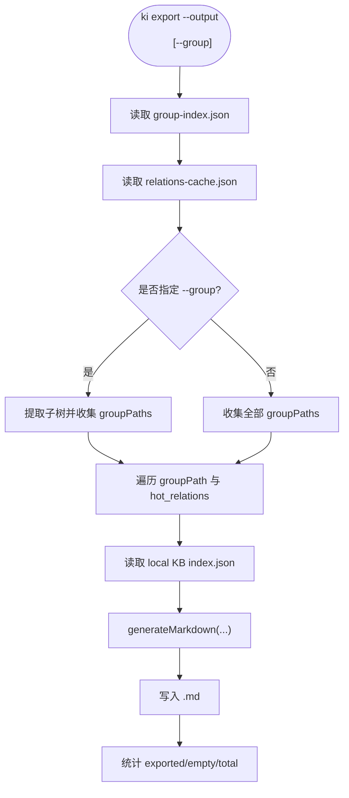
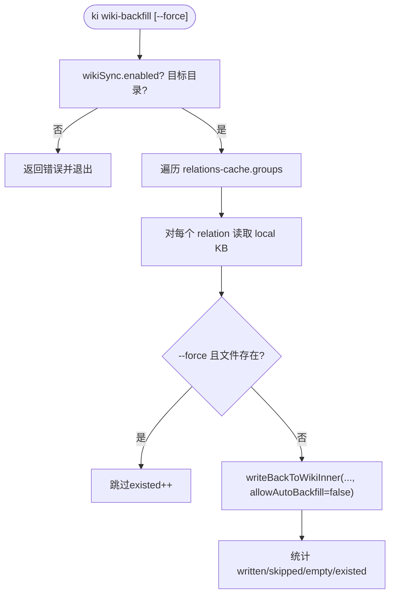
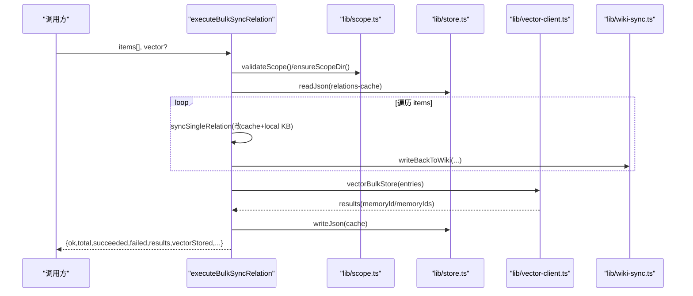
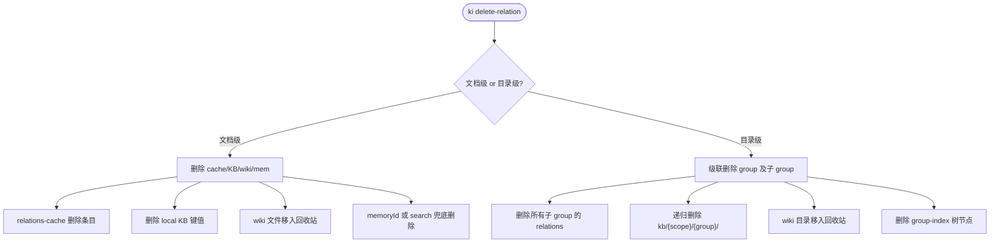
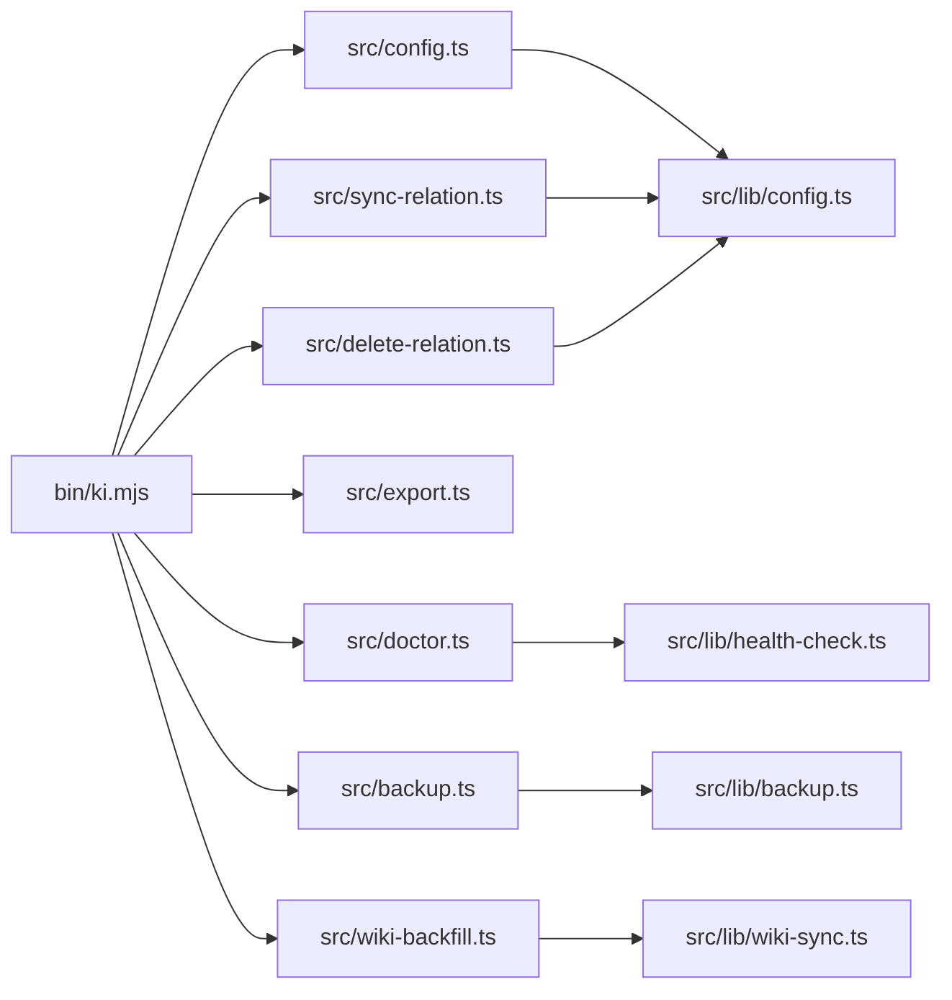

# 工具辅助命令

<cite>
**本文引用的文件**
- [bin/ki.mjs](file://bin/ki.mjs)
- [src/config.ts](file://src/config.ts)
- [src/doctor.ts](file://src/doctor.ts)
- [src/backup.ts](file://src/backup.ts)
- [src/export.ts](file://src/export.ts)
- [src/wiki-backfill.ts](file://src/wiki-backfill.ts)
- [src/sync-relation.ts](file://src/sync-relation.ts)
- [src/delete-relation.ts](file://src/delete-relation.ts)
- [src/lib/backup.ts](file://src/lib/backup.ts)
- [src/lib/health-check.ts](file://src/lib/health-check.ts)
- [src/lib/wiki-sync.ts](file://src/lib/wiki-sync.ts)
- [src/lib/config.ts](file://src/lib/config.ts)
- [docs/cli.md](file://docs/cli.md)
- [docs/backup-restore.md](file://docs/backup-restore.md)
</cite>

## 目录
1. [简介](#简介)
2. [项目结构](#项目结构)
3. [核心组件](#核心组件)
4. [架构总览](#架构总览)
5. [详细组件分析](#详细组件分析)
6. [依赖关系分析](#依赖关系分析)
7. [性能与可用性考虑](#性能与可用性考虑)
8. [故障排查指南](#故障排查指南)
9. [结论](#结论)
10. [附录：常用场景示例](#附录常用场景示例)

## 简介
本章节面向日常运维、数据迁移与故障恢复，系统化说明 ki 提供的工具辅助命令：config（配置管理）、doctor（健康诊断）、backup（备份恢复）、export（数据导出）、wiki-backfill（Wiki 历史补齐）、sync-relation（关系同步）、delete-relation（关系删除）。文档覆盖配置生成与校验、系统健康检查、备份与恢复流程、知识库导出格式、Wiki 历史数据补齐等能力，并给出错误处理、数据完整性验证与性能优化的最佳实践。

## 项目结构
ki 的 CLI 入口统一在 bin/ki.mjs，负责解析全局参数（如 --config）并将子命令转发到对应实现脚本；各命令脚本位于 src/ 下，通用能力封装在 src/lib/ 中。

图表来源
- [bin/ki.mjs:28-49](file://bin/ki.mjs#L28-L49)
- [src/config.ts:121-177](file://src/config.ts#L121-L177)
- [src/doctor.ts:18-49](file://src/doctor.ts#L18-L49)
- [src/backup.ts:63-103](file://src/backup.ts#L63-L103)
- [src/export.ts:198-322](file://src/export.ts#L198-L322)
- [src/wiki-backfill.ts:39-67](file://src/wiki-backfill.ts#L39-L67)
- [src/sync-relation.ts:407-787](file://src/sync-relation.ts#L407-L787)
- [src/delete-relation.ts:83-176](file://src/delete-relation.ts#L83-L176)

章节来源
- [bin/ki.mjs:28-49](file://bin/ki.mjs#L28-L49)

## 核心组件
- 配置管理（config init）：生成带注释的 YAML 模板，自动创建 dataDir/backupDir/vectorDir，支持 $HOME 相对路径与环境变量显式覆盖。
- 健康诊断（doctor）：只读检查配置文件、目录可写性、apiKey、embedding 连通性与维度、zvec collection、scopes.default，失败退出码为 1。
- 备份（backup）：将 scope 目录打包为 tar.gz 快照，支持列出已有备份；导入成功后自动备份。
- 导出（export）：从 relations-cache.json + group-index.json + local KB 反向导出 Markdown，支持按 group 导出与冲突保护。
- Wiki 回填（wiki-backfill）：幂等补齐历史关系到外部 Wiki，支持强制覆盖刷新时间戳。
- 关系同步（sync-relation）：单条/批量写入 Relation 与本地 KB，可选向量化（一次批量 embed+upsert），支持自定义标签与 Wiki 写回。
- 关系删除（delete-relation）：删除 Relation 或整个 Group，清理 cache/KB/wiki（移入回收站）与向量记忆，支持搜索兜底删除。

章节来源
- [src/config.ts:121-177](file://src/config.ts#L121-L177)
- [src/doctor.ts:18-49](file://src/doctor.ts#L18-L49)
- [src/backup.ts:63-103](file://src/backup.ts#L63-L103)
- [src/export.ts:198-322](file://src/export.ts#L198-L322)
- [src/wiki-backfill.ts:39-67](file://src/wiki-backfill.ts#L39-L67)
- [src/sync-relation.ts:407-787](file://src/sync-relation.ts#L407-L787)
- [src/delete-relation.ts:83-176](file://src/delete-relation.ts#L83-L176)

## 架构总览
下图展示“关系同步”在批量模式下的关键调用链：先改缓存与本地 KB，再一次性批量向量化，最后写回 Wiki。

图表来源
- [src/sync-relation.ts:407-787](file://src/sync-relation.ts#L407-L787)
- [src/lib/config.ts:148-175](file://src/lib/config.ts#L148-L175)
- [src/lib/wiki-sync.ts:66-151](file://src/lib/wiki-sync.ts#L66-L151)

## 详细组件分析

### config（配置管理）
- 功能要点
  - 生成 ~/.ki/config.yaml（YAML 模板，含字段注释）
  - 自动创建 dataDir/backupDir/vectorDir
  - 支持 $HOME 相对路径与 KI_DATA_DIR 显式覆盖（仅模板生成时）
  - 默认 embedding 配置与 provider/baseURL/model/dimension/apiKey 字段
- 使用建议
  - 首次运行执行 ki config init，随后按需修改 embedding.apiKey 与 scopes
  - 使用环境变量引用 apiKey，避免明文入库
- 错误处理
  - 已存在配置文件需 --force 覆盖
  - 目录创建失败不阻断 init，后续由 doctor 检出

图表来源
- [src/config.ts:121-177](file://src/config.ts#L121-L177)

章节来源
- [src/config.ts:121-177](file://src/config.ts#L121-L177)
- [src/lib/config.ts:148-175](file://src/lib/config.ts#L148-L175)

### doctor（健康诊断）
- 功能要点
  - 只读检查：配置文件、dataDir/backupDir/vectorDir 可写性、apiKey、embedding 连通性/密钥/维度、zvec collection、scopes.default
  - 失败项退出码为 1，适合 CI gate
- 使用建议
  - 初始化后先执行 ki doctor 确认环境就绪
  - 若向量服务不可用，后续向量相关操作会降级或跳过

图表来源
- [src/doctor.ts:18-49](file://src/doctor.ts#L18-L49)
- [src/lib/health-check.ts:148-213](file://src/lib/health-check.ts#L148-L213)

章节来源
- [src/doctor.ts:18-49](file://src/doctor.ts#L18-L49)
- [src/lib/health-check.ts:148-213](file://src/lib/health-check.ts#L148-L213)

### backup（备份与恢复）
- 功能要点
  - 手动备份：ki backup <scope> 生成 tar.gz 快照；ki backup <scope> --list 列出备份
  - 自动备份：import 成功后自动备份（失败不阻断主流程）
  - 恢复：ki restore <scope> --from-snapshot [--timestamp] --yes
- 存储位置
  - 快照：<backupDir>/<scope>/snapshots/snapshot.{YYYYMMDD-HHMMSS}.tar.gz
- 安全策略
  - 预检可写性与磁盘空间
  - 防覆盖：同秒内多次备份追加序号
  - 中断清理：失败时删除半截产物

图表来源
- [src/backup.ts:63-103](file://src/backup.ts#L63-L103)
- [src/lib/backup.ts:87-117](file://src/lib/backup.ts#L87-L117)

章节来源
- [src/backup.ts:63-103](file://src/backup.ts#L63-L103)
- [src/lib/backup.ts:87-117](file://src/lib/backup.ts#L87-L117)
- [docs/backup-restore.md:7-34](file://docs/backup-restore.md#L7-L34)

### export（数据导出）
- 功能要点
  - 读取 relations-cache.json + group-index.json + local KB index.json
  - 支持按 group 导出（父目录名取 group 最后一段），缺省全量导出顶层名为 scope
  - 输出目录非空且无 --yes 拒绝覆盖，防止误删
- 导出格式
  - 每个 relation 导出为 {output}/{groupPath}/{relation}.md，内容来自 local KB 的 moduleInfo/content

图表来源
- [src/export.ts:198-322](file://src/export.ts#L198-L322)

章节来源
- [src/export.ts:198-322](file://src/export.ts#L198-L322)

### wiki-backfill（Wiki 历史补齐）
- 功能要点
  - 将 KB 中已有 Relations 全量写回 Wiki（{sourceDir}/{group}/{relation}.md）
  - 幂等：默认跳过已存在文件（不刷新 exportedAt），--force 全量覆盖
  - 前置校验：wikiSync.enabled=false 或无可用 sourceDir 直接拒绝
- 使用场景
  - 先导入数据后开启 wikiSync，历史关系不会自动落盘，用此命令一次性补齐

图表来源
- [src/wiki-backfill.ts:39-67](file://src/wiki-backfill.ts#L39-L67)
- [src/lib/wiki-sync.ts:194-284](file://src/lib/wiki-sync.ts#L194-L284)

章节来源
- [src/wiki-backfill.ts:39-67](file://src/wiki-backfill.ts#L39-L67)
- [src/lib/wiki-sync.ts:194-284](file://src/lib/wiki-sync.ts#L194-L284)

### sync-relation（关系同步）
- 功能要点
  - 单条/批量写入 Relation 与本地 KB，自动补建 Group 节点
  - 向量化模式：一次批量 embed + 一次 worker upsert，提升吞吐
  - 自定义标签：叠加 ki-search 之外的业务标签，支持定向召回
  - Wiki 写回：容错，失败不影响主流程
- 数据流
  - 阶段1：循环 syncSingleRelation 改 cache + 收集 entries
  - 阶段2：vectorBulkStore 批量写入
  - 阶段3：拆分结果并回写 memoryId/memoryIds
  - 阶段4：一次 writeJson 落盘 cache
  - 阶段5：各自 wiki 写回

图表来源
- [src/sync-relation.ts:407-787](file://src/sync-relation.ts#L407-L787)

章节来源
- [src/sync-relation.ts:407-787](file://src/sync-relation.ts#L407-L787)

### delete-relation（关系删除）
- 功能要点
  - 文档级删除：删除 relations-cache 条目、本地 KB、wiki 文件（移入回收站）、向量记忆
  - 目录级删除：级联删除该 group 及其子 group 的全部关系与 wiki 目录，清理 group-index 节点
  - 向量删除：优先按 memoryIds 精确删除，否则 search 严格匹配兜底
- 安全约束
  - 目录级删除为破坏性操作，需明确传入 --group 且不传 --relation
  - wiki 文件移入回收站而非物理删除，便于恢复

图表来源
- [src/delete-relation.ts:83-176](file://src/delete-relation.ts#L83-L176)
- [src/delete-relation.ts:207-310](file://src/delete-relation.ts#L207-L310)

章节来源
- [src/delete-relation.ts:83-176](file://src/delete-relation.ts#L83-L176)
- [src/delete-relation.ts:207-310](file://src/delete-relation.ts#L207-L310)

## 依赖关系分析
- 入口分发：bin/ki.mjs 将子命令映射到 src/*.ts，并通过 jiti 执行 TypeScript 脚本
- 配置加载：lib/config.ts 提供 loadConfig、resolveDefaultDataPaths、getVectorDir、getEmbeddingConfig、resolveScope 等
- 健康检查：lib/health-check.ts 复用 SiliconFlowProvider 进行 embedding 三合一检查
- 备份模块：lib/backup.ts 提供 backupScopeSnapshot、autoBackup、listBackups
- Wiki 同步：lib/wiki-sync.ts 提供 writeBackToWiki、backfillWiki、isUnsafeRelationName
- 向量客户端：lib/vector-client.ts 提供 vectorBulkStore、vectorDelete、ensureVectorAvailable 等

图表来源
- [bin/ki.mjs:28-49](file://bin/ki.mjs#L28-L49)
- [src/lib/config.ts:148-175](file://src/lib/config.ts#L148-L175)
- [src/lib/health-check.ts:148-213](file://src/lib/health-check.ts#L148-L213)
- [src/lib/backup.ts:87-117](file://src/lib/backup.ts#L87-L117)
- [src/lib/wiki-sync.ts:66-151](file://src/lib/wiki-sync.ts#L66-L151)

章节来源
- [bin/ki.mjs:28-49](file://bin/ki.mjs#L28-L49)

## 性能与可用性考虑
- 批量向量化：sync-relation 批量模式一次 embed + 一次 upsert，显著减少 HTTP 往返与串行写入开销
- 去重与保留旧向量：批次内重复 (group,relation) 后一条覆盖前一条，避免孤儿向量；部分失败时保留旧向量，避免“删旧丢新”
- 向量服务降级：向量服务不可用时，KB 层仍可写入，向量状态透出 reason，便于后续重建
- 备份防覆盖与中断清理：snapshot 文件名防碰撞，失败时清理半截产物
- 预检与容量估算：备份前检查可写性与磁盘空间，避免中途失败
- 只读诊断：doctor 仅读检查，失败即退出，适合自动化门禁

[本节为通用指导，无需具体文件引用]

## 故障排查指南
- 配置问题
  - 未找到配置文件：执行 ki config init 生成 YAML
  - apiKey 缺失：在 embedding.apiKey 配置明文或 ${VAR_NAME} 引用
  - 维度不匹配：确保 dimension 与实际模型一致
- 向量服务问题
  - 连通性失败：检查 baseURL、网络、DNS、超时
  - 鉴权失败：检查 apiKey 是否正确
  - 服务不可用：KB 层仍可写入，稍后重试或重建向量
- 备份/恢复问题
  - tar 不可用：安装 tar（Linux/macOS 内置，Windows 请安装 Git for Windows）
  - 磁盘不足：预留足够空间，或使用更小的 chunk/分批备份
  - 恢复确认：--from-snapshot 需配合 --yes 才真正执行
- Wiki 写回问题
  - 目标目录为空：可启用 autoBackfill 或手动执行 wiki-backfill
  - 非法 relation 名称：不能包含 "/"、"\\" 或 ".."
- 删除操作问题
  - 目录级删除危险：务必确认 group 路径，必要时先导出或备份
  - 向量残留：若 vectorRemoved=false，需 rebuild-vector 或再次删除

章节来源
- [src/lib/health-check.ts:52-142](file://src/lib/health-check.ts#L52-L142)
- [src/lib/backup.ts:64-75](file://src/lib/backup.ts#L64-L75)
- [docs/backup-restore.md:183-229](file://docs/backup-restore.md#L183-L229)
- [src/lib/wiki-sync.ts:35-37](file://src/lib/wiki-sync.ts#L35-L37)

## 结论
ki 的工具辅助命令覆盖了配置管理、健康诊断、备份恢复、数据导出、Wiki 历史补齐、关系同步与删除等关键运维场景。通过统一的 CLI 入口、可插拔的配置体系、健壮的备份与恢复机制、以及高效的批量向量化流程，能够在日常运维、数据迁移与故障恢复中提供稳定可靠的支持。建议在正式使用前先执行 ki config init 与 ki doctor，并在变更前后做好备份与导出，确保数据可追溯与可恢复。

[本节为总结，无需具体文件引用]

## 附录：常用场景示例
- 日常运维
  - 初始化与校验：ki config init → ki doctor
  - 查看状态：ki manage-index --action list-scopes
- 数据迁移
  - 导出：ki export <scope> --output ./wiki-output
  - 导入：ki scan-kb import -s <scope> --source ./wiki --group wiki
- 故障恢复
  - 备份：ki backup <scope>
  - 恢复：ki restore <scope> --from-snapshot --yes
- Wiki 历史补齐
  - 补齐：ki wiki-backfill <scope> [--force]
- 关系同步与删除
  - 同步：ki sync-relation -s <scope> -g <group> -r <relation> --module-info "<md>"
  - 删除：ki delete-relation --scope <scope> --group <group> --relation <relation>

章节来源
- [docs/cli.md:23-77](file://docs/cli.md#L23-L77)
- [docs/backup-restore.md:7-34](file://docs/backup-restore.md#L7-L34)