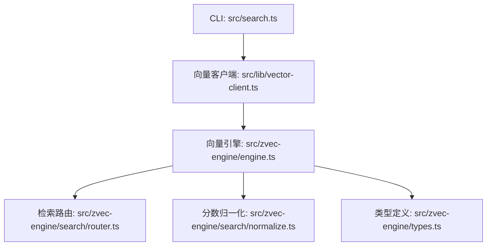
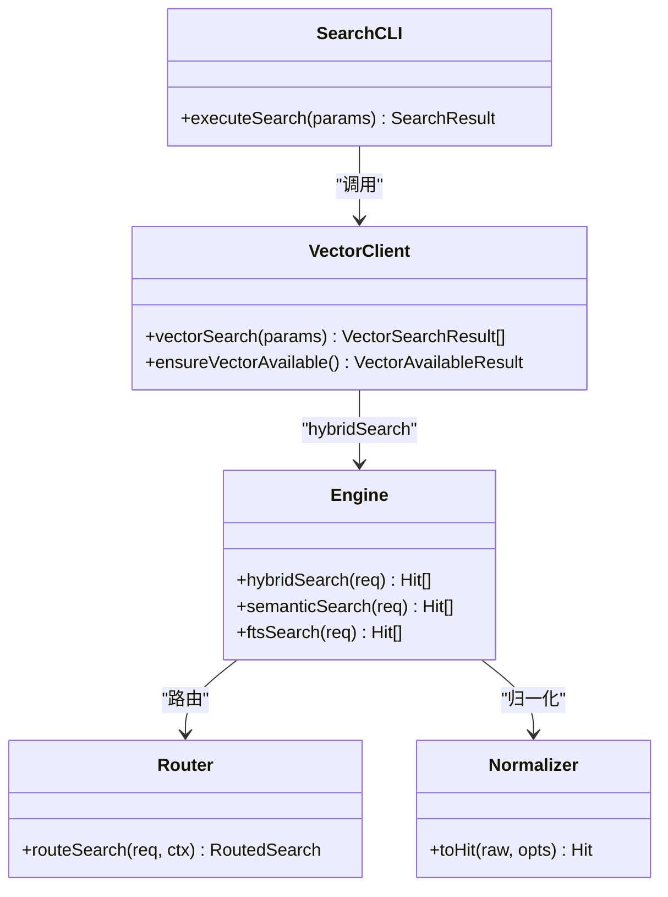

# 搜索检索命令

<cite>
**本文引用的文件**
- [src/search.ts](file://src/search.ts)
- [src/lib/vector-client.ts](file://src/lib/vector-client.ts)
- [src/zvec-engine/engine.ts](file://src/zvec-engine/engine.ts)
- [src/zvec-engine/search/router.ts](file://src/zvec-engine/search/router.ts)
- [src/zvec-engine/search/normalize.ts](file://src/zvec-engine/search/normalize.ts)
- [src/zvec-engine/types.ts](file://src/zvec-engine/types.ts)
- [docs/cli.md](file://docs/cli.md)
</cite>

## 目录
1. [简介](#简介)
2. [项目结构](#项目结构)
3. [核心组件](#核心组件)
4. [架构总览](#架构总览)
5. [详细组件分析](#详细组件分析)
6. [依赖关系分析](#依赖关系分析)
7. [性能与调优](#性能与调优)
8. [故障排查指南](#故障排查指南)
9. [结论](#结论)
10. [附录：使用示例与参数速查](#附录使用示例与参数速查)

## 简介
本文件面向“ki search”命令的完整文档，聚焦语义检索能力：查询语法、标签过滤、混合检索策略（向量 + BM25 全文）、RRF 融合排序、结果结构与评分机制、原文定位与降级策略，以及性能调优与常见问题排查。目标是帮助使用者在不同场景下高效、稳定地获得高质量搜索结果。

## 项目结构
搜索功能由 CLI 入口、向量客户端、向量引擎与归一化模块共同组成：
- CLI 入口：解析参数、执行搜索、输出 JSON 并关闭引擎
- 向量客户端：封装 ZvecEngine，提供 hybridSearch 调用、scope/tag 过滤、阈值过滤等
- 向量引擎：负责路由到向量/全文/混合检索、嵌入文本、发送请求、归一化分数
- 归一化：将底层距离或 BM25/RRF 分数统一为“越大越相关”的 score



图表来源
- [src/search.ts:204-237](file://src/search.ts#L204-L237)
- [src/lib/vector-client.ts:477-506](file://src/lib/vector-client.ts#L477-L506)
- [src/zvec-engine/engine.ts:454-495](file://src/zvec-engine/engine.ts#L454-L495)
- [src/zvec-engine/search/router.ts:43-127](file://src/zvec-engine/search/router.ts#L43-L127)
- [src/zvec-engine/search/normalize.ts:38-63](file://src/zvec-engine/search/normalize.ts#L38-L63)
- [src/zvec-engine/types.ts:118-151](file://src/zvec-engine/types.ts#L118-L151)

章节来源
- [src/search.ts:204-237](file://src/search.ts#L204-L237)
- [docs/cli.md:467-539](file://docs/cli.md#L467-L539)

## 核心组件
- CLI 层（search.ts）
  - 参数解析：支持位置参数与 --query、--limit、--threshold、--tags、--original、--scope
  - 执行流程：校验 scope → 检测向量可用性 → 按 tag 分查或单查 → 反查 relations-cache 附加 group/relation → 可选获取 local KB 原文 → 多 tag 去重与排序 → 输出 JSON
- 向量客户端（vector-client.ts）
  - 构建 filter：按 scope 与 tags（OR）过滤
  - 调用 hybridSearch：同时传入 queryText 与 fts，实现“语义 + 关键词”双路召回
  - 阈值过滤：score >= threshold 才保留
- 向量引擎（engine.ts）
  - 检索编排：根据配置与请求决定走 vector / fts / hybrid；必要时进行 embed；注入 filterSql；发送 worker；归一化返回 Hit
- 检索路由（router.ts）
  - 退化矩阵：有 fts 且 queryText/vector → multiQuery 两路 RRF；缺 fts → 退单路向量；缺 queryText/vector → 退单路 FTS；三者皆缺报错；queryText 与 vector 互斥
- 分数归一化（normalize.ts）
  - vector 路：COSINE distance → score = 1/(1+distance)，值域 [1/3, 1]
  - fts/hybrid 路：BM25/RRF 原值直通
- 类型定义（types.ts）
  - HybridSearchReq 支持 rerank.type=rrf|weighted、rankConstant、weights；Hit.score 含义明确

章节来源
- [src/search.ts:70-199](file://src/search.ts#L70-L199)
- [src/lib/vector-client.ts:477-506](file://src/lib/vector-client.ts#L477-L506)
- [src/zvec-engine/engine.ts:454-495](file://src/zvec-engine/engine.ts#L454-L495)
- [src/zvec-engine/search/router.ts:43-127](file://src/zvec-engine/search/router.ts#L43-L127)
- [src/zvec-engine/search/normalize.ts:38-63](file://src/zvec-engine/search/normalize.ts#L38-L63)
- [src/zvec-engine/types.ts:118-151](file://src/zvec-engine/types.ts#L118-L151)

## 架构总览
下图展示一次 ki search 从 CLI 到引擎再到返回结果的完整调用链，包括混合检索与 RRF 融合。

```mermaid
sequenceDiagram
participant U as "用户"
participant C as "CLI : search.ts"
participant V as "向量客户端 : vector-client.ts"
participant E as "引擎 : engine.ts"
participant R as "路由 : router.ts"
participant N as "归一化 : normalize.ts"
U->>C : "ki search <query> [--limit] [--threshold] [--tags] [--original]"
C->>V : "vectorSearch({scope, query, limit, threshold, tags})"
V->>E : "hybridSearch({queryText, fts, topk, filter})"
E->>R : "routeSearch(req, ctx)"
R-->>E : "multiQuery(向量路+FTS路), queryType='hybrid'"
E->>E : "需要时 embed(queryText)"
E->>N : "toHit(raw, {queryType, metric})"
N-->>E : "Hit{score, fields, text}"
E-->>V : "Hit[]"
V-->>C : "VectorSearchResult[] (过滤threshold)"
C->>C : "relations-cache 反查 group/relation; 可选 fetchOriginal; 多tag去重; 排序"
C-->>U : "JSON 结果"
```

图表来源
- [src/search.ts:70-199](file://src/search.ts#L70-L199)
- [src/lib/vector-client.ts:477-506](file://src/lib/vector-client.ts#L477-L506)
- [src/zvec-engine/engine.ts:454-495](file://src/zvec-engine/engine.ts#L454-L495)
- [src/zvec-engine/search/router.ts:74-101](file://src/zvec-engine/search/router.ts#L74-L101)
- [src/zvec-engine/search/normalize.ts:38-63](file://src/zvec-engine/search/normalize.ts#L38-L63)

## 详细组件分析

### CLI 层（search.ts）
- 参数与行为
  - 位置参数优先于 --query
  - --limit：返回条数上限（默认 10）
  - --threshold：融合得分阈值，低于该值的命中将被过滤（默认 0）
  - --tags：逗号分隔多标签，OR 组合；不传则按全部 tag 分别检索并按优先级合并
  - --original：开启后尝试返回 local KB 文件级原文；失败会降级为向量 content 并附带提示
  - --scope：项目隔离标识
- 执行要点
  - 向量服务不可用：返回 degraded 错误信息
  - 未传 tags：枚举所有 tag，每个 tag 最多取 limit 条，再按 TAG_PRIORITY（ki-search > ki-relation > ki-path）合并
  - 反查 relations-cache：附加 group 与 relation 字段用于定位
  - 原文召回：仅当 meta.group 与 meta.relation 存在时才尝试读取 local KB；同一文件多 chunk 命中去重，首条携带 original，后续标记 deduplicated
  - 多 tag 去重：同一 (group, relation) 只保留 score 最高的一条，最终按 score 降序

章节来源
- [src/search.ts:20-47](file://src/search.ts#L20-L47)
- [src/search.ts:70-199](file://src/search.ts#L70-L199)
- [src/search.ts:204-237](file://src/search.ts#L204-L237)

### 向量客户端（vector-client.ts）
- 过滤与检索
  - buildScopeTagFilter：强制 scope 相等；tags 非空时以 OR 组合
  - vectorSearch：调用 hybridSearch，同时传入 queryText 与 fts=query，实现“语义 + 关键词”双路召回
  - 阈值过滤：score >= threshold 才保留
- 可用性与锁处理
  - ensureVectorAvailable：检测向量服务是否可用，给出 LOCKED/CORRUPTED/PROBE_ERROR 原因码
  - 撞锁重试：probeWithRetry 在 locked 时等待并重试，避免瞬时冲突导致失败

章节来源
- [src/lib/vector-client.ts:420-467](file://src/lib/vector-client.ts#L420-L467)
- [src/lib/vector-client.ts:477-506](file://src/lib/vector-client.ts#L477-L506)

### 向量引擎（engine.ts）
- 检索编排
  - search：统一入口，编译 filter，路由到具体查询，必要时 embed，注入 filterSql，发 worker，归一化为 Hit
  - hybridSearch：通过 routeSearch 生成 multiQuery，包含 denseField（向量）与 ftsField（关键词）两路
- 写入路径（辅助理解）
  - upsert/insert/update/delete/fetch/listIds 等接口，保证写入与检索一致性

章节来源
- [src/zvec-engine/engine.ts:296-327](file://src/zvec-engine/engine.ts#L296-L327)
- [src/zvec-engine/engine.ts:454-495](file://src/zvec-engine/engine.ts#L454-L495)

### 检索路由（router.ts）
- 退化矩阵与约束
  - 有 fts 且有 queryText/vector → multiQuery 两路 RRF（hybrid）
  - 缺 fts → 退单路向量
  - 缺 queryText/vector → 退单路 FTS
  - 三者皆缺 → InvalidSearchError
  - queryText 与 vector 互斥
- RRF 参数
  - rankConstant：默认 60（RRF 融合常数）
  - weighted：可指定权重数组（denseField, ftsField），与 rrf 二选一

章节来源
- [src/zvec-engine/search/router.ts:43-127](file://src/zvec-engine/search/router.ts#L43-L127)
- [src/zvec-engine/search/router.ts:176-190](file://src/zvec-engine/search/router.ts#L176-L190)

### 分数归一化（normalize.ts）
- vector 路：COSINE distance ∈ [0,2] → score = 1/(1+distance)，值域 [1/3, 1]
- fts/hybrid 路：BM25/RRF 原值直通
- 异常处理：distance/score 为 NaN/undefined 时丢弃该 Hit

章节来源
- [src/zvec-engine/search/normalize.ts:16-25](file://src/zvec-engine/search/normalize.ts#L16-L25)
- [src/zvec-engine/search/normalize.ts:38-63](file://src/zvec-engine/search/normalize.ts#L38-L63)

### 类型与请求（types.ts）
- HybridSearchReq
  - queryText 与 vector 互斥
  - fts：独立关键词串，可与 queryText/vector 共存
  - rerank：type=rrf|weighted；rrf 支持 rankConstant；weighted 需 weights
- Hit
  - score：越大越相关；vector 路为 COSINE 归一化；fts 路为 BM25；hybrid 路为 RRF/加权融合分

章节来源
- [src/zvec-engine/types.ts:118-151](file://src/zvec-engine/types.ts#L118-L151)

## 依赖关系分析
- CLI 依赖向量客户端，后者封装 ZvecEngine；引擎内部依赖路由与归一化；类型贯穿各层
- 关键耦合点
  - vector-client 与 engine 通过 hybridSearch 契约交互
  - router 决定查询形态（vector/fts/hybrid），影响后续 embed 与 score 解释
  - normalize 对 score 的解释与 queryType 强相关



图表来源
- [src/search.ts:70-199](file://src/search.ts#L70-L199)
- [src/lib/vector-client.ts:477-506](file://src/lib/vector-client.ts#L477-L506)
- [src/zvec-engine/engine.ts:454-495](file://src/zvec-engine/engine.ts#L454-L495)
- [src/zvec-engine/search/router.ts:43-127](file://src/zvec-engine/search/router.ts#L43-L127)
- [src/zvec-engine/search/normalize.ts:38-63](file://src/zvec-engine/search/normalize.ts#L38-L63)

章节来源
- [src/search.ts:70-199](file://src/search.ts#L70-L199)
- [src/lib/vector-client.ts:477-506](file://src/lib/vector-client.ts#L477-L506)
- [src/zvec-engine/engine.ts:454-495](file://src/zvec-engine/engine.ts#L454-L495)

## 性能与调优
- 混合检索策略
  - 默认 hybridSearch：同时使用 queryText（语义）与 fts（关键词），两路召回后经 RRF 融合排序，兼顾召回广度与相关性
- RRF 融合参数
  - rankConstant：默认 60；理论上限约 0.033（两路均为第 1 名）
  - 建议阈值区间：0.02~0.03；超过 0.033 可能过滤掉所有结果
- 标签过滤
  - 不传 --tags：按全部 tag 分别检索，每个 tag 最多 limit 条，再按优先级合并（ki-search 优先）
  - 传 --tags：OR 组合，单次查询
- 原文定位
  - 开启 --original 后，基于 relations-cache 反查 group/relation 并读取 local KB 原文；同一文件多 chunk 命中去重，首条携带 original，后续标记 deduplicated
  - 原文不可用时降级为向量 content，并附带 originalHint
- 向量服务可用性
  - ensureVectorAvailable 提供 LOCKED/CORRUPTED/PROBE_ERROR 原因码；CLI 在不可用时返回 degraded 错误
- 并发与锁
  - 向量库为单进程独占锁；多实例共享时需错开使用；CLI per-call 结束后 closeEngine 释放锁

章节来源
- [docs/cli.md:467-539](file://docs/cli.md#L467-L539)
- [src/search.ts:70-199](file://src/search.ts#L70-L199)
- [src/lib/vector-client.ts:420-467](file://src/lib/vector-client.ts#L420-L467)

## 故障排查指南
- 向量服务不可用
  - 现象：返回 { ok:false, error:"向量检索暂不可用...", degraded:true }
  - 可能原因：LOCKED（被其他进程占用）、CORRUPTED（损坏）、PROBE_ERROR（检测异常）
  - 处置：停止占用进程、稍后重试、执行 rebuild-vector 或 restore 重建
- 结果为空
  - 检查 --threshold 是否过高（RRF 上限约 0.033）
  - 检查 --tags 是否正确（大小写自动规范化）
  - 确认数据已导入并向量化（scan-kb import 或 sync-relation）
- 原文缺失
  - 检查 relations-cache 中是否存在 group/relation
  - 若缺失，可能因重建或迁移导致 memoryId 失效，需 re-import 或 rebuild-vector
- 重复结果
  - 多 tag 写入同一文档会产生多条向量命中；系统已做 (group,relation) 去重，保留 score 最高者
- 锁冲突
  - 多个 MCP/CLI 共享向量库时会撞锁；等待释放或错开使用；CLI 结束会自动释放

章节来源
- [src/search.ts:70-199](file://src/search.ts#L70-L199)
- [src/lib/vector-client.ts:420-467](file://src/lib/vector-client.ts#L420-L467)
- [docs/cli.md:467-539](file://docs/cli.md#L467-L539)

## 结论
ki search 通过“语义 + 关键词”混合检索与 RRF 融合排序，在保证高相关性的同时提升召回广度。配合标签过滤、阈值控制与原文定位，可满足多种检索场景。合理设置 --threshold 与 --tags，并结合原文定位与降级策略，可获得稳定、可解释的高质量结果。

## 附录：使用示例与参数速查
- 基本用法
  - ki search "仪表盘配置" -s monitor
- 精确匹配
  - ki search "用户登录接口" -s my-project --threshold 0.03
- 模糊搜索
  - ki search "部署运维" -s my-project --limit 5
- 多条件组合（标签过滤）
  - ki search "告警规则" -s my-project --tags "api,auth"
- 返回原文
  - ki search "通知渠道" -s monitor --original
- 调整阈值
  - ki search "API 网关" -s monitor --threshold 0.025

参数速查
- --scope：项目隔离标识（default 模式可省略，strict 模式必填）
- --query/-q：自然语言查询文本（位置参数优先）
- --limit：返回条数上限（默认 10）
- --threshold：融合得分阈值（默认 0）
- --tags：过滤标签（逗号分隔，OR 组合；不传则搜索全部 tag）
- --original：返回 local KB 文件级原文（默认不返回）

章节来源
- [docs/cli.md:467-539](file://docs/cli.md#L467-L539)
- [src/search.ts:204-237](file://src/search.ts#L204-L237)