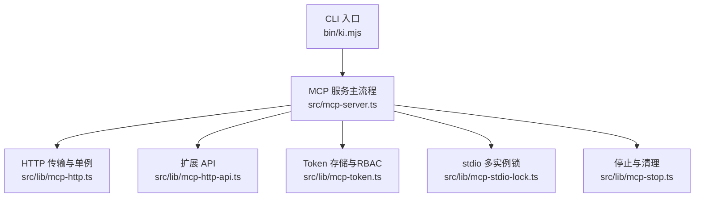
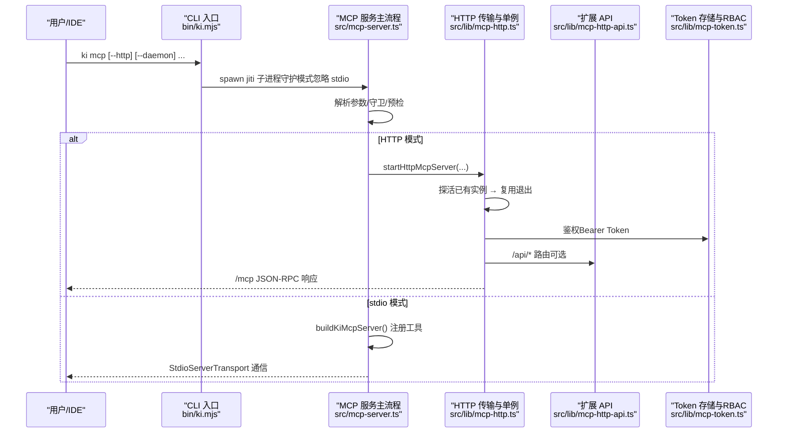
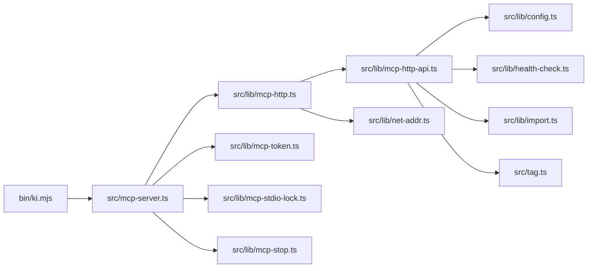

# 服务管理命令

<cite>
**本文引用的文件**
- [bin/ki.mjs](file://bin/ki.mjs)
- [src/mcp-server.ts](file://src/mcp-server.ts)
- [src/lib/mcp-http.ts](file://src/lib/mcp-http.ts)
- [src/lib/mcp-http-api.ts](file://src/lib/mcp-http-api.ts)
- [src/lib/mcp-token.ts](file://src/lib/mcp-token.ts)
- [src/lib/mcp-stdio-lock.ts](file://src/lib/mcp-stdio-lock.ts)
- [src/lib/mcp-stop.ts](file://src/lib/mcp-stop.ts)
</cite>

## 目录
1. [简介](#简介)
2. [项目结构](#项目结构)
3. [核心组件](#核心组件)
4. [架构总览](#架构总览)
5. [详细组件分析](#详细组件分析)
6. [依赖关系分析](#依赖关系分析)
7. [性能与并发特性](#性能与并发特性)
8. [部署与安全配置](#部署与安全配置)
9. [监控与运维](#监控与运维)
10. [故障排查指南](#故障排查指南)
11. [结论](#结论)

## 简介
本文件面向“服务管理命令”的完整使用与维护，聚焦 ki mcp 的三种运行模式：
- stdio 模式（默认）：单客户端单进程，通过标准输入输出通信。
- HTTP 模式（--http）：多 IDE 共享同一持锁进程，提供 Streamable HTTP 传输与 /mcp 端点。
- 守护进程模式（--daemon/-d）：HTTP 模式下后台常驻运行，脱离终端。

文档同时覆盖：
- MCP 服务器启动参数、Token 鉴权机制、HTTP API 配置与服务状态管理。
- mcp token 子命令：generate、list、update、delete。
- 部署、安全、监控运维实践示例与故障排查。
- 单例共享机制、端口管理与进程间通信原理。

## 项目结构
- CLI 入口：bin/ki.mjs 负责命令分发、版本显示、帮助、以及 --daemon 模式的子进程拉起与存活探测。
- MCP 服务主流程：src/mcp-server.ts 解析参数、守卫检测、预检、启动 stdio 或 HTTP 服务、注册工具、生命周期管理。
- HTTP 传输与单例：src/lib/mcp-http.ts 实现 Streamable HTTP 传输、会话管理、鉴权、静态页面、健康检查、单例 lock。
- 扩展 API：src/lib/mcp-http-api.ts 提供 /api/* 路由（健康、文档列表、导入等），复用鉴权与 scope 校验。
- Token 存储与 RBAC：src/lib/mcp-token.ts 提供多 Token 存储、scope 授权、原子写回、常量时间比较。
- stdio 多实例锁：src/lib/mcp-stdio-lock.ts 提供每实例独立 lock 文件、存活探测、陈旧锁清理。
- 停止与清理：src/lib/mcp-stop.ts 统一关闭所有 ki mcp 实例并清理 lock。

**图表来源**
- [bin/ki.mjs:28-49](file://bin/ki.mjs#L28-L49)
- [src/mcp-server.ts:49-71](file://src/mcp-server.ts#L49-L71)
- [src/lib/mcp-http.ts:340-607](file://src/lib/mcp-http.ts#L340-L607)
- [src/lib/mcp-http-api.ts:216-272](file://src/lib/mcp-http-api.ts#L216-L272)
- [src/lib/mcp-token.ts:18-41](file://src/lib/mcp-token.ts#L18-L41)
- [src/lib/mcp-stdio-lock.ts:20-43](file://src/lib/mcp-stdio-lock.ts#L20-L43)
- [src/lib/mcp-stop.ts:20-54](file://src/lib/mcp-stop.ts#L20-L54)

**章节来源**
- [bin/ki.mjs:28-49](file://bin/ki.mjs#L28-L49)
- [src/mcp-server.ts:49-71](file://src/mcp-server.ts#L49-L71)

## 核心组件
- 命令分发与守护进程：bin/ki.mjs 将 ki mcp 转发到 src/mcp-server.ts；当检测到 --http 且 --daemon/-d 时，以 detached + ignore stdio 方式拉起子进程，并在启动期进行存活探测，失败则提示前台运行查看错误。
- MCP 服务主流程：src/mcp-server.ts 解析参数、执行守卫（HTTP/stdio 互斥、stdo 多实例登记）、预检（健康检查）、启动 stdio 或 HTTP 服务、注册全部工具、处理信号与退出。
- HTTP 传输与单例：src/lib/mcp-http.ts 构建 http.Server，按路径分发 /healthz、/api/*、/mcp；维护会话 Map、空闲回收、鉴权（回环免鉴权，非回环强制 Bearer Token）、DNS rebinding 保护、静态页面（--web）。
- 扩展 API：src/lib/mcp-http-api.ts 提供 /api/health、/api/tags、/api/doc/list、/api/import/upload/run/status，复用鉴权与 scope 校验，限制请求体大小与上传扩展名。
- Token 存储与 RBAC：src/lib/mcp-token.ts 提供多 Token 存储（~/.ki/mcp-tokens.json）、短 ID、scope 集合、原子写回、常量时间比较、严格读取损坏保护。
- stdio 多实例锁：src/lib/mcp-stdio-lock.ts 为每个 stdio 实例创建 ~/.ki/mcp-stdio-<pid>.lock，支持多实例登记、陈旧锁清理、存活探测。
- 停止与清理：src/lib/mcp-stop.ts 收集目标（stdio lock、http lock、healthz 兜底），发送 SIGTERM 优雅退出，超时后 SIGKILL，清理残留 lock。

**章节来源**
- [bin/ki.mjs:154-198](file://bin/ki.mjs#L154-L198)
- [src/mcp-server.ts:492-734](file://src/mcp-server.ts#L492-L734)
- [src/lib/mcp-http.ts:340-607](file://src/lib/mcp-http.ts#L340-L607)
- [src/lib/mcp-http-api.ts:216-272](file://src/lib/mcp-http-api.ts#L216-L272)
- [src/lib/mcp-token.ts:18-41](file://src/lib/mcp-token.ts#L18-L41)
- [src/lib/mcp-stdio-lock.ts:20-43](file://src/lib/mcp-stdio-lock.ts#L20-L43)
- [src/lib/mcp-stop.ts:90-177](file://src/lib/mcp-stop.ts#L90-L177)

## 架构总览
ki mcp 提供两种传输通道：
- stdio：适合单 IDE 直连，简单直接，但多 IDE 会争抢向量库锁。
- HTTP：多 IDE 共享同一持锁进程，从根本上消除锁冲突；支持鉴权、会话隔离、静态页面、扩展 API。

**图表来源**
- [bin/ki.mjs:154-198](file://bin/ki.mjs#L154-L198)
- [src/mcp-server.ts:492-734](file://src/mcp-server.ts#L492-L734)
- [src/lib/mcp-http.ts:676-766](file://src/lib/mcp-http.ts#L676-L766)
- [src/lib/mcp-http-api.ts:216-272](file://src/lib/mcp-http-api.ts#L216-L272)
- [src/lib/mcp-token.ts:240-259](file://src/lib/mcp-token.ts#L240-L259)

## 详细组件分析

### 运行模式与启动参数
- stdio 模式（默认）：无 --http 即进入 stdio；多个 stdio 实例可共存，靠向量库空闲释放锁与撞锁重试错开共享。
- HTTP 模式（--http）：默认绑定 127.0.0.1:7423；非回环绑定需鉴权；支持 --host、--port、--token、--allowed-hosts、--web、--no-web。
- 守护进程模式（--daemon/-d）：仅 HTTP 模式有效；父进程 detached + stdio 忽略，子进程后台常驻；启动期存活探测失败会提示前台运行查看错误。
- 其他子命令：restart（仅 HTTP）、stop（关闭所有实例）、--status（只读诊断）。

关键行为要点：
- 帮助：-h/--help 打印帮助并退出，不落入默认 stdio 启动。
- 位置参数校验：仅允许 stop、token、restart；未知短 flag 报错并给出建议。
- 预检：健康检查失败拒绝启动；警告继续启动。
- 版本自检 banner + 升级监听：长驻进程启用。
- 空闲释放锁：enableIdleClose(VECTOR_IDLE_CLOSE_MS)，常驻进程空闲后自动 closeEngine 释放 LOCK。

**章节来源**
- [src/mcp-server.ts:84-107](file://src/mcp-server.ts#L84-L107)
- [src/mcp-server.ts:137-212](file://src/mcp-server.ts#L137-L212)
- [src/mcp-server.ts:492-593](file://src/mcp-server.ts#L492-L593)
- [src/mcp-server.ts:660-734](file://src/mcp-server.ts#L660-L734)
- [bin/ki.mjs:154-198](file://bin/ki.mjs#L154-L198)

### HTTP API 配置
- 端点：
  - /healthz：免鉴权，返回 ok/name/pid/version/host/port/authFailures。
  - /mcp：JSON-RPC 2.0，Streamable HTTP 传输，会话由 initialize 建立。
  - /api/*：方案 A 扩展接口（健康报告、文档列表、导入等），与 MCP 会话隔离。
- 鉴权：
  - 回环绑定（127.0.0.1/::1/localhost/0.0.0.0 归一化）免鉴权。
  - 非回环绑定强制 Bearer Token；支持全权临时 Token（--token/KI_MCP_TOKEN）或多 Token 存储。
- 会话管理：
  - 最大并发会话数 DEFAULT_MAX_SESSIONS（默认 256）。
  - 空闲会话超时 DEFAULT_SESSION_IDLE_MS（默认 30 分钟），定期清扫。
- DNS rebinding 保护：--allowed-hosts 白名单。
- 静态页面：--web 提供 web/dist 前端（SPA fallback）。

**章节来源**
- [src/lib/mcp-http.ts:36-53](file://src/lib/mcp-http.ts#L36-L53)
- [src/lib/mcp-http.ts:183-230](file://src/lib/mcp-http.ts#L183-L230)
- [src/lib/mcp-http.ts:418-499](file://src/lib/mcp-http.ts#L418-L499)
- [src/lib/mcp-http.ts:676-766](file://src/lib/mcp-http.ts#L676-L766)
- [src/lib/mcp-http-api.ts:31-42](file://src/lib/mcp-http-api.ts#L31-L42)

### Token 鉴权机制
- 多 Token 存储：~/.ki/mcp-tokens.json，每条记录含 id/token/scopes/createdAt。
- scope 授权：'all' 表示全部；单个/多个逗号分隔；非法字符拒绝。
- 鉴权流程：
  - 回环绑定免鉴权。
  - 非回环绑定要求 Authorization: Bearer <token>。
  - 全权临时 Token（--token/KI_MCP_TOKEN）→ ['all']。
  - 多 Token 存储：按明文查找授权 scope 集合（常量时间比较）。
- 越权拦截：tools/call 的 arguments.scope 缺省 'default'，必须参与校验；白名单工具（ki_scope_list、ki_manage_index_list）跳过此校验，由工具层 authScopes 过滤兜底。
- 日志与可观测性：鉴权失败计数写入 /healthz，stderr 限流日志。

**章节来源**
- [src/lib/mcp-token.ts:18-41](file://src/lib/mcp-token.ts#L18-L41)
- [src/lib/mcp-token.ts:76-95](file://src/lib/mcp-token.ts#L76-L95)
- [src/lib/mcp-token.ts:128-147](file://src/lib/mcp-token.ts#L128-L147)
- [src/lib/mcp-token.ts:183-201](file://src/lib/mcp-token.ts#L183-L201)
- [src/lib/mcp-token.ts:240-259](file://src/lib/mcp-token.ts#L240-L259)
- [src/lib/mcp-http.ts:100-138](file://src/lib/mcp-http.ts#L100-L138)
- [src/lib/mcp-http.ts:454-487](file://src/lib/mcp-http.ts#L454-L487)

### mcp token 子命令
- generate：生成授权 Token，必须显式指定 --scope（单个/多个/all）；输出包含 id/token/scopes/createdAt/hint。
- list：列出所有 Token（含明文与授权 scope）；文件损坏时报错（MCP_TOKEN_CORRUPT），避免静默空列表误导。
- update <id> --scope <...>：修改指定 Token 的授权 scope；id 不存在时报错。
- delete <id>：删除指定 Token，立即失效；已用该 Token 建立的服务端会话仍保留，但新请求 401。

注意：
- generate/update 必须显式指定 --scope，否则报错（MCP_TOKEN_SCOPE_REQUIRED）。
- 更新/删除走严格读取，防止损坏文件被静默覆盖导致数据丢失。

**章节来源**
- [src/mcp-server.ts:227-351](file://src/mcp-server.ts#L227-L351)
- [src/lib/mcp-token.ts:183-201](file://src/lib/mcp-token.ts#L183-L201)
- [src/lib/mcp-token.ts:207-238](file://src/lib/mcp-token.ts#L207-L238)

### 单例共享机制与进程间通信
- HTTP 单例：
  - 启动前探活 /healthz，命中健康 kisearch 实例则复用退出。
  - 写 lock 文件（~/.ki/mcp-http.lock）供排查与重启沿用上次运行值。
  - 每个 initialize 建一个 transport + 一个 McpServer（经工厂），共享模块级单例 engine（vector-client）。
- stdio 多实例：
  - 每实例独立 lock 文件（~/.ki/mcp-stdio-<pid>.lock），支持多实例登记、陈旧锁清理。
  - 多 stdio 实例靠向量库空闲释放锁 + 撞锁重试错开共享；不再拒绝多实例，仅提示。
- 进程间通信：
  - stdio：StdioServerTransport 读写 stdin/stdout。
  - HTTP：StreamableHTTPServerTransport 基于 node:http，会话由 initialize 建立，后续请求带 mcp-session-id。

**章节来源**
- [src/lib/mcp-http.ts:676-766](file://src/lib/mcp-http.ts#L676-L766)
- [src/lib/mcp-stdio-lock.ts:100-111](file://src/lib/mcp-stdio-lock.ts#L100-L111)
- [src/lib/mcp-stdio-lock.ts:118-144](file://src/lib/mcp-stdio-lock.ts#L118-L144)
- [src/mcp-server.ts:600-658](file://src/mcp-server.ts#L600-L658)

### 端口管理与冲突处理
- 默认端口：7423；可通过 --port 或配置文件 mcp.http.port 设置。
- 端口占用：EADDRINUSE 时探活未发现健康实例，可能是非 ki 进程占用或残留实例；建议更换端口或排查占用进程。
- 权限问题：EACCES 提示端口 <1024 需提升权限，改用高位端口。
- 地址不可用：EADDRNOTAVAIL 提示本机不存在该地址；ENOTFOUND 提示无法解析主机。

**章节来源**
- [src/lib/mcp-http.ts:609-630](file://src/lib/mcp-http.ts#L609-L630)
- [src/mcp-server.ts:119-135](file://src/mcp-server.ts#L119-L135)

### 服务状态管理
- --status：只读诊断，读取 HTTP lock + stdio lock + 探活，输出 running/target/healthz/lock/stdioInstances/managedTokens/hint。
- restart：仅 HTTP 模式，stop + 后台常驻重启；host/port/web 未显式传入时沿用上次运行值；检测 stdio 冲突并 fail-loud。
- stop：一键关闭本机所有 ki mcp 实例（stdio + HTTP）并清理 lock；按 lock/healthz 定位真正的服务进程直接发信号。

**章节来源**
- [src/lib/mcp-http.ts:632-670](file://src/lib/mcp-http.ts#L632-L670)
- [src/mcp-server.ts:410-490](file://src/mcp-server.ts#L410-L490)
- [src/mcp-server.ts:560-587](file://src/mcp-server.ts#L560-L587)
- [src/lib/mcp-stop.ts:90-177](file://src/lib/mcp-stop.ts#L90-L177)

## 依赖关系分析
- bin/ki.mjs 依赖 src/mcp-server.ts（命令映射）。
- src/mcp-server.ts 依赖：
  - src/lib/mcp-http.ts（HTTP 传输、单例、健康检查）。
  - src/lib/mcp-token.ts（Token 管理、scope 授权）。
  - src/lib/mcp-stdio-lock.ts（stdio 多实例锁）。
  - src/lib/mcp-stop.ts（停止与清理）。
  - 工具注册（query-group、search、store 等）。
- src/lib/mcp-http.ts 依赖：
  - src/lib/mcp-http-api.ts（延迟加载 /api/* 路由）。
  - src/lib/mcp-token.ts（findTokenScopes、ALL_SCOPES）。
  - src/lib/net-addr.ts（isLoopbackAddr/isLoopbackHost）。
- src/lib/mcp-http-api.ts 依赖：
  - src/lib/config.ts（loadConfig、resolveScope）。
  - src/lib/health-check.ts（runHealthCheck）。
  - src/lib/import.ts（handleDirectImport）。
  - src/tag.ts（executeTagList）。

**图表来源**
- [bin/ki.mjs:28-49](file://bin/ki.mjs#L28-L49)
- [src/mcp-server.ts:49-71](file://src/mcp-server.ts#L49-L71)
- [src/lib/mcp-http.ts:29-34](file://src/lib/mcp-http.ts#L29-L34)
- [src/lib/mcp-http-api.ts:23-29](file://src/lib/mcp-http-api.ts#L23-L29)

**章节来源**
- [bin/ki.mjs:28-49](file://bin/ki.mjs#L28-L49)
- [src/mcp-server.ts:49-71](file://src/mcp-server.ts#L49-L71)
- [src/lib/mcp-http.ts:29-34](file://src/lib/mcp-http.ts#L29-L34)
- [src/lib/mcp-http-api.ts:23-29](file://src/lib/mcp-http-api.ts#L23-L29)

## 性能与并发特性
- 会话上限：DEFAULT_MAX_SESSIONS = 256，防止会话无界增长耗尽内存。
- 空闲会话回收：DEFAULT_SESSION_IDLE_MS = 30 分钟，定期清扫未活跃会话。
- 向量库空闲释放锁：VECTOR_IDLE_CLOSE_MS = 3000ms，常驻进程空闲后自动 closeEngine 释放 LOCK，让多 stdio 实例/CLI 能错开共享同一向量库。
- 撞锁重试：probeWithRetry 检测到 locked 时等待 2s 重试（最多 3 次，总等待 6s）。
- 关闭串行化：closeEngine 先置空再 close + 串行化，避免 reopen 与 close 原生竞态。

**章节来源**
- [src/lib/mcp-http.ts:46-53](file://src/lib/mcp-http.ts#L46-L53)
- [src/mcp-server.ts:36-37](file://src/mcp-server.ts#L36-L37)
- [AGENTS.md:9-16](file://AGENTS.md#L9-L16)

## 部署与安全配置
- 本地开发（免鉴权）：
  - ki mcp --http（默认 127.0.0.1:7423，回环绑定免鉴权）。
  - 多 IDE 共享 URL：http://127.0.0.1:7423/mcp。
- 远程访问（需鉴权）：
  - ki mcp --http --host 0.0.0.0 --token <value> 或设置环境变量 KI_MCP_TOKEN。
  - 或使用多 Token 存储：ki mcp token generate --scope <...>，客户端配置 Authorization: Bearer <token>。
- 静态页面：
  - ki mcp --http --web 提供 web/dist 前端（浏览器访问 http://<host>:<port>/）。
  - 若未构建前端产物，会警告但不阻塞 MCP 启动。
- DNS rebinding 保护：
  - --allowed-hosts <a,b> 白名单 Host 头，防止重绑定攻击。
- 配置文件：
  - mcp.http.host/port/allowedHosts 可从配置文件加载，优先级：CLI > 配置 > 默认。

**章节来源**
- [src/mcp-server.ts:137-212](file://src/mcp-server.ts#L137-L212)
- [src/lib/mcp-http.ts:690-700](file://src/lib/mcp-http.ts#L690-L700)
- [src/lib/mcp-http.ts:727-732](file://src/lib/mcp-http.ts#L727-L732)

## 监控与运维
- 健康检查：
  - GET /healthz 返回 ok/name/pid/version/host/port/authFailures。
  - GET /api/health 返回 ki doctor 健康报告（带超时保护）。
- 状态查询：
  - ki mcp --status 输出 running/target/healthz/lock/stdioInstances/managedTokens/hint。
- 导入任务：
  - POST /api/import/upload 上传文件（受控目录 ~/.ki/import-uploads/<uploadId>/）。
  - POST /api/import/run 触发导入（幂等追加，异步 job）。
  - GET /api/import/status 轮询导入进度/结果。
- 日志与可观测性：
  - 鉴权失败 stderr 限流日志（第 N 次失败，来自 IP，原因）。
  - /healthz.authFailures 累计鉴权失败次数。

**章节来源**
- [src/lib/mcp-http.ts:183-230](file://src/lib/mcp-http.ts#L183-L230)
- [src/lib/mcp-http.ts:632-670](file://src/lib/mcp-http.ts#L632-L670)
- [src/lib/mcp-http-api.ts:274-288](file://src/lib/mcp-http-api.ts#L274-L288)
- [src/lib/mcp-http-api.ts:371-450](file://src/lib/mcp-http-api.ts#L371-L450)
- [src/lib/mcp-http-api.ts:452-565](file://src/lib/mcp-http-api.ts#L452-L565)

## 故障排查指南
- 端口占用：
  - EADDRINUSE：探活未发现健康实例，可能是非 ki 进程占用或残留实例；更换端口或排查占用进程。
  - EACCES：端口 <1024 需提升权限，改用高位端口。
  - EADDRNOTAVAIL/ENOTFOUND：地址不可用或无法解析主机。
- 鉴权失败：
  - 检查 Authorization: Bearer 是否与 ki mcp token list 输出完全一致（整段复制，勿手抄）。
  - 回环绑定免鉴权，非回环绑定必须配置 Token。
  - /healthz.authFailures 累计鉴权失败次数，stderr 有失败原因。
- 多实例冲突：
  - stdio 与 HTTP 并存会争抢向量库锁，拒绝启动；迁移 IDE 配置为 URL 型接入。
  - 多 stdio 实例可共存，靠空闲释放锁与撞锁重试错开共享。
- 停止与清理：
  - ki mcp stop 一键关闭所有实例并清理 lock；SIGTERM 优雅退出，超时 SIGKILL 兜底。
  - 若 kill 顶层壳留下持锁孤儿，stop 按 lock/healthz 定位真正服务进程直接发信号。

**章节来源**
- [src/lib/mcp-http.ts:609-630](file://src/lib/mcp-http.ts#L609-L630)
- [src/lib/mcp-http.ts:358-372](file://src/lib/mcp-http.ts#L358-L372)
- [src/mcp-server.ts:600-658](file://src/mcp-server.ts#L600-L658)
- [src/lib/mcp-stop.ts:90-177](file://src/lib/mcp-stop.ts#L90-L177)

## 结论
ki mcp 通过 stdio 与 HTTP 两种传输模式，结合守护进程、单例共享、Token 鉴权与 RBAC，提供了灵活、安全、可扩展的服务管理能力。HTTP 模式从根本上解决了多 IDE 锁冲突问题，并通过 /healthz、/api/*、--status、stop、restart 等能力完善了监控与运维闭环。实际部署中，建议：
- 本地开发使用 stdio 或 HTTP 回环绑定（免鉴权）。
- 远程访问启用 Token 鉴权与 DNS rebinding 保护。
- 使用 ki mcp token 子命令管理授权范围，遵循最小权限原则。
- 利用 --status、/healthz、/api/health 进行健康检查与故障定位。
- 通过 stop/restart 统一管理实例生命周期，避免残留 lock 与进程泄漏。