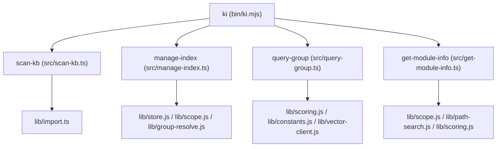
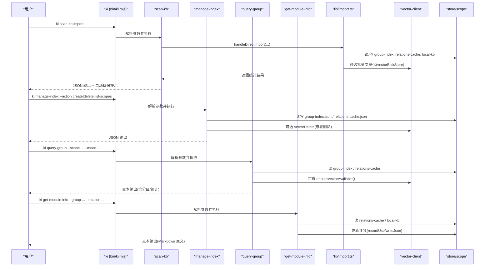
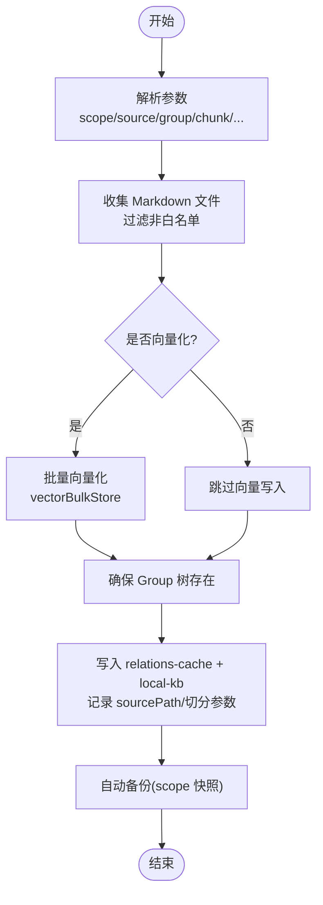
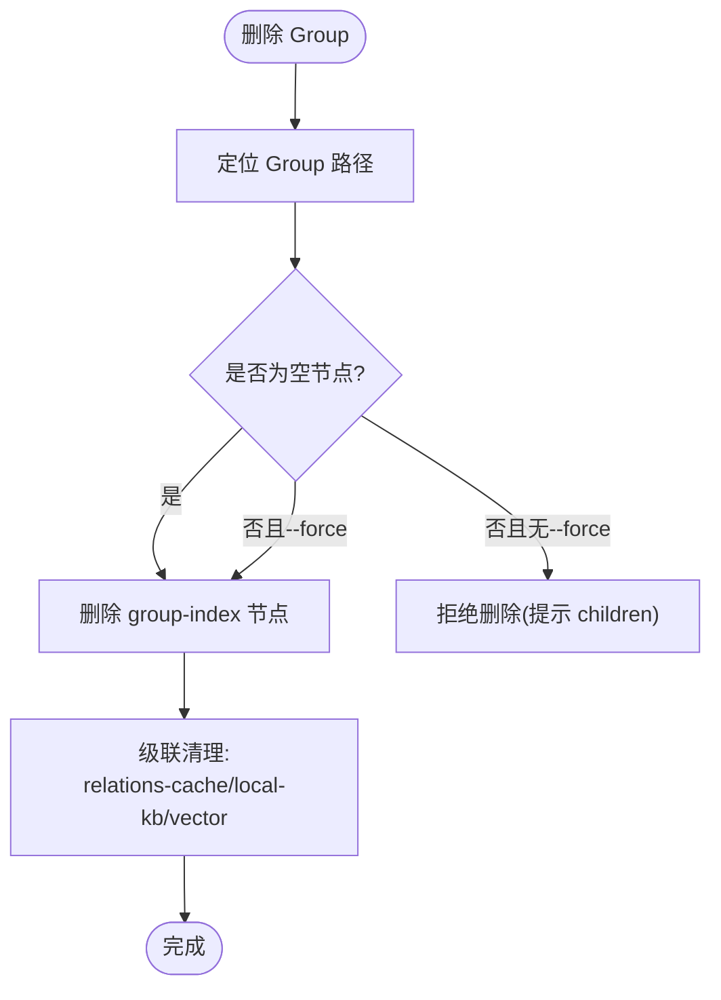
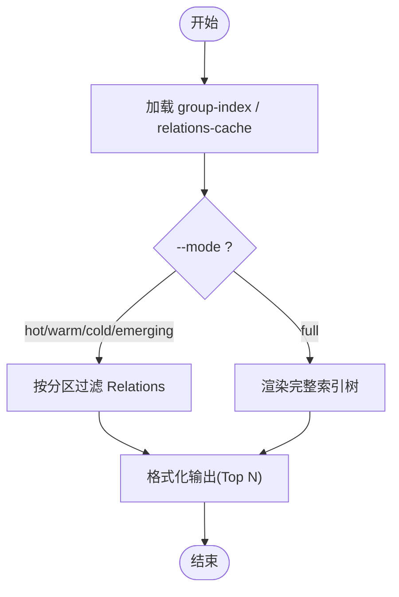
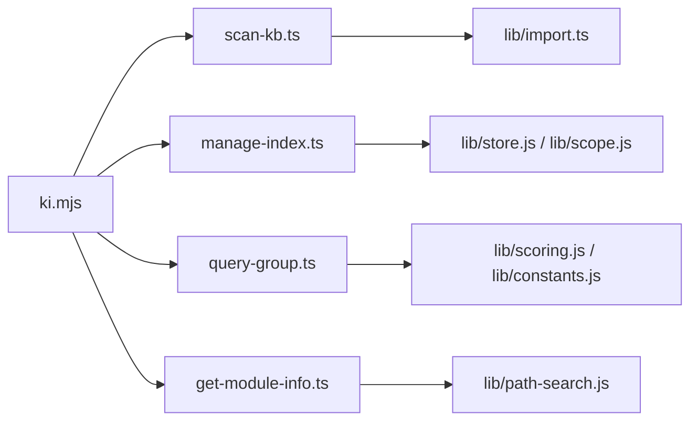

# 知识库管理命令

<cite>
**本文引用的文件**
- [bin/ki.mjs](file://bin/ki.mjs)
- [src/scan-kb.ts](file://src/scan-kb.ts)
- [src/manage-index.ts](file://src/manage-index.ts)
- [src/query-group.ts](file://src/query-group.ts)
- [src/get-module-info.ts](file://src/get-module-info.ts)
- [src/lib/import.ts](file://src/lib/import.ts)
- [docs/cli.md](file://docs/cli.md)
- [docs/manage-index.md](file://docs/manage-index.md)
</cite>

## 目录
1. [简介](#简介)
2. [项目结构](#项目结构)
3. [核心组件](#核心组件)
4. [架构总览](#架构总览)
5. [详细组件分析](#详细组件分析)
6. [依赖关系分析](#依赖关系分析)
7. [性能考虑](#性能考虑)
8. [故障排查指南](#故障排查指南)
9. [结论](#结论)
10. [附录：常用工作流与最佳实践](#附录：常用工作流与最佳实践)

## 简介
本文件面向“知识库管理”相关 CLI 命令，聚焦以下能力：
- scan-kb（知识库导入）：外部 Markdown 直导、自动切分、幂等追加、可选向量化
- manage-index（Group 树 CRUD）：创建/删除 Group、列出 scope、级联清理
- query-group（查询分组）：按分区展示热门/常温/冷区/新兴热区索引，支持完整树视图
- get-module-info（读取原文）：按 Group + Relation 读取本地 KB 的 Markdown 原文并更新评分

文档同时给出参数说明、使用场景、示例、错误处理与性能优化建议，并提供从外部 Wiki 导入、增量更新、批量操作等工作流的最佳实践。

## 项目结构
CLI 入口统一通过 bin/ki.mjs 分发到具体命令脚本；各命令以独立 TypeScript 文件实现，并通过 lib 层共享能力（配置、存储、向量客户端、清洗、进度、中断等）。

图表来源
- [bin/ki.mjs:28-49](file://bin/ki.mjs#L28-L49)
- [src/scan-kb.ts:13-20](file://src/scan-kb.ts#L13-L20)
- [src/manage-index.ts:11-19](file://src/manage-index.ts#L11-L19)
- [src/query-group.ts:13-27](file://src/query-group.ts#L13-L27)
- [src/get-module-info.ts:11-24](file://src/get-module-info.ts#L11-L24)

章节来源
- [bin/ki.mjs:28-49](file://bin/ki.mjs#L28-L49)

## 核心组件
- scan-kb import：统一导入入口，支持 --source 直导外部 Markdown，自动切分、幂等追加，可选关闭向量化；导入成功后触发自动备份。
- manage-index：Group 树索引管理，支持 create/delete/list-scopes；删除支持级联清理 relations-cache、local-kb、向量记忆。
- query-group：查询 Group 树与 Relations 分区，支持 hot/warm/cold/emerging/full 多模式输出，支持语义兜底模糊匹配。
- get-module-info：按 Group + Relation 读取本地 KB 原文，命中后更新评分；支持 Relation 名称近似匹配。

章节来源
- [src/scan-kb.ts:28-77](file://src/scan-kb.ts#L28-L77)
- [src/manage-index.ts:415-635](file://src/manage-index.ts#L415-L635)
- [src/query-group.ts:750-783](file://src/query-group.ts#L750-L783)
- [src/get-module-info.ts:172-197](file://src/get-module-info.ts#L172-L197)

## 架构总览
下图展示了四个命令在运行时的调用链路与数据流向，包括与存储、向量引擎、清洗与切分的交互。

图表来源
- [bin/ki.mjs:154-219](file://bin/ki.mjs#L154-L219)
- [src/scan-kb.ts:46-77](file://src/scan-kb.ts#L46-L77)
- [src/lib/import.ts:1-117](file://src/lib/import.ts#L1-L117)
- [src/manage-index.ts:415-635](file://src/manage-index.ts#L415-L635)
- [src/query-group.ts:611-745](file://src/query-group.ts#L611-L745)
- [src/get-module-info.ts:61-168](file://src/get-module-info.ts#L61-L168)

## 详细组件分析

### scan-kb（知识库导入）
- 子命令：import
- 关键参数
  - --scope：项目隔离标识（default 可省略，strict 必填）
  - --source：外部 Markdown 根目录（必填）
  - --group：目标 Group 落点（不存在时自动新建，含父路径；缺省时目录导入按顶层子目录名各建根节点，单文档导入用 scope name）
  - --chunk-size：切分目标长度（字符，默认 1000）
  - --chunk-overlap：相邻 chunk 重叠（字符，默认 150）
  - --no-vector：非向量化模式（仅写 KB 层，不产生 memoryId，无法被搜索召回）
  - --no-clean：关闭全部数据清洗（含外部 hooks）
  - --clean-rules：覆盖内置清洗规则开关（逗号分隔）
- 行为要点
  - 幂等追加：同 sourcePath 覆盖更新；同名不同 sourcePath 跳过；新文件正常导入
  - 自动切分：大文件按段落边界优先切分，relation 命名为“文件名-N”，sourcePath 为“文件路径#N”
  - 自动备份：导入成功后尝试生成 scope 快照（失败不阻断）
- 典型用法
  - 首次导入：指定 --source 与 --group
  - 增量更新：重复执行同一命令即同步变更（新增/更新/跳过）
  - 非向量化：--no-vector 仅写入 KB 层，适合离线或无需检索的场景
- 输出
  - JSON 包含 ok、scope、stats、groups、source 等信息；错误时返回 { ok:false, error }

章节来源
- [src/scan-kb.ts:28-77](file://src/scan-kb.ts#L28-L77)
- [src/lib/import.ts:1-117](file://src/lib/import.ts#L1-L117)
- [docs/cli.md:23-76](file://docs/cli.md#L23-L76)

#### 导入流程（幂等追加）

图表来源
- [src/lib/import.ts:1-117](file://src/lib/import.ts#L1-L117)
- [src/scan-kb.ts:46-77](file://src/scan-kb.ts#L46-L77)

### manage-index（Group 树 CRUD）
- 子命令
  - list-scopes：列出已初始化 scope 及其顶层 Group
  - create：创建 Group（顶层或子节点），支持父路径自动补全
  - delete：删除 Group（空节点直接删；非空需 --force），并级联清理
- 关键参数
  - --scope：项目隔离标识（list-scopes 时可省略）
  - --action：create | delete | list-scopes
  - --parent：父节点路径（为空时在顶层操作）
  - --name：节点名称
  - --force：强制删除非空节点
- 行为要点
  - 创建：校验名称不含“/”，避免重复；父路径不存在时尝试自动补全并给出提示
  - 删除：空节点可直接删除；非空节点需 --force；删除会级联清理 relations-cache、local-kb、向量记忆
  - 级联清理：前缀匹配删除 cache groups、删除 local-kb index.json、批量 vectorDelete 对应 memoryId
- 典型用法
  - 创建顶层 Group：--action create --name
  - 创建子 Group：--action create --parent "父路径" --name
  - 删除 Group：--action delete --parent "父路径" --name [--force]
  - 列出 scope：--action list-scopes

章节来源
- [src/manage-index.ts:415-635](file://src/manage-index.ts#L415-L635)
- [docs/manage-index.md:65-129](file://docs/manage-index.md#L65-L129)
- [docs/cli.md:79-187](file://docs/cli.md#L79-L187)

#### 级联删除流程图

图表来源
- [src/manage-index.ts:300-411](file://src/manage-index.ts#L300-L411)
- [src/manage-index.ts:511-615](file://src/manage-index.ts#L511-L615)

### query-group（查询分组）
- 功能：查询 Group 树与 Relations 分区，支持 hot/warm/cold/emerging/full 多种模式
- 关键参数
  - --scope：项目隔离标识（必填）
  - --groups：逗号分隔的 Group 路径列表（可选）
  - --hot-count：热门展示个数（默认 5）
  - --depth：索引层级深度（默认 4，最大 10）
  - --mode：展示分区（hot|warm|cold|emerging|full，支持逗号分隔）
  - --no-auto-fallback：禁用语义兜底（默认开启）
- 行为要点
  - 分区逻辑：基于评分与最近使用时间划分 hot/warm/cold，并结合近期活跃标记 emerging
  - 语义兜底：当 --groups 未精确匹配时，尝试向量搜索进行模糊匹配并输出提示
  - full 模式：递归展示子 Group 的 Relations（限制最大展示数防止输出过长）
- 典型用法
  - 查看热门索引：--mode hot
  - 查看多个分区：--mode hot,warm
  - 查看完整索引树：--mode full
  - 查看特定 Group 的 Relations：--groups "某组路径"

章节来源
- [src/query-group.ts:750-783](file://src/query-group.ts#L750-L783)
- [docs/cli.md:542-679](file://docs/cli.md#L542-L679)

#### 查询与分区流程

图表来源
- [src/query-group.ts:611-745](file://src/query-group.ts#L611-L745)

### get-module-info（读取原文）
- 功能：按 Group + Relation 读取本地 KB 中的 Markdown 原文，命中后更新评分
- 关键参数
  - --scope：项目隔离标识（必填）
  - --group：Group 路径（必填）
  - --relation：Relation ID 或名称（必填）
- 行为要点
  - 精确匹配 relation 文本或 id；未命中时尝试向量近似匹配（ki-relation）
  - 读取 local-kb/index.json 中对应内容；若缺失提供修复建议
  - 命中后更新评分（recordUse）并持久化
- 典型用法
  - 读取模块原文：--group "某组路径" --relation "某关系名"

章节来源
- [src/get-module-info.ts:172-197](file://src/get-module-info.ts#L172-L197)
- [docs/cli.md:682-718](file://docs/cli.md#L682-L718)

## 依赖关系分析
- 入口分发：bin/ki.mjs 将命令路由到 src/*.ts 脚本
- 共享库：
  - store/scope：读写 group-index.json、relations-cache.json、local-kb 目录
  - vector-client：向量服务可用性与批量增删查
  - scoring/constants：评分与分区配置
  - clean/chunker：清洗与切分
  - progress/interrupt：进度与中断保护
- 耦合与内聚
  - scan-kb 与 import 高内聚：导入逻辑集中在 lib/import.ts，便于复用与维护
  - manage-index 与 store/scope 强耦合：Group 树与缓存一致性由该模块保证
  - query-group 与 scoring 解耦：通过函数式接口计算分区，便于扩展
  - get-module-info 与 path-search：用于 Relation 名称近似匹配

图表来源
- [bin/ki.mjs:28-49](file://bin/ki.mjs#L28-L49)
- [src/scan-kb.ts:13-20](file://src/scan-kb.ts#L13-L20)
- [src/manage-index.ts:11-19](file://src/manage-index.ts#L11-L19)
- [src/query-group.ts:13-27](file://src/query-group.ts#L13-L27)
- [src/get-module-info.ts:11-24](file://src/get-module-info.ts#L11-L24)

章节来源
- [bin/ki.mjs:28-49](file://bin/ki.mjs#L28-L49)

## 性能考虑
- 导入阶段
  - 批量向量化：使用 vectorBulkStore 减少 API 调用次数，提升吞吐
  - 切分策略：按段落边界切分，避免过细导致碎片过多；合理设置 chunk-size 与 overlap
  - 非向量化模式：--no-vector 跳过 embedding 与向量写入，降低延迟与成本
- 查询阶段
  - 分区展示：hot/warm/cold/emerging 控制输出规模，避免全量渲染
  - 语义兜底：仅在必要时启用，避免额外向量查询开销
- 删除阶段
  - 级联删除：聚合 memoryId 一次批量 vectorDelete，减少网络往返
- 通用
  - 每次 CLI 调用结束后关闭向量引擎（closeEngine），释放资源，避免进程挂起

[本节为通用指导，不直接分析具体文件]

## 故障排查指南
- scan-kb import
  - 报错 Access denied to scope：确认 scope 已在配置注册
  - 报 --source 目录不存在：检查路径是否正确
  - 报 --group 不能为空：显式传入 --group 或使用默认落点
  - 导入后 search 召回不到：确认未使用 --no-vector（非向量化模式不产生 memoryId）
- manage-index
  - 父节点不存在：先创建父 Group 或使用自动补全提示
  - 删除非空节点：添加 --force 参数
  - 级联删除失败：检查向量服务可用性；关注 errors 字段
- query-group
  - 未找到 Group：可使用 --mode full 查看完整树；或启用语义兜底
  - 输出过长：调整 --depth 或 --hot-count；使用 hot/warm/cold 模式筛选
- get-module-info
  - 本地 KB 缺失：重新执行 sync-relation 或 scan-kb import；检查文件是否被误删
  - Relation 不存在：使用近似匹配或查看可用 Relation 列表

章节来源
- [docs/workflows.md:141-155](file://docs/workflows.md#L141-L155)
- [src/manage-index.ts:511-615](file://src/manage-index.ts#L511-L615)
- [src/query-group.ts:611-745](file://src/query-group.ts#L611-L745)
- [src/get-module-info.ts:61-168](file://src/get-module-info.ts#L61-L168)

## 结论
- scan-kb import 提供统一的直导入口，具备幂等追加、自动切分、可选向量化与自动备份能力，适合外部 Wiki 导入与增量更新
- manage-index 提供 Group 树的完整 CRUD，支持级联清理，保障索引结构与关联数据的一致性
- query-group 支持多维度分区展示与语义兜底，便于快速洞察知识热度与结构
- get-module-info 提供原文读取与评分更新，形成“查询—回写—再检索”的闭环

[本节为总结性内容，不直接分析具体文件]

## 附录：常用工作流与最佳实践

### 从外部 Wiki 导入
- 首次导入：ki scan-kb import --scope <scope> --source <wiki_dir> --group <target_group>
- 自动切分：大文件按段落边界切分，relation 命名“文件名-N”，sourcePath 为“文件路径#N”
- 幂等追加：重复执行同一命令即增量更新（覆盖已有、跳过同名不同源、导入新文件）

章节来源
- [docs/cli.md:23-76](file://docs/cli.md#L23-L76)
- [src/lib/import.ts:1-117](file://src/lib/import.ts#L1-L117)

### 增量更新
- 修改/新增 source 目录文件后，重新执行同一 scan-kb import 命令
- 如需仅更新 KB 层而不影响向量索引，使用 --no-vector

章节来源
- [docs/cli.md:59-64](file://docs/cli.md#L59-L64)
- [src/scan-kb.ts:46-77](file://src/scan-kb.ts#L46-L77)

### 批量操作
- 批量写入 Relation：ki sync-relation --input batch.json（支持 --no-vector）
- 批量删除 Relation：ki delete-relation --input batch.json（文档级删除）
- 批量 Group 管理：通过 manage-index 的 create/delete 配合脚本循环

章节来源
- [docs/manage-index.md:177-204](file://docs/manage-index.md#L177-L204)
- [docs/cli.md:722-755](file://docs/cli.md#L722-L755)

### 常见组合工作流
- 导入 → 验证 → 检索 → 回写
  - 导入：ki scan-kb import --source ... --group ...
  - 验证：ki query-group --scope ... --mode full
  - 检索：ki search "<查询>" --scope ...
  - 回写：ki sync-relation --group ... --relation ... --module-info "..."

章节来源
- [docs/workflows.md:150-155](file://docs/workflows.md#L150-L155)
- [docs/cli.md:467-539](file://docs/cli.md#L467-L539)