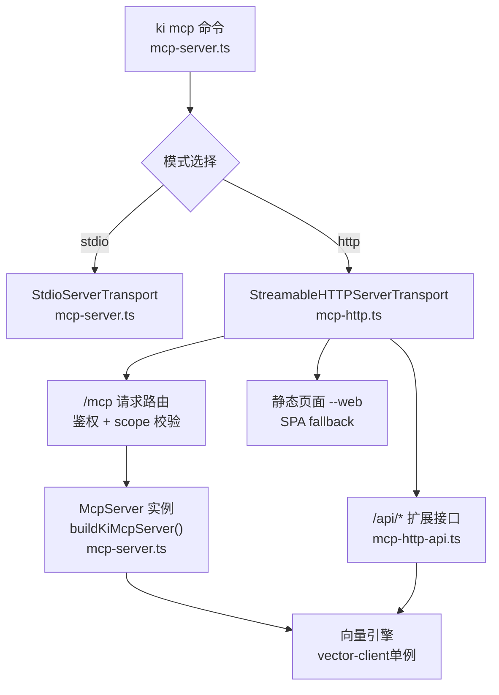
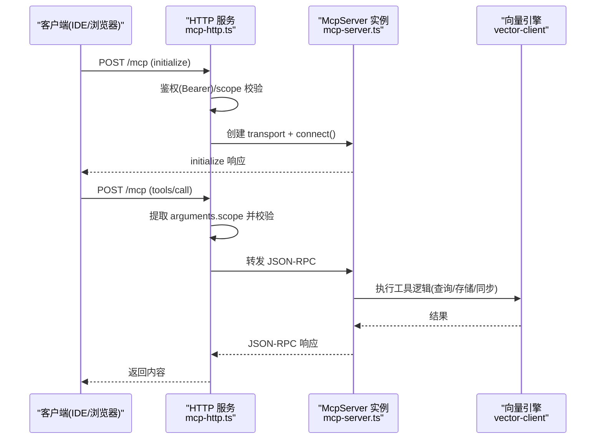
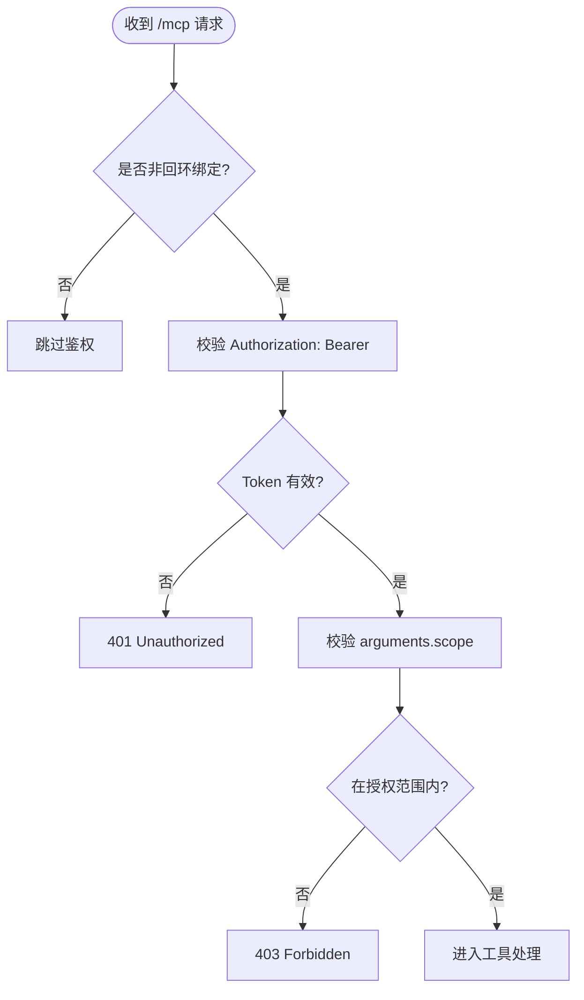
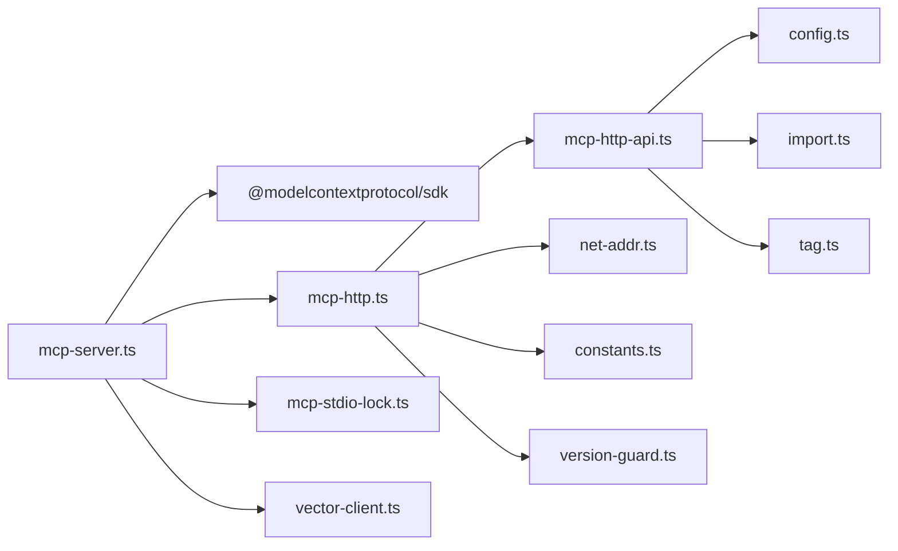

# MCP 协议基础

<cite>
**本文引用的文件**
- [src/mcp-server.ts](file://src/mcp-server.ts)
- [src/lib/mcp-http.ts](file://src/lib/mcp-http.ts)
- [src/lib/mcp-http-api.ts](file://src/lib/mcp-http-api.ts)
- [docs/mcp-http.md](file://docs/mcp-http.md)
- [src/lib/constants.ts](file://src/lib/constants.ts)
- [src/lib/version-guard.ts](file://src/lib/version-guard.ts)
- [src/lib/config.ts](file://src/lib/config.ts)
</cite>

## 目录
1. [简介](#简介)
2. [项目结构](#项目结构)
3. [核心组件](#核心组件)
4. [架构总览](#架构总览)
5. [详细组件分析](#详细组件分析)
6. [依赖关系分析](#依赖关系分析)
7. [性能与可用性](#性能与可用性)
8. [故障排查指南](#故障排查指南)
9. [结论](#结论)
10. [附录：协议要点速查](#附录协议要点速查)

## 简介
本文件面向初学者与一线开发者，系统化阐述本项目中实现的 Model Context Protocol（MCP）能力：通信模型、消息格式、传输机制（stdio 与 HTTP）、服务器生命周期、工具注册、会话管理、鉴权与范围控制、版本兼容、错误处理与调试方法。通过代码级分析与图示，帮助读者理解“单进程 HTTP 共享实例”的设计动机与落地方式，并掌握在本地或远程环境安全地接入 MCP 服务。

## 项目结构
围绕 MCP 的核心实现集中在以下模块：
- mcp-server.ts：统一入口，负责 CLI 参数解析、启动守卫、预检、模式分发（stdio/HTTP）、守护进程与优雅退出。
- mcp-http.ts：基于 Node http 的 Streamable HTTP 传输层，提供会话管理、鉴权、DNS rebinding 保护、静态页面与 /api/* 扩展路由转发。
- mcp-http-api.ts：/api/* 扩展接口（健康检查、文档列表、导入上传/执行/状态），与 MCP 会话隔离但复用鉴权策略。
- constants.ts：服务名等全局常量，用于探活与身份识别。
- version-guard.ts：长驻进程版本自检与升级提示。
- config.ts：MCP HTTP 默认配置项（host/port/allowedHosts）。
- docs/mcp-http.md：用户视角的 HTTP 模式使用手册与运维说明。

图表来源
- [src/mcp-server.ts:49-71](file://src/mcp-server.ts#L49-L71)
- [src/lib/mcp-http.ts:363-642](file://src/lib/mcp-http.ts#L363-L642)
- [src/lib/mcp-http-api.ts:216-272](file://src/lib/mcp-http-api.ts#L216-L272)

章节来源
- [src/mcp-server.ts:49-71](file://src/mcp-server.ts#L49-L71)
- [src/lib/mcp-http.ts:363-642](file://src/lib/mcp-http.ts#L363-L642)
- [src/lib/mcp-http-api.ts:216-272](file://src/lib/mcp-http-api.ts#L216-L272)
- [docs/mcp-http.md:1-10](file://docs/mcp-http.md#L1-L10)

## 核心组件
- 服务器构建器 buildKiMcpServer：创建 McpServer 实例并注册全部工具；HTTP 模式下每个会话新建一个实例，但共享 vector-client 的模块级单例 engine（单进程单锁）。
- stdio 传输：默认模式，适合 IDE 直连本地进程，简单可靠。
- HTTP 传输：StreamableHTTPServerTransport，支持多客户端、会话隔离、鉴权、DNS rebinding 保护、静态页面与 /api/* 扩展。
- 鉴权与范围控制：按绑定地址条件启用鉴权；回环免鉴权，非回环强制 Bearer Token；对 tools/call 的 scope 参数做越权拦截。
- 幂等单例守护：重复启动会探活已有健康实例并复用，避免多进程争抢向量库锁。
- 版本守卫：长驻进程检测 package.json 变化，提示重启以加载新版本。

章节来源
- [src/mcp-server.ts:49-71](file://src/mcp-server.ts#L49-L71)
- [src/lib/mcp-http.ts:363-642](file://src/lib/mcp-http.ts#L363-L642)
- [src/lib/version-guard.ts:16-66](file://src/lib/version-guard.ts#L16-L66)
- [src/lib/constants.ts:12-17](file://src/lib/constants.ts#L12-L17)

## 架构总览
下图展示从客户端到服务端的关键交互路径，包括鉴权、会话建立、工具调用与向量引擎访问。

图表来源
- [src/lib/mcp-http.ts:476-612](file://src/lib/mcp-http.ts#L476-L612)
- [src/mcp-server.ts:49-71](file://src/mcp-server.ts#L49-L71)

章节来源
- [src/lib/mcp-http.ts:476-612](file://src/lib/mcp-http.ts#L476-L612)
- [src/mcp-server.ts:49-71](file://src/mcp-server.ts#L49-L71)

## 详细组件分析

### 传输与通信模型
- stdio 模式
  - 通过 StdioServerTransport 读写 stdin/stdout，适合本地 IDE 直接拉起子进程。
  - 进程生命周期与 IDE 进程绑定，关闭即释放资源。
- HTTP 模式
  - 基于 Node http 的 StreamableHTTPServerTransport，支持 GET/POST/DELETE 会话生命周期管理。
  - 每个 initialize 新建 transport 与 McpServer，共享 vector-client 单例 engine。
  - 会话上限与空闲回收：默认最大并发会话数与空闲超时，防止内存泄漏。
  - DNS rebinding 保护：可选 allowedHosts 白名单。
  - 静态页面：--web 提供 SPA，GET 404 时回退 index.html。

章节来源
- [src/mcp-server.ts:701-733](file://src/mcp-server.ts#L701-L733)
- [src/lib/mcp-http.ts:363-642](file://src/lib/mcp-http.ts#L363-L642)
- [docs/mcp-http.md:234-242](file://docs/mcp-http.md#L234-L242)

### 鉴权与范围控制（RBAC）
- 条件鉴权：回环地址免鉴权；非回环地址强制 Bearer Token。
- Token 来源优先级：命令行 --token/环境变量 > 多 Token 存储（~/.ki/mcp-tokens.json）。
- scope 越权拦截：对 tools/call 的 arguments.scope（缺省 'default'）进行校验；枚举类无 scope 参数的工具由工具层按授权集合过滤输出。
- /api/* 同样遵循相同鉴权与 scope 校验策略。

图表来源
- [src/lib/mcp-http.ts:476-561](file://src/lib/mcp-http.ts#L476-L561)
- [src/lib/mcp-http-api.ts:222-258](file://src/lib/mcp-http-api.ts#L222-L258)

章节来源
- [src/lib/mcp-http.ts:476-561](file://src/lib/mcp-http.ts#L476-L561)
- [src/lib/mcp-http-api.ts:222-258](file://src/lib/mcp-http-api.ts#L222-L258)
- [docs/mcp-http.md:132-146](file://docs/mcp-http.md#L132-L146)

### 服务器生命周期与守护
- 启动守卫
  - HTTP 模式：先探活 /healthz，命中健康实例则复用退出；检测 stdio 冲突并拒绝启动。
  - stdio 模式：若存在健康 HTTP 单例则拒绝启动，引导迁移 URL 接入；登记自身 lock 供后续 stop/restart/status 定位。
- 预检与就绪
  - 启动前执行健康检查（doctor），失败则拒绝启动；成功则继续监听端口。
- 守护与重启
  - --daemon 后台常驻；restart 子命令关闭现有实例后以守护进程方式重启，保留上次 host/port/web 等配置。
- 优雅退出
  - 捕获 SIGINT/SIGTERM，关闭会话、断开连接、释放向量库锁、删除 lock 文件；超时兜底强制退出。

章节来源
- [src/mcp-server.ts:597-658](file://src/mcp-server.ts#L597-L658)
- [src/mcp-server.ts:687-733](file://src/mcp-server.ts#L687-L733)
- [src/lib/mcp-http.ts:711-798](file://src/lib/mcp-http.ts#L711-L798)
- [docs/mcp-http.md:147-169](file://docs/mcp-http.md#L147-L169)
- [docs/mcp-http.md:191-233](file://docs/mcp-http.md#L191-L233)

### 工具注册机制
- 工厂函数 buildKiMcpServer 集中注册所有工具（搜索、存储、关系同步、索引管理等）。
- HTTP 模式下每个会话新建 McpServer，但共享 vector-client 单例 engine，确保单进程单锁。
- 工具层可依据 authScopes 过滤输出（如枚举类工具），避免泄露未授权 scope。

章节来源
- [src/mcp-server.ts:49-71](file://src/mcp-server.ts#L49-L71)
- [src/lib/mcp-http.ts:599-601](file://src/lib/mcp-http.ts#L599-L601)

### 会话管理与扩展接口
- 会话管理
  - POST /mcp：带 mcp-session-id 复用会话；无 session 且为 initialize 则新建；否则 400。
  - GET/DELETE /mcp：按 session id 转发 SSE 下行与会话关闭。
  - 会话上限与空闲回收：默认 256 会话上限，30 分钟空闲回收。
- 扩展接口 /api/*
  - /api/health：健康报告（含 zvec 探活，10s 超时）。
  - /api/doc/list：Group 路径 + 文档列表（支持 q/tag/group/limit 过滤，缓存）。
  - /api/import/upload/run/status：文件上传、异步导入任务与状态轮询。

章节来源
- [src/lib/mcp-http.ts:563-626](file://src/lib/mcp-http.ts#L563-L626)
- [src/lib/mcp-http-api.ts:216-272](file://src/lib/mcp-http-api.ts#L216-L272)
- [docs/mcp-http.md:234-242](file://docs/mcp-http.md#L234-L242)
- [docs/mcp-http.md:92-103](file://docs/mcp-http.md#L92-L103)

### 版本兼容与诊断
- 版本标识：SERVICE_NAME 用于 healthz name 契约与服务识别。
- 版本守卫：读取 package.json 版本并打印 banner；监听文件变化，检测到升级后提示重启。
- 诊断：/healthz 返回 pid、version、host/port、鉴权失败次数；--status 汇总 HTTP/stdio 实例与 token 数量。

章节来源
- [src/lib/constants.ts:12-17](file://src/lib/constants.ts#L12-L17)
- [src/lib/version-guard.ts:16-66](file://src/lib/version-guard.ts#L16-L66)
- [src/lib/mcp-http.ts:214-249](file://src/lib/mcp-http.ts#L214-L249)
- [docs/mcp-http.md:105-131](file://docs/mcp-http.md#L105-L131)

## 依赖关系分析
- mcp-server.ts 依赖：
  - @modelcontextprotocol/sdk 的 McpServer、StdioServerTransport。
  - 工具注册模块（search/store/sync-relation/manage-index/scope-list/tag-list 等）。
  - mcp-http.ts（HTTP 模式）、mcp-token.ts（Token 管理）、mcp-stdio-lock.ts（stdio 锁）、vector-client.ts（引擎生命周期）。
- mcp-http.ts 依赖：
  - Node http、crypto、fs、os、path。
  - mcp-http-api.ts（延迟加载）、mcp-token.ts、net-addr.ts、constants.ts、version-guard.ts。
- mcp-http-api.ts 依赖：
  - config.ts、import.ts、tag.ts、health-check.ts、scope.ts。

图表来源
- [src/mcp-server.ts:1-35](file://src/mcp-server.ts#L1-L35)
- [src/lib/mcp-http.ts:17-28](file://src/lib/mcp-http.ts#L17-L28)
- [src/lib/mcp-http-api.ts:18-29](file://src/lib/mcp-http-api.ts#L18-L29)

章节来源
- [src/mcp-server.ts:1-35](file://src/mcp-server.ts#L1-L35)
- [src/lib/mcp-http.ts:17-28](file://src/lib/mcp-http.ts#L17-L28)
- [src/lib/mcp-http-api.ts:18-29](file://src/lib/mcp-http-api.ts#L18-L29)

## 性能与可用性
- 单进程单锁：HTTP 共享实例作为唯一持锁者，消除多 IDE 锁冲突；多个 stdio 实例通过空闲释放锁与撞锁重试错开使用。
- 会话上限与空闲回收：默认 256 会话上限，30 分钟空闲回收，防止内存泄漏。
- 请求体大小限制：/mcp 与 /api/* 均限制请求体大小（16MB），防止滥用。
- 优雅退出：超时兜底（5s）强制退出，避免残留进程仍持锁。
- 健康检查：/healthz 与 /api/health 提供快速诊断与健康报告。

章节来源
- [docs/mcp-http.md:1-10](file://docs/mcp-http.md#L1-L10)
- [src/lib/mcp-http.ts:166-192](file://src/lib/mcp-http.ts#L166-L192)
- [src/lib/mcp-http.ts:711-798](file://src/lib/mcp-http.ts#L711-L798)
- [src/lib/mcp-http-api.ts:276-288](file://src/lib/mcp-http-api.ts#L276-L288)

## 故障排查指南
- 鉴权失败（401）
  - 确认客户端 Authorization: Bearer 与 ki mcp token list 输出完全一致；非回环绑定必须携带 Token。
  - 服务端 stderr 记录鉴权失败原因与次数（/healthz 可见）。
- 越权拒绝（403）
  - 检查请求的 scope 是否在 Token 授权范围内；枚举类无 scope 参数工具由工具层过滤输出。
- 端口占用
  - EADDRINUSE：探活未发现健康实例，可能是非 ki 进程占用；更换端口或排查占用进程。
- 地址绑定问题
  - EADDRNOTAVAIL：本机不存在该地址；ENOTFOUND：主机无法解析。
- 会话异常
  - 新会话超过上限返回 503；空闲会话被回收后需重新 initialize。
- 版本不一致
  - 长驻进程检测到 package.json 变化会提示重启；升级后需重启 MCP 服务。

章节来源
- [src/lib/mcp-http.ts:644-665](file://src/lib/mcp-http.ts#L644-L665)
- [src/lib/mcp-http.ts:476-561](file://src/lib/mcp-http.ts#L476-L561)
- [src/lib/version-guard.ts:31-66](file://src/lib/version-guard.ts#L31-L66)
- [docs/mcp-http.md:224-233](file://docs/mcp-http.md#L224-L233)

## 结论
本项目实现了稳定、可扩展的 MCP 服务：通过 stdio 与 HTTP 两种传输满足本地与远程场景；以单进程 HTTP 共享实例根治多 IDE 锁冲突；提供完善的鉴权与范围控制、会话管理、扩展接口与诊断能力。结合版本守卫与优雅退出，保障长驻服务的可用性与可维护性。开发者可据此快速集成、扩展工具与前端界面，并在生产环境中安全部署。

## 附录：协议要点速查
- 传输
  - stdio：stdin/stdout 双向 JSON-RPC。
  - HTTP：POST /mcp 发送请求；GET/DELETE 管理会话；/healthz 探活；/api/* 扩展。
- 鉴权
  - 回环免鉴权；非回环强制 Bearer Token；scope 越权拦截。
- 会话
  - initialize 新建；mcp-session-id 复用；上限与空闲回收。
- 工具
  - 通过 buildKiMcpServer 注册；可按 authScopes 过滤输出。
- 诊断
  - /healthz、/api/health、ki mcp --status、stderr 日志。

章节来源
- [src/lib/mcp-http.ts:413-521](file://src/lib/mcp-http.ts#L413-L521)
- [src/lib/mcp-http-api.ts:216-272](file://src/lib/mcp-http-api.ts#L216-L272)
- [docs/mcp-http.md:105-131](file://docs/mcp-http.md#L105-L131)
- [src/mcp-server.ts:49-71](file://src/mcp-server.ts#L49-L71)