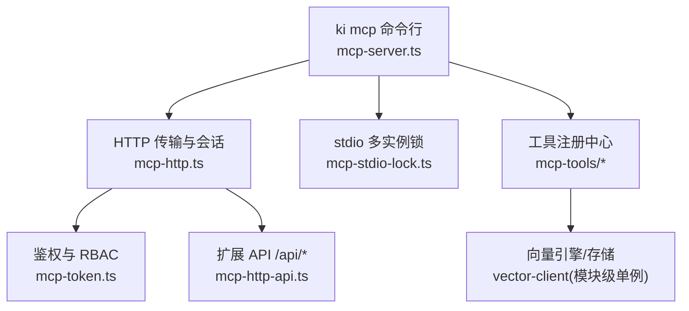
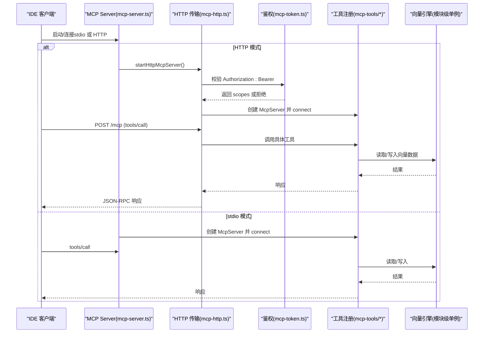
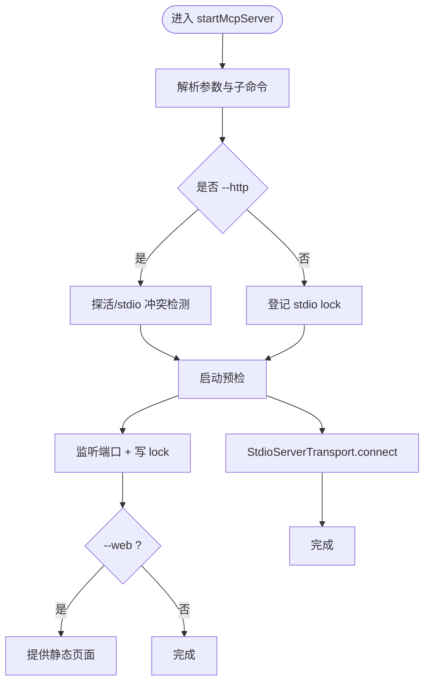
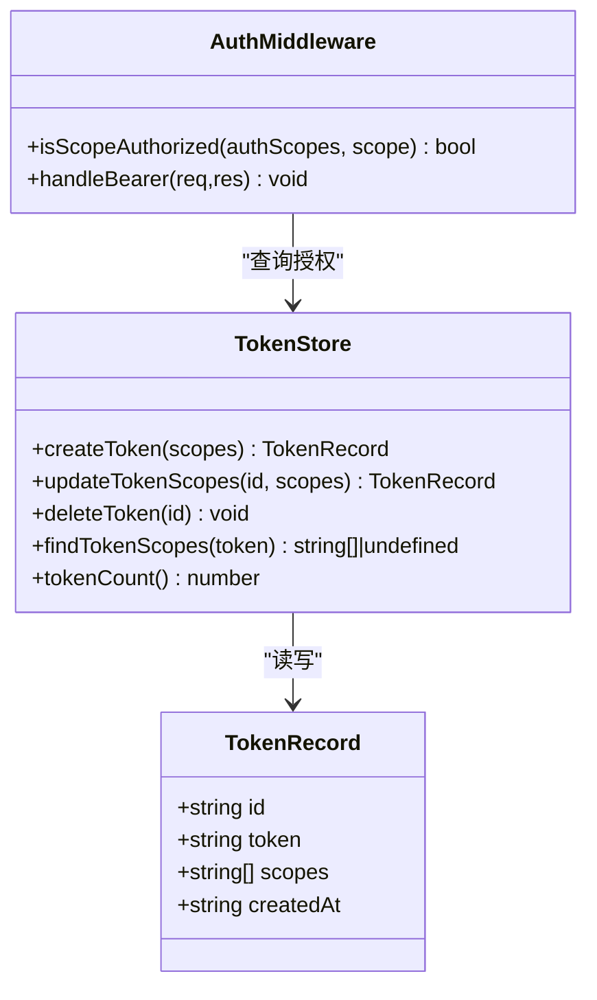
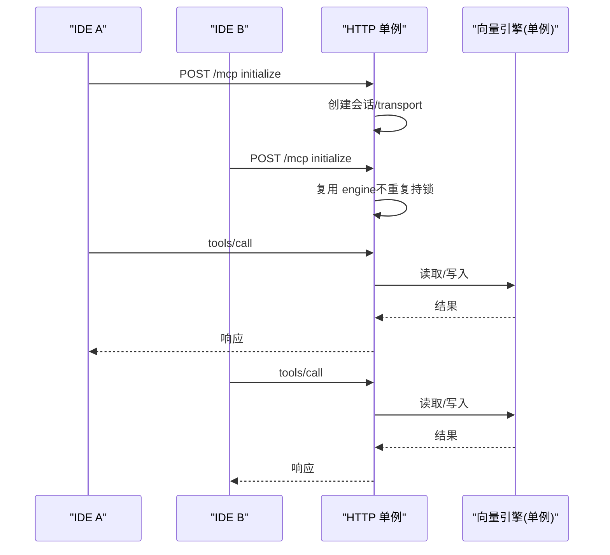
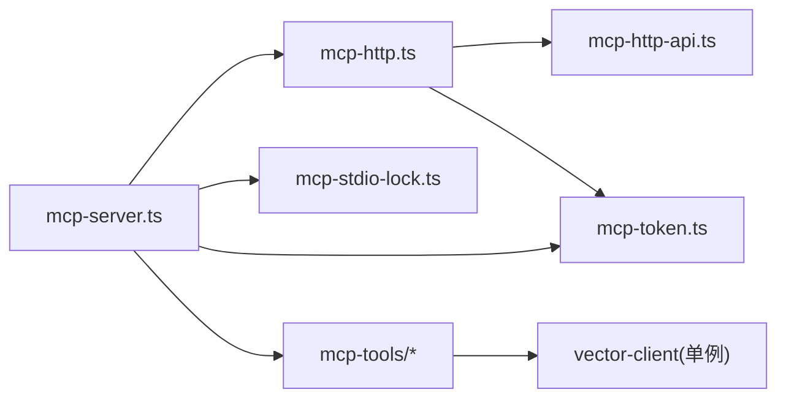

# MCP 集成指南

<cite>
**本文引用的文件**
- [mcp-server.ts](file://src/mcp-server.ts)
- [mcp-http.ts](file://src/lib/mcp-http.ts)
- [mcp-token.ts](file://src/lib/mcp-token.ts)
- [mcp-stdio-lock.ts](file://src/lib/mcp-stdio-lock.ts)
- [mcp-http-api.ts](file://src/lib/mcp-http-api.ts)
- [query-group.ts](file://src/lib/mcp-tools/query-group.ts)
- [search.ts](file://src/lib/mcp-tools/search.ts)
- [store.ts](file://src/lib/mcp-tools/store.ts)
- [manage-index.ts](file://src/lib/mcp-tools/manage-index.ts)
- [sync-relation.ts](file://src/lib/mcp-tools/sync-relation.ts)
- [bulk-store.ts](file://src/lib/mcp-tools/bulk-store.ts)
- [delete-relation.ts](file://src/lib/mcp-tools/delete-relation.ts)
- [scope-list.ts](file://src/lib/mcp-tools/scope-list.ts)
- [tag-list.ts](file://src/lib/mcp-tools/tag-list.ts)
- [mcp-http.md](file://docs/mcp-http.md)
</cite>

## 目录
1. [简介](#简介)
2. [项目结构](#项目结构)
3. [核心组件](#核心组件)
4. [架构总览](#架构总览)
5. [详细组件分析](#详细组件分析)
6. [依赖关系分析](#依赖关系分析)
7. [性能与并发](#性能与并发)
8. [故障排查](#故障排查)
9. [结论](#结论)
10. [附录：11 个 MCP 工具接口规范](#附录11-个-mcp-工具接口规范)

## 简介
本指南面向需要在多 IDE、跨机环境中接入 kisearch MCP（Model Context Protocol）的工程师，覆盖协议基础、服务器启动方式（stdio/HTTP）、安全认证（Token 与 scope RBAC）、客户端配置方法、HTTP 共享单例模式、多 IDE 接入方案、跨机访问安全配置、常见集成问题与性能优化建议。文档同时给出暴露的 11 个 MCP 工具的接口规范、参数说明与使用示例路径。

## 项目结构
- 服务入口与命令路由：负责解析 CLI 参数、选择 stdio 或 HTTP 模式、管理守护进程与锁、执行预检与启动。
- HTTP 传输与会话：基于 StreamableHTTPServerTransport，实现鉴权、会话生命周期、空闲回收、静态页面与扩展 API。
- Token 与授权：多 Token 存储、scope 解析与校验、RBAC 越权拦截。
- 工具注册：按功能模块注册 MCP 工具，统一超时与错误包装。
- 辅助能力：stdio 多实例 lock、健康检查、版本守卫等。

**图表来源**
- [mcp-server.ts:54-70](file://src/mcp-server.ts#L54-L70)
- [mcp-http.ts:363-641](file://src/lib/mcp-http.ts#L363-L641)
- [mcp-token.ts:47-50](file://src/lib/mcp-token.ts#L47-L50)
- [mcp-stdio-lock.ts:118-144](file://src/lib/mcp-stdio-lock.ts#L118-L144)
- [mcp-http-api.ts:216-271](file://src/lib/mcp-http-api.ts#L216-L271)

**章节来源**
- [mcp-server.ts:492-734](file://src/mcp-server.ts#L492-L734)
- [mcp-http.ts:1-15](file://src/lib/mcp-http.ts#L1-L15)

## 核心组件
- 服务构建器：buildKiMcpServer 统一注册全部 MCP 工具，支持按会话 authScopes 过滤枚举类工具输出。
- HTTP 应用：createMcpHttpServer 提供鉴权、会话管理、空闲回收、静态页面与扩展 API；startHttpMcpServer 实现幂等单例守护。
- Token 系统：多 Token 存储、短 ID、强随机 Token、scope 解析与校验、原子写回。
- stdio 锁：每实例独立 lock 文件，支持多实例登记、陈旧锁清理、stop/restart/status 定位。
- 扩展 API：/api/health、/api/doc/list、/api/import/* 等，补齐可视化前端能力。

**章节来源**
- [mcp-server.ts:54-70](file://src/mcp-server.ts#L54-L70)
- [mcp-http.ts:363-641](file://src/lib/mcp-http.ts#L363-L641)
- [mcp-token.ts:156-265](file://src/lib/mcp-token.ts#L156-L265)
- [mcp-stdio-lock.ts:100-154](file://src/lib/mcp-stdio-lock.ts#L100-L154)
- [mcp-http-api.ts:216-271](file://src/lib/mcp-http-api.ts#L216-L271)

## 架构总览
MCP 服务以“单进程持锁”为核心设计：HTTP 模式下所有 IDE 通过 URL 连接同一进程，避免向量库锁冲突；stdio 模式默认单客户端单进程，但允许多实例错开共享向量库（空闲释放 + 撞锁重试）。

**图表来源**
- [mcp-server.ts:687-734](file://src/mcp-server.ts#L687-L734)
- [mcp-http.ts:476-612](file://src/lib/mcp-http.ts#L476-L612)
- [mcp-token.ts:245-259](file://src/lib/mcp-token.ts#L245-L259)

## 详细组件分析

### 服务器启动与模式切换（stdio/HTTP）
- 入口 startMcpServer 解析参数，区分子命令（token、restart、stop、status），处理帮助与未知参数。
- HTTP 模式：先探活已有健康实例复用；检测 stdio 冲突；启动预检；listen；写 lock；可选 --web 提供静态页面。
- stdio 模式：登记自身 lock；启动预检；建立 StdioServerTransport；关闭时释放 engine。

**图表来源**
- [mcp-server.ts:492-734](file://src/mcp-server.ts#L492-L734)
- [mcp-http.ts:711-767](file://src/lib/mcp-http.ts#L711-L767)

**章节来源**
- [mcp-server.ts:492-734](file://src/mcp-server.ts#L492-L734)
- [mcp-http.ts:711-767](file://src/lib/mcp-http.ts#L711-L767)

### 安全认证机制（Token 管理与 RBAC）
- 条件鉴权：回环绑定免鉴权；非回环强制 Bearer Token。
- Token 来源优先级：--token/KI_MCP_TOKEN（全权临时）> 多 Token 存储（~/.ki/mcp-tokens.json）。
- RBAC：对 tools/call 的 arguments.scope 做越权校验；枚举工具（ki_scope_list、ki_manage_index_list）由工具层按授权集合过滤输出。
- 存储：原子写回（临时文件 + rename），权限 0600；严格读取损坏文件时报错。

**图表来源**
- [mcp-token.ts:25-35](file://src/lib/mcp-token.ts#L25-L35)
- [mcp-token.ts:183-265](file://src/lib/mcp-token.ts#L183-L265)
- [mcp-http.ts:476-510](file://src/lib/mcp-http.ts#L476-L510)

**章节来源**
- [mcp-token.ts:47-50](file://src/lib/mcp-token.ts#L47-L50)
- [mcp-token.ts:156-265](file://src/lib/mcp-token.ts#L156-L265)
- [mcp-http.ts:476-510](file://src/lib/mcp-http.ts#L476-L510)

### HTTP 共享单例模式与多 IDE 接入
- 幂等单例：重复运行会探活命中健康实例后直接复用退出。
- 会话模型：每个 initialize 新建 transport + McpServer，共享 vector-client 单例 engine；会话上限与空闲回收保护资源。
- 多 IDE 接入：所有 IDE 使用完全一致的 URL（host/port 一致），避免各自拉起进程导致锁冲突。
- 后台常驻：--daemon 后台运行；restart 一键重启（保留上次 host/port/web 配置）。

**图表来源**
- [mcp-http.ts:563-612](file://src/lib/mcp-http.ts#L563-L612)
- [mcp-http.ts:711-767](file://src/lib/mcp-http.ts#L711-L767)

**章节来源**
- [mcp-http.md:147-157](file://docs/mcp-http.md#L147-L157)
- [mcp-http.ts:563-612](file://src/lib/mcp-http.ts#L563-L612)

### 跨机访问安全配置
- 非回环绑定必须鉴权；推荐前置 TLS 反向代理。
- 可配置 allowedHosts 缓解 DNS rebinding。
- Token 泄露处置：立即删除或缩小 scope。

**章节来源**
- [mcp-http.md:243-247](file://docs/mcp-http.md#L243-L247)
- [mcp-http.ts:762-767](file://src/lib/mcp-http.ts#L762-L767)

## 依赖关系分析
- mcp-server.ts 依赖 mcp-http.ts（HTTP 模式）、mcp-stdio-lock.ts（stdio 多实例锁）、mcp-token.ts（鉴权）、各工具注册器。
- mcp-http.ts 依赖 mcp-token.ts（鉴权）、mcp-http-api.ts（扩展 API）、vector-client（引擎单例）。
- 工具模块依赖各自业务逻辑（如 search、store、sync-relation 等）与 util（超时封装）。

**图表来源**
- [mcp-server.ts:5-23](file://src/mcp-server.ts#L5-L23)
- [mcp-http.ts:17-28](file://src/lib/mcp-http.ts#L17-L28)
- [mcp-http-api.ts:18-29](file://src/lib/mcp-http-api.ts#L18-L29)

**章节来源**
- [mcp-server.ts:5-23](file://src/mcp-server.ts#L5-L23)
- [mcp-http.ts:17-28](file://src/lib/mcp-http.ts#L17-L28)

## 性能与并发
- 向量引擎单例：所有会话共享同一 engine，减少锁竞争与初始化开销。
- 会话上限与空闲回收：默认最大 256 会话，30 分钟无活动自动回收，防止内存泄漏。
- 工具超时：读/写/批量操作分别设置超时，避免长任务阻塞。
- 导入 Job 限流：内存 Map 限制最大 job 数与 TTL，避免无界增长。

**章节来源**
- [mcp-http.ts:47-54](file://src/lib/mcp-http.ts#L47-L54)
- [mcp-http.ts:571-582](file://src/lib/mcp-http.ts#L571-L582)
- [mcp-http-api.ts:63-66](file://src/lib/mcp-http-api.ts#L63-L66)
- [mcp-tools/util.ts](file://src/lib/mcp-tools/util.ts)

## 故障排查
- 鉴权失败（401）：检查 Authorization: Bearer 是否与 ki mcp token list 输出一致；服务端 stderr 有失败原因。
- 越权拒绝（403）：确认请求 scope 在 Token 授权范围内；枚举工具无参不受此校验。
- 端口占用：EADDRINUSE 且未探活到健康实例，需更换端口或排查占用进程。
- stdio 与 HTTP 冲突：检测到存活 stdio 实例时拒绝启动 HTTP，需迁移 IDE 为 URL 型接入。
- 一键关闭：ki mcp stop 可关闭所有实例并清理 lock。

**章节来源**
- [mcp-http.md:224-233](file://docs/mcp-http.md#L224-L233)
- [mcp-http.ts:644-665](file://src/lib/mcp-http.ts#L644-L665)
- [mcp-server.ts:609-658](file://src/mcp-server.ts#L609-L658)

## 结论
kisearch MCP 通过 HTTP 共享单例模式从根本上解决多 IDE 向量库锁冲突，结合条件鉴权与 RBAC 保障安全边界；stdio 模式仍支持多实例错开共享。通过完善的 CLI、状态诊断与优雅退出机制，便于运维与排障。建议生产环境使用 HTTP + TLS 反代 + 最小 scope 授权策略。

## 附录：11 个 MCP 工具接口规范
以下列出 11 个 MCP 工具的名称、用途、关键参数与返回值要点。参数定义与类型以各工具注册器为准。

1) ki_query_group
- 用途：查询 Group 树 + Relations + 词云，支持向量语义兜底
- 关键参数：scope、groups/group、hot_count、depth、mode、auto_fallback
- 返回：文本内容（结构化输出）
- 参考路径：[query-group.ts:6-53](file://src/lib/mcp-tools/query-group.ts#L6-L53)

2) ki_search
- 用途：语义检索知识库内容
- 关键参数：scope、query、limit、threshold、tags、include_original
- 返回：JSON 字符串（搜索结果）
- 参考路径：[search.ts:6-49](file://src/lib/mcp-tools/search.ts#L6-L49)

3) ki_store
- 用途：存储文本到向量索引
- 关键参数：scope、text、tags
- 返回：JSON 字符串（写入结果）
- 参考路径：[store.ts:6-43](file://src/lib/mcp-tools/store.ts#L6-L43)

4) ki_bulk_store
- 用途：批量存储文本到向量索引
- 关键参数：scope、input（JSON 文件路径）
- 返回：JSON 字符串（批量结果）
- 参考路径：[bulk-store.ts:6-41](file://src/lib/mcp-tools/bulk-store.ts#L6-L41)

5) ki_sync_relation
- 用途：写入/更新 Relation + 本地 KB（自动补建 Group 树）
- 关键参数：scope、group、relation、module_info、vector、tags
- 返回：JSON 字符串（同步结果）
- 参考路径：[sync-relation.ts:6-43](file://src/lib/mcp-tools/sync-relation.ts#L6-L43)

6) ki_delete_relation
- 用途：删除 Relation 及其关联数据（relations-cache + 本地KB + wiki + 向量）
- 关键参数：scope、group、relation
- 返回：JSON 字符串（删除结果）
- 参考路径：[delete-relation.ts:6-37](file://src/lib/mcp-tools/delete-relation.ts#L6-L37)

7) ki_get_module_info
- 用途：读取指定 Group 下某个 Relation 的本地 KB Markdown 内容
- 关键参数：scope、group、relation
- 返回：JSON 字符串（Markdown 内容）
- 参考路径：[get-module-info.ts:6-37](file://src/lib/mcp-tools/get-module-info.ts#L6-L37)

8) ki_manage_index_create
- 用途：在 Group 树中创建新节点（scope 不存在则自动创建）
- 关键参数：scope、name、parent
- 返回：JSON 字符串（创建结果）
- 参考路径：[manage-index.ts:14-44](file://src/lib/mcp-tools/manage-index.ts#L14-L44)

9) ki_manage_index_list
- 用途：列出所有 scope（含已注册但未初始化的）及其顶层 Group，带 registered/initialized 标注
- 关键参数：无（受 RBAC 过滤）
- 返回：JSON 字符串（scope 列表）
- 参考路径：[manage-index.ts:46-71](file://src/lib/mcp-tools/manage-index.ts#L46-L71)

10) ki_manage_index_delete
- 用途：删除 Group 树中的空节点（仅限无子节点、无 relation、无本地 KB 的节点）
- 关键参数：scope、name、parent
- 返回：JSON 字符串（删除结果）
- 参考路径：[manage-index.ts:73-111](file://src/lib/mcp-tools/manage-index.ts#L73-L111)

11) ki_scope_list
- 用途：列出所有 scope（KB 目录层 + 向量语义层并集，标注存在性与注册状态）
- 关键参数：无（受 RBAC 过滤）
- 返回：JSON 字符串（scope 列表）
- 参考路径：[scope-list.ts:11-41](file://src/lib/mcp-tools/scope-list.ts#L11-L41)

补充工具（只读）：
- ki_tag_list：列出指定 scope 下用过的 tag（含文档数，按数量降序）
- 参考路径：[tag-list.ts:6-37](file://src/lib/mcp-tools/tag-list.ts#L6-L37)

**章节来源**
- [query-group.ts:6-53](file://src/lib/mcp-tools/query-group.ts#L6-L53)
- [search.ts:6-49](file://src/lib/mcp-tools/search.ts#L6-L49)
- [store.ts:6-43](file://src/lib/mcp-tools/store.ts#L6-L43)
- [bulk-store.ts:6-41](file://src/lib/mcp-tools/bulk-store.ts#L6-L41)
- [sync-relation.ts:6-43](file://src/lib/mcp-tools/sync-relation.ts#L6-L43)
- [delete-relation.ts:6-37](file://src/lib/mcp-tools/delete-relation.ts#L6-L37)
- [get-module-info.ts:6-37](file://src/lib/mcp-tools/get-module-info.ts#L6-L37)
- [manage-index.ts:14-111](file://src/lib/mcp-tools/manage-index.ts#L14-L111)
- [scope-list.ts:11-41](file://src/lib/mcp-tools/scope-list.ts#L11-L41)
- [tag-list.ts:6-37](file://src/lib/mcp-tools/tag-list.ts#L6-L37)