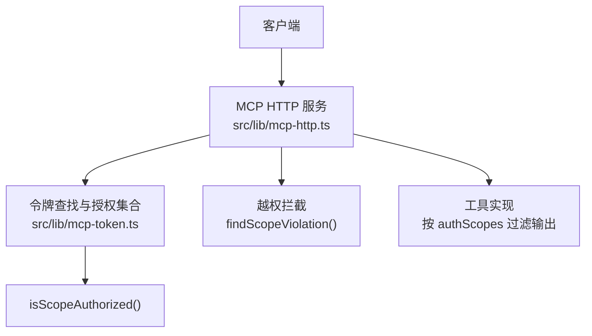
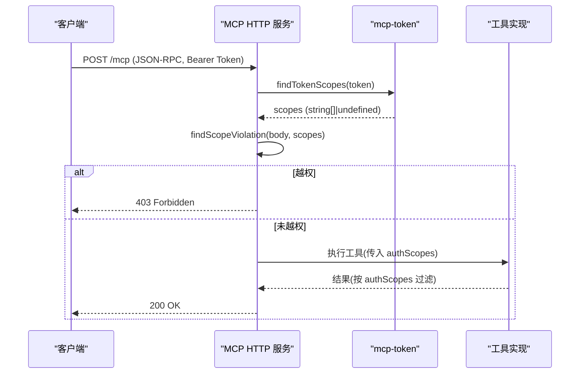
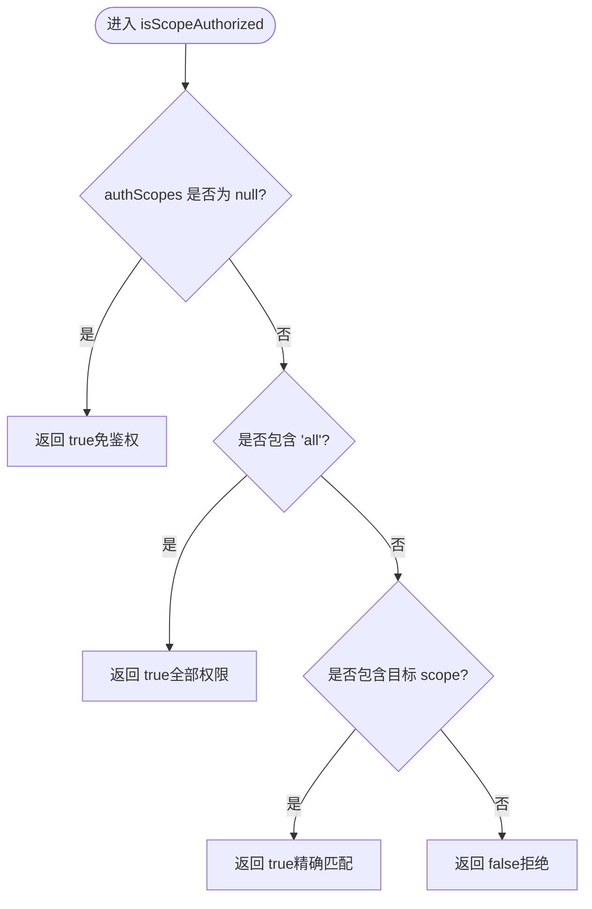
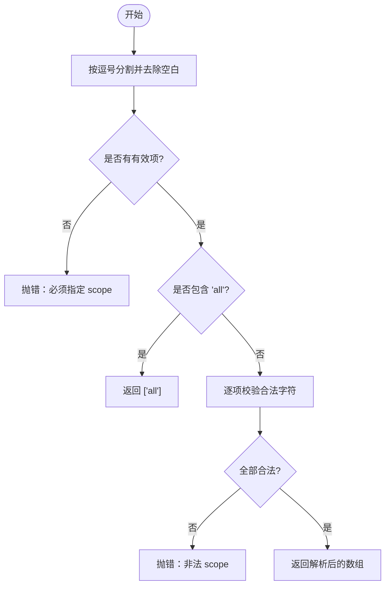
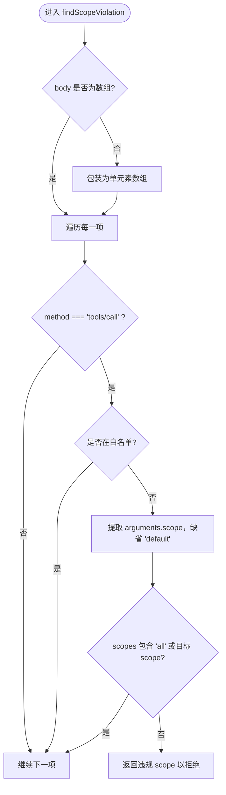
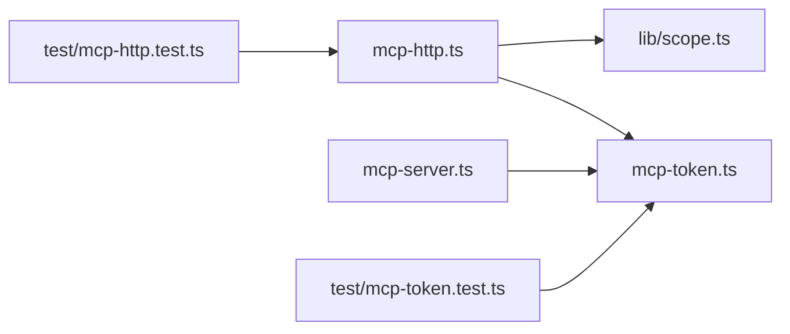

# Scope 授权机制

<cite>
**本文引用的文件**
- [src/lib/mcp-token.ts](file://src/lib/mcp-token.ts)
- [src/lib/scope.ts](file://src/lib/scope.ts)
- [src/lib/mcp-http.ts](file://src/lib/mcp-http.ts)
- [src/mcp-server.ts](file://src/mcp-server.ts)
- [test/mcp-token.test.ts](file://test/mcp-token.test.ts)
- [test/mcp-http.test.ts](file://test/mcp-http.test.ts)
</cite>

## 目录
1. [简介](#简介)
2. [项目结构](#项目结构)
3. [核心组件](#核心组件)
4. [架构总览](#架构总览)
5. [详细组件分析](#详细组件分析)
6. [依赖关系分析](#依赖关系分析)
7. [性能与安全考量](#性能与安全考量)
8. [故障排查指南](#故障排查指南)
9. [结论](#结论)
10. [附录：配置与测试示例](#附录配置与测试示例)

## 简介
本文件系统性说明 MCP 中的 Scope 授权机制，聚焦 RBAC（基于角色的访问控制）模型在 MCP 工具调用链中的应用。重点包括：
- scope 概念、授权集合与权限验证流程
- isScopeAuthorized 的授权判定逻辑（null 免鉴权、['all'] 全部权限、具体 scope 列表精确匹配）
- resolveScopesArg 支持的 scope 语法（单个、多个逗号分隔、'all' 保留字）
- scope 命名规范、非法 scope 处理与安全校验规则
- 实际授权配置示例与权限测试方法

## 项目结构
与 Scope 授权相关的关键代码分布在以下模块：
- 令牌与授权核心：src/lib/mcp-token.ts（Token 存储、解析、查找、授权判定）
- Scope 校验与路径构造：src/lib/scope.ts（scope 合法性校验、KB 路径构造）
- HTTP 层鉴权与越权拦截：src/lib/mcp-http.ts（提取请求 scope、批量校验、返回 403）
- CLI Token 管理入口：src/mcp-server.ts（ki mcp token generate/list/update/delete）
- 单元测试：test/mcp-token.test.ts、test/mcp-http.test.ts（覆盖解析、授权、HTTP 越权拦截）

图表来源
- [src/lib/mcp-http.ts:112-139](file://src/lib/mcp-http.ts#L112-L139)
- [src/lib/mcp-token.ts:43-50](file://src/lib/mcp-token.ts#L43-L50)

章节来源
- [src/lib/mcp-token.ts:1-265](file://src/lib/mcp-token.ts#L1-L265)
- [src/lib/scope.ts:1-230](file://src/lib/scope.ts#L1-L230)
- [src/lib/mcp-http.ts:100-299](file://src/lib/mcp-http.ts#L100-L299)
- [src/mcp-server.ts:214-258](file://src/mcp-server.ts#L214-L258)

## 核心组件
- 授权判定函数 isScopeAuthorized：根据 Token 的授权集合判断是否允许访问指定 scope
- 参数解析函数 resolveScopesArg：将命令行/配置中的 scope 字符串解析为授权集合
- HTTP 越权拦截 findScopeViolation：从 JSON-RPC 请求体中提取每个 tools/call 的 scope，并统一校验
- Scope 校验 validateScope：限制 scope 字符集，防止路径穿越等注入风险
- Token 存储与查找：持久化多 Token + 授权 scope，支持安全读取与常量时间比较

章节来源
- [src/lib/mcp-token.ts:43-95](file://src/lib/mcp-token.ts#L43-L95)
- [src/lib/scope.ts:26-43](file://src/lib/scope.ts#L26-L43)
- [src/lib/mcp-http.ts:112-139](file://src/lib/mcp-http.ts#L112-L139)

## 架构总览
RBAC 在 MCP 中的落地方式：
- 认证阶段：通过 Bearer Token 或进程级 --token 获取授权 scope 集合
- 授权阶段：对每个 tools/call 请求，提取 arguments.scope（缺省 'default'），用 isScopeAuthorized 判定
- 白名单工具：部分枚举类工具不携带 scope 参数，由工具层依据 authScopes 过滤输出
- 失败处理：越权时返回 403，并在服务端日志记录越权信息（不包含敏感 scope 名）

图表来源
- [src/lib/mcp-http.ts:112-139](file://src/lib/mcp-http.ts#L112-L139)
- [src/lib/mcp-token.ts:240-259](file://src/lib/mcp-token.ts#L240-L259)
- [src/lib/mcp-http.ts:543-564](file://src/lib/mcp-http.ts#L543-L564)

## 详细组件分析

### isScopeAuthorized 授权逻辑
- 输入：authScopes（string[] | null）、scope（string）
- 规则：
  - null：表示免鉴权，直接放行
  - ['all']：通配所有 scope，直接放行
  - 具体 scope 列表：仅当列表包含目标 scope 时放行，否则拒绝
- 复杂度：O(n)，n 为授权集合长度；通常很小
- 适用场景：HTTP 层统一拦截、工具层输出过滤

图表来源
- [src/lib/mcp-token.ts:43-50](file://src/lib/mcp-token.ts#L43-L50)

章节来源
- [src/lib/mcp-token.ts:43-50](file://src/lib/mcp-token.ts#L43-L50)
- [test/mcp-token.test.ts:202-220](file://test/mcp-token.test.ts#L202-L220)

### resolveScopesArg 参数解析
- 支持语法：
  - 单个 scope：如 'team-a' → ['team-a']
  - 多个逗号分隔：如 'team-a, team-b' → ['team-a','team-b']
  - 保留字 'all'：归一化为 ['all']，忽略其余冗余值
- 错误处理：
  - 空字符串或空白：抛出错误，提示必须指定 scope
  - 非法字符：抛出错误，提示仅允许字母、数字、连字符(-)、下划线(_)
- 使用位置：CLI Token 管理命令（generate/list/update/delete）

图表来源
- [src/lib/mcp-token.ts:70-95](file://src/lib/mcp-token.ts#L70-L95)

章节来源
- [src/lib/mcp-token.ts:70-95](file://src/lib/mcp-token.ts#L70-L95)
- [src/mcp-server.ts:214-225](file://src/mcp-server.ts#L214-L225)
- [test/mcp-token.test.ts:68-92](file://test/mcp-token.test.ts#L68-L92)

### HTTP 层越权拦截 findScopeViolation
- 作用：遍历 JSON-RPC 请求体（含 batch 数组），逐个检查 tools/call 的 arguments.scope
- 缺省策略：若缺失或非法 arguments，等价于 scope='default'，参与校验，防止绕过
- 白名单工具：不含 scope 参数的枚举工具跳过此校验，交由工具层按 authScopes 过滤
- 越权响应：返回 403，服务端记录越权日志（不暴露具体 scope 名）

图表来源
- [src/lib/mcp-http.ts:112-139](file://src/lib/mcp-http.ts#L112-L139)
- [src/lib/mcp-http.ts:543-564](file://src/lib/mcp-http.ts#L543-L564)

章节来源
- [src/lib/mcp-http.ts:100-139](file://src/lib/mcp-http.ts#L100-L139)
- [src/lib/mcp-http.ts:543-564](file://src/lib/mcp-http.ts#L543-L564)
- [test/mcp-http.test.ts:449-478](file://test/mcp-http.test.ts#L449-L478)

### Scope 命名规范与安全校验
- 合法字符：字母、数字、连字符(-)、下划线(_)
- 非法处理：
  - 空 scope：抛出 EMPTY_SCOPE
  - 非法字符：抛出 INVALID_SCOPE，并列出非法字符
- 路径防护：validateScope 在所有 KB 路径构造前调用，天然阻止路径穿越
- 一致性：mcp-token.ts 与 lib/scope.ts 共用相同正则，确保解析与校验一致

章节来源
- [src/lib/scope.ts:26-43](file://src/lib/scope.ts#L26-L43)
- [src/lib/mcp-token.ts:37-41](file://src/lib/mcp-token.ts#L37-L41)

### Token 管理与查找
- 存储：~/.ki/mcp-tokens.json，0600 权限，原子写回（临时文件 + rename）
- 查找：findTokenScopes 使用常量时间比较避免时序侧信道
- 损坏保护：listTokensStrict 在文件损坏时抛错，防止静默覆盖导致数据丢失
- CLI：ki mcp token generate/list/update/delete 提供全生命周期管理

章节来源
- [src/lib/mcp-token.ts:97-176](file://src/lib/mcp-token.ts#L97-L176)
- [src/lib/mcp-token.ts:178-238](file://src/lib/mcp-token.ts#L178-L238)
- [src/lib/mcp-token.ts:240-265](file://src/lib/mcp-token.ts#L240-L265)

## 依赖关系分析
- mcp-http.ts 依赖 mcp-token.ts 进行 Token 查找与授权判定
- mcp-server.ts 通过 resolveScopesArg 解析 CLI 参数，调用 createToken 等管理接口
- lib/scope.ts 提供统一的 scope 校验与路径构造，被多处复用
- 测试用例覆盖解析、授权、HTTP 越权拦截等关键路径

图表来源
- [src/lib/mcp-http.ts:112-139](file://src/lib/mcp-http.ts#L112-L139)
- [src/mcp-server.ts:214-258](file://src/mcp-server.ts#L214-L258)
- [src/lib/scope.ts:26-43](file://src/lib/scope.ts#L26-L43)

章节来源
- [src/lib/mcp-http.ts:100-299](file://src/lib/mcp-http.ts#L100-L299)
- [src/mcp-server.ts:214-258](file://src/mcp-server.ts#L214-L258)
- [src/lib/scope.ts:1-230](file://src/lib/scope.ts#L1-L230)

## 性能与安全考量
- 性能：
  - isScopeAuthorized 为 O(n) 查找，n 通常为个位数，开销可忽略
  - findScopeViolation 遍历请求体，batch 模式下逐条校验，保证安全性
- 安全：
  - 常量时间比较避免时序攻击
  - 原子写回与损坏保护防止数据丢失
  - 严格 scope 字符集校验防止路径穿越
  - 越权日志不暴露具体 scope 名，避免枚举探测

[本节为通用指导，无需特定文件引用]

## 故障排查指南
- 常见错误：
  - 非法 scope：检查 scope 是否仅包含字母、数字、连字符、下划线
  - 未指定 scope：resolveScopesArg 要求显式指定，空串会抛错
  - Token 文件损坏：listTokensStrict 会抛错，需人工修复文件
- 定位方法：
  - 查看服务端 stderr 日志中的越权拦截信息
  - 使用 ki mcp token list 检查当前 Token 与授权 scope
  - 运行单元测试确认解析与授权逻辑

章节来源
- [src/lib/mcp-token.ts:132-147](file://src/lib/mcp-token.ts#L132-L147)
- [src/lib/mcp-http.ts:543-564](file://src/lib/mcp-http.ts#L543-L564)
- [test/mcp-token.test.ts:222-263](file://test/mcp-token.test.ts#L222-L263)

## 结论
MCP 的 Scope 授权机制通过 RBAC 模型实现了细粒度的资源访问控制。isScopeAuthorized 提供了简洁而强大的授权判定能力，resolveScopesArg 确保了参数解析的一致性与安全性。HTTP 层的统一拦截与工具层的输出过滤共同构成了纵深防御体系。配合严格的 scope 命名规范与安全的 Token 管理机制，系统在保证灵活性的同时，有效降低了越权风险。

[本节为总结性内容，无需特定文件引用]

## 附录：配置与测试示例

### 授权配置示例
- 生成带 scope 的 Token：
  - 单个 scope：ki mcp token generate --scope team-a
  - 多个 scope：ki mcp token generate --scope team-a,team-b
  - 全部权限：ki mcp token generate --scope all
- 修改 Token 授权：
  - ki mcp token update <id> --scope all
- 删除 Token：
  - ki mcp token delete <id>

章节来源
- [src/mcp-server.ts:227-258](file://src/mcp-server.ts#L227-L258)
- [bin/ki.mjs:105-127](file://bin/ki.mjs#L105-L127)

### 权限测试方法
- 单元测试覆盖：
  - resolveScopesArg：单个、多个、'all'、空串、非法字符
  - isScopeAuthorized：null、['all']、精确匹配、多 scope
  - HTTP 越权拦截：授权 scope 放行、未授权 scope 拒绝、'all' 通配
- 端到端测试：
  - 启动测试服务器，注入 resolveTokenScopes 模拟不同 Token 的授权集合
  - 调用 tools/call 并断言状态码（200/403）

章节来源
- [test/mcp-token.test.ts:68-92](file://test/mcp-token.test.ts#L68-L92)
- [test/mcp-token.test.ts:202-220](file://test/mcp-token.test.ts#L202-L220)
- [test/mcp-http.test.ts:449-478](file://test/mcp-http.test.ts#L449-L478)
- [test/mcp-http.test.ts:538-591](file://test/mcp-http.test.ts#L538-L591)